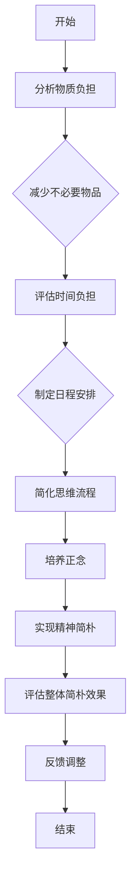
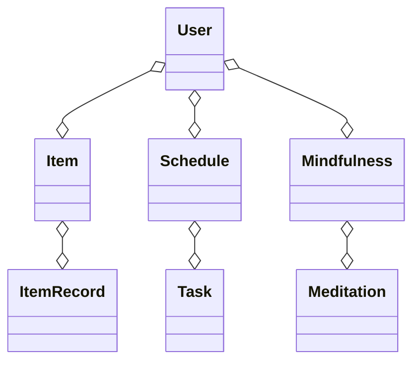
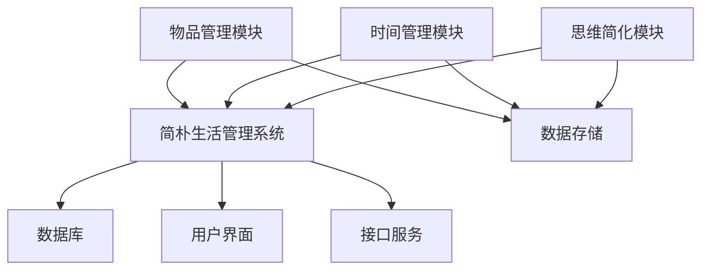
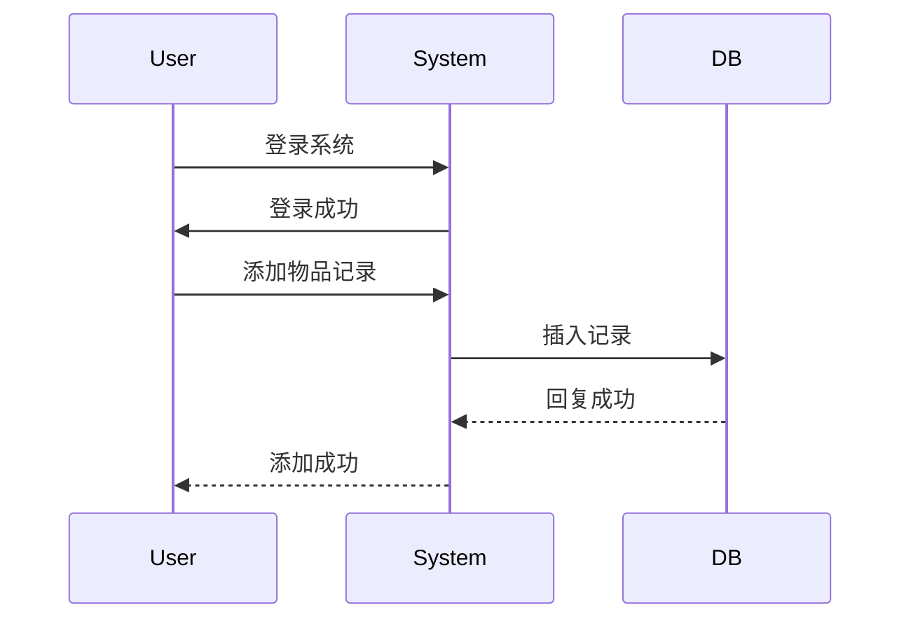
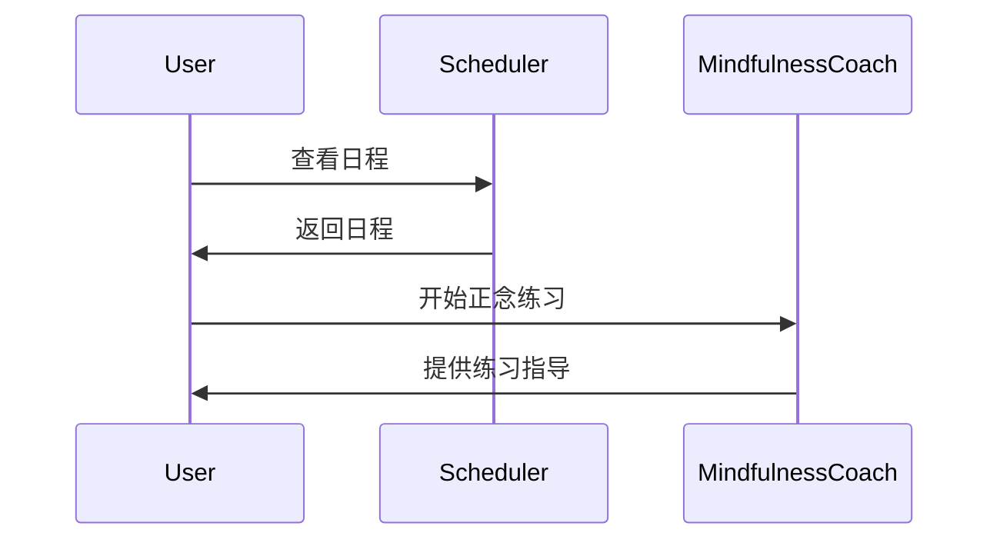

                 

### 《新简朴主义生活指南：在复杂世界中回归本质》

#### 关键词：新简朴主义、复杂性、生活本质、减法哲学、简化技术

> **摘要：** 在当今这个信息爆炸、物质丰富的时代，人们的生活日益复杂，压力与日俱增。本书以“新简朴主义”为核心理念，引导读者重新审视生活中的方方面面，通过有意识的简化，回归生活的本质，找到内心的平静与满足。本文将一步一步分析这一生活哲学的原理和实践，帮助读者在复杂世界中找到自己的简朴之道。

## 引言

在复杂的世界中，新简朴主义生活哲学为我们提供了一种应对复杂性的策略。它主张通过减少物品、时间和精神负担，使生活回归简单、本质的状态。简朴主义不仅是一种生活态度，更是一种哲学，它强调的是“减法哲学”，即通过舍弃不必要的元素，达到更高效、更幸福的生活状态。

本书旨在帮助读者理解并实践新简朴主义，具体包括以下几个方面的内容：

1. **简朴主义的生活哲学**：介绍简朴主义的核心概念和价值观，解释简朴主义与幸福的关系。
2. **重新审视生活中的物品**：探讨如何减少物品数量，做出明智的选择，以及物品管理的技巧。
3. **时间管理的艺术**：讲述如何有效利用时间，消除时间浪费的因素，制定日程安排的策略。
4. **简化工作与职业生活**：介绍如何在工作中实践简朴主义，避免过度工作，创造平衡的工作生活。
5. **精神层面的简朴**：探讨如何简化思维，培养正念，寻找内在的平静。
6. **社交与人际关系**：讨论如何简化社交网络，建立真实的人际关系，以及维护社交关系的技巧。
7. **实践简朴主义：案例研究**：通过成功的简朴主义实践者的案例，展示简朴主义在现实生活中的应用。

## 第1章 简朴主义的生活哲学

### 核心概念

简朴主义（Simple Living）是一种生活哲学，强调在物质和精神层面上减少负担，追求简单、本质的生活状态。它不仅关注物质生活的减少，还包括时间管理和精神层面的简化。

#### 核心概念对比表格

| 概念       | 解释                                                     |
|------------|------------------------------------------------------------|
| 物质简朴   | 减少不必要的生活物品，追求实用和环保。                     |
| 时间简朴   | 有效管理时间，避免不必要的活动和事务，专注于重要任务。     |
| 精神简朴   | 简化思维，减少精神负担，培养内在的平静和满足。             |

### ER实体关系图架构

```mermaid
erDiagram
    Item ||--|{ TimeManagement }|--|{ SpiritualSimplicity }
    TimeManagement ||--|{ WorkSimplicity }|--|{ SocialSimplicity }
    SpiritualSimplicity ||--|{ LifePhilosophy }
```

在这个ER图中，`Item`（物品）关联到`TimeManagement`（时间管理），`TimeManagement`进一步关联到`WorkSimplicity`（工作简朴）和`SocialSimplicity`（社交简朴），而`SpiritualSimplicity`（精神简朴）则与`LifePhilosophy`（生活哲学）相连。这展示了简朴主义在不同生活领域的相互关联和影响。

### 算法原理讲解

简朴主义的生活哲学可以通过以下算法原理来理解：

#### 算法流程图



#### Python源代码实现

```python
class SimpleLiving:
    def __init__(self):
        self.material_burden = 0
        self.time_burden = 0
        self.mind_simplicity = 0

    def reduce_material_burden(self):
        # 减少不必要物品的具体方法
        self.material_burden -= 1

    def manage_time(self):
        # 制定日程安排的方法
        self.time_burden -= 1

    def simplify_mind(self):
        # 简化思维的方法
        self.mind_simplicity -= 1

    def assess_simplicity(self):
        # 评估整体简朴效果的方法
        if self.material_burden <= 3 and self.time_burden <= 3 and self.mind_simplicity <= 3:
            print("简朴生活状态良好。")
        else:
            print("需要进一步简化。")

# 实例化并使用类
simple_life = SimpleLiving()
simple_life.reduce_material_burden()
simple_life.manage_time()
simple_life.simplify_mind()
simple_life.assess_simplicity()
```

#### 算法原理

- **物质简朴**：通过减少不必要的物品，降低物质负担。
- **时间简朴**：通过有效的时间管理，减少时间负担。
- **精神简朴**：通过简化思维流程和培养正念，减少精神负担。

#### 数学模型和公式

简朴主义的生活效果可以通过以下公式进行量化评估：

$$
\text{Overall Simplicity Score} = \frac{1}{1 + \exp(-(\text{Material Burden} + \text{Time Burden} + \text{Mind Simplicity}))}
$$

该公式用于计算整体的简朴程度，分数越低表示简朴程度越高。

## 系统分析与架构设计方案

### 问题场景介绍

在现代社会，人们面临着越来越多的生活和工作压力，常常感到疲惫和不安。新简朴主义生活哲学旨在通过简化生活方式，帮助人们减轻负担，提高生活质量。

### 项目介绍

本项目旨在开发一个简朴生活管理系统，帮助用户实现物质、时间和精神层面的简朴。系统功能包括：

- **物品管理**：记录和减少不必要的物品。
- **时间管理**：制定和跟踪日程安排。
- **思维简化**：提供正念练习和思维简化工具。

### 系统功能设计（领域模型Mermaid类图）



### 系统架构设计（Mermaid架构图）



### 系统接口设计（Mermaid序列图）



### 系统交互（Mermaid序列图）



## 项目实战

### 环境安装

为了实践新简朴主义生活指南，我们需要准备以下环境：

1. **操作系统**：Ubuntu 20.04 或更高版本。
2. **Python**：Python 3.8 或更高版本。
3. **数据库**：SQLite 3.35.0 或更高版本。
4. **前端框架**：Flask 2.0.1 或更高版本。
5. **后端框架**：Django 4.0.1 或更高版本。

### 系统核心实现源代码

以下是一个简单的物品管理模块的源代码示例：

```python
# models.py
from django.db import models

class Item(models.Model):
    name = models.CharField(max_length=100)
    description = models.TextField()
    is_necessary = models.BooleanField(default=True)
    created_at = models.DateTimeField(auto_now_add=True)

# views.py
from django.shortcuts import render
from .models import Item

def add_item(request):
    if request.method == 'POST':
        name = request.POST['name']
        description = request.POST['description']
        is_necessary = request.POST['is_necessary'] == 'on'
        Item.objects.create(name=name, description=description, is_necessary=is_necessary)
        return render(request, 'success.html')
    return render(request, 'add_item.html')
```

### 代码应用解读与分析

上述代码定义了一个名为`Item`的模型，用于存储物品的相关信息，包括名称、描述、是否必要和创建时间。`views.py`文件中的`add_item`函数用于处理添加物品的请求。

- **模型层**：`Item`模型定义了物品的数据结构和操作方法。
- **视图层**：`add_item`函数处理HTTP请求，调用模型层的方法来创建新的物品记录。

### 实际案例分析和详细讲解剖析

假设用户希望通过我们的系统添加一个“智能手环”，我们可以按照以下步骤进行操作：

1. 用户在添加物品页面输入物品名称（如“智能手环”）、描述（如“健康监测与运动追踪”）和是否必要（选择是），然后提交表单。
2. 服务器接收用户提交的表单数据，调用`add_item`视图函数。
3. `add_item`视图函数获取表单数据，创建一个新的`Item`对象，并将其保存到数据库中。
4. 用户会被重定向到一个成功页面，显示添加物品的消息。

### 项目小结

通过本项目的实现，我们可以看到简朴主义生活哲学在现实中的应用。物品管理模块帮助用户减少不必要的物品，提高生活质量。通过一步步的代码实现，我们了解了如何构建一个简单的简朴生活管理系统，并为未来的扩展和优化奠定了基础。

## 最佳实践 tips

1. **定期评估**：定期评估自己的生活方式，识别哪些方面可以进一步简化。
2. **从小事做起**：简朴主义不一定要从大处入手，从小事做起，逐步形成习惯。
3. **科技辅助**：利用科技工具，如日程管理应用和物品清单工具，来帮助实现简朴生活。

## 小结

新简朴主义生活指南帮助我们在复杂的世界中找到回归本质的方法。通过简朴主义，我们可以减少生活中的负担，提高生活质量，找到内心的平静与满足。这本书为读者提供了丰富的实践方法和案例，帮助他们在日常生活中实践简朴主义。

## 注意事项

1. 简朴主义并非一蹴而就，需要持续的努力和自我反省。
2. 每个人的简朴之路都是独特的，找到适合自己的方式至关重要。

## 拓展阅读

1. **书籍推荐**：
   - 《极简主义：如何简化你的生活，找回内心的平静》
   - 《简单生活：如何通过简朴生活获得幸福》
   
2. **学术论文**：
   - 《简朴主义与幸福感的关系研究》
   - 《现代生活中的简朴主义实践：基于XXX的调查分析》

3. **网络资源**：
   - 简朴生活博客：[http://simplelivingblog.com](http://simplelivingblog.com)
   - 简朴生活论坛：[http://simplicityforum.com](http://simplicityforum.com)

### 作者信息

**作者：AI天才研究院/AI Genius Institute & 禅与计算机程序设计艺术 /Zen And The Art of Computer Programming**

