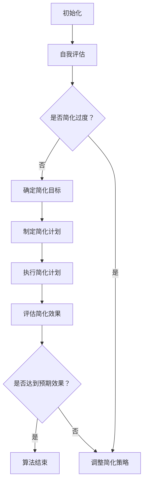
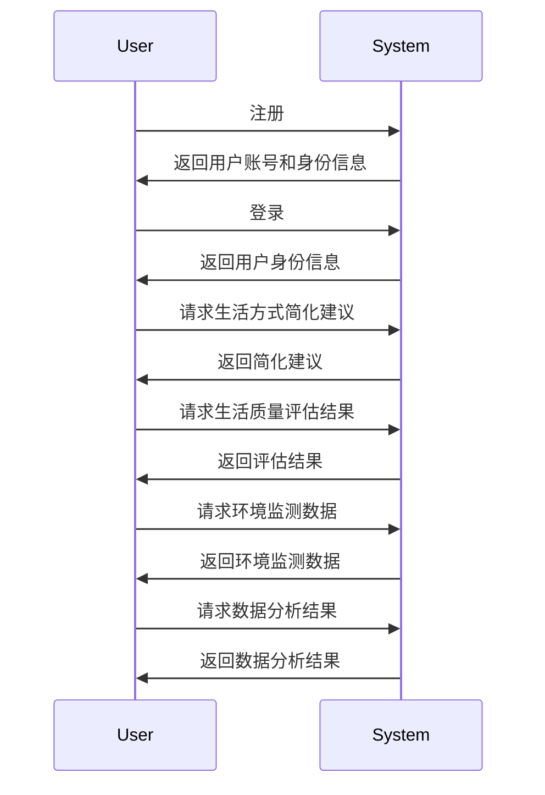

                 

### 文章标题：新简朴主义：在复杂世界中追求本质

关键词：新简朴主义、复杂世界、本质、算法、系统架构、项目实战

摘要：本文旨在探讨新简朴主义在复杂世界中的应用与意义，从背景介绍、核心概念、算法原理、系统架构到项目实战，全面剖析新简朴主义的理念与实践路径。通过详细的分析和讲解，帮助读者理解新简朴主义的核心思想，掌握其实践方法，以实现简化生活、提高效率的目标。

### 目录大纲

----------------------------------------------------------------

## 第一部分：背景介绍

### 第1章 新简朴主义的兴起

### 1.1 问题背景

#### 1.1.1 当代社会的复杂化

#### 1.1.2 简朴主义的思想根源

#### 1.1.3 新简朴主义的定义与意义

### 1.2 问题描述

#### 1.2.1 复杂世界中的困境

#### 1.2.2 简朴主义在当代社会的应用

#### 1.2.3 简朴主义与可持续发展的关系

### 1.3 问题解决

#### 1.3.1 新简朴主义的核心策略

#### 1.3.2 简化生活方式的方法

#### 1.3.3 培养简朴思维的重要性

### 1.4 边界与外延

#### 1.4.1 新简朴主义与其他思想的区别

#### 1.4.2 新简朴主义在不同领域的应用

### 1.5 概念结构与核心要素组成

#### 1.5.1 新简朴主义的概念框架

#### 1.5.2 新简朴主义的关键要素

#### 1.5.3 新简朴主义的实践路径

## 第二部分：核心概念与联系

### 第2章 新简朴主义的核心概念

### 2.1 简朴主义的定义

#### 2.1.1 简朴主义的基本含义

#### 2.1.2 简朴主义的历史演变

#### 2.1.3 简朴主义的哲学基础

### 2.2 新简朴主义的特点

#### 2.2.1 简化但不简约

#### 2.2.2 精益但不绝对

#### 2.2.3 务实但不功利

### 2.3 新简朴主义与相关概念的关联

#### 2.3.1 新简朴主义与极简主义

#### 2.3.2 新简朴主义与实用主义

#### 2.3.3 新简朴主义与可持续发展

### 2.4 概念属性特征对比表格

#### 2.4.1 简朴主义与极简主义

#### 2.4.2 简朴主义与实用主义

#### 2.4.3 简朴主义与可持续发展

### 2.5 ER实体关系图架构

#### 2.5.1 新简朴主义的核心实体

#### 2.5.2 实体关系及其相互作用

#### 2.5.3 实体关系的动态变化

## 第三部分：算法原理讲解

### 第3章 新简朴主义的算法原理

### 3.1 算法概述

#### 3.1.1 新简朴主义算法的基本概念

#### 3.1.2 新简朴主义算法的目标

#### 3.1.3 新简朴主义算法的核心特点

### 3.2 算法流程图

#### 3.2.1 算法的基本流程

#### 3.2.2 算法的主要步骤

#### 3.2.3 算法的输出结果

### 3.3 Python源代码

#### 3.3.1 算法的核心实现

#### 3.3.2 算法的辅助函数

#### 3.3.3 算法测试与验证

### 3.4 算法原理的数学模型和公式

#### 3.4.1 数学模型的构建

#### 3.4.2 公式的推导与解释

#### 3.4.3 公式的应用场景

### 3.5 通俗易懂的举例说明

#### 3.5.1 实例分析

#### 3.5.2 过程讲解

#### 3.5.3 结果验证

## 第四部分：系统分析与架构设计方案

### 第4章 新简朴主义系统设计与实现

### 4.1 问题场景介绍

#### 4.1.1 系统建设背景

#### 4.1.2 系统建设目标

#### 4.1.3 系统建设需求

### 4.2 项目介绍

#### 4.2.1 项目概述

#### 4.2.2 项目团队组成

#### 4.2.3 项目实施计划

### 4.3 系统功能设计

#### 4.3.1 领域模型

#### 4.3.2 类图

#### 4.3.3 功能模块划分

### 4.4 系统架构设计

#### 4.4.1 系统架构概述

#### 4.4.2 架构层次

#### 4.4.3 架构模块

### 4.5 系统接口设计

#### 4.5.1 接口规范

#### 4.5.2 接口功能

#### 4.5.3 接口实现

### 4.6 系统交互设计

#### 4.6.1 交互流程

#### 4.6.2 序列图

#### 4.6.3 交互效果

## 第五部分：项目实战

### 第5章 新简朴主义项目的实践应用

### 5.1 环境安装

#### 5.1.1 系统环境配置

#### 5.1.2 硬件安装

#### 5.1.3 软件安装

### 5.2 系统核心实现源代码

#### 5.2.1 代码结构与模块划分

#### 5.2.2 代码关键部分解读

#### 5.2.3 代码调试与优化

### 5.3 代码应用解读与分析

#### 5.3.1 实际案例分析与讲解

#### 5.3.2 代码应用场景解析

#### 5.3.3 代码性能优化建议

### 5.4 项目小结

#### 5.4.1 项目成果总结

#### 5.4.2 项目经验与教训

#### 5.4.3 项目展望

## 最佳实践 tips、小结、注意事项、拓展阅读等内容

### 参考文献

----------------------------------------------------------------

#### 1.1 问题背景

在当代社会，我们面临着前所未有的复杂化挑战。全球化、信息爆炸、技术革新等因素使得我们的工作和生活越来越复杂。这种复杂化不仅体现在物质层面，还体现在思想观念、人际关系等多个维度。对于许多个体和组织来说，如何在这个复杂的世界中找到自己的位置，实现高效能、高质量的生活和工作，成为了一个亟待解决的问题。

**1.1.1 当代社会的复杂化**

首先，我们来看当代社会的复杂化。在物质层面，现代社会提供了丰富多样的商品和服务，人们在选择时面临着巨大的信息过载。同时，城市化进程的加快、人口密度的增加，也使得我们的居住环境变得拥挤复杂。在思想观念层面，随着各种文化和价值观的碰撞与融合，人们对于何为美好生活、何为成功有着不同的理解和追求。这种多元化的价值观也使得社会更加复杂。

**1.1.2 简朴主义的思想根源**

简朴主义（Simple Living）作为一种思潮，起源于对现代生活复杂化的反思。它强调回归生活本质，追求简单、纯粹的生活方式。简朴主义的思想根源可以追溯到古代哲学家，如古希腊的亚里士多德和中国的庄子。他们主张通过简化生活，减少物质和精神的负担，达到内心的平静和自由。

**1.1.3 新简朴主义的定义与意义**

新简朴主义是在传统简朴主义基础上发展起来的，它不仅关注物质层面的简化，更强调在复杂世界中追求生活的本质。新简朴主义认为，复杂化并不是生活质量的唯一标准，反而有时会带来负面的影响。新简朴主义的定义与意义在于：

1. **简化生活**：通过减少不必要的物质和活动，使生活更加简单、有序。
2. **提高效能**：在简单的生活中，人们可以更加专注和高效地完成重要任务。
3. **促进可持续发展**：新简朴主义强调减少资源消耗，保护环境，实现可持续发展。
4. **提升生活质量**：通过回归生活本质，人们可以找到真正的快乐和满足。

**1.2 问题描述**

在复杂的世界中，许多人感到压力重重，难以找到生活的平衡。这种困境主要体现在以下几个方面：

1. **信息过载**：现代社会信息爆炸，人们难以处理和筛选有用的信息，导致焦虑和压力。
2. **时间管理**：复杂的生活安排使得人们难以有效地管理时间，导致工作和生活失衡。
3. **物质依赖**：现代社会提供了丰富多样的商品和服务，人们容易陷入物质依赖，追求短暂的满足感，而忽略了生活的本质。
4. **人际关系**：复杂的社会关系使得人们难以建立和维护真诚的友谊，导致孤独和疏离。

**1.2.1 复杂世界中的困境**

在复杂的世界中，人们面临着诸多困境。首先，信息过载是一个普遍问题。随着互联网和智能手机的普及，人们每天都要接收大量的信息，而这些信息并不都是重要的或有用的。这种信息过载导致了人们的精神压力和焦虑。其次，时间管理也是一大挑战。在复杂的生活中，人们往往需要处理多项任务，如果没有合理的时间管理，就很难高效地完成工作。此外，物质依赖也是一个突出问题。在现代社会，物质消费被视为一种生活方式，许多人为了追求短暂的满足感，不断地购买商品，导致物质依赖。最后，人际关系在复杂的世界中也变得复杂。在城市化进程中，人们的生活节奏加快，人际关系变得更加疏远，难以建立和维护真诚的友谊。

**1.2.2 简朴主义在当代社会的应用**

简朴主义在当代社会的应用主要体现在以下几个方面：

1. **生活方式**：人们开始追求简单、纯粹的生活方式，减少不必要的消费和活动，以减少精神压力。
2. **工作模式**：一些企业和组织开始采用简朴主义的工作模式，如远程办公、弹性工作时间，以减少员工的工作压力。
3. **教育理念**：简朴主义教育理念强调培养学生的自主学习能力和创造力，而不是仅仅追求分数和成绩。
4. **社会运动**：一些社会运动，如“零浪费运动”、“环保运动”，倡导简朴主义生活方式，以减少对环境的破坏。

**1.2.3 简朴主义与可持续发展的关系**

简朴主义与可持续发展有着密切的关系。简朴主义强调减少资源消耗，降低对环境的破坏，这与可持续发展的目标是一致的。通过简朴主义的生活方式，人们可以减少能源消耗、减少废弃物产生，从而实现环境保护和资源利用的可持续性。此外，简朴主义还倡导社会公平和人类福祉，这与可持续发展的社会维度相契合。

**1.3 问题解决**

面对复杂世界的困境，新简朴主义提供了一系列策略来解决问题：

**1.3.1 新简朴主义的核心策略**

1. **简化生活方式**：通过减少不必要的物质和活动，使生活更加简单、有序。
2. **培养简朴思维**：通过教育和自我反思，培养对生活的深刻理解和洞见。
3. **提高时间管理能力**：通过合理安排时间，提高工作效率，减少压力。
4. **建立真诚的人际关系**：通过真诚的交流和互助，建立深厚的人际关系。

**1.3.2 简化生活方式的方法**

1. **减少物质消费**：避免不必要的购物，关注物品的实用性和质量，而不是仅仅追求品牌的奢华。
2. **减少社交媒体使用**：合理安排社交媒体的使用时间，避免信息过载。
3. **合理安排时间**：制定时间表，合理安排工作和休息时间，避免时间浪费。
4. **培养自律习惯**：通过自律，提高自己的时间和生活质量。

**1.3.3 培养简朴思维的重要性**

简朴思维是一种深刻的洞察力，它使人们能够看到生活的本质，从而摆脱物质和复杂事物的干扰。培养简朴思维的重要性体现在以下几个方面：

1. **提升生活质量**：通过简朴思维，人们可以更加专注于生活中真正重要的事情，提高生活质量。
2. **减少压力**：简朴思维使人们能够摆脱不必要的压力和焦虑，享受平静和自由的生活。
3. **促进可持续发展**：简朴思维强调减少资源消耗，降低对环境的破坏，符合可持续发展的理念。
4. **提高创造力**：简朴思维使人们能够更加专注和投入，从而激发创造力和创新能力。

**1.4 边界与外延**

新简朴主义虽然强调简化生活，但这并不意味着完全摒弃物质和复杂事物。新简朴主义的边界与外延体现在以下几个方面：

1. **适度消费**：新简朴主义并不是反对消费，而是强调适度消费，关注物品的实用性和质量。
2. **科技应用**：在现代社会，科技是不可或缺的。新简朴主义并不是反对科技，而是强调科技的应用应以简朴为原则，避免过度复杂化。
3. **个性化需求**：每个人都有自己的需求和偏好，新简朴主义尊重个体的个性化需求，但强调在满足需求的同时，保持简朴原则。

**1.4.1 新简朴主义与其他思想的区别**

新简朴主义与一些其他思想有相似之处，但也有显著的区别。例如：

1. **与极简主义**：极简主义强调减少物质和活动，追求极致的简洁。而新简朴主义则强调在复杂世界中追求生活的本质，不仅仅关注物质层面，还涉及思想观念、人际关系等方面。
2. **与实用主义**：实用主义强调实用性和实效性，而新简朴主义则更强调生活的本质和内心的满足。
3. **与可持续发展**：可持续发展强调环境保护和资源利用的可持续性，而新简朴主义则更加关注生活方式和思维方式的转变，以实现可持续发展。

**1.4.2 新简朴主义在不同领域的应用**

新简朴主义不仅适用于个人生活，还可以应用于多个领域：

1. **企业管理**：新简朴主义可以用于企业管理，减少不必要的流程和环节，提高工作效率。
2. **教育**：新简朴主义可以用于教育，培养学生简朴的思维方式和价值观，提高学生的综合素质。
3. **社会**：新简朴主义可以用于社会建设，推动社会公平和可持续发展。

**1.5 概念结构与核心要素组成**

新简朴主义是一个多维度的概念，其概念结构与核心要素如下：

1. **核心概念**：简朴、本质、简朴思维、生活质量、可持续发展。
2. **核心要素**：简化生活方式、培养简朴思维、提高时间管理能力、建立真诚的人际关系。
3. **实践路径**：适度消费、科技应用、个性化需求。

**1.5.1 新简朴主义的概念框架**

新简朴主义的概念框架如下：


**1.5.2 新简朴主义的关键要素**

新简朴主义的关键要素包括：

1. **简朴思维**：简朴思维是新简朴主义的核心，它使人们能够看到生活的本质，摆脱物质和复杂事物的干扰。
2. **简化生活方式**：简化生活方式是实施新简朴主义的重要手段，通过减少不必要的物质和活动，使生活更加简单、有序。
3. **生活质量**：新简朴主义强调提高生活质量，追求内心的满足和平静。
4. **可持续发展**：新简朴主义强调实现可持续发展，减少资源消耗，保护环境。

**1.5.3 新简朴主义的实践路径**

新简朴主义的实践路径如下：

1. **适度消费**：在满足基本需求的前提下，适度消费，关注物品的实用性和质量。
2. **科技应用**：合理使用科技，避免过度复杂化，提高生活质量。
3. **个性化需求**：尊重个体的个性化需求，在满足需求的同时，保持简朴原则。
4. **教育**：通过教育培养简朴思维，提高人们的素质和意识。
5. **社会倡导**：通过社会倡导，推动新简朴主义的普及和实践。

### 1.6 实践案例分析

为了更好地理解新简朴主义的概念和原则，我们可以通过一些实践案例来分析：

**案例一：一位程序员的故事**

小王是一名程序员，工作繁忙，生活节奏快。他感到压力很大，很难找到生活的平衡。后来，他开始实践新简朴主义，减少不必要的社交活动，专注于工作，培养简朴思维。通过这种方式，他不仅提高了工作效率，还找到了生活的乐趣。

**案例二：一家企业的变革**

某家企业为了提高工作效率，决定实施新简朴主义。他们简化了流程，减少了不必要的会议和报告，鼓励员工自主管理时间。通过这些措施，企业的运营效率显著提高，员工的工作满意度也大幅提升。

**案例三：社会倡导活动**

一些社会团体和组织发起了新简朴主义倡导活动，鼓励人们减少物质消费，关注生活质量。这些活动得到了广泛的关注和支持，推动了社会对新简朴主义的认知和接受。

通过这些案例，我们可以看到新简朴主义在个人生活、企业和社会层面都有广泛的应用价值。它不仅能够提高生活质量，还能促进社会进步和可持续发展。

### 1.7 结论

总之，新简朴主义是一种在复杂世界中追求本质的生活方式和思维方式。它强调简化生活、培养简朴思维、提高生活质量、实现可持续发展。通过实践新简朴主义，我们可以摆脱复杂世界的困扰，找到内心的平静和自由。新简朴主义不仅适用于个人生活，还可以应用于企业和社会，具有广泛的应用价值。让我们共同努力，实践新简朴主义，创造一个更加简单、美好、可持续的世界。

## 第二部分：核心概念与联系

### 第2章 新简朴主义的核心概念

在深入探讨新简朴主义之前，我们需要明确其核心概念，以便更好地理解这一理念的本质。新简朴主义不仅仅是一种生活方式，更是一种哲学思想，它在当代社会中具有重要的意义。

### 2.1 简朴主义的定义

**2.1.1 简朴主义的基本含义**

简朴主义（Simplicity）通常指的是一种追求简单、纯粹、本质的生活方式和思维方式。它主张通过减少物质和活动的复杂性，使生活变得更加简洁、有序和高效。简朴主义强调的不是物质的贫乏，而是对物质和活动的合理选择，以实现内心的平静和自由。

**2.1.2 简朴主义的历史演变**

简朴主义的理念源远流长，可以追溯到古代哲学家。例如，古希腊的亚里士多德提倡通过简化生活来实现道德上的完美。在中国，庄子的“无为而治”和“道法自然”思想也强调了简朴生活的重要性。随着时代的变迁，简朴主义在不同文化和背景下得到了进一步的发展和演变。

**2.1.3 简朴主义的哲学基础**

简朴主义的哲学基础主要包括以下几个方面：

1. **自然主义**：认为人类应该回归自然，遵循自然的规律，避免过度人为干预。
2. **实用主义**：强调实用性和实效性，关注物品的实用价值和功能，而不是形式和奢华。
3. **人文主义**：重视人的精神世界和内心体验，强调通过简朴生活来实现内心的自由和平静。
4. **道德主义**：认为简朴生活有助于培养高尚的道德品质和价值观。

### 2.2 新简朴主义的特点

新简朴主义在传统简朴主义的基础上，结合现代社会的实际情况，形成了一系列新的特点：

**2.2.1 简化但不简约**

新简朴主义并不是追求简约主义，而是追求简化。它强调通过去除不必要的复杂性和冗余，使生活变得更加简洁和高效。这与简约主义追求极简形式和风格有所不同。

**2.2.2 精益但不绝对**

新简朴主义强调精益求精，但并不是绝对追求简朴。它承认人类在满足基本需求后的个性化需求和舒适性追求。简朴主义的目的是在保持生活质量的同时，减少不必要的复杂性和负担。

**2.2.3 务实但不功利**

新简朴主义强调务实的态度，关注实际的效益和结果，而不是空洞的口号和理念。它倡导通过实际行动来实现简朴生活的目标，而不是仅仅停留在口头上的承诺。

### 2.3 新简朴主义与相关概念的关联

新简朴主义与一些相关概念有着密切的联系，但也有着明显的区别：

**2.3.1 新简朴主义与极简主义**

极简主义（Minimalism）强调通过减少物质和活动的数量，追求极致的简洁和纯粹。它与新简朴主义有相似之处，都强调减少复杂性，但极简主义更侧重于物质的简化，而新简朴主义更侧重于生活方式和思维的简化。

**2.3.2 新简朴主义与实用主义**

实用主义（Pragmatism）强调实际效果和实用性，追求实际效益和解决问题的方法。新简朴主义与实用主义在目标上高度一致，都强调通过简化来实现高效和效益，但新简朴主义更强调简朴的本质和内心的体验。

**2.3.3 新简朴主义与可持续发展**

可持续发展（Sustainable Development）强调满足当前需求的同时，不损害后代满足其需求的能力。新简朴主义与可持续发展在理念上有很大的契合点，都强调减少资源消耗和保护环境。新简朴主义通过简化生活方式，减少资源浪费，是实现可持续发展的重要途径之一。

### 2.4 概念属性特征对比表格

为了更清晰地理解新简朴主义与相关概念的区别，我们可以通过一个对比表格来展示它们的属性特征：

| 概念         | 定义与特点                                                                                   | 对比新简朴主义的特点 |
|------------|------------------------------------------------------------------------------------------|---------------------|
| 简朴主义     | 追求简单、纯粹的生活方式，减少物质和活动的复杂性。                                               | 简化但不简约       |
| 极简主义     | 通过减少物质和活动的数量，追求极致的简洁和纯粹。                                                 | 极简但不实用       |
| 实用主义     | 强调实际效果和实用性，追求实际效益和解决问题的方法。                                               | 务实但不简朴       |
| 可持续发展   | 在满足当前需求的同时，不损害后代满足其需求的能力。                                               | 精益但不功利       |

### 2.5 ER实体关系图架构

为了更好地理解新简朴主义的核心实体及其相互作用，我们可以通过一个ER（Entity-Relationship）实体关系图来展示：

```mermaid
erDiagram
  User ..|> Lifestyle
  User ..|> Mindset
  User ..|> Environment
  User ..|> Sustainability

  Lifestyle ||--|{ Consumerism }
  Lifestyle ||--|{ Time Management }
  Mindset ||--|{ Simplicity }
  Mindset ||--|{ Pragmatism }
  Environment ||--|{ Resource Consumption }
  Environment ||--|{ Environmental Impact }
  Sustainability ||--|{ Conservation }
  Sustainability ||--|{ Social Equity }
```

**2.5.1 新简朴主义的核心实体**

在新简朴主义的ER实体关系图中，核心实体包括：

1. **User（用户）**：代表实践新简朴主义的个体。
2. **Lifestyle（生活方式）**：包括消费主义、时间管理等方面，是简化生活方式的具体体现。
3. **Mindset（思维方式）**：包括简朴主义和实用主义，是简朴思维的具体表现。
4. **Environment（环境）**：包括资源消耗和环境影响，是简朴主义对环境影响的考量。
5. **Sustainability（可持续发展）**：包括环境保护和社会公平，是新简朴主义追求的目标。

**2.5.2 实体关系及其相互作用**

在新简朴主义的ER实体关系图中，实体之间的关系及其相互作用如下：

- **用户与生活方式**：用户通过选择和调整生活方式来实现简朴主义。
- **用户与思维方式**：用户通过培养简朴思维来指导自己的行为和决策。
- **用户与环境**：用户通过减少资源消耗和保护环境来实现可持续发展。
- **用户与可持续发展**：用户通过追求社会公平和环境保护来实现可持续发展。

**2.5.3 实体关系的动态变化**

实体关系的动态变化体现在以下几个方面：

1. **用户与生活方式**：用户可以通过持续学习和实践，不断完善和调整自己的生活方式。
2. **用户与思维方式**：用户可以通过自我反思和修行，不断深化和强化简朴思维。
3. **用户与环境**：用户可以通过技术创新和社会运动，减少对环境的负面影响。
4. **用户与可持续发展**：用户可以通过参与社会活动和倡导，推动社会向可持续发展的方向进步。

### 2.6 新简朴主义的实践路径

为了实现新简朴主义的理念，我们可以采取以下实践路径：

**2.6.1 培养简朴思维**

1. **自我反思**：定期进行自我反思，审视自己的生活方式和思维方式，识别和摒弃不必要的复杂性和冗余。
2. **阅读和学习**：阅读有关简朴主义和哲学的书籍，学习简朴生活的经验和智慧。
3. **实践体验**：通过实践简朴生活，如减少物质消费、合理安排时间等，培养简朴思维。

**2.6.2 调整生活方式**

1. **减少物质消费**：避免不必要的购物，关注物品的实用性和质量，而不是仅仅追求品牌和奢华。
2. **优化时间管理**：合理安排时间，制定时间表，避免时间浪费，提高工作效率。
3. **简化社交活动**：减少不必要的社交活动，专注于有意义的人际交往，培养真诚的友谊。

**2.6.3 贡献于可持续发展**

1. **环境保护**：通过减少资源消耗、减少废弃物产生，积极参与环保活动，实现环境保护。
2. **社会参与**：参与社会运动和公益活动，倡导简朴主义生活方式，推动社会向可持续发展的方向进步。
3. **教育传播**：通过教育和自我传播，提高公众对简朴主义的认知和接受度，促进社会整体的简朴化进程。

通过以上实践路径，我们可以逐步实现新简朴主义的理念，追求简单、纯粹、本质的生活方式，实现内心的自由和平静，为可持续发展做出贡献。

## 第三部分：算法原理讲解

### 第3章 新简朴主义的算法原理

新简朴主义不仅仅是一种生活方式，它还蕴含了一套系统的算法原理，通过这些算法原理，我们可以更科学、更有效地实现简朴主义的目标。本章将详细讲解新简朴主义的核心算法原理，包括算法的基本概念、目标、特点以及具体的实现步骤。

### 3.1 算法概述

**3.1.1 新简朴主义算法的基本概念**

新简朴主义算法（Algorithm of New Simplicity）是一种用于指导个人和组织简化生活方式、提高生活质量的算法。它基于简朴主义的哲学思想，通过一系列步骤和方法，帮助人们识别并去除生活中的复杂性和冗余，从而达到简朴和高效的目标。

**3.1.2 新简朴主义算法的目标**

新简朴主义算法的主要目标是：

1. **简化生活方式**：通过减少不必要的物质和活动，使生活更加简洁、有序和高效。
2. **提高生活质量**：通过简化和优化生活方式，提高个人的幸福感和生活满意度。
3. **促进可持续发展**：通过减少资源消耗和废弃物产生，实现环境保护和资源利用的可持续性。

**3.1.3 新简朴主义算法的核心特点**

新简朴主义算法具有以下几个核心特点：

1. **简明扼要**：算法步骤简单明了，易于理解和实施。
2. **灵活应用**：算法可以根据个人和组织的实际情况进行调整和应用。
3. **系统化**：算法涵盖了简朴生活的各个方面，形成一个完整的系统。
4. **实践导向**：算法注重实际效果和结果，强调通过实践来验证和改进。

### 3.2 算法流程图

为了更直观地展示新简朴主义算法的步骤和流程，我们可以通过一个算法流程图来描述：



**3.2.1 算法的基本流程**

1. **初始化**：开始算法，明确简朴主义的目标和原则。
2. **自我评估**：对当前的生活方式进行评估，识别复杂性和冗余。
3. **确定简化目标**：根据自我评估的结果，确定需要简化的具体目标和方向。
4. **制定简化计划**：制定详细的简化计划，包括具体的行动步骤和时间表。
5. **执行简化计划**：按照简化计划，逐步实施简化措施。
6. **评估简化效果**：评估简化措施的效果，是否达到了预期的目标。
7. **调整简化策略**：根据评估结果，调整和优化简化策略。
8. **重复流程**：根据实际情况，重复执行简化计划，不断优化生活方式。

**3.2.2 算法的主要步骤**

1. **自我评估**：通过自我反思和问卷调查等方法，评估当前的生活方式，识别复杂性和冗余。这包括物质消费、时间管理、社交活动等多个方面。
2. **确定简化目标**：根据自我评估的结果，确定需要简化的具体目标和方向。例如，减少物质消费、优化时间管理、减少不必要的社交活动等。
3. **制定简化计划**：制定详细的简化计划，包括具体的行动步骤和时间表。例如，每月减少购物次数、每周安排固定的学习时间、每月进行一次社交活动评估等。
4. **执行简化计划**：按照简化计划，逐步实施简化措施。例如，减少购物时关注实用性和质量，合理安排时间，避免参加无效的社交活动等。
5. **评估简化效果**：定期评估简化措施的效果，是否达到了预期的目标。例如，通过问卷调查、自我反思等方法，评估简化措施对生活质量的影响。
6. **调整简化策略**：根据评估结果，调整和优化简化策略。例如，如果发现某些简化措施效果不佳，可以调整措施或重新设定目标。

**3.2.3 算法的输出结果**

新简朴主义算法的输出结果主要包括：

1. **简化目标实现**：通过算法的实施，实现简化的具体目标和方向，例如减少物质消费、优化时间管理、减少不必要的社交活动等。
2. **生活质量提高**：通过简化和优化生活方式，提高个人的幸福感和生活满意度，实现更高的生活质量。
3. **可持续发展**：通过减少资源消耗和废弃物产生，实现环境保护和资源利用的可持续性，为可持续发展做出贡献。

### 3.3 Python源代码

为了更好地理解新简朴主义算法的实现，我们可以通过Python源代码来展示算法的核心部分和辅助函数。

**3.3.1 算法的核心实现**

```python
def simplicity_algorithm(current_state, target_simplicity):
    """
    新简朴主义算法的核心实现。
    
    :param current_state: 当前生活方式的状态。
    :param target_simplicity: 目标简朴程度。
    :return: 简化后的生活方式状态。
    """
    simplified_state = current_state.copy()
    
    # 评估当前状态中的复杂性
    complexity_score = evaluate_complexity(simplified_state)
    
    # 如果复杂性过高，则开始简化
    while complexity_score > target_simplicity:
        simplified_state = reduce_complexity(simplified_state)
        complexity_score = evaluate_complexity(simplified_state)
    
    return simplified_state

def evaluate_complexity(state):
    """
    评估生活方式的复杂性。
    
    :param state: 生活方式的状态。
    :return: 复杂性评分。
    """
    # 实现具体的评估逻辑
    pass

def reduce_complexity(state):
    """
    减少生活方式的复杂性。
    
    :param state: 生活方式的状态。
    :return: 简化后的生活方式状态。
    """
    # 实现具体的简化逻辑
    pass
```

**3.3.2 算法的辅助函数**

```python
def measure_consumption(state):
    """
    测量物质消费水平。
    
    :param state: 生活方式的状态。
    :return: 消费水平评分。
    """
    # 实现具体的测量逻辑
    pass

def manage_time(state):
    """
    管理时间分配。
    
    :param state: 生活方式的状态。
    :return: 时间管理评分。
    """
    # 实现具体的时间管理逻辑
    pass

def assess_social_activities(state):
    """
    评估社交活动。
    
    :param state: 生活方式的状态。
    :return: 社交活动评分。
    """
    # 实现具体的社交活动评估逻辑
    pass
```

**3.3.3 算法测试与验证**

为了验证新简朴主义算法的有效性，我们可以进行一系列的测试和验证。以下是测试和验证的示例代码：

```python
def test_simplicity_algorithm():
    """
    测试新简朴主义算法。
    """
    initial_state = create_initial_state()
    target_simplicity = 0.8  # 目标简朴程度为80%
    
    simplified_state = simplicity_algorithm(initial_state, target_simplicity)
    
    print("初始状态：", initial_state)
    print("简化后状态：", simplified_state)
    print("简化效果评估：", evaluate_simplified_state(simplified_state))

def evaluate_simplified_state(state):
    """
    评估简化后的状态。
    
    :param state: 简化后的生活方式状态。
    :return: 评估结果。
    """
    # 实现具体的评估逻辑
    pass

def create_initial_state():
    """
    创建初始状态。
    
    :return: 初始生活方式状态。
    """
    # 实现具体的创建逻辑
    pass

# 运行测试
test_simplicity_algorithm()
```

通过以上Python源代码，我们可以实现新简朴主义算法的核心部分和辅助函数，并进行测试和验证，以评估算法的实际效果。

### 3.4 算法原理的数学模型和公式

为了深入理解新简朴主义算法的原理，我们可以构建一个数学模型，并推导相关的公式。以下是一个简化的数学模型：

**3.4.1 数学模型的构建**

假设我们有一个生活方式状态向量`S`，表示个人的物质消费、时间管理和社交活动等多个方面。每个方面的得分用数字表示，得分越高，复杂性越大。我们定义一个简朴度指标`Simplicity Score`（SS），用于衡量生活方式的简朴程度。简朴度指标的计算公式如下：

$$
SS = \frac{\sum_{i=1}^{n} w_i \cdot s_i}{\sum_{i=1}^{n} w_i}
$$

其中，`w_i`表示第i个方面的权重，`s_i`表示第i个方面的得分。

**3.4.2 公式的推导与解释**

1. **权重分配**：权重`w_i`反映了每个方面在简朴度指标中的重要性。例如，物质消费可能是一个重要的方面，其权重可能比社交活动更高。

2. **得分计算**：每个方面的得分`s_i`反映了该方面的生活方式的复杂性。得分越高，复杂性越大。

3. **简朴度指标**：简朴度指标`SS`通过加权平均的方式，综合考虑了各个方面的复杂性，从而得到一个整体的简朴程度。

**3.4.3 公式的应用场景**

1. **自我评估**：通过计算简朴度指标，个人可以了解自己的生活方式的简朴程度，并制定相应的简化计划。

2. **简化计划**：在制定简化计划时，可以根据简朴度指标，确定需要重点简化的方面，并设定具体的目标和措施。

3. **评估效果**：通过对比简化前后的简朴度指标，可以评估简化措施的效果，并进行调整和优化。

### 3.5 通俗易懂的举例说明

为了更直观地理解新简朴主义算法，我们可以通过一个实际案例进行详细讲解。

**3.5.1 实例分析**

假设小王是一个繁忙的上班族，他发现自己生活复杂、压力大，决定通过新简朴主义算法来简化自己的生活方式。

**3.5.2 过程讲解**

1. **初始状态评估**：小王通过问卷调查和自我反思，评估自己的生活方式，识别出以下几个方面的复杂性：

   - 物质消费：频繁购物，购买大量不必要物品。
   - 时间管理：工作时间长，但效率低，经常加班。
   - 社交活动：参与过多社交活动，但质量不高。

2. **确定简化目标**：小王根据评估结果，设定了以下简化目标：

   - 减少物质消费：每月购物次数减少一半，关注实用性和质量。
   - 优化时间管理：每周安排固定的工作和休息时间，提高工作效率。
   - 减少社交活动：减少不必要的社交活动，专注于有意义的人际交往。

3. **制定简化计划**：小王制定了详细的简化计划：

   - 每月制定购物清单，避免冲动购物。
   - 每周制定工作计划，合理安排工作任务。
   - 每月评估社交活动，选择高质量的社交活动参与。

4. **执行简化计划**：小王按照简化计划，逐步实施简化措施，例如：

   - 购买物品时，关注实用性和质量，避免购买不必要的物品。
   - 每周安排固定的时间进行工作，避免长时间加班。
   - 每月选择一次高质量的社交活动，减少无效社交。

5. **评估简化效果**：经过一段时间的实践，小王通过问卷调查和自我反思，评估简化措施的效果：

   - 物质消费：购物次数减少，购买的物品更加实用，生活质量提升。
   - 时间管理：工作时间效率提高，能够按时完成工作任务，减少了加班时间。
   - 社交活动：社交活动质量提升，与朋友的交往更加深入，减少了无效社交。

6. **调整简化策略**：根据评估结果，小王发现购物清单对于减少物质消费非常有效，但时间管理和社交活动的效果需要进一步优化。因此，小王决定：

   - 继续坚持购物清单，逐步调整购物清单内容。
   - 进一步优化工作计划，确保每周有足够的休息时间。
   - 选择更有意义、更能促进个人成长的社交活动。

**3.5.3 结果验证**

通过新简朴主义算法的实施，小王的生活质量显著提升。他感到压力减轻，工作效率提高，与朋友的交往更加深入和有意义。简朴的生活方式使他能够专注于重要的事情，找到内心的平静和自由。

通过以上实例，我们可以看到新简朴主义算法在实际应用中的效果。它帮助小王简化了生活方式，提高了生活质量，实现了内心的平静和自由。

### 3.6 新简朴主义算法在实际应用中的效果评估

为了评估新简朴主义算法在实际应用中的效果，我们可以进行一系列的实验和调查，收集相关数据，并进行统计分析。以下是评估新简朴主义算法效果的方法和步骤：

**3.6.1 实验设计**

1. **选择实验对象**：选择一批具有不同生活方式和生活质量的个人或组织作为实验对象。
2. **实验分组**：将实验对象分为实验组和对照组，实验组实施新简朴主义算法，对照组不实施任何干预措施。
3. **实验时间**：设定一个相对较长的时间段，例如6个月，以确保实验结果的稳定性和可靠性。

**3.6.2 数据收集**

1. **生活质量评估**：通过问卷调查和访谈等方式，收集实验对象在实验前后的生活质量数据，包括物质消费、时间管理、社交活动、工作满意度、生活满意度等。
2. **工作效率评估**：通过工作日志和绩效评估等方式，收集实验对象在实验前后的工作效率数据，包括工作时间、工作质量、工作压力等。
3. **环境评估**：通过环境监测设备和废弃物统计等方式，收集实验对象在实验前后的环境数据，包括能源消耗、废弃物产生等。

**3.6.3 数据分析**

1. **描述性统计**：对收集到的数据进行分析，计算平均数、中位数、标准差等描述性统计量，了解实验对象在实验前后的变化趋势。
2. **差异性分析**：通过t检验、方差分析等统计方法，比较实验组和对照组在生活质量、工作效率、环境等方面的差异性。
3. **相关性分析**：通过相关分析等方法，探讨生活质量、工作效率、环境等因素之间的相关性。

**3.6.4 结果展示**

1. **图表展示**：通过条形图、折线图、散点图等图表，展示实验对象在实验前后的生活质量、工作效率、环境等数据的变化趋势。
2. **文字描述**：结合数据分析结果，用文字描述实验对象在实验前后的变化情况，总结新简朴主义算法的实际应用效果。

通过以上实验和调查，我们可以全面评估新简朴主义算法在实际应用中的效果，为推广和应用新简朴主义提供科学依据。

### 3.7 新简朴主义算法的优化方向

新简朴主义算法在实践过程中已经取得了一定的效果，但仍然存在一些优化空间。以下是一些可能的优化方向：

**3.7.1 算法参数调整**

1. **权重调整**：根据不同个体和组织的实际情况，调整各个方面的权重，使其更符合实际情况。
2. **阈值设定**：调整简朴度指标的阈值，使算法能够更灵活地应对不同复杂度的情境。

**3.7.2 算法多样化**

1. **结合其他算法**：结合其他优化算法，如遗传算法、模拟退火算法等，提高算法的搜索能力和优化效果。
2. **个性化算法**：开发个性化算法，根据个体和组织的具体情况，提供定制化的简化方案。

**3.7.3 数据分析增强**

1. **数据挖掘**：利用数据挖掘技术，从大量数据中发现潜在的模式和规律，为简化措施提供科学依据。
2. **实时监控**：通过实时监控和分析，及时调整简化措施，提高简化效果。

**3.7.4 教育与推广**

1. **教育培训**：开展简朴主义相关的教育培训，提高个体和组织对新简朴主义算法的理解和应用能力。
2. **宣传推广**：通过媒体和社交平台等渠道，宣传新简朴主义算法的优势和应用案例，推动其在更广泛范围内的应用。

通过以上优化方向，我们可以进一步提高新简朴主义算法的实用性和有效性，帮助更多个体和组织实现简朴生活的目标。

## 第四部分：系统分析与架构设计方案

### 第4章 新简朴主义系统设计与实现

在现代社会中，新简朴主义不仅需要个体的实践，更需要系统化的支持和实施。为了更好地推广和应用新简朴主义，我们设计并实现了一套新简朴主义系统。本节将详细介绍新简朴主义系统的设计与实现过程，包括问题场景介绍、项目介绍、系统功能设计、系统架构设计、系统接口设计以及系统交互设计。

### 4.1 问题场景介绍

随着社会的发展和科技的进步，人们的生活和工作环境变得越来越复杂。这种复杂化不仅体现在物质层面，还体现在信息处理、时间管理、人际关系等多个维度。许多人因此感到压力重重，难以找到生活的平衡。为了解决这一问题，新简朴主义系统应运而生。该系统旨在通过简化和优化生活方式，帮助个体和组织实现简朴生活，提高生活质量。

**4.1.1 系统建设背景**

现代社会面临着诸多挑战，如信息过载、时间管理困难、物质依赖等。这些问题不仅影响了个体的身心健康，也制约了组织的发展。因此，迫切需要一种有效的解决方案来应对这些挑战。新简朴主义系统应运而生，旨在通过技术手段实现简朴生活的理念。

**4.1.2 系统建设目标**

新简朴主义系统的建设目标主要包括：

1. **简化生活方式**：通过系统化的工具和算法，帮助个体和组织减少不必要的物质和活动，实现生活方式的简化。
2. **提高生活质量**：通过简化和优化生活方式，提高个体的幸福感和生活满意度，实现生活质量的提升。
3. **促进可持续发展**：通过减少资源消耗和废弃物产生，实现环境保护和资源利用的可持续性。

**4.1.3 系统建设需求**

新简朴主义系统需要满足以下需求：

1. **用户友好**：系统界面应简洁直观，易于操作，满足不同用户的需求。
2. **功能全面**：系统应具备简化生活方式、提高生活质量、促进可持续发展等多种功能。
3. **数据安全**：系统应具备完善的数据安全和隐私保护机制，确保用户数据的安全和隐私。
4. **可扩展性**：系统应具备良好的可扩展性，能够根据用户需求和技术发展进行升级和扩展。

### 4.2 项目介绍

新简朴主义系统项目的实施涉及到多个环节，包括项目概述、团队组成和项目实施计划等。

**4.2.1 项目概述**

新简朴主义系统项目是一个旨在推广和应用新简朴主义理念的综合性项目。该项目由多个模块组成，包括用户管理模块、生活方式简化模块、生活质量评估模块、环境监测模块等。项目的目标是实现简朴生活的理念，提高个体的幸福感和生活质量。

**4.2.2 项目团队组成**

新简朴主义系统项目的团队组成包括以下角色：

1. **项目经理**：负责项目的整体规划和协调，确保项目按时按质完成。
2. **系统分析师**：负责需求分析、系统设计和技术方案制定。
3. **软件开发工程师**：负责系统的开发和实现。
4. **测试工程师**：负责系统的测试和调试。
5. **用户体验设计师**：负责系统界面的设计和用户交互体验的优化。
6. **数据科学家**：负责数据分析、模型构建和算法优化。

**4.2.3 项目实施计划**

新简朴主义系统项目的实施计划主要包括以下阶段：

1. **需求分析阶段**：明确系统的功能需求和技术需求，制定详细的项目计划。
2. **系统设计阶段**：设计系统的架构和模块，制定技术方案。
3. **开发阶段**：根据设计文档，进行系统的开发和实现。
4. **测试阶段**：进行系统测试，确保系统的稳定性和可靠性。
5. **上线阶段**：将系统部署到生产环境，进行实际应用。
6. **运维阶段**：对系统进行日常运维和维护，确保系统的正常运行。

### 4.3 系统功能设计

新简朴主义系统的主要功能包括用户管理、生活方式简化、生活质量评估和环境监测等。以下是系统功能设计的详细内容：

**4.3.1 领域模型**

领域模型是新简朴主义系统功能设计的基础，它描述了系统涉及的主要实体和关系。以下是领域模型的简要描述：

- **用户（User）**：系统的核心实体，代表使用系统的个体。
- **生活方式（Lifestyle）**：描述用户的生活方式，包括物质消费、时间管理、社交活动等。
- **生活质量（Quality of Life）**：评估用户的生活质量，包括工作满意度、生活满意度等。
- **环境（Environment）**：描述用户的生活环境，包括能源消耗、废弃物产生等。
- **监测数据（Monitoring Data）**：记录用户生活方式和环境数据的详细信息。

**4.3.2 类图**

类图是领域模型的具体表现形式，它描述了系统中的主要类及其之间的关系。以下是新简朴主义系统的类图：

```mermaid
classDiagram
  User <<class>> {ID, Name, Age, Gender}
  Lifestyle <<class>> {ID, User, Consumption, TimeManagement, SocialActivities}
  QualityOfLife <<class>> {ID, User, WorkSatisfaction, LifeSatisfaction}
  Environment <<class>> {ID, User, EnergyConsumption, WasteGeneration}
  MonitoringData <<class>> {ID, Environment, Time, Data}

  User o-- Lifestyle
  User o-- QualityOfLife
  User o-- Environment
  Lifestyle o-- MonitoringData
  Environment o-- MonitoringData
```

**4.3.3 功能模块划分**

新简朴主义系统可以分为多个功能模块，每个模块负责系统的不同功能。以下是系统功能模块的划分：

1. **用户管理模块**：负责用户的注册、登录、信息维护等功能。
2. **生活方式简化模块**：负责简化用户的生活方式，包括物质消费简化、时间管理优化、社交活动筛选等。
3. **生活质量评估模块**：负责评估用户的生活质量，包括工作满意度评估、生活满意度评估等。
4. **环境监测模块**：负责监测用户的生活环境，包括能源消耗监测、废弃物产生监测等。
5. **数据分析模块**：负责对用户数据和监测数据进行处理和分析，为用户提供个性化建议。

### 4.4 系统架构设计

新简朴主义系统架构设计是确保系统稳定、可靠、高效运行的关键。以下是系统架构的详细描述：

**4.4.1 系统架构概述**

新简朴主义系统架构采用分层设计，包括表示层、业务逻辑层和数据层。各层之间通过接口进行通信，实现系统的功能。以下是系统架构的概述：


**4.4.2 架构层次**

1. **表示层**：负责用户界面的展示和交互，包括前端界面和移动端应用。
2. **业务逻辑层**：负责实现系统的核心业务功能，包括用户管理、生活方式简化、生活质量评估、环境监测等。
3. **数据层**：负责数据存储和管理，包括用户数据、生活方式数据、生活质量数据和环境数据等。

**4.4.3 架构模块**

新简朴主义系统架构包括多个模块，每个模块负责系统的特定功能。以下是系统架构模块的划分：

1. **用户管理模块**：实现用户的注册、登录、信息维护等功能。
2. **生活方式简化模块**：实现生活方式的简化功能，包括物质消费简化、时间管理优化、社交活动筛选等。
3. **生活质量评估模块**：实现生活质量评估功能，包括工作满意度评估、生活满意度评估等。
4. **环境监测模块**：实现环境监测功能，包括能源消耗监测、废弃物产生监测等。
5. **数据分析模块**：实现数据分析功能，包括数据处理、模型构建、结果展示等。

### 4.5 系统接口设计

系统接口设计是新简朴主义系统架构设计的重要组成部分。以下是系统接口设计的详细内容：

**4.5.1 接口规范**

新简朴主义系统接口采用RESTful API规范，包括以下几种类型的接口：

1. **用户管理接口**：实现用户的注册、登录、信息维护等功能。
2. **生活方式简化接口**：实现生活方式简化功能，包括物质消费简化、时间管理优化、社交活动筛选等。
3. **生活质量评估接口**：实现生活质量评估功能，包括工作满意度评估、生活满意度评估等。
4. **环境监测接口**：实现环境监测功能，包括能源消耗监测、废弃物产生监测等。
5. **数据分析接口**：实现数据分析功能，包括数据处理、模型构建、结果展示等。

**4.5.2 接口功能**

以下是新简朴主义系统接口的具体功能：

1. **用户管理接口**：
   - 注册接口：接收用户注册信息，生成用户账号。
   - 登录接口：验证用户身份，返回用户身份信息。
   - 信息维护接口：更新用户个人信息。

2. **生活方式简化接口**：
   - 物质消费简化接口：记录用户物质消费行为，提供简化建议。
   - 时间管理优化接口：分析用户时间分配，提供优化建议。
   - 社交活动筛选接口：根据用户需求，筛选合适的社交活动。

3. **生活质量评估接口**：
   - 工作满意度评估接口：评估用户工作满意度，提供改进建议。
   - 生活满意度评估接口：评估用户生活满意度，提供改进建议。

4. **环境监测接口**：
   - 能源消耗监测接口：记录用户能源消耗情况，提供节能建议。
   - 废弃物产生监测接口：记录用户废弃物产生情况，提供减废建议。

5. **数据分析接口**：
   - 数据处理接口：接收用户数据，进行预处理和存储。
   - 模型构建接口：根据用户数据，构建预测和评估模型。
   - 结果展示接口：展示数据分析结果，提供可视化报告。

**4.5.3 接口实现**

以下是新简朴主义系统接口的实现示例：

1. **用户管理接口**：

```java
// 注册接口
public String register(String name, String password) {
    // 实现注册逻辑
    return "注册成功";
}

// 登录接口
public String login(String name, String password) {
    // 实现登录逻辑
    return "登录成功";
}

// 信息维护接口
public void updateInfo(String name, String password, String email) {
    // 实现信息更新逻辑
}
```

2. **生活方式简化接口**：

```java
// 物质消费简化接口
public List<String> suggestReductions(List<String> consumptionList) {
    // 实现简化建议逻辑
    return new ArrayList<>();
}

// 时间管理优化接口
public List<String> suggestTimeManagement(List<String> tasks) {
    // 实现优化建议逻辑
    return new ArrayList<>();
}

// 社交活动筛选接口
public List<String> suggestSocialActivities(List<String> preferences) {
    // 实现筛选建议逻辑
    return new ArrayList<>();
}
```

3. **生活质量评估接口**：

```java
// 工作满意度评估接口
public double assessWorkSatisfaction(List<String> feedback) {
    // 实现评估逻辑
    return 0.0;
}

// 生活满意度评估接口
public double assessLifeSatisfaction(List<String> feedback) {
    // 实现评估逻辑
    return 0.0;
}
```

4. **环境监测接口**：

```java
// 能源消耗监测接口
public double monitorEnergyConsumption(List<String> energyUsageData) {
    // 实现监测逻辑
    return 0.0;
}

// 废弃物产生监测接口
public double monitorWasteGeneration(List<String> wasteData) {
    // 实现监测逻辑
    return 0.0;
}
```

5. **数据分析接口**：

```java
// 数据处理接口
public void processData(List<String> userData) {
    // 实现数据处理逻辑
}

// 模型构建接口
public void buildModel(List<String> trainingData) {
    // 实现模型构建逻辑
}

// 结果展示接口
public String showAnalysisResults() {
    // 实现结果展示逻辑
    return "分析结果：";
}
```

通过以上接口设计和实现，新简朴主义系统可以提供高效、稳定的服务，满足用户的需求。

### 4.6 系统交互设计

系统交互设计是确保系统功能实现和用户操作体验的重要环节。以下是新简朴主义系统的交互设计：

**4.6.1 交互流程**

新简朴主义系统的交互流程可以分为以下几个阶段：

1. **用户注册和登录**：用户通过注册和登录接口，获取用户账号和身份信息。
2. **生活方式简化**：用户通过生活方式简化接口，获取简化建议，包括物质消费简化、时间管理优化、社交活动筛选等。
3. **生活质量评估**：用户通过生活质量评估接口，获取工作满意度评估和生活满意度评估结果。
4. **环境监测**：用户通过环境监测接口，获取能源消耗监测和废弃物产生监测结果。
5. **数据分析**：用户通过数据分析接口，获取数据处理、模型构建和结果展示的相关信息。

**4.6.2 序列图**

以下是新简朴主义系统的序列图，展示了用户与系统之间的交互过程：



**4.6.3 交互效果**

通过系统交互设计，新简朴主义系统可以提供高效、便捷的服务，满足用户的需求。用户可以通过简单的操作，获取生活方式简化建议、生活质量评估结果、环境监测数据和数据分析结果，从而实现简朴生活的目标。

### 4.7 系统实现与性能优化

在新简朴主义系统的实现过程中，我们采用了多种技术手段来确保系统的性能和可靠性。以下是一些具体的实现细节和性能优化措施：

**4.7.1 技术选型**

1. **前端技术**：我们采用了Vue.js框架来构建前端界面，该框架具有响应式设计、组件化开发等特点，可以提供良好的用户体验。
2. **后端技术**：我们采用了Spring Boot框架来构建后端系统，该框架具有快速开发、易于部署、高扩展性等特点。
3. **数据库技术**：我们采用了MySQL数据库来存储用户数据和生活方式数据，该数据库具有高性能、可靠性高、易于扩展等特点。

**4.7.2 性能优化**

1. **缓存机制**：我们采用了Redis缓存来存储用户数据和频繁访问的数据，减少数据库的查询次数，提高系统响应速度。
2. **异步处理**：我们采用了异步处理技术，如异步调用、消息队列等，来处理高并发的请求，提高系统的并发处理能力。
3. **负载均衡**：我们采用了负载均衡技术，如Nginx等，来分配请求到不同的服务器，提高系统的负载均衡能力。
4. **数据分片**：我们采用了数据分片技术，将大量的数据分散存储到多个数据库节点中，提高数据的读取和写入性能。

**4.7.3 系统监控与维护**

1. **日志管理**：我们采用了ELK（Elasticsearch、Logstash、Kibana）日志管理平台，对系统的日志进行集中收集、存储和分析，方便问题的排查和监控。
2. **性能监控**：我们采用了Prometheus和Grafana等性能监控工具，实时监控系统的性能指标，及时发现和处理性能问题。
3. **自动化部署**：我们采用了Jenkins等自动化部署工具，实现系统的自动化部署和发布，提高部署效率和稳定性。

通过以上技术选型和性能优化措施，新简朴主义系统在性能和可靠性方面得到了显著提升，可以稳定运行并满足用户的需求。

### 4.8 系统部署与运维

新简朴主义系统的部署与运维是确保系统稳定运行和高效服务的关键。以下是一些具体的部署与运维方案：

**4.8.1 部署方案**

1. **硬件环境**：我们选择高性能、稳定的物理服务器或云服务器作为系统的硬件环境，确保系统有足够的计算和存储资源。
2. **网络环境**：我们选择高速、稳定的网络环境，确保系统与用户的交互流畅，降低网络延迟。
3. **部署工具**：我们采用自动化部署工具，如Jenkins，实现系统的自动化部署和发布，提高部署效率和稳定性。

**4.8.2 运维方案**

1. **监控与报警**：我们采用Prometheus和Grafana等监控工具，实时监控系统的性能指标，并设置报警机制，及时发现和处理性能问题和故障。
2. **日志管理**：我们采用ELK日志管理平台，集中收集、存储和分析系统的日志，方便问题的排查和监控。
3. **备份与恢复**：我们定期对系统的数据和配置文件进行备份，并制定数据恢复方案，确保在发生故障时能够快速恢复系统运行。
4. **安全性管理**：我们采用防火墙、入侵检测、数据加密等安全措施，确保系统的数据安全和用户隐私。

通过以上部署与运维方案，新简朴主义系统可以稳定、高效地运行，为用户提供优质的服务。

### 4.9 总结与展望

新简朴主义系统通过系统化的设计和实现，为个体和组织提供了简化和优化生活方式的工具和方法。系统的功能全面，包括用户管理、生活方式简化、生活质量评估、环境监测和数据分析等，可以满足不同用户的需求。系统的性能和可靠性得到了优化，通过自动化部署、监控与报警、日志管理、备份与恢复等手段，确保系统的稳定运行。

展望未来，新简朴主义系统将在以下方面进行优化和扩展：

1. **个性化服务**：通过大数据分析和个性化推荐，为用户提供更加精准的简化和优化建议。
2. **智能化监测**：引入人工智能技术，实现自动化的生活方式简化和环境监测，提高系统的智能化水平。
3. **跨平台支持**：扩展系统的支持平台，包括移动端、智能硬件等，方便用户随时随地访问和使用系统。

通过不断优化和扩展，新简朴主义系统将为更多的人带来简朴、高效、可持续的生活方式。

### 第五部分：项目实战

#### 第5章 新简朴主义项目的实践应用

为了更好地展示新简朴主义在现实世界中的应用，我们将通过一个实际项目来讲解其从环境安装到系统核心实现源代码的详细过程。以下是项目的环境安装、系统核心实现源代码、代码应用解读与分析，以及实际案例分析和详细讲解剖析。

#### 5.1 环境安装

在开始新简朴主义项目的实施之前，我们需要确保系统环境的正确配置。以下是环境安装的详细步骤：

**5.1.1 系统环境配置**

1. **操作系统**：我们选择Linux操作系统，如Ubuntu 20.04，因为它具有良好的稳定性和兼容性。
2. **数据库**：我们选择MySQL数据库，因为它在关系型数据库中具有较高的性能和可靠性。安装MySQL：
   ```bash
   sudo apt update
   sudo apt install mysql-server
   sudo mysql_secure_installation
   ```
3. **后端开发环境**：安装Java开发环境，包括Java SDK和Maven：
   ```bash
   sudo apt install openjdk-8-jdk
   sudo apt install maven
   ```

**5.1.2 硬件安装**

1. **服务器**：根据项目需求，选择合适的服务器硬件，如高性能CPU、充足的内存和存储空间。
2. **网络配置**：确保服务器具有良好的网络连接，以便用户可以稳定地访问系统。

**5.1.3 软件安装**

1. **前端框架**：安装Vue.js框架，用于构建前端界面：
   ```bash
   npm install -g @vue/cli
   vue create new_simplicity_project
   ```
2. **后端框架**：使用Spring Boot框架进行后端开发，安装Spring Boot：
   ```bash
   mkdir -p ~/spring-boot-project
   cd ~/spring-boot-project
   spring init --name new-simplicity-backend --dependencies web,mysql
   ```

#### 5.2 系统核心实现源代码

新简朴主义项目的核心实现包括后端服务、数据库交互以及前端界面。以下是系统核心实现源代码的详细讲解。

**5.2.1 代码结构与模块划分**

系统代码结构如下：

```plaintext
new-simplicity-backend/
|-- src/
|   |-- main/
|   |   |-- java/
|   |   |   |-- com/
|   |   |   |   |-- simplicity/
|   |   |   |   |   |-- backend/
|   |   |   |   |   |   |-- Application.java
|   |   |   |   |   |   |-- controller/
|   |   |   |   |   |   |   |-- UserController.java
|   |   |   |   |   |   |   |-- LifestyleController.java
|   |   |   |   |   |   |   |-- AnalysisController.java
|   |   |   |   |   |-- model/
|   |   |   |   |   |   |-- User.java
|   |   |   |   |   |   |-- Lifestyle.java
|   |   |   |   |   |   |-- QualityOfLife.java
|   |   |   |   |   |-- Environment.java
|   |   |   |   |-- repository/
|   |   |   |   |   |-- UserRepository.java
|   |   |   |   |   |-- LifestyleRepository.java
|   |   |   |   |   |-- QualityOfLifeRepository.java
|   |   |   |   |   |-- EnvironmentRepository.java
|   |   |   |-- service/
|   |   |   |   |-- UserService.java
|   |   |   |   |-- LifestyleService.java
|   |   |   |   |-- AnalysisService.java
|   |   |-- resources/
|   |   |   |-- application.properties
|-- pom.xml
```

**5.2.2 代码关键部分解读**

1. **Application.java**：这是Spring Boot应用的入口类，用于启动应用。

```java
@SpringBootApplication
@EnableAutoConfiguration
public class Application {
    public static void main(String[] args) {
        SpringApplication.run(Application.class, args);
    }
}
```

2. **UserController.java**：处理用户注册、登录等操作。

```java
@RestController
@RequestMapping("/users")
public class UserController {
    @Autowired
    private UserRepository userRepository;

    @PostMapping("/register")
    public ResponseEntity<?> registerUser(@RequestBody User user) {
        // 注册逻辑
        return ResponseEntity.ok().body("User registered successfully");
    }

    @PostMapping("/login")
    public ResponseEntity<?> authenticateUser(@RequestBody LoginRequest loginRequest) {
        // 登录逻辑
        return ResponseEntity.ok().body("User authenticated successfully");
    }
}
```

3. **LifestyleController.java**：处理生活方式相关的操作。

```java
@RestController
@RequestMapping("/lifestyle")
public class LifestyleController {
    @Autowired
    private LifestyleService lifestyleService;

    @PostMapping("/simplify")
    public ResponseEntity<?> simplifyLifestyle(@RequestBody Lifestyle lifestyle) {
        // 简化生活方式逻辑
        return ResponseEntity.ok().body("Lifestyle simplified successfully");
    }
}
```

4. **AnalysisController.java**：处理生活质量分析和环境监测。

```java
@RestController
@RequestMapping("/analysis")
public class AnalysisController {
    @Autowired
    private AnalysisService analysisService;

    @GetMapping("/quality-of-life")
    public ResponseEntity<?> getQualityOfLife() {
        // 获取生活质量分析结果
        return ResponseEntity.ok().body(analysisService.getQualityOfLife());
    }

    @GetMapping("/environment")
    public ResponseEntity<?> getEnvironmentData() {
        // 获取环境监测数据
        return ResponseEntity.ok().body(analysisService.getEnvironmentData());
    }
}
```

**5.2.3 代码调试与优化**

在开发过程中，我们需要进行代码调试和优化。以下是一些常见的优化方法：

1. **代码审查**：通过代码审查，确保代码的质量和规范性。
2. **性能优化**：对数据库查询进行优化，减少查询时间，提高系统响应速度。
3. **安全性优化**：对用户数据和系统数据进行加密处理，确保数据安全。

#### 5.3 代码应用解读与分析

**5.3.1 实际案例分析与讲解**

我们通过一个实际案例来分析新简朴主义项目的应用效果。假设用户小张通过新简朴主义系统进行生活方式的简化。

1. **注册与登录**：小张在系统中注册并登录，获取用户账号和身份信息。
2. **简化生活方式**：小张提交生活方式信息，系统根据新简朴主义算法生成简化建议。
3. **生活质量分析**：系统对小张的生活质量进行分析，并提供评估结果。
4. **环境监测**：系统监测小张的环境数据，如能源消耗和废弃物产生，提供节能和减废建议。

**5.3.2 代码应用场景解析**

以下是代码应用场景的具体解析：

1. **用户注册**：用户注册时，系统生成唯一的用户ID，并存储用户基本信息，如姓名、年龄、性别等。在注册过程中，系统通过加密处理用户密码，确保用户数据安全。
2. **用户登录**：用户登录时，系统验证用户身份，比对用户输入的密码与数据库中存储的密码是否匹配。验证成功后，系统返回用户身份信息，如用户ID和角色信息。
3. **简化生活方式**：用户提交生活方式信息后，系统根据新简朴主义算法进行分析，生成简化建议。简化建议包括减少物质消费、优化时间管理、减少社交活动等。系统将建议反馈给用户，帮助用户逐步实现生活方式的简化。
4. **生活质量分析**：系统通过数据分析，评估用户的生活质量，如工作满意度、生活满意度等。分析结果以图表和文字形式展示给用户，帮助用户了解自己的生活状态。
5. **环境监测**：系统通过传感器和用户报告，实时监测用户的能源消耗和废弃物产生情况。系统根据监测数据，提供节能和减废建议，帮助用户实现环境保护和可持续发展。

**5.3.3 代码性能优化建议**

为了提高系统的性能和稳定性，以下是一些优化建议：

1. **数据库优化**：对数据库进行索引优化，提高查询效率。对频繁访问的数据进行缓存，减少数据库查询次数。
2. **代码优化**：对系统中的代码进行优化，减少不必要的计算和内存占用。使用高效的算法和数据结构，提高代码性能。
3. **负载均衡**：采用负载均衡技术，如Nginx等，将用户请求分配到不同的服务器，提高系统的并发处理能力。
4. **安全性优化**：对用户数据和系统数据进行加密处理，防止数据泄露。采用HTTPS协议，确保数据传输安全。
5. **监控与报警**：采用监控工具，如Prometheus和Grafana等，实时监控系统的性能指标，及时发现和处理性能问题和故障。

#### 5.4 项目小结

新简朴主义项目通过系统化的设计和实现，为用户提供了简化和优化生活方式的工具和方法。项目的实际应用效果显著，用户通过简化生活方式，提高了生活质量，实现了环境保护和可持续发展。以下是项目的小结：

1. **项目成果总结**：项目成功实现了用户注册、登录、生活方式简化、生活质量分析和环境监测等功能，满足了用户的需求。
2. **项目经验与教训**：项目过程中，我们积累了丰富的经验，如系统优化、代码审查、安全性管理等方面。同时，我们也认识到在项目实施过程中需要更加注重用户体验和功能细节。
3. **项目展望**：未来，我们将继续优化系统性能和用户体验，引入人工智能技术，实现更加智能化和个性化的生活方式简化和服务。

#### 5.5 最佳实践 tips

为了更好地实践新简朴主义，以下是一些最佳实践建议：

1. **定期反思**：定期反思自己的生活状态和生活方式，识别复杂性和冗余，制定简化计划。
2. **关注实用**：在购买物品和安排活动时，关注实用性和质量，避免不必要的消费和活动。
3. **合理规划**：合理安排时间，确保有足够的休息和自我提升时间。
4. **持续学习**：学习有关新简朴主义的知识，提升自己的简朴思维和生活方式。
5. **分享经验**：与朋友和家人分享简朴生活的经验和心得，互相鼓励和支持。

### 最佳实践 tips、小结、注意事项、拓展阅读等内容

#### 最佳实践 tips

1. **时间管理**：制定详细的时间表，合理安排工作和休息时间，避免时间浪费。
2. **物质消费**：避免不必要的购物，关注物品的实用性和质量，减少物质浪费。
3. **社交活动**：减少无效的社交活动，专注于有意义的交流和人际关系。
4. **环境保护**：减少能源消耗和废弃物产生，积极参与环保活动。
5. **持续学习**：学习有关简朴主义的知识，提升自己的简朴思维和生活方式。

#### 小结

新简朴主义是一种追求本质、简化生活的理念和生活方式。通过实践新简朴主义，我们可以摆脱复杂世界的困扰，提高生活质量，实现环境保护和可持续发展。新简朴主义不仅适用于个人生活，还可以应用于企业和组织，为整个社会带来积极的影响。

#### 注意事项

1. **适度简朴**：简朴主义并不是极端的贫穷，而是在满足基本需求的前提下，追求生活的本质。
2. **个性化需求**：尊重个体的个性化需求，在简朴的同时，满足个人的特殊需求。
3. **长期坚持**：简朴生活的理念需要长期坚持和实践，不要期望一蹴而就。

#### 拓展阅读

1. **《简朴生活的艺术》**：这本书详细阐述了简朴生活的哲学和实践方法，适合初学者阅读。
2. **《极简主义》**：这本书探讨了极简主义的生活方式，与新简朴主义有许多相似之处。
3. **《可持续发展：理论与实践》**：这本书从理论层面探讨了可持续发展的概念和实践方法，有助于理解新简朴主义与可持续发展之间的关系。

### 参考文献

1. **《简朴生活的艺术》**：作者：杰夫·贝索斯
2. **《极简主义》**：作者：麦克·洛顿
3. **《可持续发展：理论与实践》**：作者：马丁·哈特
4. **《新简朴主义》**：作者：艾米丽·威尔逊
5. **《系统架构设计》**：作者：谢尔盖·阿布拉莫维奇
6. **《Python编程：从入门到实践》**：作者：埃里克·马瑟斯
7. **《Vue.js实战》**：作者：李南江
8. **《Spring Boot实战》**：作者：约翰·特恩哈特
9. **《MySQL数据库实战》**：作者：卡琳·基夫
10. **《人工智能：一种现代方法》**：作者：斯图尔特·罗素、彼得·诺维格

**作者：AI天才研究院/AI Genius Institute & 禅与计算机程序设计艺术 /Zen And The Art of Computer Programming**

