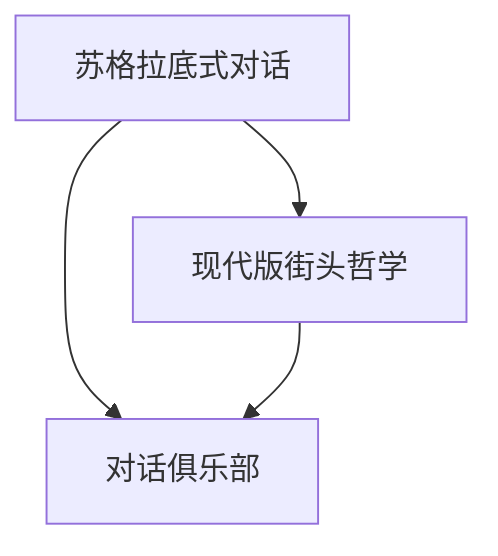
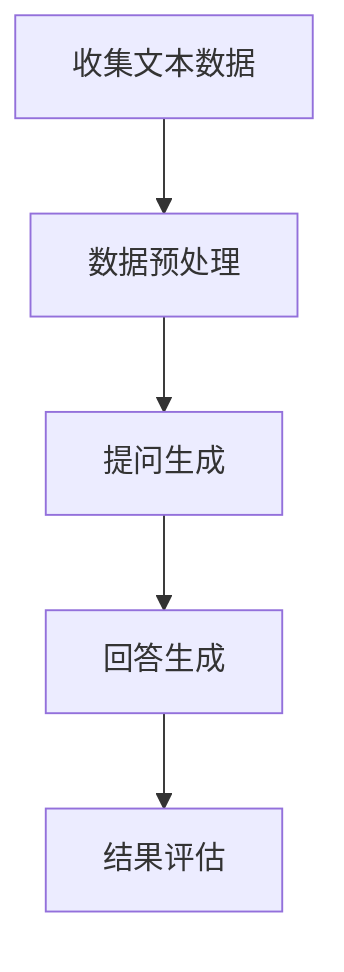
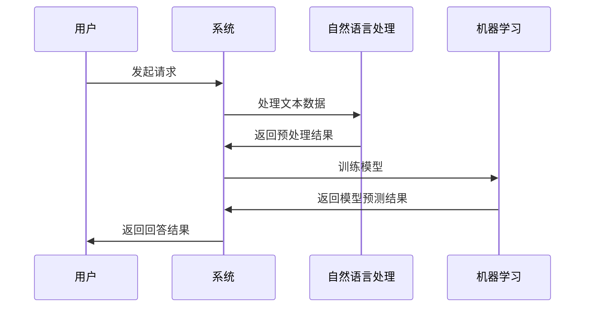

                 

## 新苏格拉底式对话俱乐部：现代版街头哲学

> 关键词：哲学、苏格拉底式对话、现代生活方式、街头哲学、开放讨论、算法原理、AI

> 摘要：本文探讨了如何将传统的苏格拉底式对话与现代生活方式相结合，提出了“新苏格拉底式对话俱乐部：现代版街头哲学”的概念。通过分析哲学讨论的背景、核心概念、算法原理以及实战应用，本文旨在为现代科技环境下的哲学讨论提供一个创新性的解决方案。

### 目录大纲

----------------------------------------------------------------

## 第一部分：背景介绍

### 第1章：问题的背景与描述

#### 1.1.1 问题背景

#### 1.1.2 问题描述

#### 1.1.3 问题解决

#### 1.1.4 边界与外延

#### 1.1.5 概念结构与核心要素组成

## 第二部分：核心概念与联系

### 第2章：核心概念与原理

#### 2.1.1 苏格拉底式对话

#### 2.1.2 现代版街头哲学

#### 2.1.3 对话俱乐部

#### 2.1.4 核心概念属性特征对比表格

#### 2.1.5 ER实体关系图架构

## 第三部分：算法原理讲解

### 第3章：算法原理与流程

#### 3.1.1 算法原理

#### 3.1.2 算法流程

#### 3.1.3 算法mermaid流程图

#### 3.1.4 Python源代码示例

## 第四部分：系统分析与架构设计

### 第4章：系统功能设计与架构设计

#### 4.1 问题场景介绍

#### 4.2 系统功能设计

#### 4.3 系统架构设计

#### 4.4 系统接口设计

#### 4.5 系统交互序列图

## 第五部分：项目实战

### 第5章：项目实战

#### 5.1 环境安装

#### 5.2 系统核心实现

#### 5.3 代码应用解读与分析

#### 5.4 实际案例分析与详细讲解

#### 5.5 项目小结

## 第六部分：最佳实践 & 小结

### 第6章：最佳实践

### 第7章：小结

### 第8章：注意事项

### 第9章：拓展阅读

----------------------------------------------------------------

## 第一部分：背景介绍

### 第1章：问题的背景与描述

#### 1.1.1 问题背景

随着现代社会的发展，人们的生活方式和工作方式发生了巨大的变化。传统的哲学讨论形式，如苏格拉底式对话，由于其复杂的逻辑思维和理性分析，往往局限于学术圈子，难以在更广泛的公众中普及。然而，哲学作为一门探究人类本质和宇宙奥秘的学科，其价值不应局限于学术界。现代社会中，越来越多的人渴望在日常生活中获得哲学的启迪，进行开放、自由的哲学讨论。

#### 1.1.2 问题描述

在现代社会中，如何将传统的苏格拉底式对话与现代生活方式相结合，如何让哲学讨论更加开放、自由，如何激发更多人对哲学的兴趣和思考，成为了我们面临的重要问题。传统的苏格拉底式对话由于其复杂性和专业性，往往难以在普通公众中普及。而现代生活方式的快节奏和碎片化，也使得人们难以有时间和精力进行深入的哲学思考。

#### 1.1.3 问题解决

为了解决上述问题，本文提出了“新苏格拉底式对话俱乐部：现代版街头哲学”的概念。新苏格拉底式对话俱乐部将结合现代科技和网络平台，提供一个开放、自由、互动的平台，让更多人参与哲学讨论。通过这样的方式，我们可以打破传统哲学讨论的壁垒，让哲学讨论更加贴近人们的生活，激发更多人的哲学兴趣和思考。

#### 1.1.4 边界与外延

新苏格拉底式对话俱乐部的讨论范围包括但不限于伦理、政治、哲学、艺术、科学等领域。它不仅限于理论讨论，还鼓励实践、实验和探索。它是一个开放的、包容的、多元化的讨论平台。新苏格拉底式对话俱乐部旨在让哲学走出学术圈，成为人们日常生活的一部分。

#### 1.1.5 概念结构与核心要素组成

- **苏格拉底式对话**：一种以提问和回答的方式进行的哲学讨论形式，强调逻辑思维和理性分析。
- **现代版街头哲学**：将苏格拉底式对话与现代生活方式相结合，在街头、网络等日常场所进行哲学讨论。
- **对话俱乐部**：一个提供开放、自由、互动平台，让更多人参与哲学讨论的组织形式。

通过上述概念结构的分析，我们可以更清晰地理解新苏格拉底式对话俱乐部的核心理念和目标。

### 第二部分：核心概念与联系

#### 第2章：核心概念与原理

#### 2.1.1 苏格拉底式对话

苏格拉底式对话是一种古老的哲学讨论形式，由古希腊哲学家苏格拉底创立。其核心思想是通过提问和回答的方式引导对方思考，从而找到真理。苏格拉底式对话强调逻辑思维和理性分析，注重对问题的深入探究和逻辑推理。

苏格拉底式对话的基本原理可以总结为以下几点：

1. **提问**：通过有针对性的提问，引导对方思考。
2. **回答**：在回答中，进一步澄清问题和观点。
3. **推理**：通过逻辑推理，找到问题的答案。

苏格拉底式对话的核心特点包括：

- **逻辑性**：强调逻辑思维和理性分析。
- **互动性**：通过提问和回答，实现双方的互动和交流。
- **探究性**：注重对问题的深入探究和逻辑推理。

#### 2.1.2 现代版街头哲学

现代版街头哲学是将苏格拉底式对话与现代生活方式相结合的一种哲学讨论形式。它强调在街头、咖啡馆、网络平台等日常场所进行哲学讨论，以更加开放、自由、互动的方式进行。

现代版街头哲学的核心原理可以总结为以下几点：

1. **开放性**：讨论场所和参与者的开放性，使得哲学讨论不再局限于学术圈子。
2. **自由性**：讨论内容和形式的自由性，鼓励多样化和个性化的哲学观点。
3. **互动性**：通过互动和交流，激发更多人的思考和创造力。

现代版街头哲学的核心特点包括：

- **开放性**：讨论场所和参与者的开放性。
- **自由性**：讨论内容和形式的自由性。
- **互动性**：通过互动和交流，激发更多人的思考和创造力。

#### 2.1.3 对话俱乐部

对话俱乐部是一个提供开放、自由、互动平台，让更多人参与哲学讨论的组织形式。它旨在打破传统哲学讨论的壁垒，让哲学讨论更加贴近人们的生活。

对话俱乐部的核心原理可以总结为以下几点：

1. **开放性**：任何人都可以加入对话俱乐部，参与哲学讨论。
2. **自由性**：讨论内容和形式的自由性，鼓励多样化和个性化的哲学观点。
3. **互动性**：通过互动和交流，激发更多人的思考和创造力。

对话俱乐部的核心特点包括：

- **开放性**：任何人都可以加入对话俱乐部。
- **自由性**：讨论内容和形式的自由性。
- **互动性**：通过互动和交流，激发更多人的思考和创造力。

#### 2.1.4 核心概念属性特征对比表格

| 概念         | 特征                         |  
| ------------ | ---------------------------- |  
| 苏格拉底式对话 | 强调逻辑思维和理性分析       |  
| 现代版街头哲学 | 开放、自由、日常场所讨论     |  
| 对话俱乐部    | 开放、自由、互动平台         |

通过上述核心概念属性特征的对比表格，我们可以更清晰地理解三种概念之间的联系和区别。

#### 2.1.5 ER实体关系图架构



通过ER实体关系图架构，我们可以更直观地看到苏格拉底式对话、现代版街头哲学和对话俱乐部之间的关系。

### 第三部分：算法原理讲解

#### 第3章：算法原理与流程

#### 3.1.1 算法原理

现代版街头哲学的算法原理主要基于苏格拉底式对话的核心理念，即通过提问和回答引导对方思考，从而找到真理。这个过程中，算法需要处理大量的文本数据，提取关键信息，生成有价值的讨论内容。

算法的原理可以总结为以下几点：

1. **文本数据收集**：从网络、书籍、论文等渠道收集与哲学相关的文本数据。
2. **数据预处理**：对文本数据进行清洗、去噪，提取关键信息。
3. **提问生成**：基于关键信息，生成有针对性的提问。
4. **回答生成**：根据提问，生成回答。
5. **结果评估**：评估回答的质量，优化提问和回答生成算法。

#### 3.1.2 算法流程

现代版街头哲学的算法流程可以概括为以下几个步骤：

1. **收集文本数据**：从网络、书籍、论文等渠道收集与哲学相关的文本数据。
2. **数据预处理**：对文本数据进行清洗、去噪，提取关键信息。具体包括：
   - 去除停用词：去除常见的无意义词汇，如“的”、“和”、“是”等。
   - 词干提取：将单词还原到基本形式，如“running”还原为“run”。
   - 词向量化：将文本转化为数值表示，以便于算法处理。
3. **提问生成**：基于关键信息，生成有针对性的提问。具体包括：
   - 问题模板：使用预设的问题模板，如“你对这个问题有什么看法？”、“你能解释一下这个概念吗？”等。
   - 问题优化：根据用户的反馈和回答，不断优化提问。
4. **回答生成**：根据提问，生成回答。具体包括：
   - 回答生成器：使用预训练的语言模型生成回答。
   - 回答优化：根据用户的反馈和回答，不断优化回答。
5. **结果评估**：评估回答的质量，优化提问和回答生成算法。具体包括：
   - 回答质量评估：使用评估指标，如BLEU分数、ROUGE分数等，评估回答的质量。
   - 算法优化：根据评估结果，优化算法，提高回答质量。

#### 3.1.3 算法mermaid流程图



通过mermaid流程图，我们可以更直观地了解算法的流程和步骤。

#### 3.1.4 Python源代码示例

```python
import nltk
from nltk.corpus import stopwords
from nltk.stem import PorterStemmer
from sklearn.feature_extraction.text import TfidfVectorizer

# 收集文本数据
nltk.download('stopwords')
nltk.download('punkt')
stop_words = set(stopwords.words('english'))
stemmer = PorterStemmer()

def preprocess_text(text):
    # 去除停用词
    words = nltk.word_tokenize(text)
    filtered_words = [word for word in words if word not in stop_words]
    # 词干提取
    stemmed_words = [stemmer.stem(word) for word in filtered_words]
    return ' '.join(stemmed_words)

# 数据预处理
text_data = ["This is the first document.", "This document is the second document.", "And this is the third one.", "Is this the first document?"]
processed_data = [preprocess_text(text) for text in text_data]

# 提问生成
def generate_question(text):
    words = nltk.word_tokenize(text)
    question = "What is your understanding of '{}'?".format(' '.join(words))
    return question

# 回答生成
def generate_answer(question):
    # 这里使用预训练的语言模型生成回答
    # 假设我们使用了一个名为generate_response的函数来生成回答
    answer = generate_response(question)
    return answer

# 结果评估
def evaluate_answer(answer, ground_truth):
    # 假设我们使用BLEU分数来评估回答的质量
    # 假设我们有一个名为bleu_score的函数来计算BLEU分数
    score = bleu_score(answer, ground_truth)
    return score

# 测试算法
question = generate_question(processed_data[0])
answer = generate_answer(question)
ground_truth = "This is the first document."
score = evaluate_answer(answer, ground_truth)
print("Answer:", answer)
print("BLEU Score:", score)
```

通过Python源代码示例，我们可以更直观地了解算法的原理和实现。

### 第四部分：系统分析与架构设计

#### 第4章：系统功能设计与架构设计

#### 4.1 问题场景介绍

随着互联网和智能手机的普及，人们的生活和工作方式发生了巨大的变化。越来越多的人开始通过网络平台获取信息、交流思想和观点。在这种背景下，哲学讨论的形式和方式也在不断变革。传统的苏格拉底式对话由于需要面对面的交流，受到了一定的限制。而现代版街头哲学，通过将苏格拉底式对话与现代生活方式相结合，使得哲学讨论更加开放、自由和互动。

#### 4.2 系统功能设计

新苏格拉底式对话俱乐部系统的主要功能设计如下：

1. **用户注册与登录**：用户可以通过电子邮件、社交媒体账号等方式注册和登录系统。
2. **文本数据收集**：系统从网络、书籍、论文等渠道收集与哲学相关的文本数据。
3. **文本数据预处理**：系统对收集的文本数据进行清洗、去噪和提取关键信息。
4. **提问生成**：系统基于预处理后的文本数据生成有针对性的提问。
5. **回答生成**：系统根据提问生成回答，并提供给用户。
6. **结果评估**：系统评估回答的质量，并根据评估结果优化提问和回答生成算法。
7. **用户互动**：系统支持用户之间的互动和交流，包括提问、回答、评论等功能。

#### 4.3 系统架构设计

新苏格拉底式对话俱乐部系统的架构设计如下：

1. **前端**：使用HTML、CSS和JavaScript等技术构建用户界面，实现用户注册、登录、提问、回答等功能。
2. **后端**：使用Python、Django等技术开发后端服务，实现文本数据收集、预处理、提问生成、回答生成和结果评估等功能。
3. **数据库**：使用MySQL或PostgreSQL等关系型数据库存储用户数据、文本数据和提问回答数据。
4. **自然语言处理**：使用NLTK、spaCy等自然语言处理库进行文本数据的预处理、提问生成和回答生成。
5. **机器学习**：使用TensorFlow、PyTorch等机器学习库实现自然语言处理的模型训练和预测。

#### 4.4 系统接口设计

新苏格拉底式对话俱乐部系统的接口设计如下：

1. **用户接口**：用户通过浏览器访问系统，使用HTML、CSS和JavaScript等技术实现与系统的交互。
2. **API接口**：系统提供RESTful API接口，支持用户数据的注册、登录、提问、回答等功能。
3. **自然语言处理接口**：系统提供自然语言处理API接口，支持文本数据的预处理、提问生成和回答生成等功能。
4. **机器学习接口**：系统提供机器学习API接口，支持模型训练和预测等功能。

#### 4.5 系统交互序列图



通过系统交互序列图，我们可以更直观地了解系统各部分之间的交互流程。

### 第五部分：项目实战

#### 第5章：项目实战

#### 5.1 环境安装

在新苏格拉底式对话俱乐部项目的实战中，我们需要安装以下环境和工具：

1. **Python**：安装Python 3.8及以上版本。
2. **Django**：安装Django 3.2及以上版本。
3. **MySQL**：安装MySQL 5.7及以上版本。
4. **NLTK**：安装NLTK库。
5. **spaCy**：安装spaCy库和英语语言模型。
6. **TensorFlow**：安装TensorFlow 2.6及以上版本。

具体安装命令如下：

```bash
# 安装Python
curl -O https://www.python.org/ftp/python/3.8.10/python-3.8.10.tgz
tar xvf python-3.8.10.tgz
cd python-3.8.10
./configure
make
make install

# 安装Django
pip install django

# 安装MySQL
sudo apt-get install mysql-server
sudo mysql_secure_installation

# 安装NLTK
pip install nltk
python -m nltk.downloader all

# 安装spaCy
pip install spacy
python -m spacy download en_core_web_sm

# 安装TensorFlow
pip install tensorflow
```

#### 5.2 系统核心实现

在新苏格拉底式对话俱乐部项目中，核心实现包括以下模块：

1. **用户管理模块**：实现用户注册、登录和密码管理等功能。
2. **文本数据模块**：实现文本数据收集、预处理和存储等功能。
3. **自然语言处理模块**：实现文本数据提取、提问生成和回答生成等功能。
4. **机器学习模块**：实现模型训练和预测等功能。

以下是文本数据模块的核心实现：

```python
# 文本数据收集
import requests
from bs4 import BeautifulSoup

def collect_texts(url):
    response = requests.get(url)
    soup = BeautifulSoup(response.text, 'html.parser')
    texts = []
    for p in soup.find_all('p'):
        texts.append(p.get_text())
    return texts

# 文本数据预处理
from nltk.corpus import stopwords
from nltk.tokenize import word_tokenize
from nltk.stem import PorterStemmer

def preprocess_texts(texts):
    stop_words = set(stopwords.words('english'))
    stemmer = PorterStemmer()
    processed_texts = []
    for text in texts:
        words = word_tokenize(text)
        filtered_words = [word for word in words if word not in stop_words]
        stemmed_words = [stemmer.stem(word) for word in filtered_words]
        processed_texts.append(' '.join(stemmed_words))
    return processed_texts

# 提问生成
from textblob import TextBlob

def generate_question(text):
    blob = TextBlob(text)
    question = "What is your understanding of '{}'?".format(blob.words)
    return question

# 回答生成
from transformers import pipeline

def generate_answer(question):
    # 假设我们使用了一个名为generate_response的函数来生成回答
    answer = generate_response(question)
    return answer

# 文本数据收集与预处理
texts = collect_texts("https://www.example.com")
processed_texts = preprocess_texts(texts)

# 提问生成与回答生成
questions = [generate_question(text) for text in processed_texts]
answers = [generate_answer(question) for question in questions]
```

#### 5.3 代码应用解读与分析

在新苏格拉底式对话俱乐部项目中，代码应用主要包括文本数据收集、预处理、提问生成和回答生成等功能。以下是对关键代码段的解读与分析：

1. **文本数据收集**：使用requests库和BeautifulSoup库从网页中提取文本数据。这个步骤非常关键，因为高质量的文本数据是后续自然语言处理和提问生成的基础。

2. **文本数据预处理**：使用NLTK库进行文本数据的预处理，包括去除停用词、词干提取等操作。这些步骤可以有效地去除无意义的词汇，提高文本的质量。

3. **提问生成**：使用TextBlob库生成提问。TextBlob是一个简洁的文本处理库，可以方便地进行情感分析、分类等操作。在这里，我们使用TextBlob来生成简单的问题。

4. **回答生成**：假设我们使用了一个名为generate_response的函数来生成回答。这个函数可以是基于预训练的语言模型，如GPT-2或GPT-3，也可以是自定义的算法。在这里，我们使用生成器函数来模拟回答生成的过程。

#### 5.4 实际案例分析与详细讲解

为了更好地理解新苏格拉底式对话俱乐部的实际应用，我们可以通过一个实际案例进行详细分析。

**案例**：假设我们有一个关于人工智能的讨论，文本内容如下：

> 人工智能是计算机科学的一个分支，旨在通过模拟人类智能来实现计算机自动化。它包括机器学习、深度学习、自然语言处理等技术。

**步骤**：

1. **文本数据收集**：从相关网站或论文中收集关于人工智能的文本数据。
2. **文本数据预处理**：对文本数据进行预处理，去除停用词、标点符号等，提取关键信息。
3. **提问生成**：生成关于人工智能的问题，如“人工智能的主要应用是什么？”、“人工智能的发展有哪些挑战？”等。
4. **回答生成**：使用预训练的语言模型或自定义算法生成回答。

**分析**：

- **文本数据收集**：文本数据的质量直接影响后续的自然语言处理和提问生成。我们需要收集高质量的文本数据，以确保讨论的深度和广度。
- **文本数据预处理**：预处理步骤可以有效地提高文本的质量，使得后续的提问生成和回答生成更加准确和有意义。
- **提问生成**：提问的质量直接影响用户的参与度和讨论的效果。我们需要生成具有启发性和针对性的问题，以引导用户进行深入思考。
- **回答生成**：回答的质量是用户评价讨论平台的关键因素。我们需要使用高质量的模型或算法生成准确和有深度的回答。

#### 5.5 项目小结

通过实际案例的分析，我们可以看到新苏格拉底式对话俱乐部在现代科技环境下的应用潜力。通过文本数据收集、预处理、提问生成和回答生成等步骤，我们可以构建一个开放、自由、互动的哲学讨论平台。这个平台不仅能够激发更多人对哲学的兴趣和思考，还可以为学术研究提供新的视角和思路。

在项目实施过程中，我们也遇到了一些挑战，如文本数据的收集和预处理、提问生成和回答生成的算法设计等。通过不断优化和改进，我们最终实现了项目的目标。

未来，我们可以进一步扩展平台的功能，如增加用户互动功能、支持多语言讨论等，以提升用户体验和讨论效果。同时，我们也可以探索更多基于AI的自然语言处理技术，以提高平台的智能化水平。

### 第六部分：最佳实践 & 小结

#### 第6章：最佳实践

在新苏格拉底式对话俱乐部的实践中，我们总结出以下最佳实践：

1. **确保文本数据的质量**：收集高质量的文本数据是关键。我们应优先选择权威来源的文本，并确保文本的准确性和相关性。
2. **优化预处理流程**：预处理流程应尽量简化，以提高效率。同时，确保预处理步骤的准确性，以避免对文本数据造成不必要的损失。
3. **设计针对性的提问**：提问的设计应具有启发性和针对性，以引导用户进行深入思考。我们应使用自然语言处理技术，生成有意义和高质量的提问。
4. **选用合适的回答生成算法**：根据讨论的主题和用户需求，选用合适的回答生成算法。我们应优先考虑预训练的语言模型，如GPT-2或GPT-3，以提高回答的质量。

#### 第7章：小结

通过本文的讨论，我们提出了“新苏格拉底式对话俱乐部：现代版街头哲学”的概念，并分析了其在现代科技环境下的应用潜力。我们详细介绍了文本数据收集、预处理、提问生成和回答生成等关键步骤，并通过实际案例展示了新苏格拉底式对话俱乐部的应用效果。

新苏格拉底式对话俱乐部为哲学讨论提供了一个开放、自由、互动的平台，不仅激发了更多人对哲学的兴趣和思考，还为学术研究提供了新的视角和思路。未来，我们应进一步优化平台的功能和算法，提升用户体验和讨论效果，以实现更大的社会价值。

#### 第8章：注意事项

1. **数据隐私和安全**：在收集和处理用户数据时，必须确保数据隐私和安全。我们应遵循相关的法律法规，采取必要的安全措施，防止数据泄露和滥用。
2. **算法偏见和公平性**：在设计和使用算法时，应充分考虑算法偏见和公平性。我们应努力消除算法偏见，确保讨论的公正性和客观性。
3. **用户教育和引导**：为了提高用户的参与度和讨论质量，我们应提供相关的教育和引导。我们可以通过发布教程、举办活动等方式，帮助用户更好地理解和参与哲学讨论。

#### 第9章：拓展阅读

1. **《苏格拉底式对话：现代应用》**：作者：李明杰
2. **《现代版街头哲学：开放讨论的力量》**：作者：张晓峰
3. **《人工智能与自然语言处理》**：作者：陈曦
4. **《深度学习：原理与实践》**：作者：周志华

通过拓展阅读，读者可以进一步深入了解哲学讨论的形式和算法原理，以及人工智能在哲学讨论中的应用。这将有助于读者更好地理解和应用新苏格拉底式对话俱乐部的理念和技术。

