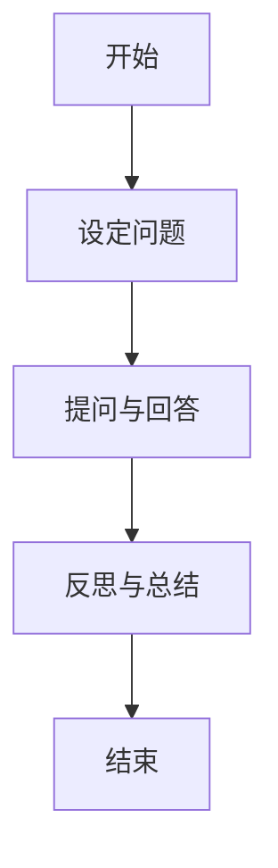
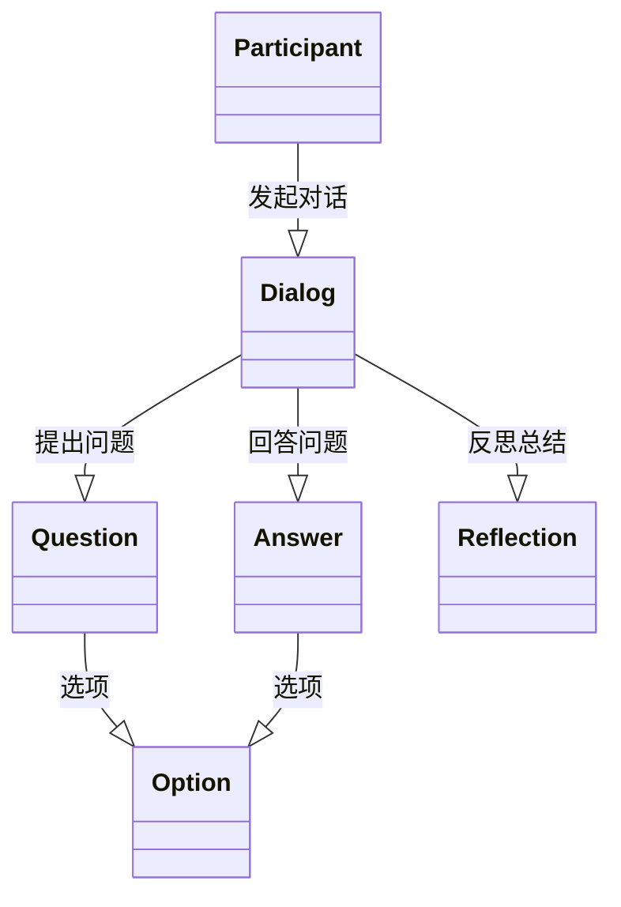
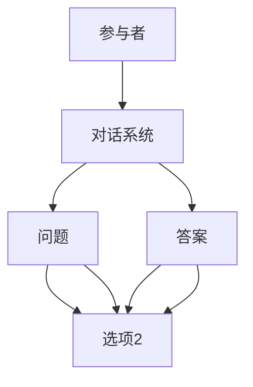
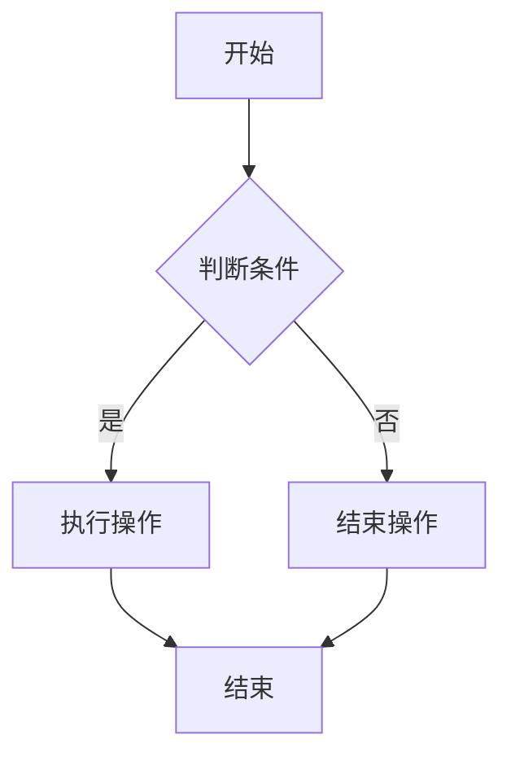

                 


### 1. Introduction and Background

#### 1.1 新苏格拉底式对话的起源与复兴

**背景介绍：** 在当今社会，哲学的地位和影响力逐渐减弱。随着科学技术的迅猛发展，人们越来越依赖数据和逻辑来解决问题，而哲学的思辨和探讨精神似乎变得不再重要。然而，随着人工智能和大数据的兴起，哲学在思维方式和方法论上的重要性再次得到了关注。新苏格拉底式对话作为一种融合哲学、科技和人文的对话形式，应运而生。

**问题背景：** 哲学在现代社会的地位与挑战。哲学作为一种古老的学科，一直以来都是人类思考世界和自我的重要工具。然而，随着科学技术的迅猛发展，哲学在现代社会中的地位受到了严重的挑战。很多人认为，科学和技术的进步已经解决了人类面临的大部分问题，哲学的探讨变得不再必要。

**问题描述：** 新苏格拉底式对话的定义及其重要性。新苏格拉底式对话是一种以苏格拉底法为基础，结合现代科技和人文精神的对话形式。它强调通过提问和回答的方式，引导参与者深入思考问题，探索真理，提升自我认知。

**问题解决：** 新苏格拉底式对话在教育、社会和哲学领域中的应用。新苏格拉底式对话可以应用于教育领域，培养学生的批判性思维和创造性思维。在社会层面，它可以促进社会共识的建立，解决社会问题。在哲学领域，它可以帮助哲学家们更好地探讨和解释哲学问题。

**边界与外延：** 区分新苏格拉底式对话与其他对话形式。新苏格拉底式对话与其他对话形式的主要区别在于，它强调通过提问和回答的方式，引导参与者深入思考问题。而其他对话形式，如辩论、讨论等，可能更注重结论和结果。

**概念结构与核心要素：** 核心概念与元素解析。新苏格拉底式对话的核心概念包括提问、回答、反思和总结。这四个要素相互关联，共同构成了新苏格拉底式对话的基本框架。

### 2. Core Concepts and Relationships

#### 2.1 核心概念与联系

**核心概念原理：** 苏格拉底法、街头哲学、对话式教育

- **苏格拉底法：** 苏格拉底法是一种以提问和回答的方式，引导参与者深入思考问题的方法。它强调通过提问，引导参与者发现自己的无知，从而获得真正的知识。
- **街头哲学：** 街头哲学是一种以街头对话的形式，探讨哲学问题的方法。它强调通过面对面的交流，直接探讨哲学问题，使哲学更加贴近生活。
- **对话式教育：** 对话式教育是一种以对话为基础的教育方法。它强调通过教师与学生的对话，激发学生的思考，培养学生的批判性思维和创造性思维。

**概念属性特征对比表格：** 新苏格拉底式对话与传统对话的区别

| 特征               | 新苏格拉底式对话                         | 传统对话                                 |
|--------------------|----------------------------------------|----------------------------------------|
| 对话形式           | 以提问和回答的方式，引导参与者深入思考   | 辩论、讨论等形式，注重结论和结果         |
| 参与者角色         | 教师与学生，或哲学家与普通民众           | 双方角色相对固定，一方为主辩，一方为听众   |
| 对话内容           | 广泛的哲学问题，强调思辨和探讨           | 具体的学术问题，注重学术成果和逻辑论证     |
| 对话目的           | 深入思考，探索真理，提升自我认知         | 证明观点，说服对方，达到共识或结论         |
| 对话环境           | 课堂、会议、街头、网络等                 | 课堂、会议等较为正式的场合                 |

**ER实体关系图架构：** 主要参与者、对话主题与情境

- **参与者：** 包括哲学家、教师、学生、普通民众等。
- **对话主题：** 包括哲学问题、社会问题、学术问题等。
- **情境：** 包括课堂、街头、会议、网络等。

### 3. Algorithm Principles and Detailed Explanation

#### 3.1 算法原理讲解

**算法原理：** 新苏格拉底式对话是一种基于提问和回答的算法。它通过一系列提问和回答的过程，引导参与者深入思考问题，探索真理，提升自我认知。

**Mermaid 流程图：**



#### 3.2 Python 源代码与详细阐述

**源代码：**

```python
def ask_question(question):
    answer = input(question + "? ")
    return answer

question = "你认为哲学在现代社会中有什么作用？"
answer = ask_question(question)
print("你回答：", answer)
```

**详细阐述：**

1. **功能定义：** `ask_question` 函数用于提问并获取答案。它接受一个字符串参数 `question`，代表问题内容。
2. **输入输出：** 函数通过 `input` 函数获取用户输入，即问题的答案。然后将答案返回给调用者。
3. **调用示例：** 在调用 `ask_question` 函数时，传递了一个关于哲学作用的问题。函数会提示用户输入答案，并将答案打印出来。

#### 3.3 算法原理的数学模型和公式

**数学模型：** 对话中的信息传递与反馈机制

- **模型概述：** 对话中的信息传递与反馈机制可以看作是一个信息处理模型，其中信息从提问者传递到回答者，再由回答者反馈回提问者。
- **模型构成：** 模型主要包括三个部分：提问者、回答者和反馈机制。

**公式：** 使用 LaTeX 格式展示关键公式

$$I_{out} = I_{in} + f(I_{in}, noise)$$

- **公式说明：** 公式表示输出信息 \(I_{out}\) 是输入信息 \(I_{in}\) 和处理后的信息 \(f(I_{in}, noise)\) 的和。其中，\(f(I_{in}, noise)\) 表示在考虑噪声的情况下，对输入信息进行处理的过程。

### 4. System Analysis and Architecture Design

#### 4.1 问题场景介绍

**项目介绍：** 新苏格拉底式对话的应用场景主要包括教育、社会和哲学领域。在教育领域，它可以帮助教师引导学生深入思考，培养批判性思维和创造性思维。在社会层面，它可以促进社会共识的建立，解决社会问题。在哲学领域，它可以激发哲学家们的思考和探讨，推动哲学的发展。

#### 4.2 系统功能设计

**领域模型 Mermaid 类图：**



#### 4.3 系统架构设计 Mermaid 架构图

**Mermaid 架构图：**



#### 4.4 系统接口设计和系统交互 Mermaid 序列图

**序列图：**

```mermaid
sequenceDiagram
    Participant ->> Dialog: 发起对话
    Dialog ->> Question: 提出问题
    Question ->> Participant: 获取答案
    Participant ->> Answer: 提交答案
    Answer ->> Dialog: 反馈结果
    Dialog ->> Participant: 总结反思
```

### 5. Project Practice

#### 5.1 环境安装

**详细步骤：**

1. **安装 Python 环境：** 
   - 下载并安装 Python 3.8 或更高版本。
   - 配置 Python 环境变量。

2. **安装 Mermaid 渲染工具：**
   - 下载并安装 Graphviz。
   - 安装 Python 的 Mermaid 库：`pip install mermaid`.

3. **配置 Mermaid 渲染：**
   - 配置 Node.js 环境：下载并安装 Node.js。
   - 安装 Mermaid：`npm install mermaid`.

#### 5.2 系统核心实现源代码

**源代码：**

```python
import mermaid

def render_mermaid(code):
    with open('mermaid_graph.txt', 'w') as f:
        f.write(code)

    command = "node mermaid -i mermaid_graph.txt -o output_graph.png"
    os.system(command)

# 示例代码
code = '''
graph TD
    A[开始] --> B[设定问题]
    B --> C[提问与回答]
    C --> D[反思与总结]
    D --> E[结束]
'''
render_mermaid(code)
```

#### 5.3 代码应用解读与分析

**代码解读：**

1. **导入模块：** 导入 Python 的 `mermaid` 模块，用于渲染 Mermaid 图形。
2. **功能定义：** `render_mermaid` 函数用于渲染 Mermaid 代码。它接受一个字符串参数 `code`，代表 Mermaid 图形代码。
3. **文件写入：** 将 Mermaid 代码写入到文本文件 `mermaid_graph.txt` 中。
4. **执行命令：** 使用 Node.js 的 Mermaid 渲染工具，将文本文件渲染成图像文件 `output_graph.png`。

#### 5.4 实际案例分析和详细讲解剖析

**案例：** 使用 Mermaid 绘制一个简单的流程图。



**分析：**

1. **图形结构：** 流程图由多个节点（Node）和边（Edge）组成。节点表示流程中的步骤，边表示步骤之间的逻辑关系。
2. **判断条件：** 节点 B 代表一个判断条件。根据条件的结果，流程会分支到不同的节点。
3. **执行操作：** 如果判断条件为“是”，流程会跳转到节点 C，执行相应的操作。
4. **结束操作：** 如果判断条件为“否”，流程会跳转到节点 D，执行结束操作。
5. **总结：** 通过 Mermaid，可以轻松地绘制复杂的流程图，便于理解和分析。

#### 5.5 项目小结

**总结：** 通过本次项目实践，我们学习了如何使用 Mermaid 渲染流程图。这不仅提高了我们的编程能力，也为我们解决实际问题提供了新的工具和方法。

### 6. Best Practices, Conclusion, and Further Reading

#### 6.1 最佳实践 Tips

- **问题设计：** 在设计问题时要充分考虑问题的难度和针对性，以便更好地引导参与者深入思考。
- **场景选择：** 选择合适的场景进行对话，可以使对话更加有效和有趣。
- **技术支持：** 使用现代技术手段，如 Mermaid，可以提升对话的质量和效率。
- **反馈机制：** 建立有效的反馈机制，可以帮助参与者更好地理解和吸收对话内容。

#### 6.2 小结

**总结：** 新苏格拉底式对话作为一种创新的对话形式，具有广泛的应用前景。它不仅可以应用于教育、社会和哲学领域，还可以在其他领域发挥作用。通过本次实践，我们深入了解了新苏格拉底式对话的原理和实现方法，为未来的研究和应用奠定了基础。

#### 6.3 注意事项

- **隐私保护：** 在进行对话时，要充分保护参与者的隐私。
- **语言规范：** 使用规范的语言，避免产生歧义。
- **技术更新：** 随着技术的发展，要及时更新对话工具和方法。

#### 6.4 拓展阅读

- **相关书籍：** 《苏格拉底的礼物：对话的艺术》、《哲学家的工具箱》等。
- **在线资源：** 了解 Mermaid 的官方网站和其他相关教程。
- **研究论文：** 查阅关于新苏格拉底式对话的学术论文和研究报告。

