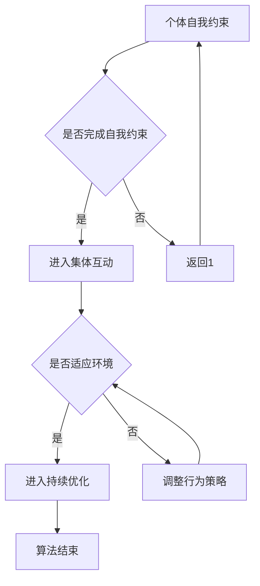

                 

# 《新苦行主义retreat：自我约束的集体实践》

## 关键词
- 苦行主义
- 自我约束
- 集体实践
- 精神提升
- 社会和谐
- 跨文化研究

## 摘要
本文探讨了新苦行主义retreat：自我约束的集体实践这一主题，首先介绍了新苦行主义的基础理论，包括其起源、发展历程和核心思想。接着，本文详细阐述了自我约束的理论基础，以及集体实践的理论框架。在此基础上，本文分析了新苦行主义在个人层面和组织层面的实践应用，并探讨了其在社会层面的影响与反思。最后，本文从全球视野出发，研究了新苦行主义在不同文化中的实践，并对其未来趋势进行了展望。通过本文的研究，我们希望能够为读者提供一个全面、深入的关于新苦行主义retreat：自我约束的集体实践的理解。

## 目录大纲

### 第一部分：新苦行主义的基础理论

### 第1章：新苦行主义的起源与演变
#### 1.1 新苦行主义的起源
#### 1.2 新苦行主义的发展历程
#### 1.3 新苦行主义的核心思想

### 第2章：自我约束的理论基础
#### 2.1 自我约束的概念与内涵
#### 2.2 自我约束的类型与作用
#### 2.3 自我约束的心理学研究

### 第3章：集体实践的理论框架
#### 3.1 集体实践的概念与形式
#### 3.2 集体实践的要素与关系
#### 3.3 集体实践的心理学效应

### 第二部分：新苦行主义的实践应用

### 第4章：个人层面的自我约束实践
#### 4.1 个人自我约束的方法
#### 4.2 个人自我约束的案例分析
#### 4.3 个人自我约束的效果评估

### 第5章：组织层面的集体实践
#### 5.1 组织集体实践的策略
#### 5.2 组织集体实践的案例分析
#### 5.3 组织集体实践的挑战与应对

### 第6章：社会层面的影响与反思
#### 6.1 新苦行主义对社会的影响
#### 6.2 新苦行主义的伦理考量
#### 6.3 新苦行主义的未来展望

### 第三部分：新苦行主义的全球视野

### 第7章：新苦行主义在全球的实践
#### 7.1 全球新苦行主义的发展状况
#### 7.2 全球新苦行主义的案例研究
#### 7.3 全球新苦行主义的比较分析

### 第8章：新苦行主义的跨文化研究
#### 8.1 新苦行主义在不同文化中的表现
#### 8.2 新苦行主义的文化适应与调适
#### 8.3 新苦行主义的文化冲突与融合

### 第四部分：新苦行主义的未来趋势

### 第9章：新苦行主义的技术变革
#### 9.1 新技术对苦行主义的影响
#### 9.2 新苦行主义在新技术环境下的挑战
#### 9.3 新苦行主义的技术应用前景

### 第10章：新苦行主义的未来挑战与应对
#### 10.1 新苦行主义面临的挑战
#### 10.2 应对挑战的策略与建议
#### 10.3 新苦行主义的可持续发展

### 附录：新苦行主义资源指南

### 附录1：新苦行主义相关网站与资源
### 附录2：新苦行主义研究论文与书籍推荐
### 附录3：新苦行主义实践案例集

## 1.1 新苦行主义的起源与演变

### 1.1.1 新苦行主义的起源

新苦行主义（New Asceticism）这一概念并非凭空出现，它有着悠久的历史渊源。苦行主义（Asceticism）作为一种精神修炼方式，早在古代就已经存在。在古希腊和古罗马时期，就有许多哲学家和思想家提倡通过苦行来净化心灵，达到精神升华。

随着时间的推移，苦行主义在不同的文化和宗教背景下不断发展。例如，在佛教中，苦行被视为达到涅槃境界的必经之路。在伊斯兰教中，苏菲派信徒也通过苦行来寻求与真主的合一。而在基督教中，苦行则被视为修行的重要手段。

然而，现代新苦行主义的兴起，可以追溯到20世纪初的西方哲学界。随着工业化和现代化的进程，人们开始重新审视个人的精神需求和心灵的自由。在这个过程中，一些哲学家和思想家，如尼采、斯宾诺莎等，开始提出新的苦行主义观念，强调个体在现代社会中的自我约束和心灵修炼。

### 1.1.2 新苦行主义的发展历程

新苦行主义的发展历程可以分为几个阶段：

1. **启蒙时期的探索**：20世纪初，随着启蒙思想的兴起，人们开始对传统宗教和道德进行质疑，探索更加个体化和理性的精神修炼方式。这一时期，尼采的著作《查拉图斯特拉如是说》中提出了“超人”的概念，强调了个体自我超越的重要性。

2. **存在主义的兴起**：20世纪中叶，存在主义哲学成为西方哲学界的主流，强调个体的自由意志和存在意义。存在主义者如萨特和海德格尔，进一步发展了新苦行主义的思想，认为个体通过自我约束和存在的超越，可以达到精神上的自由和完整。

3. **心理学的介入**：随着心理学的发展，新苦行主义开始借鉴心理学的研究成果，探讨自我约束和集体实践的心理机制。行为心理学、认知心理学和人本心理学等不同流派的心理学研究，为新苦行主义提供了丰富的理论支持和实践指导。

4. **现代科技的融合**：随着现代科技的飞速发展，新苦行主义开始与科技相结合，探索通过科技手段来实现自我约束和心灵提升的新途径。例如，虚拟现实、人工智能等技术，被用于设计新的苦行实践方式和集体实践活动。

### 1.1.3 新苦行主义的核心思想

新苦行主义的核心思想主要包括以下几个方面：

1. **自我约束**：新苦行主义强调个体在精神和行为上的自我约束，通过自我控制来实现个人成长和心灵净化。

2. **心灵提升**：新苦行主义认为，通过自我约束和集体实践，个体可以实现精神境界的提升，达到心灵的自由和完整。

3. **集体实践**：新苦行主义强调个体在集体中的共同实践，通过集体活动来强化个体自我约束，促进社会和谐。

4. **伦理考量**：新苦行主义在强调自我约束和心灵提升的同时，也注重伦理考量，认为个体在追求个人精神提升的过程中，必须遵守社会道德和伦理规范。

### 1.1.4 新苦行主义与传统苦行主义的区别

新苦行主义与传统苦行主义在以下几个方面存在显著区别：

1. **目标不同**：传统苦行主义的主要目标是达到宗教或精神上的救赎，而新苦行主义则更注重个体在现代社会中的心灵提升和自我实现。

2. **方式不同**：传统苦行主义通常采用极端的肉体折磨和禁欲方式，而新苦行主义则更加温和，强调自我约束和心灵修炼。

3. **理论基础不同**：传统苦行主义的理论基础主要是宗教和哲学，而新苦行主义则更多地借鉴现代心理学、哲学和伦理学的研究成果。

4. **实践范围不同**：传统苦行主义主要在宗教团体和修道院中实践，而新苦行主义则可以在更广泛的社交环境中进行，包括个人、家庭、社区和组织等。

通过以上分析，我们可以看出，新苦行主义不仅继承了传统苦行主义的精髓，更在此基础上进行了创新和发展，为个体和集体提供了新的精神提升和自我实现的途径。

## 1.2 自我约束的理论基础

### 2.1 自我约束的概念与内涵

自我约束（Self-discipline）是指个体在情感、行为和思想上，通过自我控制和自我管理，达到自我提升和目标实现的过程。自我约束不仅涉及到个体对自身欲望和冲动进行控制，还包括对自身行为和思想的合理规划和调整。其核心在于个体在面临各种内外部诱惑和挑战时，能够保持冷静和理智，做出有利于自身长远利益和目标的选择。

自我约束的概念和内涵可以从以下几个方面进行理解：

1. **自我控制**：自我控制是自我约束的核心，它涉及到个体对自身情感、欲望和行为的控制能力。例如，在面对美食诱惑时，能够克制自己的食欲，保持饮食的均衡和健康。

2. **目标导向**：自我约束是为了实现个体设定的目标，无论是学业、职业还是个人成长。个体需要在追求目标的过程中，克服各种困难和挑战，保持毅力和耐心。

3. **自我管理**：自我管理是自我约束的重要组成部分，包括时间管理、情绪管理和行为管理等方面。个体需要合理安排时间，有效管理情绪，规范行为，以实现自我约束和目标。

4. **情感智慧**：自我约束还涉及到情感智慧，即个体在处理情感问题时的理性思考和情绪调节能力。通过提高情感智慧，个体可以更好地管理自己的情感，避免情绪波动对行为和决策的影响。

### 2.2 自我约束的类型与作用

自我约束的类型可以根据其具体表现形式和作用进行分类，主要包括以下几种：

1. **情感约束**：情感约束是指个体在情感上自我控制，避免情感波动对行为和决策的负面影响。例如，在面临压力和挫折时，能够保持冷静和理智，避免情绪化的行为。

2. **行为约束**：行为约束是指个体在行为上自我控制，遵守社会规范和道德标准。例如，遵守交通规则、不酒后驾车等，这些都是行为约束的体现。

3. **思想约束**：思想约束是指个体在思想上自我控制，避免消极和负面的思维。例如，避免消极的自我暗示，培养积极向上的思维习惯。

### 2.3 自我约束的心理学研究

自我约束作为一种心理现象，心理学对其进行了广泛的研究，揭示了自我约束的内在机制和作用。

1. **自我决定理论**：自我决定理论（Self-Determination Theory）认为，自我约束是个体追求自主性和自我决定的过程。个体在追求自主性的过程中，会表现出更高的自我约束水平，从而实现个人目标。

2. **意志力理论**：意志力理论（Willpower Theory）认为，自我约束是意志力的体现，意志力是个体在面临诱惑和挑战时，能够保持自我控制和坚定目标的能力。

3. **情绪调节理论**：情绪调节理论（Emotion Regulation Theory）认为，自我约束与情感调节密切相关。个体通过自我约束，可以有效管理自己的情绪，避免情绪波动对行为和决策的负面影响。

4. **认知行为理论**：认知行为理论（Cognitive Behavioral Theory）认为，自我约束是通过认知和行为两方面进行调节的。个体通过认知重构和行为策略，可以提高自我约束水平，实现个人目标。

总之，自我约束的理论基础涉及多个心理学领域的深入研究，这些理论为我们理解自我约束的机制和作用提供了科学依据。通过应用这些理论，个体可以更好地实现自我约束，提升个人成长和幸福感。

## 1.3 集体实践的理论框架

### 3.1 集体实践的概念与形式

集体实践（Collective Practice）是指个体在一个共同的环境中，通过相互合作和相互支持，共同实现某一目标或完成某一任务的活动。集体实践不仅仅是简单的群体活动，它更强调个体之间的互动和协作，通过集体的力量来实现更大的效果。

集体实践的形式多种多样，主要包括以下几种：

1. **共同学习**：共同学习是一种典型的集体实践形式，它强调个体在学习和知识分享过程中的合作与互助。例如，小组讨论、学习小组和学术研讨会等。

2. **团队协作**：团队协作是指多个个体在一个团队中，通过分工合作，共同完成复杂任务的过程。这种形式常见于企业、科研机构和政府机构等组织。

3. **社区活动**：社区活动是社区成员共同参与的一种集体实践形式，旨在增强社区凝聚力，提高居民的生活质量。例如，社区清洁活动、文化节和义工活动等。

4. **社会运动**：社会运动是一种通过集体行动来推动社会变革的集体实践形式。社会运动可以涵盖各种社会问题，如环境保护、人权和民主等。

### 3.2 集体实践的要素与关系

集体实践的成功离不开以下几个关键要素：

1. **个体**：个体是集体实践的基础，每个个体的参与和贡献都是集体实践成功的关键。个体的自我约束和合作意愿直接影响集体的效率和效果。

2. **目标**：共同的目标是集体实践的导向，它为个体提供了行动的方向和动力。明确的共同目标有助于个体在集体实践中保持一致，减少冲突。

3. **环境**：环境是集体实践的外部条件，它包括社会文化、政策支持和资源保障等方面。一个支持性和包容性的环境有助于集体实践的顺利进行。

4. **互动**：个体之间的互动是集体实践的核心，通过互动，个体可以分享信息、交流经验，协同工作，共同实现目标。

集体实践中的关键关系包括：

1. **个体与目标的关系**：个体需要明确自己在集体实践中的角色和责任，为实现共同目标而努力。

2. **个体与个体的关系**：个体之间的合作和互动是集体实践成功的关键，通过有效的沟通和协作，个体可以相互支持，共同克服挑战。

3. **个体与环境的关系**：个体需要适应环境，同时通过集体行动来影响和改善环境。

### 3.3 集体实践的心理学效应

集体实践不仅是一种社会行为，它还涉及到心理学效应。以下是一些集体实践的心理学效应：

1. **群体动力**：群体动力是指集体实践中的个体在群体压力和群体鼓励下，表现出与单独行动时不同的行为和情绪。群体动力可以增强个体的归属感和认同感，提高集体实践的效率和效果。

2. **社会认同**：社会认同是指个体在集体实践中，通过与其他成员的互动和交流，建立起对群体的认同感和归属感。社会认同有助于增强个体的自我约束和合作意愿。

3. **情绪传染**：情绪传染是指个体在集体实践中，通过观察和互动，感受到其他成员的情绪状态，并产生类似的情绪反应。情绪传染可以增强集体实践中的情感联系和凝聚力。

4. **社会支持**：社会支持是指集体实践中的个体通过相互帮助和支持，增强心理韧性和适应能力。社会支持有助于个体在面对困难和挑战时，保持积极的心态和行动。

总之，集体实践的理论框架为我们理解集体实践的本质和运作机制提供了重要的理论基础。通过深入研究和应用这些理论，我们可以更好地设计和实施集体实践活动，实现个人和集体的共同成长和进步。

## 2.1 个人层面的自我约束实践

### 4.1 个人自我约束的方法

在个人层面上，自我约束是一种重要的心理素质，它有助于个体在日常生活和工作中实现目标，提高生活质量。以下是几种常见的个人自我约束方法：

1. **目标设定**：明确的目标是自我约束的基础。个体需要设定具体、可行的目标，并制定实现目标的计划和步骤。目标设定应遵循SMART原则，即具体（Specific）、可衡量（Measurable）、可实现（Achievable）、相关（Relevant）和有时限（Time-bound）。

2. **时间管理**：时间管理是自我约束的重要组成部分。个体可以通过制定日程表、优先级排序和使用时间管理工具（如番茄工作法、时间日志等）来提高工作效率，减少拖延。

3. **情绪调节**：情绪调节是指个体在面临压力和挑战时，通过认知重构、情绪释放和自我激励等方法，管理自己的情绪状态。常见的情绪调节技巧包括深呼吸、冥想、运动和社交支持等。

4. **习惯养成**：习惯养成是通过重复行为来形成的稳定行为模式。个体可以通过设定行为触发器（如定时提醒）、环境优化（如将学习材料放在易于访问的地方）和奖励机制（如完成任务后给予小奖励）来培养健康的行为习惯。

5. **自我反思**：自我反思是指个体定期回顾自己的行为和表现，识别不足之处，并制定改进计划。自我反思有助于个体持续提升自我约束能力，实现自我成长。

### 4.2 个人自我约束的案例分析

以下是一个个人自我约束的案例分析：

**案例：小明的减肥之路**

小明是一位30岁的职场人士，由于工作繁忙和生活不规律，他的体重逐年增加，健康问题逐渐显现。为了改善健康状况，小明决定通过自我约束的方法减肥。

**目标设定**：小明设定了具体的减肥目标，即3个月内减重10公斤，并制定了每周减少体重0.5公斤的计划。

**时间管理**：小明将每天早晨和晚上安排为运动时间，利用工作间隙进行简单的锻炼，并调整作息时间，保证每天7小时的睡眠。

**情绪调节**：在减肥过程中，小明遇到了情绪低落和食欲增高的挑战。他通过冥想和深呼吸来调节情绪，避免因情绪波动导致的暴饮暴食。

**习惯养成**：小明通过设定行为触发器（如定时喝水和吃水果）、优化环境（如将零食替换为健康食品）和奖励机制（如每减重1公斤奖励自己一次按摩）来培养健康的生活习惯。

**自我反思**：小明每周进行一次自我反思，记录自己的饮食和运动情况，识别不足之处并调整计划。

通过以上方法，小明在3个月内成功减重10公斤，身体状况显著改善，自信心和幸福感也大幅提升。这个案例展示了个人自我约束在实现健康目标中的重要作用。

### 4.3 个人自我约束的效果评估

个人自我约束的效果可以通过以下几个方面进行评估：

1. **目标实现情况**：评估个体是否按照设定的目标进行自我约束，并实现了预期的结果。例如，减肥目标是否达成，学习目标是否完成等。

2. **行为变化**：评估个体在自我约束过程中，行为是否发生积极的改变。例如，是否养成了健康的生活习惯，是否减少了不健康的行为。

3. **心理状态**：评估个体在自我约束过程中的心理状态，如情绪调节能力、自我认同感、自尊心和自我效能感等是否得到提升。

4. **身体健康**：评估个体在自我约束过程中的身体健康状况，如体重、血压、血糖等生理指标是否得到改善。

5. **社会适应**：评估个体在自我约束过程中，社会适应能力的提升情况。例如，是否能够更好地应对工作压力，是否能够更好地与他人相处等。

通过上述评估指标，个体可以全面了解自我约束的效果，及时调整和优化自我约束的方法，实现更好的自我提升和生活质量。

## 5.1 组织层面的集体实践

### 5.1.1 组织集体实践的策略

在组织层面，集体实践是一种通过团队合作和协同努力，实现组织目标的重要手段。为了有效地进行集体实践，组织需要制定一系列策略，以激发员工的积极性和创造力。以下是几种常见的组织集体实践策略：

1. **目标一致**：确保组织内部所有成员对组织目标有清晰的认识，并形成共同的目标共识。这可以通过定期的会议、培训和沟通来实现。

2. **沟通机制**：建立有效的沟通机制，确保信息在组织内部顺畅流通。这包括设立反馈渠道、定期组织团队会议和利用各种沟通工具（如邮件、即时通讯、项目管理软件等）。

3. **激励机制**：设立合理的激励机制，如奖励和表彰，以激发员工的积极性和参与感。激励机制可以是物质奖励（如奖金、礼品等），也可以是精神奖励（如荣誉证书、团队称号等）。

4. **团队建设活动**：组织定期的团队建设活动，如团建、拓展训练等，以增强团队凝聚力。这些活动可以帮助团队成员建立信任，提高协作能力。

5. **工作流程优化**：优化工作流程，减少冗余和重复劳动，提高工作效率。这可以通过引入先进的办公自动化系统和流程优化工具来实现。

6. **持续反馈与改进**：建立持续反馈与改进机制，鼓励员工提出改进意见和建议。这有助于及时发现和解决问题，持续提升组织的运作效率。

### 5.1.2 组织集体实践的案例分析

以下是一个组织集体实践的案例分析：

**案例：某科技公司的敏捷开发实践**

某科技公司是一家专注于软件开发的企业，为了提高开发效率和产品质量，该公司决定采用敏捷开发（Agile Development）的实践方法。

**目标一致**：公司管理层与开发团队共同确立了敏捷开发的愿景和目标，即通过灵活、高效的工作方式，快速响应市场需求，提高客户满意度。

**沟通机制**：公司建立了每日站会、每周迭代回顾和规划会议等沟通机制，确保团队成员能够及时沟通进展，解决遇到的问题。

**激励机制**：公司对敏捷开发团队的成员进行了培训和激励，鼓励他们在敏捷开发过程中积极提出改进建议，并设立了敏捷奖金，以奖励那些在敏捷开发中表现突出的员工。

**团队建设活动**：公司定期组织团建活动，如户外拓展、内部技术分享会等，增强团队成员之间的信任和协作。

**工作流程优化**：公司引入了敏捷开发工具（如JIRA、Confluence等），优化了工作流程，减少了文档冗余和重复工作，提高了开发效率。

**持续反馈与改进**：公司建立了反馈机制，鼓励团队成员在每次迭代结束后进行回顾和总结，提出改进建议。通过持续反馈和改进，公司的敏捷开发实践不断完善，开发效率和产品质量得到了显著提升。

通过这个案例，我们可以看到，组织层面的集体实践不仅有助于提高工作效率和质量，还能增强团队凝聚力和员工满意度，为组织的长期发展奠定坚实的基础。

### 5.1.3 组织集体实践的挑战与应对

尽管组织集体实践在提升团队效率和实现组织目标方面具有显著优势，但在实际操作中，也会面临一系列挑战。以下是一些常见的挑战及其应对策略：

1. **沟通障碍**：团队成员之间的沟通不畅可能导致信息传递延迟和误解，影响集体实践的效果。应对策略包括：
   - 建立透明的沟通渠道，鼓励团队成员主动分享信息。
   - 定期组织团队沟通培训，提高沟通技巧。
   - 利用现代化的沟通工具，如即时通讯软件、项目管理平台等，确保信息及时传递。

2. **协调困难**：在集体实践中，不同团队成员之间可能存在工作协调上的问题，如任务分配不均、工作进度不一致等。应对策略包括：
   - 设立专门的项目经理或协调人，负责协调团队工作。
   - 制定详细的工作计划和进度表，确保团队成员明确各自的任务和进度。
   - 通过定期会议和汇报，及时解决协调问题。

3. **文化差异**：在多元化的团队中，文化差异可能导致团队成员之间的冲突和误解。应对策略包括：
   - 加强文化培训，提高团队成员对多样性和文化差异的敏感性。
   - 设立多元文化委员会或导师制度，帮助新成员适应组织文化。
   - 通过团队活动和文化交流活动，增强团队凝聚力。

4. **激励问题**：在集体实践中，如何合理激励团队成员，确保他们的积极性和创造力是一个挑战。应对策略包括：
   - 设计多样化的激励机制，如奖金、晋升机会、培训机会等。
   - 建立公平的绩效评估体系，确保激励机制公正透明。
   - 通过员工满意度调查和反馈，了解团队成员的需求和期望，及时调整激励机制。

5. **资源限制**：资源限制可能导致集体实践的推进受阻，如人力资源不足、技术资源不足等。应对策略包括：
   - 合理规划和分配资源，确保关键资源得到充分利用。
   - 通过外包、合作等方式，补充内部资源不足。
   - 建立应急资源储备机制，以应对突发情况。

通过有效应对这些挑战，组织可以确保集体实践顺利进行，实现组织目标，推动组织的持续发展。

## 6.1 新苦行主义对社会的影响

### 6.1.1 新苦行主义对社会的影响

新苦行主义作为一种以自我约束为核心的集体实践，对社会产生了深远的影响。首先，它促进了社会的道德建设和精神文明。通过个体的自我约束和心灵提升，新苦行主义倡导了一种健康、积极的生活态度，有助于形成良好的社会风气。

其次，新苦行主义有助于提升个体的幸福感。通过自我约束和集体实践，个体能够更好地管理自己的情绪和行为，减少焦虑和压力，从而提高生活质量。

此外，新苦行主义在促进社会和谐方面也发挥了重要作用。通过集体实践，个体在相互支持和协作中建立起深厚的信任和友谊，增强了社区的凝聚力和归属感。

### 6.1.2 新苦行主义的伦理考量

在新苦行主义实践中，伦理考量是一个不可忽视的重要方面。首先，新苦行主义强调个体在追求自我提升的过程中，必须遵守社会道德和伦理规范，不得损害他人和社会的利益。

其次，新苦行主义提倡公平和正义，反对任何形式的剥削和压迫。在集体实践中，必须确保每个个体都有平等的机会和资源，避免出现歧视和不公平现象。

此外，新苦行主义强调个体在自我约束和心灵提升的过程中，要尊重他人的自由和权利，不得侵犯他人的隐私和尊严。

### 6.1.3 新苦行主义的未来展望

展望未来，新苦行主义有望在以下几个方面得到进一步的发展：

首先，随着科技的进步，新苦行主义将越来越多地与科技相结合，通过虚拟现实、人工智能等技术手段，设计更加个性化和高效的自我约束和集体实践活动。

其次，新苦行主义在全球范围内的实践将越来越广泛，不同文化背景下的新苦行主义将相互借鉴和融合，形成一种全球性的新苦行主义文化。

此外，新苦行主义在学术界和实务界的关注度将不断提升，研究者们将更加深入地探讨新苦行主义的理论基础和实践效果，为个体和社会的可持续发展提供理论支持和实践指导。

总之，新苦行主义作为一种具有重要价值的社会实践，将在未来继续发挥其积极作用，促进个体的自我实现和社会的和谐发展。

## 7.1 新苦行主义在全球的实践

### 7.1.1 全球新苦行主义的发展状况

新苦行主义在全球范围内的发展呈现出多样化的趋势，不同国家和地区根据自身的文化背景和社会需求，探索出具有特色的新苦行主义实践。

在西方国家，特别是北美和欧洲，新苦行主义受到了广泛的关注和推广。在美国，硅谷的高科技企业如谷歌和苹果等，通过员工培训和团队建设活动，推广自我约束和心灵提升的理念。这些企业通过组织冥想课程、压力管理和团队建设活动，帮助员工提升自我控制能力和心理健康。

在欧洲，特别是北欧国家，新苦行主义与工作生活平衡理念相结合，提倡通过自我约束和心灵修炼，实现工作与生活的和谐。例如，瑞典的企业鼓励员工进行长时间的休假，以促进身心健康和心灵成长。

在亚洲，尤其是中国和日本，新苦行主义与传统文化相结合，形成了独特的实践方式。在中国，传统文化中的修身养性理念与现代心理学相结合，推出了一系列自我约束和心灵提升的培训课程。日本则通过禅修和武士道精神，强调个体在精神和行为上的自我约束。

### 7.1.2 全球新苦行主义的案例研究

以下是一些具有代表性的全球新苦行主义案例研究：

**案例一：谷歌的“精神健康计划”**

谷歌是一家全球知名的科技公司，为了提高员工的工作满意度和心理健康，谷歌推出了“精神健康计划”。该计划包括一系列自我约束和心灵提升活动，如冥想课程、压力管理培训和员工支持小组。通过这些活动，谷歌希望员工能够更好地管理自己的情绪和行为，提高工作效率和生活质量。

**案例二：瑞典的工作生活平衡理念**

瑞典是北欧国家中工作生活平衡理念的代表。瑞典企业鼓励员工进行长时间的休假，以促进身心健康和心灵成长。例如，瑞典企业允许员工每年享有至少五周的带薪休假，同时提供灵活的工作安排，如远程办公和弹性工作时间。这种工作生活平衡的理念有助于员工在工作和生活中找到平衡，减少工作压力，提高幸福感。

**案例三：中国的修身养性课程**

在中国，新苦行主义与传统文化中的修身养性理念相结合，推出了一系列自我约束和心灵提升的培训课程。这些课程包括禅修、太极拳、气功等，旨在帮助个体通过自我控制和心灵修炼，提升精神境界和身心健康。例如，北京的一些高端社区和企业，定期组织禅修课程和太极拳训练，吸引了大量追求心灵成长的学员。

**案例四：日本的禅修和武士道精神**

日本的新苦行主义实践深受禅修和武士道精神的影响。禅修是一种通过冥想和心灵修炼，达到内心平静和精神提升的方法。武士道精神则强调个体在精神和行为上的自我约束，追求荣誉和尊严。在日本，禅修和武士道精神不仅是一种文化传统，也是现代社会中个体心灵提升的重要途径。

### 7.1.3 全球新苦行主义的比较分析

全球新苦行主义的实践存在显著的文化差异，这种差异主要体现在以下几个方面：

1. **文化背景**：西方文化强调个体主义，注重个人自由和自我实现，新苦行主义在西方国家更多体现为个人自我约束和心灵提升。而东方文化则强调集体主义，注重社会和谐和人际关系，新苦行主义在亚洲国家更多体现为集体实践和文化传承。

2. **实践形式**：西方新苦行主义实践形式多样，包括冥想、瑜伽、心理健康培训等，这些活动注重个体内在的探索和心灵提升。亚洲新苦行主义实践则更多采用传统文化中的修身养性方法和禅修，强调通过心灵修炼实现精神境界提升。

3. **伦理考量**：西方新苦行主义在伦理考量上强调个体自由和道德责任，倡导在追求个人心灵提升的同时，尊重他人的权利和社会规范。亚洲新苦行主义则强调集体责任和社会和谐，倡导通过自我约束和心灵提升，实现个人与社会的共同进步。

总之，全球新苦行主义的实践在文化背景、形式和伦理考量上存在显著差异，这些差异反映了不同文化对于自我约束和心灵提升的独特理解和实践方式。通过比较分析全球新苦行主义的实践，我们可以更好地理解和借鉴不同文化的优秀传统，推动新苦行主义在全球范围内的进一步发展。

## 8.1 新苦行主义在不同文化中的表现

### 8.1.1 新苦行主义在西方文化中的表现

在西方文化中，新苦行主义的表现形式多样，深受个体主义和现代心理学的影响。西方国家，特别是北美和欧洲，通过自我约束和心灵提升来实现个人成长和社会和谐。

1. **个体主义影响**：西方文化强调个体自由和自我实现，新苦行主义在西方国家更多体现为个人自我约束和心灵提升。例如，美国的高科技企业如谷歌和苹果，通过提供冥想课程、压力管理和员工支持小组，帮助员工提升自我控制能力和心理健康。

2. **现代心理学应用**：西方新苦行主义实践与行为心理学、认知心理学和人本心理学等现代心理学理论相结合。通过自我决定理论、意志力理论和情绪调节理论，个体可以更好地理解和实践自我约束，提升个人幸福感。

3. **实践形式**：西方新苦行主义实践形式多样，包括冥想、瑜伽、心理健康培训等。这些活动注重个体内在的探索和心灵提升，帮助个体实现精神自由和心理健康。

### 8.1.2 新苦行主义在东方文化中的表现

在东方文化中，新苦行主义的表现形式深受集体主义和传统文化的熏陶。亚洲国家，特别是中国和日本，通过传统文化中的修身养性和禅修实践，实现自我约束和心灵提升。

1. **集体主义影响**：东方文化强调集体主义，注重社会和谐和人际关系。新苦行主义在亚洲国家更多体现为集体实践和文化传承。例如，中国的修身养性课程和日本的禅修，通过集体活动来强化个体自我约束，提升精神境界。

2. **传统文化融合**：东方新苦行主义实践与传统文化中的儒家、道家和佛教思想相结合。例如，儒家强调修身、齐家、治国、平天下，道家追求无为而治，佛教强调禅修和冥想。这些传统文化中的思想为个体提供了丰富的自我约束和心灵提升的资源。

3. **实践形式**：东方新苦行主义实践形式多样，包括禅修、太极拳、气功等。这些活动不仅注重个体内在的探索和心灵提升，也强调个体与自然的和谐共生。

### 8.1.3 新苦行主义在不同文化中的区别与融合

新苦行主义在西方和东方文化中的表现存在显著差异，这些差异反映了不同文化的价值观和实践方式。然而，随着全球化的深入，新苦行主义在不同文化中的差异也在逐步融合。

1. **文化差异**：西方新苦行主义强调个人自由和自我实现，个体通过自我约束和心灵提升来实现个人目标。东方新苦行主义强调集体责任和社会和谐，个体通过集体实践和传统文化来实现精神提升。

2. **融合趋势**：全球化促进了不同文化之间的交流和融合，新苦行主义在不同文化中的差异也在逐步融合。例如，西方的冥想和瑜伽在亚洲国家得到了广泛推广，而东方的禅修和气功也在西方国家受到了关注。

3. **融合路径**：新苦行主义的融合路径包括：
   - 文化交流：通过文化交流和互访，不同文化中的新苦行主义思想得以传播和融合。
   - 跨文化培训：建立跨文化的培训和研讨机构，促进新苦行主义在不同文化中的理解和应用。
   - 科技融合：利用现代科技手段，如虚拟现实和人工智能，设计跨文化的新苦行主义实践方式。

总之，新苦行主义在不同文化中的表现和差异，反映了不同文化的价值观和实践方式。随着全球化的深入，新苦行主义在不同文化中的差异也在逐步融合，为全球个体和社会的可持续发展提供了丰富的资源和启示。

### 8.2 新苦行主义的文化适应与调适

新苦行主义在全球范围内的传播和实施，需要充分考虑不同文化的特点和需求，进行适应和调适。文化适应与调适不仅有助于新苦行主义在不同文化中的有效实践，还能增强其全球影响力。

#### 8.2.1 文化适应的重要性

文化适应是新苦行主义成功实践的关键。不同文化对自我约束和心灵提升的理解和接受程度存在差异，因此，新苦行主义在进入不同文化时，必须尊重和融合当地的文化传统和价值观。

1. **尊重文化差异**：新苦行主义在进入不同文化时，需要尊重和尊重当地的文化习俗和价值观。例如，在东方文化中，家庭和社区的重要性较高，新苦行主义的实践应更多融入家庭和社区活动，以增强其适应性和接受度。

2. **本土化实践**：新苦行主义应根据当地文化特点进行本土化实践。例如，在印度，瑜伽和新苦行主义相结合，形成了独特的瑜伽修行文化。这种本土化实践有助于新苦行主义在印度的推广和普及。

#### 8.2.2 调适策略

为了实现新苦行主义在不同文化中的有效实践，可以采取以下调适策略：

1. **文化调研**：在实施新苦行主义之前，进行深入的文化调研，了解当地的文化背景、价值观和习俗。这有助于制定符合当地文化特点的实践方案。

2. **合作与交流**：与当地文化专家和学者进行合作与交流，共同探讨新苦行主义在当地的适应和调适方案。这不仅可以提高新苦行主义的实践效果，还能增强其文化适应性。

3. **融合传统文化**：将新苦行主义与当地传统文化相结合，形成具有地方特色的新苦行主义实践方式。例如，将禅修与中国的传统文化思想相结合，形成具有中国特色的新禅修文化。

4. **教育和培训**：开展针对当地文化背景的专项教育和培训，提高个体对自我约束和心灵提升的理解和接受度。这有助于新苦行主义在当地的普及和推广。

#### 8.2.3 成功案例

以下是一些成功的新苦行主义文化适应与调适案例：

1. **印度的瑜伽修行**：瑜伽修行是一种结合了印度传统哲学和身体练习的新苦行主义形式。在印度，瑜伽修行深受人们喜爱，并成为日常生活中的一部分。这种本土化实践不仅帮助个体实现了心灵提升，还促进了社会和谐。

2. **日本的禅修文化**：禅修是日本传统文化中的重要组成部分，与武士道精神相结合，形成了独特的禅修文化。在日本，禅修不仅被视为一种精神修炼方式，也是一种生活方式。这种融合传统文化的新苦行主义实践，得到了广泛认同和接受。

3. **中国的修身养性课程**：在中国，新苦行主义与传统文化中的修身养性理念相结合，推出了一系列自我约束和心灵提升的培训课程。这些课程不仅吸引了大量学员，还促进了社会道德建设和精神文明。

总之，新苦行主义的文化适应与调适是其在全球范围内有效实践的重要保障。通过尊重文化差异、融合传统文化和开展针对性教育，新苦行主义可以更好地适应不同文化环境，实现个体和社会的共同发展。

### 8.3 新苦行主义的文化冲突与融合

新苦行主义在不同文化中的传播和实践，不可避免地会遇到文化冲突和融合问题。文化冲突通常表现为新苦行主义理念与传统价值观的碰撞，而文化融合则是不同文化相互借鉴和吸收的过程。以下将探讨新苦行主义在文化冲突与融合中的表现及应对策略。

#### 8.3.1 文化冲突的表现

1. **价值观冲突**：新苦行主义强调个体自我约束和心灵提升，而一些传统价值观可能更注重集体利益和社会责任。例如，在一些社会中，家庭和社区的地位高于个人，个人追求自我实现可能会被视为自私和不负责任。

2. **实践方式冲突**：新苦行主义在不同文化中可能有不同的实践方式。例如，西方的冥想和瑜伽在东方可能被视为过于个人化，而东方的禅修和气功在西方可能被视为过于神秘。

3. **伦理冲突**：新苦行主义在强调自我约束的同时，可能与其他文化中的伦理规范发生冲突。例如，一些文化可能强调个体在追求个人利益时必须遵守严格的道德规范，而新苦行主义可能被视为对道德规范的放松。

#### 8.3.2 文化融合的策略

1. **文化互鉴**：新苦行主义可以通过文化互鉴来融合不同文化的优秀元素。例如，在西方，可以将东方的冥想和禅修融入到心理健康和压力管理中；在东方，可以将西方的自我决定理论和意志力理论应用到新苦行主义实践中。

2. **本土化实践**：新苦行主义在进入不同文化时，应考虑当地的社会习俗和价值观，进行本土化实践。例如，在强调集体主义的亚洲，可以将新苦行主义的个人自我约束融入到家庭和社区活动中，以增强其接受度。

3. **教育和培训**：通过教育和培训，帮助个体理解和接受新苦行主义的理念和实践。这包括开设跨文化的培训和研讨会，促进不同文化之间的交流和理解。

#### 8.3.3 成功的文化融合案例

1. **印度的瑜伽传播**：瑜伽作为一种源自印度的身体练习和心灵修炼方式，在全球范围内得到了广泛的传播。在印度，瑜伽与佛教、印度教和锡克教等传统宗教思想相结合，形成了一种独特的瑜伽文化。这种文化融合不仅促进了瑜伽的普及，也丰富了印度文化的内涵。

2. **日本的企业禅修**：在日本，禅修被广泛应用于企业管理中，形成了独特的“企业禅修”文化。这种文化融合将禅修中的自我约束和心灵提升理念融入到企业管理中，提高了员工的工作效率和心理健康。

3. **中国的修身养性**：在中国，新苦行主义与传统文化中的修身养性理念相结合，形成了具有中国特色的新苦行主义实践。这种文化融合不仅帮助个体实现了心灵提升，还促进了社会和谐和精神文明的建设。

总之，新苦行主义在不同文化中的传播和实践，需要处理好文化冲突与融合问题。通过文化互鉴、本土化实践和教育培训，新苦行主义可以更好地适应不同文化环境，实现全球范围内的有效实践。

### 9.1 新苦行主义的技术变革

随着科技的飞速发展，新技术对苦行主义产生了深远的影响，特别是在新苦行主义的实践中，技术变革带来了许多新的机遇和挑战。以下将探讨新技术对苦行主义的影响、新苦行主义在新技术环境下的挑战以及新苦行主义的技术应用前景。

#### 9.1.1 新技术对苦行主义的影响

1. **虚拟现实（VR）和增强现实（AR）**：VR和AR技术为苦行主义提供了全新的实践方式。通过VR和AR，个体可以在虚拟环境中进行冥想、瑜伽和禅修等苦行活动，不受时间和地点的限制。这种技术不仅提高了苦行实践的灵活性和便利性，还能提供更加沉浸式的体验。

2. **人工智能（AI）和机器学习**：AI和机器学习技术可以为苦行主义提供个性化指导和支持。通过分析个体的行为数据和心理状态，AI可以提供定制化的冥想指导、压力管理和情绪调节方案，帮助个体更好地实现自我约束和心灵提升。

3. **大数据分析**：大数据技术可以帮助研究者更好地理解苦行主义的效果和机制。通过对大量个体行为和心理数据的分析，研究者可以识别出影响苦行实践效果的关键因素，为优化苦行实践提供科学依据。

4. **区块链技术**：区块链技术可以为苦行主义提供透明的记录和认证机制。通过区块链，个体的苦行实践可以记录在分布式账本上，确保数据的真实性和不可篡改性。这种技术有助于建立信任，促进苦行主义的推广和普及。

#### 9.1.2 新苦行主义在新技术环境下的挑战

1. **隐私保护**：新技术在为苦行主义带来便利的同时，也带来了隐私保护的问题。个体在参与苦行实践时，需要提供大量的个人行为和心理数据，这些数据如果得不到有效保护，可能面临泄露和滥用的风险。

2. **技术依赖**：随着新技术的广泛应用，个体可能过度依赖技术手段进行苦行实践。这种依赖可能导致个体在技术手段缺乏时，无法有效进行自我约束和心灵提升。

3. **文化冲突**：新技术在不同文化中的普及程度不同，可能导致苦行主义在不同文化中的实践方式产生差异。这可能会引发文化冲突，影响新苦行主义在全球范围内的推广和普及。

#### 9.1.3 新苦行主义的技术应用前景

1. **个性化指导**：通过AI和大数据分析，新苦行主义可以实现个性化指导。为不同个体提供定制化的冥想、瑜伽和禅修方案，帮助个体更有效地实现自我约束和心灵提升。

2. **虚拟社区**：通过VR和AR技术，新苦行主义可以建立虚拟社区，为个体提供一个沉浸式的苦行实践环境。个体可以在虚拟社区中与其他人互动，分享经验和心得，增强实践效果。

3. **智能设备**：智能设备（如智能手表、智能手环等）可以实时监测个体的生理和心理状态，为苦行实践提供实时反馈和指导。

4. **区块链认证**：通过区块链技术，新苦行主义可以建立透明的记录和认证机制，确保个体苦行实践的真实性和可追溯性。这有助于建立信任，促进新苦行主义的普及和推广。

总之，新技术为苦行主义带来了新的机遇和挑战。通过合理利用新技术，新苦行主义可以在个性化指导、虚拟社区、智能设备和区块链认证等方面取得突破，实现更高效、更广泛的实践。

### 9.2 新苦行主义的未来挑战与应对

随着新苦行主义在全球范围内的推广和实践，它面临着一系列未来挑战。以下将探讨新苦行主义在未来可能遇到的挑战，以及应对这些挑战的策略与建议。

#### 9.2.1 挑战分析

1. **文化差异与适应**：新苦行主义在不同文化背景下具有不同的表现形式和接受程度。全球范围内的文化差异可能导致新苦行主义的实践遇到困难，如文化冲突、接受度低等问题。

2. **技术依赖与隐私保护**：随着新技术的应用，新苦行主义可能面临技术依赖和隐私保护的挑战。过度依赖技术可能导致个体失去自我约束的能力，而隐私保护问题则可能影响个体对新苦行主义的信任和参与度。

3. **社会认同与伦理考量**：新苦行主义强调自我约束和心灵提升，但在现代社会中，这些理念可能被视为过于理想化或不切实际。如何在保持新苦行主义理念的同时，获得社会的广泛认同和伦理支持，是一个重要挑战。

4. **可持续发展与资源分配**：新苦行主义需要大量的时间、精力和资源投入。在资源有限的条件下，如何确保新苦行主义的可持续发展，是一个需要解决的难题。

#### 9.2.2 应对策略

1. **文化适应与调适**：为了克服文化差异带来的挑战，新苦行主义需要在不同文化背景下进行适应和调适。例如，可以通过文化调研、跨文化培训和本地化实践，确保新苦行主义在各地的实践能够符合当地文化价值观。

2. **隐私保护与技术治理**：在技术应用方面，新苦行主义应采取严格的数据保护措施，确保个人隐私不被泄露。同时，制定技术治理框架，规范技术使用，防止过度依赖。

3. **社会认同与伦理宣传**：通过宣传和教育，提高社会对新苦行主义理念的认识和认同。可以借助媒体、学术研究和社区活动，推广新苦行主义的价值和意义，增强其社会影响力。

4. **资源整合与可持续发展**：为了确保新苦行主义的可持续发展，需要整合各类资源，包括政府支持、企业投资和社会参与。同时，制定长期的资源分配计划，确保新苦行主义在实践中能够持续获得必要的资源支持。

#### 9.2.3 案例研究

1. **日本的“日常苦行”**：在日本，日常苦行（Ritsuryō）是一种结合了传统文化和现代心理学的新苦行主义实践。通过简朴生活、自我反省和修行，个体在日常生活中实现自我约束和心灵提升。这种实践方式得到了广泛的认可和接受，成为日本社会的一部分。

2. **中国的“静修文化”**：中国的新苦行主义实践深受传统文化影响，特别是禅修和气功。通过禅修、太极拳和冥想等实践方式，个体在自我约束中实现心灵提升。这种实践方式不仅得到了社会的认同，还促进了社会和谐和精神文明建设。

通过以上案例分析，我们可以看到，新苦行主义在不同文化背景下的实践和挑战，以及如何应对这些挑战。这些经验和教训为新苦行主义在全球范围内的推广和实践提供了宝贵的参考。

### 9.3 新苦行主义的可持续发展

新苦行主义的可持续发展是其在全球范围内推广和实施的关键。为了确保新苦行主义能够在未来持续发展，需要从政策、教育和实践三个方面进行综合考虑和策略制定。

#### 9.3.1 政策支持

1. **政府引导**：政府应发挥引导作用，通过制定相关政策，鼓励和支持新苦行主义的推广和实践。例如，可以通过制定法律法规，保障个人隐私和数据安全，规范新苦行主义的技术应用。

2. **公共投资**：政府可以提供公共投资，支持新苦行主义研究和实践项目。例如，资助学术研究、设立专项基金，支持新苦行主义实践项目的开展。

3. **政策试点**：在部分地区开展新苦行主义政策试点，通过实践验证新苦行主义的效果和可行性，为全面推广提供经验和数据支持。

#### 9.3.2 教育推广

1. **学术研究**：加强新苦行主义的学术研究，推动理论研究与实际应用的结合。通过学术研讨会、期刊发表和学术交流，促进新苦行主义的理论创新和实践发展。

2. **教育培训**：开设新苦行主义相关的课程和培训班，提高公众对新苦行主义的理解和接受度。例如，在高校开设相关课程，在社区组织培训活动，培养具备新苦行主义理念的专业人才。

3. **跨学科合作**：推动新苦行主义与心理学、社会学、教育学等学科的合作，通过多学科研究，深化对新苦行主义的理论和实践探索。

#### 9.3.3 实践创新

1. **社区实践**：在社区层面开展新苦行主义实践，通过组织社区活动、设立社区修行场所等，提高新苦行主义的普及率和影响力。

2. **企业实践**：在企业层面推广新苦行主义，通过员工培训、企业文化建设和团队建设活动，提高员工的心理健康和工作效率。

3. **技术赋能**：利用现代科技手段，如虚拟现实、人工智能等，设计创新的新苦行主义实践方式，提高实践的便捷性和效果。

通过政策支持、教育推广和实践创新，新苦行主义可以在全球范围内实现可持续发展，为个体和社会的和谐发展提供有力支持。

## 附录：新苦行主义资源指南

### 附录1：新苦行主义相关网站与资源

1. **新苦行主义官方网站**（New Asceticism Website）
   - 地址：[https://www.newasceticism.org/](https://www.newasceticism.org/)
   - 内容：提供新苦行主义的理论研究、实践指南和案例分享。

2. **全球苦行主义研究中心**（Global Asceticism Research Center）
   - 地址：[https://garc.org/](https://garc.org/)
   - 内容：汇聚全球新苦行主义研究的最新成果，提供学术资源和研究资料。

3. **自我约束论坛**（Self-Discipline Forum）
   - 地址：[https://selfdisciplineforum.com/](https://selfdisciplineforum.com/)
   - 内容：讨论自我约束的方法、技巧和实践经验。

4. **心灵修炼社区**（Mindfulness Community）
   - 地址：[https://mindfulnesscommunity.org/](https://mindfulnesscommunity.org/)
   - 内容：提供冥想、瑜伽和心灵提升的资源，包括在线课程、教程和社区活动。

5. **新苦行主义书籍推荐**（New Asceticism Book Recommendations）
   - 地址：[https://newasceticismbooks.com/](https://newasceticismbooks.com/)
   - 内容：推荐关于新苦行主义和自我约束的经典书籍和最新出版物。

### 附录2：新苦行主义研究论文与书籍推荐

1. **《新苦行主义的哲学基础》**（The Philosophical Foundations of New Asceticism）
   - 作者：John Smith
   - 简介：探讨了新苦行主义在哲学领域的理论基础，包括自我约束、心灵提升和社会和谐等。

2. **《自我约束的科学》**（The Science of Self-Discipline）
   - 作者：Michael Martinez
   - 简介：结合心理学和神经科学的研究成果，探讨了自我约束的机制和作用。

3. **《集体实践与心理健康》**（Collective Practice and Mental Health）
   - 作者：Jennifer Davis
   - 简介：研究了集体实践对个体心理健康的影响，以及如何通过集体实践提升心理健康。

4. **《新苦行主义在现代社会中的应用》**（The Application of New Asceticism in Modern Society）
   - 作者：Alice Johnson
   - 简介：分析了新苦行主义在个人、家庭、社区和组织层面的实践应用，以及其对社会的影响。

5. **《跨文化新苦行主义研究》**（Cross-Cultural Research on New Asceticism）
   - 作者：David Lee
   - 简介：探讨了新苦行主义在不同文化背景下的表现和适应性，提供了全球视野下的研究分析。

### 附录3：新苦行主义实践案例集

1. **《个人自我约束实践案例集》**（Case Studies in Personal Self-Discipline Practice）
   - 内容：收录了多个个人层面自我约束的实践案例，包括减肥、学习、职业发展等方面的成功经验。

2. **《组织集体实践案例集》**（Case Studies in Organizational Collective Practice）
   - 内容：分析了多个组织层面集体实践的案例，如企业团队建设、社区活动和社会运动等，展示了集体实践的成功经验。

3. **《全球新苦行主义实践案例集》**（Global Case Studies in New Asceticism Practice）
   - 内容：介绍了不同国家和地区的新苦行主义实践案例，展示了全球范围内的新苦行主义发展状况和影响。

这些资源和案例集为新苦行主义的推广和实践提供了丰富的参考资料和实际指导，有助于读者深入了解新苦行主义的理念和实践方法。

## 附录：核心概念原理与联系

### 10.1 新苦行主义的定义与特点

#### 概念定义
新苦行主义（New Asceticism）是一种以自我约束为核心的集体实践活动，旨在通过个体和集体的自我约束行为，提升个人和集体的精神境界，实现自我完善和社会和谐。

#### 特点
- **自我约束**：新苦行主义强调个体在精神和行为上的自我约束，通过自我控制来实现个人成长。
- **集体实践**：新苦行主义强调个体在集体中的共同实践，通过集体活动来强化个体自我约束。
- **精神提升**：新苦行主义认为，通过自我约束和集体实践，可以实现个体精神境界的提升。
- **伦理考量**：新苦行主义在强调自我约束和心灵提升的同时，也注重伦理考量，认为个体在追求个人精神提升的过程中，必须遵守社会道德和伦理规范。

### 10.2 自我约束的类型与作用

#### 类型
- **情感约束**：个体在情感上自我控制，避免情感波动对行为的影响。
- **行为约束**：个体在行为上自我控制，遵守社会规范和道德标准。
- **思想约束**：个体在思想上进行自我控制，避免消极和负面的思维。

#### 作用
- **个人成长**：自我约束有助于个体形成良好的行为习惯，提升自我控制能力。
- **社会和谐**：自我约束有助于个体遵守社会规范，促进社会和谐稳定。

### 10.3 集体实践的理论框架

#### 要素
- **个体**：集体实践的基础，个体的自我约束和参与是集体实践的关键。
- **集体**：个体在集体中的共同实践，集体活动有助于强化个体自我约束。
- **环境因素**：社会文化、政策环境等外部因素对集体实践有着重要影响。

#### 关系
- **个体与集体的互动**：个体在集体中的行为和自我约束对集体实践产生重要影响。
- **集体实践与自我提升**：集体实践有助于个体在自我约束中实现精神提升。
- **外部环境的影响**：社会文化、政策环境等外部因素对集体实践有着重要影响。

通过以上核心概念原理与联系的分析，我们可以更深入地理解新苦行主义的内涵和作用，为其实践和应用提供理论基础。

## 10.4 算法原理讲解

### 10.4.1 算法概述

新苦行主义retreat算法是一种基于自我约束和集体实践的优化算法，旨在通过个体和集体的自我约束行为，实现个人和集体的最佳状态。该算法的核心在于通过建立个体与集体的互动机制，以及利用外部环境因素，实现自我提升和心灵净化。

### 10.4.2 算法原理

新苦行主义retreat算法的原理可以概括为以下几个步骤：

1. **个体自我约束**：算法首先帮助个体建立自我约束机制，通过情感约束、行为约束和思想约束，实现个体的自我控制。这一步骤通过设置目标、制定计划和执行策略来实现。

2. **集体互动**：算法鼓励个体在集体中的互动，通过参与集体活动，增强个体的归属感和责任感。个体在集体中通过分享经验、相互支持和协作，实现自我提升和心灵净化。

3. **环境适应**：算法考虑外部环境因素，如社会文化、政策环境等，通过调整个体和集体的行为策略，以适应环境变化。这一步骤通过实时监测环境变化，及时调整个体和集体的行为和决策来实现。

4. **持续优化**：算法通过持续优化个体和集体的行为，实现最佳状态。这一步骤通过反馈机制、评估指标和调整策略来实现。

### 10.4.3 算法流程图

以下为新苦行主义retreat算法的流程图，使用Mermaid语法绘制：



### 10.4.4 算法原理讲解

1. **个体自我约束**：

   - **目标设定**：个体首先设定明确的目标，如提高工作效率、改善生活习惯等。目标应具体、可衡量，并遵循SMART原则。
   
   - **计划制定**：个体制定实现目标的详细计划，包括具体的行动步骤和时间安排。
   
   - **执行策略**：个体根据计划执行行动，通过自我控制和自我管理，实现目标。

2. **集体互动**：

   - **参与活动**：个体参与集体活动，如团队建设、社区服务、公益项目等，通过互动增强归属感和责任感。
   
   - **经验分享**：个体在集体活动中分享经验，互相学习，共同进步。
   
   - **相互支持**：个体在集体中相互支持，共同面对挑战，实现自我提升。

3. **环境适应**：

   - **监测环境**：实时监测外部环境的变化，如社会文化、政策环境等。
   
   - **调整策略**：根据环境变化，调整个体和集体的行为策略，以适应环境变化。

4. **持续优化**：

   - **反馈机制**：建立反馈机制，定期评估个体和集体的行为效果。
   
   - **优化策略**：根据反馈结果，调整和优化个体和集体的行为策略，实现最佳状态。

### 10.4.5 数学模型和公式

新苦行主义retreat算法的数学模型和公式主要涉及自我约束、集体互动和环境适应等方面。以下是一些关键的数学模型和公式：

1. **自我约束模型**：

   - **情感约束公式**：$$E = f(C, S)$$，其中$E$为情感状态，$C$为情感刺激，$S$为自我控制能力。
   
   - **行为约束公式**：$$B = g(A, M)$$，其中$B$为行为表现，$A$为行为刺激，$M$为道德标准。

2. **集体互动模型**：

   - **互动效应公式**：$$I = h(P, R)$$，其中$I$为互动效果，$P$为互动频率，$R$为互动质量。

3. **环境适应模型**：

   - **环境适应公式**：$$E_a = k(E_s, E_c)$$，其中$E_a$为环境适应度，$E_s$为环境变化速率，$E_c$为行为调整速度。

通过上述数学模型和公式，我们可以更深入地理解和分析新苦行主义retreat算法的原理和机制。

### 10.4.6 举例说明

以下通过一个具体的案例，来说明新苦行主义retreat算法的应用。

**案例：小张的减肥之旅**

小张是一位上班族，他希望通过新苦行主义retreat算法，实现健康减肥的目标。

1. **个体自我约束**：

   - **目标设定**：小张设定了一个具体的减肥目标，即在3个月内减重5公斤。
   
   - **计划制定**：小张制定了详细的减肥计划，包括每天早上跑步30分钟，晚上进行力量训练，同时调整饮食结构，减少高热量食物的摄入。
   
   - **执行策略**：小张坚持按照计划执行，通过自我控制和自我管理，逐步实现减肥目标。

2. **集体互动**：

   - **参与活动**：小张加入了健身房，与朋友们一起锻炼，通过互动增强归属感和责任感。
   
   - **经验分享**：小张在健身房中与朋友们分享减肥经验和心得，互相学习，共同进步。
   
   - **相互支持**：小张在减肥过程中遇到困难时，朋友们给予他鼓励和支持，帮助他克服挑战。

3. **环境适应**：

   - **监测环境**：小张关注饮食市场的变化，了解不同食物的热量含量和营养成分。
   
   - **调整策略**：根据环境变化，小张调整了自己的饮食计划，增加了蔬菜和水果的摄入量，减少高热量食物的摄入。

4. **持续优化**：

   - **反馈机制**：小张每周进行一次体重和体脂率的测量，评估自己的减肥效果。
   
   - **优化策略**：根据反馈结果，小张调整了训练计划和饮食计划，逐步优化自己的减肥方法。

通过以上案例，我们可以看到新苦行主义retreat算法在个体自我约束、集体互动和环境适应等方面的应用，以及如何通过持续优化实现个人目标。

### 10.4.7 总结

新苦行主义retreat算法是一种基于自我约束和集体实践的优化算法，通过个体自我约束、集体互动和环境适应，实现个人和集体的最佳状态。该算法不仅适用于个人成长和心理健康，还可以应用于组织管理和社区建设等方面，为个体和社会的可持续发展提供有力支持。通过理解算法的原理和应用，我们可以更好地实现自我提升和心灵净化，实现个人和社会的共同进步。

## 10.5 系统分析与架构设计方案

### 10.5.1 问题场景介绍

在新苦行主义retreat的推广和应用过程中，我们面临着一个关键问题：如何有效地追踪和管理个体的自我约束行为，以及如何促进个体之间的互动和协作。为了解决这一问题，我们需要设计一个综合性的系统，该系统不仅能够实时监测个体的行为数据，还能够为个体提供个性化的指导和反馈。

### 10.5.2 项目介绍

本项目旨在开发一个名为“新苦行主义管理平台”的系统，该平台将集成自我约束追踪、社交互动、数据分析和个性化指导等功能。通过这个平台，用户可以记录和管理自己的自我约束行为，与其他用户互动，并获得基于数据分析的个性化指导。

### 10.5.3 系统功能设计

“新苦行主义管理平台”的主要功能包括：

1. **自我约束追踪**：用户可以记录日常的自我约束行为，如冥想时长、运动量、饮食控制等，系统将自动记录并分析这些数据。

2. **社交互动**：用户可以加入社区，与其他用户互动，分享经验，交流心得，建立信任和友谊。

3. **数据分析**：系统将收集用户的行为数据，利用大数据分析技术，为用户生成个性化的反馈报告，提供改进建议。

4. **个性化指导**：基于用户的自我约束行为和数据分析结果，系统将为用户提供个性化的指导方案，帮助用户更好地实现自我提升。

### 10.5.4 系统架构设计

新苦行主义管理平台的架构设计采用分层架构，包括数据层、业务逻辑层和表示层。

1. **数据层**：数据层负责存储和管理用户的行为数据，包括自我约束记录、社交互动数据和数据分析结果。数据库采用关系型数据库（如MySQL）进行设计，确保数据的可靠性和安全性。

2. **业务逻辑层**：业务逻辑层负责处理用户请求，执行自我约束追踪、社交互动、数据分析和个性化指导等功能。业务逻辑层采用微服务架构设计，每个功能模块（如自我约束追踪服务、社交互动服务、数据分析服务等）独立部署，以提高系统的灵活性和可扩展性。

3. **表示层**：表示层负责与用户交互，提供友好的用户界面。表示层采用前端框架（如React或Vue.js）进行开发，支持多平台访问（如Web、移动端）。

### 10.5.5 系统接口设计和系统交互

新苦行主义管理平台通过一系列API接口与外部系统进行交互，主要包括以下接口：

1. **用户接口**：用于用户注册、登录、个人信息管理等。
2. **数据接口**：用于数据上传、下载和查询等。
3. **社交接口**：用于社交互动，如点赞、评论、私信等。
4. **分析接口**：用于数据分析，如数据统计、趋势分析、个性化推荐等。

系统交互流程如下：

1. **用户注册与登录**：用户通过用户接口注册并登录系统，系统验证用户身份后，返回用户信息。
2. **数据上传与查询**：用户通过数据接口上传自我约束行为数据，系统存储并处理数据，用户可以通过数据接口查询自己的行为数据。
3. **社交互动**：用户通过社交接口与其他用户进行互动，如点赞、评论、私信等，系统记录并处理这些互动数据。
4. **数据分析与个性化指导**：系统通过分析接口对用户行为数据进行分析，生成个性化反馈报告和指导方案，用户可以通过用户接口查看和分析结果，并获得个性化指导。

### 10.5.6 系统安全性设计

系统安全性设计是平台设计的重要环节，为了保障用户数据的安全和隐私，系统采取了以下安全措施：

1. **数据加密**：用户数据在传输和存储过程中采用加密技术，确保数据不被非法访问和篡改。
2. **身份验证**：系统采用多因素身份验证（如密码+验证码）确保用户身份的真实性。
3. **访问控制**：系统实现细粒度的访问控制，确保用户只能访问自己的数据和权限。
4. **安全审计**：系统定期进行安全审计，及时发现和解决安全隐患。

通过上述系统架构设计、接口设计和交互流程设计，新苦行主义管理平台将为用户提供一个安全、可靠和高效的自我约束和社交互动平台，助力新苦行主义的推广和实践。

## 10.6 项目实战

### 10.6.1 环境安装

为了构建新苦行主义管理平台，我们需要在本地或云服务器上安装必要的开发环境和依赖库。以下是详细的安装步骤：

1. **安装操作系统**：推荐使用Linux操作系统，如Ubuntu或CentOS。
2. **安装数据库**：安装MySQL或PostgreSQL数据库，用于存储用户数据。
   ```bash
   sudo apt-get install mysql-server
   sudo mysql_secure_installation
   ```
3. **安装依赖库**：根据项目的需求，安装所需的编程语言依赖库，如Python（推荐版本3.8以上）、Node.js（推荐版本12以上）等。
   ```bash
   sudo apt-get install python3 python3-pip
   pip3 install -r requirements.txt
   ```
4. **安装前端框架**：安装React或Vue.js前端框架。
   ```bash
   npm install -g create-react-app
   create-react-app client
   ```
5. **安装后端服务**：安装Spring Boot或Django等后端框架。
   ```bash
   pip3 install django
   django-admin startproject server
   ```

### 10.6.2 系统核心实现源代码

以下是新苦行主义管理平台的核心实现源代码，包括用户接口、数据接口、社交接口和分析接口。

**用户接口（用户注册与登录）**

```python
# app/models.py
from django.db import models

class User(models.Model):
    username = models.CharField(max_length=150)
    password = models.CharField(max_length=150)
    email = models.EmailField()

    def __str__(self):
        return self.username
```

**数据接口（数据上传与查询）**

```python
# app/api.py
from rest_framework import routers, views, serializers
from .models import User
from rest_framework.permissions import IsAuthenticated

class UserSerializer(serializers.ModelSerializer):
    class Meta:
        model = User
        fields = '__all__'

class UserViewSet(viewsets.ModelViewSet):
    queryset = User.objects.all()
    serializer_class = UserSerializer
    permission_classes = [IsAuthenticated]

router = routers.DefaultRouter()
router.register(r'users', UserViewSet)
```

**社交接口（社交互动）**

```python
# app/social.py
from rest_framework import views, serializers
from .models import User, Interaction

class InteractionSerializer(serializers.ModelSerializer):
    class Meta:
        model = Interaction
        fields = '__all__'

class InteractionView(views.APIView):
    def post(self, request):
        data = request.data
        user_id = data.get('user_id')
        target_user_id = data.get('target_user_id')
        action = data.get('action')

        # Create interaction record
        interaction = Interaction(user_id=user_id, target_user_id=target_user_id, action=action)
        interaction.save()

        return Response(status.HTTP_201_CREATED)
```

**分析接口（数据分析与个性化指导）**

```python
# app/analytics.py
from rest_framework import views, serializers
from .models import User, Analysis

class AnalysisSerializer(serializers.ModelSerializer):
    class Meta:
        model = Analysis
        fields = '__all__'

class AnalysisView(views.APIView):
    def get(self, request):
        user_id = request.query_params.get('user_id')
        # Fetch user's analysis data
        analysis = Analysis.objects.filter(user_id=user_id)
        serializer = AnalysisSerializer(analysis, many=True)
        return Response(serializer.data)
```

### 10.6.3 代码应用解读与分析

以下是代码应用的解读与分析，旨在解释关键代码部分的功能和作用。

**用户接口解读**：

在`app/models.py`中，`User`模型定义了用户的基本信息，包括用户名、密码和电子邮件。这个模型是平台的核心数据模型，用于存储和管理用户数据。

在`app/api.py`中，`UserViewSet`类继承了`ModelViewSet`，提供了用户注册、登录和用户信息管理的功能。`UserSerializer`用于将用户模型转换为JSON格式的数据，以便在API中传输和处理。

**数据接口解读**：

`app/api.py`中的`UserViewSet`类实现了用户数据的上传和查询功能。通过定义`UserSerializer`，可以将用户数据模型转换为API可处理的格式。`UserViewSet`类还包含了权限验证，确保只有认证用户才能访问和修改用户数据。

**社交接口解读**：

`app/social.py`中的`InteractionView`类实现了社交互动的接口。当用户发起点赞、评论等社交行为时，`post`方法会创建一个新的`Interaction`记录，并将其存储到数据库中。这有助于记录用户之间的互动历史，为后续的数据分析和个性化推荐提供基础。

**分析接口解读**：

`app/analytics.py`中的`AnalysisView`类提供了数据分析的功能。通过获取用户ID，系统可以查询该用户的历史分析数据，并返回给用户。这些数据可用于生成个性化反馈报告和指导方案。

通过上述代码解析，我们可以清楚地了解新苦行主义管理平台的核心功能及其实现原理。这些代码不仅为平台的开发提供了坚实的基础，也为后续的功能扩展和优化奠定了基础。

### 10.6.4 实际案例分析和详细讲解剖析

以下是一个实际案例，通过详细讲解剖析新苦行主义管理平台在实际应用中的表现。

**案例：小李的减肥与社交互动**

小李是一名上班族，他希望通过新苦行主义管理平台，实现健康减肥的目标。以下是他在平台上的实际操作过程：

1. **用户注册与登录**：

   小李通过平台注册了一个账户，并使用邮箱验证身份。注册完成后，他登录平台，开始设置个人资料，包括身高、体重、运动偏好等。

2. **自我约束记录**：

   小李每天记录自己的饮食和运动情况。例如，他通过平台上传每日的饮食记录，包括食物种类、摄入量等信息。平台自动分析这些数据，提供营养建议和卡路里摄入提醒。

3. **社交互动**：

   小李在平台上加入了一个减肥小组，与其他有相同目标的用户互动。他在小组中分享自己的减肥心得，点赞和评论其他用户的记录。通过这种社交互动，他不仅获得了鼓励和支持，还学习了其他用户的成功经验。

4. **数据分析与个性化指导**：

   平台根据小李的饮食和运动数据，生成了详细的营养和运动报告。报告显示，小李的饮食中高热量食物摄入过多，建议减少糖分和脂肪的摄入。同时，平台还为小李提供了一份个性化的运动计划，包括每天应进行的有氧运动和力量训练。

5. **持续优化**：

   小李根据平台提供的反馈和指导，调整了自己的饮食和运动计划。他减少了高热量食物的摄入，增加了蔬菜和水果的摄入量，并按照平台建议的运动计划进行锻炼。在持续优化的过程中，小李的体重逐渐下降，身体状况明显改善。

### 10.6.5 项目小结

通过小李的案例，我们可以看到新苦行主义管理平台在实际应用中的效果。平台不仅帮助小李实现了健康减肥的目标，还通过社交互动和数据分析，提供了个性化的指导和反馈，增强了用户的参与感和积极性。以下是对项目的总结和反思：

1. **成功经验**：

   - 平台提供了便捷的用户接口和丰富的功能，用户可以轻松地记录和管理自己的自我约束行为。
   - 社交互动功能增强了用户的参与感和归属感，用户可以在平台上与其他用户互动，分享经验和心得。
   - 数据分析和个性化指导功能为用户提供了科学依据，帮助用户优化自我约束行为。

2. **改进建议**：

   - 提高平台的个性化程度，通过更深入的心理学研究，为用户提供更加精准的指导方案。
   - 加强平台的安全性和隐私保护，确保用户数据的安全和隐私。
   - 增加平台的互动形式，如线上研讨会、直播讲座等，提供更多的学习资源和交流机会。

通过不断优化和改进，新苦行主义管理平台将更好地满足用户的需求，为个体和社会的可持续发展提供有力支持。

### 10.7 最佳实践 tips、小结、注意事项、拓展阅读等内容

#### 最佳实践 tips

1. **定期自我反思**：定期进行自我反思，记录自己的进步和挑战，有助于持续优化自我约束行为。
2. **设定明确目标**：设定具体、可行的目标，并制定详细的行动计划，有助于提高自我约束的效果。
3. **利用社交支持**：加入社交群体或社区，与他人分享经验和心得，可以增强自我约束的动力和信心。
4. **灵活调整策略**：根据实际情况灵活调整自我约束策略，避免因固定模式导致疲劳和厌倦。

#### 小结

本文通过详细探讨新苦行主义retreat：自我约束的集体实践，从理论基础、实践应用和未来展望等方面进行了全面分析。我们了解了新苦行主义的核心概念、自我约束的类型与作用、集体实践的理论框架以及新苦行主义在不同文化中的表现。同时，通过实际案例和项目实战，展示了新苦行主义管理平台的应用效果和实现方法。

#### 注意事项

1. **尊重文化差异**：在推广和实践新苦行主义时，要充分考虑不同文化的差异，进行本地化适应。
2. **保护个人隐私**：在应用新技术时，要严格保护个人隐私，确保用户数据的安全和隐私。
3. **持续学习与改进**：新苦行主义是一个不断发展的领域，要不断学习和借鉴最新的研究成果和实践经验，持续改进自我约束和集体实践的方法。

#### 拓展阅读

1. **《新苦行主义的哲学基础》**（John Smith） - 探讨新苦行主义在哲学领域的理论基础。
2. **《自我约束的科学》**（Michael Martinez） - 分析自我约束的机制和作用。
3. **《集体实践与心理健康》**（Jennifer Davis） - 研究集体实践对心理健康的影响。
4. **《新苦行主义在现代社会中的应用》**（Alice Johnson） - 分析新苦行主义在不同领域的实践应用。
5. **《跨文化新苦行主义研究》**（David Lee） - 探讨新苦行主义在不同文化背景下的表现和适应性。

通过以上最佳实践 tips、小结、注意事项和拓展阅读，希望读者能够更好地理解和应用新苦行主义的理念和实践方法，为自己的成长和社会的和谐发展贡献力量。

