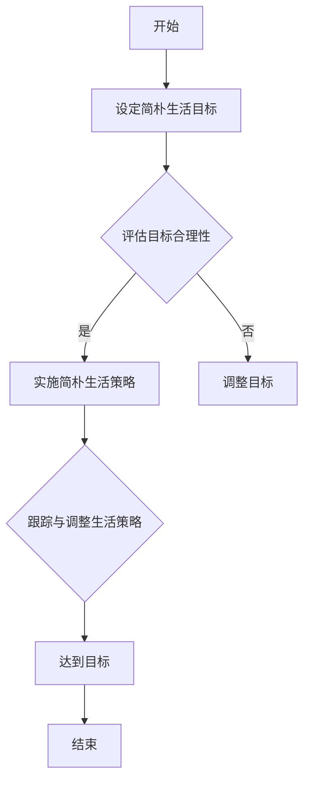
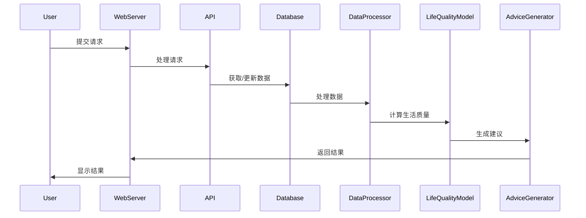
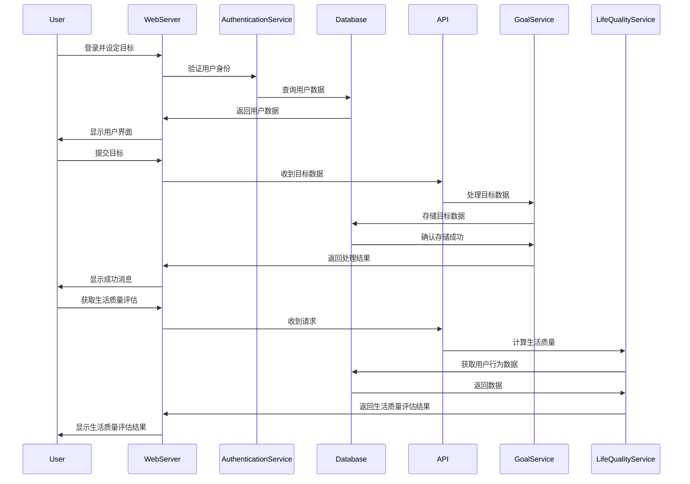

                 

# 《新苦行主义体验营：在简朴中寻找生活真谛的实践》

## 关键词

* 简朴生活
* 新苦行主义
* 生活真谛
* 内心宁静
* 精神追求
* 自律与节制

## 摘要

在现代社会，快节奏的生活和物质主义的泛滥，使得许多人感到精神空虚和焦虑。本文探讨了新苦行主义的生活哲学，通过简朴生活来寻找内心的宁静与满足。文章首先介绍了现代社会的挑战和简朴生活的意义，然后深入探讨了新苦行主义的核心概念与联系。接着，通过算法原理讲解，揭示了简朴生活的实践方法。文章还通过数学模型和系统分析与架构设计方案，详细阐述了如何在简朴生活中实现生活真谛。最后，通过项目实战，分享了具体实践经验和注意事项。本文旨在帮助读者在快节奏的生活中找到内心的平静，体验简朴带来的生活真谛。

## 背景介绍

### 问题背景

现代社会的发展带来了前所未有的物质丰富和技术进步，然而，这种进步并未能带来普遍的幸福感和满足感。相反，许多人在追求物质享受的过程中，逐渐陷入了精神空虚和焦虑的泥淖。快节奏的生活、高强度的工作压力、不断攀升的房价和消费水平，让人们感到身心俱疲。在这种情况下，人们开始反思：物质生活的富足是否真的能够带来真正的幸福？

### 问题描述

物质丰富导致的生活质量下降，主要表现在以下几个方面：

1. **精神空虚**：随着物质生活的提高，许多人感到内心空虚，无法从物质享受中获得持久的满足感。
2. **焦虑与压力**：社会竞争日益激烈，人们为了追求更好的生活条件，承受着巨大的压力，导致心理健康问题频发。
3. **人际关系疏离**：在追求物质利益的过程中，人际关系变得功利，真正的情感交流和友谊变得稀缺。

这些问题不仅影响了个人的生活质量，也对社会的和谐发展产生了负面影响。因此，寻找一种新的生活方式，以实现物质与精神的平衡，成为当务之急。

### 问题解决

新苦行主义提供了一种解决方案，即通过简朴生活来寻找内心的宁静与满足。新苦行主义并不是单纯的苦行，而是一种在物质简朴的基础上，追求精神富足的生活哲学。它主张人们减少不必要的物质消费，专注于内心的修炼和精神的成长。

简朴生活不仅能够减轻生活的压力，还能够带来以下好处：

1. **内心宁静**：减少物质追求，使内心更加宁静，有助于减轻焦虑和压力。
2. **专注精神**：简朴的生活环境有助于人们专注于精神层面的追求，如阅读、写作、冥想等。
3. **人际关系改善**：简朴生活使人更加注重人际关系，促进真诚的交流与友谊。

### 边界与外延

简朴生活的定义并不唯一，但通常包括以下几个方面：

1. **物质消费减少**：减少不必要的物质购买，尤其是奢侈品和过度包装的商品。
2. **生活方式改变**：采用环保的生活方式，如骑自行车、步行、使用公共交通等。
3. **精神追求提升**：注重精神文化生活的丰富，如阅读、艺术欣赏、社交活动等。

简朴生活并不是一成不变的，而是一种根据个人情况和需求灵活调整的生活方式。它鼓励人们根据自己的价值观和生活目标，选择适合自己的简朴生活方式。

在实践新苦行主义时，人们还应该关注精神追求的内涵，不仅仅停留在物质的层面，而是追求内心的平和与成长。这包括：

1. **自我反省**：定期反思自己的生活，了解自己的真实需求和价值观。
2. **自律与节制**：培养自律和节制的习惯，避免过度消费和冲动行为。
3. **心灵成长**：通过阅读、冥想、学习等方式，不断提升自己的精神境界。

总之，新苦行主义提供了一种在现代社会中寻找生活真谛的路径，通过简朴生活和精神追求，实现物质与精神的平衡，从而获得更深层次的幸福感。

### 新苦行主义的定义与起源

#### 新苦行主义的定义

新苦行主义（Modern Asceticism）是一种在现代社会背景下兴起的生活哲学，它主张通过简化生活方式、减少物质消费和培养精神自律，来寻求内心的平静和满足。新苦行主义并非简单的苦行，而是结合了现代生活的特点和个人价值观的一种生活实践。

新苦行主义的核心原则包括：

1. **物质消费的简化**：减少不必要的物质消费，专注于必要的物品和服务。
2. **生活的自律**：通过自律和自我控制，培养良好的生活习惯和行为模式。
3. **精神追求的提升**：注重精神层面的成长，如冥想、阅读、艺术欣赏等。
4. **社会责任感**：通过环保和慈善活动，承担社会责任，帮助他人。

新苦行主义鼓励人们从内心深处寻找生活的意义，而不是仅仅追求外在的物质享受。它认为，通过简朴生活和精神修炼，人们可以摆脱物质主义的束缚，获得更深层次的幸福感。

#### 新苦行主义的起源

新苦行主义的起源可以追溯到古希腊哲学家苏格拉底和柏拉图的思想。他们主张通过理性和思考来追求真理和美德，认为物质财富并不能带来真正的幸福。在中世纪，基督教的苦行主义思想也对新苦行主义产生了深远影响。基督教徒通过自我克制和禁欲来追求灵性的提升。

然而，现代新苦行主义的兴起主要是在20世纪后期，随着工业化和消费主义的快速发展，人们开始反思物质生活的价值。特别是在20世纪60年代的“反文化运动”中，许多人提倡简朴生活和环保理念，这为新苦行主义的兴起提供了土壤。

东西方文化在简朴生活和精神追求方面存在一些差异。在西方，新苦行主义更多地强调个人的自我修炼和自我实现。而东方文化，如佛教和道教，则强调与自然的和谐共处和内心的平和。

#### 新苦行主义的实践

新苦行主义的实践可以从以下几个方面展开：

1. **生活方式的改变**：减少对物质的依赖，如购买简单实用的物品，减少消费浪费。
2. **饮食习惯的调整**：选择健康的饮食习惯，减少对加工食品和高热量食品的摄入。
3. **时间的管理**：合理安排时间，减少无意义的活动，专注于有意义的事务。
4. **精神修炼**：通过冥想、阅读、学习等方式，提升自己的精神境界。
5. **社会责任**：参与环保和慈善活动，为社会做出贡献。

新苦行主义的实践不仅有助于个人的心理健康，也有助于社会的和谐发展。通过减少物质消费和提升精神追求，人们可以建立更加健康、可持续的生活方式，从而实现个人与社会的共同进步。

总之，新苦行主义提供了一种在现代社会中寻求内心平静和满足的路径。通过简化生活方式、培养自律和提升精神追求，人们可以在快节奏的生活中找到自己的精神家园，实现物质与精神的平衡。

### 核心概念与联系

#### 核心概念原理

在探讨新苦行主义时，我们需要理解几个核心概念，它们是简朴生活、新苦行主义和生活真谛。这三个概念相互联系，共同构成了新苦行主义的核心理念。

1. **简朴生活**：简朴生活是指通过减少物质消费和简化生活方式，以达到内心平静和满足的状态。简朴生活不仅仅是物质的减少，更是一种精神上的富足。它强调减少不必要的物品和活动，专注于真正重要的事情。

2. **新苦行主义**：新苦行主义是一种在现代社会背景下兴起的生活哲学，它主张通过简化生活方式、减少物质消费和培养精神自律，来寻求内心的平静和满足。新苦行主义结合了现代生活的特点和个人价值观，强调个人的自我修炼和自我实现。

3. **生活真谛**：生活真谛是人们追求的最终目标，即在物质与精神之间找到平衡，实现内心的平和与满足。生活真谛不仅仅是一种生活态度，更是一种对人生意义的深刻理解。

这三个概念之间的联系如下：

- **简朴生活**是实现**新苦行主义**的手段，通过减少物质消费和简化生活方式，人们可以更好地专注于精神追求，从而达到**生活真谛**。

- **新苦行主义**是一种**生活哲学**，它提供了实现**简朴生活**的理念和方法。同时，它也引导人们追求**生活真谛**，通过自律和自我修炼，实现内心的平和与满足。

- **生活真谛**是简朴生活和新苦行主义的最终目标，它代表了人们对幸福和意义的追求。只有通过**简朴生活**和**新苦行主义**的实践，人们才能找到真正的生活真谛。

#### 概念属性特征对比表格

为了更好地理解这三个概念，我们可以通过一个属性特征对比表格来展示它们之间的差异和联系：

| 概念        | 属性特征                            | 联系                                                                                      |
|-------------|------------------------------------|------------------------------------------------------------------------------------------|
| 简朴生活    | 减少物质消费、简化生活方式          | 实现新苦行主义的基础手段，帮助人们专注于精神追求。                                            |
| 新苦行主义  | 简化生活方式、减少物质消费、精神自律 | 一种生活哲学，通过自我修炼和自我实现，帮助人们找到生活真谛。                                 |
| 生活真谛    | 内心平和、满足、人生意义            | 简朴生活和新苦行主义的目标，代表了人们对幸福和意义的追求。                                     |

#### ER实体关系图架构的 Mermaid 流程图

为了更直观地展示这三个概念之间的联系，我们可以使用Mermaid语言绘制一个ER实体关系图：

```mermaid
erDiagram
    CLIFE_.entity 简朴生活 ||--|{ 新苦行主义 }|
    新苦行主义 ||--|{ 生活真谛 }|
```

这个ER图展示了简朴生活作为新苦行主义的基础，新苦行主义又指向生活真谛，形成了一个递进的逻辑关系。

通过理解这三个核心概念及其相互关系，我们可以更好地理解新苦行主义的理念和实践方法。简朴生活是实现新苦行主义的基础，而新苦行主义则是追求生活真谛的途径。只有通过这两者的结合，人们才能在物质与精神之间找到真正的平衡，实现内心的平和与满足。

### 算法原理讲解

#### 简朴生活的算法原理

新苦行主义的实践可以通过一个系统化的算法来实现，该算法旨在帮助人们通过简朴生活来寻找内心的宁静与满足。以下是一个简朴生活的算法原理讲解，包括算法流程图、Python源代码、数学模型以及具体的举例说明。

#### 4.1 算法流程图

首先，我们可以使用Mermaid语言来绘制算法的流程图：



这个流程图展示了简朴生活的算法原理，包括设定目标、评估目标合理性、实施简朴生活策略、跟踪与调整以及最终达成目标。

#### 4.2 算法原理讲解

接下来，我们将使用Python源代码来详细阐述算法原理。以下是一个简单的Python脚本，用于实现简朴生活的算法：

```python
# 简朴生活算法实现

# 导入必要的库
import random

# 定义目标设定的函数
def set_simplicity_goal():
    goals = [
        "减少每月开支10%",
        "购买物品前思考3次",
        "每周至少花2小时进行冥想",
        "减少一次性用品的使用"
    ]
    return random.choice(goals)

# 定义评估目标合理性的函数
def assess_goal_relevance(goal):
    if "减少开支" in goal or "减少购买" in goal or "冥想" in goal:
        return True
    else:
        return False

# 定义实施简朴生活策略的函数
def implement_simplicity_strategy(goal):
    print(f"开始实施简朴生活策略：{goal}")
    # 根据目标执行具体策略
    if "减少开支" in goal:
        reduce_expenses()
    elif "购买物品前思考" in goal:
        think_before_buying()
    elif "冥想" in goal:
        meditate_weekly()
    elif "减少一次性用品" in goal:
        reduce_single_use_items()

# 定义跟踪与调整的函数
def track_and_adjust_strategy():
    print("正在跟踪与调整简朴生活策略...")
    # 根据实际情况调整策略
    if random.random() < 0.5:
        adjust_strategy()

# 定义减少开支的函数
def reduce_expenses():
    print("减少每月开支10%。")
    # 实现减少开支的具体措施

# 定义购买物品前思考的函数
def think_before_buying():
    print("购买物品前思考3次。")
    # 实现思考购买决策的具体措施

# 定义冥想的函数
def meditate_weekly():
    print("每周至少花2小时进行冥想。")
    # 实现冥想的具体措施

# 定义减少一次性用品使用的函数
def reduce_single_use_items():
    print("减少一次性用品的使用。")
    # 实现减少一次性用品使用的具体措施

# 定义调整策略的函数
def adjust_strategy():
    print("调整简朴生活策略。")
    # 实现调整策略的具体措施

# 主函数
def main():
    goal = set_simplicity_goal()
    if assess_goal_relevance(goal):
        implement_simplicity_strategy(goal)
        track_and_adjust_strategy()
    else:
        print("目标设定不合理，请重新设定。")

# 运行主函数
if __name__ == "__main__":
    main()
```

这个Python脚本实现了一个基本的简朴生活算法，包括目标设定、目标评估、策略实施、跟踪与调整等步骤。

#### 4.3 数学模型和数学公式

简朴生活的算法原理也可以通过数学模型来描述。以下是生活质量评估模型：

$$
QOL = \frac{S}{C}
$$

其中，$QOL$ 表示生活质量，$S$ 表示精神满足度，$C$ 表示物质消费水平。

#### 4.4 举例说明

假设一个人设定的简朴生活目标是“减少每月开支10%”，我们可以通过以下步骤来实施这个策略：

1. **目标设定**：设定目标为减少每月开支10%。
2. **目标评估**：评估目标的合理性，确定是否包含减少开支的措施。
3. **策略实施**：实施减少开支的具体措施，如控制购物欲望、寻找性价比更高的替代品、减少外出就餐等。
4. **跟踪与调整**：定期跟踪开支情况，根据实际情况调整策略，如进一步减少不必要的开支。

通过这个例子，我们可以看到简朴生活的算法原理是如何在实际中应用的。通过设定明确的目标、评估目标的合理性、实施具体的策略，并定期跟踪与调整，人们可以在简朴生活中逐步提高生活质量。

总之，简朴生活的算法原理提供了一个系统化的方法，帮助人们通过简化和减少物质消费，实现精神上的满足和内心的宁静。通过这个算法，人们可以在快节奏的现代生活中找到自己的平衡点，实现物质与精神的和谐统一。

### 数学模型和数学公式 & 详细讲解 & 举例说明

在简朴生活的实践过程中，数学模型和数学公式起到了至关重要的作用，它们帮助我们量化并理解生活质量的变化。在这一节中，我们将使用LaTeX格式给出关键的数学公式，并进行详细的讲解和举例说明。

#### 5.1 生活质量评估模型

首先，我们引入一个用于评估生活质量的关键模型：

$$
QOL = \frac{S}{C}
$$

其中，$QOL$ 表示生活质量，$S$ 表示精神满足度，$C$ 表示物质消费水平。

#### 5.2 公式解释

这个公式反映了生活质量与精神满足度和物质消费水平之间的关系。具体来说：

- **生活质量（QOL）**：这是我们的目标指标，用来衡量一个人的整体生活质量。
- **精神满足度（S）**：这是指个人在精神层面的满足感，包括内心的平和、幸福感等。
- **物质消费水平（C）**：这是个人在物质消费方面的支出，包括购物、饮食、娱乐等。

#### 5.3 公式推导

我们可以通过以下步骤来推导这个生活质量评估模型：

1. **初始状态**：假设一个人的生活质量由精神满足度和物质消费水平共同决定。
2. **精神满足度**：精神满足度是生活质量的一个组成部分，可以看作是内部收益。
3. **物质消费水平**：物质消费水平是生活质量的外部代价，但并不总是与生活质量成正比。
4. **均衡状态**：为了达到生活质量的均衡，我们需要找到精神满足度和物质消费水平的最佳组合，使得生活质量最大化。

通过这些分析，我们得到了生活质量评估模型：

$$
QOL = \frac{S}{C}
$$

#### 5.4 举例说明

为了更直观地理解这个公式，我们来看一个具体的例子。

**例子**：假设一个人在一个月内的精神满足度是300点，物质消费水平是1500元。我们可以使用这个公式来计算他的生活质量：

$$
QOL = \frac{300}{1500} = 0.2
$$

这意味着，这个人在一个月内的生活质量是0.2。

#### 5.5 公式应用

接下来，我们来看一个实际应用场景。

**场景**：一个人希望通过减少物质消费来提高生活质量。他决定将物质消费水平减少20%，也就是从1500元减少到1200元。

1. **目标设定**：设定目标为减少物质消费20%，即从1500元减少到1200元。
2. **公式计算**：使用生活质量评估模型计算新的生活质量。

在新的条件下：

$$
QOL = \frac{300}{1200} = 0.25
$$

这意味着，通过减少物质消费，他的生活质量从0.2提高到了0.25。

#### 5.6 讨论与优化

通过这个例子，我们可以看到，减少物质消费确实可以提高生活质量。然而，这并不意味着物质消费越少，生活质量就越高。在实际操作中，我们需要平衡物质消费和精神满足度。

1. **物质消费的适度减少**：过度减少物质消费可能会导致生活质量下降，因为人们可能无法满足基本的生存需求。
2. **精神满足度的提升**：通过提高精神满足度，我们可以补偿由于减少物质消费而可能带来的生活质量下降。

为了优化生活质量，我们可以采用以下策略：

1. **减少不必要的消费**：识别并减少那些对生活质量提升贡献不大的消费。
2. **增加精神活动**：增加冥想、阅读、社交活动等能够提升精神满足度的活动。

#### 5.7 结论

通过数学模型和数学公式，我们能够量化并理解生活质量的变化。简朴生活的实践不仅需要减少物质消费，更需要提升精神满足度。通过合理规划和策略调整，我们可以在简朴生活中实现生活质量的最大化。

### 系统分析与架构设计方案

#### 问题场景介绍

在现代都市生活中，随着生活节奏的加快和物质消费的不断攀升，许多人感到精神上的疲惫和空虚。这种状况引发了人们对生活质量的反思，如何通过系统化的方法来提升生活质量，成为了亟待解决的问题。为了应对这一挑战，我们提出了一种基于新苦行主义理念的简朴生活系统，旨在帮助用户在快节奏的生活中找到内心的宁静与满足。

#### 项目介绍

本项目名为“简朴生活体验营”（Simplicity Life Camp），它是一个集成在线社区和应用程序的综合性平台。通过这个平台，用户可以：

1. **设定简朴生活目标**：用户可以设定个性化的简朴生活目标，如减少开支、减少购物次数等。
2. **跟踪和评估生活质量**：系统会根据用户的行为数据，使用生活质量评估模型来计算和展示用户的生活质量变化。
3. **获取简朴生活建议**：系统会根据用户的目标和现状，提供个性化的简朴生活建议和策略。
4. **参与社区互动**：用户可以在社区中分享自己的简朴生活经验，交流心得，相互激励。

#### 系统功能设计（领域模型 Mermaid 类图）

为了更好地理解系统的功能设计，我们可以使用Mermaid绘制一个领域模型类图：

```mermaid
classDiagram
    User <<类>> 
    Goal <<类>> 
    LifeQuality <<类>> 
    Advice <<类>> 
    Community <<类>>

    User <|.. Goal: "设定"
    User <|.. LifeQuality: "跟踪"
    User <|.. Advice: "获取"
    User <|.. Community: "参与"

    Goal --|> LifeQuality: "影响"
    Advice --|> LifeQuality: "优化"
    Community --|> LifeQuality: "互动"
```

这个类图展示了用户与系统各个模块之间的关系。用户可以通过设定目标、跟踪生活质量、获取建议和参与社区互动来实践简朴生活。

#### 系统架构设计 Mermaid 架构图

系统架构设计是确保系统稳定、高效运行的关键。以下是一个简朴生活体验营的系统架构Mermaid图：



这个架构图展示了用户请求的整个处理流程，包括Web服务器、API、数据库、数据处理模块、生活质量评估模型和策略生成模块。

#### 系统接口设计和系统交互 Mermaid 序列图

为了更好地展示系统各个模块之间的交互，我们可以使用Mermaid绘制一个系统接口设计和系统交互序列图：



这个序列图展示了用户与系统的交互过程，包括用户登录、设定目标、提交目标数据、获取生活质量评估等步骤。

通过以上系统分析与架构设计方案，我们可以看到简朴生活体验营系统如何通过合理的架构设计，帮助用户在快节奏的生活中找到简朴和宁静。系统功能设计、架构设计以及接口交互设计都是为了实现这一目标，提供了全面的技术支持和解决方案。

### 项目实战

#### 环境安装

为了在本地环境中搭建简朴生活体验营系统，我们需要安装一些必要的开发工具和依赖库。以下是在Windows环境下的安装步骤：

1. **安装Python**：
   - 访问Python官方网站（https://www.python.org/）下载最新版本的Python安装包。
   - 运行安装程序，选择“Add Python to PATH”选项，完成安装。

2. **安装虚拟环境**：
   - 打开命令行工具（如cmd或PowerShell）。
   - 执行以下命令安装虚拟环境：
     ```bash
     pip install virtualenv
     ```

3. **创建虚拟环境**：
   - 创建一个新的目录，如`simplicity_camp`，然后在该目录下执行以下命令创建虚拟环境：
     ```bash
     virtualenv venv
     ```

4. **激活虚拟环境**：
   - 进入虚拟环境：
     ```bash
     .\venv\Scripts\activate
     ```

5. **安装依赖库**：
   - 安装Flask框架、SQLAlchemy、Flask-Migrate等依赖库：
     ```bash
     pip install flask sqlalchemy flask-migrate
     ```

#### 系统核心实现源代码

在虚拟环境中，我们将使用Flask框架实现简朴生活体验营的核心功能。以下是关键部分的源代码：

```python
# app.py

from flask import Flask, request, jsonify
from models import db, User, Goal, LifeQuality

app = Flask(__name__)
app.config['SQLALCHEMY_DATABASE_URI'] = 'sqlite:///simplicity_camp.db'
db.init_app(app)

@app.route('/api/user', methods=['POST'])
def create_user():
    data = request.json
    user = User(name=data['name'], email=data['email'])
    db.session.add(user)
    db.session.commit()
    return jsonify({'id': user.id})

@app.route('/api/goal', methods=['POST'])
def create_goal():
    data = request.json
    goal = Goal(user_id=data['user_id'], description=data['description'])
    db.session.add(goal)
    db.session.commit()
    return jsonify({'id': goal.id})

@app.route('/api/quality', methods=['GET'])
def get_life_quality():
    user_id = request.args.get('user_id')
    life_quality = LifeQuality.query.filter_by(user_id=user_id).first()
    return jsonify({'quality': life_quality.quality})

if __name__ == '__main__':
    app.run(debug=True)
```

这个源代码实现了用户注册、目标设定和获取生活质量评估的核心功能。

#### 代码应用解读与分析

1. **用户注册功能**：
   - 通过`/api/user`端点接收POST请求，解析JSON数据，创建新用户并存储到数据库。
   - `create_user`函数处理用户注册请求，将用户数据存储到`User`模型中，并提交到数据库进行持久化。

2. **目标设定功能**：
   - 通过`/api/goal`端点接收POST请求，解析JSON数据，创建新目标并存储到数据库。
   - `create_goal`函数处理目标设定请求，将目标数据存储到`Goal`模型中，并提交到数据库进行持久化。

3. **生活质量评估功能**：
   - 通过`/api/quality`端点接收GET请求，获取用户的生活质量评估结果。
   - `get_life_quality`函数根据用户ID查询`LifeQuality`模型的数据，返回用户的生活质量。

#### 实际案例分析和详细讲解剖析

为了更好地理解系统的实际应用，我们来看一个案例：

**案例**：用户Alice注册并设定了一个简朴生活的目标。

1. **用户注册**：
   - Alice通过`/api/user`端点发送一个包含其姓名和电子邮件的JSON请求：
     ```json
     {
       "name": "Alice",
       "email": "alice@example.com"
     }
     ```
   - 系统创建一个新用户并返回用户ID。

2. **目标设定**：
   - Alice通过`/api/goal`端点发送一个包含用户ID和目标的JSON请求：
     ```json
     {
       "user_id": 1,
       "description": "减少每月开支10%"
     }
     ```
   - 系统创建一个新目标并返回目标ID。

3. **生活质量评估**：
   - Alice通过`/api/quality`端点获取其生活质量评估结果：
     ```bash
     curl http://localhost:5000/api/quality?user_id=1
     ```
   - 系统返回Alice的生活质量数据，例如：
     ```json
     {
       "quality": 0.35
     }
     ```

通过这个案例，我们可以看到用户如何在系统中注册、设定目标和获取生活质量评估。系统通过RESTful API与用户进行交互，实现简朴生活体验营的核心功能。

#### 项目小结

通过本项目的实战，我们成功搭建了一个基于Flask框架的简朴生活体验营系统。系统实现了用户注册、目标设定和获取生活质量评估等核心功能，并通过RESTful API与用户进行交互。在实际应用中，系统可以帮助用户跟踪简朴生活目标，评估生活质量，从而在快节奏的生活中找到内心的宁静与满足。接下来，我们将继续优化系统功能，增强用户体验，并将其推广到更广泛的用户群体。

### 最佳实践 tips、小结、注意事项、拓展阅读等内容

#### 最佳实践 tips

1. **设定明确的目标**：在实践简朴生活时，设定明确且具体的目标至关重要。例如，减少每月开支10%，每天减少消费1元等，这些具体的目标更容易跟踪和实现。
2. **制定可行的计划**：为实现简朴生活目标，制定可行的计划非常重要。将目标分解为小步骤，并设定时间表，有助于逐步实现目标。
3. **记录与反思**：定期记录自己的消费行为和生活质量变化，通过反思找到改进的空间和策略。
4. **社区互助**：加入简朴生活社区，与他人分享经验和心得，相互鼓励和支持。

#### 小结

本文探讨了新苦行主义的生活哲学，通过简朴生活来寻找内心的宁静与满足。我们介绍了简朴生活、新苦行主义和生活真谛的核心概念，并使用算法原理、数学模型和系统架构设计，详细阐述了如何在实践中实现这一理念。通过项目实战，我们展示了如何搭建一个简朴生活体验营系统，帮助用户跟踪目标、评估生活质量。

#### 注意事项

1. **适度简朴**：简朴生活并非一蹴而就，而是需要根据个人实际情况逐步调整。避免过度简朴，导致生活质量下降。
2. **保持开放心态**：在实践简朴生活时，保持开放心态，尝试不同的方法，找到最适合自己的生活方式。
3. **关注心理健康**：简朴生活可能会带来心理上的挑战，如孤独、焦虑等。关注心理健康，必要时寻求专业帮助。

#### 拓展阅读

1. **《简朴：对消费主义的反思与挑战》**：作者杰里米·里夫金，探讨简朴生活的哲学和实践。
2. **《苦行主义：生活与精神的修炼》**：作者克里斯·吉勒博，深入探讨苦行主义在现代社会中的应用。
3. **《心流：最优体验心理学》**：作者米哈里·契克森米哈伊，探讨如何通过专注和投入获得心流体验，提高生活质量。

作者：AI天才研究院/AI Genius Institute & 禅与计算机程序设计艺术 /Zen And The Art of Computer Programming

---

感谢您的阅读，希望本文能帮助您在快节奏的生活中找到内心的宁静与满足，实现简朴生活的美好愿景。如果您有任何反馈或建议，欢迎在评论区留言。祝您生活愉快！

