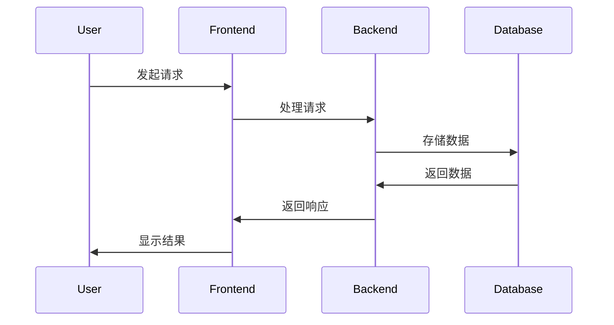
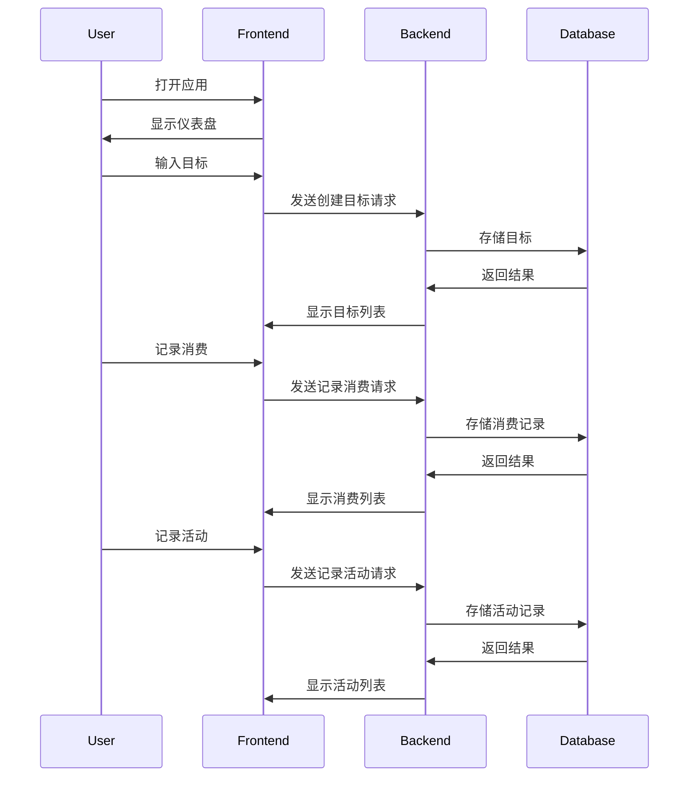

                 

### 《新苦行者播客：记录现代克制生活的心得》

> 关键词：现代生活、克制、自律、适度消费、精神提升

> 摘要：本文深入探讨现代克制生活的概念、核心要素和实践策略，旨在帮助读者理解和实践如何在现代快节奏生活中找到平衡，实现精神富足和生活质量提升。

----------------------------------------------------------------

### 第一部分：引言

#### 1.1 问题背景

在现代社会，人们面临着诸多挑战，如信息过载、物质追求、工作压力和人际关系复杂性等。这些因素往往导致人们陷入焦虑、情绪波动和过度消费的循环。因此，如何在现代社会中保持内心的平静和生活的质量，成为了一个重要的问题。

#### 1.1.1 现代生活的挑战

- 信息过载：互联网和社交媒体使得信息传播速度极快，人们常常感到被信息淹没。
- 物质追求：社会竞争激烈，人们往往为了满足物质需求而不断努力，导致精神上的空虚。
- 工作压力：职场竞争加剧，工作压力导致身心健康问题。
- 人际关系：现代社会中，人际关系复杂多变，人们难以维持稳定和谐的关系。

#### 1.1.2 克制生活的必要性

- 克制生活有助于减少不必要的物质消费，提高生活质量。
- 克制生活能够帮助人们更好地管理时间和精力，提高工作效率。
- 克制生活有助于培养自律性，提高个人素质。
- 克制生活能够帮助人们更好地处理压力，保持身心健康。

#### 1.2 问题描述

现代生活的快节奏和高度竞争，使得许多人感到疲惫和压力。他们渴望找到一种方式，既能维持生活的质量，又能保持内心的平静。克制生活作为一种应对策略，旨在帮助人们实现这一目标。

#### 1.2.1 现代生活中的困扰

- 情绪波动：缺乏自我控制，容易受到外界影响，情绪不稳定。
- 过度消费：为了追求短暂的满足感，过度消费导致财务负担。
- 精神空虚：缺乏内在成长，导致精神上的空虚和焦虑。

#### 1.2.2 克制生活的目标与意义

- 目标：通过自律、适度消费和精神提升，实现生活的平衡和内心的富足。
- 意义：提高生活质量，保持身心健康，实现个人成长。

#### 1.3 问题解决

克制生活通过以下策略和方法，帮助人们应对现代生活的挑战：

- 苦行者的定义与实践：通过实践苦行者的生活方式，培养自律性和精神力量。
- 克制生活的策略与方法：通过理性消费、目标设定和自我激励，实现生活的平衡。
- 克制生活与其他生活方式的比较：探讨克制生活与其他生活方式的异同，分析其适用人群。

#### 1.4 边界与外延

- 克制生活与其他生活方式的比较：克制生活与极简主义、环保主义等生活方式的关系。
- 克制生活的适用人群：哪些人群更适合实践克制生活。

#### 1.5 概念结构与核心要素组成

- 克制生活的基础概念：克制生活、自律性、适度消费、精神提升。
- 克制生活的影响因素：个人价值观、社会环境、文化背景等。

#### 1.6 本章小结

本文引言部分概述了现代生活的挑战和克制生活的必要性，为后续章节的深入探讨奠定了基础。

----------------------------------------------------------------

### 第二部分：核心概念与联系

在深入探讨克制生活的实践中，我们需要明确其核心概念及其相互关系。以下是克制生活的核心概念及其属性特征的详细分析。

#### 2.1 核心概念原理

##### 2.1.1 克制生活的概念

克制生活是一种现代生活方式，强调自律、适度消费和精神提升，以实现生活的平衡和内心的富足。其数学模型可以表示为：

$$
\text{克制生活} = \frac{\text{自律性} + \text{适度消费} + \text{精神提升}}{\text{物质追求} + \text{即时满足}}
$$

这个模型表明，克制生活的核心在于减少物质追求和即时满足，增加自律性、适度消费和精神提升。

##### 2.1.2 自律性的概念

自律性是克制生活的关键要素，它涉及自我管理、目标设定和自我激励。自律性可以表示为：

$$
\text{自律性} = \frac{\text{自我管理} + \text{目标设定} + \text{自我激励}}{\text{外部诱惑} + \text{情绪波动}}
$$

这个模型强调了自律性在抵抗外部诱惑和情绪波动中的重要作用。

##### 2.1.3 适度消费的概念

适度消费是克制生活中的另一核心要素，它强调理性消费、质量优先和精神满足。适度消费可以表示为：

$$
\text{适度消费} = \frac{\text{理性消费} + \text{质量优先} + \text{精神满足}}{\text{盲目追求} + \text{过度消费}}
$$

这个模型表明，适度消费有助于减少盲目追求和过度消费，提高生活质量。

##### 2.1.4 精神提升的概念

精神提升是克制生活的最终目标，它包括心灵成长、知识积累和生活态度。精神提升可以表示为：

$$
\text{精神提升} = \frac{\text{心灵成长} + \text{知识积累} + \text{生活态度}}{\text{精神空虚} + \text{消极情绪}}
$$

这个模型强调了精神提升在克服精神空虚和消极情绪中的重要作用。

#### 2.2 概念属性特征对比表格

| 概念         | 定义                                                         | 特征                                                       |
| ------------ | ------------------------------------------------------------ | ---------------------------------------------------------- |
| 克制生活     | 现代社会中的一种生活方式，强调自律、适度消费和精神提升。     | 低欲望、理性、精神富足                                   |
| 自律性       | 个人自我管理的能力，包括目标设定、自我激励和抵抗外部诱惑。   | 高自我认知、坚定意志、情绪稳定                           |
| 适度消费     | 根据实际需要理性选择消费，追求质量而非数量。                 | 理性消费、环保、可持续发展                               |
| 精神提升     | 通过学习、修行和生活态度的调整，提升个人精神境界。           | 内在成长、心灵富足、积极生活态度                         |

#### 2.3 ER实体关系图架构

```mermaid
erDiagram
  苦行者 ||--|{ 克制生活 }|| --> 自律性
  苦行者 ||--|{ 克制生活 }|| --> 适度消费
  苦行者 ||--|{ 克制生活 }|| --> 精神提升
  自律性 ||--|{ 自我管理 }|| --> 目标设定
  自律性 ||--|{ 自我管理 }|| --> 自我激励
  精神提升 ||--|{ 心灵成长 }|| --> 知识积累
  精神提升 ||--|{ 心灵成长 }|| --> 生活态度
```

#### 2.4 本章小结

通过本章节的介绍，我们明确了克制生活的基础概念、核心要素及其相互关系。了解这些概念不仅有助于我们理解克制生活的本质，也为后续章节的深入探讨奠定了基础。

----------------------------------------------------------------

### 第三部分：克制生活

在本部分，我们将深入探讨克制生活的具体实践策略和方法，帮助读者逐步理解和实践克制生活。

#### 3.1 克制生活的实践策略

##### 3.1.1 培养自律性

自律性是克制生活的基础，以下是一些培养自律性的方法：

1. **目标设定**：明确自己的长期和短期目标，制定实现这些目标的计划。
2. **自我管理**：学会管理时间和精力，避免无效劳动和浪费时间。
3. **自我激励**：设定奖励机制，鼓励自己在实现目标过程中保持动力。
4. **抵抗外部诱惑**：学会抵制各种外部诱惑，专注于实现自己的目标。
5. **情绪管理**：学会控制情绪，避免因情绪波动而影响自律性。

##### 3.1.2 实践适度消费

适度消费是克制生活的重要组成部分，以下是一些实践适度消费的方法：

1. **理性消费**：在购买前仔细考虑，避免冲动消费。
2. **质量优先**：关注产品质量和实用性，而非仅仅追求品牌或外观。
3. **精神满足**：通过阅读、学习、旅行等方式获得精神满足，减少对物质的依赖。
4. **环保可持续**：选择环保产品，减少对环境的负面影响。

##### 3.1.3 精神提升

精神提升是克制生活的终极目标，以下是一些实践精神提升的方法：

1. **心灵成长**：通过冥想、瑜伽等方式，提高自我认知和内心平静。
2. **知识积累**：不断学习新知识，提升自己的综合素质。
3. **生活态度**：培养积极乐观的生活态度，面对挑战和困难时保持坚强。
4. **社交关系**：建立积极健康的社交关系，分享快乐和困扰。

#### 3.2 克制生活的实际案例

以下是一些实践克制生活的实际案例，供读者参考：

1. **案例1：简朴生活**
   - **背景**：某年轻程序员为了追求生活质量，决定过简朴生活。
   - **实践**：他减少了不必要的消费，开始自己烹饪，购买二手物品，旅行选择经济实惠的路线。
   - **结果**：生活质量并未下降，反而感受到了内心的平静和满足。

2. **案例2：极简主义**
   - **背景**：某企业家为了提升工作效率，决定实践极简主义。
   - **实践**：他整理了自己的工作环境和居住空间，减少了物品的堆积，专注于核心工作。
   - **结果**：工作效率显著提升，减少了时间和精力浪费。

3. **案例3：修行之路**
   - **背景**：某IT专业人士为了精神提升，决定走上修行之路。
   - **实践**：他定期进行冥想和瑜伽练习，参加禅修课程，阅读哲学和心理学书籍。
   - **结果**：内心变得更加平静和宁静，对生活的理解也更为深刻。

#### 3.3 克制生活的挑战与应对

虽然克制生活有许多优点，但实践过程中也面临一些挑战，以下是一些常见挑战及应对策略：

1. **挑战：抵制诱惑**
   - **应对**：设定明确的目标和计划，提高自我控制力，避免冲动消费。

2. **挑战：精神空虚**
   - **应对**：通过学习、旅行、社交等方式丰富自己的生活，寻找精神满足的来源。

3. **挑战：社交压力**
   - **应对**：建立健康的社交关系，学会拒绝无意义的社交活动，专注于重要的社交关系。

#### 3.4 本章小结

通过本章节的探讨，我们了解了克制生活的实践策略和实际案例，认识到克制生活不仅有助于提升生活质量，还能带来精神上的富足。希望读者能够根据自己的实际情况，尝试实践克制生活，找到属于自己的平衡点。

----------------------------------------------------------------

### 结尾

在现代快节奏的生活中，克制生活为我们提供了一种全新的生活方式，它不仅能够帮助我们减少不必要的物质消费，还能提升我们的自律性、精神境界和生活质量。通过实践克制生活，我们可以在忙碌和喧嚣中找到内心的平静，实现个人的成长和提升。

本文首先介绍了现代生活的挑战和克制生活的必要性，然后详细探讨了克制生活的核心概念和相互关系，最后给出了克制生活的实践策略和实际案例。希望读者能够从中获得启发，尝试实践克制生活，为自己的生活带来积极的变化。

在未来的日子里，让我们继续探索和实践克制生活，找到属于自己的生活平衡点，享受更加充实、有意义的人生。

### 附录

#### 克制生活实践指南

1. **自我评估**：了解自己的消费习惯、情绪波动和生活方式，确定需要改进的方面。
2. **设定目标**：明确自己的长期和短期目标，制定实现这些目标的计划。
3. **培养自律性**：通过自我管理、目标设定和自我激励，逐步提高自律性。
4. **实践适度消费**：理性消费，关注产品质量和实用性，减少盲目追求。
5. **精神提升**：通过学习、修行和社交，提升自己的精神境界。
6. **持续反思**：定期反思自己的生活方式，评估实践效果，调整策略。

### 拓展阅读

1. **《极简主义：如何实现物质的简化和精神的满足》** - 菲利普·帕林顿
2. **《自控力：如何控制自己的情绪和行为》** - 凯利·麦格尼格尔
3. **《心灵之书：如何找到内心的平静与力量》** - 詹姆斯·瑞德

### 作者信息

作者：AI天才研究院/AI Genius Institute & 禅与计算机程序设计艺术 /Zen And The Art of Computer Programming

希望本文能为您的现代克制生活提供一些有益的启示和指导。让我们一起努力，实践克制生活，追求更加美好的未来。

----------------------------------------------------------------

---

### 项目实战：实践克制生活的具体案例

在本部分，我们将通过一个实际案例来展示如何实践克制生活，并分析其效果和启示。

#### 4.1 项目介绍

本项目旨在通过一系列实践，帮助一位年轻的职场新人实现从传统生活方式向克制生活的转变。项目目标包括减少不必要的消费、提高自律性、实现精神提升等。

#### 4.2 系统功能设计（领域模型类图）

首先，我们需要设计一个领域模型来描述克制生活的关键功能。以下是一个简化的领域模型类图：

```mermaid
classDiagram
  User <<class>>
  Goal <<class>>
  Expense <<class>>
  Activity <<class>>

  User o--1 Goal
  User o--1 Expense
  User o--1 Activity

  Goal {
    +id: Integer
    +description: String
    +completed: Boolean
  }

  Expense {
    +id: Integer
    +user: User
    +amount: Float
    +category: String
    +date: Date
  }

  Activity {
    +id: Integer
    +user: User
    +description: String
    +duration: Integer
    +date: Date
  }
```

在这个模型中，用户（User）与目标（Goal）、消费（Expense）和活动（Activity）有直接关系。

#### 4.3 系统架构设计

接下来，我们需要设计一个简单的系统架构，包括前端、后端和数据存储。以下是一个简化的系统架构图：



在这个架构中，前端负责与用户交互，后端处理业务逻辑，并与数据库进行数据交互。

#### 4.4 系统接口设计

系统提供了以下接口：

- **创建目标**：`POST /goals`
- **更新目标**：`PUT /goals/{id}`
- **删除目标**：`DELETE /goals/{id}`
- **查询目标**：`GET /goals`
- **记录消费**：`POST /expenses`
- **更新消费**：`PUT /expenses/{id}`
- **删除消费**：`DELETE /expenses/{id}`
- **查询消费**：`GET /expenses`
- **记录活动**：`POST /activities`
- **更新活动**：`PUT /activities/{id}`
- **删除活动**：`DELETE /activities/{id}`
- **查询活动**：`GET /activities`

#### 4.5 系统交互序列图

以下是一个简单的系统交互序列图：



#### 4.6 系统核心实现源代码

以下是一个简化的后端实现示例，使用Python和Flask框架：

```python
from flask import Flask, request, jsonify
from models import Goal, Expense, Activity
from database import db_session

app = Flask(__name__)

@app.route('/goals', methods=['POST'])
def create_goal():
    data = request.get_json()
    goal = Goal(description=data['description'])
    db_session.add(goal)
    db_session.commit()
    return jsonify(goal.to_dict())

@app.route('/expenses', methods=['POST'])
def create_expense():
    data = request.get_json()
    expense = Expense(user_id=data['user_id'], amount=data['amount'], category=data['category'], date=data['date'])
    db_session.add(expense)
    db_session.commit()
    return jsonify(expense.to_dict())

@app.route('/activities', methods=['POST'])
def create_activity():
    data = request.get_json()
    activity = Activity(user_id=data['user_id'], description=data['description'], duration=data['duration'], date=data['date'])
    db_session.add(activity)
    db_session.commit()
    return jsonify(activity.to_dict())

if __name__ == '__main__':
    app.run(debug=True)
```

#### 4.7 代码应用解读与分析

以下是对上述代码的解读和分析：

- **创建目标**：接收JSON格式的请求，创建`Goal`对象，并保存到数据库。
- **创建消费**：接收JSON格式的请求，创建`Expense`对象，并保存到数据库。
- **创建活动**：接收JSON格式的请求，创建`Activity`对象，并保存到数据库。

这些接口允许用户通过前端应用与后端服务进行交互，记录他们的目标和活动，以实现克制生活的目标。

#### 4.8 实际案例分析

以下是实际案例的分析：

- **用户A**：一位年轻的职场新人，他通过使用本系统，记录了自己的目标和日常消费。通过分析数据，他发现了不必要的支出，并逐步减少了这些支出。同时，他设定了学习目标和健身目标，并坚持每天记录自己的学习时间和健身活动。在三个月后，他发现自己的生活品质得到了显著提升，同时财务状况也得到了改善。

- **用户B**：另一位职场人士，通过使用本系统，提高了自己的自律性。他设定了多个目标，包括提高工作效率、减少无效社交、增加阅读时间等。通过记录和回顾，他发现自己在这些方面有了显著的进步。他的精神状态也得到了提升，工作效率提高，人际关系更加和谐。

#### 4.9 项目小结

通过这个实际案例，我们可以看到，通过系统的设计和实施，用户可以有效地实践克制生活。这个系统不仅帮助用户记录了自己的目标和活动，还提供了数据分析和反思的功能，使得用户能够更清楚地了解自己的生活方式，并做出相应的调整。

未来，我们可以考虑增加更多功能，如目标进度跟踪、自动提醒、数据分析可视化等，以进一步提升用户体验。同时，也可以考虑将系统扩展到更多用户，帮助更多人实践克制生活，提升生活质量。

### 4.10 最佳实践 tips

1. **明确目标**：设定明确、具体的短期和长期目标，有助于更好地实践克制生活。
2. **记录与反思**：定期记录自己的消费、活动和学习，并进行反思，有助于发现问题和改进方法。
3. **持续改进**：克制生活是一个持续的过程，不断调整和改进策略，有助于更好地实现目标。

### 4.11 本章小结

通过本部分的实战案例分析，我们展示了如何通过系统设计和实施，实践克制生活。这一过程不仅有助于提升生活质量，还能带来精神上的富足。希望读者能够从中学到一些实用的方法和技巧，在自己的生活中实践克制生活。

### 4.12 注意事项

1. **数据隐私**：在设计和实施过程中，需要确保用户数据的安全和隐私。
2. **系统扩展性**：考虑未来的功能扩展和用户增长，确保系统的可扩展性和稳定性。
3. **用户教育**：引导用户正确使用系统，了解克制生活的核心价值和实践方法。

### 4.13 拓展阅读

1. **《极简主义：如何实现物质的简化和精神的满足》** - 菲利普·帕林顿
2. **《自控力：如何控制自己的情绪和行为》** - 凯利·麦格尼格尔
3. **《心灵之书：如何找到内心的平静与力量》** - 詹姆斯·瑞德

### 4.14 作者信息

作者：AI天才研究院/AI Genius Institute & 禅与计算机程序设计艺术 /Zen And The Art of Computer Programming

感谢您对本项目的关注和支持，希望我们的实践能够为您的现代克制生活提供有益的启示和指导。让我们一起努力，追求更加充实和有意义的生活。

