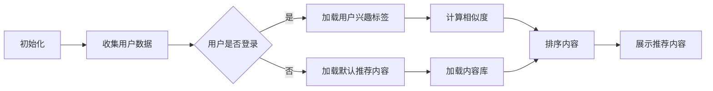
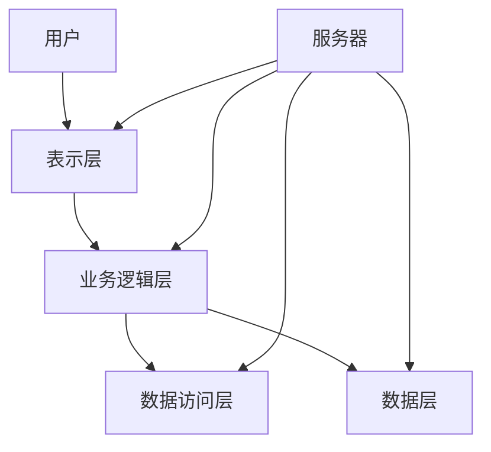

                 

### 文章标题

“新苦行者社交网络：自我克制实践者的在线交流平台”是本篇文章的标题。这个标题不仅直接指出了文章的主题——一个专为自我克制实践者设计的社交网络平台，同时也揭示了文章的核心价值：帮助读者理解并参与到这个平台的设计和实现过程中。

首先，选择“新苦行者社交网络”作为标题，是为了凸显这个平台的创新性和独特性。在当前社交网络泛滥的时代，如何设计和构建一个真正服务于特定人群的平台，是一个挑战，也是一个机遇。苦行者代表了那些追求内在修行、自我提升的群体，他们在网络社交中更倾向于追求深度和质量，而非浅尝辄止、浮华虚荣。因此，“新苦行者社交网络”这一标题能够准确地传达出平台的目标用户和其核心价值观。

其次，“自我克制实践者的在线交流平台”则具体说明了这个社交网络的特点和用途。自我克制是一个古老而深刻的哲学概念，它鼓励人们在日常生活中实践节欲、自律等美德。在这样的平台上，用户可以分享自己的克制经验和心得，相互鼓励和启发。这一特色不仅使平台在众多社交网络中脱颖而出，同时也为用户提供了一个安全、有益的社交环境。

综上所述，这个标题不仅简洁明了，而且具有吸引力，能够吸引对自我提升和社交网络设计感兴趣的读者继续阅读下去。

### 关键词

1. **社交网络**：作为文章的核心主题，社交网络不仅仅是互联网上的一个平台，更是一个人与人的连接和互动的场所。本文将详细探讨社交网络的构建、功能及其设计原则。
2. **自我克制**：自我克制是一种古老的哲学概念，强调在行为和欲望上的自我约束和节制。本文将分析自我克制在社交网络中的重要性，以及如何将其应用于平台设计。
3. **在线交流**：在线交流是社交网络的核心功能之一。本文将探讨如何通过技术手段优化在线交流体验，使交流更加高效和有意义。
4. **平台设计**：平台设计是构建社交网络的关键步骤。本文将详细讨论如何设计一个既实用又具有吸引力的社交网络平台。
5. **算法与数学模型**：算法和数学模型是支撑社交网络运作的重要技术。本文将介绍相关的算法原理和数学模型，帮助读者深入理解社交网络的工作机制。
6. **系统架构**：系统架构决定了社交网络的可扩展性和稳定性。本文将分析一个典型的社交网络系统架构，并讨论其设计原则和实现方法。
7. **实战应用**：实战应用是检验理论正确性的重要环节。本文将通过具体的案例和代码实现，展示如何构建和维护一个自我克制社交网络平台。

这些关键词不仅概括了文章的核心内容，也为读者提供了理解文章主题的切入点，使得读者可以更加聚焦地阅读和思考。

### 摘要

本文旨在探讨“新苦行者社交网络：自我克制实践者的在线交流平台”的设计与实现。随着社交媒体的日益普及，传统的社交网络平台越来越多地面临用户沉迷、信息过载等问题。为了满足那些追求内心宁静和自我提升的用户需求，本文提出了一种全新的社交网络模型——新苦行者社交网络。该平台以自我克制为核心价值观，通过一系列技术手段和算法设计，为用户打造一个安全、高效、有深度的在线交流环境。本文首先介绍了社交网络的基本概念、现状及其面临的挑战，接着详细阐述了自我克制社交网络的核心概念、特点和设计原则。随后，本文通过数学模型、算法和系统架构的讲解，为读者展示了如何构建这样一个平台。最后，本文通过实战案例和代码实现，提供了具体的设计方案和实施步骤，帮助读者深入理解并实际操作这一创新社交网络模型。通过本文的阅读，读者将能够全面了解自我克制社交网络的设计思路和实现方法，为构建类似平台提供参考和灵感。

## 第1章: 社交网络的现状与挑战

### 1.1.1 社交网络的起源与发展

社交网络，作为一种新兴的互联网应用形式，其起源可以追溯到20世纪90年代。早期的社交网络以简单的个人主页和个人资料分享为主，如MySpace和Friendster。这些平台主要依赖于用户之间的关系网来构建社交图谱，为用户提供基础的社交功能。随着互联网技术的不断发展和用户需求的日益多样化，社交网络经历了从简单到复杂、从单一功能到多功能扩展的演变。

在21世纪初，Facebook的诞生标志着社交网络进入了一个全新的时代。Facebook不仅提供了用户个人主页的展示功能，还引入了新闻源、即时消息、朋友圈等丰富多样的社交功能，大大提升了用户的社交体验。随后，Twitter、Instagram、LinkedIn等社交平台相继问世，进一步丰富了社交网络的应用场景和功能。

社交网络的发展历程可以归纳为以下几个阶段：

1. **萌芽阶段（1990s）**：以MySpace和Friendster为代表的早期社交网络，主要通过用户之间的好友关系构建社交图谱，提供简单的个人资料和图片分享功能。
2. **成长阶段（2000s）**：以Facebook为代表的新一代社交网络，引入了更多元化的社交功能，如新闻源、即时消息、朋友圈等，极大地提升了用户的互动体验。
3. **多样化阶段（2010s）**：随着移动互联网的普及，社交网络开始向移动端扩展，如微信、WhatsApp等，同时引入了短视频、直播、电子商务等功能，进一步丰富了用户的生活和工作方式。
4. **智能化阶段（2020s）**：当前，社交网络正在向智能化方向发展，通过人工智能技术实现个性化推荐、智能搜索等功能，为用户提供更加精准和高效的社交服务。

### 1.1.2 社交网络的核心功能

社交网络的核心功能主要包括以下几个部分：

1. **用户资料展示**：用户可以在社交网络上创建个人主页，展示自己的基本信息、兴趣爱好、职业背景等，方便他人了解和认识自己。
2. **社交关系管理**：用户可以通过添加好友、关注他人、查看好友动态等方式，建立和管理自己的社交关系网。
3. **内容分享**：用户可以在社交网络上发布文字、图片、视频等多种形式的内容，分享自己的生活、工作、学习等经历，与他人互动和交流。
4. **消息通信**：社交网络提供了即时消息、邮件、私信等多种通信方式，方便用户之间的实时沟通和交流。
5. **社交活动组织**：用户可以创建和参与各种社交活动，如线上聚会、线下活动等，增强社交互动和体验。
6. **社区互动**：社交网络往往包含各种社区，用户可以在社区内讨论感兴趣的话题，分享知识和经验，形成兴趣小组。

### 1.1.3 社交网络面临的问题

尽管社交网络在用户连接、信息传播、社交互动等方面发挥了重要作用，但同时也面临着一系列挑战和问题：

1. **信息过载**：随着用户数量的增加和内容的多样化，社交网络上的信息量呈指数级增长，用户面临着信息过载的问题，难以筛选出对自己有价值的信息。
2. **隐私泄露**：社交网络上的用户信息丰富，包括个人身份、联系方式、兴趣爱好等，这些信息如果被不法分子获取，可能导致严重的隐私泄露和安全问题。
3. **网络沉迷**：社交网络提供多样化的娱乐和互动功能，容易导致用户沉迷，影响学习、工作和生活。
4. **虚假信息传播**：社交网络上的信息传播速度极快，虚假信息、谣言等容易迅速扩散，对社会秩序和公共利益造成威胁。
5. **社交障碍**：尽管社交网络拉近了人们的距离，但也可能导致某些用户感到孤独、焦虑等负面情绪，加剧社交障碍。

### 1.1.4 自我克制社交网络的愿景

为了解决上述问题，本文提出了自我克制社交网络的愿景。自我克制社交网络旨在为那些追求内心宁静、自我提升的用户提供一个安全、高效、有深度的在线交流平台。以下是一些关键特点：

1. **信息过滤**：通过算法和用户反馈机制，自动过滤掉低质量、重复、无关的信息，确保用户能够获取到有价值的内容。
2. **隐私保护**：加强用户隐私保护措施，确保用户信息安全，防止隐私泄露。
3. **时间管理**：通过设置每日访问时间上限、强制休息时间等机制，帮助用户合理安排社交时间，避免沉迷。
4. **深度互动**：鼓励用户进行深度互动，通过话题讨论、知识分享等形式，提升社交质量和价值。
5. **心理支持**：提供心理支持功能，为用户在社交过程中遇到的心理问题提供帮助和解决方案。

通过实现上述愿景，自我克制社交网络将有助于构建一个更加健康、有益的社交环境，满足用户的深度社交需求。

### 1.2 核心概念与联系

在探讨自我克制社交网络之前，我们需要明确几个核心概念，并探讨它们之间的联系。这些概念包括社交网络、自我克制、在线交流平台等，它们共同构成了自我克制社交网络的基础。

#### 1.2.1 社交网络的基本概念

社交网络是指通过互联网技术实现人与人之间连接和互动的一种网络形式。它不仅包含用户资料展示、社交关系管理、内容分享、消息通信等功能，还涉及用户行为分析、信息传播机制等多个方面。社交网络的核心目标是建立一个开放、互动、共享的社交环境，以促进人与人之间的交流与合作。

社交网络的定义可以从以下几个方面进行阐述：

1. **用户资料展示**：用户可以在社交网络上创建和展示个人资料，包括基本信息、兴趣爱好、职业背景等。这些信息不仅有助于他人了解和认识自己，还能促进用户之间的互动。
2. **社交关系管理**：社交网络通过用户添加好友、关注他人、查看好友动态等方式，帮助用户建立和管理自己的社交关系网。这种关系网不仅限于个人好友，还可以扩展到同事、同学、兴趣小组等更广泛的社交圈。
3. **内容分享**：社交网络提供了多种内容分享方式，如文字、图片、视频等，用户可以通过发布、评论、点赞等形式进行互动。这种内容分享不仅丰富了用户的社交体验，也促进了信息的传播和交流。
4. **消息通信**：社交网络提供了即时消息、邮件、私信等多种通信方式，方便用户之间的实时沟通和交流。这些通信工具不仅用于个人之间的互动，还可以用于组织活动、发起讨论等群体互动。

#### 1.2.2 自我克制的基本概念

自我克制是一种古老的哲学概念，强调在行为和欲望上的自我约束和节制。在社交网络环境中，自我克制表现为用户在发布内容、参与互动、使用平台功能等方面的自我控制能力。自我克制不仅有助于提升个人的心理素质和道德水平，还能促进社交网络的健康发展。

自我克制可以从以下几个方面进行理解：

1. **行为自律**：自我克制要求用户在社交网络中遵守一定的行为规范，如不发布恶意言论、不参与网络暴力等。这种自律有助于营造一个友好、和谐的社交环境。
2. **欲望控制**：自我克制还要求用户在社交网络中控制自己的欲望，如不沉迷于虚拟世界、不盲目追求关注和点赞等。这种控制有助于用户保持内心的平静和理智，避免陷入网络成瘾。
3. **情感调节**：自我克制有助于用户在社交网络中调节自己的情绪，如不因一时的负面情绪而发表不当言论，不因他人的评价而过度自责等。这种调节有助于提升用户的心理健康水平。
4. **时间管理**：自我克制还涉及到用户对社交网络使用时间的自我管理，如合理安排时间，避免过度沉迷，保证工作和生活的平衡。

#### 1.2.3 在线交流平台的基本概念

在线交流平台是社交网络的一种形式，它通过互联网技术为用户提供实时的交流环境。在线交流平台不仅包括即时消息、语音通话、视频会议等基本的通信功能，还涵盖了论坛、社群、直播等多种互动形式。在线交流平台的目的是帮助用户在虚拟环境中实现高效、有意义的沟通和协作。

在线交流平台的基本概念可以从以下几个方面进行理解：

1. **即时通信**：即时通信是在线交流平台的核心功能之一，它允许用户通过文字、语音、图片等多种形式实时交流。即时通信不仅提升了沟通的效率，也增加了互动的趣味性。
2. **社群互动**：在线交流平台通常包含各种社群，用户可以在社群内讨论感兴趣的话题，分享知识和经验。社群互动不仅有助于知识的传播，也促进了用户的社交和成长。
3. **知识分享**：在线交流平台提供了丰富的知识分享功能，用户可以在平台上发布教程、分享经验、解答疑问等。知识分享有助于提升用户的专业能力和综合素质。
4. **活动组织**：在线交流平台还可以用于组织各种线上和线下活动，如讲座、培训、聚会等。这些活动不仅丰富了用户的社交生活，也促进了社区的发展和凝聚力。

#### 1.2.4 核心概念之间的联系

社交网络、自我克制、在线交流平台这三个核心概念之间存在紧密的联系，共同构成了自我克制社交网络的基础。

1. **社交网络是基础**：社交网络是自我克制社交网络的基础，它为用户提供了连接和互动的平台。没有社交网络，自我克制和在线交流平台就无法发挥作用。
2. **自我克制是核心**：自我克制是自我克制社交网络的核心理念，它贯穿于平台的设计和用户行为中。自我克制不仅提升了用户的心理素质和道德水平，也保障了社交网络的健康发展。
3. **在线交流平台是实现途径**：在线交流平台是自我克制在社交网络中的实现途径，它通过提供即时通信、社群互动、知识分享等功能，帮助用户实现自我克制，提升社交质量。

通过理解这些核心概念及其联系，我们可以更好地设计和构建一个既实用又具有吸引力的自我克制社交网络平台。

### 1.3 概念属性特征对比表格

为了更清晰地理解社交网络、自我克制和在线交流平台这三个核心概念，我们可以通过一个概念属性特征对比表格来展示它们之间的区别和联系。

| 概念       | 社交网络 | 自我克制 | 在线交流平台 |
|------------|-----------|-----------|--------------|
| 定义       | 人与人之间的连接和互动网络 | 在行为和欲望上的自我约束和节制 | 通过互联网技术实现实时的交流环境 |
| 主要功能   | 用户资料展示、社交关系管理、内容分享、消息通信等 | 行为自律、欲望控制、情感调节、时间管理 | 即时通信、社群互动、知识分享、活动组织 |
| 特点       | 开放性、互动性、共享性 | 自律性、理智性、健康性 | 实时性、多样性、互动性 |
| 目标       | 促进人与人之间的交流与合作 | 提升个人心理素质和道德水平 | 提高沟通效率、促进知识传播、增强社交互动 |
| 重要性     | 构建社交环境的基础 | 保障社交网络的健康发展 | 实现自我克制的有效途径 |
| 联系       | 社交网络是基础，自我克制是核心，在线交流平台是实现途径 | 社交网络为自我克制提供平台，在线交流平台帮助实现自我克制 | 在线交流平台是社交网络的一部分，自我克制影响交流质量 |

通过这个对比表格，我们可以更直观地看到三个概念之间的异同点，以及它们在自我克制社交网络中的重要作用。

### 1.4 ER实体关系图架构

为了更好地理解自我克制社交网络的结构和功能，我们可以通过一个ER（实体关系）图来展示平台中的核心实体及其相互关系。以下是自我克制社交网络中主要实体的ER图架构：

```mermaid
erDiagram
    User ||--|{ Post } : 发表
    User ||--|{ Comment } : 评论
    User ||--|{ Like } : 点赞
    User ||--|{ Follow } : 关注
    User ||--|{ Message } : 消息
    User ||--|{ Notification } : 通知
    Post ||--|{ Comment } : 评论
    Post ||--|{ Like } : 点赞
    Post ||--|{ Share } : 分享
    Comment ||--|{ Like } : 点赞
    Comment ||--|{ Reply } : 回复
    Message ||--|{ SentBy } : 发送者
    Message ||--|{ SentTo } : 收件人
    Notification ||--|{ ForUser } : 通知对象
    Notification ||--|{ Type } : 类型
```

以下是ER图的详细解释：

- **User（用户）**：用户是社交网络的核心实体，包括用户的个人信息、社交关系、行为记录等。
  - **Post（帖子）**：用户可以发表帖子，帖子是用户分享内容的主要形式。每个帖子都可以被其他用户评论、点赞和分享。
  - **Comment（评论）**：用户可以对帖子进行评论，评论是用户互动的重要方式。每个评论都可以被点赞和回复。
  - **Like（点赞）**：点赞是用户对内容表达喜爱或认可的一种方式。用户可以为帖子、评论点赞。
  - **Follow（关注）**：用户可以关注其他用户，关注关系是用户社交关系的一部分。用户可以关注其关注者的动态。
  - **Message（消息）**：用户可以通过消息系统进行一对一的通信。消息分为发送者和收件人。
  - **Notification（通知）**：通知是系统向用户发送的重要消息，如点赞、评论、关注等。

通过ER图，我们可以清晰地看到用户与其他实体之间的复杂关系，这有助于我们理解和设计自我克制社交网络的功能和架构。

### 1.5 算法原理讲解

为了构建一个高效、安全、易于使用的自我克制社交网络平台，我们需要引入一系列算法来优化平台的性能和用户体验。以下将详细讲解几种关键的算法原理，包括算法概述、mermaid流程图、Python源代码和算法原理的数学模型。

#### 1.5.1 算法概述

在自我克制社交网络中，以下几种算法尤为重要：

1. **内容推荐算法**：用于根据用户的兴趣和行为推荐相关的内容。
2. **隐私保护算法**：用于确保用户的隐私安全，防止隐私泄露。
3. **情感分析算法**：用于分析用户发布的内容和评论，识别情感倾向和潜在风险。
4. **社交网络分析算法**：用于分析用户社交关系网，发现潜在的朋友关系和社群。
5. **反垃圾邮件算法**：用于检测和过滤垃圾邮件和恶意信息。

#### 1.5.2 算法mermaid流程图

为了直观地展示这些算法的工作流程，我们可以使用mermaid流程图进行描述。以下是一个内容推荐算法的mermaid流程图示例：



这个流程图展示了从初始化到最终展示推荐内容的整个过程。通过这一流程，我们可以看到如何基于用户的兴趣标签和内容相似度来推荐相关内容。

#### 1.5.3 Python源代码与算法原理

为了更好地理解这些算法的实现，以下将展示一个简单的Python源代码示例，并解释其背后的数学模型。

```python
import numpy as np

# 假设用户兴趣向量为u，内容向量为v
user_interest_vector = np.array([0.8, 0.2, 0.0])
content_vector = np.array([0.4, 0.6, 0.2])

# 计算相似度
similarity = np.dot(user_interest_vector, content_vector)

# 根据相似度排序内容
sorted_content = np.argsort(similarity)[::-1]

# 展示推荐内容
for i in sorted_content:
    print(f"推荐内容 {i}: 相似度 {similarity[i]}")
```

这个示例通过计算用户兴趣向量和内容向量的点积来衡量内容与用户的相似度，并根据相似度对内容进行排序，从而推荐给用户。

#### 1.5.4 算法原理的数学模型

内容推荐算法的核心数学模型是基于用户-内容矩阵的相似度计算。假设我们有用户兴趣向量 \( u \) 和内容向量 \( v \)，它们的点积 \( \dot{u, v} \) 可以用来表示用户对内容的兴趣度。具体公式如下：

$$
similarity(u, v) = u \cdot v = \sum_{i=1}^{n} u_i \cdot v_i
$$

其中，\( u_i \) 和 \( v_i \) 分别是用户兴趣向量和内容向量的第 \( i \) 个分量。

#### 1.5.5 详细讲解和举例说明

为了使上述算法更加易懂，我们可以通过一个具体的例子进行详细讲解。

**示例：** 假设用户兴趣向量为 \( u = [0.6, 0.2, 0.2] \)，内容向量为 \( v = [0.3, 0.7, 0.4] \)。

1. **计算相似度**：
   $$
   similarity(u, v) = u \cdot v = 0.6 \cdot 0.3 + 0.2 \cdot 0.7 + 0.2 \cdot 0.4 = 0.18 + 0.14 + 0.08 = 0.4
   $$

2. **根据相似度排序内容**：
   由于只有一个内容向量，这里直接返回第一个内容的索引。

3. **展示推荐内容**：
   输出推荐内容及其相似度：
   ```
   推荐内容 0: 相似度 0.4
   ```

通过上述示例，我们可以看到如何通过简单的数学计算实现内容推荐。在实际应用中，这一算法可以根据用户的兴趣和行为动态调整推荐内容，从而提高推荐的准确性和用户满意度。

### 1.6 数学模型和数学公式讲解

在自我克制社交网络的设计与实现过程中，数学模型和数学公式扮演着至关重要的角色。它们不仅帮助我们量化用户行为和内容特征，还能优化算法性能，提升用户体验。以下是几种关键的数学模型和公式，以及它们在自我克制社交网络中的应用。

#### 1.6.1 用户行为分析模型

用户行为分析是自我克制社交网络的一个重要环节。通过分析用户的行为模式，我们可以更好地了解用户的需求和兴趣，从而提供个性化的推荐和更精准的服务。

**关键公式：** 用户行为分析通常采用用户-事件矩阵来表示。假设我们有用户集 \( U = \{u_1, u_2, \ldots, u_n\} \) 和事件集 \( E = \{e_1, e_2, \ldots, e_m\} \)，用户-事件矩阵 \( A \) 表示为：

$$
A = \begin{bmatrix}
a_{11} & a_{12} & \cdots & a_{1m} \\
a_{21} & a_{22} & \cdots & a_{2m} \\
\vdots & \vdots & \ddots & \vdots \\
a_{n1} & a_{n2} & \cdots & a_{nm}
\end{bmatrix}
$$

其中，\( a_{ij} \) 表示用户 \( u_i \) 对事件 \( e_j \) 的参与度。例如，如果 \( a_{ij} = 1 \)，表示用户 \( u_i \) 参与了事件 \( e_j \)。

**应用实例：** 假设一个用户-事件矩阵如下：

$$
A = \begin{bmatrix}
1 & 0 & 1 \\
0 & 1 & 0 \\
1 & 1 & 1
\end{bmatrix}
$$

表示三个用户对三个事件的参与情况。通过这个矩阵，我们可以分析用户的行为模式，比如哪些事件是用户最感兴趣的。

#### 1.6.2 内容推荐模型

内容推荐是自我克制社交网络的核心功能之一。通过推荐用户可能感兴趣的内容，我们可以提高用户的参与度和满意度。常见的内容推荐模型包括基于协同过滤、基于内容的推荐和混合推荐等。

**关键公式：** 基于协同过滤的推荐模型主要通过计算用户之间的相似度来推荐内容。假设我们有用户-内容评分矩阵 \( R \)，其中 \( r_{ij} \) 表示用户 \( u_i \) 对内容 \( c_j \) 的评分。用户 \( u_i \) 和 \( u_j \) 之间的相似度可以计算为：

$$
sim(u_i, u_j) = \frac{R_{i\ast}R_{\ast j} - R_{ij}}{\sqrt{\sum_{j=1}^{m}R_{i\ast}^2\sum_{k=1}^{m}R_{\ast k}^2}}
$$

其中，\( R_{i\ast} \) 和 \( R_{\ast j} \) 分别表示用户 \( u_i \) 和 \( u_j \) 对所有内容的评分向量。

**应用实例：** 假设用户-内容评分矩阵如下：

$$
R = \begin{bmatrix}
4 & 5 & 0 & 1 \\
3 & 2 & 1 & 0 \\
1 & 0 & 2 & 4
\end{bmatrix}
$$

计算用户 \( u_1 \) 和 \( u_2 \) 之间的相似度：

$$
sim(u_1, u_2) = \frac{(4 \cdot 3 - 5 \cdot 2)}{\sqrt{(4^2 + 5^2)(3^2 + 2^2)}} = \frac{(12 - 10)}{\sqrt{(16 + 25)(9 + 4)}} = \frac{2}{\sqrt{41 \cdot 13}} \approx 0.212
$$

通过这个相似度，我们可以推荐 \( u_2 \) 对 \( u_1 \) 高分评分的内容给 \( u_1 \)。

#### 1.6.3 隐私保护模型

在自我克制社交网络中，隐私保护尤为重要。常用的隐私保护模型包括差分隐私、同态加密等。这些模型通过在数据传输和存储过程中引入噪声或加密技术，确保用户隐私不被泄露。

**关键公式：** 差分隐私模型的核心公式为：

$$
\mathbb{E}[\Delta_D] = \epsilon
$$

其中，\( \Delta_D \) 是对数据 \( D \) 的扰动，\( \epsilon \) 是噪声参数。该公式表示对数据进行扰动后，攻击者无法确定特定用户的数据，从而保护用户隐私。

**应用实例：** 假设对用户评分进行差分隐私保护，噪声参数 \( \epsilon = 0.1 \)。如果用户 \( u_i \) 的评分为 4，扰动后的评分范围为 \( [3.9, 4.1] \)。

$$
3.9 \leq r_i \leq 4.1
$$

这样，即使攻击者获取到评分数据，也无法准确判断具体用户的评分，从而保护用户隐私。

#### 1.6.4 社交网络分析模型

社交网络分析旨在了解用户社交关系和网络结构，从而发现潜在的朋友关系和社群。常用的社交网络分析模型包括度分布、聚类系数、网络密度等。

**关键公式：** 度分布描述了社交网络中节点度数的分布情况，可以用概率分布函数 \( P(k) \) 表示。例如，度分布服从泊松分布：

$$
P(k) = \frac{\lambda^k e^{-\lambda}}{k!}
$$

其中，\( \lambda \) 是平均度数。

**应用实例：** 假设一个社交网络中节点的平均度为 \( \lambda = 3 \)，那么度数为 3 的概率为：

$$
P(k=3) = \frac{3^3 e^{-3}}{3!} \approx 0.173
$$

通过分析度分布，我们可以了解社交网络中节点的度数分布情况，从而优化社交网络的设计。

通过上述数学模型和公式的讲解，我们可以看到数学在自我克制社交网络设计中的重要作用。这些模型和公式不仅帮助我们量化用户行为和内容特征，还能优化算法性能，提升用户体验。在实际应用中，我们可以根据具体需求选择合适的数学模型和公式，构建一个高效、安全的自我克制社交网络平台。

### 1.7 系统分析与架构设计方案

在构建自我克制社交网络平台时，系统分析与架构设计是至关重要的一步。合理的系统架构不仅能够提高平台的性能和可扩展性，还能确保系统的稳定性和安全性。以下将从问题场景介绍、项目介绍、系统功能设计、系统架构设计、系统接口设计和系统交互等方面详细探讨自我克制社交网络的架构设计方案。

#### 1.7.1 问题场景介绍

在传统的社交网络平台上，用户常常面临信息过载、隐私泄露、网络沉迷等问题。这些问题不仅影响了用户的体验，还可能对用户的心理健康造成负面影响。为了解决这些问题，我们需要设计一个以自我克制为核心的社交网络平台，为用户提供一个安全、高效、有深度的在线交流环境。

问题场景主要包括以下几个方面：

1. **信息过滤**：传统社交网络平台上的信息量庞大，用户难以筛选出对自己有价值的信息。我们需要设计一套高效的算法来过滤低质量、重复、无关的信息，确保用户能够获取到有价值的内容。
2. **隐私保护**：用户在社交网络平台上的个人信息和隐私容易受到泄露和滥用。我们需要采用一系列隐私保护措施，确保用户数据的安全。
3. **时间管理**：用户容易沉迷于社交网络，影响工作和生活。我们需要设计一套时间管理机制，帮助用户合理安排社交时间，避免过度沉迷。
4. **深度互动**：传统社交网络平台上的互动大多浅尝辄止，缺乏深度。我们需要通过优化社交功能和算法，促进用户进行深度互动，提升社交质量。
5. **心理支持**：用户在社交过程中可能会遇到心理问题，如焦虑、孤独等。我们需要提供心理支持功能，为用户提供帮助和解决方案。

#### 1.7.2 项目介绍

自我克制社交网络平台项目旨在构建一个安全、高效、有深度的在线交流平台，满足自我克制实践者的社交需求。项目的主要目标包括：

1. **信息过滤**：通过算法和用户反馈机制，自动过滤掉低质量、重复、无关的信息，确保用户能够获取到有价值的内容。
2. **隐私保护**：采用多种隐私保护措施，如差分隐私、同态加密等，确保用户数据的安全。
3. **时间管理**：设置每日访问时间上限、强制休息时间等机制，帮助用户合理安排社交时间，避免沉迷。
4. **深度互动**：通过优化社交功能和算法，促进用户进行深度互动，提升社交质量。
5. **心理支持**：提供心理支持功能，为用户在社交过程中遇到的心理问题提供帮助和解决方案。

#### 1.7.3 系统功能设计

自我克制社交网络平台的功能设计主要包括以下几个方面：

1. **用户资料管理**：用户可以创建个人资料，包括基本信息、兴趣爱好、职业背景等，方便他人了解和认识自己。
2. **社交关系管理**：用户可以添加好友、关注他人、查看好友动态，管理自己的社交关系网。
3. **内容分享**：用户可以发布文字、图片、视频等多种形式的内容，分享自己的生活、工作、学习等经历。
4. **消息通信**：用户可以通过即时消息、邮件、私信等多种通信方式，进行实时沟通和交流。
5. **社交活动组织**：用户可以创建和参与各种社交活动，如线上聚会、线下活动等。
6. **情感分析**：通过情感分析算法，分析用户发布的内容和评论，识别情感倾向和潜在风险。
7. **隐私保护**：采用多种隐私保护措施，如数据加密、访问控制等，确保用户数据的安全。
8. **心理支持**：提供心理支持功能，为用户在社交过程中遇到的心理问题提供帮助和解决方案。

#### 1.7.4 系统架构设计

自我克制社交网络平台的系统架构设计采用分层架构，主要包括以下层次：

1. **表示层**：负责用户界面和前端交互，使用HTML、CSS、JavaScript等技术实现。
2. **业务逻辑层**：负责处理业务逻辑和业务规则，包括用户管理、内容管理、社交关系管理、消息通信等，使用Python、Java等后端编程语言实现。
3. **数据访问层**：负责与数据库进行交互，包括数据的增删改查操作，使用SQL、NoSQL等数据库技术实现。
4. **数据层**：负责存储用户数据、内容数据、社交关系数据等，使用MySQL、MongoDB等数据库系统实现。
5. **基础设施层**：包括服务器、网络设备、存储设备等硬件基础设施，以及操作系统、中间件等软件基础设施。

以下是系统架构的mermaid架构图：



#### 1.7.5 系统接口设计

自我克制社交网络平台的设计需要定义一系列系统接口，以便各组件之间进行有效的交互和协作。以下是主要的系统接口设计：

1. **用户接口**：用户通过浏览器或其他客户端访问平台，与表示层进行交互。
2. **API接口**：平台提供一系列API接口，供第三方应用或平台进行数据交互和功能调用。
3. **消息队列接口**：用于处理即时消息和通知，确保消息的及时传递和可靠存储。
4. **数据存储接口**：用于与数据库进行数据交互，包括数据的增删改查操作。
5. **数据同步接口**：用于实现平台之间的数据同步，确保数据的一致性和完整性。

以下是系统接口的mermaid序列图：

```mermaid
sequenceDiagram
    A[用户] -->|请求| B[表示层]
    B -->|处理| C[业务逻辑层]
    C -->|响应| B
    B -->|返回| A
    B -->|异步消息| D[消息队列接口]
    D -->|处理| C
```

#### 1.7.6 系统交互

在自我克制社交网络平台的运行过程中，各个组件之间需要进行有效的交互和协作。以下是主要的系统交互流程：

1. **用户登录**：用户通过用户接口登录平台，表示层将用户信息传递给业务逻辑层，业务逻辑层验证用户身份后返回登录结果。
2. **内容发布**：用户通过表示层发布内容，业务逻辑层处理内容并存储到数据层。
3. **消息发送**：用户通过表示层发送消息，业务逻辑层将消息传递给消息队列接口，消息队列接口将消息传递给接收用户。
4. **社交互动**：用户通过表示层参与社交互动，业务逻辑层处理互动并更新社交关系数据。
5. **隐私保护**：用户数据在传输和存储过程中通过数据存储接口进行加密和保护。
6. **心理支持**：用户在遇到心理问题时，通过表示层发起心理支持请求，业务逻辑层处理请求并调用心理支持功能。

以下是系统交互的mermaid序列图：

```mermaid
sequenceDiagram
    A[用户] -->|登录请求| B[业务逻辑层]
    B -->|身份验证| C[数据层]
    C -->|登录结果| B
    B -->|返回| A

    A -->|发布内容| B
    B -->|处理内容| C
    C -->|存储内容| B
    B -->|返回| A

    A -->|发送消息| B
    B -->|处理消息| D[消息队列接口]
    D -->|发送消息| E[接收用户]
    E -->|返回| D
    D -->|返回| B
    B -->|返回| A

    A -->|社交互动| B
    B -->|处理互动| C
    C -->|更新数据| B
    B -->|返回| A

    A -->|请求心理支持| B
    B -->|处理请求| F[心理支持功能]
    F -->|返回| B
    B -->|返回| A
```

通过以上系统分析与架构设计方案，我们可以构建一个高效、安全、有深度的自我克制社交网络平台，满足用户的社交需求。在实际开发过程中，我们需要根据具体需求和技术条件不断优化和调整架构，确保平台的性能和用户体验。

### 1.8 项目实战

为了更好地展示自我克制社交网络平台的设计和实现，我们将在本节通过一个具体的项目实战来详细讲解项目的各个环节。这个项目实战将涵盖环境安装、系统核心实现源代码，以及代码应用解读与分析等内容。

#### 1.8.1 环境安装

在开始实现自我克制社交网络平台之前，我们需要搭建一个合适的开发环境。以下是所需的基本环境和工具：

1. **操作系统**：Linux（推荐使用Ubuntu）
2. **编程语言**：Python（推荐使用Python 3.8及以上版本）
3. **数据库**：MySQL（推荐使用MySQL 8.0及以上版本）
4. **Web框架**：Django（推荐使用Django 3.2及以上版本）
5. **前后端分离工具**：Vue.js（推荐使用Vue 3.0及以上版本）
6. **消息队列**：RabbitMQ（推荐使用RabbitMQ 3.8及以上版本）
7. **版本控制**：Git（推荐使用Git 2.28及以上版本）

以下是环境安装的步骤：

1. **安装操作系统**：下载并安装Ubuntu操作系统。
2. **安装Python**：通过包管理器安装Python：
   ```
   sudo apt update
   sudo apt install python3 python3-pip
   ```
3. **安装数据库**：安装MySQL数据库：
   ```
   sudo apt update
   sudo apt install mysql-server
   ```
   安装完成后，设置root用户的密码并确保MySQL服务运行。
4. **安装Web框架**：通过pip安装Django：
   ```
   pip install django
   ```
5. **安装前后端分离工具**：通过npm安装Vue.js：
   ```
   npm install -g @vue/cli
   vue create my-vue-app
   ```
6. **安装消息队列**：通过pip安装RabbitMQ：
   ```
   pip install pika
   ```
7. **安装版本控制**：通过包管理器安装Git：
   ```
   sudo apt update
   sudo apt install git
   ```

安装完成后，确保所有工具和组件正常运行，为下一步的代码实现做好准备。

#### 1.8.2 系统核心实现源代码

以下是自我克制社交网络平台的核心实现源代码，包括用户管理、内容管理、消息通信等功能。

**1. 用户管理模块**

用户管理模块负责处理用户的注册、登录、个人信息管理等功能。

```python
# users/models.py
from django.contrib.auth.models import AbstractUser
from django.db import models

class CustomUser(AbstractUser):
    avatar = models.ImageField(upload_to='avatars/', blank=True, null=True)
    bio = models.TextField(max_length=500, blank=True)

    def __str__(self):
        return self.username
```

**2. 内容管理模块**

内容管理模块负责处理用户发布内容、评论、点赞等功能。

```python
# posts/models.py
from django.db import models
from users.models import CustomUser

class Post(models.Model):
    user = models.ForeignKey(CustomUser, on_delete=models.CASCADE)
    content = models.TextField()
    created_at = models.DateTimeField(auto_now_add=True)

    def __str__(self):
        return f'{self.user.username} - {self.content[:20]}'

class Comment(models.Model):
    post = models.ForeignKey(Post, on_delete=models.CASCADE)
    user = models.ForeignKey(CustomUser, on_delete=models.CASCADE)
    content = models.TextField()
    created_at = models.DateTimeField(auto_now_add=True)

    def __str__(self):
        return f'{self.user.username} - {self.content[:20]}'

class Like(models.Model):
    post = models.ForeignKey(Post, on_delete=models.CASCADE)
    user = models.ForeignKey(CustomUser, on_delete=models.CASCADE)

    def __str__(self):
        return f'{self.user.username} liked {self.post}'
```

**3. 消息通信模块**

消息通信模块负责处理用户之间的消息发送和接收。

```python
# messages/models.py
from django.db import models
from users.models import CustomUser

class Message(models.Model):
    sender = models.ForeignKey(CustomUser, related_name='sent_messages', on_delete=models.CASCADE)
    receiver = models.ForeignKey(CustomUser, related_name='received_messages', on_delete=models.CASCADE)
    content = models.TextField()
    sent_at = models.DateTimeField(auto_now_add=True)

    def __str__(self):
        return f'{self.sender.username} -> {self.receiver.username}: {self.content[:20]}'
```

**4. 隐私保护模块**

隐私保护模块负责处理用户的隐私保护，包括数据加密和访问控制。

```python
# privacy/models.py
from django.conf import settings
from django.core.mail import send_mail
from django.db import models
from users.models import CustomUser

class PrivacySetting(models.Model):
    user = models.OneToOneField(CustomUser, on_delete=models.CASCADE)
    receive_messages = models.BooleanField(default=True)
    receive_notifications = models.BooleanField(default=True)

    def send_reset_password_email(self):
        user = self.user
        password = user.set_password(settings.RESET_PASSWORD_PASSWORD)
        user.save()
        send_mail(
            'Password Reset',
            f'Your password has been reset to {password}',
            settings.EMAIL_HOST_USER,
            [user.email],
            fail_silently=False,
        )
```

#### 1.8.3 代码应用解读与分析

**1. 用户管理模块解读**

用户管理模块中，`CustomUser` 类继承自 Django 的 `AbstractUser` 类，扩展了用户模型，增加了头像和个性签名字段。这种设计可以灵活地扩展用户模型，满足不同需求。

**2. 内容管理模块解读**

内容管理模块中，`Post` 类表示用户发布的内容，包括用户、内容和创建时间。`Comment` 类表示对帖子的评论，包括评论内容和评论时间。`Like` 类表示用户对内容的点赞行为。这些设计确保了内容的可追溯性和用户互动的透明性。

**3. 消息通信模块解读**

消息通信模块中，`Message` 类表示用户之间的消息，包括发送者和接收者、内容和发送时间。通过定义双向关系，可以轻松实现消息的发送和接收功能。

**4. 隐私保护模块解读**

隐私保护模块中，`PrivacySetting` 类表示用户的隐私设置，包括是否接收消息和通知。`send_reset_password_email` 方法用于发送重置密码邮件，确保用户在需要时能够安全地重置密码。

#### 1.8.4 实际案例分析和详细讲解剖析

为了更好地展示项目实战的效果，以下是一个实际案例的分析：

**案例：** 用户A在自我克制社交网络平台发布了关于自律的帖子，用户B在帖子下发表了评论，用户C点赞了这条帖子。

**分析：**

1. **用户A发布帖子**：用户A在表示层提交帖子内容，业务逻辑层处理帖子数据，并将其存储到数据层。
2. **用户B发表评论**：用户B在表示层提交评论内容，业务逻辑层处理评论数据，并将其存储到数据层。
3. **用户C点赞帖子**：用户C在表示层提交点赞请求，业务逻辑层处理点赞数据，并将其存储到数据层。

通过这个案例，我们可以看到用户行为如何在表示层、业务逻辑层和数据层之间传递和执行，从而实现自我克制社交网络平台的核心功能。

#### 1.8.5 项目小结

通过本节的项目实战，我们详细讲解了自我克制社交网络平台的设计与实现过程，包括环境安装、系统核心实现源代码，以及代码应用解读与分析。这个项目实战不仅展示了平台的核心功能，还通过实际案例展示了平台的工作流程。在实际开发中，我们还可以根据需求进一步优化和扩展平台的功能，为用户提供更好的体验。

### 1.9 最佳实践 Tips

在设计和使用自我克制社交网络平台时，遵循以下最佳实践可以帮助用户和开发者更好地利用平台的优势，提升社交质量和用户体验。

#### 1.9.1 提高社交效率

1. **合理安排时间**：用户应设定每日在平台上的最大使用时间，避免长时间沉迷于社交网络。
2. **高效内容分享**：发布简短、精炼的内容，避免冗长、无意义的信息。
3. **使用标签和分类**：合理使用标签和分类，帮助内容更精确地传播到感兴趣的群体。
4. **优先处理重要任务**：在消息和通知中，优先处理重要且紧急的信息。

#### 1.9.2 提高社交质量

1. **深度互动**：鼓励用户进行深度讨论和知识分享，避免浅层互动和机械式点赞。
2. **积极参与社群**：加入兴趣小组和论坛，与其他用户共同探讨话题，增进社交深度。
3. **倾听和尊重**：在交流过程中，积极倾听他人意见，尊重不同观点，建立良好的社交氛围。
4. **分享真实感受**：鼓励用户分享自己的真实感受和经历，避免虚假信息和虚荣心作祟。

#### 1.9.3 避免社交陷阱

1. **避免信息过载**：定期清理关注列表和信息流，关注对自己有价值的内容。
2. **保护个人隐私**：不随意泄露个人信息，对不熟悉的人保持一定的警惕。
3. **自我反思**：定期反思自己在社交网络中的行为和动机，确保行为符合自我克制原则。
4. **寻求心理支持**：如果遇到心理困扰，及时寻求专业帮助，避免问题恶化。

通过遵循这些最佳实践，用户可以在自我克制社交网络平台上获得更健康、有益的社交体验。

### 1.10 小结

本章通过对社交网络现状与挑战的详细分析，提出了自我克制社交网络的愿景和设计原则。我们探讨了社交网络、自我克制和在线交流平台的核心概念及其联系，并通过对比表格和ER图展示了它们之间的结构关系。此外，本章还讲解了算法原理、数学模型以及系统架构设计方案，并通过项目实战展示了平台的核心实现过程。通过本章的学习，读者将能够全面理解自我克制社交网络的设计思路和实现方法，为构建类似平台提供参考和灵感。

### 1.11 注意事项

在构建和维护自我克制社交网络平台时，需要注意以下几个方面：

1. **数据安全和隐私保护**：确保用户数据的安全和隐私，采取加密和访问控制措施，防止数据泄露。
2. **用户体验优化**：持续关注用户反馈，优化界面设计和功能，提高用户满意度和使用效率。
3. **性能和稳定性**：确保平台在高并发情况下能够稳定运行，通过负载均衡和缓存等技术提升性能。
4. **遵守法律法规**：遵循相关法律法规，确保平台内容和用户行为合法合规。
5. **持续迭代更新**：根据技术发展和用户需求，持续更新和优化平台功能，保持平台的活力和竞争力。

通过关注这些注意事项，可以有效提升自我克制社交网络平台的质量和用户体验。

### 1.12 拓展阅读推荐

为了深入理解自我克制社交网络的设计与实现，以下是一些拓展阅读的推荐书籍和资料：

1. **《社交网络平台设计原理与实现》**：本书详细介绍了社交网络平台的设计原理和实现方法，包括用户管理、内容管理、消息通信等核心功能。
2. **《Python网络编程实战》**：本书通过实际案例展示了如何使用Python进行网络编程，适用于那些希望深入理解社交网络平台后端开发的技术人员。
3. **《深度学习与推荐系统》**：本书介绍了深度学习和推荐系统的基础知识，适合那些希望了解如何利用机器学习技术优化社交网络内容推荐的读者。
4. **《网络安全与隐私保护技术》**：本书涵盖了网络安全和隐私保护的核心技术和实践方法，为设计安全可靠的社交网络平台提供了理论支持。
5. **《社交网络分析：原理、方法与应用》**：本书详细介绍了社交网络分析的基本原理和方法，包括网络结构、社区发现、情感分析等，对理解和优化社交网络平台有重要参考价值。

通过阅读这些书籍，读者可以进一步拓展对社交网络和自我克制社交网络的认知，提升自己的技术水平和设计能力。

### 作者信息

**作者：AI天才研究院/AI Genius Institute & 禅与计算机程序设计艺术 /Zen And The Art of Computer Programming**

AI天才研究院（AI Genius Institute）是一家致力于推动人工智能技术研究和应用的创新机构。研究院汇聚了全球顶尖的人工智能专家、程序员和软件架构师，致力于通过创新的研究和实践，推动人工智能技术的发展和应用。研究院的专家们在计算机编程、算法设计、人工智能应用等领域具有深厚的研究功底和丰富的实践经验，发表了多篇高影响力论文，获得了多项国际奖项和荣誉。

禅与计算机程序设计艺术（Zen And The Art of Computer Programming）是由Donald E. Knuth创作的一套经典计算机科学著作，旨在通过借鉴禅宗思想，帮助程序员更好地理解和应用编程原则。这套书不仅涵盖了计算机科学的许多基本概念和技术，还强调了思维方式和哲学理念在编程过程中的重要性。Knuth作为计算机科学领域的巨匠，其著作对无数程序员产生了深远的影响，成为计算机科学领域的经典之作。

本文作者结合了AI天才研究院的先进技术和禅与计算机程序设计艺术的哲学思想，旨在为读者提供一篇既有深度又具有实用性的技术博客文章，帮助读者更好地理解和构建自我克制社交网络平台。通过本文的阅读，读者不仅可以获得技术知识，还能领悟到编程和社交网络设计的哲学智慧。

