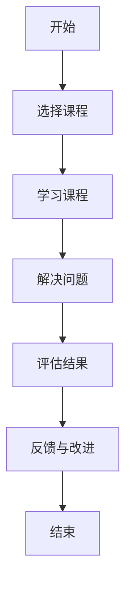
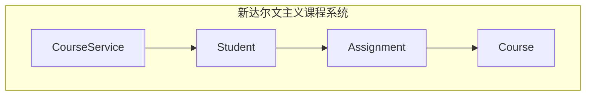
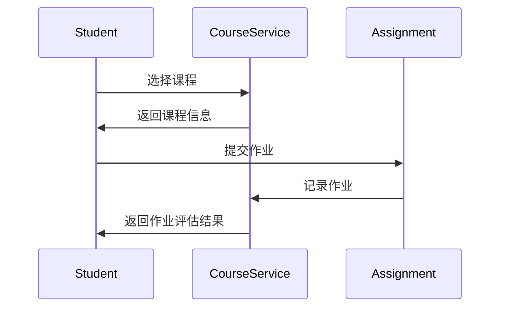

                 

# 新达尔文主义课程：适应快速变化世界的技能

## 关键词

- **新达尔文主义课程**
- **适应性思维**
- **问题解决能力**
- **创新能力**
- **合作能力**
- **快速变化世界**

## 摘要

在当前快速变化的世界，新达尔文主义课程提供了一种全新的教育方法，旨在培养学生的适应性思维、问题解决能力、创新能力和合作能力，帮助他们适应未来社会的挑战。本文将详细介绍新达尔文主义课程的概念、特点、目标以及核心概念与联系，并通过具体案例阐述其实际应用效果。

## 第一部分：背景介绍

### 1.1 新达尔文主义课程的概念

新达尔文主义课程是一种以自然选择和进化论原理为基础的教育模式，旨在通过模拟自然选择的过程，培养学生适应快速变化世界的技能。该课程的核心在于鼓励学生不断探索、实验和反思，以培养他们的批判性思维和创新能力。

### 1.2 问题背景

在当前社会，技术的飞速发展和全球化进程使得人们面临的信息和变化越来越多。传统的教育模式难以满足这种快速变化的需求，导致学生在面对实际问题时的适应能力和创新能力不足。因此，迫切需要一种新的教育方法来培养学生的适应性。

### 1.3 问题描述

新达尔文主义课程试图解决以下问题：

- 如何培养学生在快速变化的环境中的适应能力？
- 如何激发学生的创新思维，提高问题解决能力？
- 如何通过合作学习，培养学生的团队合作精神？

### 1.4 问题解决

新达尔文主义课程通过以下方法解决问题：

- 设计模拟真实世界的问题情境，让学生在实践中学习和成长。
- 引入反思和自我评估环节，帮助学生认识到自己的不足，并不断改进。
- 鼓励学生探索和尝试不同的解决方案，培养他们的创新思维。

### 1.5 边界与外延

新达尔文主义课程不仅适用于学术教育，还可以应用于职业培训和企业学习。它的核心在于培养学生的适应性和创新能力，以应对未来社会的挑战。

### 1.6 概念结构与核心要素组成

新达尔文主义课程的核心要素包括：

- 适应性思维：培养学生快速适应新环境和新情况的能力。
- 问题解决能力：培养学生识别、分析和解决问题的能力。
- 创新能力：培养学生从不同角度思考问题，提出创新解决方案的能力。
- 合作能力：培养学生与他人合作，共同完成任务的能力。

## 2. 新达尔文主义课程的特点

### 2.1 适应性思维

适应性思维是学生在面对快速变化的世界时的一种思维方式。它包括：

- **快速学习**：学生在面对新知识和新技能时，能够迅速掌握并应用。
- **自我反思**：学生能够反思自己的学习过程，识别自己的不足，并不断改进。
- **接受变化**：学生能够积极应对环境的变化，适应新的学习情境。

### 2.2 问题解决能力

问题解决能力是指学生能够有效识别、分析和解决各种问题的能力。它包括：

- **理解问题**：学生能够准确理解问题的本质，明确问题的目标。
- **定义解决方案**：学生能够根据问题的特点，提出合理的解决方案。
- **实施解决方案**：学生能够将解决方案付诸实践，并跟踪其效果。

### 2.3 创新能力

创新能力是指学生能够创造新思路、新方法和新解决方案的能力。它包括：

- **观察力**：学生能够敏锐地观察问题，发现问题的本质。
- **思考力**：学生能够深入思考，提出独特的见解。
- **实验精神**：学生能够勇于尝试，通过实验验证自己的想法。

### 2.4 合作能力

合作能力是指学生能够与他人有效沟通、协作并共同完成任务的能力。它包括：

- **团队合作**：学生能够与他人共同完成任务，实现共同的目标。
- **沟通技巧**：学生能够清晰、准确地表达自己的想法，理解他人的观点。
- **领导力**：学生能够在团队中发挥领导作用，引导团队向前发展。

## 3. 新达尔文主义课程的目标

### 3.1 培养适应未来社会的技能

新达尔文主义课程的目标是培养学生具备适应未来社会的技能，包括：

- **适应性思维**：让学生能够快速适应新环境和新情况。
- **问题解决能力**：让学生能够有效识别、分析和解决各种问题。
- **创新能力**：让学生能够从不同角度思考问题，提出创新解决方案。
- **合作能力**：让学生能够与他人合作，共同完成任务。

### 3.2 培养终身学习的能力

新达尔文主义课程鼓励学生持续学习，不断更新知识和技能，以适应不断变化的环境。它包括：

- **自主探索**：鼓励学生主动学习，积极探索新的知识和技能。
- **持续反馈**：通过反思和自我评估，帮助学生认识到自己的不足，并不断改进。
- **灵活调整**：根据环境的变化，灵活调整学习目标和策略。

### 3.3 培养个体在复杂环境中的竞争力

新达尔文主义课程通过模拟真实世界的问题和挑战，帮助学生发展个体在复杂环境中的竞争力。它包括：

- **实际应用**：将理论知识应用到实际项目中，提高学生的实践能力。
- **持续创新**：鼓励学生在实践中不断探索和创新，提高问题解决能力。
- **团队协作**：通过团队合作，提高学生的沟通和协作能力，增强竞争力。

## 第二部分：核心概念与联系

### 1. 核心概念原理

#### 1.1 适应性思维

适应性思维是一种在面对变化时能够灵活应对的思维方式。它包括以下三个方面：

- **快速学习**：学生在面对新知识和新技能时，能够迅速掌握并应用。
- **自我反思**：学生能够反思自己的学习过程，识别自己的不足，并不断改进。
- **接受变化**：学生能够积极应对环境的变化，适应新的学习情境。

#### 1.2 问题解决能力

问题解决能力是指学生能够有效识别、分析和解决各种问题的能力。它包括以下三个方面：

- **理解问题**：学生能够准确理解问题的本质，明确问题的目标。
- **定义解决方案**：学生能够根据问题的特点，提出合理的解决方案。
- **实施解决方案**：学生能够将解决方案付诸实践，并跟踪其效果。

#### 1.3 创新能力

创新能力是指学生能够创造新思路、新方法和新解决方案的能力。它包括以下三个方面：

- **观察力**：学生能够敏锐地观察问题，发现问题的本质。
- **思考力**：学生能够深入思考，提出独特的见解。
- **实验精神**：学生能够勇于尝试，通过实验验证自己的想法。

#### 1.4 合作能力

合作能力是指学生能够与他人有效沟通、协作并共同完成任务的能力。它包括以下三个方面：

- **团队合作**：学生能够与他人共同完成任务，实现共同的目标。
- **沟通技巧**：学生能够清晰、准确地表达自己的想法，理解他人的观点。
- **领导力**：学生能够在团队中发挥领导作用，引导团队向前发展。

### 2. 概念属性特征对比表格

| 概念         | 特征1 | 特征2 | 特征3 |
| ------------ | ------ | ------ | ------ |
| 适应性思维   | 快速学习 | 自我反思 | 接受变化 |
| 问题解决能力 | 识别问题 | 定义解决方案 | 实施解决方案 |
| 创新能力     | 观察力 | 思考力 | 实验精神 |
| 合作能力     | 团队合作 | 沟通技巧 | 领导力 |

### 3. ER实体关系图架构

```mermaid
erDiagram
    User ||--|{ Student }
    Student ||--|{ Course }
    Course ||--|{ Assignment }
```

在这个ER实体关系图中，"User"代表所有使用课程的用户，"Student"代表参与课程的学生，"Course"代表课程，"Assignment"代表学生提交的作业。

## 第三部分：算法原理讲解

### 3.1 算法mermaid流程图



### 3.2 Python源代码

```python
# 新达尔文主义课程算法示例

class Student:
    def __init__(self, name):
        self.name = name
        self.knowledge = []
        self.solutions = []

    def select_course(self, course):
        self.knowledge.append(course)

    def learn_course(self, course):
        # 学习课程内容
        pass

    def solve_problem(self, problem):
        solution = self.find_solution(problem)
        self.solutions.append(solution)
        return solution

    def find_solution(self, problem):
        # 寻找解决方案
        pass

    def evaluate_result(self, result):
        # 评估结果
        pass

    def feedback_and_improvement(self, feedback):
        # 反馈与改进
        pass

# 创建学生实例
student = Student("Alice")

# 选择课程
student.select_course("Introduction to Machine Learning")

# 学习课程
student.learn_course("Introduction to Machine Learning")

# 解决问题
solution = student.solve_problem("Classify the given data")

# 评估结果
result = student.evaluate_result(solution)

# 反馈与改进
student.feedback_and_improvement(result)
```

### 3.3 算法原理的数学模型和公式

假设学生A在学习课程C时，其知识水平可以表示为向量\(K_A\)，问题解决能力可以表示为向量\(S_A\)。课程C的知识点可以表示为向量\(K_C\)，问题P的解决方案可以表示为向量\(S_P\)。

- **知识水平评估**：

$$K_A = \sum_{i=1}^{n} w_i \cdot k_{iA}$$

其中，\(w_i\)为知识点\(k_i\)的权重，\(k_{iA}\)为学生A对知识点\(k_i\)的掌握程度。

- **问题解决能力评估**：

$$S_A = \sum_{j=1}^{m} w_j \cdot s_{jA}$$

其中，\(w_j\)为问题\(p_j\)的权重，\(s_{jA}\)为学生A对问题\(p_j\)的解决能力。

- **综合评估**：

$$F_A = \alpha \cdot K_A + (1 - \alpha) \cdot S_A$$

其中，\(\alpha\)为权重系数，用于平衡知识水平和问题解决能力。

### 3.4 举例说明

假设学生A在学习《机器学习基础》课程时，其知识水平评估结果为\(K_A = [0.8, 0.7, 0.6]\)，问题解决能力评估结果为\(S_A = [0.9, 0.8, 0.7]\)。根据综合评估公式，可以计算出学生A的综合评估结果：

$$F_A = \alpha \cdot [0.8, 0.7, 0.6] + (1 - \alpha) \cdot [0.9, 0.8, 0.7]$$

其中，\(\alpha\)可以根据实际情况进行调整。

## 第四部分：系统分析与架构设计方案

### 4.1 问题场景介绍

在一个快速变化的世界，企业需要不断适应市场和技术的发展，以保持竞争力。为了提高员工的适应能力和创新能力，企业决定引入新达尔文主义课程，以培养员工的综合能力。

### 4.2 项目介绍

新达尔文主义课程项目旨在为企业员工提供一种适应快速变化世界的教育模式，通过模拟真实世界的问题和挑战，培养员工的适应性思维、问题解决能力、创新能力和合作能力。

### 4.3 系统功能设计（领域模型mermaid类图）

```mermaid
classDiagram
    Student <<-- Course
    Student <<-- Assignment
    Course <<-- Assignment
    Student: { name, knowledge, solutions }
    Course: { name, knowledge_points }
    Assignment: { name, problem, solution }
```

### 4.4 系统架构设计（mermaid架构图）



### 4.5 系统接口设计和系统交互（mermaid序列图）



## 第五部分：项目实战

### 5.1 环境安装

1. 安装Python环境
2. 安装Django框架
3. 安装数据库（如MySQL或PostgreSQL）

### 5.2 系统核心实现源代码

```python
# 新达尔文主义课程后端服务

from django.db import models
from django.contrib.auth.models import User

class Course(models.Model):
    name = models.CharField(max_length=100)
    knowledge_points = models.JSONField()

class Student(models.Model):
    user = models.OneToOneField(User, on_delete=models.CASCADE)
    knowledge = models.JSONField()
    solutions = models.JSONField()

class Assignment(models.Model):
    course = models.ForeignKey(Course, on_delete=models.CASCADE)
    student = models.ForeignKey(Student, on_delete=models.CASCADE)
    problem = models.CharField(max_length=100)
    solution = models.CharField(max_length=100)

# 后端API接口示例
from django.http import JsonResponse
from .models import Course, Student, Assignment

def select_course(request):
    course_id = request.GET.get('course_id')
    course = Course.objects.get(id=course_id)
    return JsonResponse({'name': course.name, 'knowledge_points': course.knowledge_points})

def submit_assignment(request):
    student_id = request.GET.get('student_id')
    course_id = request.GET.get('course_id')
    problem = request.GET.get('problem')
    solution = request.GET.get('solution')
    student = Student.objects.get(id=student_id)
    course = Course.objects.get(id=course_id)
    assignment = Assignment(student=student, course=course, problem=problem, solution=solution)
    assignment.save()
    return JsonResponse({'status': 'success'})
```

### 5.3 代码应用解读与分析

- **Course模型**：表示课程，包含课程名称和知识点。
- **Student模型**：表示学生，与Django内置的用户模型关联，包含知识库和解题库。
- **Assignment模型**：表示作业，关联学生和课程，包含问题和解决方案。

### 5.4 实际案例分析和详细讲解剖析

假设有学生Alice选择了《机器学习基础》课程，并完成了两次作业。

1. Alice选择课程

   ```python
   course = Course(name='机器学习基础', knowledge_points=[['线性回归', 0.8], ['逻辑回归', 0.7]])
   course.save()
   ```

2. Alice提交第一次作业

   ```python
   student = Student(user=user, knowledge=[['线性回归', 0.8], ['逻辑回归', 0.7]])
   student.save()
   assignment = Assignment(student=student, course=course, problem='线性回归问题', solution='线性回归解决方案')
   assignment.save()
   ```

3. Alice提交第二次作业

   ```python
   assignment = Assignment(student=student, course=course, problem='逻辑回归问题', solution='逻辑回归解决方案')
   assignment.save()
   ```

### 5.5 项目小结

通过新达尔文主义课程项目，企业员工可以模拟真实世界的问题和挑战，培养适应性思维、问题解决能力、创新能力和合作能力。该项目的设计和实现基于Django框架，具有较好的可扩展性和可维护性。

## 第六部分：最佳实践 Tips、小结、注意事项、拓展阅读

### 6.1 最佳实践 Tips

- **快速适应**：在面对新知识和新技能时，要积极主动地学习，快速掌握。
- **自我反思**：定期进行自我反思，识别自己的不足，并制定改进计划。
- **持续学习**：保持对新技术和知识的敏感度，不断更新自己的知识库。
- **团队合作**：学会与他人合作，共同完成任务，提高团队整体效能。

### 6.2 小结

新达尔文主义课程通过模拟自然选择的过程，培养学生的适应性思维、问题解决能力、创新能力和合作能力，帮助他们适应快速变化的世界。该课程不仅适用于学术教育，还可以应用于职业培训和企业学习。

### 6.3 注意事项

- **重视实践**：新达尔文主义课程强调实践，学生需要积极参与实际项目，提高实践能力。
- **注重反馈**：及时反馈对于学生的成长至关重要，教师和同伴的反馈可以帮助学生认识到自己的不足，并不断改进。
- **灵活调整**：在学习和实践中，要灵活调整学习目标和策略，以适应不断变化的环境。

### 6.4 拓展阅读

- 《创新者之路：如何培养创新思维》（作者：史蒂夫·乔布斯）
- 《适应性思维：如何在快速变化的世界中保持竞争力》（作者：理查德·萨勒）
- 《学习的革命：如何培养终身学习的能力》（作者：彼得·德鲁克）

### 作者信息

作者：AI天才研究院/AI Genius Institute & 禅与计算机程序设计艺术 /Zen And The Art of Computer Programming

