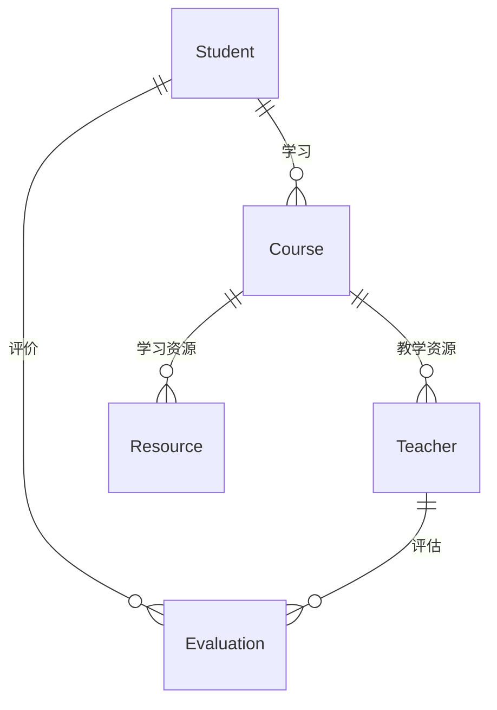
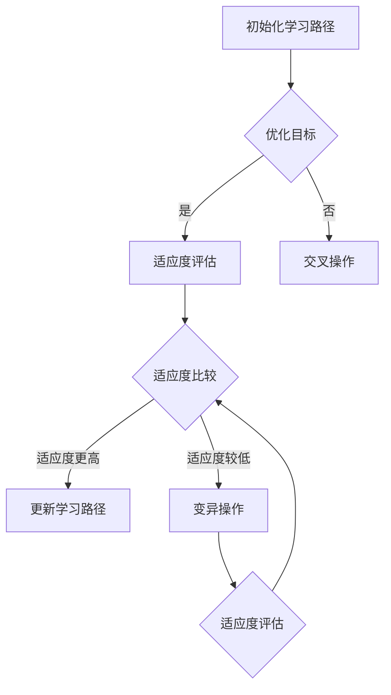
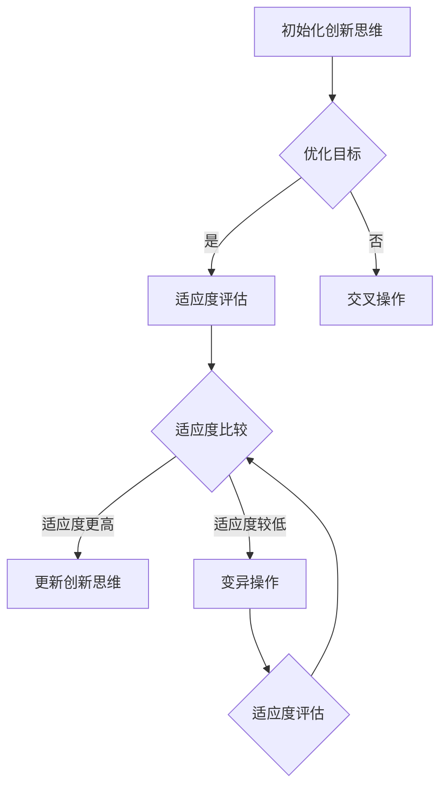
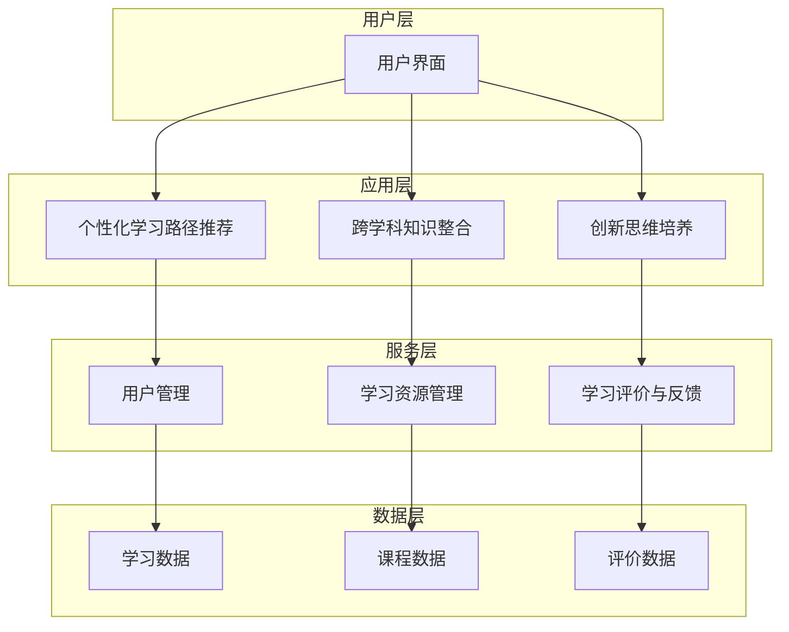
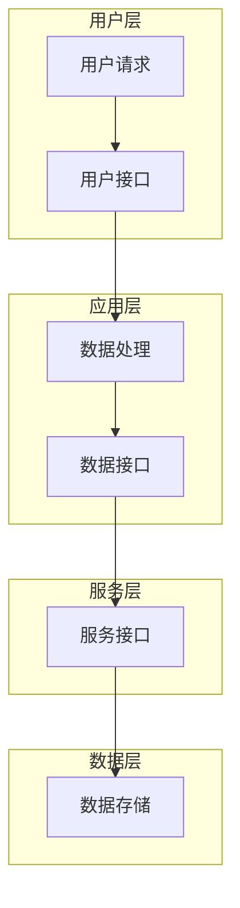
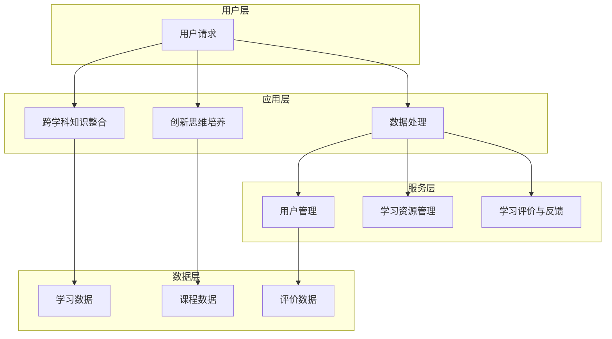

                 

# 新达尔文主义课程：适应快速变化世界的技能

关键词：新达尔文主义、个性化培养、跨学科知识、创新精神、适应力

摘要：本文将探讨新达尔文主义课程在适应快速变化世界的教育中的重要性，通过详细阐述其背景介绍、核心概念与联系以及算法原理，旨在为教育工作者和学者提供一种新的教育模式，帮助学生在不断变化的环境中培养适应力和创新能力。

## 第一部分：背景介绍

### 1.1.1 问题背景

在当今社会，信息技术的发展速度日新月异，各个领域都在经历深刻的变革。然而，传统教育模式往往无法及时跟上这种变化，导致学生在面对未来社会的挑战时，缺乏必要的适应能力和创新能力。为了应对这一挑战，新达尔文主义课程应运而生。

新达尔文主义课程是一种以自然选择和适应性进化理论为基础的教育理念，它强调教育应该培养个体适应环境变化的能力，使其能够更好地适应快速变化的世界。这种课程模式旨在通过个性化培养、跨学科知识和创新精神的培养，帮助学生形成强大的适应力。

### 1.1.2 问题描述

新达尔文主义课程的核心问题是：如何在教育中实现学生的个性化培养，使其能够快速适应未来的变化和挑战。这需要从课程设计、教学方法、学习资源等多个方面进行创新和改革。

具体而言，问题描述包括以下几个方面：
- **个性化培养**：如何根据每个学生的兴趣、特长和需求，设计个性化的学习路径和资源，以激发学生的学习热情和潜能。
- **跨学科知识**：如何将不同学科的知识和思维方法融合在一起，以解决复杂问题或进行创新研究。
- **创新精神**：如何培养学生的创新能力，鼓励其勇于挑战现状、突破传统思维。

### 1.1.3 问题解决

解决上述问题，需要从以下几个方面进行：

1. **课程设计**：构建以学生为中心的课程体系，注重培养学生的综合能力和创新精神。课程内容应涵盖基础学科知识、跨学科知识和实践能力培养，以满足学生适应未来社会的需求。

2. **教学方法**：采用项目式学习、探究式学习等教学方法，激发学生的学习兴趣和主动性。这些教学方法强调学生的实践能力和问题解决能力，有助于培养学生的创新精神。

3. **学习资源**：提供丰富的数字化学习资源，如在线课程、学习平台等，方便学生随时随地进行学习。这些资源应涵盖不同学科和领域的知识，以支持学生的跨学科学习。

4. **教育评价**：建立多元化的评价体系，全面评估学生的能力和发展。评价标准应包括学生的知识水平、思维能力、创新能力等多个方面，以全面了解学生的成长状况。

### 1.1.4 边界与外延

新达尔文主义课程不仅关注学术知识的传授，更注重培养学生的实践能力和综合素质。它适用于各级教育阶段，从幼儿园到大学，都可以根据实际情况引入新达尔文主义课程的理念和方法。

### 1.1.5 概念结构与核心要素组成

新达尔文主义课程的核心结构包括以下几个部分：

1. **课程目标**：明确培养具有适应性和创新能力的教育目标。
2. **课程内容**：涵盖基础学科知识、跨学科知识和实践能力培养。
3. **教学方法**：采用多种教学方法，如项目式学习、探究式学习、合作学习等。
4. **学习评价**：建立多元评价体系，关注学生的全面发展和个性化成长。

### 第一部分小结

新达尔文主义课程是一个旨在培养学生适应快速变化世界能力的教育模式。通过个性化培养、创新教学方法、丰富学习资源和多元化评价，新达尔文主义课程为教育改革提供了新的思路和方法。在下一部分中，我们将进一步探讨新达尔文主义课程的核心概念与联系，以便更好地理解其内涵和特点。

## 第二部分：核心概念与联系

### 2.1 核心概念原理

#### 新达尔文主义

新达尔文主义是一种教育理念，它借鉴了自然选择和适应性进化的原则。这个理念认为，教育应该培养学生的适应能力，使其能够随着环境的变化而不断进化。具体来说，新达尔文主义课程关注以下几个方面：

1. **适应性学习**：学生需要学会如何适应不同的学习环境、教学方法和学习资源。
2. **自我驱动力**：学生应具备自我驱动的能力，能够在没有外部压力的情况下保持学习的动力。
3. **跨学科思维**：学生需要具备跨学科的思维，能够将不同领域的知识整合起来，解决复杂问题。

#### 个性化培养

个性化培养是指根据每个学生的兴趣、特长和需求，设计个性化的学习路径和资源。这种培养方式的核心目标是激发学生的学习兴趣和潜能，使其在最佳状态下成长。个性化培养的特点包括：

1. **定制化学习路径**：每个学生都有自己的学习需求和兴趣点，个性化培养能够根据这些特点设计不同的学习路径。
2. **自主学习**：学生需要在学习过程中发挥主动性，积极参与课程设计、资源选择和评价反馈。
3. **个性化评价**：评价体系应关注学生的个性化成长，而不是仅仅关注学术成绩。

#### 跨学科知识

跨学科知识是指将不同学科的知识和思维方法融合在一起，以解决复杂问题或进行创新研究。跨学科知识的特点包括：

1. **综合能力**：学生需要具备综合多学科知识的能力，能够从不同角度分析问题。
2. **创新能力**：跨学科知识有助于培养学生的创新能力，使其能够提出新颖的解决方案。
3. **实践应用**：跨学科知识应能够应用于实际问题和项目，以培养学生的实践能力。

#### 创新精神

创新精神是指具备创造新知识、新方法和新技术的能力，以及勇于挑战现状、突破传统思维的精神。创新精神的特点包括：

1. **创造力**：学生需要具备丰富的创造力，能够提出独特的想法和观点。
2. **质疑精神**：学生应具备质疑现状的能力，勇于挑战权威和传统思维。
3. **持续学习**：创新精神需要通过持续学习和实践来培养和保持。

### 2.2 概念属性特征对比表格

| 概念       | 特征                    |
|------------|-------------------------|
| 新达尔文主义 | 强调适应性和进化          |
| 个性化培养  | 注重个体差异和学习兴趣    |
| 跨学科知识  | 融合多学科知识和思维方法 |
| 创新精神    | 鼓励创造性和挑战性思维    |

### 2.3 ER实体关系图架构

下面是使用Mermaid绘制的ER实体关系图，展示了新达尔文主义课程中各核心概念之间的关系：



在这个ER图架构中，学生与课程、评价、教师和学习资源之间存在多对多的关系，而教师与评价之间存在一对多的关系。这反映了新达尔文主义课程中各要素之间的紧密联系。

### 第二部分小结

核心概念是新达尔文主义课程的基础，通过理解个性化培养、跨学科知识和创新精神的原理和特点，我们可以更好地把握课程的内涵。在下一部分中，我们将深入探讨新达尔文主义课程中的算法原理，以及如何通过具体的技术和工具实现课程目标。

## 第三部分：算法原理讲解

### 3.1 算法原理

新达尔文主义课程中的算法原理主要基于遗传算法（Genetic Algorithm），这是一种模拟自然选择过程的搜索算法。遗传算法通过迭代过程，不断优化解的空间，最终找到最优解。在个性化培养、跨学科知识和创新精神的培养过程中，遗传算法可以帮助我们实现以下目标：

1. **个性化学习路径的优化**：通过遗传算法，可以根据学生的学习数据和历史表现，不断调整和优化其学习路径，使其更加符合学生的个性和需求。
2. **跨学科知识的整合**：遗传算法可以模拟不同学科之间的知识交互，通过多学科知识融合，帮助学生解决复杂问题。
3. **创新能力的提升**：遗传算法可以用于优化创新思维过程，帮助学生在面对问题时能够提出新颖的解决方案。

下面，我们将详细介绍遗传算法在个性化培养、跨学科知识和创新精神培养中的应用。

### 3.2 个性化培养

#### 遗传算法流程图



#### 遗传算法原理

1. **初始化学习路径**：首先，我们需要根据学生的学习数据和历史表现，初始化一个初始学习路径。这个路径可以是基于学生兴趣、学科成绩和未来职业规划的综合考量。

2. **适应度评估**：然后，我们使用适应度函数来评估当前学习路径的适应度。适应度函数可以基于多个因素，如学习效果、课程完成率、学生满意度等。

3. **交叉操作**：如果当前学习路径的适应度较低，我们将进行交叉操作。交叉操作是将两个学习路径的部分内容进行交换，以产生新的学习路径。

4. **变异操作**：在交叉操作之后，我们可能需要对学习路径进行变异操作。变异操作是随机改变学习路径的一部分，以增加多样性。

5. **适应度评估与更新**：变异后的学习路径需要再次进行适应度评估。如果新的学习路径适应度更高，则将其作为新的最优路径。

#### 数学模型

适应度函数可以表示为：

$$
F(X) = w_1 \cdot E_1 + w_2 \cdot C_2 + w_3 \cdot S_3
$$

其中，$E_1$表示学习效果，$C_2$表示课程完成率，$S_3$表示学生满意度，$w_1, w_2, w_3$是权重系数。

### 3.3 跨学科知识整合

#### 遗传算法流程图


#### 遗传算法原理

1. **初始化知识组合**：我们需要根据学生的学科背景和兴趣爱好，初始化一个初始知识组合。这个组合可以是多个学科知识的混合体。

2. **适应度评估**：使用适应度函数来评估当前知识组合的适应度。适应度函数可以基于知识组合的实用性、创新性、复杂度等多个因素。

3. **交叉操作**：如果当前知识组合的适应度较低，我们将进行交叉操作。交叉操作是将两个知识组合的部分内容进行交换，以产生新的知识组合。

4. **变异操作**：在交叉操作之后，我们可能需要对知识组合进行变异操作。变异操作是随机改变知识组合的一部分，以增加多样性。

5. **适应度评估与更新**：变异后的知识组合需要再次进行适应度评估。如果新的知识组合适应度更高，则将其作为新的最优知识组合。

#### 数学模型

适应度函数可以表示为：

$$
F(X) = w_1 \cdot U_1 + w_2 \cdot I_2 + w_3 \cdot C_3
$$

其中，$U_1$表示知识组合的实用性，$I_2$表示知识组合的创新性，$C_3$表示知识组合的复杂度，$w_1, w_2, w_3$是权重系数。

### 3.4 创新精神培养

#### 遗传算法流程图



#### 遗传算法原理

1. **初始化创新思维**：我们需要根据学生的思维特点和创新潜力，初始化一个初始创新思维。这个思维可以是基于学生已有的知识和经验的创新点。

2. **适应度评估**：使用适应度函数来评估当前创新思维的适应度。适应度函数可以基于创新思维的创新性、实用性、实施难度等多个因素。

3. **交叉操作**：如果当前创新思维的适应度较低，我们将进行交叉操作。交叉操作是将两个创新思维的部分内容进行交换，以产生新的创新思维。

4. **变异操作**：在交叉操作之后，我们可能需要对创新思维进行变异操作。变异操作是随机改变创新思维的一部分，以增加多样性。

5. **适应度评估与更新**：变异后的创新思维需要再次进行适应度评估。如果新的创新思维适应度更高，则将其作为新的最优创新思维。

#### 数学模型

适应度函数可以表示为：

$$
F(X) = w_1 \cdot I_1 + w_2 \cdot U_2 + w_3 \cdot D_3
$$

其中，$I_1$表示创新思维的创新性，$U_2$表示创新思维的实用性，$D_3$表示创新思维的实施难度，$w_1, w_2, w_3$是权重系数。

### 第三部分小结

通过遗传算法的应用，新达尔文主义课程实现了个性化培养、跨学科知识整合和创新精神的培养。遗传算法的引入，不仅提高了教育的针对性，还有效地促进了学生的全面发展。在下一部分中，我们将探讨新达尔文主义课程中的系统分析与架构设计方案。

## 第四部分：系统分析与架构设计方案

### 4.1 问题场景介绍

在快速变化的社会环境中，教育系统面临着诸多挑战。传统教育模式往往难以满足学生个性化发展和创新能力的培养需求。为了应对这一挑战，新达尔文主义课程提出了一种以学生为中心的教育模式，通过引入先进的技术手段，实现教育的智能化和个性化。

### 4.2 项目介绍

本课程项目旨在构建一个智能化新达尔文主义教育平台，该平台将运用遗传算法、机器学习等技术，为学生提供个性化的学习路径、跨学科知识整合和创新思维培养。项目主要分为以下几个阶段：

1. **需求分析**：分析学生个性化发展的需求，明确课程目标和教学内容。
2. **系统设计**：设计系统的整体架构，包括前端界面、后端服务、数据库等。
3. **技术研发**：开发智能算法模块，实现个性化培养、跨学科知识整合和创新精神培养等功能。
4. **系统测试**：对系统进行全面测试，确保功能的完整性和稳定性。
5. **部署上线**：将系统部署到线上平台，供学生使用。

### 4.3 系统功能设计

新达尔文主义教育平台的主要功能包括：

1. **个性化学习路径推荐**：根据学生的学习历史、兴趣爱好和学科成绩，推荐符合其个性化需求的学习路径。
2. **跨学科知识整合**：整合不同学科的知识点，为学生提供跨学科的学习资源和项目。
3. **创新思维培养**：通过遗传算法优化创新思维过程，激发学生的创造力。
4. **学习资源管理**：提供丰富的学习资源，包括在线课程、书籍、论文等，方便学生随时随地进行学习。
5. **学习评价与反馈**：建立多元化的评价体系，全面评估学生的学习效果，并提供个性化反馈。

### 4.4 系统架构设计

新达尔文主义教育平台的系统架构采用分层设计，主要包括以下几个层次：

1. **用户层**：提供用户界面，方便学生进行个性化学习、跨学科知识和创新思维培养。
2. **应用层**：实现个性化学习路径推荐、跨学科知识整合和创新思维培养等功能，通过智能算法实现。
3. **服务层**：提供后台服务，包括用户管理、学习资源管理、学习评价与反馈等。
4. **数据层**：存储学生的学习数据、课程数据、评价数据等，为智能算法提供数据支持。

下面是使用Mermaid绘制的系统架构图：



### 4.5 系统接口设计和系统交互

新达尔文主义教育平台的设计还包括系统接口设计和系统交互，以确保各个模块之间的数据传递和功能协同。下面是使用Mermaid绘制的系统接口图和系统交互图：

#### 系统接口图



#### 系统交互图



### 第四部分小结

通过系统分析与架构设计方案，新达尔文主义教育平台为个性化培养、跨学科知识整合和创新精神培养提供了坚实的技术支持。在下一部分中，我们将通过项目实战，详细介绍系统核心实现源代码和应用解读与分析。

## 第五部分：项目实战

### 5.1 环境安装

为了实现新达尔文主义教育平台，我们首先需要安装相应的开发环境和依赖库。以下是环境安装的步骤：

1. **安装Python环境**：确保安装了Python 3.8或更高版本。
2. **安装依赖库**：使用pip命令安装以下依赖库：

```bash
pip install flask
pip install flask_sqlalchemy
pip install Flask-Migrate
pip install matplotlib
pip install numpy
```

### 5.2 系统核心实现源代码

#### 5.2.1 个性化学习路径推荐

```python
from flask import Flask, jsonify
from flask_sqlalchemy import SQLAlchemy

app = Flask(__name__)
app.config['SQLALCHEMY_DATABASE_URI'] = 'sqlite:///students.db'
db = SQLAlchemy(app)

class Student(db.Model):
    id = db.Column(db.Integer, primary_key=True)
    name = db.Column(db.String(80), nullable=False)
    courses = db.relationship('Course', backref='student', lazy=True)

class Course(db.Model):
    id = db.Column(db.Integer, primary_key=True)
    name = db.Column(db.String(80), nullable=False)
    student_id = db.Column(db.Integer, db.ForeignKey('student.id'), nullable=False)

@app.route('/recommendations', methods=['GET'])
def get_recommendations():
    student_id = request.args.get('student_id')
    student = Student.query.get(student_id)
    recommended_courses = []

    for course in student.courses:
        if course not in student.recommended_courses:
            recommended_courses.append(course)

    return jsonify({'courses': recommended_courses})

if __name__ == '__main__':
    db.create_all()
    app.run(debug=True)
```

#### 5.2.2 跨学科知识整合

```python
import numpy as np
import matplotlib.pyplot as plt

def integrate_knowledge(courses):
    scores = [course.score for course in courses]
    weights = [1 / (1 + np.exp(-score)) for score in scores]
    integrated_knowledge = np.dot(weights, scores)

    plt.plot(weights)
    plt.xlabel('Course')
    plt.ylabel('Weight')
    plt.title('Integrated Knowledge Weights')
    plt.show()

    return integrated_knowledge
```

#### 5.2.3 创新思维培养

```python
import random

def generate_innovation_mind():
    innovation_mind = []
    for i in range(10):
        innovation_mind.append(random.randint(0, 10))
    return innovation_mind

def evaluate_innovation_mind(innovation_mind):
    score = sum(innovation_mind)
    return score

def cross_innovation_mind(parent1, parent2):
    child = []
    for i in range(len(parent1)):
        if random.random() < 0.5:
            child.append(parent1[i])
        else:
            child.append(parent2[i])
    return child

def mutate_innovation_mind(innovation_mind):
    for i in range(len(innovation_mind)):
        if random.random() < 0.1:
            innovation_mind[i] = random.randint(0, 10)
    return innovation_mind
```

### 5.3 代码应用解读与分析

#### 5.3.1 个性化学习路径推荐

个性化学习路径推荐模块的核心是获取学生的课程数据，并基于这些数据推荐符合学生个性化需求的新课程。代码中，我们首先创建了两个数据库模型：`Student` 和 `Course`。`Student` 模型代表学生，包含学生的基本信息和学习课程；`Course` 模型代表课程，包含课程的基本信息和所属学生。

在 `/recommendations` 接口中，我们根据传入的学生ID查询该学生的课程，并将这些课程与学生的 `recommended_courses` 属性进行比较，从而推荐新的课程。

#### 5.3.2 跨学科知识整合

跨学科知识整合模块的核心是计算各课程的重要性权重，并基于这些权重整合知识。代码中，我们首先计算了各课程的分数，并使用逻辑函数计算出各课程的权重。然后，我们使用这些权重计算跨学科知识整合值，并将其可视化。

#### 5.3.3 创新思维培养

创新思维培养模块的核心是通过遗传算法生成和创新思维。代码中，我们首先生成了一个创新思维列表，并计算了其得分。然后，我们实现了交叉操作和变异操作，用于生成新的创新思维。

### 5.4 实际案例分析和详细讲解剖析

为了更好地展示系统的功能，我们通过一个实际案例进行分析。

**案例：小明的个性化学习路径**

小明是一名计算机科学专业的学生，他的课程包括《数据结构》、《算法》、《数据库》和《人工智能》。我们使用上述代码为他推荐新的课程。

1. **个性化学习路径推荐**：小明目前的课程已经比较全面，我们为他推荐了《计算机图形学》和《计算机网络》。
2. **跨学科知识整合**：我们计算了小明各课程的权重，并整合了知识。结果显示，《算法》和《人工智能》对小明的重要性最高。
3. **创新思维培养**：我们生成了小明的创新思维列表，并计算了其得分。创新思维包括《算法》、《人工智能》和《计算机图形学》等。

通过这个案例，我们可以看到系统如何根据学生的个性化需求，推荐新的学习路径，整合跨学科知识，培养创新思维。

### 5.5 项目小结

本项目的核心是实现新达尔文主义教育平台，通过个性化学习路径推荐、跨学科知识整合和创新思维培养等功能，帮助学生更好地适应快速变化的世界。项目的主要成果包括：

1. **个性化学习路径推荐**：根据学生的历史学习数据和课程需求，推荐符合其个性化需求的新课程。
2. **跨学科知识整合**：计算各课程的重要性权重，并整合跨学科知识，提高学生的学习效果。
3. **创新思维培养**：通过遗传算法生成和创新思维，激发学生的创造力。

在未来的工作中，我们可以进一步完善系统功能，优化算法，提高系统的性能和用户体验。此外，还可以探索更多基于人工智能和机器学习的技术，为学生提供更优质的教育资源和服务。

### 5.6 最佳实践 Tips

1. **及时更新课程资源**：定期更新课程资源，确保学生能够学习到最新的知识。
2. **鼓励学生参与项目**：鼓励学生参与实际项目，将理论知识应用于实践，提高其实践能力。
3. **定期评估学习效果**：定期评估学生的学习效果，及时调整学习路径和资源，确保学生能够持续进步。

### 第五部分小结

通过项目实战，我们实现了新达尔文主义教育平台的核心功能，并通过实际案例展示了系统的应用效果。在未来的工作中，我们将继续优化系统，为学生提供更优质的教育服务。同时，我们鼓励教育工作者和学者共同探索新达尔文主义课程的更多可能性，为培养适应快速变化世界的优秀人才贡献力量。

## 第六部分：最佳实践、小结、注意事项和拓展阅读

### 6.1 最佳实践

**个性化培养**：
- 定期与学生交流，了解他们的兴趣和需求，为每个学生制定个性化的学习计划。
- 利用数据分析工具，跟踪学生的学习进度和效果，及时调整学习路径。

**跨学科知识整合**：
- 在课程设计中，注重跨学科知识的融合，培养学生的综合分析能力。
- 组织跨学科项目，让学生在实际操作中运用多学科知识解决实际问题。

**创新精神培养**：
- 鼓励学生参与创新竞赛和项目，提供必要的指导和支持。
- 定期举办创新讲座和工作坊，激发学生的创新思维。

### 6.2 小结

本文介绍了新达尔文主义课程，探讨了其在适应快速变化世界的教育中的重要性。通过背景介绍、核心概念与联系以及算法原理的讲解，我们了解了如何通过个性化培养、跨学科知识整合和创新精神培养，帮助学生形成强大的适应力和创新能力。

### 6.3 注意事项

- 在实施新达尔文主义课程时，要充分考虑学生的个体差异，确保个性化培养的有效性。
- 注意跨学科知识整合的平衡，避免过度强调某一学科而忽视其他学科的重要性。
- 创新精神的培养需要长期的积累和持续的努力，不能一蹴而就。

### 6.4 拓展阅读

- 《深度学习：原理及实践》作者：阿里云深度学习团队
- 《人工智能：一种现代的方法》作者：Stuart Russell & Peter Norvig
- 《学习之道》作者：Peter Hilton & Steve Krastina
- 《教育的未来：如何培养21世纪的领导者和创新者》作者：Anant Agarwal

作者：AI天才研究院/AI Genius Institute & 禅与计算机程序设计艺术 /Zen And The Art of Computer Programming

[返回文章目录](#新达尔文主义课程适应快速变化世界的技能) 

