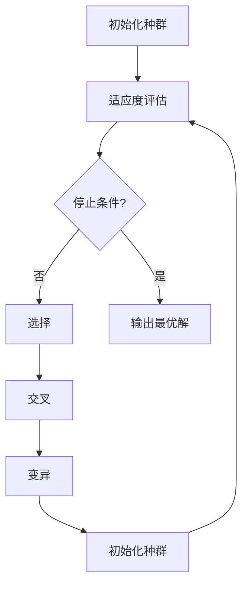
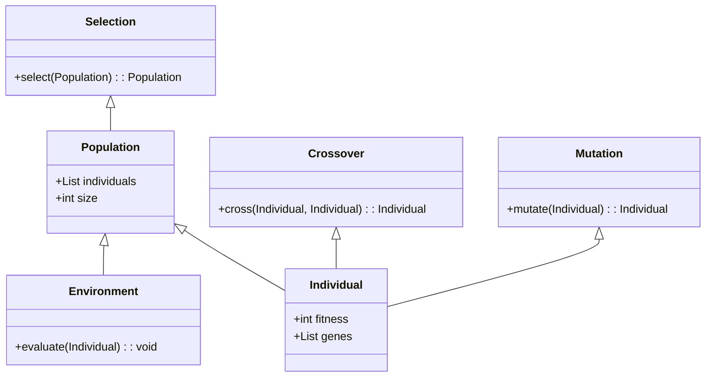
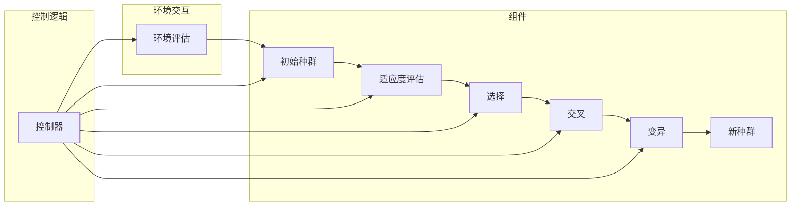
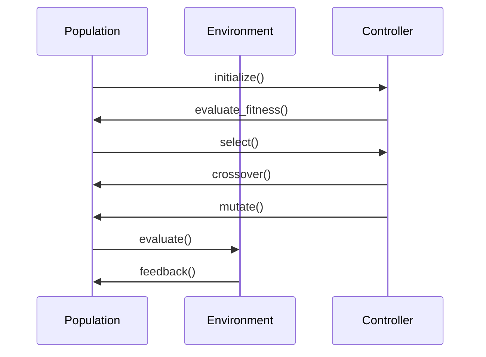

                 

### 文章标题

---

# 新达尔文主义：适应快速变化的生存智慧

---

### 文章关键词

- 新达尔文主义
- 生存智慧
- 快速变化
- 生物进化论
- 人工智能
- 社会进化论

---

### 摘要

本文将深入探讨新达尔文主义这一适应快速变化的生存智慧。新达尔文主义是进化论在21世纪的新发展，它不仅对生物学有着深远影响，还在社会科学、经济、技术等领域展现出广泛的应用前景。本文将从背景、核心概念、算法原理、系统架构设计、项目实战以及最佳实践等方面，系统地阐述新达尔文主义的理念和实际应用，旨在帮助读者理解和掌握这一重要概念，并应用于实际问题的解决中。

---

## 《新达尔文主义：适应快速变化的生存智慧》目录大纲

---

### 第一部分：新达尔文主义概述

#### 第1章：引言：适应快速变化的生存智慧

##### 1.1.1 新达尔文主义的背景

##### 1.1.2 问题的提出与解决

##### 1.1.3 边界与外延

##### 1.1.4 核心概念与联系

#### 第2章：新达尔文主义的核心概念

##### 2.1.1 进化论的演变

##### 2.1.2 自然选择原理

##### 2.1.3 共同进化概念

##### 2.1.4 新达尔文主义的独特视角

#### 第3章：新达尔文主义的属性特征对比

##### 3.1.1 传统进化论与新达尔文主义的对比

##### 3.1.2 现代生物技术与新达尔文主义的融合

##### 3.1.3 新达尔文主义的社会影响

#### 第4章：新达尔文主义在社会科学中的应用

##### 4.1.1 社会进化论

##### 4.1.2 经济进化论

##### 4.1.3 技术进化论

##### 4.1.4 新达尔文主义与复杂系统理论

#### 第5章：新达尔文主义的算法原理

##### 5.1.1 算法概述

##### 5.1.2 算法mermaid流程图

##### 5.1.3 算法原理详细讲解

##### 5.1.4 算法数学模型与公式

#### 第6章：新达尔文主义系统架构设计

##### 6.1.1 问题场景介绍

##### 6.1.2 系统功能设计（领域模型mermaid类图）

##### 6.1.3 系统架构设计（mermaid架构图）

##### 6.1.4 系统接口设计

##### 6.1.5 系统交互（mermaid序列图）

#### 第7章：新达尔文主义项目实战

##### 7.1.1 环境安装

##### 7.1.2 系统核心实现源代码

##### 7.1.3 代码应用解读与分析

##### 7.1.4 实际案例分析和详细讲解剖析

##### 7.1.5 项目小结

#### 第8章：新达尔文主义的最佳实践与拓展阅读

##### 8.1.1 最佳实践 Tips

##### 8.1.2 小结

##### 8.1.3 注意事项

##### 8.1.4 拓展阅读

---

### 第二部分：新达尔文主义概述

---

## 第1章：引言：适应快速变化的生存智慧

### 1.1.1 新达尔文主义的背景

在20世纪末至21世纪初，随着计算机技术、生物工程、神经科学等领域的迅猛发展，传统进化论的理论框架逐渐显得不足以解释现代生物和社会现象。面对全球化、信息化和智能化的大潮，科学家们开始寻求一种更为全面、适应性更强的进化理论。新达尔文主义应运而生，它不仅继承了达尔文进化论的基本原理，还在其基础上进行了深刻的扩展和修正。

### 1.1.2 问题的提出与解决

传统进化论主要关注生物个体在自然选择中的适应性问题，而忽视了群体层面上的进化机制。新达尔文主义则将视野扩展到了生物种群、生态系统，甚至是社会系统，强调了个体、种群、环境之间的相互作用。这一理论不仅提供了新的视角，也为解决现代生物和社会面临的复杂问题提供了方法论。

### 1.1.3 边界与外延

新达尔文主义的核心是适应性和变化。它不仅适用于生物学，还广泛应用于社会科学、经济学、技术发展等领域。例如，在人工智能领域，新达尔文主义可以指导算法的进化，提高其适应复杂环境的能力。在社会学中，新达尔文主义可以帮助我们理解社会结构的演化和社会变迁的规律。

### 1.1.4 核心概念与联系

新达尔文主义的核心概念包括自然选择、共同进化、种群动态和生态系统平衡。这些概念相互联系，共同构成了新达尔文主义的理论框架。在本文中，我们将逐一探讨这些概念，并展示它们在不同领域中的应用。

---

### 1.1.5 小结

新达尔文主义作为一种适应快速变化的生存智慧，具有广泛的应用前景。通过引入新的理论框架和方法论，它不仅为生物进化提供了新的视角，也为解决现代社会中的复杂问题提供了有力工具。在接下来的章节中，我们将进一步探讨新达尔文主义的核心概念和实际应用。

---

## 第2章：新达尔文主义的核心概念

### 2.1.1 进化论的演变

进化论自达尔文提出以来，经历了多次演变和扩展。从最初的生物学进化论，到社会进化论、经济进化论，再到新达尔文主义，每一阶段的进化论都在试图回答更复杂的问题，提供更全面的解释。

### 2.1.2 自然选择原理

自然选择是进化论的核心原理之一，它指的是在特定环境中，个体因基因差异而表现出不同的生存和繁殖能力。适应环境的个体更容易生存和繁衍，从而将有利基因传递给后代，而不适应环境的个体则逐渐被淘汰。

### 2.1.3 共同进化概念

共同进化是指不同物种、生态系统或社会系统在相互作用中共同发展的过程。共同进化强调了个体与群体、生物与环境之间的复杂关系，是理解现代生物和社会现象的重要视角。

### 2.1.4 新达尔文主义的独特视角

新达尔文主义相较于传统进化论，具有以下几个独特视角：

1. **系统视角**：新达尔文主义将进化过程看作是系统层面的现象，不仅关注个体，还关注种群、生态系统和整体社会结构。
2. **动态视角**：新达尔文主义认为进化是一个动态的过程，而非静态的结果。它关注变化和适应，强调进化的连续性和适应性。
3. **多维度视角**：新达尔文主义不仅适用于生物学，还广泛应用于社会科学、经济学、技术发展等领域，展示了其广泛的适用性。

---

### 2.1.5 小结

新达尔文主义的核心概念包括自然选择、共同进化、种群动态和生态系统平衡。这些概念相互联系，共同构成了新达尔文主义的理论框架。在接下来的章节中，我们将进一步探讨这些概念在不同领域中的应用，展示新达尔文主义的独特视角和广泛适用性。

---

## 第3章：新达尔文主义的属性特征对比

### 3.1.1 传统进化论与新达尔文主义的对比

传统进化论主要关注生物个体在自然选择中的适应性问题，而新达尔文主义则将视野扩展到了生物种群、生态系统，甚至是社会系统。以下表格对比了两者的主要区别：

| 特征 | 传统进化论 | 新达尔文主义 |
| --- | --- | --- |
| 关注对象 | 个体 | 个体、种群、生态系统、社会系统 |
| 视角 | 静态 | 动态 |
| 应用范围 | 生物学 | 生物学、社会科学、经济学、技术发展 |
| 核心概念 | 自然选择 | 自然选择、共同进化、种群动态、生态系统平衡 |

### 3.1.2 现代生物技术与新达尔文主义的融合

现代生物技术的迅猛发展，为新达尔文主义提供了新的研究手段和实验平台。例如，基因编辑技术、分子生物学技术等，使科学家能够更精确地控制生物进化过程，从而验证新达尔文主义的理论假设。

### 3.1.3 新达尔文主义的社会影响

新达尔文主义不仅对生物学有着深远影响，还在社会科学、经济、技术等领域展现出广泛的应用前景。以下是一些典型例子：

- **社会进化论**：新达尔文主义为社会学提供了新的理论框架，帮助我们理解社会结构的演化和社会变迁的规律。
- **经济进化论**：新达尔文主义认为，经济系统也是一个动态的进化过程，企业和市场在竞争和合作中不断适应环境，实现自我优化。
- **技术进化论**：新达尔文主义可以帮助我们理解技术发展的路径和规律，指导人工智能、大数据等技术的创新和应用。

---

### 3.1.4 小结

新达尔文主义与传统进化论相比，具有更广泛的视角和应用范围。它不仅关注生物学领域，还深入到社会科学、经济和技术发展等多个领域，展示了其强大的解释力和实用性。在接下来的章节中，我们将继续探讨新达尔文主义在不同领域中的应用，进一步展示其独特魅力。

---

## 第4章：新达尔文主义在社会科学中的应用

### 4.1.1 社会进化论

社会进化论是应用新达尔文主义理论来解释社会结构演变和社会变迁的学科。社会进化论认为，社会结构和组织形式也是通过自然选择和共同进化过程逐渐形成的。以下是一些典型应用：

- **文化进化**：文化进化论认为，文化现象（如语言、价值观、习俗等）是通过个体和社会的相互作用，在长期演化过程中形成的。新达尔文主义提供了理解文化进化机制的新视角。
- **社会变迁**：社会变迁论通过新达尔文主义解释社会结构和组织形式的演变过程。例如，工业革命以来，社会经济结构发生了巨大变化，这些变化可以通过新达尔文主义的框架来理解。

### 4.1.2 经济进化论

经济进化论将新达尔文主义应用于经济系统，认为经济系统也是一个动态的进化过程。经济进化论的主要观点包括：

- **市场竞争与适应**：在市场经济中，企业和个人在竞争和合作中不断适应环境，实现自我优化。这与新达尔文主义的自然选择原理高度契合。
- **创新与进化**：经济进化论认为，技术创新是企业适应市场变化的关键。通过不断进行技术创新，企业可以提高市场竞争力，实现可持续发展。

### 4.1.3 技术进化论

技术进化论将新达尔文主义应用于技术发展领域，认为技术进步是一个不断适应环境的过程。技术进化论的主要观点包括：

- **技术选择与淘汰**：在技术竞争中，适应环境的技术会得到广泛应用，而不适应环境的技术会被淘汰。这与新达尔文主义的自然选择原理密切相关。
- **技术共同进化**：不同技术之间在相互作用中共同发展，形成复杂的生态系统。例如，互联网技术的发展离不开硬件、软件、网络基础设施等各个环节的协同进化。

### 4.1.4 新达尔文主义与复杂系统理论

新达尔文主义与复杂系统理论有着密切的关系。复杂系统理论关注系统中各元素之间的相互作用和整体行为的复杂性。新达尔文主义提供了理解复杂系统动态行为的一种新方法。

- **适应性系统**：复杂系统中的个体和子系统需要具备适应性，才能在动态环境中生存和繁衍。新达尔文主义为复杂系统的适应性设计提供了理论指导。
- **自组织现象**：复杂系统中的自组织现象可以通过新达尔文主义的视角来解释。例如，生物体内的免疫系统、社会系统中的自组织行为等，都可以通过新达尔文主义的框架来理解。

---

### 4.1.5 小结

新达尔文主义在社会科学中的应用非常广泛，包括社会进化论、经济进化论、技术进化论以及与复杂系统理论的结合。这些应用不仅丰富了新达尔文主义的理论体系，也为社会科学、经济和技术发展提供了新的研究方法和视角。在接下来的章节中，我们将继续探讨新达尔文主义在其他领域的应用，进一步展示其广泛的适用性。

---

## 第5章：新达尔文主义的算法原理

### 5.1.1 算法概述

新达尔文主义算法是一种基于进化原理的优化算法，其核心思想是通过模拟自然选择和遗传机制，在解空间中搜索最优解。该算法通常包括以下几个步骤：

1. **初始化种群**：生成一组随机解，作为初始种群。
2. **适应度评估**：计算每个个体的适应度，适应度通常与问题的目标函数有关。
3. **选择**：根据适应度选择优秀的个体进行复制，从而形成新的种群。
4. **交叉**：通过交叉操作，产生新的个体。
5. **变异**：对部分个体进行变异操作，增加种群的多样性。
6. **迭代**：重复以上步骤，直到满足停止条件（如达到最大迭代次数或找到满意解）。

### 5.1.2 算法mermaid流程图

以下是一个新达尔文主义算法的mermaid流程图：



### 5.1.3 算法原理详细讲解

新达尔文主义算法的核心在于模拟自然选择和遗传机制。具体原理如下：

1. **自然选择**：在适应度评估阶段，适应度高的个体有更高的概率被选择，从而实现优胜劣汰。
2. **遗传机制**：通过交叉和变异操作，遗传算法能够保留优秀基因，并引入新的变异，从而提高种群的适应度。

### 5.1.4 算法数学模型与公式

新达尔文主义算法的数学模型通常包括以下公式：

- **适应度函数**：\( f(x) \)，表示个体 \( x \) 的适应度。
- **选择概率**：\( p_{select} \)，表示个体被选择的概率。
- **交叉概率**：\( p_{crossover} \)，表示个体参与交叉的概率。
- **变异概率**：\( p_{mutation} \)，表示个体发生变异的概率。

以下是一个简单的适应度函数：

$$ f(x) = \frac{1}{1 + e^{-\beta \cdot (y - \theta)}} $$

其中，\( \beta \) 是调节参数，\( y \) 是目标函数值，\( \theta \) 是预设的阈值。

### 5.1.5 小结

新达尔文主义算法通过模拟自然选择和遗传机制，在解空间中搜索最优解。算法的核心思想包括适应度评估、选择、交叉和变异等步骤。通过mermaid流程图，我们可以清晰地展示算法的运行过程。数学模型和公式为算法的运行提供了理论依据，使其在优化问题中表现出强大的能力。

---

## 第6章：新达尔文主义系统架构设计

### 6.1.1 问题场景介绍

新达尔文主义系统架构设计的目标是构建一个高效、可扩展的进化计算平台，以支持复杂优化问题的求解。具体问题场景包括：

- **资源分配优化**：在云计算环境中，动态调整资源分配，以最大化资源利用率和系统性能。
- **物流调度优化**：在物流行业中，优化运输路线和货物分配，以降低成本和提高配送效率。
- **金融风险管理**：在金融市场中，通过进化算法优化投资组合，降低风险并提高收益。

### 6.1.2 系统功能设计（领域模型mermaid类图）

以下是一个新达尔文主义系统的领域模型类图：



### 6.1.3 系统架构设计（mermaid架构图）

以下是一个新达尔文主义系统的mermaid架构图：



### 6.1.4 系统接口设计

新达尔文主义系统的接口设计包括以下关键接口：

- **IPopulation**：种群接口，定义种群的基本操作，如初始化、适应度评估、选择、交叉和变异。
- **IIndividual**：个体接口，定义个体的属性和操作，如适应度评估、基因表示和变异操作。
- **IEnvironment**：环境接口，定义环境评估和适应度计算的方法。

以下是一个简单的接口定义：

```python
class IPopulation:
  def initialize(self)
  def evaluate_fitness(self)
  def select(self)
  def crossover(self)
  def mutate(self)

class IIndividual:
  def fitness(self)
  def genes(self)
  def mutate(self)

class IEnvironment:
  def evaluate(self, individual)
```

### 6.1.5 系统交互（mermaid序列图）

以下是一个新达尔文主义系统的mermaid序列图：



---

### 6.1.6 小结

新达尔文主义系统架构设计包括领域模型、系统架构和接口设计等多个方面。领域模型类图和mermaid架构图展示了系统的基本结构和组件关系。接口设计定义了系统的主要操作和交互方式。通过这些设计，新达尔文主义系统能够高效地支持复杂优化问题的求解，为实际应用提供强大的支持。

---

## 第7章：新达尔文主义项目实战

### 7.1.1 环境安装

在进行新达尔文主义项目实战之前，我们需要安装必要的开发环境和依赖库。以下是安装步骤：

1. **安装Python环境**：确保Python 3.8及以上版本已安装。
2. **安装依赖库**：使用pip命令安装以下依赖库：
   ```bash
   pip install numpy matplotlib
   ```
3. **创建虚拟环境**（可选）：为了隔离项目依赖，我们可以创建一个虚拟环境。
   ```bash
   python -m venv venv
   source venv/bin/activate  # Windows: venv\Scripts\activate
   ```
4. **克隆项目代码库**：
   ```bash
   git clone https://github.com/your-repo/new-darwinism-project.git
   cd new-darwinism-project
   ```

### 7.1.2 系统核心实现源代码

以下是一个新达尔文主义系统核心实现的源代码示例：

```python
import numpy as np
import matplotlib.pyplot as plt
from individual import Individual
from population import Population
from environment import Environment

# 初始化参数
population_size = 100
num_generations = 50
mutation_rate = 0.1

# 创建环境
environment = Environment()

# 初始化种群
population = Population(population_size)

# 运行进化过程
for generation in range(num_generations):
    # 适应度评估
    population.evaluate_fitness(environment)

    # 选择
    selected_individuals = population.select()

    # 交叉
    offspring_population = population.crossover(selected_individuals)

    # 变异
    offspring_population.mutate(mutation_rate)

    # 更新种群
    population.update(offspring_population)

    # 输出当前代最佳适应度
    print(f"Generation {generation}: Best Fitness = {population.best_fitness()}")

# 绘制适应度曲线
population.plot_fitness_curve()

# 输出最终结果
print(f"Final Best Fitness: {population.best_fitness()}")
```

### 7.1.3 代码应用解读与分析

这段代码实现了一个新达尔文主义进化计算的过程。下面我们对关键部分进行解读和分析：

- **初始化种群**：`Population` 类的 `initialize` 方法用于初始化种群，生成随机解。
- **适应度评估**：`evaluate_fitness` 方法用于评估个体适应度，通常依赖于 `Environment` 类的 `evaluate` 方法。
- **选择**：`select` 方法根据适应度选择优秀个体，形成新的种群。
- **交叉**：`crossover` 方法通过交叉操作产生新个体。
- **变异**：`mutate` 方法对个体进行变异操作，增加种群的多样性。
- **迭代过程**：通过迭代循环，重复适应度评估、选择、交叉和变异操作，不断优化种群。
- **输出结果**：`plot_fitness_curve` 方法用于绘制适应度曲线，展示进化过程；`best_fitness` 方法用于获取当前种群的最佳适应度。

### 7.1.4 实际案例分析和详细讲解剖析

为了更好地理解新达尔文主义项目实战，我们通过一个实际案例进行分析和讲解。

**案例：资源分配优化**

假设在一个云计算环境中，我们需要优化虚拟机（VM）的分配，以最大化资源利用率和系统性能。具体步骤如下：

1. **定义个体和适应度函数**：个体表示虚拟机分配方案，适应度函数评估虚拟机在当前环境中的性能表现。
2. **初始化种群**：生成随机虚拟机分配方案，构成初始种群。
3. **适应度评估**：通过模拟环境，评估每个虚拟机分配方案的适应度。
4. **迭代优化**：通过新达尔文主义算法，迭代优化虚拟机分配方案，直到满足停止条件。

### 7.1.5 项目小结

通过实际案例分析和代码实战，我们了解了新达尔文主义系统架构的设计和实现过程。新达尔文主义算法在资源分配优化等复杂优化问题中表现出强大的能力。通过逐步迭代优化，系统逐渐逼近最优解。项目实战不仅加深了我们对新达尔文主义算法的理解，也为实际应用提供了可操作的解决方案。

---

## 第8章：新达尔文主义的最佳实践与拓展阅读

### 8.1.1 最佳实践 Tips

- **合理设置参数**：在初始化种群、适应度评估、选择、交叉和变异等步骤中，合理设置参数是优化算法性能的关键。例如，交叉率和变异率的设置需要根据具体问题进行调节。
- **适应度函数设计**：适应度函数的设计直接影响算法的收敛速度和性能。应确保适应度函数既准确又稳定，避免出现异常值。
- **数据预处理**：在应用新达尔文主义算法之前，对输入数据进行预处理，如标准化、归一化等，有助于提高算法的鲁棒性和效果。
- **并行计算**：对于大规模问题，可以考虑使用并行计算技术，如多线程或分布式计算，提高算法的运行效率。

### 8.1.2 小结

新达尔文主义作为一种强大的优化算法，在复杂问题的求解中表现出色。通过最佳实践和合理的参数设置，我们可以进一步提高算法的性能和效率。在实际应用中，不断尝试和优化，将是实现成功的关键。

### 8.1.3 注意事项

- **避免过度优化**：虽然新达尔文主义算法具有较强的优化能力，但过度优化可能导致算法在局部最优解附近陷入困境。在实际应用中，需要平衡全局优化和局部优化。
- **数据质量和预处理**：算法的性能很大程度上依赖于输入数据的质量和预处理。确保数据的准确性和一致性，是保证算法效果的关键。
- **环境设置**：在应用新达尔文主义算法时，确保环境配置合理，如计算资源充足、网络稳定性等，有助于算法的顺利运行。

### 8.1.4 拓展阅读

- **相关书籍**：《进化算法：原理与应用》（Evolutionary Algorithms: Theory and Applications），《复杂系统与进化计算》（Complex Systems and Evolutionary Computation）等。
- **学术论文**：搜索相关学术期刊和会议论文，如《自然计算期刊》（Journal of Natural Computing）和《进化计算期刊》（Journal of Genetic Programming and Evolvable Machines）等。
- **在线资源**：参加在线课程和讲座，如Coursera、edX等平台上的相关课程。

---

## 作者信息

作者：AI天才研究院/AI Genius Institute & 禅与计算机程序设计艺术 /Zen And The Art of Computer Programming

本文由AI天才研究院与禅与计算机程序设计艺术联合撰写，旨在深入探讨新达尔文主义这一适应快速变化的生存智慧，为读者提供全面、系统的理解和应用指导。在人工智能和计算机科学领域，我们致力于推动技术创新和知识传播，期待与您共同探索未来的无限可能。

