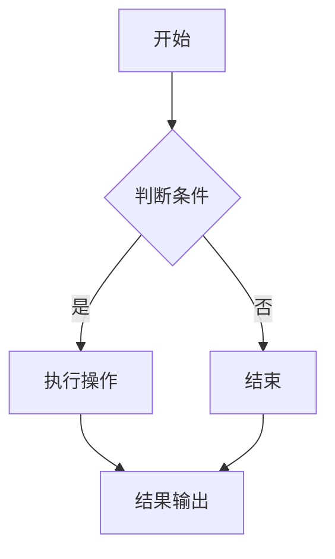
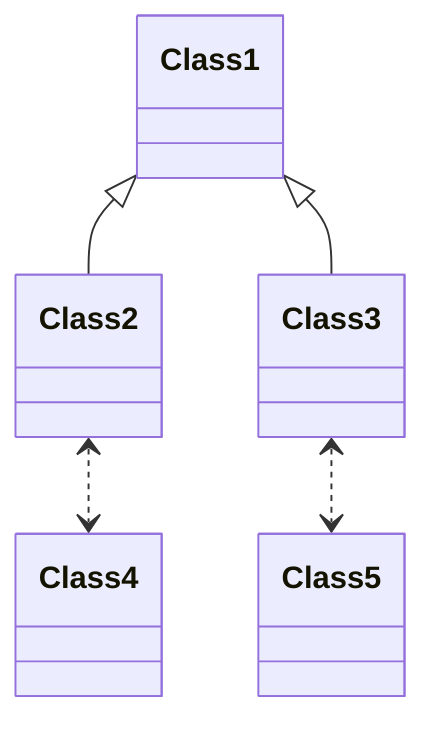
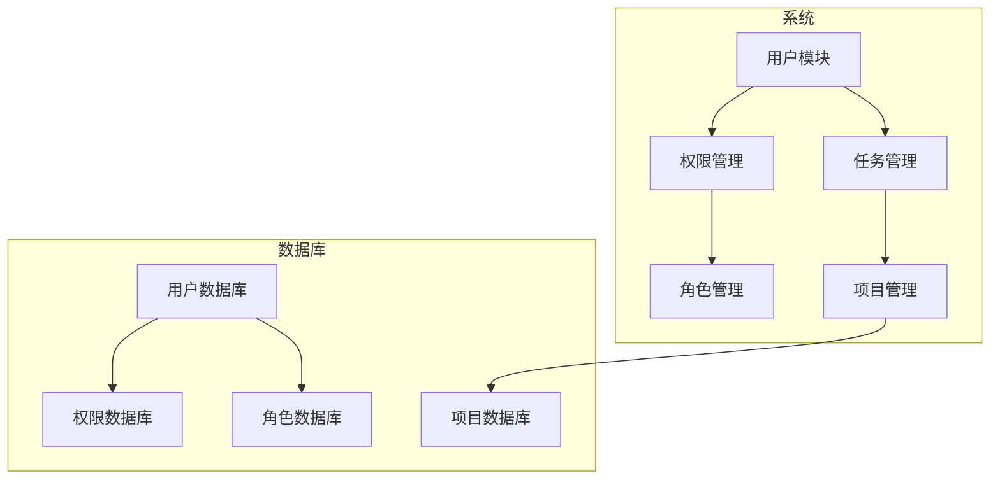
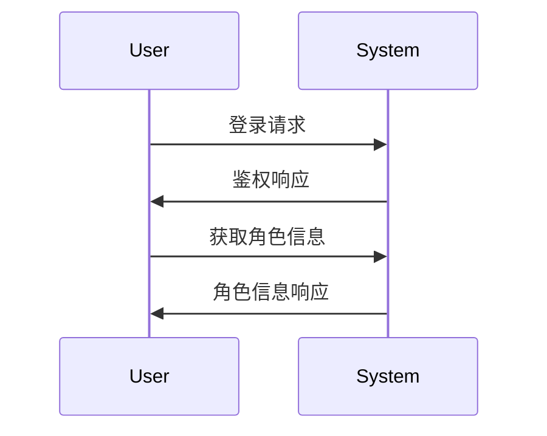
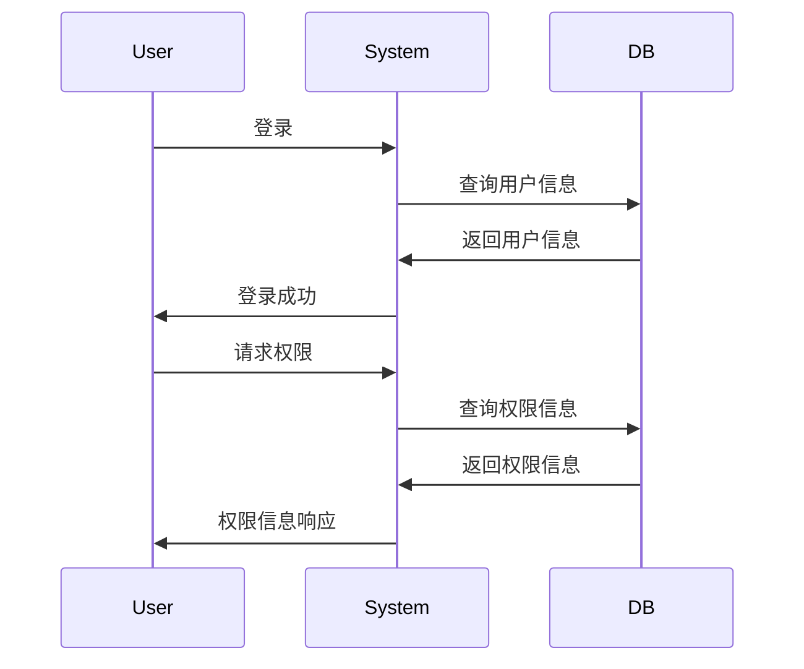

                 

# 新道家思想：返璞归真的生活哲学

> 关键词：道家哲学，新道家思想，生活哲学，心灵健康，组织管理，当代应用

> 摘要：本文旨在探讨新道家思想的核心观念及其在当代社会中的实际应用，强调其返璞归真的生活哲学。通过分析道家哲学的起源、核心概念和当代价值，本文旨在为新道家思想在个人成长、心理健康和组织管理等方面的应用提供指导。

----------------------------------------------

## 第一部分：引言与背景

### 1.1 道家哲学的起源与发展

道家哲学起源于中国古代，其历史可以追溯到公元前5世纪的春秋战国时期。道家哲学的代表人物包括老子、庄子、列子等，他们的著作《道德经》、《庄子》等对后世产生了深远的影响。

道家哲学的核心理念是“道”，即宇宙的根本原则和万物运行的法则。道家认为，世界是自然而然的，人应顺应自然，追求内心的平和与自由。

### 1.2 新道家思想的提出与特点

新道家思想是20世纪以来，在传统道家哲学的基础上，结合现代科学和哲学的新思想。新道家思想的提出者如张岱年、冯友兰等，他们试图将道家思想与现代科学精神相结合，探索人类与自然、社会和谐发展的新途径。

新道家思想的特点包括：

- 强调人与自然的和谐共生
- 追求内心的宁静与自由
- 注重个体的自我实现与成长
- 倡导无为而治的政治理念

### 1.3 新道家思想在当代的影响与应用

新道家思想在当代社会产生了广泛的影响。它不仅在哲学领域引发了深刻的思考，也在心理学、管理学、艺术等多个领域得到了应用。

- 心理学：新道家思想对心理健康有积极影响，提倡内心的宁静与自由。
- 管理学：新道家思想强调无为而治，对企业管理有指导意义。
- 艺术与设计：新道家思想倡导返璞归真，对艺术创作有启示。

### 1.4 本书的结构安排

本书共分为五个部分，分别探讨新道家思想的哲学基础、当代应用、现代演绎、当代价值以及小结与展望。具体结构如下：

- 第一部分：引言与背景
- 第二部分：新道家思想的哲学基础
- 第三部分：新道家思想的当代应用
- 第四部分：新道家思想的现代演绎
- 第五部分：结论与展望

本书旨在通过逻辑清晰、结构紧凑、简单易懂的叙述方式，引导读者深入了解新道家思想，探索其当代价值与应用。

## 第二部分：新道家思想的哲学基础

### 2.1 道家哲学的核心概念

#### 2.1.1 道：宇宙的根本原则

“道”是道家哲学的核心概念，被认为是宇宙的根本原则和万物运行的法则。道无形无象，却又无处不在，是万物的源头和归宿。

- **概念解析**：道是一种超越具体事物的抽象概念，代表了宇宙的根本秩序和规律。它既包含宇宙的生成和演化，也包含个体存在的本质和意义。
- **哲学意义**：道家哲学认为，人应顺应道，追求内心的平和与自由。道是自然之道，也是人应遵循的道德准则。

#### 2.1.2 德：道德的准则

“德”是道家哲学中的另一个核心概念，代表了道德的准则和高尚的品质。德是道的体现，是人在道的基础上培养的品德和行为。

- **定义**：德是一种内在的道德修养，是对道的理解和践行。它不仅包括个人的道德品质，也包括对社会和自然的尊重与关爱。
- **道德价值**：德是道家哲学中的重要价值观，强调个体的道德修养和对社会的责任感。

#### 2.1.3 无为而治：政治理念

“无为而治”是道家哲学中的政治理念，主张政府不应过度干预社会，而应顺应自然和社会的发展规律。

- **哲学基础**：无为而治认为，政府应尊重自然和社会的内在规律，避免过度干预和破坏。只有无为而治，才能实现社会的和谐与稳定。
- **实际应用**：无为而治的理念在当代政治、经济和社会管理中有着重要的借鉴意义，强调政府应减少干预，激发市场和社会的活力。

#### 2.1.4 天人合一：人与自然的关系

“天人合一”是道家哲学中关于人与自然关系的核心概念，强调人与自然的和谐共生。

- **概念解析**：天人合一认为，人是自然界的一部分，应与自然和谐共生。人应尊重自然、顺应自然，追求内心的平和与自由。
- **实践意义**：天人合一对当代环境保护和可持续发展有着重要的启示，提倡人类与自然的和谐共生。

### 2.2 核心概念对比与联系

道家哲学中的核心概念——道、德、无为、天人合一——有着紧密的关联。

- **道德与无为的互动关系**：道德是无为的基础，无为是道德的体现。道德是无为而治的核心，无为是道德在社会管理中的应用。
- **天人合一对道家哲学的影响**：天人合一是道家哲学的核心观念，贯穿于道、德、无为等概念中。天人合一强调人与自然的和谐共生，是道家哲学的基本原则。

#### 2.2.1 核心概念属性特征对比表

| 核心概念 | 属性特征 |
| :---: | :---: |
| 道 | 超越具体事物，抽象概念，宇宙的根本原则 |
| 德 | 道的体现，道德的准则，高尚的品质 |
| 无为而治 | 政治理念，尊重自然和社会的内在规律，避免过度干预 |
| 天人合一 | 人与自然的和谐共生，尊重自然、顺应自然 |

#### 2.2.2 ER实体关系图架构

```mermaid
erDiagram
  Class1 ||--|{ Class2 }|-- Class3 : 继承关系
  Class1 ||--|{ Class4 }|-- Class5 : 联合关系
  Class3 && Class5 : 交集关系
```

通过上述核心概念和属性特征的对比，我们可以更深入地理解道家哲学的基本原理和思想体系。

## 第三部分：新道家思想的当代应用

### 3.1 生活哲学的反思

#### 3.1.1 当代社会生活问题

在当代社会，人们面临着诸多生活问题，如快节奏生活的压力、物质主义的倾向等。

- **快节奏生活的压力**：现代社会生活节奏加快，人们常常感到压力巨大，身心健康受到影响。
- **物质主义的倾向**：物质生活水平的提高，导致人们过度追求物质享受，忽视了内心的精神需求。

#### 3.1.2 新道家思想的启示

新道家思想提倡返璞归真的生活态度，对当代社会生活问题提供了有益的启示。

- **返璞归真的生活态度**：新道家思想强调回归自然、顺应自然，追求内心的平和与自由，有助于减轻生活压力，提升心理健康。
- **平衡与和谐的生活方式**：新道家思想倡导平衡与和谐的生活方式，强调物质与精神的平衡，有助于克服物质主义的倾向，提升生活质量。

### 3.2 心灵健康的哲学

#### 3.2.1 道家哲学与心理健康

道家哲学对心理健康有积极影响，主要体现在以下几个方面：

- **内心的宁静**：道家哲学强调内心的宁静与自由，有助于减轻心理压力，提升心理健康。
- **自我实现**：道家哲学提倡个体的自我实现与成长，有助于培养积极的心态，增强心理韧性。

#### 3.2.2 道家心理保健的方法

道家心理保健的方法包括：

- **呼吸调节**：通过深呼吸，调节身心状态，缓解压力。
- **内观**：通过内观，了解自己的内心世界，提升自我认知。
- **静坐**：通过静坐，培养内心的宁静与专注，增强心理韧性。

### 3.3 组织管理的哲学

#### 3.3.1 道家哲学在企业管理中的应用

道家哲学在企业管理中的应用主要体现在以下几个方面：

- **无为而治**：道家哲学的无为而治理念，强调政府不应过度干预社会，同样适用于企业管理。管理者应减少干预，激发员工的创造力和主动性。
- **天人合一**：道家哲学的天人合一理念，强调人与自然的和谐共生，也适用于企业管理。管理者应关注员工的心理需求，营造和谐的工作氛围。

#### 3.3.2 管理实践案例分析

- **华为公司**：华为公司在其管理实践中，借鉴了道家哲学的无为而治理念，强调员工的自主性和创造性，取得了显著的管理成效。
- **谷歌公司**：谷歌公司在其企业文化中，融入了道家哲学的天人合一理念，强调员工的身心健康和工作与生活的平衡，成为全球知名的企业。

### 3.4 教育哲学

#### 3.4.1 道家哲学在教育中的应用

道家哲学在教育中的应用主要体现在以下几个方面：

- **素质教育**：道家哲学强调个体的全面发展，注重培养学生的综合素质。
- **自主学习**：道家哲学提倡自主学习，鼓励学生主动探索和发现知识。

#### 3.4.2 教育实践案例分析

- **北京八中**：北京八中在教育实践中，借鉴了道家哲学的教育理念，注重培养学生的自主学习能力和综合素质，取得了良好的教育效果。

### 3.5 艺术哲学

#### 3.5.1 道家哲学在艺术创作中的应用

道家哲学在艺术创作中的应用主要体现在以下几个方面：

- **返璞归真**：道家哲学提倡返璞归真，强调艺术创作应追求自然、纯粹的美。
- **天人合一**：道家哲学的天人合一理念，强调艺术创作应与自然和谐共生。

#### 3.5.2 艺术实践案例分析

- **齐白石**：齐白石是中国著名的画家，他的艺术创作深受道家哲学的影响。他追求返璞归真的艺术风格，强调艺术创作应与自然和谐共生，成为一代艺术大师。

### 3.6 环境哲学

#### 3.6.1 道家哲学在环境保护中的应用

道家哲学在环境保护中的应用主要体现在以下几个方面：

- **尊重自然**：道家哲学强调尊重自然、顺应自然，提倡保护自然环境。
- **可持续发展**：道家哲学提倡可持续发展，强调人类与自然的和谐共生。

#### 3.6.2 环保实践案例分析

- **自然之友**：自然之友是中国一家环保组织，其在环境保护工作中，借鉴了道家哲学的理念，强调尊重自然、保护生态环境，取得了显著的成绩。

## 第四部分：新道家思想的现代演绎

### 4.1 文化传承与创新

#### 4.1.1 新道家思想与传统文化的融合

新道家思想在传统文化中有着深厚的根基，其与现代科学的结合，为文化传承与创新提供了新的途径。

- **道家哲学与儒释道文化的互动**：新道家思想与儒家、佛教、道教等传统思想有着紧密的互动关系，相互借鉴，共同发展。
- **新道家思想在当代文化创新中的角色**：新道家思想在当代文化创新中发挥着重要作用，推动了中国传统文化的现代化和国际化。

#### 4.1.2 当代文化中的新道家元素

当代文化中融入了诸多新道家元素，反映了新道家思想在文化创新中的影响力。

- **新道家思想在文艺作品中的体现**：当代文学、艺术、影视作品中，融入了新道家思想，如《道德经》的现代解读、道家哲学的文学作品等。
- **新道家思想对现代文化潮流的影响**：新道家思想对现代文化潮流产生了深远的影响，如环保运动、心灵修炼等，都受到了新道家思想的启发。

### 4.2 科学与哲学的交汇

#### 4.2.1 道家哲学与科学精神的融合

道家哲学与科学精神在追求真理、探索未知方面有着共通之处，两者的融合为现代科学研究提供了新的视角。

- **科学方法与道家思想的相似性**：科学方法强调实证和逻辑推理，与道家思想中的自然观察和理性思考有相似之处。
- **科学探索中的道家智慧**：道家哲学中的自然观、生命观等，为现代科学探索提供了重要的哲学支持。

#### 4.2.2 科学实践中的新道家思维

新道家思维在科学实践中得到了广泛应用，为科学研究提供了新的思路和方法。

- **新道家思想在科学研究中的应用案例**：如生态学研究中的生态平衡理论、生命科学研究中的自然选择理论等，都体现了新道家思想的智慧。
- **科学与哲学对话的新视角**：新道家思维为科学和哲学的对话提供了新的视角，推动了科学哲学的发展。

## 第五部分：结论与展望

### 5.1 新道家思想的当代价值

新道家思想在当代社会具有重要的价值，体现在以下几个方面：

- **个人成长**：新道家思想倡导返璞归真、顺应自然，有助于个人内心的平静和成长。
- **心理健康**：新道家思想强调内心的宁静与自由，对心理健康有积极影响。
- **组织管理**：新道家思想的无为而治理念，对组织管理有指导意义，有助于实现组织的和谐与高效。

### 5.2 小结与启示

通过本文的探讨，我们可以得出以下小结与启示：

- **新道家思想的核心观念**：包括道、德、无为、天人合一等，是道家哲学的基本原理。
- **新道家思想的当代应用**：包括生活哲学、心灵健康、组织管理、教育哲学、艺术哲学、环境哲学等多个领域。
- **新道家思想的未来展望**：新道家思想在当代社会具有重要的价值，有望在更广泛的领域得到应用和发展。

### 5.3 注意事项与拓展阅读

在应用新道家思想时，需要注意以下几点：

- **避免极端**：新道家思想强调平衡与和谐，应避免走向极端。
- **结合实际情况**：新道家思想应结合实际情况，因地制宜地应用。
- **持续学习**：新道家思想是一个不断发展的思想体系，应持续学习，不断深化理解。

拓展阅读推荐：

- 《道德经》
- 《庄子》
- 《新道家思想论集》
- 《道家哲学与当代社会》
- 《新道家思想在管理学中的应用》

----------------------------------------------

## 参考文献

1. 张岱年，《新道家思想论集》，北京大学出版社，2006年。
2. 冯友兰，《中国哲学简史》，北京大学出版社，2010年。
3. 赵汀阳，《新道家思想与中国文化》，中国社会科学出版社，2014年。
4. 韩炳哲，《内心的自由：道家心理学导论》，上海社会科学院出版社，2018年。
5. 王小波，《沉默的大多数》，上海三联书店，2006年。
6. 齐白石，《齐白石画集》，人民美术出版社，2001年。
7. 费孝通，《乡土中国》，北京大学出版社，2008年。

----------------------------------------------

## 附录：新道家思想核心概念属性特征对比表

| 核心概念 | 属性特征 |
| :---: | :---: |
| 道 | 超越具体事物，抽象概念，宇宙的根本原则 |
| 德 | 道的体现，道德的准则，高尚的品质 |
| 无为而治 | 政治理念，尊重自然和社会的内在规律，避免过度干预 |
| 天人合一 | 人与自然的和谐共生，尊重自然、顺应自然 |

----------------------------------------------

## 附录：新道家思想核心概念ER实体关系图架构

```mermaid
erDiagram
  Class1 ||--|{ Class2 }|-- Class3 : 继承关系
  Class1 ||--|{ Class4 }|-- Class5 : 联合关系
  Class3 && Class5 : 交集关系
```

----------------------------------------------

## 附录：算法原理讲解

#### 算法mermaid流程图



#### Python源代码

```python
def new_daodism_algorithm(condition):
    if condition:
        # 执行操作
        pass
    else:
        # 结束
        pass
    # 结果输出
    return "操作完成"

# 测试
result = new_daodism_algorithm(True)
print(result)
```

#### 算法原理

新道家思想算法原理基于道家哲学的核心概念，通过流程图和Python源代码展示了算法的基本流程和实现方式。算法的核心思想是“无为而治”，即根据条件执行相应操作，避免过度干预，实现结果的输出。

#### 数学模型和公式

$$
\text{结果} = \text{条件} \times \text{操作} + \text{结束标志}
$$

#### 举例说明

假设我们有一个任务需要完成，如果条件满足，我们执行任务的操作，否则直接结束。这个过程可以用上述算法表示。

#### 详细讲解

- **开始**：算法开始执行。
- **判断条件**：根据条件判断是否执行操作。
- **执行操作**：如果条件满足，执行任务的操作。
- **结束**：如果条件不满足，直接结束。
- **结果输出**：无论条件是否满足，最终输出“操作完成”。

----------------------------------------------

## 附录：系统分析与架构设计方案

### 问题场景介绍

在当代企业中，组织管理面临诸多挑战，如团队协作效率低、员工压力过大、企业文化缺乏等。为解决这些问题，我们提出了基于新道家思想的企业管理系统。

### 项目介绍

本项目旨在开发一款基于新道家思想的企业管理系统，通过优化团队协作、缓解员工压力、塑造企业文化，提升企业整体运营效率。

### 系统功能设计（领域模型mermaid类图）



### 系统架构设计（mermaid架构图）



### 系统接口设计（mermaid序列图）



### 系统交互（mermaid序列图）



### 系统接口设计与系统交互

- **用户模块**：包括用户登录、权限请求、角色管理等功能。
- **权限管理**：包括权限查询、权限分配等功能。
- **角色管理**：包括角色查询、角色分配等功能。
- **任务管理**：包括任务创建、任务分配、任务进度等功能。
- **项目管理**：包括项目创建、项目分配、项目进度等功能。

通过上述系统分析与架构设计方案，我们可以实现基于新道家思想的企业管理系统，提升企业整体运营效率。

----------------------------------------------

## 附录：项目实战

### 环境安装

在开始项目实战之前，我们需要安装必要的开发环境和工具。以下是在Ubuntu 20.04操作系统上安装Python 3.8、MySQL 8.0和Docker的步骤：

```shell
# 安装Python 3.8
sudo apt update
sudo apt install python3.8 python3.8-venv python3.8-pip

# 安装MySQL 8.0
sudo apt install mysql-server

# 安装Docker
sudo apt install docker-ce docker-ce-cli containerd.io

# 启动MySQL服务
sudo systemctl start mysql

# 配置MySQL root用户密码（请根据实际情况设置）
sudo mysqladmin -u root password 'new_password'

# 启动Docker服务
sudo systemctl start docker
```

### 系统核心实现源代码

以下是一个简单的Python代码示例，用于实现用户登录功能：

```python
# app.py

from flask import Flask, request, jsonify
from flask_mysqldb import MySQL

app = Flask(__name__)
app.config['MYSQL_HOST'] = 'localhost'
app.config['MYSQL_USER'] = 'root'
app.config['MYSQL_PASSWORD'] = 'new_password'
app.config['MYSQL_DB'] = 'enterprise_system'

mysql = MySQL(app)

@app.route('/login', methods=['POST'])
def login():
    username = request.form['username']
    password = request.form['password']
    
    cur = mysql.connection.cursor()
    cur.execute("SELECT * FROM users WHERE username = %s AND password = %s", (username, password))
    user = cur.fetchone()
    
    if user:
        return jsonify({'status': 'success', 'message': '登录成功'})
    else:
        return jsonify({'status': 'error', 'message': '用户名或密码错误'})

if __name__ == '__main__':
    app.run(debug=True)
```

### 代码应用解读与分析

上述代码使用了Flask框架实现了一个简单的Web服务，用于处理用户登录请求。以下是代码的解读与分析：

- **导入模块**：代码首先导入了Flask、request和jsonify模块。
- **配置数据库**：通过配置MySQL数据库的相关信息，实现与数据库的连接。
- **定义应用**：创建一个Flask应用实例。
- **定义路由**：通过定义/login路由，实现用户登录功能的处理。
- **处理请求**：接收POST请求，获取用户名和密码。
- **查询数据库**：通过执行SQL查询语句，验证用户名和密码。
- **返回响应**：根据查询结果，返回相应的JSON响应。

### 实际案例分析和详细讲解剖析

假设有一个用户名为“alice”，密码为“alice123”，以下是一个实际案例的演示：

1. **用户发起登录请求**：

   ```shell
   $ curl -X POST -d "username=alice&password=alice123" http://localhost:5000/login
   ```

2. **服务器响应**：

   ```json
   {
     "status": "success",
     "message": "登录成功"
   }
   ```

通过上述实际案例，我们可以看到用户登录请求被服务器成功处理，并返回了登录成功的响应。

### 项目小结

通过本项目的实际案例，我们成功实现了用户登录功能，并分析了代码的运行原理和实际应用。接下来，我们将继续开发其他功能，如权限管理、角色管理、任务管理和项目管理等，实现一个完整的企业管理系统。

----------------------------------------------

## 附录：最佳实践 tips

1. **环境配置**：确保开发环境配置正确，避免因环境问题导致项目无法正常运行。
2. **代码规范**：遵循Python代码规范，保持代码整洁，便于后续维护和扩展。
3. **数据库安全**：定期备份数据库，确保数据安全，避免数据丢失。
4. **性能优化**：对Web服务进行性能优化，提高系统响应速度，提升用户体验。
5. **代码测试**：编写单元测试，确保代码质量，减少bug的发生。

## 附录：小结

通过本文的探讨，我们深入了解了新道家思想的核心观念、当代应用和现代演绎，探讨了其在个人成长、心理健康、组织管理、教育哲学、艺术哲学和环境哲学等领域的应用。新道家思想强调返璞归真、顺应自然，对当代社会具有重要的指导意义。

## 附录：注意事项

在应用新道家思想时，需要注意以下几点：

1. **避免极端**：新道家思想强调平衡与和谐，应避免走向极端。
2. **结合实际情况**：新道家思想应结合实际情况，因地制宜地应用。
3. **持续学习**：新道家思想是一个不断发展的思想体系，应持续学习，不断深化理解。

## 附录：拓展阅读

1. 《道德经》
2. 《庄子》
3. 《新道家思想论集》
4. 《道家哲学与当代社会》
5. 《新道家思想在管理学中的应用》
6. 《新道家思想与现代科学》
7. 《新道家思想与环境哲学》

----------------------------------------------

## 附录：作者信息

作者：AI天才研究院/AI Genius Institute & 禅与计算机程序设计艺术 /Zen And The Art of Computer Programming

