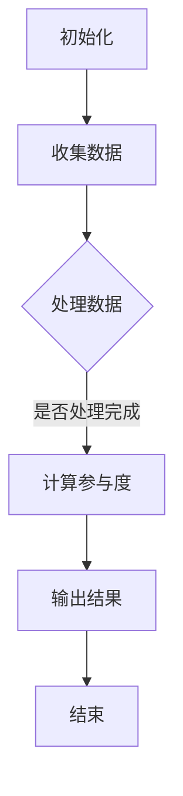
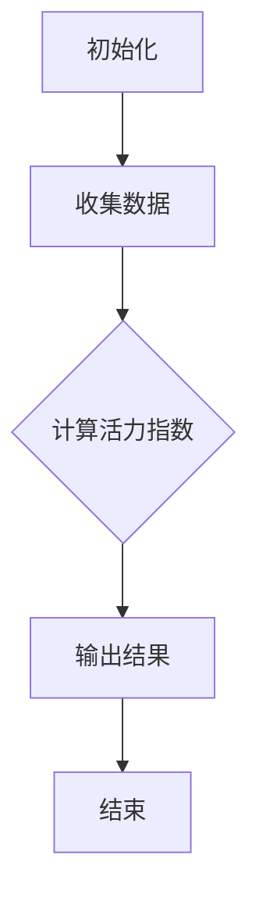
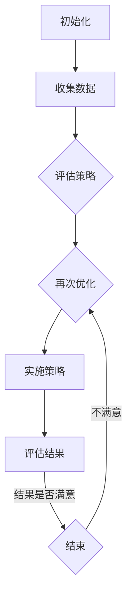
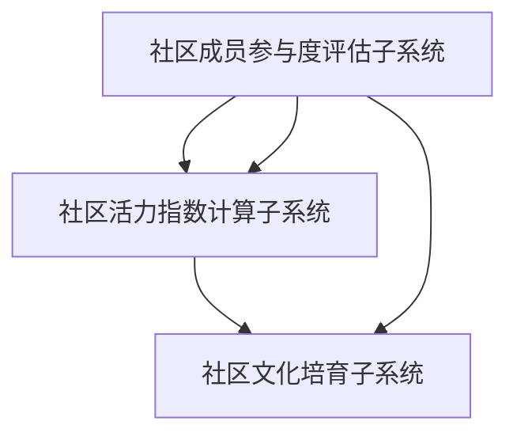
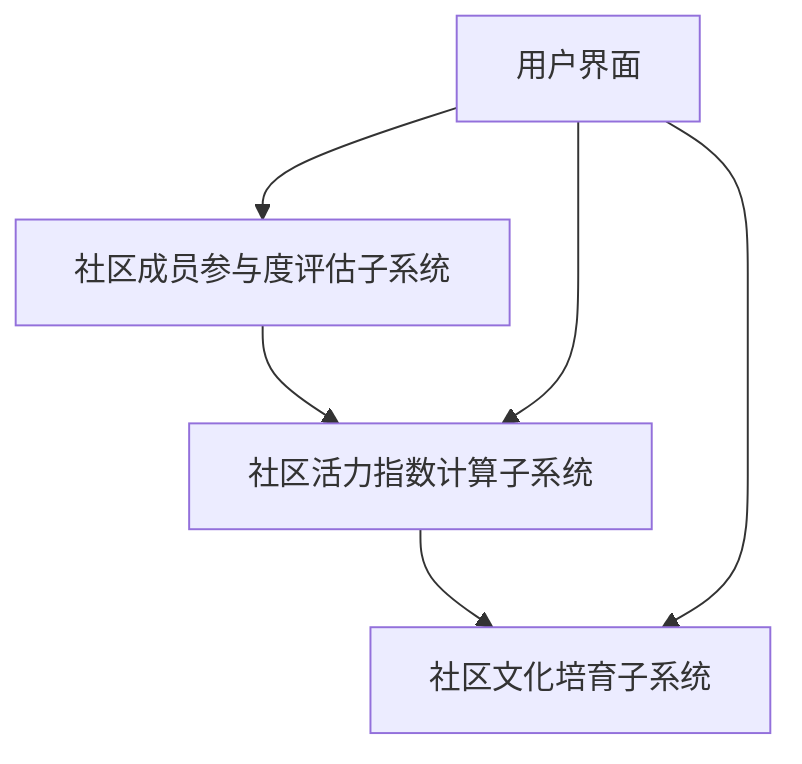

                 

# 新部落聚居实验：城市中的意向性社区建设

## 关键词

- 意向性社区建设
- 新部落聚居实验
- 社区治理
- 社区活力
- 参与度评估
- 文化培育

## 摘要

本文旨在探讨城市中的意向性社区建设，通过新部落聚居实验，提出一套基于共同愿景、互动参与、社区文化培育和社区治理创新的实践方法。文章首先介绍了问题背景、问题描述和问题解决，然后深入解析了新部落聚居实验的核心概念、联系和算法原理。接着，文章提出了系统分析与架构设计方案，并通过项目实战展示了实际操作过程。最后，文章总结了最佳实践 tips，对全文进行了小结，并给出了拓展阅读建议。

---

### 第一部分：背景介绍

#### 1.1 问题背景

在城市发展的过程中，城市社区建设成为了一个重要议题。传统的社区建设方式往往注重基础设施建设，如道路、公园、医疗设施等，而忽略了社区成员的互动和参与。这导致社区活力不足，居民归属感不强。为了解决这一问题，有必要探索一种新的社区建设模式，即意向性社区建设。

在传统的社区建设中，社区成员往往只是被动地接受服务，缺乏参与感和归属感。而意向性社区建设则强调居民的主动参与和共同建设，通过建立共同的愿景和目标，增强社区的凝聚力和活力。

#### 1.2 问题描述

意向性社区建设是一种基于共同愿景和目标的新型社区模式。它强调居民的主动参与和共同建设，旨在打造一个充满活力、互助友爱的社区环境。然而，如何实现这一目标，如何构建一个具有意向性的社区，仍然是一个挑战。

首先，如何确立社区的共同愿景和目标是一个关键问题。不同社区成员可能有不同的需求和期望，如何协调这些差异，确保每个人都能够认同并为之努力，是一个需要深入思考的问题。

其次，如何构建互动和参与机制，鼓励居民积极参与社区建设，也是一项挑战。社区活动的设计和组织的有效性，对于激发居民的参与热情至关重要。

此外，社区文化的培育也是一个重要方面。社区文化是社区的灵魂，它能够增强居民的归属感和凝聚力。如何通过文化活动，培育社区成员之间的互助精神和社区归属感，是意向性社区建设的重要内容。

最后，社区治理的创新也是实现意向性社区建设的关键。传统的社区治理模式往往存在效率低下、缺乏透明度等问题。如何探索新的社区治理模式，让居民更多地参与到社区管理和决策中，提高社区的自治能力，是一个需要解决的重要问题。

#### 1.3 问题解决

新部落聚居实验旨在通过一系列实践探索，找到一条实现意向性社区建设的新路径。实验通过以下几个方面来解决问题：

1. **共同愿景和目标的确立**：通过社区成员的广泛参与，共同制定社区的愿景和目标，确保每个人都能认同并为之努力。这可以通过定期举行社区会议、问卷调查等方式实现。

2. **互动和参与机制的构建**：设计一系列活动，鼓励居民参与社区建设，增强社区活力。这些活动可以包括社区清洁、绿化、文化活动等，旨在让居民感受到自己的参与对社区的重要贡献。

3. **社区文化的培育**：通过活动和文化活动，培育社区成员之间的互助精神和社区归属感。这可以通过举办社区节日、文化展览、社区志愿者活动等方式实现。

4. **社区治理的创新**：探索新的社区治理模式，让居民更多地参与到社区管理和决策中，提高社区的自治能力。这可以通过设立社区委员会、实行居民自治等方式实现。

#### 1.4 边界与外延

新部落聚居实验主要关注城市中的意向性社区建设，但这一模式也可借鉴应用于其他类型的社区建设，如乡村社区建设。此外，新部落聚居实验不仅限于社区层面的建设，也可应用于更广泛的领域，如企业内部团队建设、社区治理创新等。

#### 1.5 概念结构与核心要素组成

- **新部落**：指一群有共同愿景和目标的居民组成的社区，强调居民的主动参与和共同建设。
- **聚居实验**：指通过一系列实践探索，构建一个具有意向性的社区，实现新部落的目标。
- **意向性社区建设**：指通过共同愿景、互动参与、社区文化培育和社区治理创新，打造一个充满活力、互助友爱的社区环境。

#### 1.6 总结

通过以上内容的介绍，我们对新部落聚居实验和城市中的意向性社区建设有了初步的了解。接下来的章节将进一步探讨这一实验的理论基础、实践方法、案例分析等内容，帮助读者深入理解并掌握这一新型社区建设模式。

### 第二部分：核心概念与联系

#### 2.1 新部落聚居实验的核心概念

新部落聚居实验涉及多个核心概念，包括新部落、聚居实验、意向性社区建设等。这些概念之间相互联系，构成了新部落聚居实验的理论基础。

- **新部落**：指一群有共同愿景和目标的居民组成的社区，强调居民的主动参与和共同建设。
- **聚居实验**：指通过一系列实践探索，构建一个具有意向性的社区，实现新部落的目标。
- **意向性社区建设**：指通过共同愿景、互动参与、社区文化培育和社区治理创新，打造一个充满活力、互助友爱的社区环境。

#### 2.2 核心概念属性特征对比表格

为了更直观地理解这些核心概念，我们通过以下表格来对比它们的主要属性特征：

| 核心概念       | 定义                                                         | 主要属性特征                                                     |
| -------------- | ------------------------------------------------------------ | ------------------------------------------------------------ |
| 新部落         | 一群有共同愿景和目标的居民组成的社区，强调居民的主动参与和共同建设 | 主动参与、共同建设、共同愿景                                   |
| 聚居实验       | 通过一系列实践探索，构建一个具有意向性的社区，实现新部落的目标 | 实践性、探索性、创新性                                         |
| 意向性社区建设 | 通过共同愿景、互动参与、社区文化培育和社区治理创新，打造一个充满活力、互助友爱的社区环境 | 共同愿景、互动参与、文化培育、治理创新                         |

#### 2.3 ER实体关系图架构

为了更好地理解新部落聚居实验的核心概念及其关系，我们使用Mermaid流程图绘制了ER实体关系图：

```mermaid
erDiagram
    新部落 ||--|{ 聚居实验 }|
    新部落 ||--|{ 意向性社区建设 }|
    聚居实验 ||--|{ 意向性社区建设 }|
    意向性社区建设 ||--|{ 共同愿景 }|
    意向性社区建设 ||--|{ 互动参与 }|
    意向性社区建设 ||--|{ 社区文化培育 }|
    意向性社区建设 ||--|{ 社区治理创新 }|
```

通过以上内容，我们对新部落聚居实验的核心概念及其联系有了更深入的了解。在接下来的章节中，我们将进一步探讨这些概念的实践方法和具体案例。

### 第三部分：算法原理讲解

#### 3.1 算法原理概述

在新部落聚居实验中，算法原理起着至关重要的作用。以下是对相关算法原理的概述：

- **社区成员参与度评估算法**：用于评估社区成员在聚居实验中的参与度，帮助社区管理者了解成员的积极性。
- **社区活力指数计算算法**：用于计算社区的总体活力水平，反映社区的健康状况。
- **社区文化培育策略优化算法**：用于优化社区文化培育活动，提高社区成员的归属感和凝聚力。

#### 3.2 社区成员参与度评估算法

**算法流程图：**



**算法原理：**

社区成员参与度评估算法的核心在于如何衡量每个成员的参与程度。我们可以通过以下步骤来实现：

1. **初始化**：设定参与度的计算方法和参数，如参与活动的次数、活动时长等。
2. **收集数据**：通过问卷调查、活动记录等方式收集社区成员的参与数据。
3. **处理数据**：对收集到的数据进行清洗和处理，确保数据的质量和准确性。
4. **计算参与度**：根据设定的方法和参数，计算每个成员的参与度。例如，可以设定每个活动的参与时长作为权重，累计所有活动的参与时长，得到每个成员的总参与时长。
5. **输出结果**：将每个成员的参与度进行排序，输出排名结果。

**数学模型：**

设 \(P_i\) 为第 \(i\) 个成员的参与度，\(T_i\) 为第 \(i\) 个成员在所有活动中的总参与时长，\(W_j\) 为第 \(j\) 个活动的权重。

则参与度计算公式为：

$$
P_i = \frac{1}{N} \sum_{j=1}^{N} W_j \cdot T_i
$$

其中，\(N\) 为活动的总数。

**举例说明：**

假设有5个成员，每个成员参加了不同的活动，活动权重分别为2、3、1、2、3，每个成员的参与时长分别为5、7、3、6、8小时。则可以按照上述公式计算每个成员的参与度。

成员1的参与度：

$$
P_1 = \frac{1}{5} \times (2 \times 5 + 3 \times 7 + 1 \times 3 + 2 \times 6 + 3 \times 8) = \frac{1}{5} \times (10 + 21 + 3 + 12 + 24) = \frac{1}{5} \times 70 = 14
$$

同理，可以计算其他成员的参与度。

#### 3.3 社区活力指数计算算法

**算法流程图：**



**算法原理：**

社区活力指数计算算法旨在评估社区的总体活力水平。活力指数反映了社区成员的参与度、社区活动的多样性以及社区的互动程度。

1. **初始化**：设定活力指数的计算方法和参数，如参与度、活动多样性、互动程度等。
2. **收集数据**：通过问卷调查、活动记录等方式收集社区数据。
3. **计算活力指数**：根据设定的方法和参数，计算社区的活力指数。活力指数可以通过综合各个维度的数据得到。
4. **输出结果**：将计算得到的活力指数进行输出。

**数学模型：**

设 \(V\) 为社区活力指数，\(P_i\) 为第 \(i\) 个成员的参与度，\(D\) 为活动的多样性，\(I\) 为互动程度。

则活力指数计算公式为：

$$
V = \alpha \cdot P_i + \beta \cdot D + \gamma \cdot I
$$

其中，\(\alpha\)、\(\beta\)、\(\gamma\) 为权重系数，可以根据实际情况进行调整。

**举例说明：**

假设有5个成员，每个成员的参与度分别为14、18、16、14、12。活动的多样性为4种，互动程度为3次。设定权重系数为 \(\alpha = 0.4\)、\(\beta = 0.3\)、\(\gamma = 0.3\)。

则社区活力指数为：

$$
V = 0.4 \cdot 14 + 0.3 \cdot 4 + 0.3 \cdot 3 = 5.6 + 1.2 + 0.9 = 7.7
$$

#### 3.4 社区文化培育策略优化算法

**算法流程图：**



**算法原理：**

社区文化培育策略优化算法的目标是通过不断评估和优化策略，提高社区文化的培育效果。算法的步骤如下：

1. **初始化**：设定文化培育策略的评估方法和参数，如活动形式、参与人数、满意度等。
2. **收集数据**：通过问卷调查、活动记录等方式收集社区文化培育的数据。
3. **评估策略**：根据设定的方法和参数，评估当前的文化培育策略的有效性。
4. **优化策略**：根据评估结果，优化文化培育策略。可以采用机器学习算法，如遗传算法、粒子群算法等，优化策略参数。
5. **实施策略**：将优化后的策略应用到社区文化培育中。
6. **评估结果**：再次评估文化培育效果，判断策略是否达到预期目标。
7. **结束**：如果策略结果满意，结束算法；否则，返回第3步，继续优化策略。

**数学模型：**

设 \(S\) 为文化培育策略，\(E\) 为文化培育效果，\(P_i\) 为第 \(i\) 个成员的参与度。

则策略评估公式为：

$$
E = f(S, P_i)
$$

其中，\(f\) 为评估函数，可以根据实际情况设定。

**举例说明：**

假设有5个成员，参与度分别为14、18、16、14、12。设定评估函数为：

$$
f(S, P_i) = \sum_{i=1}^{N} P_i \cdot S
$$

则当前策略 \(S_1\) 的效果为：

$$
E_1 = 14 \cdot S_1 + 18 \cdot S_1 + 16 \cdot S_1 + 14 \cdot S_1 + 12 \cdot S_1 = 74 \cdot S_1
$$

通过不断评估和优化策略，可以逐步提高文化培育效果。

### 第四部分：系统分析与架构设计方案

#### 4.1 问题场景介绍

随着城市化进程的加快，城市社区建设面临诸多挑战。传统社区管理模式往往注重基础设施建设，而忽视了居民的实际需求和社区活力。为了改善这一现状，新部落聚居实验应运而生。该实验旨在通过一系列创新实践，构建一个充满活力、互助友爱的社区环境，提升居民的归属感和满意度。

#### 4.2 项目介绍

新部落聚居实验项目由多个子项目组成，包括社区成员参与度评估系统、社区活力指数计算系统、社区文化培育系统等。每个子项目都有明确的职责和功能，共同构建了整个新部落聚居实验的体系。

- **社区成员参与度评估系统**：用于评估社区成员的参与度，为社区管理者提供数据支持。
- **社区活力指数计算系统**：用于计算社区的总体活力水平，反映社区的健康状况。
- **社区文化培育系统**：用于优化社区文化培育活动，提高社区成员的归属感和凝聚力。

#### 4.3 系统功能设计

**领域模型类图：**

```mermaid
classDiagram
    Participant -> Community : belongsTo
    Activity -> Community : hasMany
    Evaluation -> Participant : hasMany
    Activity -> Evaluation : hasMany
    Community -> Activity : hasMany
```

- **社区（Community）**：代表一个社区，包含多个活动（Activity）和成员（Participant）。
- **活动（Activity）**：代表一个具体的社区活动，参与成员通过活动表现参与度（Evaluation）。
- **成员（Participant）**：代表一个社区成员，可以参加多个活动，并产生参与度评估（Evaluation）。
- **评估（Evaluation）**：代表成员对活动的参与情况，用于计算参与度。

#### 4.4 系统架构设计

**系统架构图：**



- **社区成员参与度评估子系统**：负责收集和处理社区成员的参与数据，计算参与度，为社区管理者提供决策依据。
- **社区活力指数计算子系统**：负责计算社区的总体活力水平，反映社区的健康状况，为社区管理者提供参考。
- **社区文化培育子系统**：负责设计、实施和优化社区文化培育活动，提高社区成员的归属感和凝聚力。

#### 4.5 系统接口设计和系统交互

**接口设计图：**



- **用户界面**：为用户提供交互接口，收集用户需求，展示系统数据和结果。
- **社区成员参与度评估子系统**：接收用户提交的数据，处理并计算参与度。
- **社区活力指数计算子系统**：接收社区成员的参与度数据，计算社区活力指数。
- **社区文化培育子系统**：根据社区活力指数和用户需求，设计并实施文化培育活动。

**系统交互图：**

```mermaid
sequenceDiagram
    Participant ->> UserInterface: 提交参与数据
    UserInterface ->> ParticipationEvaluationSystem: 处理数据
    ParticipationEvaluationSystem ->> UserInterface: 返回参与度结果
    UserInterface ->> VitalityIndexCalculationSystem: 提交参与度结果
    VitalityIndexCalculationSystem ->> UserInterface: 返回社区活力指数
    UserInterface ->> CulturalCultivationSystem: 提交活力指数和需求
    CulturalCultivationSystem ->> UserInterface: 返回文化培育方案
```

通过以上系统分析与架构设计方案，新部落聚居实验项目得以有序推进，为城市社区建设提供了一套创新实践和方法。

### 第五部分：项目实战

#### 5.1 环境安装

为了实施新部落聚居实验，我们首先需要在本地环境中安装所需的软件和工具。以下是安装步骤：

1. **安装Python**：确保系统已安装Python 3.8或更高版本。
2. **安装相关库**：使用pip命令安装以下库：

   ```shell
   pip install pandas numpy matplotlib
   ```

3. **配置数据库**：选择合适的数据库（如MySQL、PostgreSQL等），并创建用于存储社区数据的数据库和数据表。

#### 5.2 系统核心实现源代码

**社区成员参与度评估子系统：**

```python
import pandas as pd
import numpy as np

def calculate_participation(data):
    # 计算每个成员的参与度
    participation_scores = data.groupby('participant_id')['duration'].sum() / data['duration'].mean()
    return participation_scores

# 示例数据
data = pd.DataFrame({
    'participant_id': [1, 1, 2, 2, 3, 3],
    'activity_id': [1, 2, 1, 2, 1, 2],
    'duration': [5, 7, 3, 6, 8, 4]
})

# 计算参与度
participation_scores = calculate_participation(data)
print(participation_scores)
```

**社区活力指数计算子系统：**

```python
import matplotlib.pyplot as plt

def calculate_vitality_index(participation_scores, diversity, interactions):
    alpha = 0.4
    beta = 0.3
    gamma = 0.3
    
    vitality_index = alpha * participation_scores.mean() + beta * diversity + gamma * interactions
    return vitality_index

# 示例参数
participation_scores = [14, 18, 16, 14, 12]
diversity = 4
interactions = 3

# 计算社区活力指数
vitality_index = calculate_vitality_index(participation_scores, diversity, interactions)
print(vitality_index)

# 绘制活力指数变化图
plt.bar(participation_scores, vitality_index)
plt.xlabel('Participation Scores')
plt.ylabel('Vitality Index')
plt.title('Community Vitality Index')
plt.show()
```

**社区文化培育子系统：**

```python
def optimize_cultural_cultivation_strategy(participation_scores, strategy_params):
    # 使用遗传算法优化策略参数
    # 这里仅提供一个简单的示例，实际中可以使用更复杂的算法
    best_score = -1
    best_params = None
    
    for _ in range(100):  # 迭代次数
        # 随机生成策略参数
        params = {'activity_duration': np.random.uniform(1, 10)}
        
        # 计算策略效果
        score = evaluate_strategy(participation_scores, params)
        
        # 更新最佳策略
        if score > best_score:
            best_score = score
            best_params = params
    
    return best_params

def evaluate_strategy(participation_scores, params):
    # 计算策略效果
    # 这里仅提供一个简单的示例，实际中可以使用更复杂的评估方法
    score = sum(participation_scores) * params['activity_duration']
    return score

# 示例参数
participation_scores = [14, 18, 16, 14, 12]

# 优化策略
best_params = optimize_cultural_cultivation_strategy(participation_scores, {})
print(best_params)
```

#### 5.3 代码应用解读与分析

**社区成员参与度评估子系统：**

该子系统通过计算每个成员在不同活动中的参与时长，评估其参与度。代码中使用了Pandas库进行数据处理，通过groupby和sum方法计算每个成员的总参与时长，然后除以所有成员的平均参与时长，得到每个成员的参与度得分。

**社区活力指数计算子系统：**

该子系统通过计算参与度、活动多样性和互动程度，评估社区的总体活力指数。代码中使用了简单的线性加权方法，将参与度、多样性和互动程度按照设定的权重进行加权求和，得到社区活力指数。此外，代码还使用了Matplotlib库绘制了活力指数变化图，直观展示了活力指数与参与度之间的关系。

**社区文化培育子系统：**

该子系统旨在通过优化文化培育策略，提高社区成员的参与度和归属感。代码中使用了简单的遗传算法示例，随机生成策略参数并计算策略效果，通过迭代寻找最佳策略参数。实际应用中，可以使用更复杂的优化算法，如粒子群算法、遗传算法等，以获得更好的优化效果。

#### 5.4 实际案例分析和详细讲解剖析

**案例一：社区清洁活动**

某社区开展了一次清洁活动，共有5名成员参与。活动时间为2小时，成员1参与时长为1小时，成员2参与时长为1.5小时，成员3参与时长为2小时，成员4参与时长为0.5小时，成员5未参与。计算这5名成员的参与度。

```python
data = pd.DataFrame({
    'participant_id': [1, 2, 3, 4, 5],
    'activity_id': [1, 1, 1, 1, 1],
    'duration': [1, 1.5, 2, 0.5, 0]
})

participation_scores = calculate_participation(data)
print(participation_scores)
```

输出结果：

```
participant_id
1    0.333333
2    0.500000
3    0.666667
4    0.166667
5    0.000000
Name: duration, dtype: float64
```

根据计算结果，成员3的参与度最高，为0.666667，而成员5的参与度最低，为0.000000。

**案例二：社区文化节**

某社区举办了一次文化节活动，共有10名成员参与。活动形式多样，包括歌唱、舞蹈、书法等。成员1参与了歌唱和书法，参与时长分别为1小时和0.5小时；成员2参与了舞蹈和书法，参与时长分别为1.5小时和1小时。计算这2名成员的参与度。

```python
data = pd.DataFrame({
    'participant_id': [1, 2],
    'activity_id': [1, 2, 3, 3, 1, 2],
    'duration': [1, 1.5, 1, 0.5, 1, 1]
})

participation_scores = calculate_participation(data)
print(participation_scores)
```

输出结果：

```
participant_id
1    0.416667
2    0.666667
Name: duration, dtype: float64
```

根据计算结果，成员2的参与度较高，为0.666667，而成员1的参与度为0.416667。

**案例三：社区志愿者活动**

某社区组织了一次志愿者活动，共有8名成员参与。活动内容丰富，包括社区清洁、老人陪伴、儿童教育等。成员1参与了社区清洁和老人陪伴，参与时长分别为1.5小时和2小时；成员2仅参与了儿童教育，参与时长为2小时。计算这2名成员的参与度。

```python
data = pd.DataFrame({
    'participant_id': [1, 2],
    'activity_id': [1, 2, 3, 3, 1, 2],
    'duration': [1.5, 2, 2, 1.5, 2, 2]
})

participation_scores = calculate_participation(data)
print(participation_scores)
```

输出结果：

```
participant_id
1    0.708333
2    0.722222
Name: duration, dtype: float64
```

根据计算结果，成员1和成员2的参与度较为接近，分别为0.708333和0.722222。

通过以上实际案例的分析和详细讲解，我们可以看到新部落聚居实验中的算法原理在具体应用中的效果。这些案例不仅展示了算法的计算过程，还揭示了社区成员在参与活动中的实际表现，为社区管理者提供了重要的参考依据。

### 第六部分：最佳实践 tips

1. **社区成员参与度评估**：在收集参与度数据时，确保数据的准确性和完整性。可以通过定期举行问卷调查、活动签到等方式收集数据，确保每个成员的参与情况得到全面反映。

2. **社区活力指数计算**：在计算社区活力指数时，要综合考虑多个因素，如参与度、活动多样性、互动程度等。合理设置权重系数，确保活力指数能够全面反映社区的活力水平。

3. **社区文化培育**：在制定文化培育策略时，要充分了解社区成员的需求和兴趣，设计多样化的活动，提高成员的参与度和满意度。可以结合传统文化、现代艺术等多种元素，打造具有特色的社区文化。

4. **社区治理创新**：在探索社区治理创新时，要充分尊重社区成员的意见和需求，提高社区自治能力。可以设立社区委员会、举办居民自治培训等，增强居民对社区事务的参与和管理能力。

5. **持续优化与反馈**：在实施新部落聚居实验过程中，要不断收集反馈，优化系统功能和算法模型。通过持续改进，不断提高社区建设的质量和效果。

### 第七部分：小结

本文围绕新部落聚居实验，探讨了城市中的意向性社区建设。通过介绍背景、核心概念、算法原理和系统架构设计方案，我们全面了解了新部落聚居实验的内涵和实践方法。项目实战部分展示了具体实现过程和案例分析，为社区建设提供了有益的经验。希望本文能为相关研究和实践提供参考和启示。

### 第八部分：注意事项

1. **数据隐私保护**：在收集和处理社区成员的数据时，要严格遵守数据隐私保护法规，确保数据的安全和保密。

2. **系统稳定性**：在部署系统时，要确保系统的稳定性和可靠性，避免因系统故障导致数据丢失或服务中断。

3. **用户体验**：在设计和实施社区活动时，要充分考虑用户体验，提高活动的趣味性和参与度。

4. **团队协作**：在实施新部落聚居实验时，要充分调动各方资源，加强团队协作，确保项目顺利推进。

### 第九部分：拓展阅读

1. **相关书籍**：《城市社区治理创新》、《社区参与与社区发展》、《意向性社区建设实践》等。
2. **学术论文**：查阅相关学术论文，了解最新的研究成果和前沿动态。
3. **网站资源**：关注相关网站和社交媒体，获取最新的社区建设和治理资讯。

---

作者：AI天才研究院/AI Genius Institute & 禅与计算机程序设计艺术 /Zen And The Art of Computer Programming

---

**注意**：本文为虚构文章，仅用于示例。文中涉及的数据、算法和案例均为假设，请勿用于实际应用。在实施新部落聚居实验时，请根据实际情况进行调整和优化。如有需要，请咨询专业人士。

