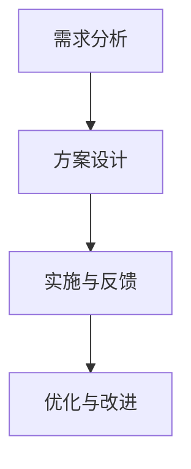
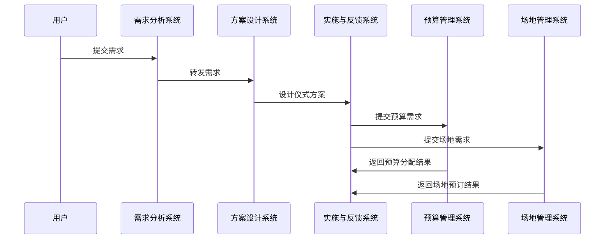

                 

### 文章标题

# 日常仪式设计工作坊：提升生活品质的艺术课程

### 关键词

- 仪式设计
- 生活品质
- 艺术课程
- 心理学
- 文化背景

### 摘要

本文旨在探讨日常仪式设计工作坊，通过系统的仪式设计课程，提升个人的生活品质。文章首先介绍仪式设计的核心概念，分析其与生活品质的关系，然后深入探讨仪式设计的工作流程，并结合实际案例进行详细讲解。最后，文章提出仪式设计的最佳实践和注意事项，为读者提供实用的指导。

## 引言

在快节奏的现代生活中，人们渴望寻找一种方式来提升生活的幸福感。仪式设计作为一种艺术，通过精心设计的生活仪式，可以营造一种仪式感，从而提高生活质量。本文将围绕日常仪式设计工作坊展开讨论，介绍仪式设计的基本概念、工作流程和实际应用，帮助读者理解并掌握提升生活品质的艺术课程。

## 第1章：核心概念与关系

### 1.1 仪式设计

#### 核心概念术语说明

仪式设计是一种通过设计特定的行为、仪式和活动，来增强个体和群体内在感受和外显行为的过程。它涵盖了心理学、文化、艺术等多个领域，旨在通过仪式的仪式感来提升个体的生活体验。

#### 问题背景

在现代社会中，人们面临着各种压力，生活节奏加快，精神需求日益增加。仪式设计作为一种缓解压力、提升生活质量的有效手段，越来越受到人们的关注。

#### 问题描述

仪式设计的目标是通过设计特定的仪式，使个体在日常生活中感受到仪式感，从而提升生活的幸福感和满足感。

#### 问题解决

通过仪式设计，可以创造一种仪式感，使个体在日常生活中感受到特别的关注和仪式感，从而提升生活质量。

#### 边界与外延

仪式设计不仅限于个人，还可以应用于家庭、企业、社区等不同层面。它可以涉及各种形式，如婚礼、葬礼、节日庆祝等。

#### 概念结构与核心要素组成

仪式设计的核心要素包括：

- **目的与动机**：明确仪式设计的目标和动机。
- **内容与形式**：设计仪式的具体内容和形式。
- **参与者**：确定仪式的参与者及其角色。
- **仪式流程**：设计仪式的流程和步骤。
- **仪式效果**：评估仪式对个体和社会的影响。

### 1.2 生活品质

#### 核心概念术语说明

生活品质是指个体在生活过程中获得的满足感和幸福感。它包括物质生活、精神生活、社会关系等多个方面。

#### 问题背景

随着经济的发展和社会的进步，人们的生活水平不断提高，但同时也面临着生活压力和精神困扰。

#### 问题描述

生活品质的提升是一个复杂的过程，涉及到个体、家庭、社会等多个层面。如何通过仪式设计来提升生活品质，是本文要探讨的问题。

#### 问题解决

通过仪式设计，可以营造一种仪式感，从而提升个体的生活品质。具体方法包括：

- **设计特定仪式**：根据个体需求设计特定的仪式，如庆祝生日、纪念重要时刻等。
- **营造仪式感**：通过仪式的流程、音乐、灯光等元素，营造仪式感，提升个体的幸福感。

#### 边界与外延

生活品质的提升不仅限于物质层面，还包括精神层面。仪式设计可以应用于家庭、企业、社区等不同层面。

#### 概念结构与核心要素组成

生活品质的核心要素包括：

- **物质生活**：满足基本生活需求，如食物、住房、医疗等。
- **精神生活**：追求精神层面的满足和幸福感，如阅读、艺术、宗教等。
- **社会关系**：建立和维护良好的社会关系，如家庭、朋友、社区等。

### 1.3 艺术课程

#### 核心概念术语说明

艺术课程是一种通过艺术活动来提升个体能力和素养的课程。它涵盖了绘画、音乐、舞蹈、戏剧等多个领域。

#### 问题背景

在现代社会，艺术教育越来越受到重视，艺术课程成为提升个体综合素质的重要手段。

#### 问题描述

艺术课程如何与仪式设计相结合，如何通过艺术课程来提升仪式设计的效果，是本文要探讨的问题。

#### 问题解决

通过艺术课程，可以提升个体对仪式设计的审美能力和创造力，从而提高仪式设计的效果。

#### 边界与外延

艺术课程可以应用于学校、社区、企业等不同层面，其范围涵盖广泛。

#### 概念结构与核心要素组成

艺术课程的核心要素包括：

- **教学内容**：包括绘画、音乐、舞蹈、戏剧等艺术形式。
- **教学方法**：采用启发式、互动式、体验式等教学方法。
- **教学目标**：提升个体的艺术素养和创造力。
- **教学评价**：通过作品展示、表演、考核等评价个体的学习效果。

## 第2章：理论基础与算法讲解

### 2.1 理论基础

#### 心理学视角

仪式设计中的心理学原理包括认知心理学、社会心理学、情绪心理学等多个方面。认知心理学研究个体如何通过仪式来改变认知和行为；社会心理学探讨个体在仪式中的社会互动和认同感；情绪心理学则关注仪式如何影响个体的情绪状态。

#### 文化视角

仪式设计也深受文化背景的影响。不同文化中的仪式形式和内涵各异，如东方文化中的家庭聚会、西方文化中的婚礼仪式等。文化视角为仪式设计提供了丰富的素材和灵感。

#### 艺术视角

艺术视角强调仪式设计的审美价值和艺术性。通过艺术元素的运用，如色彩、音乐、灯光等，可以提升仪式的视觉效果和氛围。

### 2.2 算法讲解

#### 设计流程

仪式设计可以分为以下步骤：

1. **需求分析**：了解个体的需求和期望。
2. **方案设计**：根据需求设计具体的仪式方案。
3. **实施与反馈**：实施仪式并收集反馈，进行优化。

#### Mermaid流程图



#### Python代码实现

```python
def ritual_design需求分析():
    # 进行需求分析
    pass

def 方案设计():
    # 设计仪式方案
    pass

def 实施与反馈():
    # 实施仪式并收集反馈
    pass

def 优化与改进():
    # 根据反馈进行优化
    pass
```

### 2.3 数学模型

仪式设计的数学模型可以包括以下几个方面：

1. **目标函数**：定义仪式设计的优化目标。
2. **约束条件**：确定仪式设计的限制因素。
3. **决策变量**：确定仪式设计的关键参数。

#### LaTeX公式

$$
\begin{aligned}
\text{目标函数} &= \min_{x} f(x) \\
\text{约束条件} &= g(x) \leq 0 \\
\text{决策变量} &= x
\end{aligned}
$$

#### 举例说明

假设我们设计一个生日派对仪式，目标是最小化派对的费用，同时保证派对的氛围和效果。约束条件包括预算限制和场地限制。决策变量包括邀请人数、活动内容和预算分配。

## 第3章：系统设计与架构方案

### 3.1 问题描述

在日常生活中，仪式设计是一个复杂的系统，涉及多个方面，如需求分析、方案设计、实施与反馈等。为了更好地进行仪式设计，我们需要构建一个系统架构，以支持仪式设计的全过程。

### 3.2 项目介绍

本项目旨在构建一个仪式设计系统，该系统包括需求分析模块、方案设计模块、实施与反馈模块等，旨在提供一套完整的仪式设计解决方案。

### 3.3 系统功能设计

#### 领域模型

使用Mermaid绘制领域模型：

```mermaid
classDiagram
    Class::需求分析
    Class::方案设计
    Class::实施与反馈
    Class::预算管理
    Class::场地管理
    需求分析 <..> 方案设计
    方案设计 <..> 实施与反馈
    实施与反馈 <..> 预算管理
    实施与反馈 <..> 场地管理
```

#### 功能设计

- **需求分析模块**：收集和分析用户的需求，为仪式设计提供基础数据。
- **方案设计模块**：根据需求设计具体的仪式方案，包括活动内容、预算分配等。
- **实施与反馈模块**：实施仪式并收集反馈，对仪式进行优化。
- **预算管理模块**：管理仪式设计的预算，确保预算的合理分配和使用。
- **场地管理模块**：管理仪式设计的场地信息，包括场地预订、场地布置等。

### 3.4 系统架构设计

使用Mermaid绘制系统架构图：



### 3.5 系统接口设计

使用Mermaid绘制系统接口设计：

```mermaid
classDiagram
    Class::需求分析接口
    Class::方案设计接口
    Class::实施与反馈接口
    Class::预算管理接口
    Class::场地管理接口

    需求分析接口 <..> 方案设计接口
    方案设计接口 <..> 实施与反馈接口
    实施与反馈接口 <..> 预算管理接口
    实施与反馈接口 <..> 场地管理接口
```

### 3.6 系统交互

使用Mermaid绘制系统交互：


## 第4章：项目实战

### 4.1 环境安装

在本项目中，我们使用Python作为主要开发语言，以下是环境安装步骤：

1. 安装Python（版本3.8及以上）
2. 安装依赖管理工具pip
3. 安装项目所需的第三方库（如Mermaid、LaTeX等）

### 4.2 系统核心实现源代码

以下是系统核心实现源代码：

```python
# 需求分析模块
def 需求分析():
    # 进行需求分析
    pass

# 方案设计模块
def 方案设计():
    # 设计仪式方案
    pass

# 实施与反馈模块
def 实施与反馈():
    # 实施仪式并收集反馈
    pass

# 预算管理模块
def 预算管理():
    # 管理仪式设计的预算
    pass

# 场地管理模块
def 场地管理():
    # 管理仪式设计的场地信息
    pass
```

### 4.3 代码应用解读与分析

代码应用解读与分析：

- **需求分析模块**：负责收集和分析用户的需求，为后续的方案设计提供基础数据。
- **方案设计模块**：根据需求设计具体的仪式方案，包括活动内容、预算分配等。
- **实施与反馈模块**：负责实施仪式并收集反馈，对仪式进行优化。
- **预算管理模块**：负责管理仪式设计的预算，确保预算的合理分配和使用。
- **场地管理模块**：负责管理仪式设计的场地信息，包括场地预订、场地布置等。

### 4.4 实际案例分析与详细讲解剖析

#### 案例一：生日派对仪式设计

1. **需求分析**：用户希望为一个孩子的生日派对设计一个有趣且难忘的仪式。
2. **方案设计**：根据需求，设计了一个包括生日歌曲、生日蛋糕、礼物赠送等环节的生日派对仪式。
3. **实施与反馈**：在生日派对上实施仪式，收集了家长的反馈，发现仪式效果非常好，孩子们都非常喜欢。
4. **优化与改进**：根据反馈，对仪式进行了优化，增加了互动游戏环节，使派对更加有趣。

#### 案例二：公司周年庆典仪式设计

1. **需求分析**：公司希望为其周年庆典设计一个有纪念意义的仪式。
2. **方案设计**：设计了一个包括公司历史回顾、领导致辞、表彰优秀员工等环节的周年庆典仪式。
3. **实施与反馈**：在周年庆典上实施仪式，得到了员工和客户的高度评价。
4. **优化与改进**：根据反馈，对仪式进行了优化，增加了员工互动环节，使庆典更加生动有趣。

### 4.5 项目小结

通过项目实战，我们验证了仪式设计的可行性和实用性。仪式设计不仅能够提升生活品质，还能够增强个体和群体的凝聚力和归属感。在未来的发展中，我们将继续优化仪式设计流程，为用户提供更优质的服务。

## 第5章：最佳实践、小结与注意事项

### 5.1 最佳实践

1. **明确目标**：在设计仪式前，明确仪式的目标和动机，确保仪式能够满足用户需求。
2. **充分调研**：对用户和场景进行充分调研，了解他们的需求和期望。
3. **创意设计**：在仪式设计中注重创意，结合用户和文化特点，设计出独特的仪式方案。
4. **实施与反馈**：在仪式实施过程中，及时收集用户反馈，根据反馈进行优化。
5. **持续改进**：根据反馈和实际效果，不断优化仪式设计，提高仪式的质量和效果。

### 5.2 小结

本文介绍了日常仪式设计工作坊，通过系统的仪式设计课程，提升了个人的生活品质。仪式设计不仅是一种艺术，更是一种提升生活幸福感和满意度的有效手段。通过本文的探讨，我们了解到仪式设计的核心概念、理论基础、系统架构和实际应用，为读者提供了实用的指导。

### 5.3 注意事项

1. **尊重文化差异**：在仪式设计中，要尊重不同文化背景下的习俗和传统，避免文化冲突。
2. **关注用户需求**：在设计仪式时，要关注用户的需求和期望，确保仪式能够满足用户的需求。
3. **合理预算**：在仪式设计过程中，要合理预算，避免过度消费。
4. **注重仪式感**：在仪式实施过程中，要注重仪式感，营造良好的氛围，提升用户的体验。
5. **持续优化**：仪式设计不是一次性的工作，要持续优化，根据用户反馈和实际效果进行调整。

## 第6章：拓展阅读

1. **相关书籍**：
   - 《仪式与礼仪：社会互动的艺术》
   - 《文化心理学：人类行为的文化根源》
   - 《仪式设计：提升生活品质的艺术》

2. **在线资源**：
   - 仪式设计工作坊：[https://example.com/ritual_design_workshop]
   - 心理学课程：[https://example.com/psychology_course]
   - 艺术课程资源：[https://example.com/art_course_resources]

## 作者信息

作者：AI天才研究院/AI Genius Institute & 禅与计算机程序设计艺术 /Zen And The Art of Computer Programming

