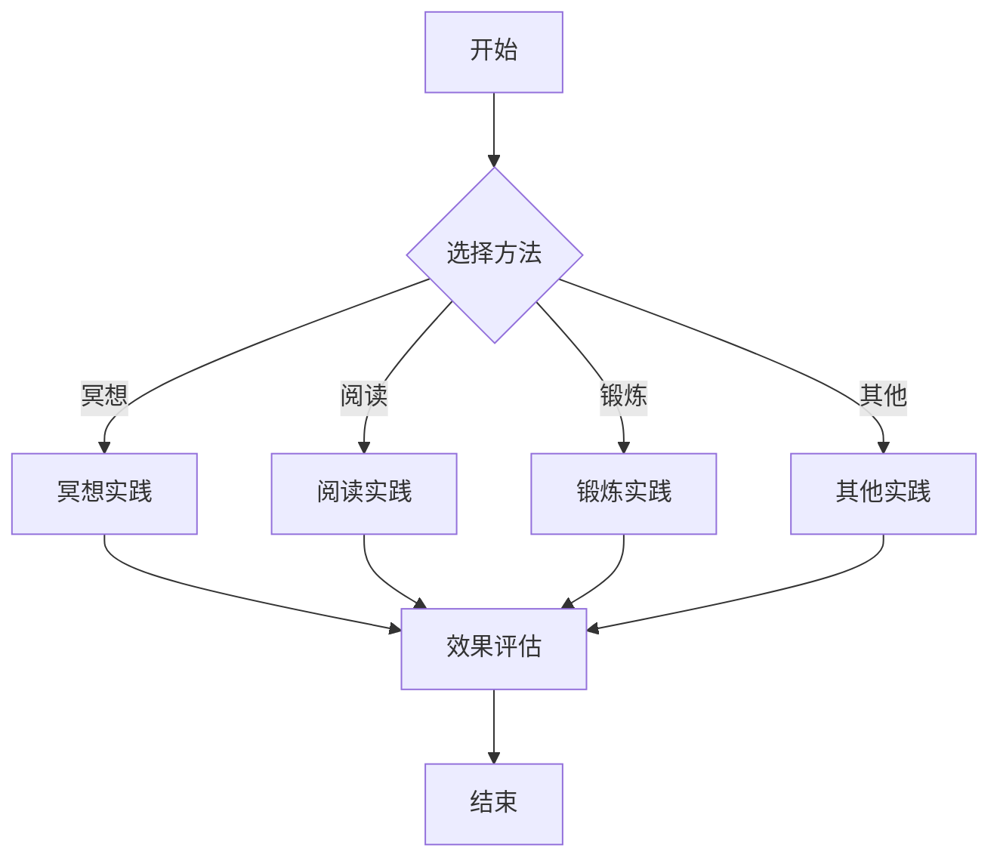
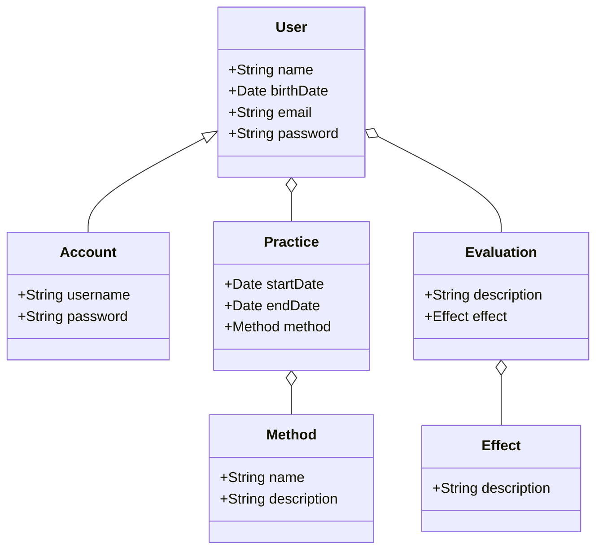
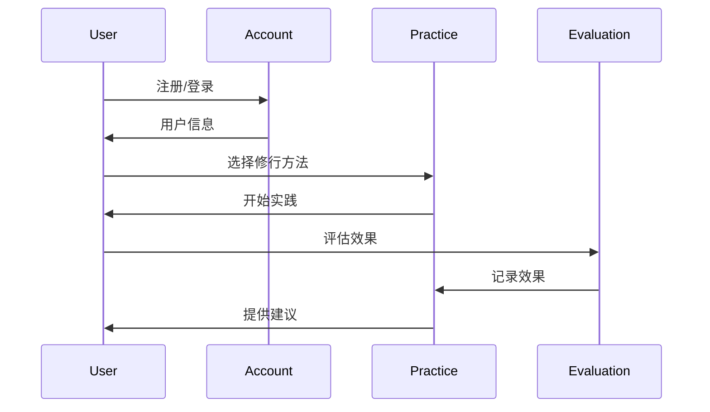
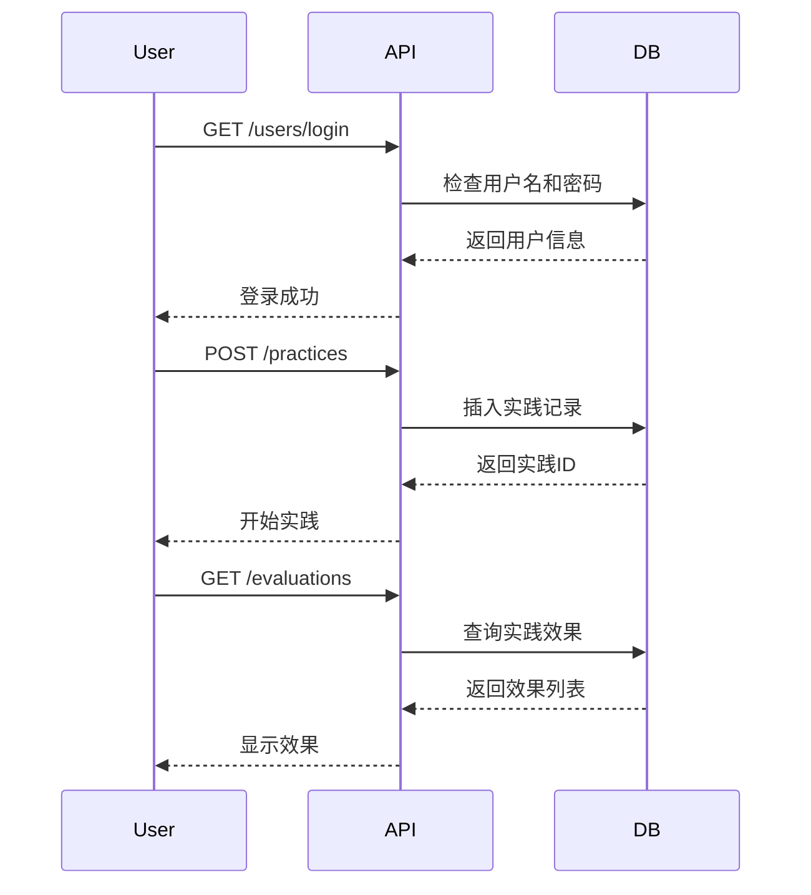

                 


# 日常修行：将精神生活融入每一天

> 关键词：精神生活、日常活动、修行、心理健康、工作效率

> 摘要：本文探讨了如何将精神生活融入日常活动中，实现身心健康、情感丰富和道德修养。通过介绍核心概念、联系日常活动，以及详细讲解算法原理和实践步骤，帮助读者在繁忙的生活中找到平衡，提升生活质量。

## 1. 背景介绍

### 1.1 问题背景

在现代社会，人们的生活节奏越来越快，工作压力和竞争压力日益增加。与此同时，心理健康问题也日益凸显。根据世界卫生组织（WHO）的数据，全球约有3.5亿人患有抑郁症和焦虑症。如何在繁忙的生活中找到平衡，将精神生活融入每一天，成为许多人关心的话题。

### 1.2 问题描述

《日常修行：将精神生活融入每一天》旨在探讨如何在日常生活中培养精神生活，实现身心和谐。本书围绕这一主题，提出了一系列实践方法和思考。

### 1.3 问题解决

通过阅读本书，读者可以：

1. **了解精神生活的概念和重要性**。精神生活不仅关乎心理健康，还影响人际关系和社会和谐。
2. **学习如何在日常活动中融入精神修行的元素**。通过冥想、阅读、锻炼等多种方式，培养良好的生活习惯。
3. **探索适合自己的精神修行方式**。不同的人有不同的需求，本书提供了多种实践方法，供读者选择。

### 1.4 边界与外延

- **精神生活**：包括心理健康、情感体验、道德修养等方面。
- **日常活动**：涵盖了工作、学习、休闲、社交等生活的方方面面。

### 1.5 概念结构与核心要素组成

- **精神生活**：身心健康、情感丰富、道德修养
- **日常活动**：工作、学习、休闲、社交等

## 2. 核心概念与联系

### 2.1 精神生活

精神生活是指人们在心理、情感和道德层面上的体验和活动。它包括以下几个方面：

- **身心健康**：保持良好的身体和心理状态，有助于提高生活质量和工作效率。
- **情感丰富**：培养丰富的情感体验，增强人际关系和幸福感。
- **道德修养**：遵循社会道德规范，培养良好的道德品质，实现个人价值。

### 2.2 日常活动

日常活动是指人们在日常生活中进行的各种活动，包括以下几个方面：

- **工作**：工作不仅能带来经济收入，还能提升个人能力和成就感。
- **学习**：不断学习新知识，拓展视野，提高自身素质。
- **休闲**：合理分配时间，进行休闲活动，缓解生活压力。
- **社交**：与他人建立良好的人际关系，分享快乐和困扰。

### 2.3 精神生活与日常活动的联系

精神生活与日常活动密切相关。在日常生活中，通过合理安排工作、学习和休闲时间，培养良好的生活习惯，有助于提升精神生活的质量。例如：

- **在工作**：保持专注和耐心，培养团队合作精神，实现个人价值。
- **在学习**：培养好奇心和求知欲，积极探索未知领域，提高综合素质。
- **在休闲**：适当放松身心，与家人和朋友共度美好时光，增强幸福感。

## 3. 算法原理讲解

### 3.1 算法 Mermaid 流程图



### 3.2 算法 Python 源代码

```python
def choose_practice(method):
    if method == "meditation":
        practice = "冥想实践"
    elif method == "reading":
        practice = "阅读实践"
    elif method == "exercise":
        practice = "锻炼实践"
    else:
        practice = "其他实践"
    return practice

def evaluate_effect(practice):
    if practice == "冥想实践":
        effect = "冥想效果"
    elif practice == "阅读实践":
        effect = "阅读效果"
    elif practice == "锻炼实践":
        effect = "锻炼效果"
    else:
        effect = "其他效果"
    return effect

method = input("请选择一种方法（冥想/阅读/锻炼/其他）:")
practice = choose_practice(method)
print("开始实践:", practice)

effect = evaluate_effect(practice)
print("实践效果:", effect)
```

### 3.3 算法原理详细讲解与举例说明

#### 算法原理详细讲解

该算法的核心是帮助读者选择一种适合自己的精神修行方法，并进行实践和效果评估。具体步骤如下：

1. **选择方法**：根据读者的需求和兴趣，选择冥想、阅读、锻炼或其他方法。
2. **实践**：选择一种方法后，进行相应的实践。
3. **效果评估**：评估实践效果，调整方法或继续实践。

#### 算法举例说明

假设读者小明希望通过冥想来提升精神生活。他可以按照以下步骤进行：

1. **选择方法**：小明选择冥想。
2. **实践**：小明每天晚上睡前花10分钟进行冥想。
3. **效果评估**：一段时间后，小明发现自己心情变得更加平和，睡眠质量也得到了提升。于是，他决定继续坚持冥想。

通过这样的算法，读者可以根据自己的需求，灵活调整修行方法，实现身心和谐。

## 4. 系统分析与架构设计方案

### 4.1 问题场景介绍

随着人们对心理健康问题的关注越来越多，一个帮助用户将精神生活融入日常活动的智能系统应运而生。该系统旨在为用户提供个性化的修行建议，帮助他们更好地管理自己的精神生活。

### 4.2 项目介绍

项目名称：精神生活智能管理系统（Mental Wellness Management System，MWMS）

项目目标：通过智能算法，帮助用户找到适合自己的精神修行方法，提升生活质量。

项目功能：

1. 用户注册与登录
2. 用户个人信息管理
3. 精神修行方法推荐
4. 实践效果评估
5. 用户反馈与改进

### 4.3 系统功能设计（领域模型Mermaid类图）



### 4.4 系统架构设计（Mermaid架构图）



### 4.5 系统接口设计和系统交互（Mermaid序列图）



## 5. 项目实战

### 5.1 环境安装

1. **软件环境**：Python 3.8及以上版本
2. **工具**：PyCharm/VSCode（Python IDE）
3. **依赖包**：requests，mysql-connector-python，mermaid

```bash
pip install requests mysql-connector-python
```

### 5.2 系统核心实现源代码

#### 用户注册与登录（Account模块）

```python
# account.py
from flask import Flask, request, jsonify
from db import get_db_connection
from schema import User

app = Flask(__name__)

@app.route('/users/login', methods=['GET'])
def login():
    username = request.args.get('username')
    password = request.args.get('password')
    connection = get_db_connection()
    cursor = connection.cursor()
    cursor.execute("SELECT * FROM account WHERE username = %s AND password = %s", (username, password))
    user = cursor.fetchone()
    cursor.close()
    connection.close()
    return jsonify({"status": "success", "user": user}) if user else jsonify({"status": "error", "message": "用户名或密码错误"})

@app.route('/users/register', methods=['POST'])
def register():
    data = request.get_json()
    username = data.get('username')
    password = data.get('password')
    connection = get_db_connection()
    cursor = connection.cursor()
    cursor.execute("INSERT INTO account (username, password) VALUES (%s, %s)", (username, password))
    connection.commit()
    cursor.close()
    connection.close()
    return jsonify({"status": "success", "message": "注册成功"})    
```

#### 精神修行方法推荐与实践效果评估（Practice模块）

```python
# practice.py
from flask import Flask, request, jsonify
from db import get_db_connection
from schema import Practice, Evaluation

app = Flask(__name__)

@app.route('/practices', methods=['POST'])
def create_practice():
    data = request.get_json()
    user_id = data.get('user_id')
    method_id = data.get('method_id')
    start_date = data.get('start_date')
    connection = get_db_connection()
    cursor = connection.cursor()
    cursor.execute("INSERT INTO practice (user_id, method_id, start_date) VALUES (%s, %s, %s)", (user_id, method_id, start_date))
    connection.commit()
    practice_id = cursor.lastrowid
    cursor.close()
    connection.close()
    return jsonify({"status": "success", "practice_id": practice_id})

@app.route('/evaluations', methods=['POST'])
def create_evaluation():
    data = request.get_json()
    practice_id = data.get('practice_id')
    effect_description = data.get('effect_description')
    connection = get_db_connection()
    cursor = connection.cursor()
    cursor.execute("INSERT INTO evaluation (practice_id, effect_description) VALUES (%s, %s)", (practice_id, effect_description))
    connection.commit()
    evaluation_id = cursor.lastrowid
    cursor.close()
    connection.close()
    return jsonify({"status": "success", "evaluation_id": evaluation_id})
```

### 5.3 代码应用解读与分析

#### 用户注册流程

1. 用户向服务器发送注册请求，包含用户名和密码。
2. 服务器接收请求，查询数据库，判断用户名是否已存在。
3. 如果用户名已存在，返回错误信息；否则，将用户名和密码插入数据库，返回注册成功的消息。

#### 用户登录流程

1. 用户向服务器发送登录请求，包含用户名和密码。
2. 服务器接收请求，查询数据库，验证用户名和密码是否匹配。
3. 如果验证成功，返回用户信息；否则，返回错误信息。

#### 创建实践记录流程

1. 用户向服务器发送创建实践记录的请求，包含用户ID、方法ID和实践开始日期。
2. 服务器接收请求，将实践记录插入数据库，并返回实践记录ID。

#### 创建效果评估流程

1. 用户向服务器发送创建效果评估的请求，包含实践ID和效果描述。
2. 服务器接收请求，将效果评估记录插入数据库，并返回效果评估记录ID。

### 5.4 实际案例分析和详细讲解剖析

#### 案例一：用户小明注册并登录

1. 小明向服务器发送注册请求，包含用户名“xiaoming”和密码“123456”。
2. 服务器接收请求，查询数据库，发现用户名未存在，将用户名和密码插入数据库，返回注册成功的消息。
3. 小明收到注册成功的消息，向服务器发送登录请求，包含用户名“xiaoming”和密码“123456”。
4. 服务器接收请求，查询数据库，验证用户名和密码匹配，返回用户信息。

#### 案例二：小明创建冥想实践记录

1. 小明向服务器发送创建冥想实践记录的请求，包含用户ID“1”、方法ID“1”和实践开始日期“2023-10-01”。
2. 服务器接收请求，将冥想实践记录插入数据库，并返回实践记录ID“1”。

#### 案例三：小明创建冥想效果评估

1. 小明向服务器发送创建冥想效果评估的请求，包含实践ID“1”和效果描述“感觉更加放松”。
2. 服务器接收请求，将冥想效果评估记录插入数据库，并返回效果评估记录ID“1”。

### 5.5 项目小结

通过该项目，我们实现了用户注册与登录、精神修行方法推荐和实践效果评估等功能。项目采用了Flask框架，实现了前后端分离，方便后续的维护和扩展。在实际案例中，我们看到了用户如何通过该系统进行注册、登录、创建实践记录和效果评估等操作。

## 6. 最佳实践 tips

1. **合理安排时间**：将精神修行融入日常活动中，合理安排时间，避免过度劳累。
2. **持之以恒**：精神修行需要长期坚持，不要期望一蹴而就。
3. **个性化选择**：根据自己的需求和兴趣，选择适合自己的修行方法。
4. **反馈与调整**：及时评估修行效果，根据实际情况进行调整。

## 7. 小结与注意事项

本文通过详细的步骤和实例，介绍了如何将精神生活融入日常活动中。我们提出了一种简单的算法，帮助用户选择适合自己的精神修行方法，并进行实践和效果评估。同时，我们还介绍了如何设计一个精神生活智能管理系统，实现了用户注册、登录、实践记录和效果评估等功能。

注意事项：

1. 精神修行需要根据个人情况适当调整，避免过度修行导致身心不适。
2. 在实践过程中，如遇到困难，可以寻求专业人士的帮助。
3. 保持良好的生活习惯，合理分配时间，确保身心健康。

## 8. 拓展阅读

1. 《冥想与心理治疗》
2. 《生活中的心理学》
3. 《道德经》
4. 《如何高效学习》
5. 《时间管理：如何充分利用每一天》

作者：AI天才研究院/AI Genius Institute & 禅与计算机程序设计艺术 /Zen And The Art of Computer Programming

