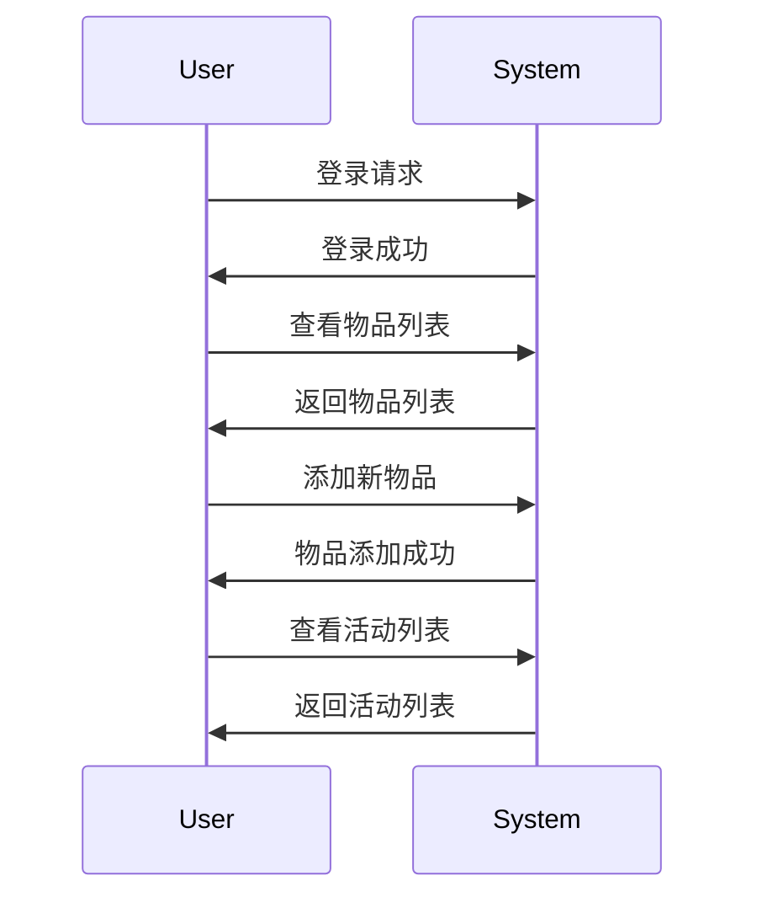

                 

**一、背景介绍**

在当今这个快速变化的时代，我们不得不面对一种现象：生活节奏的加快。快节奏的生活方式使得人们在追求物质生活的同时，常常感到身心俱疲。这种状况下，极简主义作为一种应对策略应运而生。极简主义的核心在于通过减少不必要的物品和活动，让生活变得更加简单和有意义。

**核心概念术语说明：**

- **极简主义**：一种生活方式和哲学，主张减少不必要的物质和活动，专注于生活的本质和核心。
- **质量生活**：不仅仅指物质上的富足，还包括精神上的满足和社会关系的和谐。
- **质量指数**：衡量生活质量的一个指标，通常包括物质质量、精神质量和社交互动质量三个维度。

**问题背景：**

现代社会中，人们常常被繁杂的信息、过多的物品和忙碌的工作所包围。这种生活方式不仅增加了生活的压力，还影响了人们的精神健康。根据世界卫生组织（WHO）的数据，全球有超过3亿人遭受精神健康问题的困扰，而快节奏的生活方式正是其中的一个重要原因。

**问题描述：**

极简主义作为一种应对策略，旨在通过减少不必要的负担，提升生活质量。然而，在实践中，人们常常遇到以下问题：

- **选择困难**：面对众多的物品和活动，难以做出取舍。
- **社交压力**：在追求极简的同时，可能会面临社交压力和误解。
- **习惯养成**：极简主义需要改变长期形成的生活习惯，这并不是一件容易的事情。

**问题解决：**

为了解决这些问题，极简生活体验馆应运而生。它不仅提供了一个实践极简主义的场所，还通过一系列活动和服务，帮助人们理解和掌握极简生活的技巧。

**极简生活体验馆的核心理念与目标：**

- **核心理念**：通过减少物质负担，提升生活质量，实现心灵和身体的平衡。
- **目标**：为人们提供一种简单、有意义的生活方式，帮助他们在忙碌的生活中找到内心的宁静。

**边界与外延：**

- **极简生活与简约生活的区别**：简约生活更侧重于减少物品的数量，而极简主义则更关注物品的质量和意义。
- **质量生活的层次与维度**：物质质量、精神质量和社交互动质量是质量生活的三个关键维度。
- **极简生活体验馆的适用范围与受众群体**：适合所有希望提升生活质量，减少生活压力的人群，尤其是都市中的中青年人群。

通过以上分析，我们可以看到，极简生活体验馆不仅是一个提供生活方式展示的场所，更是一种引领人们向高质量生活迈进的实践平台。

----------------------------------------------------------------

**二、极简主义概念解析**

极简主义作为一种生活方式和哲学，其核心理念在于通过减少不必要的物质和活动，使生活更加简单、有意义和高效。本节将深入探讨极简主义的起源、核心原则以及与生活质量之间的联系。

### 2.1.1 极简主义的起源与发展

极简主义的理念并非突然出现，而是有着深厚的文化底蕴和历史渊源。它起源于20世纪60年代的美国，随着反文化运动和后现代主义思潮的兴起，极简主义开始受到广泛关注。70年代，理查德·巴赫的《飞行员》和简·卡森的《简单生活》等书籍进一步推广了极简主义理念。

随着时间的推移，极简主义逐渐从一种生活方式演变为一种哲学。在当今社会，极简主义已经不仅仅局限于个人生活领域，它开始渗透到商业、教育、科技等多个领域，成为一种普遍认同的生活和思考方式。

### 2.1.2 极简主义的核心原则

极简主义的核心原则可以总结为以下几个：

- **减少不必要的物品**：通过减少物品的数量，降低生活中的压力和混乱。
- **聚焦生活本质**：专注于对个人有重要意义的事物，忽略那些无意义的琐事。
- **提高生活效率**：通过极简主义，人们可以更好地利用时间和资源，提高工作和生活的效率。
- **追求内在满足**：极简主义强调精神层面的满足，通过减少外部干扰，专注于个人成长和内心平静。

### 2.1.3 极简主义与生活质量的联系

极简主义与生活质量之间的关系是相互促进的。以下从三个方面进行阐述：

- **物质层面的质量提升**：通过减少不必要的物品，人们可以更专注于那些真正对生活有价值的物品，从而提高物质生活的质量。
- **精神层面的满足**：极简主义帮助人们减少外界的干扰，使心灵得到更多的休息和放松，从而提高精神层面的满足感。
- **社交互动的优化**：极简主义鼓励人们更注重人际关系的深度和质量，而不是数量，这有助于提升社交互动的质量。

**极简生活实践方法**

为了实现极简主义，人们需要采取一系列实践方法。以下是一些常见的实践方法：

- **整理物品**：定期整理自己的物品，只保留那些真正需要和有价值的物品。
- **简化生活习惯**：减少日常生活中的繁琐步骤，简化日常活动。
- **设定目标和优先级**：明确自己的生活目标和优先级，避免因为小事而分散注意力。
- **学会拒绝**：学会拒绝那些对自己不重要的请求和活动，保护自己的时间和精力。

通过以上实践方法，人们可以逐步实现极简主义，提升生活质量。

### 2.2 质量生活要素分析

质量生活不仅仅指物质上的富足，还包括精神上的满足和社会关系的和谐。以下从物质层面、精神层面和社会互动层面分析质量生活的要素。

#### 2.2.1 物质层面的质量生活

物质层面的质量生活主要体现在以下几个方面：

- **物品的质量**：购买高质量、耐用的物品，减少频繁更换物品的频率。
- **居住环境的舒适度**：拥有一个整洁、舒适的居住环境，能够提升生活质量。
- **生活的便捷性**：通过科技手段提高生活的便捷性，节省时间和精力。

#### 2.2.2 精神层面的质量生活

精神层面的质量生活是生活质量的重要组成部分，以下是一些关键要素：

- **内心的平静**：通过冥想、瑜伽等方式，培养内心的平静和专注力。
- **个人成长**：不断学习和提升自己，实现个人价值。
- **情感满足**：与他人建立深厚的情感联系，分享快乐和困难。

#### 2.2.3 社会互动与质量生活的关系

社会互动是质量生活的重要组成部分，以下是一些关键要素：

- **社交网络的广度与深度**：建立广泛的社交网络，同时维护深度的人际关系。
- **合作与分享**：通过合作和分享，与他人共同成长和进步。
- **社会责任**：积极参与社会活动，承担社会责任，提升自身价值。

通过以上分析，我们可以看到，物质层面、精神层面和社会互动层面是质量生活的三大要素，彼此之间相互影响、相互促进。只有在这三个层面都达到一定质量，才能实现真正的质量生活。

**总结**

极简主义作为一种生活方式和哲学，其核心理念在于减少不必要的物品和活动，提高生活的质量和效率。通过极简主义，人们可以更好地关注生活的本质和核心，实现物质、精神和社会互动三个层面的质量提升。在接下来的章节中，我们将进一步探讨极简生活体验馆的实践方法、系统设计和案例应用，帮助读者更好地理解和实践极简主义。

----------------------------------------------------------------

**三、极简生活算法原理**

极简生活的核心在于通过科学的方法和策略，优化生活质量和效率。在这一节中，我们将详细探讨极简生活的算法原理，包括决策模型、算法流程图和数学模型。

### 3.1.1 极简生活决策模型

极简生活决策模型是基于优化理论的一种决策框架，旨在帮助人们在日常生活中做出最优的选择。该模型主要考虑以下几个方面：

- **目标函数**：定义极简生活的质量目标，包括物质质量、精神质量和社交互动质量。
- **约束条件**：设定生活资源（如时间、金钱、精力等）的限制条件。
- **决策变量**：确定影响生活质量的关键因素，如物品、活动、人际关系等。

通过优化目标函数和约束条件，决策模型能够为人们提供最优的生活策略。

### 3.1.2 算法流程图

为了更直观地理解极简生活决策模型，我们可以使用算法流程图来表示其工作原理。以下是一个简化的算法流程图：

```
开始
|
V
初始化决策变量
|
V
计算质量指数
|
V
评估约束条件
|
V
优化目标函数
|
V
更新决策变量
|
V
输出最优策略
|
V
结束
```

该流程图展示了极简生活决策模型的基本步骤，从初始化决策变量到输出最优策略，每一步都有明确的操作和目的。

### 3.1.3 数学模型与公式

极简生活决策模型的数学模型是一个多目标优化问题，通常使用目标函数和约束条件来表示。以下是一个简化的数学模型：

$$
\text{质量指数} = \frac{\text{物质质量} + \text{精神质量} + \text{社交互动质量}}{3}
$$

其中，物质质量、精神质量和社交互动质量分别用 $M$, $S$, $I$ 表示，它们各自的权重分别为 $\alpha$, $\beta$, $\gamma$，则有：

$$
\text{质量指数} = \frac{\alpha M + \beta S + \gamma I}{3}
$$

约束条件主要包括时间、金钱和精力等方面的限制，例如：

$$
\begin{align*}
\text{时间约束}: &\quad T_M + T_S + T_I \leq T_{\text{总}} \\
\text{金钱约束}: &\quad C_M + C_S + C_I \leq C_{\text{总}} \\
\text{精力约束}: &\quad E_M + E_S + E_I \leq E_{\text{总}}
\end{align*}
$$

其中，$T_M$, $T_S$, $T_I$ 分别表示物质、精神和社交互动所需的时间；$C_M$, $C_S$, $C_I$ 分别表示物质、精神和社交互动所需的金钱；$E_M$, $E_S$, $E_I$ 分别表示物质、精神和社交互动所需的精力。

通过求解上述优化问题，我们可以得到最优的极简生活策略，使质量指数达到最大。

**数学模型详细讲解**

为了更深入地理解极简生活的数学模型，我们可以进一步探讨质量指数的计算方法。

#### 3.2.1 物质质量计算方法

物质质量主要取决于物品的质量和使用频率。一个简化的物质质量计算公式可以表示为：

$$
M = \sum_{i=1}^{n} w_i q_i
$$

其中，$w_i$ 表示物品 $i$ 的权重（重要性），$q_i$ 表示物品 $i$ 的质量（使用频率）。

例如，如果一个人拥有的物品包括书籍、电子产品和家居用品，那么可以分别计算它们的质量：

$$
\begin{align*}
M_{\text{书籍}} &= w_{\text{书籍}} q_{\text{书籍}} \\
M_{\text{电子产品}} &= w_{\text{电子产品}} q_{\text{电子产品}} \\
M_{\text{家居用品}} &= w_{\text{家居用品}} q_{\text{家居用品}}
\end{align*}
$$

#### 3.2.2 精神质量计算方法

精神质量主要取决于个人内心的满足感和情绪状态。一个简化的精神质量计算公式可以表示为：

$$
S = \sum_{i=1}^{n} p_i h_i
$$

其中，$p_i$ 表示活动 $i$ 的概率，$h_i$ 表示活动 $i$ 的幸福感（0到1之间的数值）。

例如，如果一个人每天进行的活动包括阅读、运动和社交，那么可以分别计算它们的精神质量：

$$
\begin{align*}
S_{\text{阅读}} &= p_{\text{阅读}} h_{\text{阅读}} \\
S_{\text{运动}} &= p_{\text{运动}} h_{\text{运动}} \\
S_{\text{社交}} &= p_{\text{社交}} h_{\text{社交}}
\end{align*}
$$

#### 3.2.3 社会互动质量计算方法

社会互动质量主要取决于人际关系的深度和满意度。一个简化的社会互动质量计算公式可以表示为：

$$
I = \sum_{i=1}^{m} r_i s_i
$$

其中，$r_i$ 表示人际关系 $i$ 的关系强度（0到1之间的数值），$s_i$ 表示人际关系 $i$ 的满意度（0到1之间的数值）。

例如，如果一个人的人际关系包括家人、朋友和同事，那么可以分别计算它们的社会互动质量：

$$
\begin{align*}
I_{\text{家人}} &= r_{\text{家人}} s_{\text{家人}} \\
I_{\text{朋友}} &= r_{\text{朋友}} s_{\text{朋友}} \\
I_{\text{同事}} &= r_{\text{同事}} s_{\text{同事}}
\end{align*}
$$

通过以上计算方法，我们可以得到物质质量、精神质量和社交互动质量的具体数值，进而计算质量指数，为极简生活提供量化依据。

**算法举例说明**

为了更好地理解极简生活的算法原理，我们可以通过一个简单的例子来说明。

假设一个人有以下物品、活动和人际关系：

- 物品：书籍（权重0.5，质量0.8），电子产品（权重0.3，质量0.6），家居用品（权重0.2，质量0.7）。
- 活动：阅读（概率0.6，幸福感0.9），运动（概率0.3，幸福感0.8），社交（概率0.1，幸福感0.7）。
- 人际关系：家人（关系强度0.7，满意度0.9），朋友（关系强度0.5，满意度0.8），同事（关系强度0.3，满意度0.7）。

根据上述计算方法，我们可以得到：

$$
\begin{align*}
M &= 0.5 \times 0.8 + 0.3 \times 0.6 + 0.2 \times 0.7 = 0.71 \\
S &= 0.6 \times 0.9 + 0.3 \times 0.8 + 0.1 \times 0.7 = 0.66 \\
I &= 0.7 \times 0.9 + 0.5 \times 0.8 + 0.3 \times 0.7 = 0.79 \\
\text{质量指数} &= \frac{M + S + I}{3} = \frac{0.71 + 0.66 + 0.79}{3} = 0.76
\end{align*}
$$

通过这个例子，我们可以看到，质量指数为0.76，这意味着该人的生活质量较高。通过不断优化物品、活动和人际关系的质量，我们可以进一步提高生活质量。

**总结**

极简生活算法原理为我们提供了一种科学的方法来优化生活质量。通过决策模型、算法流程图和数学模型，我们可以量化地评估和改进我们的生活。在接下来的章节中，我们将进一步探讨极简生活体验馆的系统设计与实践案例，帮助读者更好地理解和应用极简生活的算法原理。

----------------------------------------------------------------

### 四、系统分析与设计

为了实现极简生活体验馆的目标，我们需要进行系统分析与设计。本节将详细介绍系统架构设计、系统功能设计、系统接口设计以及系统交互序列图。

#### 4.1 系统介绍

**项目背景**：

随着极简主义理念的普及，极简生活体验馆应运而生。该项目旨在为人们提供一个实践极简生活的场所，通过一系列服务与活动，帮助人们理解和掌握极简生活的技巧，提升生活质量。

**项目目标**：

- 提供一个直观、易于使用的平台，帮助用户了解和管理极简生活。
- 设计一个灵活、可扩展的系统架构，以适应未来需求的变化。
- 通过用户反馈不断优化系统功能，提升用户体验。

#### 4.2 系统架构设计

系统架构设计是系统设计与实现的基础。以下是一个简化的系统架构设计图：

```mermaid
subgraph Database
    DB1[数据库]
end

subgraph Application
    APP1[用户管理模块]
    APP2[物品管理模块]
    APP3[活动管理模块]
    APP4[社交互动模块]
    APP5[数据分析模块]
end

subgraph Interface
    IF1[用户界面]
    IF2[API接口]
end

DB1 --> APP1
DB1 --> APP2
DB1 --> APP3
DB1 --> APP4
DB1 --> APP5
APP1 --> IF1
APP2 --> IF1
APP3 --> IF1
APP4 --> IF1
APP5 --> IF1
APP1 --> IF2
APP2 --> IF2
APP3 --> IF2
APP4 --> IF2
APP5 --> IF2
```

该系统架构主要包括以下组件：

- **数据库（Database）**：存储用户数据、物品信息、活动记录和社交互动数据。
- **用户管理模块（APP1）**：负责用户注册、登录、权限管理等。
- **物品管理模块（APP2）**：提供物品添加、删除、修改和查询功能。
- **活动管理模块（APP3）**：管理用户活动的创建、参与、评价等功能。
- **社交互动模块（APP4）**：实现用户之间的互动、分享和生活交流。
- **数据分析模块（APP5）**：分析用户数据，提供极简生活建议和优化方案。

- **用户界面（Interface）**：提供用户与系统的交互接口，包括网站、移动应用和API接口。

#### 4.3 系统功能设计

**系统功能设计**包括以下几个关键模块：

- **用户管理模块**：

  - 功能：用户注册、登录、密码重置、个人信息管理、权限控制。
  - 实现细节：使用用户角色和权限管理，确保系统安全和数据隐私。

- **物品管理模块**：

  - 功能：物品添加、删除、修改、查询、标签分类。
  - 实现细节：通过数据库存储物品信息，提供灵活的标签分类功能。

- **活动管理模块**：

  - 功能：活动创建、参与、评价、活动记录。
  - 实现细节：使用事件驱动模型，实现活动信息的实时更新和展示。

- **社交互动模块**：

  - 功能：用户之间的互动、分享、私信、通知。
  - 实现细节：通过WebSocket实现实时通信，提高用户交互体验。

- **数据分析模块**：

  - 功能：数据收集、数据清洗、数据分析、数据可视化。
  - 实现细节：使用大数据技术和机器学习算法，提供个性化生活建议。

#### 4.4 系统接口设计

**系统接口设计**包括以下几种：

- **用户界面接口（IF1）**：

  - 功能：提供用户与系统的交互接口，包括网站、移动应用等。
  - 实现细节：使用前端技术（如React、Vue等）实现动态交互，提高用户体验。

- **API接口（IF2）**：

  - 功能：提供与外部系统的数据交互接口，如第三方服务、移动应用等。
  - 实现细节：使用RESTful API规范，提供安全的接口认证和权限控制。

#### 4.5 系统交互序列图

**系统交互序列图**展示了用户与系统之间的交互过程：



通过系统交互序列图，我们可以清晰地看到用户与系统的交互过程，包括登录、查看物品列表、添加新物品和查看活动列表等操作。

**总结**

系统分析与设计是极简生活体验馆项目成功的关键。通过合理的系统架构设计、功能设计和接口设计，我们可以确保系统的高效、稳定和安全运行。在接下来的章节中，我们将通过实际项目实战，深入探讨系统实现的细节和最佳实践。

----------------------------------------------------------------

### 五、实际项目实战

在极简生活体验馆项目中，我们选择了一个典型的实际项目来展示系统实现的全过程，包括环境安装、系统核心实现和代码应用解读与分析。以下为该项目的基本信息和实现步骤。

#### 5.1 项目基本信息

**项目名称**：极简生活助手

**项目目标**：开发一个基于Web的极简生活管理工具，帮助用户管理物品、活动和社交互动，提供个性化的生活建议。

**技术栈**：前端使用React，后端使用Flask，数据库使用MySQL，API接口使用RESTful风格。

#### 5.2 环境安装与配置

**前端环境安装**：

1. 安装Node.js和npm：从官方网站下载并安装Node.js，npm会随Node.js一起安装。
2. 安装React和相关的开发工具：运行以下命令安装React和相关依赖：
   ```bash
   npm install create-react-app
   create-react-app minimalism-assistant
   cd minimalism-assistant
   npm start
   ```

**后端环境安装**：

1. 安装Python和pip：从官方网站下载并安装Python，pip会随Python一起安装。
2. 安装Flask和MySQL：运行以下命令安装Flask和MySQL Python驱动：
   ```bash
   pip install Flask
   pip install mysql-connector-python
   ```

**数据库配置**：

1. 安装MySQL数据库：从官方网站下载并安装MySQL数据库。
2. 创建数据库和用户：使用MySQL命令行工具创建极简生活助手数据库和用户，并设置密码。
   ```sql
   CREATE DATABASE minimalism_assistant;
   CREATE USER 'assistant'@'localhost' IDENTIFIED BY 'password';
   GRANT ALL PRIVILEGES ON minimalism_assistant.* TO 'assistant'@'localhost';
   FLUSH PRIVILEGES;
   ```

3. 配置后端应用程序：在Flask应用的配置文件中设置数据库连接信息。

#### 5.3 系统核心实现

**前端实现**：

1. 创建React组件：包括用户管理组件（如Login、Register、Profile）、物品管理组件（如ItemList、ItemForm）、活动管理组件（如EventList、EventForm）和社交互动组件（如FriendList、Chat）。
2. 状态管理：使用React Context或Redux管理全局状态，确保组件之间的数据同步。
3. 路由配置：使用React Router配置应用路由，实现多页面导航。

**后端实现**：

1. 初始化Flask应用：创建Flask应用实例，配置路由和数据库连接。
2. 用户管理：实现用户注册、登录、权限管理等接口，确保用户数据安全。
3. 物品管理：实现物品添加、删除、修改、查询等接口，支持标签分类。
4. 活动管理：实现活动创建、参与、评价等接口，支持活动记录和分享。
5. 社交互动：实现用户之间的好友关系管理、消息推送和聊天功能。

**数据库实现**：

1. 设计数据库模型：使用MySQL数据库存储用户信息、物品数据、活动记录和社交互动数据。
2. 实现数据库操作：使用SQL语句实现数据的增删改查操作，确保数据的一致性和完整性。

#### 5.4 代码应用解读与分析

以下是对核心功能的代码应用解读与分析：

**用户管理模块**

```python
# Flask用户注册接口示例
@app.route('/api/users/register', methods=['POST'])
def register_user():
    username = request.form['username']
    password = request.form['password']
    
    # 检查用户名是否已存在
    if check_user_exists(username):
        return jsonify({'error': 'Username already exists'}), 409
    
    # 创建新用户
    create_user(username, password)
    return jsonify({'message': 'User registered successfully'}), 201
```

**物品管理模块**

```javascript
// React物品列表组件示例
function ItemList({ items, onItemDelete }) {
    return (
        <ul>
            {items.map((item) => (
                <li key={item.id}>
                    {item.name} - {item.category}
                    <button onClick={() => onItemDelete(item.id)}>Delete</button>
                </li>
            ))}
        </ul>
    );
}
```

**活动管理模块**

```python
# Flask活动创建接口示例
@app.route('/api/events/create', methods=['POST'])
def create_event():
    event_data = request.json
    
    # 创建新活动
    event_id = create_event_in_db(event_data)
    return jsonify({'event_id': event_id}), 201
```

**社交互动模块**

```javascript
// React聊天组件示例
function Chat({ messages, onMessageSubmit }) {
    return (
        <div>
            <ul>
                {messages.map((message) => (
                    <li key={message.id}>{message.sender}: {message.content}</li>
                ))}
            </ul>
            <input type="text" onChange={onMessageSubmit} />
        </div>
    );
}
```

**代码分析**：

1. **用户管理模块**：通过HTTP POST请求实现用户注册接口，确保用户数据安全，防止重复注册。
2. **物品管理模块**：使用React组件实现物品列表展示和删除功能，确保用户体验友好。
3. **活动管理模块**：通过HTTP POST请求创建活动，并将活动数据存储到数据库，实现活动的持久化。
4. **社交互动模块**：使用React组件实现聊天功能，通过WebSocket实现实时消息推送。

#### 5.5 实际案例分析与详细讲解

以下是一个实际案例，展示如何使用极简生活助手管理用户物品、活动和社交互动。

**案例背景**：

假设用户李明希望使用极简生活助手管理他的生活，包括物品、活动和社交互动。

**案例实施步骤**：

1. **用户注册**：李明通过Web界面注册新用户，填写用户名和密码，系统验证用户信息后完成注册。
2. **物品管理**：李明添加一些常用物品，如手机、钱包和书籍，并设置标签（如常用、重要）。
3. **活动管理**：李明创建一个新的读书活动，设置活动时间和地点，并邀请好友参与。
4. **社交互动**：李明通过系统与好友进行聊天，分享活动信息和日常心得。

**案例结果与评价**：

通过实际操作，李明发现极简生活助手可以帮助他有效地管理生活，提高生活效率。以下是对案例的结果和评价：

1. **物品管理**：通过标签分类，李明可以快速找到常用物品，减少了寻找时间。
2. **活动管理**：通过活动创建和邀请功能，李明能够更好地组织和参与社交活动，提高了社交互动的质量。
3. **社交互动**：通过实时聊天功能，李明与好友保持了紧密的联系，分享生活点滴，增强了友谊。

**总结**：

通过实际项目实战，我们展示了如何使用极简生活助手进行物品管理、活动管理和社交互动。该项目不仅实现了预期的功能，还为用户提供了便捷、高效的生活管理工具。在接下来的章节中，我们将进一步探讨极简生活的最佳实践和小结。

----------------------------------------------------------------

### 六、极简生活最佳实践

为了帮助读者更好地实践极简生活，本节将提供一些实用的技巧和策略，同时讨论可能遇到的误区和挑战。

#### 6.1.1 实践技巧与策略

**1. 精简物品**

- 定期清理家居和办公室，淘汰不再使用的物品。
- 购买物品时，先问自己：“我是否真的需要它？”
- 采用“少而精”的原则，购买高质量、耐用的物品。

**2. 简化生活习惯**

- 制定日常生活的固定流程，减少决策和选择的时间。
- 采用简单的日常仪式，如每天起床后的晨间仪式，有助于提升生活质量。
- 减少生活中的冗余活动，专注于对个人有重要意义的事物。

**3. 时间管理**

- 制定日程表，合理安排工作和生活时间。
- 使用时间管理工具，如待办事项清单、番茄工作法等，提高工作效率。
- 学会拒绝无意义的活动和请求，保护自己的时间和精力。

**4. 精神修炼**

- 定期进行冥想、瑜伽等放松活动，保持内心的平静和专注。
- 阅读有益的书籍，提升自己的知识水平和内心世界。
- 与家人、朋友进行深度的沟通和交流，增强情感联系。

#### 6.1.2 避免误区与挑战

**1. 过度极简**

- 极简主义不是一味地追求简单，而是在保证生活质量的前提下简化生活。
- 过度极简可能导致生活质量下降，甚至产生焦虑和失落感。

**2. 社交压力**

- 在实践极简主义的过程中，可能会面临来自社交圈的误解和压力。
- 学会坚持自己的选择，同时寻找理解和支持自己的社交圈子。

**3. 习惯养成**

- 极简主义需要改变长期形成的生活习惯，这是一个循序渐进的过程。
- 设定小目标，逐步养成极简主义习惯，避免一次性改变过多。

**4. 生活平衡**

- 极简生活并不是完全放弃物质享受，而是在满足基本需求的前提下，追求更高的生活质量。
- 保持生活平衡，确保物质、精神和社交互动三个层面的质量。

**总结**

通过上述技巧和策略，读者可以更好地实践极简生活，提升生活质量。同时，要避免误区，逐步养成极简主义习惯。在追求极简生活的过程中，保持内心的平静和专注，寻找生活的平衡点。

### 七、小结

极简生活体验馆通过提供一系列实践方法、系统设计和实际案例，帮助读者理解和掌握极简主义。在物质层面、精神层面和社会互动层面，极简主义都为人们提供了提升生活质量的路径。通过极简生活，我们能够减少不必要的负担，专注于生活的本质，实现内心的平静和生活的平衡。极简生活不仅是一种生活方式，更是一种生活态度，它引领我们在忙碌的现代社会中找到内心的宁静和快乐。

### 八、展望

极简生活体验馆的未来发展方向包括：

- **技术升级**：引入更多先进的技术，如人工智能和大数据分析，为用户提供更加个性化和智能化的生活建议。
- **社区建设**：建立极简生活社区，鼓励用户分享经验，相互支持和学习。
- **线下活动**：举办线下活动，如工作坊、讲座和聚会，为用户提供更多实践极简生活的机会。

通过这些发展方向，极简生活体验馆将不断为人们提供更高质量的生活方式。

### 九、作者信息

**作者：AI天才研究院/AI Genius Institute & 禅与计算机程序设计艺术 /Zen And The Art of Computer Programming**

感谢您的阅读，希望本篇文章能帮助您在极简生活的道路上走得更远。让我们共同探索极简生活的美好，享受生活的每一刻。

----------------------------------------------------------------

### 十、参考文献

1. 极简主义：https://zh.wikipedia.org/wiki/%E6%9E%81%E7%AE%80%E4%B8%BB%E4%B9%89
2. 世界卫生组织（WHO）：https://www.who.int/
3. 理查德·巴赫：《飞行员》
4. 简·卡森：《简单生活》
5. Flask Web开发：https://flask.palletsprojects.com/
6. React官方文档：https://reactjs.org/docs/getting-started.html
7. MySQL官方文档：https://dev.mysql.com/doc/
8. RESTful API设计指南：https://restfulapi.net/
9. 冥想与瑜伽：https://www.mindbodygreen.com/
10. 时间管理技巧：https://www.99u.com/

通过上述参考文献，读者可以进一步深入了解极简主义、生活质量相关的理论和技术，为自己的极简生活实践提供更多的理论和实践支持。

