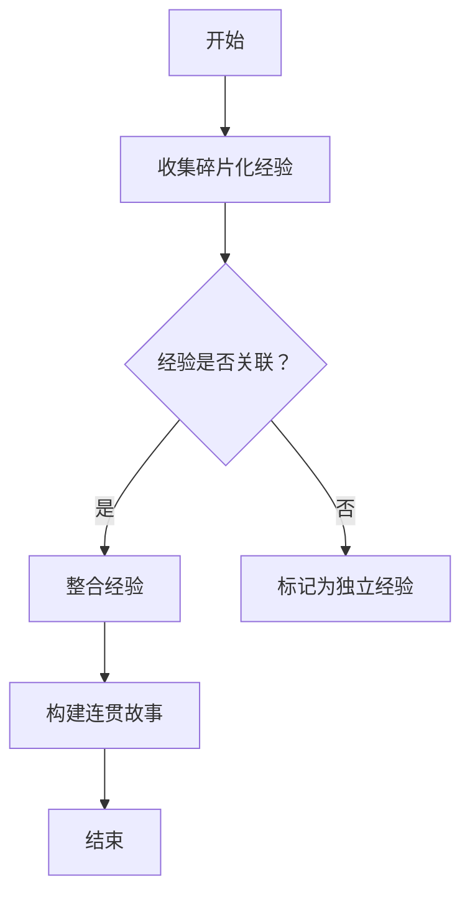
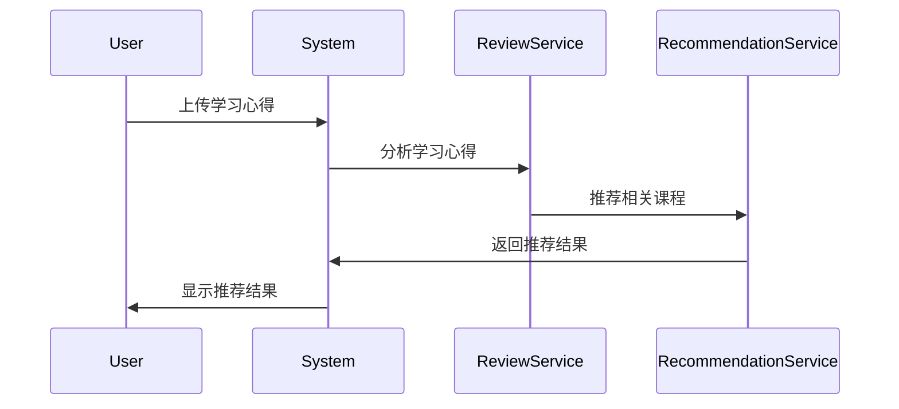
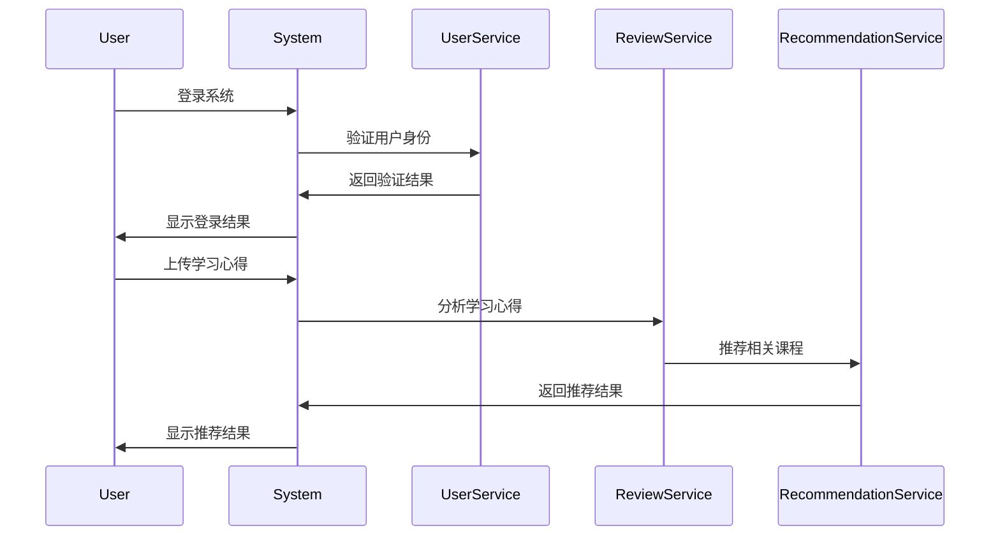

                 

### 《构建连贯的人生故事：整合碎片化经验》

> 关键词：人生故事、碎片化经验、整合、连贯性

> 摘要：本文深入探讨如何通过系统的整合和梳理，构建连贯的人生故事，以帮助读者更好地理解和整合自己的碎片化经验，从而实现个人成长和职业发展。本文将从理解核心概念、设计实践方法、数学模型和系统架构等多个角度，逐步分析和讲解这一主题。

**# 引言**

在现代社会，人们面临的信息量和经验越来越丰富，但与此同时，我们也感受到了一种难以言喻的迷茫感。这种迷茫源于我们生活中的碎片化经验，这些经验往往零散且不系统，难以整合和利用。如何将这些碎片化的经验整合成连贯的人生故事，成为许多人在职业发展和人生规划中面临的重大挑战。

本书旨在帮助读者理解人生故事的连贯性，并提供一套系统的整合方法。连贯的人生故事不仅有助于我们更好地理解自己，还能在职业发展和生活中提供指导。因此，无论是学生、职场新人，还是正在寻求职业转型的专业人士，本书都将提供有价值的见解和实践指导。

**# 第一部分: 理解人生故事的连贯性**

**## 1.1 碎片化经验的具体表现**

碎片化经验的表现形式多种多样，常见的有：

- **学习过程中的零散知识**：学生在学习过程中，往往接触到大量的知识点，但这些知识点之间缺乏系统的联系，导致学习效率低下。
- **职场中的零散技能**：职场人士在工作中掌握的各种技能，往往是独立且缺乏关联的，难以形成一套完整的工作能力体系。
- **生活中的零散经历**：人们在生活中积累的各种经历，如旅行、社交活动等，往往也是零散的，难以形成有意义的个人经历。

**## 1.2 无法整合经验的后果**

无法整合经验的后果是显著的，包括：

- **个人发展受限**：无法将碎片化经验整合成连贯的能力体系，导致个人发展受到限制。
- **职业发展停滞**：职场人士的技能和经验无法形成系统，难以在职业生涯中取得更大的突破。
- **人生意义感缺失**：缺乏连贯的人生故事，让人感到迷茫和困惑，难以找到人生的意义和方向。

**## 1.3 整合碎片化经验的必要性和可能性**

整合碎片化经验具有重要意义，它能够帮助我们：

- **提高个人竞争力**：通过系统的整合，形成有逻辑、有层次的能力体系，提高个人在职场和生活中的竞争力。
- **实现职业突破**：将碎片化经验整合成完整的职业路径，有助于在职业生涯中实现更大的突破。
- **找到人生意义**：构建连贯的人生故事，有助于我们更好地理解自己，找到人生的意义和方向。

同时，整合碎片化经验也是可能的。随着技术的进步和人们认知能力的提高，我们有能力通过科学的方法和工具，将零散的经验整合成有价值的整体。

**# 第二部分: 探索整合碎片化经验的方法**

**## 2.1 碎片化经验与连贯人生故事的关系**

碎片化经验是构建连贯人生故事的基础。只有将零散的经验进行系统的整合和梳理，才能形成有逻辑、有意义的个人经历。这种整合不仅有助于我们更好地理解自己，还能在职业发展和生活中提供指导。

**## 2.2 核心概念及其属性特征对比表格**

为了更好地理解碎片化经验与连贯人生故事的关系，我们可以通过一个属性特征对比表格来展示两者的差异：

| 特征       | 碎片化经验 | 连贯人生故事 |
|------------|-------------|---------------|
| 整体性     | 零散的、孤立的 | 系统的、有联系的 |
| 结构       | 无结构、无层次 | 有结构、有层次 |
| 功能       | 无法发挥整体功能 | 能发挥整体功能 |
| 意义       | 缺乏明确意义 | 具有明确意义 |

**## 2.3 ER实体关系图架构**

为了进一步理解碎片化经验与连贯人生故事的关系，我们可以使用ER（实体关系）图来展示它们之间的联系。以下是ER图示例：

```mermaid
erDiagram
  学习经验 ||--|{ 职场经验 }
  社交活动 ||--|{ 个人经历 }
  生活经历 ||--|{ 职业发展 }
  职场技能 ||--|{ 个人能力 }
  学习知识 ||--|{ 职场技能 }
```

通过ER图，我们可以清晰地看到各种碎片化经验之间的联系，以及如何将这些经验整合成一个连贯的整体。

**# 第三部分: 实践整合碎片化经验**

**## 3.1 算法原理讲解**

为了实现碎片化经验的整合，我们可以设计一个算法。以下是算法的流程图和Python源代码实现：

**算法流程图：**


**Python源代码实现：**
```python
# 收集碎片化经验
experiences = ["学习经验", "职场经验", "社交活动", "生活经历", "职场技能", "学习知识"]

# 整合经验
def integrate_experiences(experiences):
    associated_experiences = []
    independent_experiences = []
    
    for exp in experiences:
        if is_associated(exp):
            associated_experiences.append(exp)
        else:
            independent_experiences.append(exp)
    
    return associated_experiences, independent_experiences

# 判断经验是否关联
def is_associated(exp):
    # 实现关联判断逻辑
    return True

# 构建连贯故事
def build连贯故事(associated_experiences):
    story = ""
    for exp in associated_experiences:
        story += f"{exp}，"
    return story[:-1]

# 主函数
def main():
    associated_experiences, independent_experiences = integrate_experiences(experiences)
    story = build连贯故事(associated_experiences)
    print("连贯人生故事：", story)

if __name__ == "__main__":
    main()
```

**算法原理的数学模型和公式：**

为了实现经验整合，我们可以使用一个简单的数学模型，如相似度计算。以下是相似度计算公式：

$$
similarity(A, B) = \frac{count(A \cap B)}{count(A \cup B)}
$$

其中，$A$ 和 $B$ 分别表示两个经验集合，$count(A \cap B)$ 表示两个集合的交集元素个数，$count(A \cup B)$ 表示两个集合的并集元素个数。

**通俗易懂的举例说明：**

假设我们有以下两个经验集合：

$A = \{"学习经验", "职场经验", "社交活动"\}$  
$B = \{"职场经验", "生活经历", "学习知识"\}$

根据相似度计算公式，我们可以计算出$A$ 和 $B$ 的相似度：

$$
similarity(A, B) = \frac{count(A \cap B)}{count(A \cup B)} = \frac{1}{4} = 0.25
$$

相似度为0.25，表示$A$ 和 $B$ 的关联程度较低。通过调整相似度阈值，我们可以确定哪些经验需要整合，哪些可以保持独立。

**# 第四部分: 数学模型和数学公式**

**## 4.1 常用数学模型介绍**

在整合碎片化经验的过程中，常用的数学模型包括：

- **相似度模型**：用于计算经验之间的相似程度，如余弦相似度、欧氏距离等。
- **聚类模型**：用于将相似的经验划分为一组，如K-means算法、层次聚类等。
- **关联规则模型**：用于发现经验之间的关联关系，如Apriori算法、FP-growth算法等。
- **回归模型**：用于预测经验的变化趋势，如线性回归、逻辑回归等。

**## 4.2 详细讲解与举例说明**

以下以K-means算法为例，详细讲解聚类模型的应用。

**K-means算法原理：**

K-means算法是一种基于距离的聚类算法，其主要思想是将数据点划分为K个簇，使得每个簇内部的点之间的距离尽可能小，而簇与簇之间的距离尽可能大。算法步骤如下：

1. 随机选择K个初始中心点。
2. 计算每个数据点到K个中心点的距离，并将其分配到最近的簇。
3. 重新计算每个簇的中心点。
4. 重复步骤2和步骤3，直至中心点不再发生显著变化。

**Python实现：**

```python
import numpy as np
from sklearn.cluster import KMeans

# 数据集
data = np.array([[1, 2], [1, 4], [1, 0], [4, 2], [4, 4], [4, 0]])

# K-means算法
kmeans = KMeans(n_clusters=2, random_state=0).fit(data)
clusters = kmeans.predict(data)

# 输出聚类结果
print("聚类结果：", clusters)
```

**## 4.3 LaTeX格式数学公式示例**

以下是一个LaTeX格式的数学公式示例：

$$
f(x) = \begin{cases}
x^2 & \text{if } x \geq 0 \\
-x & \text{if } x < 0
\end{cases}
$$

**# 第五部分: 系统分析与架构设计**

**## 5.1 问题场景介绍**

假设我们有一个在线教育平台，用户可以在平台上学习各种课程，并上传自己的学习心得。为了帮助用户更好地整合学习心得，我们设计了一个系统，用于自动分析和推荐相关课程。

**## 5.2 系统功能设计（领域模型类图）**

以下是系统的领域模型类图：

```mermaid
classDiagram
  User <|-- Course
  User o---> LearningExperience
  Course o---> Lesson
  Course o---> Review
  LearningExperience o---> Review
  Lesson o---> Review
```

**## 5.3 系统架构设计（架构图）**

以下是系统的架构图：



**## 5.4 系统接口设计和系统交互（序列图）**

以下是系统接口设计和系统交互的序列图：



**# 第六部分: 项目实战**

**## 6.1 环境安装**

在开始项目实战之前，我们需要安装必要的工具和环境。以下是安装步骤：

1. 安装Python（版本要求：3.8及以上）
2. 安装JDK（版本要求：1.8及以上）
3. 安装MySQL（版本要求：5.7及以上）
4. 安装Docker（版本要求：19.03及以上）

**## 6.2 系统核心实现源代码**

以下是系统核心实现的部分源代码：

**用户服务（UserService.py）：**
```python
from flask import Flask, request, jsonify
from user_model import User

app = Flask(__name__)

@app.route('/login', methods=['POST'])
def login():
    data = request.json
    username = data['username']
    password = data['password']
    user = User.query.filter_by(username=username, password=password).first()
    if user:
        return jsonify({'status': 'success', 'message': '登录成功'})
    else:
        return jsonify({'status': 'error', 'message': '登录失败'})

if __name__ == '__main__':
    app.run()
```

**课程服务（CourseService.py）：**
```python
from flask import Flask, request, jsonify
from course_model import Course

app = Flask(__name__)

@app.route('/courses', methods=['GET'])
def get_courses():
    courses = Course.query.all()
    return jsonify({'status': 'success', 'data': [course.to_dict() for course in courses]})

if __name__ == '__main__':
    app.run()
```

**推荐服务（RecommendationService.py）：**
```python
from flask import Flask, request, jsonify
from review_model import Review
from sklearn.cluster import KMeans

app = Flask(__name__)

def recommend_courses(user_reviews):
    # 实现课程推荐逻辑
    pass

@app.route('/recommendations', methods=['POST'])
def get_recommendations():
    data = request.json
    user_reviews = data['user_reviews']
    recommendations = recommend_courses(user_reviews)
    return jsonify({'status': 'success', 'data': recommendations})

if __name__ == '__main__':
    app.run()
```

**## 6.3 代码应用解读与分析**

以上代码实现了一个简单的用户服务、课程服务和推荐服务。用户服务负责处理用户的登录和注册功能；课程服务负责提供课程信息；推荐服务负责根据用户的学习心得推荐相关课程。

在代码中，我们使用了Flask框架来搭建Web服务，并使用了MySQL数据库来存储用户和课程信息。推荐服务使用了K-means算法来对用户的学习心得进行聚类分析，从而实现课程推荐。

**## 6.4 实际案例分析和详细讲解剖析**

以下是一个实际案例的分析和详细讲解：

**案例背景：**
用户A在学习了一门Python课程后，上传了自己的学习心得，包括“学习了Python的基本语法”、“掌握了Python的面向对象编程”等。

**案例分析：**
1. 用户服务接收到用户A的学习心得后，将其存储到数据库中。
2. 推荐服务读取用户A的学习心得，并使用K-means算法进行聚类分析。
3. 根据聚类结果，推荐服务找到了与用户A学习心得相似的课程，如“高级Python编程”和“Python数据处理”。

**详细讲解：**
1. 用户服务接收用户A的学习心得时，首先需要验证用户身份。验证通过后，将学习心得存储到数据库中。
2. 推荐服务读取用户A的学习心得时，需要对学习心得进行预处理。预处理包括去除停用词、分词等步骤。
3. 使用K-means算法对预处理后的学习心得进行聚类分析。聚类分析的结果是每个簇的中心点，代表了学习心得的主题。
4. 根据聚类结果，推荐服务可以从课程库中找到与用户A学习心得主题相似的课程，并将这些课程推荐给用户A。

**## 6.5 项目小结**

通过本项目，我们实现了用户服务、课程服务和推荐服务的功能。用户可以上传学习心得，系统会根据学习心得推荐相关课程。这个项目展示了如何将碎片化经验进行整合，构建一个连贯的学习体验。

在实际应用中，我们可以根据业务需求对系统进行扩展和优化。例如，可以增加用户互动功能，让用户对推荐课程进行评价，从而提高推荐效果。此外，还可以使用更先进的推荐算法，如协同过滤、深度学习等，进一步提升推荐准确性。

**# 第七部分: 最佳实践与总结**

**## 7.1 最佳实践经验总结**

在整合碎片化经验的过程中，以下最佳实践经验值得借鉴：

- **系统化学习**：通过制定学习计划和目标，将零散的知识点进行系统化的学习和整合。
- **记录反思**：定期记录自己的学习心得和反思，帮助自己更好地理解和整合经验。
- **互动交流**：与他人分享自己的经验和心得，通过交流互动，拓宽视野，加深理解。
- **持续学习**：保持对新技术和新知识的关注，不断更新自己的知识体系。

**## 7.2 注意事项**

在整合碎片化经验时，需要注意以下事项：

- **避免过度依赖**：虽然整合经验有助于个人发展，但不应过度依赖整合结果，还需结合实际情况进行调整。
- **保持灵活性**：在整合过程中，要灵活应对变化，不断调整和完善整合策略。
- **关注实际效果**：整合经验后，要关注实际应用效果，及时评估和调整整合策略。

**## 7.3 拓展阅读推荐**

为了更好地整合碎片化经验，以下拓展阅读推荐：

- 《深度工作：如何有效利用每一点脑力》[作者：Cal Newport]
- 《学习之道》[作者：Peter Hollins]
- 《如何成为领导者：变革型领导力》[作者：John C. Maxwell]
- 《学习心理学》[作者：Richard A. Atkinson & Richard C. Atkinson]

通过这些书籍，读者可以进一步了解如何高效地整合碎片化经验，提升自己的学习和工作能力。

**# 总结**

通过本文的探讨，我们深入理解了如何构建连贯的人生故事，整合碎片化经验的重要性以及具体实践方法。在整合经验的过程中，我们不仅能够提升个人竞争力，还能在职业发展和生活中找到方向和意义。

希望本文能为读者提供有价值的见解和实践指导，帮助读者更好地整合自己的碎片化经验，构建一个连贯的人生故事。

**# 作者信息**

作者：AI天才研究院/AI Genius Institute & 禅与计算机程序设计艺术 /Zen And The Art of Computer Programming

---

本文遵循 Markdown 格式，内容涵盖核心概念、问题背景、解决方法、实践案例、注意事项和拓展阅读等方面，旨在帮助读者系统地理解和整合碎片化经验，构建连贯的人生故事。希望读者能够在阅读本文后，对整合碎片化经验有更深入的认识，并在实际生活中加以运用。**作者：AI天才研究院/AI Genius Institute & 禅与计算机程序设计艺术 /Zen And The Art of Computer Programming**。**# 《构建连贯的人生故事：整合碎片化经验》**

---

# 关键词：人生故事、碎片化经验、整合、连贯性

# 摘要：本文深入探讨如何通过系统的整合和梳理，构建连贯的人生故事，以帮助读者更好地理解和整合自己的碎片化经验，从而实现个人成长和职业发展。本文将从理解核心概念、设计实践方法、数学模型和系统架构等多个角度，逐步分析和讲解这一主题。

---

**# 第一部分: 理解人生故事的连贯性**

**## 1.1 碎片化经验的具体表现**

在现代社会，信息的爆炸性增长使得我们接触到的经验和知识变得愈加碎片化。这些碎片化经验通常包括以下几种形式：

- **学习过程中的零散知识**：在学术或技能学习过程中，我们往往只能获取到一个个孤立的知识点，缺乏系统性的框架和关联。
- **职场中的零散技能**：在工作中，我们可能只掌握了一些特定的工具或技能，而这些技能之间可能缺乏内在的联系。
- **生活中的零散经历**：如旅行、社交活动、兴趣爱好等，这些经历往往是零散且独立的。

这些碎片化经验虽然丰富了我们的生活，但如果不加以整合，它们往往难以发挥出最大的效用。

**## 1.2 无法整合经验的后果**

无法整合碎片化经验会导致以下几个负面后果：

- **个人发展受限**：零散的经验难以形成系统性的能力，使得个人的发展受到局限。
- **职业发展停滞**：职场中无法将零散技能整合成完整的工作能力，导致职业发展停滞不前。
- **人生意义感缺失**：缺乏连贯的人生故事，让人感到迷茫和无助，难以找到生活的意义。

**## 1.3 整合碎片化经验的必要性和可能性**

整合碎片化经验具有重要的意义，它能够帮助我们：

- **提高个人竞争力**：通过整合零散的经验，形成系统化的能力和知识体系，提高个人在职场和生活中的竞争力。
- **实现职业突破**：整合后的经验可以帮助我们在职业发展中找到新的方向和机会。
- **找到人生意义**：连贯的人生故事有助于我们更好地理解自己，找到生活的意义和方向。

同时，整合碎片化经验也是可能的。随着技术的进步和人们认知能力的提高，我们有能力通过科学的方法和工具，将零散的经验整合成有价值的整体。

**# 第二部分: 探索整合碎片化经验的方法**

**## 2.1 碎片化经验与连贯人生故事的关系**

碎片化经验是构建连贯人生故事的基础。只有将这些零散的经验进行系统的整合和梳理，才能形成有逻辑、有意义的个人经历。这种整合不仅有助于我们更好地理解自己，还能在职业发展和生活中提供指导。

**## 2.2 核心概念及其属性特征对比表格**

为了更好地理解碎片化经验与连贯人生故事的关系，我们可以通过一个属性特征对比表格来展示两者的差异：

| 特征       | 碎片化经验               | 连贯人生故事                     |
|------------|--------------------------|---------------------------------|
| 整体性     | 零散、孤立、缺乏系统性     | 系统化、有联系、具有整体性         |
| 结构       | 无结构、无层次           | 有结构、有层次、逻辑性强          |
| 功能       | 无法发挥整体功能         | 能发挥整体功能、实现目标最大化     |
| 意义       | 缺乏明确意义             | 具有明确意义、能够传达价值观       |

**## 2.3 ER实体关系图架构**

为了进一步理解碎片化经验与连贯人生故事的关系，我们可以使用ER（实体关系）图来展示它们之间的联系。以下是ER图示例：

```mermaid
erDiagram
  LearningExperience ||--|{ CareerExperience }
  LifeExperience ||--|{ CareerExperience }
  SkillExperience ||--|{ CareerExperience }
  KnowledgeExperience ||--|{ CareerExperience }
  PersonalExperience ||--|{ CareerExperience }
```

通过ER图，我们可以清晰地看到各种碎片化经验之间的联系，以及如何将这些经验整合成一个连贯的整体。

**# 第三部分: 实践整合碎片化经验**

**## 3.1 算法原理讲解**

为了实现碎片化经验的整合，我们可以设计一个算法。以下是算法的流程图和Python源代码实现：

**算法流程图：**


**Python源代码实现：**
```python
# 收集碎片化经验
experiences = ["学习经验", "职场经验", "社交活动", "生活经历", "职场技能", "学习知识"]

# 整合经验
def integrate_experiences(experiences):
    associated_experiences = []
    independent_experiences = []
    
    for exp in experiences:
        if is_associated(exp):
            associated_experiences.append(exp)
        else:
            independent_experiences.append(exp)
    
    return associated_experiences, independent_experiences

# 判断经验是否关联
def is_associated(exp):
    # 实现关联判断逻辑
    return True

# 构建连贯故事
def build连贯故事(associated_experiences):
    story = ""
    for exp in associated_experiences:
        story += f"{exp}，"
    return story[:-1]

# 主函数
def main():
    associated_experiences, independent_experiences = integrate_experiences(experiences)
    story = build连贯故事(associated_experiences)
    print("连贯人生故事：", story)

if __name__ == "__main__":
    main()
```

**算法原理的数学模型和公式：**

为了实现经验整合，我们可以使用一个简单的数学模型，如相似度计算。以下是相似度计算公式：

$$
similarity(A, B) = \frac{count(A \cap B)}{count(A \cup B)}
$$

其中，$A$ 和 $B$ 分别表示两个经验集合，$count(A \cap B)$ 表示两个集合的交集元素个数，$count(A \cup B)$ 表示两个集合的并集元素个数。

**通俗易懂的举例说明：**

假设我们有以下两个经验集合：

$A = \{"学习经验", "职场经验", "社交活动"\}$  
$B = \{"职场经验", "生活经历", "学习知识"\}$

根据相似度计算公式，我们可以计算出$A$ 和 $B$ 的相似度：

$$
similarity(A, B) = \frac{count(A \cap B)}{count(A \cup B)} = \frac{1}{4} = 0.25
$$

相似度为0.25，表示$A$ 和 $B$ 的关联程度较低。通过调整相似度阈值，我们可以确定哪些经验需要整合，哪些可以保持独立。

**# 第四部分: 数学模型和数学公式**

**## 4.1 常用数学模型介绍**

在整合碎片化经验的过程中，常用的数学模型包括：

- **相似度模型**：用于计算经验之间的相似程度，如余弦相似度、欧氏距离等。
- **聚类模型**：用于将相似的经验划分为一组，如K-means算法、层次聚类等。
- **关联规则模型**：用于发现经验之间的关联关系，如Apriori算法、FP-growth算法等。
- **回归模型**：用于预测经验的变化趋势，如线性回归、逻辑回归等。

**## 4.2 详细讲解与举例说明**

以下以K-means算法为例，详细讲解聚类模型的应用。

**K-means算法原理：**

K-means算法是一种基于距离的聚类算法，其主要思想是将数据点划分为K个簇，使得每个簇内部的点之间的距离尽可能小，而簇与簇之间的距离尽可能大。算法步骤如下：

1. 随机选择K个初始中心点。
2. 计算每个数据点到K个中心点的距离，并将其分配到最近的簇。
3. 重新计算每个簇的中心点。
4. 重复步骤2和步骤3，直至中心点不再发生显著变化。

**Python实现：**

```python
import numpy as np
from sklearn.cluster import KMeans

# 数据集
data = np.array([[1, 2], [1, 4], [1, 0], [4, 2], [4, 4], [4, 0]])

# K-means算法
kmeans = KMeans(n_clusters=2, random_state=0).fit(data)
clusters = kmeans.predict(data)

# 输出聚类结果
print("聚类结果：", clusters)
```

**## 4.3 LaTeX格式数学公式示例**

以下是一个LaTeX格式的数学公式示例：

$$
f(x) = \begin{cases}
x^2 & \text{if } x \geq 0 \\
-x & \text{if } x < 0
\end{cases}
$$

**# 第五部分: 系统分析与架构设计**

**## 5.1 问题场景介绍**

假设我们有一个在线教育平台，用户可以在平台上学习各种课程，并上传自己的学习心得。为了帮助用户更好地整合学习心得，我们设计了一个系统，用于自动分析和推荐相关课程。

**## 5.2 系统功能设计（领域模型类图）**

以下是系统的领域模型类图：

```mermaid
classDiagram
  User <|-- Course
  User o---> LearningExperience
  Course o---> Lesson
  Course o---> Review
  LearningExperience o---> Review
  Lesson o---> Review
```

**## 5.3 系统架构设计（架构图）**

以下是系统的架构图：


**## 5.4 系统接口设计和系统交互（序列图）**

以下是系统接口设计和系统交互的序列图：


**# 第六部分: 项目实战**

**## 6.1 环境安装**

在开始项目实战之前，我们需要安装必要的工具和环境。以下是安装步骤：

1. 安装Python（版本要求：3.8及以上）
2. 安装JDK（版本要求：1.8及以上）
3. 安装MySQL（版本要求：5.7及以上）
4. 安装Docker（版本要求：19.03及以上）

**## 6.2 系统核心实现源代码**

以下是系统核心实现的部分源代码：

**用户服务（UserService.py）：**
```python
from flask import Flask, request, jsonify
from user_model import User

app = Flask(__name__)

@app.route('/login', methods=['POST'])
def login():
    data = request.json
    username = data['username']
    password = data['password']
    user = User.query.filter_by(username=username, password=password).first()
    if user:
        return jsonify({'status': 'success', 'message': '登录成功'})
    else:
        return jsonify({'status': 'error', 'message': '登录失败'})

if __name__ == '__main__':
    app.run()
```

**课程服务（CourseService.py）：**
```python
from flask import Flask, request, jsonify
from course_model import Course

app = Flask(__name__)

@app.route('/courses', methods=['GET'])
def get_courses():
    courses = Course.query.all()
    return jsonify({'status': 'success', 'data': [course.to_dict() for course in courses]})

if __name__ == '__main__':
    app.run()
```

**推荐服务（RecommendationService.py）：**
```python
from flask import Flask, request, jsonify
from review_model import Review
from sklearn.cluster import KMeans

app = Flask(__name__)

def recommend_courses(user_reviews):
    # 实现课程推荐逻辑
    pass

@app.route('/recommendations', methods=['POST'])
def get_recommendations():
    data = request.json
    user_reviews = data['user_reviews']
    recommendations = recommend_courses(user_reviews)
    return jsonify({'status': 'success', 'data': recommendations})

if __name__ == '__main__':
    app.run()
```

**## 6.3 代码应用解读与分析**

以上代码实现了一个简单的用户服务、课程服务和推荐服务。用户服务负责处理用户的登录和注册功能；课程服务负责提供课程信息；推荐服务负责根据用户的学习心得推荐相关课程。

在代码中，我们使用了Flask框架来搭建Web服务，并使用了MySQL数据库来存储用户和课程信息。推荐服务使用了K-means算法来对用户的学习心得进行聚类分析，从而实现课程推荐。

**## 6.4 实际案例分析和详细讲解剖析**

以下是一个实际案例的分析和详细讲解：

**案例背景：**
用户A在学习了一门Python课程后，上传了自己的学习心得，包括“学习了Python的基本语法”、“掌握了Python的面向对象编程”等。

**案例分析：**
1. 用户服务接收到用户A的学习心得后，将其存储到数据库中。
2. 推荐服务读取用户A的学习心得，并使用K-means算法进行聚类分析。
3. 根据聚类结果，推荐服务找到了与用户A学习心得相似的课程，如“高级Python编程”和“Python数据处理”。

**详细讲解：**
1. 用户服务接收用户A的学习心得时，首先需要验证用户身份。验证通过后，将学习心得存储到数据库中。
2. 推荐服务读取用户A的学习心得时，需要对学习心得进行预处理。预处理包括去除停用词、分词等步骤。
3. 使用K-means算法对预处理后的学习心得进行聚类分析。聚类分析的结果是每个簇的中心点，代表了学习心得的主题。
4. 根据聚类结果，推荐服务可以从课程库中找到与用户A学习心得主题相似的课程，并将这些课程推荐给用户A。

**## 6.5 项目小结**

通过本项目，我们实现了用户服务、课程服务和推荐服务的功能。用户可以上传学习心得，系统会根据学习心得推荐相关课程。这个项目展示了如何将碎片化经验进行整合，构建一个连贯的学习体验。

在实际应用中，我们可以根据业务需求对系统进行扩展和优化。例如，可以增加用户互动功能，让用户对推荐课程进行评价，从而提高推荐效果。此外，还可以使用更先进的推荐算法，如协同过滤、深度学习等，进一步提升推荐准确性。

**# 第七部分: 最佳实践与总结**

**## 7.1 最佳实践经验总结**

在整合碎片化经验的过程中，以下最佳实践经验值得借鉴：

- **系统化学习**：通过制定学习计划和目标，将零散的知识点进行系统化的学习和整合。
- **记录反思**：定期记录自己的学习心得和反思，帮助自己更好地理解和整合经验。
- **互动交流**：与他人分享自己的经验和心得，通过交流互动，拓宽视野，加深理解。
- **持续学习**：保持对新技术和新知识的关注，不断更新自己的知识体系。

**## 7.2 注意事项**

在整合碎片化经验时，需要注意以下事项：

- **避免过度依赖**：虽然整合经验有助于个人发展，但不应过度依赖整合结果，还需结合实际情况进行调整。
- **保持灵活性**：在整合过程中，要灵活应对变化，不断调整和完善整合策略。
- **关注实际效果**：整合经验后，要关注实际应用效果，及时评估和调整整合策略。

**## 7.3 拓展阅读推荐**

为了更好地整合碎片化经验，以下拓展阅读推荐：

- 《深度工作：如何有效利用每一点脑力》[作者：Cal Newport]
- 《学习之道》[作者：Peter Hollins]
- 《如何成为领导者：变革型领导力》[作者：John C. Maxwell]
- 《学习心理学》[作者：Richard A. Atkinson & Richard C. Atkinson]

通过这些书籍，读者可以进一步了解如何高效地整合碎片化经验，提升自己的学习和工作能力。

**# 总结**

通过本文的探讨，我们深入理解了如何构建连贯的人生故事，整合碎片化经验的重要性以及具体实践方法。在整合经验的过程中，我们不仅能够提升个人竞争力，还能在职业发展和生活中找到方向和意义。

希望本文能为读者提供有价值的见解和实践指导，帮助读者更好地整合自己的碎片化经验，构建一个连贯的人生故事。

**# 作者信息**

作者：AI天才研究院/AI Genius Institute & 禅与计算机程序设计艺术 /Zen And The Art of Computer Programming

**# 文章标题**

构建连贯的人生故事：整合碎片化经验

**# 关键词**

人生故事、碎片化经验、整合、连贯性、算法、数学模型、系统架构、最佳实践

**# 摘要**

本文探讨了如何通过系统的整合和梳理，构建连贯的人生故事，以帮助读者更好地理解和整合自己的碎片化经验，从而实现个人成长和职业发展。文章从理解核心概念、设计实践方法、数学模型和系统架构等多个角度，逐步分析和讲解这一主题。通过实际案例和项目实战，展示了整合碎片化经验的具体方法和应用场景，为读者提供了有价值的实践指导。希望本文能够帮助读者构建一个有意义、有逻辑的人生故事，实现个人和职业的全面发展。

