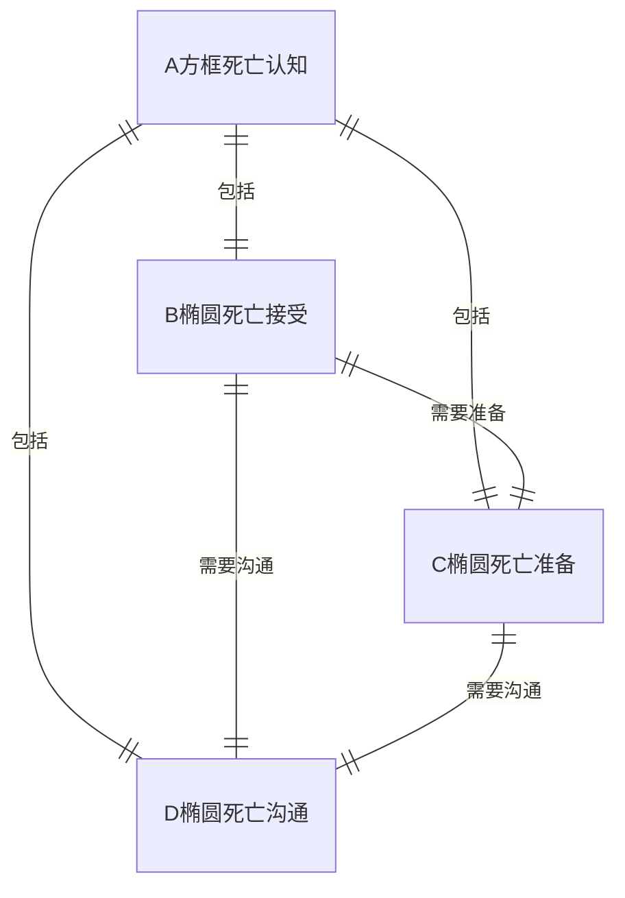

                 

### 死亡教育：正视生命有限性的重要性

> 关键词：死亡教育、生命有限性、社会认知、个体成长、理论框架、实践方法

> 摘要：本文深入探讨了死亡教育的重要性和其在现代社会中的应用。通过对核心概念的剖析、理论框架的构建以及实践方法的阐述，文章强调了正视生命有限性对于个体和社会的深远影响，为推动死亡教育的普及提供了理论依据和实践指导。

---

#### # 第一部分：背景介绍

#### 第1章：问题背景

### 1.1 核心概念

**死亡**：作为生命的终结，死亡是生物体的生命活动完全停止的状态。在生物学和哲学领域，死亡被视为生命过程中不可或缺的一部分，具有重要的生物学和心理学意义。

**教育**：教育是一种有目的、有计划、有组织的影响个体发展的活动，旨在培养个体的知识、技能、态度和价值观。教育的本质在于引导个体认知世界，实现自我成长和社会适应。

### 1.2 问题解决

当前，社会对死亡的认知和态度普遍存在一定程度的困惑和逃避。人们往往不愿意面对死亡的必然性和有限性，这在一定程度上影响了个体和社会的健康发展。因此，死亡教育作为一种新兴的教育模式，旨在帮助个体和社会正视生命的有限性，提高对死亡的认识和处理能力。

### 1.3 边界与外延

死亡教育不仅涉及生物学、医学、心理学等学科，还与哲学、宗教、文化等领域密切相关。其边界和外延涵盖了生命教育、健康教育、心理健康教育等多个方面。

### 1.4 概念结构与核心要素组成

死亡教育的概念结构包括以下几个方面：

- **教育目的**：提高个体对死亡的认知和接受能力，培养积极的生活态度和人生观。
- **教育内容**：涵盖生命起源、生命过程、生命终结以及与死亡相关的心理、社会和文化问题。
- **教育方法**：结合理论教学、实践体验、互动讨论等多种形式，提高教育的实效性。
- **教育对象**：适用于不同年龄、不同职业和社会背景的人群，特别是青少年、成年人和老年人。

#### 第2章：核心概念与联系

### 2.1 核心概念原理

死亡教育的核心概念包括死亡认知、死亡接受、死亡准备和死亡沟通等。这些概念相互关联，共同构成了死亡教育的理论基础。

- **死亡认知**：指个体对死亡的本质、过程和意义的理解和认识。
- **死亡接受**：指个体在心理上接受死亡的存在和不可避免性。
- **死亡准备**：指个体为应对死亡所做的心理和物质准备。
- **死亡沟通**：指个体与家人、朋友和专业人士就死亡问题进行有效沟通。

### 2.2 概念属性特征对比表格

| 概念       | 特征一             | 特征二             | 特征三             |
|------------|------------------|------------------|------------------|
| 死亡认知   | 对死亡的认识和理解  | 生物学角度         | 哲学角度          |
| 死亡接受   | 接受死亡的存在     | 心理准备           | 社会文化影响      |
| 死亡准备   | 为死亡做准备       | 心理建设           | 物质准备          |
| 死亡沟通   | 就死亡问题进行沟通  | 有效沟通技巧        | 情感表达和支持     |

### 2.3 ER实体关系图架构

#### # 第二部分：死亡教育的基本理论

#### 第3章：死亡教育的重要性

### 3.1 死亡教育的社会背景

随着社会的进步和医疗技术的提高，人们的生活质量和寿命得到了显著提高。然而，死亡问题并没有因此而消失，反而变得更加复杂和敏感。社会对死亡的认知和态度发生了变化，从传统的避讳和恐惧逐渐转变为正视和接受。这种转变为死亡教育的普及提供了社会背景。

### 3.2 死亡教育的核心价值

死亡教育的核心价值主要体现在以下几个方面：

- **个体成长**：通过死亡教育，个体能够更好地理解生命的有限性，培养积极的人生态度和价值观，提高心理素质和应对能力。
- **社会和谐**：死亡教育有助于缓解社会对死亡的恐慌和逃避，促进社会成员之间的理解和沟通，增强社会凝聚力。
- **心理健康**：面对死亡，个体常常会产生焦虑、恐惧等负面情绪。死亡教育可以帮助个体正视死亡，减轻心理负担，提高心理健康水平。
- **文化传承**：死亡教育是文化传承的重要组成部分。通过教育，个体能够更好地理解和尊重不同文化背景下的死亡观念和习俗，促进文化的多样性和发展。

### 3.3 死亡教育的现状分析

当前，死亡教育在不同国家和地区的发展程度存在较大差异。在一些发达国家，死亡教育已经得到了广泛推广和应用，成为教育体系的重要组成部分。而在一些发展中国家，死亡教育仍然处于起步阶段，面临着诸多挑战。

- **普及程度**：在发达国家，死亡教育已经纳入中小学课程，部分高校还设立了相关专业。而在发展中国家，死亡教育尚未得到足够重视，缺乏系统的教育体系和教材。
- **教育内容**：发达国家的死亡教育内容丰富多样，涵盖了生命教育、心理健康教育、伦理教育等多个方面。而发展中国家的死亡教育内容较为单一，主要集中在生物学和医学知识。
- **教育方法**：发达国家的死亡教育采用多种教学手段，如实践体验、互动讨论、心理辅导等。而发展中国家的死亡教育主要依靠理论教学，缺乏实践性和互动性。

#### 第4章：死亡教育的理论框架

### 4.1 死亡教育的理论基础

死亡教育的理论基础主要包括哲学、心理学、社会学和教育学等多个学科。其中，存在主义哲学、心理学理论和教育学理论对死亡教育具有重要的指导作用。

- **存在主义哲学**：存在主义哲学强调个体存在的意义和自由意志，认为个体应该主动面对死亡，寻找生命的价值和意义。
- **心理学理论**：心理学理论提供了关于死亡认知、死亡接受和死亡准备等方面的研究，为死亡教育提供了理论基础。
- **教育学理论**：教育学理论关注个体的认知发展、情感体验和社会适应，为死亡教育的设计和实施提供了指导。

### 4.2 死亡教育的目标与内容

死亡教育的目标主要包括以下几个方面：

- **提高个体对死亡的认知和接受能力**：通过教育，帮助个体正确理解死亡的本质和意义，培养积极的死亡态度。
- **培养个体的生命意识和价值观**：通过教育，引导个体认识到生命的有限性和珍贵性，培养对生命的尊重和珍惜。
- **提高个体的心理素质和应对能力**：通过教育，帮助个体学会应对死亡相关的负面情绪和心理压力，提高心理素质。

死亡教育的内容主要包括以下几个方面：

- **生命教育**：包括生命起源、生命过程和生命终结等方面的知识。
- **心理健康教育**：包括心理调适、心理辅导和心理咨询等方面的内容。
- **伦理教育**：包括死亡伦理、生命伦理和死亡礼仪等方面的知识。
- **社会文化教育**：包括不同文化背景下的死亡观念和习俗等方面的知识。

### 4.3 死亡教育的教学策略

死亡教育的教学策略主要包括以下几个方面：

- **理论教学**：通过讲解死亡教育的相关理论知识，帮助个体建立正确的死亡观念和价值观。
- **实践体验**：通过实践体验，如参观殡仪馆、参与死亡小组讨论等，帮助个体更好地理解死亡的本质和意义。
- **互动讨论**：通过互动讨论，如小组讨论、角色扮演等，促进个体之间的沟通和理解，提高教育的实效性。
- **心理辅导**：通过心理辅导，如心理咨询、心理治疗等，帮助个体应对死亡相关的负面情绪和心理压力。

#### 第5章：死亡教育的实践方法

### 5.1 家庭中的死亡教育

在家庭中开展死亡教育具有重要意义。家长可以通过以下几种方法对孩子进行死亡教育：

- **日常交流**：家长可以在日常生活中与孩子谈论死亡，如讲述祖辈的故事、讨论生命的意义等。
- **故事分享**：通过讲述关于死亡的故事，如童话、寓言等，帮助孩子理解死亡的本质和意义。
- **实践体验**：带孩子参观殡仪馆、墓地等场所，让孩子亲眼看到死亡的过程，帮助他们更好地理解死亡。
- **情感支持**：在家庭中营造温暖、开放的氛围，让孩子感受到家庭的支持和关爱，帮助他们应对死亡相关的负面情绪。

### 5.2 学校中的死亡教育

学校是开展死亡教育的重要场所。学校可以通过以下几种方法进行死亡教育：

- **课程设置**：将死亡教育纳入学校课程，设置专门的死亡教育课程，系统教授关于死亡的知识和技能。
- **活动组织**：组织死亡教育主题活动，如死亡小组讨论、死亡角色扮演等，增强学生的死亡意识和价值观。
- **心理辅导**：开展心理辅导活动，帮助学生应对死亡相关的负面情绪和心理压力，提高心理素质。
- **家校合作**：与家长密切合作，共同开展家庭和学校的死亡教育，形成教育合力。

### 5.3 社区中的死亡教育

社区是开展死亡教育的广阔舞台。社区可以通过以下几种方法进行死亡教育：

- **讲座和培训**：组织死亡教育讲座和培训，邀请专业人士分享死亡教育的知识和经验。
- **宣传和推广**：通过宣传和推广，提高社区居民对死亡教育的认识和重视，营造良好的社会氛围。
- **实践活动**：组织社区实践活动，如死亡冥想、死亡小组讨论等，增强居民的死亡意识和价值观。
- **服务和支持**：为社区居民提供死亡相关的心理支持和物质帮助，帮助他们更好地应对死亡。

#### 第6章：死亡教育的案例分析

### 6.1 成功案例分享

以下是一些成功的死亡教育案例：

- **案例一**：某高校开设了死亡教育课程，通过理论教学和实践体验相结合的方式，帮助学生树立正确的死亡观念和价值观。该课程受到了学生们的热烈欢迎，对他们的心理素质和生命意识产生了积极影响。
- **案例二**：某社区组织了死亡教育讲座和培训，邀请专业人士分享死亡教育的知识和经验。社区居民积极参与，提高了对死亡的认识和应对能力。
- **案例三**：某医院开展了死亡教育主题活动，通过死亡小组讨论、死亡角色扮演等方式，帮助医护人员更好地理解死亡和患者家属的需求，提高了医疗服务的质量。

### 6.2 失败案例反思

以下是一些失败的死亡教育案例及其原因：

- **案例一**：某学校开设了死亡教育课程，但缺乏有效的教学方法和实践体验，导致学生参与度低，教育效果不佳。原因在于课程设计和教学方法不合理，缺乏互动性和实践性。
- **案例二**：某社区举办了死亡教育讲座，但缺乏宣传和推广，导致参与人数少，教育效果有限。原因在于缺乏有效的宣传和推广，社区居民对死亡教育的认识和重视程度不高。
- **案例三**：某医院开展了死亡教育主题活动，但缺乏专业指导和支持，导致活动效果不佳。原因在于缺乏专业指导和支持，医护人员对死亡教育的知识和技能掌握不足。

#### 第7章：死亡教育的未来展望

### 7.1 死亡教育的创新趋势

随着科技的进步和社会的发展，死亡教育呈现出以下创新趋势：

- **数字化教育**：利用互联网和数字化技术，开展在线死亡教育课程和活动，提高教育的普及性和实效性。
- **个性化教育**：根据个体的需求和特点，设计个性化的死亡教育方案，提高教育的针对性和有效性。
- **跨学科教育**：结合生物学、医学、心理学、社会学等多学科知识，开展跨学科的死亡教育研究与实践，提高教育的综合性和深度。

### 7.2 死亡教育的挑战与机遇

死亡教育在未来的发展过程中面临着以下挑战和机遇：

- **挑战**：社会对死亡的避讳和恐惧仍然存在，死亡教育的普及和推广仍然面临困难。同时，教育资源的分配不均也制约了死亡教育的发展。
- **机遇**：随着社会对死亡的认知和态度逐渐改变，死亡教育得到了越来越多的关注和支持。同时，国家政策的支持和社会资本的投入也为死亡教育的发展提供了机遇。

### 7.3 死亡教育的可持续发展

为了实现死亡教育的可持续发展，需要采取以下措施：

- **政策支持**：制定相关政策，明确死亡教育的地位和职责，为死亡教育的发展提供政策保障。
- **教育改革**：推进教育改革，将死亡教育纳入教育体系，提高教育质量和实效性。
- **资源整合**：整合社会资源，包括政府、企业、社会组织等，共同推动死亡教育的发展。
- **国际合作**：加强国际交流与合作，借鉴国际先进经验，提高死亡教育的水平。

### 每章小结

- 第1章：深入探讨了死亡教育的重要性及其背景。
- 第2章：阐述了死亡教育的核心概念与联系。
- 第3章：分析了死亡教育在社会中的地位与价值。
- 第4章：构建了死亡教育的理论框架。
- 第5章：提出了具体的死亡教育实践方法。
- 第6章：通过案例分析，总结了死亡教育的经验和教训。
- 第7章：展望了死亡教育的未来发展。

---

## 作者信息

**作者：AI天才研究院/AI Genius Institute & 禅与计算机程序设计艺术 /Zen And The Art of Computer Programming**

