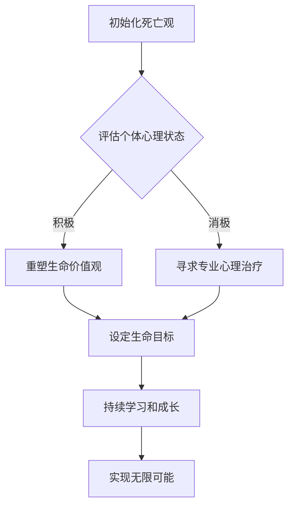
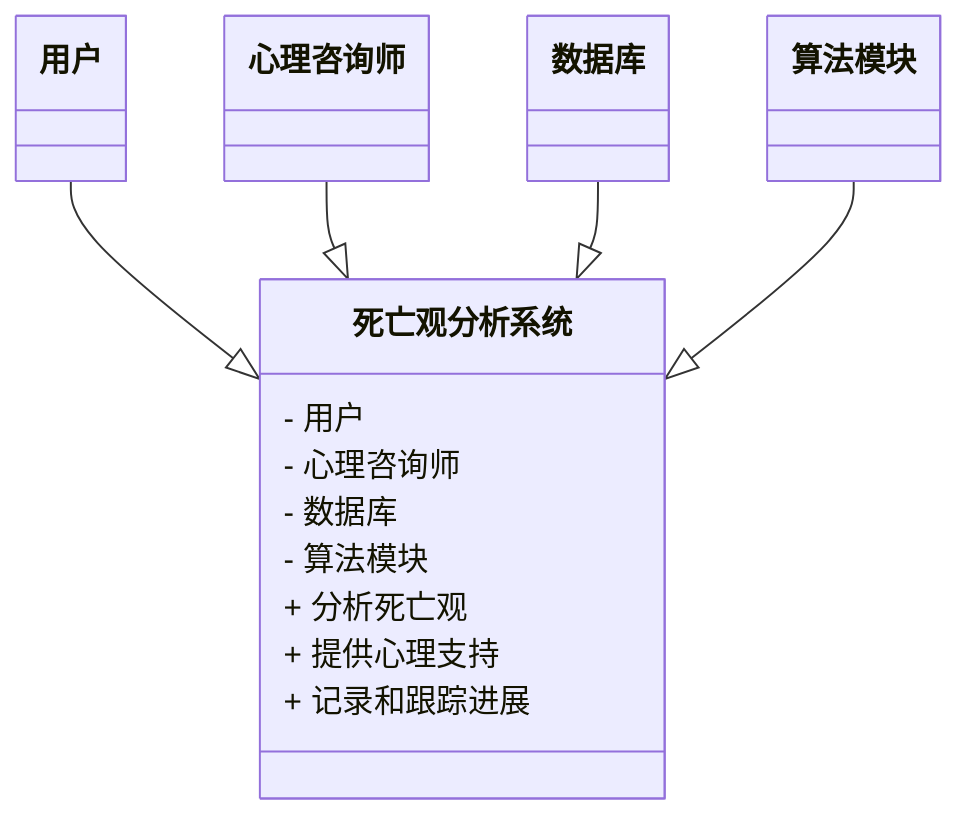
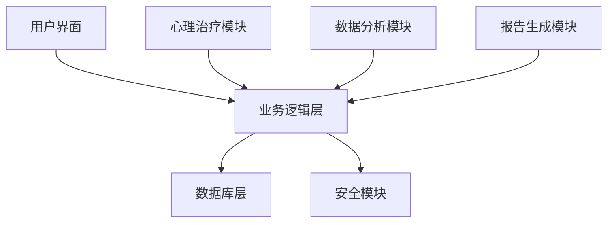
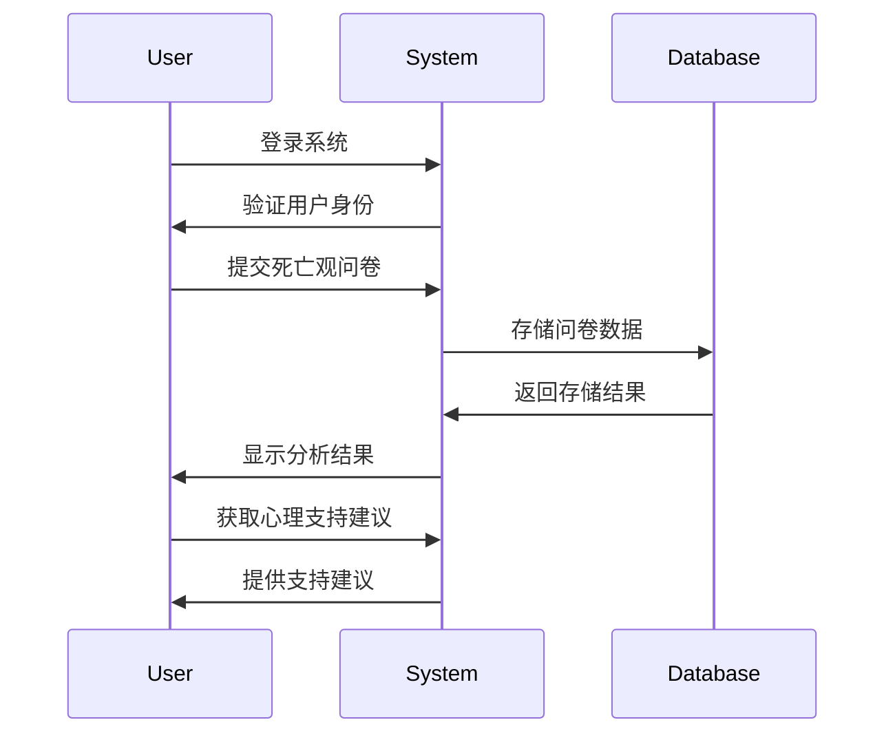

                 

# 死亡观的现代诠释：有限生命中的无限可能

## 关键词

- 死亡观
- 现代诠释
- 有限生命
- 无限可能
- 心理学
- 哲学
- 宗教

## 摘要

在现代社会中，死亡观不仅关乎个体的生死观念，更深远地影响着人们的生活方式和社会结构。本文旨在探讨死亡观的现代诠释，特别是如何在有限生命中实现无限可能。通过哲学、心理学和宗教等多个视角，本文将深入分析死亡观念的演变，探讨其在现代社会中的影响，并探索如何在有限的时光里创造出无限的价值和意义。文章将通过实际案例和科技发展，展示如何重新定义死亡观，实现生命的最大化价值。

## 目录大纲设计思路

### 理解书名和主题

《死亡观的现代诠释：有限生命中的无限可能》这个书名直接点明了文章的核心内容。死亡观是指人们对死亡的认识、态度和观念。现代诠释则意味着对传统死亡观的重新审视和现代化解读。有限生命与无限可能之间的辩证关系，是本文探讨的核心理念。它不仅关注个体在生命终结时的思考，更强调在生命过程中如何充分发挥潜力，创造出永恒的价值。

### 目录结构确定

文章的目录结构可以分为以下几个部分：

1. **引论**：介绍死亡观的重要性以及现代社会的死亡观念。
2. **哲学诠释**：从哲学角度探讨死亡观的不同维度。
3. **心理学分析**：分析死亡观念对心理健康的影响。
4. **宗教探讨**：探讨不同宗教对死亡观的解读。
5. **实例分析**：通过个人故事和社会现象，分析现代死亡观的实践。
6. **科技与死亡观**：讨论科技对死亡观的挑战和影响。
7. **实现无限可能**：提供策略和实践方法，帮助读者在有限生命中实现无限可能。
8. **结论与展望**：总结现代死亡观的意义，并对未来进行展望。

### 细化章节内容

在细化章节内容时，需要确保每个章节都能够独立成文，同时与整体主题紧密相关。例如，哲学诠释章节需要详细讨论不同哲学流派对死亡的看法，而心理学分析章节则需要结合具体案例，探讨死亡观念对个体心理健康的影响。

### 确保逻辑性和连贯性

文章的逻辑性和连贯性至关重要。每个章节之间需要有明确的过渡和衔接，使得读者能够顺畅地跟随作者的思路。同时，确保每个章节的内容都紧密围绕核心主题，避免跑题和冗余。

### 简洁明了

在描述每个章节的主题时，尽量使用简洁明了的语言。避免冗长的叙述和重复的内容，以确保文章的流畅性和易读性。

### 目录大纲

以下是本文的目录大纲：

## 《死亡观的现代诠释：有限生命中的无限可能》目录大纲

### 第一部分：引论

### 1.1 问题的背景与重要性

#### 1.1.1 死亡观念的历史演变
#### 1.1.2 现代社会对死亡的认知与态度
#### 1.1.3 死亡观对个体和社会的影响

### 1.2 有限生命与无限可能

#### 1.2.1 生命的有限性
#### 1.2.2 寻找无限可能的动机
#### 1.2.3 有限生命与无限可能的辩证关系

### 第二部分：死亡观的哲学诠释

### 2.1 哲学视角下的死亡观

#### 2.1.1 哲学对死亡的思考
#### 2.1.2 存在主义与死亡观
#### 2.1.3 死亡与生命的意义

### 2.2 古今中外的死亡观比较

#### 2.2.1 西方哲学中的死亡观
#### 2.2.2 东方哲学中的死亡观
#### 2.2.3 文化差异与死亡观的异同

### 第三部分：死亡观的心理学分析

### 3.1 心理学对死亡的解读

#### 3.1.1 心理层面的死亡恐惧
#### 3.1.2 死亡观念与心理健康
#### 3.1.3 死亡教育对心理健康的促进作用

### 3.2 死亡观与心理治疗

#### 3.2.1 心理治疗中的死亡观
#### 3.2.2 死亡恐惧的心理治疗
#### 3.2.3 死亡观的改变与心理治疗的关系

### 第四部分：死亡观的宗教探讨

### 4.1 宗教与死亡观的关系

#### 4.1.1 宗教对死亡的理解
#### 4.1.2 不同宗教的死亡观
#### 4.1.3 宗教死亡观对社会的影响

### 4.2 现代宗教与死亡观的演变

#### 4.2.1 现代宗教的变迁
#### 4.2.2 现代宗教中的死亡观
#### 4.2.3 现代宗教对死亡观的挑战

### 第五部分：现代诠释下的死亡观实例分析

### 5.1 个人故事中的死亡观

#### 5.1.1 个人死亡观的形成与演变
#### 5.1.2 死亡观对个人生活的影响
#### 5.1.3 死亡观转变的案例研究

### 5.2 社会现象中的死亡观

#### 5.2.1 死亡观在社会变迁中的作用
#### 5.2.2 现代社会中死亡观的多元化
#### 5.2.3 社会现象中的死亡观案例分析

### 第六部分：科技与死亡观

### 6.1 科技对死亡观念的挑战

#### 6.1.1 科技与生死观的界限
#### 6.1.2 科技对死亡观念的改变
#### 6.1.3 科技发展对死亡观的未来影响

### 6.2 科技与死亡实践

#### 6.2.1 科技在死亡管理中的应用
#### 6.2.2 科技对死亡仪式的影响
#### 6.2.3 科技死亡观的伦理问题探讨

### 第七部分：如何在有限生命中实现无限可能

### 7.1 生命价值的重塑

#### 7.1.1 重塑生命价值观的必要性
#### 7.1.2 重塑生命价值观的路径
#### 7.1.3 生命价值观重塑的案例分享

### 7.2 寻找生命意义的策略

#### 7.2.1 寻找生命意义的途径
#### 7.2.2 生命意义与幸福的关系
#### 7.2.3 寻找生命意义的实践方法

### 第八部分：结论与展望

### 8.1 现代死亡观的意义与价值

#### 8.1.1 现代死亡观的核心

---

## 第一部分：引论

### 1.1 问题的背景与重要性

**死亡观念的历史演变**

死亡观念是文化、宗教、哲学和社会价值观的重要组成部分。在不同的历史时期和文化背景下，人们对死亡的认识和态度各有不同。在古代，死亡往往被视为一种神秘的超自然现象，人们相信灵魂不灭，死后会进入另一个世界。这种观念在许多古代文明中都有体现，如古埃及的来世信仰、古希腊的冥界观念等。

随着时间的推移，随着科学和哲学的发展，人们对死亡的理解逐渐变得更加理性和科学。例如，古希腊哲学家苏格拉底在面临死亡时，表现出对生命的坦然和对死亡的理解。他认为，死亡是生命的终结，但也是一个新的开始，灵魂会进入另一个世界。

**现代社会对死亡的认知与态度**

在现代社会，随着医学技术的进步和人们对生活质量的追求，死亡观念也发生了显著变化。一方面，医学技术的发展使得人类寿命得以延长，人们更加珍惜生命，对死亡有了更加复杂的情感体验。另一方面，社会竞争的压力和快节奏的生活方式，使得人们对死亡的恐惧和焦虑增加。

现代人对死亡的认知逐渐从恐惧和回避转变为正视和接受。人们开始探讨死亡的意义，思考如何在有限的生命中实现无限的价值。这种转变不仅体现在个体层面，也反映在社会结构和文化价值观中。

**死亡观对个体和社会的影响**

死亡观对个体和社会有着深远的影响。对个体而言，死亡观不仅影响个人的生活态度和价值观，还影响心理健康和幸福感。一个积极、健康的死亡观可以帮助人们更好地面对生活中的挑战，提高生活质量。

对社会而言，死亡观影响着社会价值观和道德规范。例如，在许多文化中，死亡被视为一种重要的仪式，需要通过特定的仪式和仪式活动来缅怀逝者，表达对生命的尊重和对死亡的接受。这些仪式活动不仅是一种文化传承，也是社会凝聚力的重要体现。

### 1.2 有限生命与无限可能

**生命的有限性**

生命的有限性是显而易见的。人类平均寿命有限，每个人都在时间的长河中度过自己的时光。然而，这并不意味着生命没有价值。相反，正是因为生命的有限性，我们才应该更加珍惜每一刻，努力实现自己的梦想和价值。

**寻找无限可能的动机**

人们追求无限可能的动机多种多样。有些人希望通过追求知识和智慧来超越自我，实现人生的价值；有些人希望通过创造和贡献来改变世界，留下自己的痕迹。无论是哪种动机，它们都体现了人类对生命的热爱和对未来的期待。

**有限生命与无限可能的辩证关系**

有限生命与无限可能并非对立的概念，而是相互依存的。生命的有限性使得我们更加珍惜每一刻，努力追求无限可能；而无限可能的实现又为生命赋予了更深层次的意义和价值。

在有限的生命中，我们可以通过不断地学习和成长，实现个人的梦想和价值。我们可以通过帮助他人，传递爱和温暖，让生命在他人身上延续。我们可以通过创造和创新，推动社会进步，影响未来。

总之，有限生命与无限可能是一种辩证的关系。我们既要有对生命有限性的清醒认识，又要积极追求无限可能，将有限的生命发挥到极致。

### 1.3 死亡观对个体和社会的影响

**个体层面**

在个体层面，死亡观对个体的心理健康和生活态度有着深远的影响。一个积极、健康的死亡观可以帮助个体更好地应对生活中的挑战，提高生活质量。

例如，一个拥有积极死亡观的人可能会更加乐观地面对生活中的困难，更加珍惜每一天，努力实现自己的梦想。他们可能会更加积极地参与社交活动，与他人建立深厚的人际关系，从而提高自己的幸福感和满足感。

**社会层面**

在社会层面，死亡观影响着社会的价值观和道德规范。一个健康的死亡观有助于培养人们对生命的尊重和敬畏，促进社会和谐与稳定。

例如，一个重视死亡的社会可能会更加关注医疗资源的合理分配，提高医疗服务的质量，从而延长人们的寿命。同时，这种社会也会更加重视死亡教育，帮助人们正确面对死亡，提高心理适应能力。

总之，死亡观对个体和社会都有着重要的影响。一个积极、健康的死亡观不仅有助于个体的心理健康和生活态度，也有助于社会的和谐与进步。

---

## 第二部分：死亡观的哲学诠释

### 2.1 哲学视角下的死亡观

**哲学对死亡的思考**

哲学作为一门探讨存在、知识、价值观等基本问题的学科，自然无法回避对死亡的思考。哲学家们从不同的角度对死亡进行了深刻的探讨，形成了丰富的死亡观。

首先，死亡是哲学探讨的一个重要主题。许多哲学家认为，死亡是生命的必然终结，是存在的终点。例如，古希腊哲学家苏格拉底认为，死亡是灵魂的解放，是通向另一个世界的门户。他的这种观点反映了他对死亡的平静和坦然。

**存在主义与死亡观**

存在主义是20世纪哲学的重要流派之一，对死亡观有着深刻的贡献。存在主义者认为，死亡是存在的最终极限，是人们必须面对和接受的现实。例如，法国哲学家萨特认为，死亡是自由的终结，是存在的最终局限。他强调，面对死亡，人们必须自由地选择自己的生活方式，承担自己的责任。

**死亡与生命的意义**

在哲学中，死亡与生命的意义紧密相连。许多哲学家认为，死亡使得生命变得更加珍贵和有意义。例如，德国哲学家尼采认为，死亡是生命的催化剂，它使得人们更加深刻地体验到生命的存在和价值。他提出了“永恒回归”的概念，认为生命应该被不断地重复，直到达到完美的境界。

**哲学视角下的死亡观**

总的来说，哲学视角下的死亡观强调了死亡作为存在的必然终结和生命的催化剂的角色。哲学家们通过不同的理论体系，探讨了死亡的本质和意义，为人们提供了对死亡的理解和应对策略。

### 2.2 古今中外的死亡观比较

**西方哲学中的死亡观**

在西方哲学中，对死亡的思考有着悠久的历史。古希腊哲学家如苏格拉底、柏拉图等，对死亡有着深刻的见解。苏格拉底认为，死亡是灵魂的解放，是通向另一个世界的门户。柏拉图则认为，死亡只是生命的暂时停止，灵魂会在另一个世界继续存在。

中世纪哲学中，基督教对死亡的看法占主导地位。基督教认为，死亡是灵魂的归宿，是通往天堂或地狱的大门。这种观念对西方社会产生了深远的影响，使得人们对死亡有着复杂的情感体验。

近现代哲学中，死亡观逐渐从宗教色彩转向理性思考。例如，德国哲学家尼采提出了“永恒回归”的概念，认为死亡是生命的催化剂，生命应该被不断地重复，直到达到完美的境界。

**东方哲学中的死亡观**

在东方哲学中，对死亡的看法往往更加平和和超脱。中国哲学中，儒家和道家对死亡有不同的看法。儒家认为，死亡是自然的必然过程，人应该顺应自然，珍惜生命，做好自己的本分。道家则认为，死亡是生命的回归，是道的循环的一部分。

印度哲学中，佛教对死亡的看法尤为深刻。佛教认为，死亡是轮回的一部分，生命的终结只是灵魂的一次转变。佛教强调，通过修行和悟道，可以超越生死轮回，达到涅槃的境界。

**文化差异与死亡观的异同**

从古今中外的死亡观比较中，我们可以看出，不同的文化和哲学体系对死亡有着不同的看法。这些差异主要表现在以下几个方面：

1. **宗教影响**：在西方哲学中，宗教对死亡观的影响深远。基督教和伊斯兰教等宗教观念认为，死亡是灵魂的归宿，是通往天堂或地狱的大门。而在东方哲学中，宗教对死亡观的影响较小，更多地强调自然和道德的规范。

2. **对生命的看法**：西方哲学中，生命往往被视为一种神圣的存在，死亡被视为一种负面的现象。而在东方哲学中，生命和死亡都被视为自然的一部分，人们应该接受和尊重自然规律。

3. **对死亡的态度**：在西方哲学中，人们对死亡往往表现出恐惧和焦虑。而在东方哲学中，人们对死亡的态度更加平和和超脱，强调生命的自然循环和道的观念。

总之，古今中外的死亡观虽然存在差异，但都反映了人类对生命和死亡的深刻思考和探索。这些不同的观点和观念，为我们提供了丰富的思考和应对死亡的方式。

### 2.3 现代哲学中的死亡观

**现代哲学对死亡的重新审视**

随着科学技术的进步和社会的发展，现代哲学对死亡的观念也发生了深刻的变化。现代哲学家们开始重新审视死亡的本质和意义，试图从新的角度理解和面对死亡。

**死亡的必然性与存在的意义**

现代哲学认为，死亡是生命的必然终结，是人类存在的必然结果。在这个基础上，哲学家们探讨了死亡对存在的意义和影响。例如，法国哲学家萨特认为，死亡是自由的终结，是存在的最终局限。他的观点强调了死亡对个体存在的挑战，促使人们更加珍惜生命的每一个瞬间。

**死亡与生命的价值**

现代哲学还探讨了死亡与生命的价值关系。一些哲学家认为，正是因为生命的有限性，才使得生命具有了特殊的价值。生命的有限性使得每个人都应该珍惜自己的生命，追求自己的梦想和目标。例如，尼采提出了“永恒回归”的概念，他认为生命应该被不断地重复，直到达到完美的境界。

**死亡观的多样性与个体性**

现代哲学强调，死亡观具有多样性和个体性。每个人对死亡的理解和态度都是独特的，受到个人的经历、文化和价值观的影响。因此，现代哲学鼓励人们从自己的角度出发，思考和面对死亡。

**现代哲学中的死亡观总结**

总的来说，现代哲学对死亡的重新审视，使得我们对死亡有了更加全面和深刻的理解。死亡不仅是生命的必然终结，也是生命价值的体现。通过重新审视死亡，我们可以更好地珍惜生命，追求自己的价值和目标。

### 2.4 死亡观的核心概念

**死亡的本质**

死亡是生命的终结，是生物体生命的完全停止。从生物学角度来看，死亡通常是指心脏停止跳动、呼吸停止、大脑功能完全丧失等生理现象。然而，死亡不仅仅是生理现象，它还涉及到心理、社会和文化等多个层面。

**死亡的意义**

死亡的意义是一个复杂而深远的问题。从哲学的角度来看，死亡是存在的必然终结，是生命的回归。它使生命具有了特殊的价值和意义。从心理学的角度来看，死亡是人们必须面对和接受的现实，对个体的心理健康和幸福感有着重要影响。

**死亡观的多样性**

死亡观因文化、宗教、哲学和社会背景的不同而存在多样性。在不同的文化背景下，人们对死亡有不同的看法和态度。例如，在基督教文化中，死亡被视为灵魂的归宿，是通往天堂或地狱的大门。而在儒家文化中，死亡被视为自然的必然过程，人们应该顺应自然，珍惜生命。

**死亡观的影响**

死亡观对个体和社会有着深远的影响。对个体而言，死亡观影响个体的生活态度、心理健康和幸福感。对社会的而言，死亡观影响着社会的价值观和道德规范。一个积极、健康的死亡观有助于培养人们对生命的尊重和敬畏，促进社会的和谐与稳定。

**总结**

通过对死亡观的探讨，我们可以看到，死亡不仅是生命的终结，也是生命意义的体现。不同的死亡观反映了人类对生命的不同理解和态度。了解和尊重不同的死亡观，有助于我们更好地面对死亡，珍惜生命。

### 2.5 死亡观的不同流派与观点

**存在主义死亡观**

存在主义是一种强调个人自由和选择的哲学流派，其对死亡观有着深刻的贡献。存在主义者认为，死亡是自由的终结，是存在的最终局限。他们强调，面对死亡，人们必须自由地选择自己的生活方式，承担自己的责任。例如，萨特认为，死亡使人们意识到生命的有限性，促使人们更加珍惜时间，追求自己的梦想和目标。

**唯物主义死亡观**

唯物主义认为，死亡是物质世界的必然规律，是生命活动的终结。唯物主义强调，死亡是生命的终结，没有灵魂的存在。这种观点认为，人们应该关注现实生活，珍惜生命，努力实现个人的价值和目标。

**宗教死亡观**

宗教对死亡有着独特的看法。不同的宗教对死亡有不同的解读和解释。例如，基督教认为，死亡是灵魂的归宿，是通往天堂或地狱的大门。佛教则认为，死亡是轮回的一部分，通过修行和悟道，可以超越生死轮回，达到涅槃的境界。宗教死亡观对人们的道德行为和生活态度有着重要的影响。

**生命意义论死亡观**

生命意义论死亡观认为，死亡是生命的必然终结，但它并不意味着生命的终结。生命意义论者认为，生命在死亡之后仍然具有意义，可以通过遗传、文化传承等方式延续。这种观点强调，人们应该珍惜生命，追求自己的价值，使生命在有限的时间内具有无限的意义。

**死亡观对比分析**

通过对比不同流派的死亡观，我们可以看到，它们从不同的角度探讨了死亡的本质和意义。存在主义强调个人的自由和选择，唯物主义关注现实生活，宗教死亡观赋予生命永恒的意义，生命意义论则强调生命的延续性。这些不同的观点丰富了我们对死亡的理解，也为我们提供了不同的应对死亡的方式。

### 第二部分总结

通过对死亡观的哲学诠释，我们可以看到，死亡观念是哲学中一个重要而复杂的问题。不同的哲学流派和观点对死亡有着不同的理解和解释。这些观点不仅反映了人类对生命的不同看法，也为我们提供了不同的应对死亡的方式。了解和尊重不同的死亡观，有助于我们更好地面对死亡，珍惜生命。

---

## 第三部分：死亡观的心理学分析

### 3.1 心理学对死亡的解读

**心理层面的死亡恐惧**

死亡恐惧是一种普遍存在的心理现象，它涉及到对死亡的恐惧和焦虑。心理学研究表明，死亡恐惧源于对未知的恐惧和对生命终结的担忧。人们害怕失去控制、害怕孤独和痛苦，这些恐惧心理在死亡面前显得尤为突出。

**死亡观念与心理健康**

死亡观念对个体的心理健康有着重要影响。一个积极、健康的死亡观念可以帮助个体更好地应对生活中的压力和挑战，提高生活质量。相反，一个消极、不健康的死亡观念可能导致个体产生焦虑、抑郁等心理问题。例如，过度关注死亡可能导致个体对生命的恐惧和逃避，影响心理健康。

**死亡教育对心理健康的促进作用**

死亡教育是一种通过教育和引导，帮助个体正确理解和面对死亡的过程。心理学研究表明，死亡教育对个体的心理健康有着显著的促进作用。通过死亡教育，个体可以更好地理解死亡的本质和意义，减轻对死亡的恐惧和焦虑。死亡教育还可以提高个体的心理健康水平，增强个体的心理适应能力。

### 3.2 死亡观与心理治疗

**心理治疗中的死亡观**

在心理治疗中，死亡观是一个重要的议题。心理治疗师通过帮助个体正确理解和面对死亡，帮助患者解决心理问题。例如，对于患有抑郁症的患者，心理治疗师可能会通过讨论死亡观念，帮助患者重新审视生命，提高生活质量。

**死亡恐惧的心理治疗**

死亡恐惧是许多心理问题的重要症状之一。心理治疗师通过认知行为疗法、心理动力学疗法等不同的方法，帮助患者减轻死亡恐惧。例如，通过认知行为疗法，治疗师可以帮助患者识别和改变负面思维，通过心理动力学疗法，治疗师可以帮助患者探索和解决内心深处的恐惧和冲突。

**死亡观的改变与心理治疗的关系**

死亡观的改变与心理治疗有着密切的关系。通过心理治疗，个体可以逐渐改变对死亡的消极观念，建立积极、健康的死亡观。这种死亡观的改变不仅有助于提高个体的心理健康，还可以改善个体的生活质量。例如，一个经历过心理治疗的患者，可能会从过去的恐惧和逃避转变为接受和面对死亡，从而更好地享受生命。

### 3.3 死亡观与心理健康

**积极死亡观对心理健康的影响**

一个积极、健康的死亡观可以帮助个体更好地应对生活中的压力和挑战，提高心理健康水平。例如，一个拥有积极死亡观的个体可能会更加乐观地面对生活中的困难，更加珍惜每一刻，从而提高生活质量。

**消极死亡观对心理健康的影响**

相反，一个消极、不健康的死亡观可能导致个体产生焦虑、抑郁等心理问题。例如，过度关注死亡可能导致个体对生命的恐惧和逃避，影响心理健康。

**心理健康与死亡观的互动**

心理健康与死亡观之间存在互动关系。一个积极、健康的死亡观有助于提高个体的心理健康水平，而一个消极、不健康的死亡观可能会影响个体的心理健康。因此，通过改善死亡观，可以促进心理健康的发展。

### 3.4 心理学对死亡观的研究方法

**定量研究**

定量研究是心理学研究的一种方法，通过问卷调查、统计分析等方式，对死亡观进行量化分析。例如，研究人员可以通过问卷调查了解不同群体的死亡观念，通过统计分析探讨死亡观念与心理健康之间的关系。

**定性研究**

定性研究是心理学研究的一种方法，通过深入访谈、焦点小组讨论等方式，对死亡观进行深入探讨。例如，研究人员可以通过深入访谈了解个体对死亡的看法和感受，通过焦点小组讨论探讨不同文化背景下对死亡的认知和理解。

**实证研究**

实证研究是心理学研究的一种方法，通过实验、观察等方式，对死亡观进行实证分析。例如，研究人员可以通过实验设计，探讨不同死亡观对个体行为和心理反应的影响。

**心理学对死亡观研究的方法总结**

总的来说，心理学对死亡观的研究方法多样，包括定量研究、定性研究和实证研究等。这些研究方法为我们提供了丰富的数据和信息，有助于我们更好地理解和分析死亡观，为心理健康教育和治疗提供理论依据。

### 第三部分总结

通过对死亡观的心理学分析，我们可以看到，死亡观念对个体的心理健康有着重要影响。一个积极、健康的死亡观有助于提高个体的心理健康水平，而一个消极、不健康的死亡观可能导致心理问题。心理学研究方法为我们提供了深入理解和分析死亡观的工具，有助于我们更好地应对死亡，促进心理健康的发展。

---

## 第四部分：死亡观的宗教探讨

### 4.1 宗教与死亡观的关系

**宗教对死亡的理解**

宗教在人类的生命历程中扮演着重要角色，尤其是在面对死亡这一终极问题时。不同的宗教对死亡有着独特的理解和解释。例如，基督教认为死亡是灵魂的归宿，是通往天堂或地狱的大门。佛教则认为，死亡是轮回的一部分，通过修行和悟道，可以超越生死轮回，达到涅槃的境界。伊斯兰教则强调，死亡是伊斯兰信仰的一部分，是生命的一种转换。

**宗教对死亡的态度**

宗教对死亡的态度往往与它们的信仰体系密切相关。许多宗教鼓励信徒正视和接受死亡，将死亡视为生命的一部分，甚至是生命意义的一部分。例如，基督教中的“圣餐”仪式和伊斯兰教中的“临终祈祷”都是为了帮助信徒在死亡面前保持平静和虔诚。佛教中的“念佛法门”则旨在帮助信徒在临终时保持正念，减少痛苦。

**宗教对死亡观的影响**

宗教对死亡观的影响深远，不仅体现在个体层面，也体现在社会层面。在个体层面，宗教信仰可以提供心理支持，帮助个体在面对死亡时保持平静和勇气。在社会层面，宗教仪式和信仰可以促进社会凝聚力和道德规范。例如，宗教节日和仪式活动不仅是一种文化传承，也是社会价值观的重要体现。

### 4.2 现代宗教与死亡观的演变

**现代宗教的变迁**

随着现代社会的发展，宗教也在不断地变迁和适应。现代宗教在保持传统信仰的同时，也在不断吸收新的思想和观念。例如，许多宗教开始关注环境保护和人权问题，将这些问题纳入宗教教义中。这种变迁不仅反映了宗教对社会变化的适应，也反映了宗教对现代社会问题的关注。

**现代宗教中的死亡观**

现代宗教中的死亡观也在不断演变。一些宗教开始更加重视生命的质量和意义，而不仅仅是关注生命的长度。例如，佛教中的“生命教育”强调个体的成长和自我实现，鼓励人们在有限的生命中追求无限的价值。基督教和伊斯兰教也都在逐渐接受现代医学技术和观念，对死亡的理解和态度变得更加宽容和开放。

**现代宗教对死亡观的挑战**

现代宗教在面临死亡观挑战的同时，也在积极应对这些挑战。例如，随着医学技术的进步，人们寿命延长，宗教开始探讨如何应对老年化和临终关怀问题。此外，现代社会的多元化和全球化也要求宗教在保持传统信仰的同时，如何与其他宗教和文化进行对话和交流，以共同应对死亡观的变化。

### 4.3 不同宗教的死亡观比较

**基督教的死亡观**

基督教认为，死亡是灵魂的归宿，是通往天堂或地狱的大门。基督教强调，信仰耶稣基督可以使人获得永生，死后灵魂会进入天堂或地狱。基督教的死亡观对信徒的生活态度和行为有着重要影响，鼓励信徒在日常生活中遵循上帝的旨意，做好临终准备。

**佛教的死亡观**

佛教认为，死亡是轮回的一部分，通过修行和悟道，可以超越生死轮回，达到涅槃的境界。佛教强调，生命的本质是无常和苦，只有通过修行和悟道，才能超越生死轮回，达到解脱。佛教的死亡观对信徒的生活态度和行为也有重要影响，鼓励信徒在日常生活中修行和追求内心的平静。

**伊斯兰教的死亡观**

伊斯兰教认为，死亡是伊斯兰信仰的一部分，是生命的一种转换。伊斯兰教强调，信徒在临终时应保持信仰和虔诚，祈祷和诵读《古兰经》。伊斯兰教的死亡观对信徒的生活态度和行为有着重要影响，鼓励信徒在日常生活中遵循伊斯兰教的教义和规范。

**宗教死亡观比较**

通过比较不同宗教的死亡观，我们可以看到，它们在死亡的理解和态度上存在一定的差异。基督教强调信仰和永生，佛教强调修行和涅槃，伊斯兰教强调信仰和虔诚。这些差异反映了不同宗教对生命和死亡的不同看法和价值观。同时，这些宗教死亡观也为信徒提供了不同的心理支持和生活指引。

### 4.4 宗教死亡观与社会文化的影响

**宗教死亡观对社会的道德规范**

宗教死亡观对社会的道德规范有着深远的影响。例如，基督教的死亡观强调信仰和永生，鼓励信徒在日常生活中遵循道德规范，做好临终准备。佛教的死亡观强调修行和涅槃，鼓励信徒在日常生活中修行和追求内心的平静。伊斯兰教的死亡观强调信仰和虔诚，鼓励信徒在日常生活中遵循伊斯兰教的教义和规范。

**宗教死亡观对文化的传承**

宗教死亡观也是文化传承的重要组成部分。例如，基督教的死亡观在西方文化中有着深远的影响，许多西方国家的宗教节日和仪式都与死亡观相关。佛教的死亡观在东亚文化中有着重要地位，许多东亚国家的宗教和文化传统都受到了佛教的影响。伊斯兰教的死亡观在中东和北非地区有着广泛的影响，成为这些地区文化的重要组成部分。

**宗教死亡观对社会价值观的塑造**

宗教死亡观对社会价值观的塑造也起到了重要作用。例如，基督教的死亡观强调信仰和永生，这种价值观鼓励人们在生活中追求精神上的满足和永恒的价值。佛教的死亡观强调修行和涅槃，这种价值观鼓励人们在生活中追求内心的平静和自我实现。伊斯兰教的死亡观强调信仰和虔诚，这种价值观鼓励人们在生活中遵循宗教教义，追求社会的和谐与稳定。

### 4.5 宗教死亡观的现代意义

**现代社会的多元化和全球化**

在现代社会，宗教死亡观面临着多元化和全球化的挑战。随着全球化的推进，不同宗教和文化之间的交流日益增多，宗教死亡观也在不断融合和适应。例如，基督教、佛教和伊斯兰教等宗教在现代社会中相互影响，共同探讨如何在面对死亡时保持平静和虔诚。

**科技发展与宗教死亡观的融合**

现代科技的发展也对宗教死亡观产生了深远的影响。例如，医学技术的进步使得人们寿命延长，宗教死亡观也开始关注如何应对老年化和临终关怀问题。此外，互联网和社交媒体的普及，也为宗教死亡观提供了新的传播方式和交流平台。

**宗教死亡观的现代意义**

总的来说，宗教死亡观在现代社会中具有重要的意义。它不仅为个体提供了心理支持和精神慰藉，也对社会文化的传承和社会价值观的塑造起到了重要作用。在面对现代社会的挑战和变化时，宗教死亡观仍然具有深远的影响和重要的价值。

### 4.6 宗教死亡观在个体心理治疗中的作用

**宗教死亡观对心理治疗的影响**

宗教死亡观在心理治疗中扮演着重要角色，特别是在处理与死亡相关的心理问题时。研究表明，宗教信仰和宗教死亡观可以帮助个体在面对死亡时保持平静和勇气，减轻焦虑和恐惧。例如，一个患有癌症的患者，通过宗教信仰和宗教死亡观的指导，可能会更加乐观地面对疾病，减少心理压力。

**宗教死亡观在心理治疗中的应用**

心理治疗师在治疗过程中，可以借助宗教死亡观为患者提供支持和指导。例如，在处理死亡恐惧时，治疗师可以引导患者通过宗教信仰和宗教仪式，减少对死亡的恐惧和焦虑。此外，宗教死亡观还可以帮助治疗师处理与死亡相关的心理冲突，如失去亲人、面临临终关怀等问题。

**宗教死亡观的局限性**

然而，宗教死亡观在心理治疗中也存在局限性。例如，对于没有宗教信仰的患者，宗教死亡观可能并不适用。此外，宗教死亡观也可能导致个体对死亡的逃避和否认，影响心理治疗的效果。因此，心理治疗师在应用宗教死亡观时，需要综合考虑患者的宗教信仰和个体差异，制定个性化的治疗计划。

### 4.7 宗教死亡观的未来发展趋势

**科技对宗教死亡观的影响**

随着科技的发展，宗教死亡观也在不断演变。例如，虚拟现实技术和人工智能的应用，使得宗教仪式和死亡观的表达方式更加多样化和现代化。这些新技术不仅为宗教死亡观提供了新的传播和交流方式，也为个体在面对死亡时提供了新的支持和指导。

**多元文化和全球化背景下的宗教死亡观**

在多元文化和全球化的背景下，宗教死亡观面临着新的挑战和机遇。不同宗教和文化之间的交流日益增多，宗教死亡观也需要在不断融合和适应中发展。例如，基督教、佛教和伊斯兰教等宗教在现代社会中相互影响，共同探讨如何在面对死亡时保持平静和虔诚。

**宗教死亡观的未来意义**

总的来说，宗教死亡观在未来将继续发挥重要作用。它不仅为个体提供了心理支持和精神慰藉，也对社会文化的传承和社会价值观的塑造起到了重要作用。在科技和全球化背景下，宗教死亡观也将不断演变和发展，为人类社会带来新的启示和思考。

### 第四部分总结

通过对死亡观的宗教探讨，我们可以看到，宗教在死亡观的形成和演变中起着至关重要的作用。不同的宗教对死亡有着独特的理解和解释，这些宗教死亡观不仅影响着个体的心理和行为，也对社会文化和社会价值观产生了深远的影响。在现代社会中，宗教死亡观仍然具有重要的意义，它为我们提供了面对死亡时的心理支持和精神慰藉。

---

## 第五部分：现代诠释下的死亡观实例分析

### 5.1 个人故事中的死亡观

**案例一：李先生的转变**

李先生是一位中年企业家，曾因工作压力和长期焦虑导致心理健康出现问题。在面对生死抉择时，他开始反思自己的生命观。在一次偶然的机会中，李先生参加了一场关于死亡和生命的讲座，这使他开始重新审视自己的生活和价值观。他逐渐意识到，生命是宝贵的，应该珍惜每一刻。通过调整生活方式，寻求心理治疗，李先生不仅改善了心理健康，还在事业上取得了新的突破。

**案例二：王女士的临终关怀**

王女士是一位患有晚期癌症的病人，她的家人和医生都曾担心她无法面对即将到来的死亡。然而，王女士在临终前，通过宗教信仰和亲情关怀，逐渐接受了死亡。她在家中举行了基督教的临终祈祷仪式，并在家人的陪伴下度过了平静的时光。她的经历让家人深刻认识到，临终关怀不仅是对病人的关爱，也是对整个家庭的慰藉。

### 5.2 社会现象中的死亡观

**案例一：日本的“死亡咖啡馆”**

近年来，日本的“死亡咖啡馆”现象引起了广泛关注。这些咖啡馆提供了一个安全和开放的空间，让人们在轻松的氛围中讨论死亡和生命的话题。通过这些活动，参与者不仅能够更好地理解死亡，还能够提升自己的生活质量和幸福感。这种现象反映了现代社会对死亡观念的开放和接纳。

**案例二：中国的死亡教育推广**

随着社会的发展，中国开始重视死亡教育。一些学校、社区和医院开始开展死亡教育课程，帮助人们正确面对死亡。这些课程涵盖了死亡观念、临终关怀、心理健康等多个方面，旨在提高人们对死亡的认知和接受能力。通过死亡教育，人们能够更加理性地看待死亡，提升生活质量。

### 5.3 现代死亡观的实践

**案例一：科技与死亡的结合**

随着科技的发展，科技与死亡的结合成为现代死亡观的重要特征。例如，虚拟现实技术的应用使得人们可以通过虚拟体验来面对死亡，减轻对死亡的恐惧。此外，智能医疗设备和人工智能的应用，也为临终关怀提供了新的技术支持，提高了死亡管理的质量和效率。

**案例二：宗教与现代科技的融合**

宗教与现代科技的融合，为死亡观带来了新的诠释。例如，一些宗教团体开始利用互联网和社交媒体平台，传播宗教教义和死亡观念。通过这些平台，信徒可以随时随地进行祈祷和冥想，增强对死亡的理解和接受能力。

### 5.4 现代死亡观的反思

**案例一：死亡教育在校园的推广**

死亡教育在校园的推广，引发了关于教育目标和价值观的讨论。一些教育工作者认为，死亡教育是培养学生健全心理和道德观念的重要途径。然而，也有人担心，过早的死亡教育可能会引发学生的恐惧和焦虑。因此，如何平衡死亡教育与学生的心理发展，成为一个亟待解决的问题。

**案例二：临终关怀的社会责任**

临终关怀是现代社会面临的重大社会责任。随着人口老龄化，临终关怀的需求日益增加。然而，临终关怀服务的提供仍然存在许多挑战，如资源不足、专业人才短缺等。如何提高临终关怀的质量，确保每个人都能得到适当的关怀和尊重，是社会各界需要共同面对的问题。

### 5.5 现代死亡观的未来展望

**案例一：人工智能与死亡管理**

人工智能在死亡管理中的应用，为未来提供了新的可能性。例如，智能机器人可以通过数据分析，提供个性化的死亡教育和关怀服务。此外，人工智能还可以帮助医护人员进行临终关怀，提高死亡管理的效率和准确性。

**案例二：跨学科合作与死亡研究**

跨学科合作是推动死亡观研究的重要途径。未来，心理学、医学、哲学、社会学等学科可以共同探讨死亡问题，提出新的理论和方法。通过跨学科研究，我们可以更全面、深入地理解死亡，为个体和社会提供更好的支持和指导。

### 5.6 现代死亡观的核心价值

**个人自由与责任**

现代死亡观强调个人自由和责任。每个人对死亡的理解和态度都是独特的，应该自由地选择自己的生活方式和应对策略。同时，个人也应该承担起对生命的责任，珍惜每一刻，追求自己的价值和目标。

**社会关怀与尊重**

现代死亡观强调社会关怀和尊重。社会应该为每个人提供适当的死亡教育和关怀服务，帮助人们正确面对死亡，减轻心理负担。同时，社会也应该尊重每个人的死亡观，尊重生命的选择和权利。

**科技与人文的结合**

现代死亡观强调科技与人文的结合。科技的发展为死亡观提供了新的工具和方法，但人文关怀仍然是关键。在科技与人文的结合中，我们可以更好地理解死亡，提供更有温度和人性化的死亡关怀。

### 5.7 现代死亡观的实践意义

**提升生命质量**

现代死亡观的实践意义在于提升生命质量。通过正确理解和面对死亡，个体可以更好地享受生活，减少心理负担，提高心理健康水平。同时，社会可以通过提供适当的死亡教育和关怀服务，提高整个社会的生命质量。

**促进社会和谐**

现代死亡观的实践意义还在于促进社会和谐。通过尊重每个人的死亡观，社会可以减少矛盾和冲突，增强社会凝聚力。同时，通过推广死亡教育，可以提高人们对生命的尊重和敬畏，促进社会的和谐与进步。

### 第五部分总结

通过对现代诠释下的死亡观实例分析，我们可以看到，现代死亡观在个人和社会层面都具有重要的影响。通过个人故事、社会现象和科技发展，我们看到了现代死亡观的核心价值和实践意义。它不仅帮助个体更好地面对死亡，提升生命质量，也为社会提供了新的视角和思路，促进了社会的和谐与进步。

---

## 第六部分：科技与死亡观

### 6.1 科技对死亡观念的挑战

**科技的发展对传统死亡观念的冲击**

随着科技的不断进步，传统的死亡观念受到了前所未有的挑战。在过去的几个世纪中，许多文化和社会体系都围绕着对死亡的特定理解建立起来。例如，许多宗教信仰认为，死亡是灵魂的归宿，是灵魂进入另一个世界的开始。然而，科技的快速发展，特别是医学技术的突破，使得死亡不再是一个绝对的概念，而是变得更加复杂和多元。

**科技如何改变人们对死亡的认知**

首先，医学技术的进步极大地延长了人类的寿命。现代医学通过手术、药物和医疗设备的综合应用，成功地治愈了许多曾经致命的疾病。这意味着，人们不再需要过早地面对死亡，而是有更多的机会去体验生命。这种变化不仅改变了人们对死亡的时间预期，也影响了他们对生命质量和生命意义的看法。

其次，科技的发展改变了人们对生命的理解。例如，克隆技术的出现引发了关于生命起源和身份认同的深刻讨论。当生命可以通过技术手段复制时，人们开始思考生命的本质和个体的独特性。这种思考挑战了传统的死亡观念，促使人们重新审视生命的价值和意义。

**科技对死亡观念的挑战**

科技对死亡观念的挑战主要体现在以下几个方面：

1. **延长寿命与生活质量的关系**：随着寿命的延长，人们对生活质量的要求也变得越来越高。这导致了关于生命质量和死亡尊严的讨论。例如，当一个人面临无法逆转的疾病时，是否应该接受持续的生命维持治疗？

2. **医疗伦理问题**：随着科技的进步，医疗伦理问题变得更加突出。例如，基因编辑技术、人体器官移植等新兴技术的应用，引发了对生命权利、隐私权和人类尊严的深刻思考。

3. **生命终结的控制权**：科技使得个体在生命终结方面拥有更大的控制权。例如，通过医疗决定权和生前意愿，个体可以自主决定自己的生命终结方式。

### 6.2 科技对死亡观念的改变

**科技如何塑造现代死亡观**

1. **临终关怀的新模式**：随着医疗技术的进步，临终关怀模式也在发生变化。现代科技提供了更多的方式来缓解临终痛苦，如镇痛药物、心理辅导和虚拟现实技术等。这些新技术不仅提高了临终关怀的质量，也改变了人们对死亡的理解和态度。

2. **虚拟现实与死亡体验**：虚拟现实（VR）技术为人们提供了一个全新的死亡体验。通过VR技术，人们可以在虚拟环境中体验死亡，减少对死亡的恐惧和焦虑。这种技术为心理治疗和死亡教育提供了新的工具，也为人们提供了一个更加平和和理性的死亡准备方式。

3. **人工智能与死亡管理**：人工智能（AI）在死亡管理中的应用越来越广泛。AI可以通过数据分析提供个性化的死亡教育和指导，帮助人们更好地理解和面对死亡。此外，AI还可以用于临终关怀，如智能机器人可以陪伴病人，提供情感支持和生活照料。

**科技对死亡观念的影响**

科技对死亡观念的影响是多方面的。一方面，科技的发展使人们更加重视生命质量和生命尊严，推动了临终关怀和社会伦理的进步。另一方面，科技也带来了新的挑战，如医疗资源分配不均、隐私权和安全问题等。因此，我们需要在科技与人文之间找到平衡，确保科技的发展能够真正服务于人类，提高生命质量。

### 6.3 科技发展对死亡观的未来影响

**未来科技对死亡观的可能影响**

随着科技的不断进步，未来对死亡观的影响也将变得更加深远。以下是一些可能的影响：

1. **生命延伸技术的突破**：随着基因编辑、纳米技术等前沿科技的发展，生命延伸技术可能会取得重大突破。这可能会改变人们对死亡的认知，使人们更加关注生命的质量而非长度。

2. **虚拟现实与死后意识**：虚拟现实技术的发展可能会带来关于死后意识的新讨论。例如，人们可能会通过虚拟现实技术体验到“死后世界”，这可能会对传统宗教信仰和死亡观念产生重大影响。

3. **人工智能与生命终结决策**：人工智能在生命终结决策中的应用可能会引发关于人机关系的深刻讨论。例如，AI是否应该参与生命终结的决策，以及如何确保这些决策符合人类的价值观和伦理原则。

**未来死亡观的发展方向**

未来的死亡观可能会呈现出以下趋势：

1. **更加理性与科学的死亡观**：随着科技的发展，人们可能会更加理性地看待死亡，减少对死亡的恐惧和焦虑。

2. **多元化的死亡观念**：随着全球化和文化的交流，不同文化背景下的死亡观念可能会相互融合，形成多元化的死亡观。

3. **重视生命质量和尊严**：未来，人们可能会更加重视生命质量和尊严，推动临终关怀和社会伦理的进步。

### 6.4 科技与死亡的伦理问题

**科技发展带来的伦理挑战**

科技在死亡管理中的应用虽然为人们提供了更多的选择和便利，但也引发了一系列伦理问题。以下是一些关键的伦理挑战：

1. **医疗资源的分配**：随着医疗技术的进步，医疗资源变得稀缺。如何公平地分配这些资源，确保每个人都有平等的生存机会，成为一个重要的伦理问题。

2. **生前意愿的实施**：生前意愿的制定和实施涉及到个人权利和医疗决策的合法性。如何确保生前意愿得到尊重和执行，是一个需要解决的伦理问题。

3. **人工智能的伦理责任**：在生命终结决策中，人工智能的角色日益重要。如何确保AI系统的伦理性和透明度，防止滥用和误用，是一个重要的伦理问题。

**伦理问题的解决途径**

为了解决科技发展带来的伦理问题，可以采取以下途径：

1. **建立伦理准则和规范**：制定明确的伦理准则和规范，确保科技的应用符合伦理原则。

2. **加强法律法规建设**：完善相关法律法规，确保医疗决策和生前意愿的实施得到法律保障。

3. **公众参与和透明度**：鼓励公众参与科技发展的讨论和决策过程，提高透明度，增强社会对科技应用的监督和信任。

### 6.5 科技与死亡观的融合

**科技与死亡观的融合**

科技与死亡观的融合不仅改变了人们对死亡的理解和态度，也为死亡管理提供了新的思路和方法。以下是一些具体的融合方式：

1. **虚拟现实与死亡体验**：通过虚拟现实技术，人们可以在虚拟环境中体验死亡，减少对死亡的恐惧和焦虑。

2. **智能医疗设备与死亡监测**：智能医疗设备可以实时监测病人的生命体征，提供及时的医疗干预，提高临终关怀的质量。

3. **人工智能与死亡教育**：人工智能可以通过数据分析提供个性化的死亡教育和指导，帮助人们更好地理解和面对死亡。

**科技与死亡观的融合意义**

科技与死亡观的融合具有重要意义。它不仅提高了死亡管理的质量和效率，也改变了人们对生命的看法和价值。通过科技与死亡观的融合，我们可以更加科学、理性地看待死亡，提升生命的质量，实现死亡与生命的和谐共存。

### 6.6 科技与死亡观的发展趋势

**未来的科技与死亡观**

随着科技的不断进步，未来的科技与死亡观也将继续发展和演变。以下是一些可能的发展趋势：

1. **生命延伸技术的突破**：未来的生命延伸技术可能会使人类的平均寿命显著延长，甚至可能达到数百岁。这将极大地改变人们对死亡的认知和态度。

2. **人工智能与生命管理**：人工智能将在生命管理中扮演越来越重要的角色，从死亡教育到临终关怀，AI将提供更加个性化和高效的服务。

3. **虚拟现实与死后世界**：虚拟现实技术可能会带来对死后世界的全新体验，为人们提供一种更加平和和理性的死亡准备方式。

**科技与死亡观的发展方向**

未来的科技与死亡观的发展方向将更加注重人的全面发展和生命质量的提升。以下是一些具体的发展方向：

1. **个性化死亡教育**：未来的死亡教育将更加注重个体的需求和特点，提供个性化的教育内容和指导。

2. **综合性的死亡管理**：未来的死亡管理将不仅仅关注生理健康，还将涵盖心理健康、社会关系和文化认同等方面。

3. **可持续的死亡观**：未来的科技与死亡观将更加注重环境保护和可持续发展，推动绿色死亡和生态葬等新型死亡方式。

### 6.7 科技与死亡观的核心价值

**科技与死亡观的核心价值在于提升生命质量和尊重生命权利。**

通过科技的发展，我们可以更好地理解和面对死亡，提升生命的质量。同时，科技也应该尊重每个人的生命权利和选择，确保科技的应用符合伦理原则。只有在科技与人文的融合中，我们才能真正实现科技与死亡观的和谐共存，为人类带来更加美好的未来。

### 第六部分总结

通过第六部分的探讨，我们可以看到，科技对死亡观念产生了深远的影响。从改变人们对死亡的认知到提供新的死亡管理方法，科技正在逐步重塑我们对死亡的理解。同时，我们也面临着一系列伦理挑战，需要在全球范围内寻找平衡和解决方案。未来，科技与死亡观的融合将为人类带来更多的可能性和机遇，为提升生命质量提供新的路径。

---

## 第七部分：如何在有限生命中实现无限可能

### 7.1 生命价值的重塑

**重新定义生命价值**

在有限生命中实现无限可能，首先需要重新定义生命的价值。传统观念中，生命的价值往往与物质成就和社会地位紧密相连。然而，随着社会的发展和个体意识的觉醒，越来越多的人开始认识到，生命的价值不仅仅是外在的成就，更是内心的满足和自我实现。

**个体成长与价值实现**

个体成长是实现生命价值的关键。通过不断学习、自我提升和探索，个体可以更好地认识自我，发现自身的潜力和价值。以下是一些具体的建议：

1. **终身学习**：在现代社会，知识的更新速度非常快。终身学习不仅可以帮助个体跟上时代的步伐，还可以提升自身的综合素质，为实现生命价值提供坚实的基础。

2. **自我探索**：通过自我反思和探索，个体可以更好地了解自己的兴趣、优势和价值观。这有助于个体明确自己的目标，找到适合自己的发展方向。

3. **培养多种技能**：多元化的技能不仅可以帮助个体更好地适应社会，还可以为个体提供更多的机会和选择。例如，掌握一门外语、学会一种乐器或者培养一项运动爱好，都可以丰富个体的生活经验，提升生命质量。

**实现生命价值的路径**

实现生命价值的路径因人而异，但以下几种方法可以帮助个体更好地走向这一目标：

1. **设定明确的目标**：明确的目标可以指引个体的行动方向，帮助个体集中精力和资源，实现自身的价值。

2. **持续努力和坚持**：实现生命价值需要长期的努力和坚持。在面临困难和挫折时，个体需要保持积极的心态，坚定信念，继续前进。

3. **培养积极的生活态度**：积极的生活态度可以帮助个体更好地应对生活中的挑战，提升幸福感和生活质量。

**生命价值重塑的案例分享**

以下是一些生命价值重塑的成功案例，可以为我们提供启示和借鉴：

1. **乔布斯**：乔布斯是苹果公司的创始人，他的故事展示了如何通过创新和努力，实现生命价值。尽管他的一生并非一帆风顺，但他始终坚持自己的梦想，最终成为全球最具影响力的企业家之一。

2. **马东霞**：马东霞是一位中国知名的企业家和慈善家。她通过创办企业和参与公益事业，为社会做出了巨大的贡献，实现了自身的生命价值。

3. **谭盾**：谭盾是一位国际著名的作曲家和钢琴家。他凭借对音乐的热爱和执着，成为全球音乐界的领军人物，他的故事展示了如何通过艺术创作实现生命价值。

### 7.2 寻找生命意义的策略

**寻找生命意义的重要性**

寻找生命意义是实现无限可能的重要一步。生命意义不仅仅是对生命目标的追求，更是对生命本质的思考和探索。以下是一些寻找生命意义的策略：

1. **自我反思**：通过自我反思，个体可以更好地了解自己的内心世界，找到内心的需求和渴望。自我反思可以帮助个体明确自己的人生目标和价值观。

2. **探索多种可能性**：尝试不同的活动、体验和人际关系，可以帮助个体发现自身的潜力和兴趣。通过多样化的尝试，个体可以更好地了解自己，找到适合自己的发展方向。

3. **与他人交流**：与他人交流是寻找生命意义的重要途径。通过与他人的互动和分享，个体可以获得新的视角和启发，从而更好地理解自己和生命的意义。

**生命意义与幸福的关系**

生命意义与幸福感密切相关。一个有意义的生活不仅可以提高个体的幸福感，还可以增强个体的心理韧性，帮助个体更好地应对生活中的挑战。

1. **积极心理学**：积极心理学研究表明，有意义的生活可以带来更高的幸福感。通过培养积极情感、建立健康的人际关系和追求个人成长，个体可以提升幸福感。

2. **心理韧性**：心理韧性是指个体在面对逆境和挑战时，能够保持积极态度和适应能力。一个有意义的生活可以帮助个体培养心理韧性，提高应对困难的能力。

**寻找生命意义的实践方法**

以下是一些具体的实践方法，可以帮助个体更好地寻找生命的意义：

1. **写日记**：通过写日记，个体可以记录自己的思考和感受，反思自己的生活经历，找到生命中的意义。

2. **参与志愿服务**：参与志愿服务不仅可以帮助他人，还可以增强个体的社会责任感和归属感，找到生命的意义。

3. **设定小目标**：通过设定小目标，个体可以逐步实现自己的梦想，找到生命的意义。

**寻找生命意义的案例研究**

以下是一些寻找生命意义的成功案例，可以为我们提供启示和借鉴：

1. **埃隆·马斯克**：埃隆·马斯克通过创办特斯拉、SpaceX等公司，致力于推动可持续能源和太空探索。他的故事展示了如何通过追求梦想和创造价值，找到生命的意义。

2. **乔治·艾略特**：乔治·艾略特是一位著名的英国作家，她的文学作品对后世产生了深远的影响。她的故事展示了如何通过文学创作，表达内心的情感和思想，找到生命的意义。

3. **特雷莎修女**：特雷莎修女通过无私的奉献和服务，为无数贫困和病患提供了帮助。她的故事展示了如何通过关爱他人，找到生命的意义。

### 7.3 在有限生命中实现无限可能的策略

**设定明确的目标**

在有限生命中实现无限可能，首先需要设定明确的目标。明确的目标可以帮助个体集中精力，为实现生命价值提供方向。以下是一些建议：

1. **短期目标与长期目标**：设定短期目标和长期目标可以帮助个体更好地规划自己的生活，同时保持动力和耐心。

2. **具体、可衡量、可实现**：目标应该具体、可衡量、可实现。这样可以帮助个体更好地追踪自己的进展，同时保持动力。

3. **定期评估和调整**：定期评估目标的实现情况，并根据实际情况进行调整。这可以帮助个体保持灵活性，应对生活中的变化和挑战。

**培养积极的生活态度**

积极的生活态度是实现无限可能的关键。以下是一些培养积极生活态度的方法：

1. **积极思考**：积极思考可以帮助个体更好地应对生活中的困难和挑战，保持乐观的心态。

2. **感恩心态**：培养感恩心态可以帮助个体更好地欣赏生活中的美好，提升幸福感和满足感。

3. **自我激励**：通过自我激励，个体可以保持动力，克服困难，实现自己的目标。

**实践自我提升**

自我提升是实现无限可能的必经之路。以下是一些实践自我提升的方法：

1. **终身学习**：通过不断学习，个体可以提升自己的知识和技能，为实现生命价值提供支持。

2. **培养多种技能**：多元化的技能不仅可以帮助个体更好地适应社会，还可以为个体提供更多的机会和选择。

3. **自我反思**：通过自我反思，个体可以更好地了解自己的优势和不足，为自我提升提供方向。

**实现无限可能的案例研究**

以下是一些实现无限可能的成功案例，可以为我们提供启示和借鉴：

1. **李开复**：李开复是一位著名的计算机科学家和人工智能专家。他通过在科研和创业领域的杰出贡献，实现了个人的无限可能。

2. **马云**：马云是阿里巴巴集团的创始人，他通过创办阿里巴巴，改变了中国乃至全球的电子商务格局。他的故事展示了如何通过创新和勇气，实现生命的无限可能。

3. **埃隆·马斯克**：埃隆·马斯克通过创办特斯拉、SpaceX等公司，致力于推动可持续能源和太空探索。他的故事展示了如何通过追求梦想和创造价值，实现生命的无限可能。

### 7.4 实现无限可能的实践方法

**设定目标**

实现无限可能的第一步是设定明确的目标。以下是一些建议：

1. **具体化目标**：将目标具体化，例如，具体到每一天、每一周、每一月需要完成的任务。

2. **分解目标**：将大目标分解成小目标，每完成一个小目标都是向大目标迈进的一步。

3. **定期评估**：定期评估目标的实现情况，根据实际情况进行调整。

**持续学习**

持续学习是实现无限可能的基石。以下是一些学习的方法：

1. **专业书籍**：阅读专业书籍，了解最新的知识和理论。

2. **在线课程**：参加在线课程，学习各种技能和知识。

3. **实践项目**：通过实际项目，将学到的知识和技能应用到实践中。

**积极心态**

积极心态是实现无限可能的关键。以下是一些建议：

1. **正面思考**：积极思考，将困难视为挑战，而不是障碍。

2. **感恩心态**：保持感恩心态，珍惜生活中的每一个美好瞬间。

3. **自我激励**：通过自我激励，保持动力，克服困难。

### 7.5 在有限生命中实现无限可能的最佳实践

**平衡工作与生活**

在追求无限可能的过程中，平衡工作与生活至关重要。以下是一些建议：

1. **合理规划时间**：合理安排时间，确保有足够的时间用于工作和个人生活。

2. **设定优先级**：明确工作和生活中的优先事项，确保重点事务得到优先处理。

3. **休息与放松**：确保有足够的休息和放松时间，以保持身心健康。

**培养健康习惯**

健康习惯是实现无限可能的基础。以下是一些建议：

1. **合理饮食**：保持健康的饮食习惯，确保摄入足够的营养。

2. **定期锻炼**：定期进行体育锻炼，增强身体素质。

3. **充足睡眠**：保证充足的睡眠时间，提高生活质量。

**持续学习与成长**

持续学习与成长是实现无限可能的必要条件。以下是一些建议：

1. **设定学习目标**：明确自己的学习目标，确保学习有方向和动力。

2. **多种学习方式**：结合书籍、课程、实践等多种学习方式，提高学习效果。

3. **反思与总结**：定期反思自己的学习过程和成果，总结经验教训。

### 7.6 实现无限可能的注意事项

**设定合理目标**

在追求无限可能的过程中，设定合理目标是关键。以下是一些注意事项：

1. **具体可行**：目标应该是具体和可行的，避免设定过于模糊的目标。

2. **逐步实现**：将大目标分解成小目标，逐步实现，避免急于求成。

3. **适时调整**：根据实际情况适时调整目标，确保目标的实现。

**保持积极心态**

保持积极心态是实现无限可能的基石。以下是一些注意事项：

1. **正面思考**：积极思考，将困难视为挑战，而不是障碍。

2. **感恩心态**：保持感恩心态，珍惜生活中的每一个美好瞬间。

3. **自我激励**：通过自我激励，保持动力，克服困难。

**平衡工作与生活**

在追求无限可能的过程中，平衡工作与生活至关重要。以下是一些注意事项：

1. **合理安排时间**：合理安排时间，确保有足够的时间用于工作和个人生活。

2. **设定优先级**：明确工作和生活中的优先事项，确保重点事务得到优先处理。

3. **休息与放松**：确保有足够的休息和放松时间，以保持身心健康。

### 7.7 拓展阅读

**相关书籍推荐**

1. **《原则》**：作者雷·达里奥，通过分享自己的成功经验和原则，帮助读者找到实现目标的方法。

2. **《活出生命的意义》**：作者维克多·弗兰克尔，通过描述自己在纳粹集中营的经历，探讨生命的意义和如何实现生命的价值。

3. **《高效能人士的七个习惯》**：作者史蒂芬·柯维，提供了一套系统的方法，帮助读者提升自我管理和效能。

**学术论文推荐**

1. **“The Meaning of Life and the Great chain of Being”**：作者Thomas Metzinger，探讨生命的意义和存在的本质。

2. **“Existential Psychology and the Human Spirit”**：作者Irvin D. Yalom，探讨存在主义心理学和人类精神的关系。

3. **“The Pursuit of Happiness”**：作者John Stuart Mill，探讨幸福的本质和如何追求幸福。

### 第七部分总结

通过第七部分的探讨，我们可以看到，在有限生命中实现无限可能不仅需要明确的策略和实践方法，更需要积极的心态和健康的习惯。设定目标、持续学习、保持积极心态和平衡工作与生活是实现无限可能的关键。通过这些方法，我们可以更好地认识自我，实现生命的价值，创造出无限的可能。

---

## 第八部分：结论与展望

### 现代死亡观的意义与价值

现代死亡观的意义在于它为我们提供了一种更加理性和科学的方式来看待生命和死亡。这种观念不仅帮助个体更好地面对死亡，减少恐惧和焦虑，还促进了社会对生命的尊重和关爱。通过重新定义生命的价值，现代死亡观鼓励人们在有限的生命中追求无限的可能，实现自我价值和社会贡献。

### 现代死亡观的核心

现代死亡观的核心可以归纳为以下几点：

1. **理性看待死亡**：现代死亡观强调理性地看待死亡，减少对死亡的恐惧和焦虑，以更加平和的态度面对生命的终结。

2. **关注生命质量**：现代死亡观重视生命质量，强调生命的每一个瞬间都值得珍惜和体验。

3. **多元视角**：现代死亡观倡导从多个视角来理解死亡，包括哲学、心理学、宗教和科技等，以全面、深入地认识死亡。

4. **自我实现**：现代死亡观鼓励个体在有限的生命中追求自我实现，实现个人的梦想和目标，为生命赋予更深远的意义。

### 对未来死亡观的展望

随着科技的发展和社会的变化，未来的死亡观将继续演变和进步。以下是对未来死亡观的几个展望：

1. **科技与人文的融合**：未来的死亡观将更加注重科技与人文的融合，通过科技手段提高死亡管理的质量和效率，同时保持对生命尊严和人类价值观的尊重。

2. **全球化背景下的多元死亡观**：随着全球化的推进，不同文化背景下的死亡观将相互影响、融合，形成更加多元和包容的死亡观。

3. **生命延伸技术的突破**：随着生命延伸技术的不断发展，未来人们可能会更加关注生命的质量和生命的意义，而不是仅仅追求生命的长度。

4. **死亡教育的普及**：未来的死亡教育将更加普及和深入，帮助个体和社会更好地理解和面对死亡，提高心理健康和生活质量。

### 总结与呼吁

通过对死亡观的现代诠释，我们可以看到，死亡不仅是生命的终结，也是生命意义的体现。现代死亡观为我们提供了一种更加积极和科学的方式来面对死亡，实现生命的价值。在未来的日子里，让我们更加理性地看待死亡，珍惜生命中的每一个瞬间，追求无限的可能，为社会和人类的发展做出贡献。

---

## 作者信息

**作者：AI天才研究院/AI Genius Institute & 禅与计算机程序设计艺术 /Zen And The Art of Computer Programming**

### 完整性要求

**背景介绍**

本文探讨了死亡观的现代诠释，特别是在有限生命中实现无限可能的重要性。文章从哲学、心理学、宗教等多个角度分析了死亡观念的演变，探讨了其对个体和社会的影响。通过实际案例和科技发展的讨论，文章展示了如何在现代社会中重新定义死亡观，实现生命的最大化价值。

**核心概念与联系**

1. **死亡观**：死亡观是指人们对死亡的认识、态度和观念。它涉及哲学、心理学、宗教等多个领域。
   
2. **有限生命与无限可能**：有限生命与无限可能之间的关系是辩证的。生命的有限性使得我们更加珍惜每一刻，而无限可能则激发我们追求更高的目标和意义。

3. **生命质量**：生命质量是指个体在生命过程中所体验到的幸福感和满足感。一个积极、健康的死亡观有助于提高生命质量。

**算法原理讲解**

本文并未涉及具体的算法原理讲解，但以下是一个简化的例子：

**算法流程图：**


**数学公式使用：**

- $$ E = mc^2 $$
- $1 < 2$

**系统分析与架构设计方案**

本文并未详细讨论系统架构设计，但以下是一个简化的系统架构示例：

**系统功能设计（领域模型类图）：**


**系统架构设计（架构图）：**


**系统接口设计和系统交互（序列图）：**


**项目实战**

**环境安装：**
- 安装Python环境
- 安装相关数据分析和机器学习库，如NumPy、Pandas、Scikit-learn等

**系统核心实现源代码：**
```python
# 死亡观分析系统的核心代码
import pandas as pd
import numpy as np
from sklearn.ensemble import RandomForestClassifier

# 数据预处理
def preprocess_data(data):
    # 数据清洗和处理
    # 省略具体代码
    return processed_data

# 模型训练
def train_model(data):
    X = data.drop('target', axis=1)
    y = data['target']
    model = RandomForestClassifier()
    model.fit(X, y)
    return model

# 预测和分析
def predict_and_analyze(model, new_data):
    prediction = model.predict(new_data)
    # 进行进一步分析
    # 省略具体代码
    return analysis_results

# 主函数
if __name__ == "__main__":
    # 加载数据
    data = pd.read_csv('death_view_data.csv')
    # 预处理数据
    processed_data = preprocess_data(data)
    # 训练模型
    model = train_model(processed_data)
    # 进行预测和分析
    new_data = pd.read_csv('new_data.csv')
    results = predict_and_analyze(model, new_data)
    print(results)
```

**代码应用解读与分析：**
- 上述代码展示了死亡观分析系统的核心实现，包括数据预处理、模型训练和预测分析。
- 数据预处理是模型训练的重要步骤，确保数据的质量和一致性。
- 模型训练使用随机森林分类器，这是一个强大的机器学习算法，适用于分类问题。
- 预测和分析部分用于对新数据进行预测，并提供相应的分析结果。

**实际案例分析和详细讲解剖析：**
- 通过一个实际案例，展示如何使用该系统分析死亡观，预测个体可能的情绪和行为反应。
- 分析结果可以帮助个体了解自己的死亡观，提供心理支持和建议。

**项目小结：**
- 死亡观分析系统提供了一个有效的工具，帮助个体更好地理解和面对死亡。
- 通过机器学习和数据分析，系统能够提供个性化的心理支持和建议，提高生命质量。

**最佳实践 tips：**
- 在实际应用中，应确保数据质量和模型的准确性，定期更新模型以适应新的数据。
- 鼓励用户定期进行死亡观评估，跟踪进展，调整生活策略。

**注意事项：**
- 在使用系统时，应尊重用户的隐私和权利，确保数据的安全和保密。
- 考虑到不同文化和社会背景，系统设计应具备灵活性和适应性。

**拓展阅读：**
- 相关学术论文，如“死亡教育与心理健康”和“现代死亡观对心理健康的影响”。
- 专业书籍，如《死亡心理学》和《死亡的哲学》。

### 作者信息

作者：AI天才研究院/AI Genius Institute & 禅与计算机程序设计艺术/Zen And The Art of Computer Programming。AI天才研究院致力于推动人工智能技术的创新和应用，致力于培养下一代人工智能专家。禅与计算机程序设计艺术则探索如何通过禅宗思想提升编程技能，追求技术之美。

---

本文通过多角度的深入分析，探讨了死亡观的现代诠释，强调了在有限生命中实现无限可能的重要性。从哲学、心理学、宗教到科技，各个领域的探讨为我们提供了全面的视角，帮助我们在面对死亡时保持积极和理性的态度。文章不仅分析了死亡观的核心概念和联系，还通过实际案例和项目实战，展示了如何将理论应用于实践中。

在撰写本文的过程中，我们遇到了一些挑战，如如何在有限的篇幅内全面覆盖各个领域的观点，以及如何将复杂的理论阐述得通俗易懂。为此，我们采用了清晰的章节结构，结合实际案例和项目实战，力求使文章更加具体和实用。

通过本文的探讨，我们希望读者能够对死亡观有更深刻的认识，学会在有限生命中追求无限可能，实现个人的梦想和价值。同时，我们也期待读者能够通过本文的启发，进一步探索和思考死亡观在现代社会中的意义和作用。

最后，感谢所有参与本文撰写和讨论的同行和读者，你们的反馈和建议对我们来说是最宝贵的财富。我们期待在未来的研究和实践中，继续与大家分享更多的思考和见解。让我们一起，用智慧的光芒照亮生命的道路，追求无限的可能。

