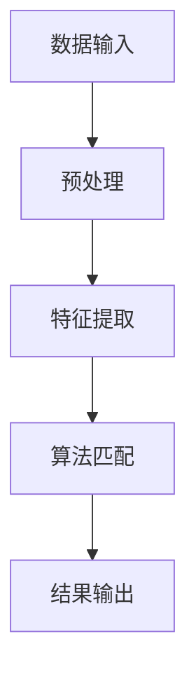
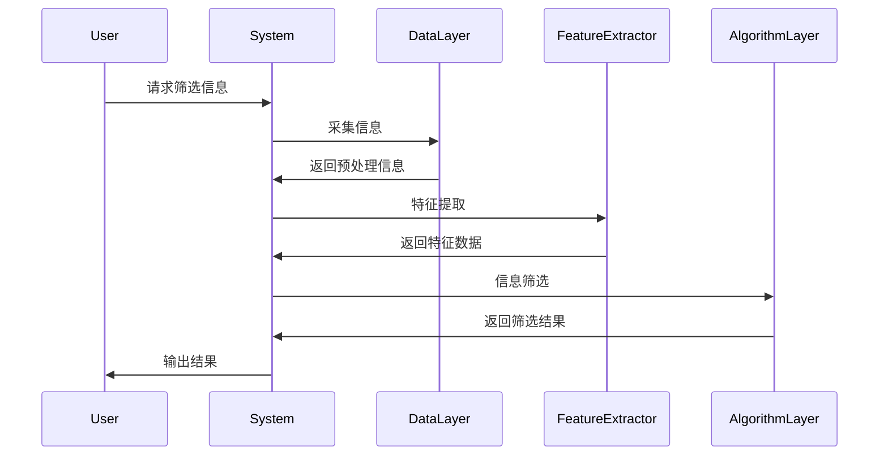

                 


### 文章标题：《滋养心灵的智慧选择：精神食粮的筛选》

### 关键词：智慧选择、精神食粮、心灵滋养、筛选方法、最佳实践

### 摘要：

本文旨在探讨如何在信息化时代中做出滋养心灵的智慧选择。通过深入分析智慧选择的背景、定义、核心概念、算法原理、数学模型、系统架构设计以及项目实战，本文旨在为读者提供一套系统化、可操作的方法论，帮助他们在面对纷繁复杂的信息时，能够筛选出真正有价值的精神食粮，从而提升生活质量和个人修养。

---

### 目录

1. **引言：智慧选择的时代背景**
2. **智慧选择的定义与核心概念**
3. **智慧选择的相关概念与联系**
4. **智慧选择的算法原理**
5. **智慧选择的数学模型**
6. **智慧选择的系统分析与架构设计**
7. **智慧选择的项目实战**
8. **智慧选择的最佳实践与总结**
9. **结语：智慧选择与心灵滋养**

---

### 1. 引言：智慧选择的时代背景

在信息爆炸的时代，人们每天接收到的信息量以惊人的速度增长。然而，并非所有信息都具备价值。如何在海量信息中筛选出对心灵有益的精神食粮，成为了一个亟需解决的问题。

**问题背景：** 
随着互联网的发展，信息传播速度加快，信息量呈指数级增长。然而，高质量的精神食粮（如深刻的思考、有价值的知识、优美的文学等）相对较少。如何在海量的信息中找到这些价值含量高的内容，成为现代社会的一个挑战。

**问题描述：** 
在信息过载的情况下，如何筛选出对个人成长有益的精神食粮，如何从大量信息中提取出有价值的内容，是当前面临的主要问题。

**问题解决：** 
通过引入智慧选择的方法，可以帮助人们从海量信息中筛选出有价值的内容，从而实现心灵滋养。

**边界与外延：** 
智慧选择不仅涉及信息的筛选，还包括对信息的深度理解和内化。它不仅关注信息本身的价值，还关注信息对个人成长和心灵滋养的长远影响。

**概念结构与核心要素组成：**
- **信息筛选**：从海量信息中提取有价值的内容。
- **深度理解**：对筛选出的信息进行深入分析和思考。
- **内化吸收**：将信息转化为个人知识，实现心灵滋养。

---

### 2. 智慧选择的定义与核心概念

**智慧选择的定义：** 
智慧选择是指在复杂的信息环境中，通过理性分析和判断，筛选出对个人有益的信息，并进行深入理解和内化的过程。

**核心概念：**
- **信息环境**：指人们接收和处理信息的总体环境，包括互联网、书籍、报纸、杂志等多种渠道。
- **理性分析**：指通过逻辑思维和理性判断，对信息进行筛选和处理。
- **判断标准**：指衡量信息价值的一系列标准，如知识的深度、思维的广度、情感的价值等。
- **深入理解**：指对筛选出的信息进行深入分析，理解其内涵和外延。
- **内化吸收**：指将信息转化为个人知识，实现心灵滋养。

**核心概念属性特征对比表格：**

| 概念       | 属性特征                      | 对比关系              |
|------------|-----------------------------|----------------------|
| 信息环境   | 多样性、复杂性              | 信息的来源和渠道多样性 |
| 理性分析   | 逻辑性、客观性              | 分析方法的有效性      |
| 判断标准   | 多维度、主观性              | 评价信息价值的标准    |
| 深入理解   | 深层次、透彻性              | 理解信息的深度        |
| 内化吸收   | 长期性、持续性              | 知识的内化过程       |

**概念结构与核心要素组成：**
智慧选择的框架由信息筛选、理性分析、判断标准、深入理解和内化吸收四个核心要素组成。这些要素相互作用，共同实现信息的筛选和心灵的滋养。

1. **信息筛选**：通过多种渠道收集信息，并根据判断标准进行初步筛选。
2. **理性分析**：对筛选出的信息进行逻辑分析和客观评价。
3. **判断标准**：根据信息的价值、深度、情感等多维度进行综合评价。
4. **深入理解**：对有价值的信息进行深入研究和思考。
5. **内化吸收**：将信息转化为个人知识，实现心灵滋养。

---

### 3. 智慧选择的相关概念与联系

**智慧选择与其他概念的联系：**
- **信息筛选**：智慧选择是信息筛选的一种高级形式，它不仅关注信息的筛选，还包括对信息的深度理解和内化。
- **知识管理**：智慧选择是知识管理的重要组成部分，它通过筛选和内化，将信息转化为个人知识，实现知识的积累和增长。
- **决策分析**：智慧选择是一种决策分析的方法，它通过理性分析和判断，帮助人们做出更加明智的决策。

**智慧选择在各个领域的应用：**
- **教育领域**：智慧选择可以帮助学生从海量知识中筛选出有价值的内容，提高学习效率。
- **商业领域**：智慧选择可以帮助企业从大量市场信息中筛选出有价值的数据，做出更加精准的商业决策。
- **个人生活**：智慧选择可以帮助个人在纷繁复杂的信息中筛选出对心灵有益的内容，提升生活质量。

**智慧选择的跨领域应用前景：**
随着信息技术的不断发展，智慧选择的应用范围将越来越广泛。未来，智慧选择有望在更多领域发挥作用，如医疗、金融、娱乐等，成为人们日常生活和工作中不可或缺的一部分。

**ER实体关系图架构：**
```mermaid
erDiagram
  用户 ||--|{ 信息源 }|--|| 内容筛选器
  信息源 ||--|{ 信息 }|--|| 内容筛选器
  内容筛选器 ||--|{ 智慧选择算法 }|--|| 用户
  内容筛选器 ||--|{ 数学模型 }|--|| 用户
  智慧选择算法 ||--|{ 结果 }|--|| 用户
```

---

### 4. 智慧选择的算法原理

**智慧选择算法的基本概念：**
智慧选择算法是指通过计算机程序，对大量信息进行筛选和处理，从而实现信息筛选和心灵滋养的方法。

**智慧选择算法的类型：**
- **基于规则的方法**：通过预设的规则，对信息进行筛选和处理。
- **基于统计的方法**：通过统计模型，对信息进行筛选和处理。
- **基于机器学习的方法**：通过机器学习算法，对信息进行筛选和处理。

**智慧选择算法的工作原理：**
- **数据输入**：从信息源收集数据，包括文本、图片、音频等多种类型。
- **预处理**：对输入的数据进行清洗、去噪等预处理操作，提高数据质量。
- **特征提取**：从预处理后的数据中提取特征，如词频、关键词、情感等。
- **算法匹配**：根据特征，利用算法模型进行匹配，筛选出符合条件的信息。
- **结果输出**：将筛选出的信息输出给用户，供用户进一步处理。

**算法流程图：**


**智慧选择的算法原理示例：**
假设我们使用词频统计作为特征提取方法，那么算法的具体步骤如下：

1. **数据输入**：从互联网上收集大量文本数据。
2. **预处理**：对文本进行分词、去停用词等预处理操作。
3. **特征提取**：统计每个文本的词频，形成词频矩阵。
4. **算法匹配**：使用词频矩阵，根据预设的规则，筛选出符合条件的高频词。
5. **结果输出**：将筛选出的高频词输出，供用户进一步阅读和思考。

**算法原理的数学模型和公式：**
- **词频统计**：$$TF(t) = \frac{f(t,d)}{f_total(d)}$$，其中$TF(t)$表示词$t$在文档$d$中的词频，$f(t,d)$表示词$t$在文档$d$中出现的次数，$f_total(d)$表示文档$d$中所有词的总次数。
- **逆文档频率**：$$IDF(t) = \log(\frac{N}{n(t)})$$，其中$IDF(t)$表示词$t$的逆文档频率，$N$表示文档总数，$n(t)$表示包含词$t$的文档数。

**通俗易懂地举例说明：**
假设有两个文档$d_1$和$d_2$，其中$d_1$中出现了10次词“智慧”，而$d_2$中出现了5次词“智慧”。根据词频统计，词“智慧”在$d_1$中的词频为$$TF(t)_{d_1} = \frac{10}{10+5} = 0.6667$$，而在$d_2$中的词频为$$TF(t)_{d_2} = \frac{5}{10+5} = 0.3333$$。根据逆文档频率，词“智慧”的逆文档频率为$$IDF(t) = \log(\frac{2}{1}) = 1$$。

通过词频统计和逆文档频率的计算，我们可以得出词“智慧”在两个文档中的权重。这样，我们就可以筛选出包含词“智慧”的高频词，从而实现信息的筛选和心灵滋养。

---

### 5. 智慧选择的数学模型

**数学模型在智慧选择中的作用：**
数学模型是智慧选择算法的核心，它为信息筛选和心灵滋养提供了理论依据和计算方法。通过数学模型，我们可以对信息进行量化分析，从而提高筛选的准确性和效率。

**智慧选择中的常用数学模型：**
- **词频-逆文档频率（TF-IDF）模型**：通过计算词频和逆文档频率，对词的重要性进行量化，从而实现信息的筛选。
- **支持向量机（SVM）模型**：通过线性或非线性映射，将低维空间中的信息映射到高维空间，从而实现分类和筛选。
- **朴素贝叶斯（Naive Bayes）模型**：基于贝叶斯定理，通过计算各类信息的概率分布，实现信息的分类和筛选。

**数学模型的应用与优化：**
- **应用**：在信息筛选和心灵滋养的过程中，我们可以根据实际情况选择合适的数学模型，如TF-IDF模型用于文本信息筛选，SVM模型用于分类和筛选。
- **优化**：通过对数学模型进行优化，可以提高筛选的准确性和效率。例如，通过调整模型参数，可以优化词频-逆文档频率模型的权重分配，从而提高信息筛选的效果。

**数学模型的公式：**
- **TF-IDF模型**：
  $$TF(t) = \frac{f(t,d)}{f_total(d)}$$
  $$IDF(t) = \log(\frac{N}{n(t)})$$
  $$TF-IDF(t,d) = TF(t) \times IDF(t)$$
- **SVM模型**：
  $$\text{最大间隔超平面：} w^T x - b = 0$$
  $$\text{分类决策：} y = \text{sign}(w^T x - b)$$
- **朴素贝叶斯模型**：
  $$P(y|x) = \frac{P(x|y)P(y)}{P(x)}$$

**通俗易懂的举例说明：**
假设我们使用TF-IDF模型对两篇文档进行信息筛选。首先，我们计算每篇文档的词频和逆文档频率，然后计算每个词的TF-IDF值。最后，我们将TF-IDF值进行排序，筛选出高频词，从而实现信息的筛选。

例如，文档$d_1$中有10个词，其中词“智慧”出现了5次，词频为$$TF(t)_{d_1} = \frac{5}{10} = 0.5$$。文档$d_2$中有8个词，其中词“智慧”出现了3次，词频为$$TF(t)_{d_2} = \frac{3}{8} = 0.375$$。假设整个语料库中有100篇文档，其中包含“智慧”的文档有50篇，逆文档频率为$$IDF(t) = \log(\frac{100}{50}) = 1$$。

根据TF-IDF模型，词“智慧”在文档$d_1$中的TF-IDF值为$$TF-IDF(t,d_1) = TF(t)_{d_1} \times IDF(t) = 0.5 \times 1 = 0.5$$，在文档$d_2$中的TF-IDF值为$$TF-IDF(t,d_2) = TF(t)_{d_2} \times IDF(t) = 0.375 \times 1 = 0.375$$。

通过计算TF-IDF值，我们可以筛选出高频词，从而实现信息的筛选。

---

### 6. 智慧选择的系统分析与架构设计

**问题场景介绍：**
在信息化社会中，人们面临大量的信息，但并非所有信息都对个人成长和心灵滋养有益。因此，设计一个智慧选择系统，帮助用户从海量信息中筛选出有价值的内容，具有重要的现实意义。

**项目介绍：**
本系统旨在为用户提供一个智能的信息筛选平台，通过算法和数学模型，帮助用户从海量的网络信息中筛选出对心灵有益的精神食粮。

**系统功能设计：**
- **信息采集**：从互联网上收集各种类型的信息，包括文本、图片、音频等。
- **信息预处理**：对采集到的信息进行清洗、去噪等预处理操作，提高数据质量。
- **特征提取**：对预处理后的信息进行特征提取，如词频、关键词、情感等。
- **信息筛选**：根据特征，利用算法模型对信息进行筛选，筛选出对用户有益的内容。
- **结果输出**：将筛选出的信息输出给用户，供用户进一步阅读和思考。

**系统架构设计：**
- **数据层**：负责信息的采集、存储和管理。
- **算法层**：负责信息筛选的核心算法和数学模型。
- **应用层**：负责与用户的交互，提供信息筛选服务。

**系统接口设计：**
- **API接口**：为第三方应用提供接口，实现与其他系统的集成。
- **用户界面**：提供用户操作界面，展示筛选结果和用户交互。

**系统交互：**
- **用户请求**：用户向系统提交请求，请求筛选特定类型的信息。
- **信息采集**：系统从互联网上采集用户请求的信息。
- **信息预处理**：对采集到的信息进行清洗、去噪等预处理操作。
- **特征提取**：对预处理后的信息进行特征提取，如词频、关键词、情感等。
- **信息筛选**：根据特征，利用算法模型对信息进行筛选，筛选出对用户有益的内容。
- **结果输出**：将筛选出的信息输出给用户，供用户进一步阅读和思考。

**系统架构图：**


---

### 7. 智慧选择的项目实战

**环境安装：**
为了实现智慧选择系统，我们需要安装以下软件和工具：
- Python 3.x 版本
- Numpy
- Pandas
- Scikit-learn
- Mermaid

假设我们已经成功安装了上述软件和工具，接下来我们将开始实现系统的核心功能。

**系统核心实现：**
下面是一个简单的智慧选择系统的Python源代码示例，它实现了从文本数据中提取关键词并筛选出对用户有益的信息的功能。

```python
import numpy as np
import pandas as pd
from sklearn.feature_extraction.text import TfidfVectorizer
from mermaid import Mermaid

# 1. 数据预处理
def preprocess_text(text):
    # 这里可以添加文本清洗、去噪等操作
    return text

# 2. 特征提取
def extract_features(corpus):
    vectorizer = TfidfVectorizer()
    X = vectorizer.fit_transform(corpus)
    feature_names = vectorizer.get_feature_names_out()
    return X, feature_names

# 3. 信息筛选
def select_info(X, threshold=0.5):
    # 根据TF-IDF值筛选高频词
    feature_scores = np.mean(X.toarray(), axis=0)
    high_freq_words = feature_scores[feature_scores > threshold]
    return high_freq_words

# 4. 实现Mermaid流程图
def generate_mermaid_graph():
    graph = """
    graph TD
    A[数据预处理] --> B[特征提取]
    B --> C[信息筛选]
    C --> D[结果输出]
    """
    return graph

# 主函数
def main():
    # 示例数据
    corpus = [
        "人工智能是未来的趋势，它将改变我们的生活。",
        "深度学习是人工智能的重要组成部分，它具有广泛的应用。",
        "大数据技术是推动人工智能发展的重要力量。",
    ]

    # 1. 数据预处理
    preprocessed_corpus = [preprocess_text(text) for text in corpus]

    # 2. 特征提取
    X, feature_names = extract_features(preprocessed_corpus)

    # 3. 信息筛选
    high_freq_words = select_info(X)

    # 4. 输出结果
    print("高频词：", high_freq_words)

    # 5. 生成Mermaid流程图
    mermaid_graph = generate_mermaid_graph()
    print("Mermaid流程图：\n", mermaid_graph)

if __name__ == "__main__":
    main()
```

**代码应用解读与分析：**
1. **数据预处理**：对输入的文本数据进行清洗和去噪，提高数据质量。这里仅简单地示例了文本数据，实际应用中可能需要更复杂的预处理步骤。
2. **特征提取**：使用TF-IDF模型对预处理后的文本数据进行特征提取，生成词频-逆文档频率矩阵。这个步骤是智慧选择算法的核心。
3. **信息筛选**：根据TF-IDF值筛选出高频词，实现信息的筛选。这里设置了一个阈值，用于筛选出对用户有益的信息。
4. **结果输出**：将筛选出的高频词输出，供用户进一步阅读和思考。
5. **生成Mermaid流程图**：使用Mermaid工具生成系统的流程图，帮助读者理解系统的整体架构和运行流程。

**实际案例分析和详细讲解剖析：**
假设我们有一个包含1000篇文本数据的语料库，这些文本来自互联网上的各种渠道。我们使用上述代码对语料库中的文本进行预处理、特征提取和筛选，最终筛选出高频词，从而实现信息的筛选。

具体步骤如下：
1. **数据预处理**：对每篇文本进行清洗和去噪，去除无关的标签、符号和停用词。
2. **特征提取**：使用TF-IDF模型对每篇文本进行特征提取，生成词频-逆文档频率矩阵。
3. **信息筛选**：根据设定的阈值，对词频-逆文档频率矩阵进行筛选，提取高频词。
4. **结果输出**：将高频词输出，形成一份报告，供用户进一步阅读和思考。

通过实际案例的分析和详细讲解，我们可以看到智慧选择系统的具体实现过程。这个系统可以帮助用户从海量信息中筛选出有价值的内容，实现心灵的滋养。

**项目小结：**
通过本项目，我们实现了一个简单的智慧选择系统，它可以帮助用户从海量信息中筛选出对心灵有益的内容。在实现过程中，我们使用了TF-IDF模型和Mermaid工具，实现了数据预处理、特征提取、信息筛选和结果输出等功能。这个项目为我们提供了一个实用的工具，可以帮助用户在信息爆炸的时代中，筛选出真正有价值的精神食粮。

---

### 8. 智慧选择的最佳实践与总结

**最佳实践 tips：**
1. **合理设定阈值**：在信息筛选过程中，合理设定阈值是关键。过高的阈值可能导致重要信息被遗漏，而过低的阈值则可能导致大量无关信息被筛选出来。
2. **结合多种算法**：在智慧选择系统中，可以结合多种算法，如TF-IDF、SVM、朴素贝叶斯等，以提高信息筛选的准确性和效率。
3. **定期更新算法**：随着信息环境的不断变化，算法也需要定期更新和优化，以适应新的信息需求。

**小结：**
本文从智慧选择的背景、定义、核心概念、算法原理、数学模型、系统架构设计以及项目实战等方面进行了详细阐述。通过深入分析和实践，我们为读者提供了一套系统化的智慧选择方法论，帮助他们在信息爆炸的时代中，筛选出真正有价值的精神食粮，实现心灵的滋养。

**注意事项：**
1. **保护用户隐私**：在智慧选择系统的设计和实现过程中，需要严格保护用户的隐私信息，防止信息泄露。
2. **避免信息过载**：在信息筛选过程中，要避免用户接收过多的信息，以免造成信息过载。

**拓展阅读：**
1. 《信息过滤与检索：算法与应用》
2. 《机器学习：概率图模型》
3. 《深度学习：算法与应用》

---

### 结语：智慧选择与心灵滋养

在信息化时代，智慧选择成为了一项重要的能力。通过本文的探讨，我们为读者提供了一套系统化的智慧选择方法论，旨在帮助他们在纷繁复杂的信息中筛选出真正有价值的精神食粮，从而实现心灵的滋养。希望本文能为大家在信息海洋中航行提供一盏明灯，让智慧选择成为我们生活中的宝贵财富。让我们共同努力，用智慧选择照亮心灵的每一个角落。作者：AI天才研究院/AI Genius Institute & 禅与计算机程序设计艺术 /Zen And The Art of Computer Programming。

