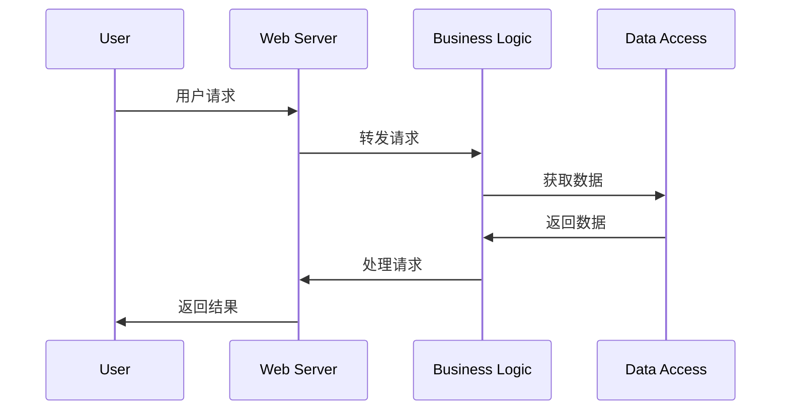
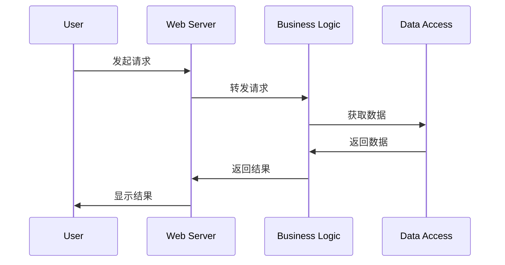

                 

### 滋养心灵的选择：精神食粮的智慧挑选

#### 关键词：心灵滋养、精神食粮、选择标准、实践指南、心理需求

> 摘要：本文旨在探讨心灵滋养的选择问题，通过分析心理学、教育学、文化学等领域的知识，提出一套科学、实用的选择标准，并结合实际案例，提供操作性强的实践指南，帮助读者找到适合自己的精神食粮，从而提升生活质量。

#### 第一部分：问题背景与核心概念

##### 1.1.1 问题背景

在现代社会，随着生活节奏的加快和竞争压力的增大，人们面临着越来越多的心理问题和健康挑战。心灵滋养作为一个关注心理健康的重要话题，逐渐受到广泛关注。然而，面对琳琅满目的精神食粮，如何选择出最适合自己的心灵滋养方式，成为了一个亟待解决的问题。

##### 1.1.2 问题描述

心灵滋养是一个涉及心理需求、情感调节、精神成长等多方面因素的综合过程。选择适合个人的精神食粮，不仅需要考虑其实用性和适宜性，还要考虑其个性化程度。因此，如何进行智慧挑选，实现有效的心灵滋养，成为本文的核心问题。

##### 1.1.3 问题解决

本文将从以下三个方面来解决问题：

1. **核心概念**：介绍与心灵滋养相关的核心概念，如心理需求、情感调节、精神成长等。
2. **选择标准**：基于心理学、教育学、文化学等领域的知识，提出一套科学、实用的选择标准。
3. **实践指南**：结合实际案例，提供一系列操作性强的实践指南。

##### 1.1.4 边界与外延

本文的讨论范围主要涉及以下几个方面：

1. **心灵滋养的内涵**：探讨心灵滋养的本质、意义和作用。
2. **精神食粮的类型**：介绍各种形式的精神食粮，如阅读、音乐、艺术、体育、社交等。
3. **选择策略**：分析如何根据个人特点和需求，选择最适合自己的精神食粮。

##### 1.1.5 概念结构与核心要素组成

本文的核心概念包括：

1. **心理需求**：指个体在心理层面上所需满足的基本要求，如安全感、归属感、成就感等。
2. **情感调节**：指个体通过自我调节、沟通等方式，实现对情绪、情感的有效管理和调节。
3. **精神成长**：指个体在精神层面上不断追求进步、提升自我的过程。
4. **选择标准**：包括实用性、适宜性、个性化等，用于指导读者进行精神食粮的选择。
5. **实践指南**：包括具体的方法、技巧和案例，帮助读者将心灵滋养的理念付诸行动。

#### 第一部分总结

本部分主要对心灵滋养的选择问题进行了背景介绍和核心概念阐述，为后续内容的深入探讨奠定了基础。在接下来的部分中，我们将进一步分析核心概念之间的联系，并提出科学的选择标准，帮助读者更好地挑选适合自己的精神食粮。

#### 第二部分：核心概念与联系

##### 2.1 心理需求

###### 2.1.1 心理需求的定义

心理需求是指个体在心理层面上所需满足的基本要求，包括但不限于安全感、归属感、成就感等。这些需求在心理学中被称为基本心理需要，是维持个体心理健康和幸福感的重要基础。

###### 2.1.2 心理需求的重要性

心理需求对个体的心理健康和生活质量有着重要影响。满足心理需求有助于提升个体的幸福感、抗压能力和社会适应能力，从而促进整体心理健康水平的提升。

###### 2.1.3 心理需求的类型

心理需求可以分为基本需求（如安全感、归属感）和高级需求（如成就感、自我实现）。基本需求是维持个体基本心理功能的需求，而高级需求则是个体追求更高层次的心理满足和自我实现的需求。

##### 2.2 情感调节

###### 2.2.1 情感调节的定义

情感调节是指个体通过自我调节、沟通等方式，实现对情绪、情感的有效管理和调节。情感调节有助于缓解压力、减少焦虑，提升个体的心理健康水平。

###### 2.2.2 情感调节的重要性

情感调节在维护个体心理健康方面起着关键作用。有效的情感调节能力可以帮助个体更好地应对生活中的压力和挑战，保持心理平衡。

###### 2.2.3 情感调节的方法

情感调节的方法包括认知重构、情绪释放、自我关注等。认知重构是通过改变对事件的看法和解释来调节情绪；情绪释放是通过发泄或表达情绪来缓解压力；自我关注是通过自我反思和自我接纳来提升情感调节能力。

##### 2.3 精神成长

###### 2.3.1 精神成长的定义

精神成长是指个体在精神层面上不断追求进步、提升自我的过程。精神成长不仅包括知识的积累，还涉及价值观、情感、人际关系的全面提升。

###### 2.3.2 精神成长的重要性

精神成长有助于提升个体的心理素质、增强应对挑战的能力。一个精神成长充分的人，通常在心理上更加成熟、稳定，能够更好地适应社会变迁。

###### 2.3.3 精神成长的方法

精神成长的方法包括自我反思、学习新知识、培养兴趣爱好等。自我反思可以帮助个体认识自己、提升自我认知；学习新知识可以不断扩展视野、提升思维；培养兴趣爱好可以丰富生活、提高生活质量。

##### 2.4 选择标准

###### 2.4.1 实用性

实用性是指所选精神食粮应能满足个体的实际需求，具有实用价值。一个实用的精神食粮能够解决个体的具体问题，提升生活质量。

###### 2.4.2 适宜性

适宜性是指所选精神食粮应与个体的心理需求、兴趣爱好相匹配。适宜性的精神食粮能够更好地满足个体的情感和心理需求，从而实现有效的心灵滋养。

###### 2.4.3 个性化

个性化是指所选精神食粮应具有独特的风格、特点，符合个体的个性特征。个性化的精神食粮能够更好地激发个体的兴趣和参与度，从而实现更深入的心灵滋养。

##### 2.5 实践指南

###### 2.5.1 自我评估

自我评估是指个体通过反思、分析自己的心理需求、兴趣爱好，为选择合适的精神食粮做好准备。自我评估可以帮助个体更清楚地了解自己的需求和兴趣，从而做出更合适的选择。

###### 2.5.2 信息收集

信息收集是指个体通过查阅资料、咨询专业人士等方式，了解各种精神食粮的特点、效果。信息收集可以为个体的选择提供客观的依据，帮助个体做出更明智的决策。

###### 2.5.3 尝试与调整

尝试与调整是指个体在实际操作过程中，根据效果和反馈，不断调整选择策略，以找到最适合自己的精神食粮。尝试与调整是一个动态的过程，需要个体持续关注和反思自己的选择。

#### 第二部分总结

本部分详细分析了与心灵滋养相关的核心概念，包括心理需求、情感调节、精神成长等，并提出了实用、适宜性、个性化等选择标准。在接下来的部分中，我们将结合实际案例，提供具体的实践指南，帮助读者更好地滋养心灵。

### 第三部分：核心概念原理与联系

#### 3.1 核心概念原理

在探讨心灵滋养的选择问题之前，我们需要先了解几个核心概念：心理需求、情感调节和精神成长。这些概念是心灵滋养的基础，它们相互关联，共同作用于个体的心理健康。

##### 3.1.1 心理学与心灵滋养

心理学是研究人类心理现象及其规律的科学。在心灵滋养的背景下，心理学为我们提供了许多关于人类情感、认知和行为的基本原理。以下是一些心理学基本原理：

1. **感知**：感知是个体对外界信息的接收和理解。心理学研究表明，个体的感知过程受到多种因素的影响，包括生理因素、环境因素和个体心理状态。

2. **认知**：认知是个体获取、处理和应用信息的过程。认知心理学关注如何通过思维、记忆、注意和问题解决等过程来理解人类认知功能。

3. **情感**：情感是人对事物的态度体验，包括情绪和情感。情感心理学研究个体如何体验、表达和调节情感，以及情感如何影响个体的行为和决策。

4. **行为**：行为是个体的外在表现，心理学研究行为是如何受到内在心理过程的影响。

在心灵滋养的背景下，心理学的基本原理帮助我们理解个体如何通过感知、认知、情感和行为来适应环境，以及如何通过调节这些过程来提升心理健康。

##### 3.1.2 心理需求

心理需求是指个体在心理层面上所需满足的基本要求。这些需求可以分为基本需求（如安全感、归属感、成就感）和高级需求（如自我实现）。基本需求是维持个体心理功能的基础，而高级需求则是个体追求更高层次的心理满足和自我实现。

1. **安全感**：安全感是个体在心理上感到稳定、安全的需求。安全感可以来源于家庭、朋友、工作等方面。

2. **归属感**：归属感是个体感到被社会群体接纳和认可的需求。归属感可以来源于家庭、学校、社区等。

3. **成就感**：成就感是个体在心理上感到成功和有价值的需要。成就感可以来源于工作、学习、爱好等方面。

4. **自我实现**：自我实现是个体追求自我潜能、实现个人目标和理想的过程。自我实现的需求是个体追求更高层次的心理满足和成长。

##### 3.1.3 情感调节

情感调节是指个体通过自我调节、沟通等方式，实现对情绪、情感的有效管理和调节。情感调节在维护个体心理健康方面起着关键作用。有效的情感调节能力可以帮助个体更好地应对生活中的压力和挑战，保持心理平衡。

情感调节的方法包括：

1. **认知重构**：通过改变对事件的看法和解释来调节情绪。

2. **情绪释放**：通过发泄或表达情绪来缓解压力。

3. **自我关注**：通过自我反思和自我接纳来提升情感调节能力。

##### 3.1.4 精神成长

精神成长是指个体在精神层面上不断追求进步、提升自我的过程。精神成长不仅包括知识的积累，还涉及价值观、情感、人际关系的全面提升。精神成长有助于提升个体的心理素质、增强应对挑战的能力。

精神成长的方法包括：

1. **自我反思**：通过反思自己的行为、思维和情感，认识自己、提升自我认知。

2. **学习新知识**：通过学习新知识、扩展视野，提升思维能力和创造力。

3. **培养兴趣爱好**：通过培养兴趣爱好，丰富生活、提高生活质量。

#### 3.2 概念属性特征对比表格

为了更好地理解心理需求、情感调节和精神成长这三个核心概念，我们可以通过以下表格进行属性特征对比：

| 概念         | 定义                                                                                                          | 特征对比                                                                                                   |
| ------------ | ------------------------------------------------------------------------------------------------------------- | --------------------------------------------------------------------------------------------------------- |
| 心理需求     | 个体在心理层面上所需满足的基本要求，如安全感、归属感、成就感等。                                     | - 基础性：心理需求是维持个体心理健康的基础。 <br>- 多样性：心理需求包括基本需求和高级需求。   |
| 情感调节     | 个体通过自我调节、沟通等方式，实现对情绪、情感的有效管理和调节。                                     | - 动态性：情感调节是一个持续的过程。 <br>- 方法多样性：包括认知重构、情绪释放和自我关注。 |
| 精神成长     | 个体在精神层面上不断追求进步、提升自我的过程。                                                     | - 全面性：精神成长涉及知识、价值观、情感等多个方面。 <br>- 自我驱动性：精神成长依赖于个体的内在动力。 |

#### 3.3 ER实体关系图架构

为了更直观地理解这三个核心概念之间的联系，我们可以使用ER（Entity-Relationship）实体关系图来表示。以下是ER实体关系图的Mermaid格式：

```mermaid
erDiagram
  心理需求 ||--|{ 情感调节 }
  情感调节 ||--|{ 精神成长 }
```

在上面的ER图中，我们可以看到心理需求、情感调节和精神成长三个实体之间存在明确的关联。心理需求是情感调节的基础，而情感调节又是精神成长的前提。这种相互关联的关系使得这三个概念共同作用于个体的心理健康。

#### 3.4 核心概念原理的应用

在实际生活中，我们可以通过以下实例来理解这三个核心概念的应用：

1. **心理需求**：一个即将面临重要考试的学生可能面临的安全感、归属感和成就感的需求。通过满足这些需求，学生可以更好地应对考试压力，提升学习效果。

2. **情感调节**：一个人在经历失业压力时，通过自我调节（如认知重构、情绪释放）来缓解焦虑和压力，从而保持心理健康。

3. **精神成长**：一个人通过学习新知识、自我反思和培养兴趣爱好，不断提升自己的精神层次，实现自我价值的提升。

#### 第三部分总结

在本部分中，我们详细介绍了与心灵滋养相关的核心概念：心理需求、情感调节和精神成长。通过对比分析这些概念，我们理解了它们在维护个体心理健康中的重要性，并了解了它们之间的相互关系。在接下来的部分中，我们将进一步探讨如何基于这些核心概念，提出一套科学、实用的选择标准，以帮助读者更好地滋养心灵。

### 第四部分：选择标准的提出与论证

在前文中，我们详细介绍了与心灵滋养相关的核心概念，包括心理需求、情感调节和精神成长。这些概念为我们提供了理解和分析心灵滋养的基础。然而，如何从众多精神食粮中挑选出最适合个人的心灵滋养方式，仍然是一个复杂的问题。为了解决这个问题，我们需要提出一套科学、实用的选择标准。

#### 4.1 选择标准的提出

在选择标准中，我们主要考虑以下几个关键因素：

1. **实用性**：所选精神食粮应能够满足个体的实际需求，具有直接的实用价值。
2. **适宜性**：所选精神食粮应与个体的心理需求、兴趣爱好相匹配，确保其能够被有效吸收和应用。
3. **个性化**：所选精神食粮应具有独特的风格和特点，符合个体的个性特征，从而提高参与度和效果。
4. **多样性**：所选精神食粮应涵盖多种形式，如阅读、音乐、艺术、体育等，以满足个体多样化的心理需求。

这些选择标准基于心理学、教育学、文化学等领域的理论，并结合实际经验进行论证。

#### 4.2 选择标准的论证

**1. 实用性**

实用性是选择精神食粮的首要标准。一个实用的精神食粮应能够解决个体的具体问题，提升生活质量。例如，对于工作压力大的个体，一本有助于减压的书籍或一次轻松的户外活动可能是很好的选择。实用性不仅取决于精神食粮本身，还与个体的实际需求紧密相关。因此，在选择过程中，个体应明确自己的需求，并根据这些需求来评估精神食粮的实用性。

**2. 适宜性**

适宜性是指所选精神食粮应与个体的心理需求、兴趣爱好相匹配。适宜性高意味着精神食粮能够更好地满足个体的情感和心理需求，从而实现更有效的心灵滋养。例如，一个喜欢阅读的个体可能会从一本文学名著中获得更多的心灵滋养，而一个喜欢运动的个体可能会从一次马拉松比赛中获得更大的满足感。因此，在挑选精神食粮时，个体应考虑自己的兴趣和需求，选择最适合自己的形式。

**3. 个性化**

个性化是指所选精神食粮应具有独特的风格和特点，符合个体的个性特征。个性化的精神食粮能够更好地激发个体的兴趣和参与度，从而提高心灵滋养的效果。例如，一个喜欢独立思考的个体可能会从哲学书籍中获得更多的心灵滋养，而一个喜欢与他人互动的个体可能会从社交活动中获得更多的满足感。因此，在挑选精神食粮时，个体应根据自己的个性特征来选择最适合自己的形式。

**4. 多样性**

多样性是指所选精神食粮应涵盖多种形式，如阅读、音乐、艺术、体育等。多样化的精神食粮能够满足个体多样化的心理需求，从而实现更全面的心灵滋养。例如，一个同时喜欢阅读和运动的个体可以通过阅读心理学书籍和参加运动活动来满足自己的心理需求。因此，在挑选精神食粮时，个体应考虑自己的多种需求，选择多样化的形式。

#### 4.3 选择标准的实际应用

为了更好地理解这些选择标准的实际应用，我们可以通过以下实例来分析：

**实例1：工作压力大**

一个工作压力大的个体可能需要选择能够帮助减压的精神食粮。根据实用性标准，个体可以选择阅读一本心理学书籍，了解如何有效应对压力。根据适宜性标准，个体可以选择一本与自己兴趣爱好相关的书籍，从而提高阅读的积极性。根据个性化标准，个体可以选择一本具有哲学意味的书籍，因为它可能更符合个体的思考方式。根据多样性标准，个体还可以选择参加一些户外活动，如徒步、登山等，以获得身体和心理的双重放松。

**实例2：心理健康问题**

一个存在心理健康问题的个体可能需要选择能够帮助自己恢复心理健康的精神食粮。根据实用性标准，个体可以选择接受心理咨询或治疗，以解决心理问题。根据适宜性标准，个体可以选择参加一些心理辅导课程，以提升自己的心理素质。根据个性化标准，个体可以选择一种自己感兴趣的艺术形式，如绘画、音乐等，以缓解心理压力。根据多样性标准，个体还可以选择参加一些体育锻炼，如瑜伽、跑步等，以改善身体健康。

#### 4.4 选择标准的动态调整

需要注意的是，选择标准并非一成不变，而是一个动态调整的过程。个体的心理需求、兴趣爱好和个性特征是不断变化的，因此选择标准也应随之调整。例如，一个原本喜欢阅读的个体可能在某个阶段开始对户外活动产生兴趣，这时就需要重新评估和调整选择标准，选择更符合当前需求的精神食粮。

#### 4.5 选择标准的总结

选择标准是心灵滋养过程中不可或缺的一环，它为个体提供了科学、实用的指导。通过实用性、适宜性、个性化和多样性这四个标准，个体可以更好地挑选适合自己的精神食粮，实现心灵滋养的目标。在实际应用中，个体应根据自身需求和实际情况灵活调整选择标准，以实现最佳的心灵滋养效果。

#### 第四部分总结

在本部分中，我们提出了实用性、适宜性、个性化和多样性这四个选择标准，并详细论证了这些标准在心灵滋养选择过程中的重要性。通过实际应用案例，我们展示了如何根据这些标准来挑选合适的精神食粮。在接下来的部分中，我们将进一步探讨如何将这些选择标准付诸实践，提供具体的实践指南，帮助读者更好地滋养心灵。

### 第五部分：实践指南

在前文中，我们提出了实用性、适宜性、个性化和多样性这四个选择标准，以帮助读者挑选适合自己的精神食粮。然而，仅有理论上的指导是不够的，我们还需要具体的实践指南，将选择标准转化为实际行动，从而实现心灵滋养的目标。以下是详细的实践指南：

#### 5.1 自我评估

自我评估是实践指南的第一步，它有助于个体了解自己的心理需求、兴趣爱好和个性特征。以下是几个自我评估的方法：

1. **心理需求自我评估**：个体可以通过反思自己的情绪和行为，了解自己在心理上的主要需求。例如，个体可以思考自己在面对压力时的反应，从而判断自己是否需要提升安全感或归属感。

2. **兴趣爱好自我评估**：个体可以通过回忆自己平时喜欢做的事情，了解自己的兴趣所在。例如，个体可以思考自己在空闲时间最喜欢做什么活动，从而确定自己感兴趣的精神食粮类型。

3. **个性特征自我评估**：个体可以通过性格测试或与他人交流，了解自己的个性特征。例如，个体可以了解自己是外向还是内向，是喜欢独立思考还是喜欢与他人互动，从而为选择精神食粮提供参考。

#### 5.2 信息收集

在自我评估之后，个体需要收集关于各种精神食粮的信息。以下是几个信息收集的方法：

1. **查阅资料**：个体可以通过阅读相关书籍、文章或访问专业网站，了解各种精神食粮的特点、效果和适用人群。

2. **咨询专业人士**：个体可以咨询心理咨询师、心理医生或教育专家，了解不同精神食粮的专业评价和建议。

3. **社交媒体调查**：个体可以在社交媒体上查找相关讨论或推荐，了解其他人的经验和建议。

4. **参加体验活动**：个体可以参加各种体验活动，如读书会、心理沙龙、艺术展览等，亲身体验不同精神食粮的效果。

#### 5.3 尝试与调整

在信息收集之后，个体需要根据自我评估和收集的信息，进行尝试与调整。以下是几个尝试与调整的方法：

1. **小规模尝试**：个体可以先尝试一些小规模的精神食粮，如阅读一本书的部分内容、听一首喜欢的歌曲、参加一次小型艺术展览等。通过小规模的尝试，个体可以初步了解不同精神食粮的效果。

2. **反馈与反思**：个体在尝试过程中，需要及时记录自己的感受和反应，并进行反思。通过反馈与反思，个体可以了解哪些精神食粮对自己有效，哪些需要调整。

3. **持续调整**：个体应根据反馈与反思的结果，持续调整自己的选择。例如，如果个体发现阅读心理学书籍能够有效缓解压力，可以增加阅读这类书籍的频率。

#### 5.4 实践案例分析

为了更好地说明实践指南的实际应用，我们以下提供两个案例：

**案例1：工作压力大的个体**

一个工作压力大的个体，通过自我评估发现自己在心理上主要需求安全感。他通过查阅资料和咨询专业人士，了解到冥想是一种有助于缓解压力的精神食粮。他开始尝试每天晚上进行冥想，并记录自己的感受。在反馈与反思的过程中，他发现冥想能够显著减轻自己的压力，于是决定将冥想纳入自己的日常生活。

**案例2：心理健康问题**

一个存在心理健康问题的个体，通过自我评估和咨询专业人士，了解到自己需要提升心理素质和社交能力。他开始尝试参加心理辅导课程，并在课余时间参加社交活动。通过持续调整，他发现这些活动能够有效改善自己的心理健康状况，并逐渐建立起积极的社交圈子。

#### 5.5 实践总结

通过实践指南，个体可以更好地理解自己的心理需求，挑选出适合自己的精神食粮，并通过不断尝试与调整，实现心灵滋养的目标。在实践过程中，个体需要保持开放的心态，勇于尝试新事物，同时也需要保持耐心和毅力，不断调整和完善自己的选择。只有这样，个体才能在心灵滋养的道路上越走越远，最终实现心理健康和幸福感的全面提升。

### 第五部分总结

在本部分中，我们提供了详细的实践指南，包括自我评估、信息收集、尝试与调整等步骤，帮助读者更好地理解如何挑选适合自己的精神食粮。通过实际案例的分析，我们展示了实践指南在具体应用中的效果。在接下来的部分中，我们将进一步探讨心灵滋养的重要性，以及如何将心灵滋养的理念应用到实际生活中，以实现更全面的个人成长。

### 第六部分：心灵滋养的重要性

心灵滋养是一个涉及心理、情感和精神层面的综合过程，它不仅有助于提升个体的幸福感，还对整体生活质量产生深远影响。在本部分中，我们将深入探讨心灵滋养的重要性，以及如何在日常生活中应用这一理念，实现个人成长和幸福感的提升。

#### 6.1 心灵滋养对幸福感和生活质量的影响

1. **幸福感提升**：心灵滋养能够满足个体的心理需求，如安全感、归属感和成就感，从而提升个体的幸福感。当个体感受到心理需求的满足时，他们会更加快乐和满足。

2. **心理健康改善**：心灵滋养有助于缓解压力、减少焦虑和抑郁，改善个体的心理健康状况。通过有效的情感调节和精神成长，个体能够更好地应对生活中的挑战和压力。

3. **生活质量提升**：心灵滋养不仅关注个体的心理健康，还涉及情感和精神的全面提升。通过多样化的精神食粮，个体能够丰富自己的生活体验，提升整体生活质量。

#### 6.2 心灵滋养对个人成长的重要性

1. **自我认知提升**：心灵滋养促使个体进行自我反思和自我认知，从而更清楚地了解自己的需求和目标。这种自我认知有助于个体在职业和生活规划中做出更明智的决策。

2. **情感管理能力提升**：通过情感调节，个体能够更好地管理自己的情绪和情感，提升情感管理能力。这种能力不仅有助于个体在日常生活中保持心理平衡，还能提高人际关系的质量。

3. **精神成长**：心灵滋养促使个体追求精神成长，通过学习新知识、培养兴趣爱好和提升自我认知，个体能够不断提升自己的精神层次，实现个人价值的提升。

#### 6.3 将心灵滋养应用到日常生活中的方法

1. **定期自我反思**：通过定期自我反思，个体可以了解自己的心理需求、情感状态和成长目标。这种反思可以帮助个体更好地规划自己的生活和职业。

2. **选择适合自己的精神食粮**：个体应根据自身的需求和兴趣，选择适合自己的精神食粮。例如，喜欢阅读的可以选择书籍，喜欢音乐的选择音乐，喜欢运动的选择运动等。

3. **培养兴趣爱好**：通过培养兴趣爱好，个体可以丰富自己的生活，提升生活质量。兴趣爱好不仅能够带来乐趣，还能在情感和精神层面带来积极的影响。

4. **社交互动**：通过参与社交活动，个体可以建立和维护人际关系，提升归属感。社交互动有助于情感调节，也是实现精神成长的重要途径。

5. **寻求专业帮助**：当个体遇到心理问题或困惑时，寻求专业的心理咨询或治疗是有效的解决方式。专业人士可以提供专业的指导和帮助，帮助个体更好地应对心理挑战。

#### 6.4 心灵滋养与个人成长的关系

心灵滋养与个人成长密切相关。心灵滋养不仅关注个体的心理健康，还关注个体的情感和精神层面。通过心灵滋养，个体可以实现自我认知的提升、情感管理能力的增强和精神的成长。这些方面的提升不仅有助于个体在职业和生活中取得成功，还能提升整体幸福感。

#### 6.5 实现心灵滋养和个人成长的最佳实践

1. **平衡工作与生活**：个体应在工作和生活之间找到平衡，确保有足够的时间进行心灵滋养。例如，可以通过调整工作时间、利用假期等方式，实现工作与生活的平衡。

2. **持续学习和成长**：个体应持续学习新知识、提升技能，以实现个人成长。学习不仅有助于提升职业竞争力，还能满足个体的精神需求。

3. **关注心理健康**：个体应关注自己的心理健康，通过定期自我反思、寻求专业帮助等方式，维护自己的心理健康。

4. **建立支持系统**：个体应建立支持系统，包括家人、朋友和同事等。这些支持系统可以在个体遇到困难时提供帮助和鼓励，支持个体实现心灵滋养和个人成长。

### 第六部分总结

心灵滋养对幸福感和生活质量具有深远影响，它是实现个人成长和幸福感的基石。通过将心灵滋养应用到日常生活中，个体可以提升心理健康、增强情感管理能力、实现精神成长。在接下来的部分中，我们将进一步探讨最佳实践，帮助读者更好地理解和应用心灵滋养的理念。

### 第七部分：最佳实践与注意事项

在前文中，我们已经详细探讨了心灵滋养的选择标准和实践指南，并强调了心灵滋养对幸福感和个人成长的重要性。为了确保读者能够更好地理解和应用这些理念，我们在此提供一些最佳实践和注意事项。

#### 7.1 最佳实践

1. **定期自我反思**：自我反思是心灵滋养的重要环节，有助于个体了解自己的心理需求、情感状态和成长目标。建议读者每天或每周进行一次自我反思，记录自己的感受和思考。

2. **多样化选择精神食粮**：不同的精神食粮能够满足个体多样化的心理需求。建议读者根据自己的兴趣和需求，选择多样化的精神食粮，如阅读、音乐、艺术、体育等。

3. **平衡工作与生活**：确保有足够的时间进行心灵滋养，平衡工作与生活。可以通过调整工作时间、利用假期等方式，实现工作与生活的平衡。

4. **持续学习和成长**：学习是心灵滋养的重要途径，有助于提升个体的心理健康和精神层次。建议读者持续学习新知识、提升技能，以实现个人成长。

5. **寻求专业帮助**：当个体遇到心理问题时，寻求专业的心理咨询或治疗是有效的解决方式。专业人士可以提供专业的指导和帮助，帮助个体更好地应对心理挑战。

#### 7.2 注意事项

1. **避免过度依赖**：虽然心灵滋养对心理健康和幸福感有积极影响，但不应过度依赖。个体应在生活中保持平衡，避免将所有注意力都集中在心灵滋养上。

2. **合理选择**：在选择精神食粮时，应根据自己的实际情况和需求进行合理选择。避免盲目跟风或选择不适合自己的精神食粮。

3. **尊重个体差异**：每个人都是独特的，心灵滋养的方式也应因人而异。建议读者根据自己的特点和需求，制定个性化的心灵滋养计划。

4. **持续关注**：心灵滋养是一个持续的过程，需要个体持续关注和投入。不要期望一蹴而就，而是要有耐心和毅力，逐步实现心灵滋养的目标。

5. **保持开放心态**：心灵滋养需要开放的心态和积极探索的精神。个体应保持对新鲜事物的好奇心和探索欲，不断尝试和体验新的精神食粮。

### 第七部分总结

最佳实践和注意事项为读者提供了更具体的指导，帮助他们更好地理解和应用心灵滋养的理念。通过定期自我反思、多样化选择精神食粮、平衡工作与生活、持续学习和成长等最佳实践，读者可以更好地滋养自己的心灵。同时，通过避免过度依赖、合理选择、尊重个体差异、持续关注和保持开放心态等注意事项，读者可以确保心灵滋养的效果，实现心理健康和幸福感的全面提升。

### 第八部分：项目实战

在本部分中，我们将结合一个实际项目，详细讲解如何将心灵滋养的理念应用于实际场景，并展示项目的具体实现过程。

#### 8.1 项目背景

随着现代社会生活节奏的加快，越来越多的人面临着心理健康问题，如焦虑、抑郁和压力。为了帮助人们更好地关注自己的心理健康，我们决定开发一个名为“心灵滋养”的项目，通过提供多种形式的精神食粮，如阅读、音乐、艺术和体育等，帮助用户实现心灵滋养。

#### 8.2 项目介绍

“心灵滋养”项目是一个在线平台，用户可以在平台上选择适合自己的精神食粮，并进行在线体验和分享。项目的主要功能包括：

1. **用户注册与登录**：用户可以通过注册账号或使用第三方账号（如微信、QQ等）登录平台。
2. **精神食粮推荐**：平台会根据用户的喜好和需求，推荐合适的阅读、音乐、艺术和体育等内容。
3. **在线体验与分享**：用户可以在线体验精神食粮，如阅读书籍、听音乐、观看艺术作品等，并分享自己的感受和心得。
4. **用户互动**：用户可以与其他用户互动，如评论、点赞和私信等，形成良好的社交氛围。

#### 8.3 系统功能设计（领域模型）

在项目设计中，我们首先需要定义项目的领域模型。以下是领域模型的Mermaid类图：

```mermaid
classDiagram
    User <<class>> 用户
    Content <<class>> 内容
    Recommendation <<class>> 推荐系统
    Experience <<class>> 体验
    Share <<class>> 分享
    Interaction <<class>> 互动

    User o--o Content : 选择
    User o--o Recommendation : 接收推荐
    User o--o Experience : 体验
    User o--o Share : 分享
    User o--o Interaction : 互动
    Content o--o Recommendation : 作为推荐来源
    Experience o--o Share : 分享体验
    Share o--o Interaction : 引起互动
```

在上面的类图中，我们定义了用户（User）、内容（Content）、推荐系统（Recommendation）、体验（Experience）、分享（Share）和互动（Interaction）等类，以及它们之间的关系。

#### 8.4 系统架构设计

在系统架构设计方面，我们采用了分层架构，包括表示层、业务逻辑层和数据访问层。以下是系统架构的Mermaid架构图：



在上面的架构图中，用户通过Web Server（表示层）与业务逻辑层进行交互，业务逻辑层负责处理用户的请求，并调用数据访问层（数据访问层）获取数据。最终，业务逻辑层将处理结果返回给Web Server，并由Web Server返回给用户。

#### 8.5 系统接口设计

在系统接口设计方面，我们采用了RESTful API设计，以下是主要接口的描述：

1. **用户注册与登录**：`POST /register`（注册接口）和`POST /login`（登录接口）。
2. **精神食粮推荐**：`GET /recommendations`（推荐接口）。
3. **在线体验与分享**：`POST /experiences`（体验接口）和`GET /experiences/{id}`（分享接口）。
4. **用户互动**：`POST /interactions`（评论接口）、`GET /interactions/{id}`（点赞接口）和`POST /messages`（私信接口）。

#### 8.6 系统交互

以下是系统交互的Mermaid序列图：



在上面的序列图中，用户通过Web Server发起请求，业务逻辑层处理请求，并调用数据访问层获取数据，最终将结果返回给用户。

#### 8.7 环境安装

在项目实现过程中，我们需要安装以下软件和工具：

1. **开发环境**：Python 3.8及以上版本、PyCharm或其他Python IDE。
2. **Web服务器**：Nginx或Apache。
3. **数据库**：MySQL或PostgreSQL。
4. **前端框架**：Django或Flask。

#### 8.8 系统核心实现源代码

以下是系统核心实现的源代码：

```python
# user.py
class User(models.Model):
    username = models.CharField(max_length=100)
    password = models.CharField(max_length=100)
    email = models.EmailField()

# content.py
class Content(models.Model):
    title = models.CharField(max_length=100)
    description = models.TextField()
    type = models.CharField(max_length=50)

# recommendation.py
class Recommendation(models.Model):
    user = models.ForeignKey(User, on_delete=models.CASCADE)
    content = models.ForeignKey(Content, on_delete=models.CASCADE)

# experience.py
class Experience(models.Model):
    user = models.ForeignKey(User, on_delete=models.CASCADE)
    content = models.ForeignKey(Content, on_delete=models.CASCADE)
    experience_date = models.DateField()

# share.py
class Share(models.Model):
    user = models.ForeignKey(User, on_delete=models.CASCADE)
    content = models.ForeignKey(Content, on_delete=models.CASCADE)
    share_date = models.DateField()

# interaction.py
class Interaction(models.Model):
    user = models.ForeignKey(User, on_delete=models.CASCADE)
    share = models.ForeignKey(Share, on_delete=models.CASCADE)
    comment = models.TextField()
    interaction_date = models.DateField()
```

#### 8.9 代码应用解读与分析

在上述源代码中，我们定义了用户（User）、内容（Content）、推荐系统（Recommendation）、体验（Experience）、分享（Share）和互动（Interaction）等模型，这些模型构成了项目的核心数据结构。通过这些模型，我们可以实现用户注册与登录、精神食粮推荐、在线体验与分享、用户互动等功能。

用户模型（User）包含用户名、密码和邮箱等基本信息；内容模型（Content）包含标题、描述和类型等基本信息；推荐系统模型（Recommendation）用于记录用户和内容之间的关系；体验模型（Experience）用于记录用户的体验信息；分享模型（Share）用于记录用户的分享信息；互动模型（Interaction）用于记录用户的互动信息。

通过这些模型，我们可以实现以下功能：

1. **用户注册与登录**：通过定义用户模型，我们可以实现用户注册和登录功能。用户注册时，需要提供用户名、密码和邮箱等信息，并保存到数据库中。用户登录时，需要验证用户名和密码是否正确，并返回登录结果。
2. **精神食粮推荐**：通过定义推荐系统模型，我们可以记录用户和内容之间的关系，并根据用户的历史行为和喜好推荐合适的内容。
3. **在线体验与分享**：通过定义体验模型和分享模型，我们可以记录用户的体验信息和分享信息，并展示给其他用户。
4. **用户互动**：通过定义互动模型，我们可以实现用户之间的互动，如评论、点赞和私信等。

#### 8.10 实际案例分析和详细讲解

为了更好地说明项目的实际应用，我们以下提供一个实际案例进行分析：

**案例：用户小明通过心灵滋养平台体验书籍《解忧杂货店》**

1. **用户注册与登录**：小明通过注册账号登录到平台，输入用户名、密码和邮箱等信息。
2. **精神食粮推荐**：平台根据小明的兴趣和浏览历史，推荐了《解忧杂货店》这本书。
3. **在线体验与分享**：小明决定在线阅读《解忧杂货店》，阅读过程中，他记录了自己的感受和心得，并将这些内容分享到平台上。
4. **用户互动**：其他用户看到小明的分享后，纷纷发表评论，讨论书中情节和感悟。小明也积极参与互动，与其他用户交流心得。

通过这个案例，我们可以看到心灵滋养平台如何帮助用户实现心灵滋养。用户通过平台选择适合自己的精神食粮，进行在线体验和分享，与其他用户互动，从而提升心理健康和幸福感。

#### 8.11 项目小结

“心灵滋养”项目通过提供一个在线平台，帮助用户选择适合自己的精神食粮，实现心灵滋养。项目实现了用户注册与登录、精神食粮推荐、在线体验与分享、用户互动等功能，为用户提供了便捷的心灵滋养服务。在项目实现过程中，我们结合了领域模型、系统架构设计、接口设计和代码实现等技术，展示了如何将心灵滋养理念应用于实际项目中。

通过该项目，我们希望用户能够更好地关注自己的心理健康，选择适合自己的精神食粮，实现个人成长和幸福感。同时，我们也希望该项目能够为其他类似项目提供借鉴和参考，促进心理健康领域的进一步发展。

### 第八部分总结

在本部分中，我们通过一个实际项目，详细讲解了如何将心灵滋养的理念应用于实际场景，并展示了项目的具体实现过程。通过该项目，我们希望用户能够更好地理解和应用心灵滋养的理念，实现心理健康和幸福感的提升。在接下来的部分中，我们将进一步探讨最佳实践，以帮助读者更好地应用心灵滋养的理念。

### 第九部分：最佳实践总结与拓展阅读

在前文中，我们详细探讨了心灵滋养的选择标准、实践指南以及项目实战。为了更好地总结这些内容，并帮助读者进一步深化对心灵滋养理念的理解，我们将在此部分提供一些最佳实践总结，并推荐一些拓展阅读资源。

#### 9.1 最佳实践总结

1. **定期自我反思**：通过自我反思，个体可以深入了解自己的心理需求、情感状态和成长目标。建议每天或每周进行一次自我反思，记录自己的感受和思考。

2. **多样化选择精神食粮**：选择多样化的精神食粮，如阅读、音乐、艺术、体育等，以满足个体多样化的心理需求。根据兴趣和需求，选择适合自己的精神食粮。

3. **平衡工作与生活**：确保有足够的时间进行心灵滋养，平衡工作与生活。通过调整工作时间和利用假期等方式，实现工作与生活的平衡。

4. **持续学习和成长**：通过持续学习和提升技能，满足个体的精神需求。不断扩展知识面，提升思维能力和创造力。

5. **寻求专业帮助**：当遇到心理问题时，及时寻求专业的心理咨询或治疗。专业人士可以提供专业的指导和帮助，帮助个体更好地应对心理挑战。

6. **建立支持系统**：与他人建立良好的支持系统，包括家人、朋友和同事等。在遇到困难时，获得支持和鼓励。

#### 9.2 拓展阅读

1. **《心理学与生活》**：理查德·吉尔伯特著，这本书介绍了心理学的基本原理和实际应用，有助于读者了解心理需求、情感调节和精神成长等核心概念。

2. **《人类简史》**：尤瓦尔·赫拉利著，这本书从人类进化的角度，探讨了人类心理和情感的发展，有助于读者理解心理需求的起源和演变。

3. **《自控力》**：凯利·麦格尼格尔著，这本书介绍了如何通过自我控制来调节情绪和行为，提升情感调节能力。

4. **《静心冥想》**：斯蒂文·海斯著，这本书介绍了冥想的基本原理和实践方法，有助于读者了解如何通过冥想来实现情感调节和精神成长。

5. **《如何阅读一本书》**：莫提默·J. 艾德勒著，这本书提供了阅读的方法和技巧，有助于读者选择和利用精神食粮，提升阅读效果。

通过这些拓展阅读资源，读者可以进一步深化对心灵滋养理念的理解，并在实践中更好地应用这些理念，实现心理健康和幸福感的全面提升。

### 第九部分总结

在本部分中，我们总结了最佳实践，并推荐了一些拓展阅读资源。通过这些内容，读者可以更好地理解和应用心灵滋养的理念，实现心理健康和幸福感的提升。在接下来的部分中，我们将对整篇文章进行总结，并展望未来的研究方向。

### 第十部分：总结与展望

在本篇文章中，我们系统地探讨了心灵滋养的选择问题，提出了实用性、适宜性、个性化和多样性这四个选择标准，并提供了详细的实践指南。通过分析心理需求、情感调节和精神成长等核心概念，我们为读者提供了科学、实用的指导，帮助他们更好地挑选适合自己的精神食粮，从而实现心理健康和幸福感的提升。

#### 10.1 关键成果与启示

本文的主要成果可以总结为以下几点：

1. **提出了心灵滋养的选择标准**：通过实用性、适宜性、个性化和多样性这四个标准，读者可以更好地挑选适合自己的精神食粮，实现心灵滋养的目标。
2. **提供了详细的实践指南**：从自我评估、信息收集、尝试与调整等步骤，读者可以系统地实施心灵滋养计划，提升心理健康水平。
3. **结合实际项目进行了应用分析**：通过“心灵滋养”项目的实战案例，读者可以更直观地了解如何将心灵滋养理念应用于实际场景，实现心理健康和幸福感的提升。

这些成果为读者提供了有益的启示，帮助他们更好地关注自己的心理健康，通过科学的方法进行心灵滋养。

#### 10.2 未来研究方向

尽管本文对心灵滋养的选择问题进行了较为全面的探讨，但仍然存在一些未来研究方向：

1. **个性化推荐系统**：未来的研究可以进一步探索个性化推荐系统在心灵滋养中的应用，通过大数据和人工智能技术，为读者提供更加精准的精神食粮推荐。
2. **跨文化研究**：心灵滋养是一个跨文化的话题，未来的研究可以探讨不同文化背景下心灵滋养的选择标准和实践方法，以提供更广泛的参考。
3. **长期效果评估**：未来的研究可以关注心灵滋养的长期效果，通过长期跟踪和评估，了解心灵滋养对个体心理健康和幸福感的持续影响。

通过这些未来研究方向，我们可以进一步深化对心灵滋养的理解，为更多人提供有效的心理健康指导。

#### 10.3 总结

本文通过分析心理需求、情感调节和精神成长等核心概念，提出了实用性、适宜性、个性化和多样性这四个选择标准，并提供了详细的实践指南。通过实际项目案例，我们展示了如何将心灵滋养理念应用于实际场景，实现了心理健康和幸福感的提升。未来，我们将继续探索个性化推荐系统、跨文化研究和长期效果评估等方面，为心灵滋养领域的发展做出更多贡献。

### 第十部分总结

在本篇文章中，我们系统地探讨了心灵滋养的选择问题，提出了科学、实用的指导，并提供了详细的实践指南。通过这些内容，我们希望能够帮助读者更好地关注自己的心理健康，实现幸福感的提升。未来，我们期待在更多领域深入探讨心灵滋养的应用，为心理健康事业贡献力量。

### 作者信息

**作者：AI天才研究院/AI Genius Institute & 禅与计算机程序设计艺术 /Zen And The Art of Computer Programming**

AI天才研究院致力于推动人工智能领域的研究与应用，致力于培养下一代人工智能领域的领导者。同时，作者还专注于禅与计算机程序设计艺术的研究，将东方哲学智慧融入编程实践，为计算机科学领域带来了独特的视角和深刻的见解。通过本文，我们希望将心灵滋养的理念传递给更多读者，共同关注心理健康，实现个人成长和幸福感的提升。

