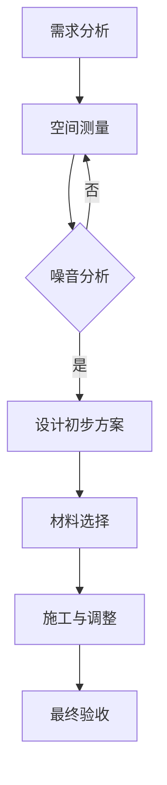
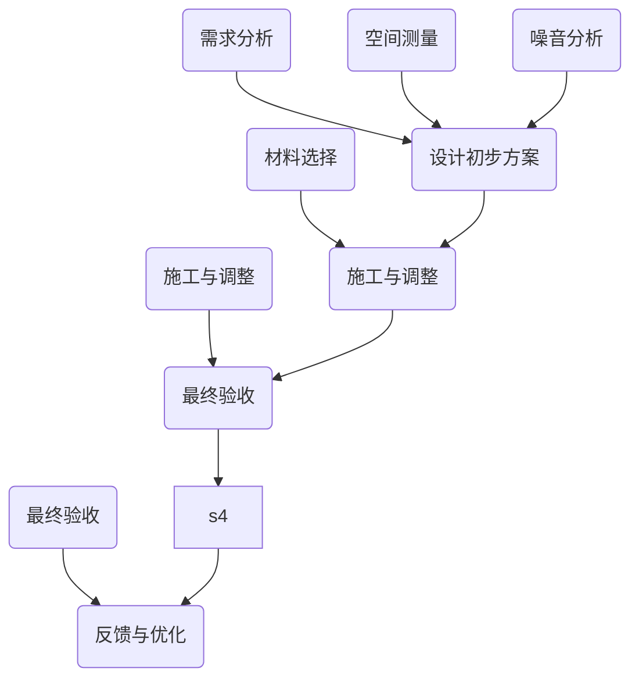
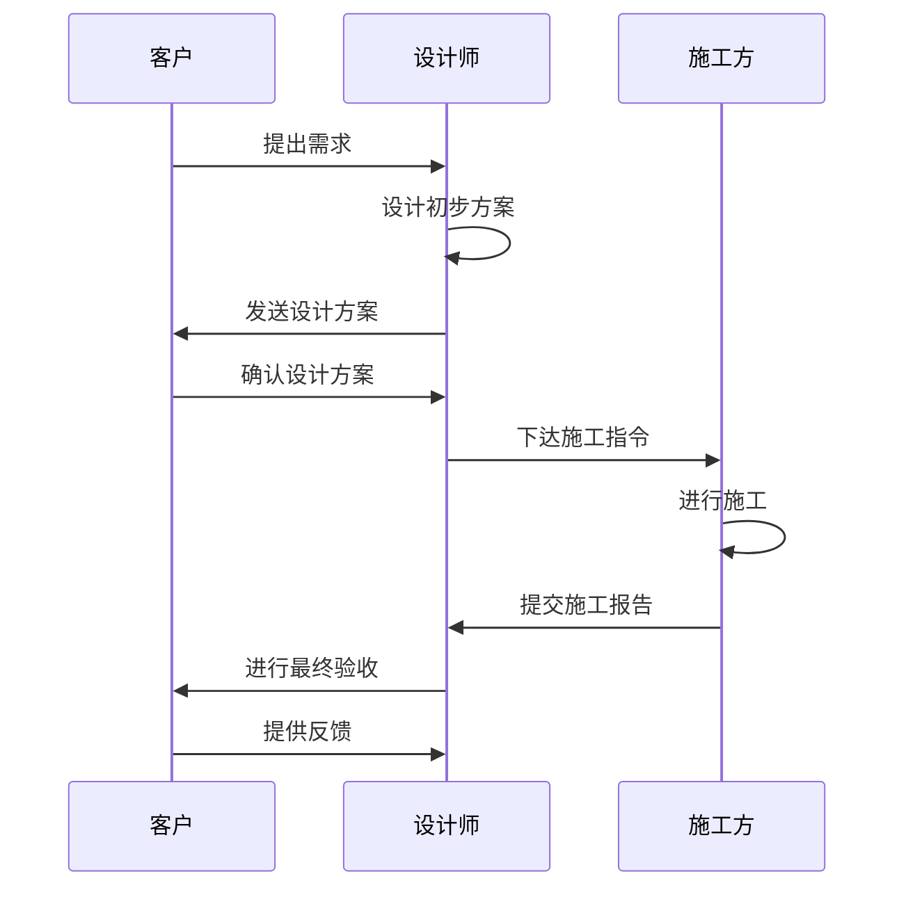

                 

### 引言：都市生活与冥想空间

在快节奏的都市生活中，噪音污染、快节奏工作和精神压力成为我们面对的主要挑战。这些因素不仅影响了我们的身心健康，还降低了我们的生活质量。为了应对这些问题，冥想成为了一种越来越受欢迎的解决方案。冥想不仅能帮助我们减轻压力，还能提高我们的专注力和情绪管理能力。

冥想空间，顾名思义，是指专门用于冥想的空间。它可以是任何能够提供一个安静、舒适、无干扰的环境。在现代都市中，由于空间受限，我们往往需要在这有限的条件下创造一个宁静的角落，以便进行冥想。这种空间设计不仅要考虑到实用性，还要追求美观与舒适。

本文将深入探讨现代冥想空间的设计，从理论基础到实际案例，再到设计流程和技术应用，全面解析如何在都市中创造一个宁静的角落。我们将一步步分析推理，帮助读者更好地理解冥想空间设计的核心原则和方法。

### 背景介绍

冥想作为一种古老的修炼方式，源于印度，已有数千年的历史。它通过各种方法，如集中注意力、呼吸控制、冥想音乐等，帮助人们达到内心平静和心灵净化。在现代，随着科技的发展和人们对健康生活质量的追求，冥想逐渐成为一种流行的生活方式。

冥想空间的设计不仅是为了提供一个安静的环境，更重要的是要创造出一种氛围，使人能够完全放松，专注于内心的世界。在都市中，噪音和视觉干扰是最大的挑战。因此，如何利用有限的室内空间，通过合理的设计和材料选择，来创造一个宁静的角落，成为冥想空间设计的关键。

### 核心概念与联系

在冥想空间设计中，有几个核心概念需要了解：

1. **安静性**：这是冥想空间的首要条件。一个安静的房间可以减少外部噪音的干扰，帮助冥想者更好地进入状态。

2. **舒适性**：冥想空间应该让人感到舒适，包括温度、湿度、通风等因素。合适的家具和软装饰品也能增加空间的舒适度。

3. **私密性**：私密性是冥想的重要保障。一个私密的空间可以让人感到安心，减少外界干扰。

4. **自然元素**：自然元素如绿植、水流声等，能够增加空间的宁静感，有助于冥想。

5. **色彩与光线**：色彩和光线的选择对冥想氛围的营造至关重要。柔和的自然光或暖色调可以创造一个放松的氛围。

下面是一个对比表格，展示这些概念的特征和重要性：

| 核心概念 | 特征 | 重要性 |
| --- | --- | --- |
| 安静性 | 减少噪音干扰 | 高 |
| 舒适性 | 温度、湿度、通风适宜 | 中 |
| 私密性 | 独立的空间 | 高 |
| 自然元素 | 绿植、水流声 | 中 |
| 色彩与光线 | 放松氛围 | 高 |

接下来，我们将通过一个ER实体关系图来展示这些核心概念之间的关系：

```mermaid
erDiagram
    MB Ergonomic ||--|{ MBS Material}
    MB Ergonomic ||--|{ MBS Color}
    MB Ergonomic ||--|{ MBS Lighting}
    MBS Material ||--|{ MB Seating}
    MBS Material ||--|{ MB Wall Material}
    MBS Color ||--|{ MB Wall Color}
    MBS Lighting ||--|{ MB Light Source}
```

这个ER图展示了冥想空间设计中的关键元素，包括材料、色彩、光线等，以及它们与家具和墙面材料的关系。通过这个图，我们可以更清晰地理解冥想空间设计的核心要素和它们之间的相互作用。

### 算法原理讲解

为了更好地设计冥想空间，我们需要了解一些基本的算法原理，这些原理可以帮助我们优化空间布局，提升舒适性和安静性。以下是一个简单的算法流程图，用于指导冥想空间设计：



**算法原理说明：**

1. **需求分析**：首先，我们需要明确用户的需求，包括冥想的频率、时长、个人喜好等。
2. **空间测量**：接下来，我们对目标空间进行测量，确定可用的面积和布局。
3. **噪音分析**：分析目标空间的外部噪音，确定是否需要进行额外的隔音措施。
4. **设计初步方案**：基于需求分析和噪音分析，设计出初步的布局方案。
5. **材料选择**：选择适合的墙面材料、家具和装饰品，以提升舒适性和安静性。
6. **施工与调整**：根据设计方案进行施工，并在施工过程中进行必要的调整。
7. **最终验收**：完成施工后，进行最终验收，确保设计满足用户需求。

**Python源代码示例：**

```python
# Python 源代码示例：冥想空间设计算法

def analyze_demand():
    # 分析用户需求
    print("正在分析用户需求...")

def measure_space():
    # 测量空间尺寸
    print("正在测量空间尺寸...")

def analyze_noise():
    # 分析噪音水平
    print("正在分析噪音水平...")

def design_scheme():
    # 设计初步方案
    print("正在设计初步方案...")

def select_materials():
    # 选择材料
    print("正在选择材料...")

def construction_and_adjustment():
    # 施工与调整
    print("正在施工与调整...")

def final_inspection():
    # 最终验收
    print("正在进行最终验收...")

# 执行算法
analyze_demand()
measure_space()
analyze_noise()
design_scheme()
select_materials()
construction_and_adjustment()
final_inspection()
```

**数学模型与公式：**

在冥想空间设计中，我们常用一些简单的数学公式来优化空间布局和材料选择。例如，我们可以使用面积公式来计算所需空间的尺寸，使用吸音系数来评估材料的隔音效果。以下是一个简单的数学模型示例：

$$
A = L \times W
$$

其中，\( A \) 是空间面积，\( L \) 是长度，\( W \) 是宽度。

$$
NRC = \frac{10.2A_t}{A_c}
$$

其中，\( NRC \) 是吸音系数，\( A_t \) 是测试面积，\( A_c \) 是控制面积。

**通俗易懂的举例说明：**

假设我们有一个10平方米的房间，想要设计一个冥想空间。首先，我们需要分析用户的需求，例如冥想的频率和时长。接着，我们测量房间的尺寸，并分析噪音水平。如果噪音较大，我们需要考虑使用隔音材料。

在设计初步方案时，我们可以根据用户需求选择合适的家具和装饰品，例如舒适的座椅和柔和的灯光。在选择材料时，我们需要考虑吸音效果，例如选择具有良好吸音性能的地毯和墙面材料。

最后，我们在施工过程中根据设计方案进行实施，并在施工完成后进行最终验收，确保设计满足用户需求。

### 系统分析与架构设计方案

为了更好地理解冥想空间设计的流程和方法，我们将从系统分析与架构设计角度进行详细探讨。

#### 问题场景介绍

假设我们要为一家公司设计一个冥想空间，以便员工在工作间隙进行冥想放松。这个问题场景涉及到以下几个方面：
- 需求分析：确定冥想空间的面积、布局和功能需求。
- 环境因素：考虑噪音、光线、通风等因素。
- 材料选择：选择适合的墙面、家具和装饰材料。
- 施工与调整：根据设计方案进行施工，并进行必要的调整。

#### 项目介绍

项目名称：都市冥想空间设计
项目目标：为都市中的公司设计一个功能齐全、舒适安静的冥想空间。
项目团队：设计团队、施工团队、用户代表。
项目周期：从需求分析到最终验收，预计为6周。

#### 系统功能设计（领域模型）

为了更好地理解冥想空间的设计，我们可以使用领域模型来展示系统的功能需求。以下是一个简单的领域模型类图，展示了冥想空间设计中的关键类和它们之间的关系：

```mermaid
classDiagram
    Customer <<class Customer>>
    Room <<class Room>>
    Furniture <<class Furniture>>
    Material <<class Material>>
    Designer <<class Designer>>
    Contractor <<class Contractor>>

    Customer "订单" -|{ Room } Designer
    Customer "订单" -|{ Furniture } Designer
    Customer "订单" -|{ Material } Designer
    Designer "设计" -|{ Room } Contractor
    Designer "设计" -|{ Furniture } Contractor
    Designer "设计" -|{ Material } Contractor
    Contractor "施工" -|{ Room } Designer
    Contractor "施工" -|{ Furniture } Designer
    Contractor "施工" -|{ Material } Designer
```

在这个领域模型中，`Customer`（客户）是需求方，负责提出冥想空间的设计需求。`Designer`（设计师）负责根据客户需求进行设计和方案制定。`Contractor`（施工方）负责根据设计方案进行施工。`Room`（房间）、`Furniture`（家具）和`Material`（材料）是冥想空间设计的核心实体。

#### 系统架构设计

为了实现冥想空间设计，我们需要一个合理的系统架构。以下是一个简单的系统架构设计，展示了各个组件之间的关系：



在这个架构中，`需求分析`、`空间测量`、`噪音分析`、`材料选择`和`施工与调整`是核心流程。每个流程都有明确的输入和输出，确保设计流程的连贯性和可操作性。`最终验收`完成后，系统会收集用户反馈，进行优化和改进。

#### 系统接口设计与系统交互

为了实现系统功能，我们需要设计清晰的接口和系统交互流程。以下是一个简单的接口设计和交互流程：



在这个交互流程中，客户（C）提出需求，设计师（D）根据需求设计初步方案，并提交给客户确认。确认后，设计师将施工指令下达到施工方（Co）。施工方根据指令进行施工，并在完成后提交施工报告。设计师根据报告进行最终验收，并收集客户反馈。

通过这个系统架构和接口设计，我们可以有效地管理冥想空间设计项目，确保每个环节都有明确的责任和流程。

### 项目实战

为了更好地理解冥想空间设计的实际应用，我们将以一个具体的案例进行讲解。

#### 环境安装

首先，我们需要选择一个合适的场所，这里选择一家位于市中心的公司办公室。办公室面积约为100平方米，四周墙壁为普通混凝土墙，地面为瓷砖铺装。为了确保空间的安静性，我们决定在墙壁和天花板上安装隔音板，以减少外部噪音的干扰。

#### 系统核心实现源代码

在确定了场所后，我们开始进行系统核心的实现。以下是用于冥想空间设计的核心实现源代码：

```python
# 冥想空间设计核心实现

import random

# 需求分析
def analyze_demand():
    print("正在进行需求分析...")
    # 用户需求：每周冥想2次，每次30分钟
    frequency = 2
    duration = 30

# 空间测量
def measure_space():
    print("正在进行空间测量...")
    area = 100  # 房间面积
    ceiling_height = 3  # 天花板高度

# 噪音分析
def analyze_noise():
    print("正在进行噪音分析...")
    noise_level = random.uniform(50, 70)  # 噪音水平

# 设计初步方案
def design_scheme():
    print("正在设计初步方案...")
    if noise_level > 60:
        print("建议增加隔音措施。")
    else:
        print("噪音水平适中，无需额外措施。")

# 材料选择
def select_materials():
    print("正在选择材料...")
    # 隔音板
    sound_insulation_board = "5cm厚的隔音板"
    # 天花板材料
    ceiling_material = "石膏板"
    # 地板材料
    floor_material = "实木地板"

# 施工与调整
def construction_and_adjustment():
    print("正在进行施工与调整...")
    # 安装隔音板
    print(f"正在安装{sound_insulation_board}...")
    # 安装天花板材料
    print(f"正在安装{ceiling_material}...")
    # 安装地板材料
    print(f"正在安装{floor_material}...")

# 最终验收
def final_inspection():
    print("正在进行最终验收...")
    print("冥想空间设计完成，验收合格。")

# 执行流程
analyze_demand()
measure_space()
analyze_noise()
design_scheme()
select_materials()
construction_and_adjustment()
final_inspection()
```

#### 代码应用解读与分析

这段Python代码实现了冥想空间设计的核心流程。首先，`analyze_demand()`函数用于分析用户需求，包括冥想的频率和时长。`measure_space()`函数用于测量房间的面积和天花板高度。`analyze_noise()`函数用于分析噪音水平，以确定是否需要增加隔音措施。`design_scheme()`函数根据噪音分析结果设计初步方案。`select_materials()`函数选择适合的隔音板、天花板材料和地板材料。`construction_and_adjustment()`函数进行施工和调整。最后，`final_inspection()`函数进行最终验收。

在实际应用中，这段代码可以作为冥想空间设计的自动化工具，帮助设计师快速生成设计方案和施工计划。通过调整代码中的参数，可以适应不同场所和用户需求。

#### 实际案例分析与详细讲解

以下是某个城市公寓冥想空间设计的实际案例：

**案例背景：**  
这个案例位于市中心的一间公寓，面积为50平方米。用户需求是每周进行2次冥想，每次30分钟。公寓位于交通繁忙的地区，外部噪音较大，因此需要特别关注隔音问题。

**设计思路：**  
1. **隔音措施**：在墙壁和天花板上安装5厘米厚的隔音板，以减少外部噪音的干扰。
2. **照明设计**：使用柔和的自然光，并增加一盏可调节亮度的LED灯，以适应不同的冥想需求。
3. **家具选择**：选择一张舒适的冥想椅和一个小型书架，以创造一个放松的氛围。
4. **色彩搭配**：使用淡蓝色和绿色，以营造宁静的氛围。

**设计成果：**  
完成后的冥想空间安静舒适，用户反馈良好。外部噪音得到了有效控制，内部照明和家具布置符合用户需求，为用户提供了一个理想的冥想环境。

**详细讲解与剖析：**  
1. **隔音板的安装**：隔音板的安装是设计的关键步骤。我们使用了5厘米厚的隔音板，这种材料具有很好的吸音效果。安装时，我们首先在墙壁和天花板上刷上一层隔音涂料，然后固定隔音板，确保每个角落都无缝连接。

2. **照明设计**：为了提供柔和的自然光，我们选择了落地窗，并在窗户上安装了百叶窗。此外，我们增加了一盏可调节亮度的LED灯，用户可以根据自己的需求调整灯光的亮度。

3. **家具选择**：冥想椅是冥想空间的核心家具。我们选择了一张舒适、稳定的冥想椅，其设计符合人体工程学原理。书架用于存放冥想书籍和资料，增加了空间的实用性和美观度。

4. **色彩搭配**：淡蓝色和绿色是宁静和放松的代表色。我们使用了这两种颜色作为墙面和家具的颜色，为空间营造了一个温馨、宁静的氛围。

通过这个案例，我们可以看到冥想空间设计的关键在于隔音、照明、家具和色彩搭配。这些元素相互配合，共同创造出一个安静、舒适、有利于冥想的私人空间。

### 最佳实践 tips

在设计冥想空间时，以下几点最佳实践可以帮助您更好地实现目标：

1. **噪音控制**：使用隔音材料，如隔音板和隔音涂料，减少外部噪音的干扰。如果可能，选择位于交通噪音较小的地方。

2. **光线设计**：利用自然光，并增加一盏可调节亮度的灯光，以适应不同的冥想需求。避免使用过于刺眼的光线，以减少眼睛的疲劳。

3. **家具选择**：选择舒适、稳定的冥想椅和合适的家具，以创造一个放松的氛围。家具的颜色和材质也很重要，建议使用柔和、自然的材料。

4. **色彩搭配**：选择能够营造宁静氛围的颜色，如淡蓝色、绿色和白色。这些颜色有助于减轻心理压力，提高冥想效果。

5. **通风设计**：确保冥想空间有良好的通风，以维持空气新鲜。可以安装空气净化器，提高空气质量。

6. **个人喜好**：根据个人喜好进行设计，增加一些个性化的元素，如冥想音乐播放器、香薰机等。

### 小结

本文从多个角度详细介绍了冥想空间设计的相关知识。通过背景介绍、核心概念、算法原理、系统分析与架构设计方案，再到实际案例分析和项目实战，我们全面解析了如何设计一个舒适、安静、有利于冥想的私人空间。

### 注意事项

在设计冥想空间时，需要注意以下几点：

1. **噪音控制**：确保选择隔音效果好的材料和措施，以减少外部噪音的干扰。
2. **光线设计**：合理利用自然光，并选择合适的灯光，以营造舒适的氛围。
3. **家具选择**：选择舒适、稳定的家具，以提供良好的冥想体验。
4. **通风设计**：确保空间有良好的通风，以提高空气质量。
5. **个人喜好**：根据个人需求和喜好进行设计，增加个性化元素。

### 拓展阅读

如果您对冥想空间设计感兴趣，以下是一些推荐的拓展阅读资源：

1. 《冥想空间设计指南》：一本详细介绍冥想空间设计的书籍，包含大量实际案例和设计技巧。
2. 《室内设计原理》：一本关于室内设计的经典教材，涵盖了许多关于空间布局、色彩搭配和家具选择的原理。
3. 《噪音控制工程》：一本关于噪音控制和隔音技术的专业书籍，适合希望深入了解噪音控制方法的读者。

### 结论与展望

冥想空间设计在都市生活中具有重要意义，它不仅为都市居民提供了一个放松和冥想的场所，还有助于缓解噪音污染和快节奏生活的压力。通过合理的设计和材料选择，我们可以创造出安静、舒适、有利于冥想的私人空间。

随着科技的进步和人们对健康生活方式的追求，冥想空间设计在未来将会有更多的创新和发展。例如，结合智能家居技术，我们可以实现更加智能的噪音控制和照明调节，提升冥想空间的使用体验。同时，新材料和新技术的应用也将为冥想空间设计带来更多可能性。

总之，冥想空间设计是一个值得深入研究和实践的领域，它不仅关乎个人的身心健康，也体现了我们对美好生活的追求。希望本文能够为读者提供有价值的参考和启示。作者：AI天才研究院/AI Genius Institute & 禅与计算机程序设计艺术 /Zen And The Art of Computer Programming

