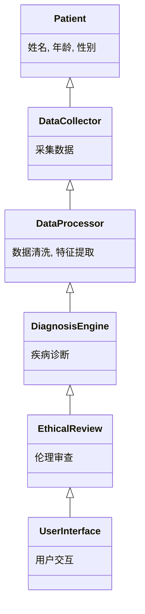
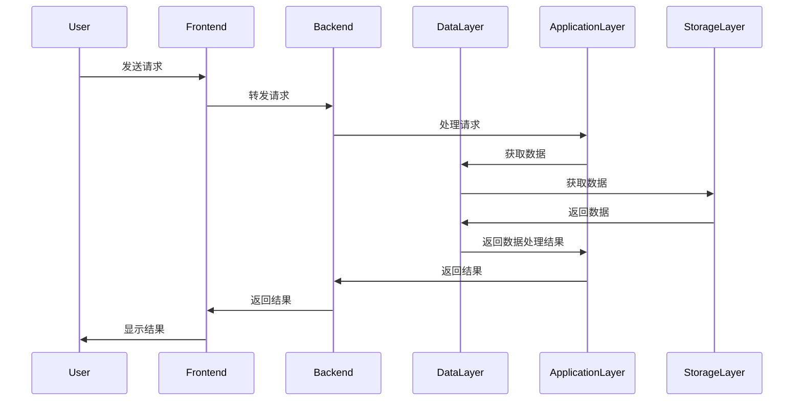
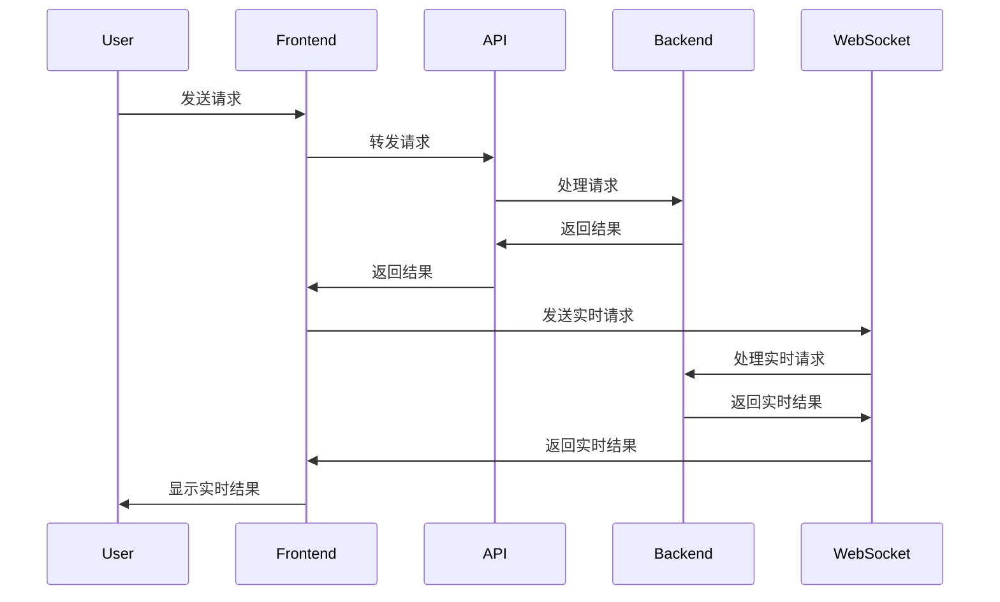

                 

# 现代医学与生命伦理：在科技进步与伦理底线间寻找平衡

## 关键词
- 现代医学
- 生命伦理
- 科技进步
- 伦理底线
- 平衡

## 摘要
本文旨在探讨现代医学与生命伦理之间的相互关系，特别是在科技进步与伦理底线之间寻找平衡的重要性。文章首先介绍了现代医学的快速发展及其带来的伦理挑战，随后阐述了生命伦理学的基本原则和决策框架。接着，通过对现代医学和生命伦理的核心概念进行深入分析，比较了它们的目的和方法，并探讨了它们之间的联系。文章还介绍了算法原理和数学模型在医学中的应用，并给出了具体的实例。最后，文章总结了寻找平衡的必要性，并提出了未来研究和实践的方向。

----------------------------------------------------------------

## 第一部分：背景介绍与核心概念

### 第1章：问题背景与核心概念

#### 1.1.1 问题背景

**现代医学的发展**

现代医学经历了数十年的快速发展，尤其在基因技术、精准医疗和人工智能等领域取得了显著的成就。基因技术的突破使得疾病诊断和治疗变得更加精确，精准医疗则为患者提供了个性化的治疗方案。此外，人工智能的引入使得医学诊断、治疗和药物研发更加高效和准确。

**生命伦理的挑战**

然而，现代医学的发展也带来了一系列的伦理挑战。首先，基因编辑技术引发了关于人类基因改造的伦理争议。其次，人体增强技术的兴起引发了关于人类身体界限的伦理思考。此外，医疗资源分配问题也是一个重要的伦理议题，如何公平地分配有限的医疗资源成为了一个亟待解决的问题。

#### 1.1.2 核心概念

**医学伦理学**

医学伦理学是研究医学实践中道德问题的学科，其基本原则包括尊重患者自主权、不伤害原则、有利原则和公正原则。这些原则为医学实践中的伦理决策提供了指导。

**科技进步与伦理底线**

科技进步与伦理底线之间的关系是一个复杂的问题。一方面，科技进步可以为医学发展带来新的机遇，如基因编辑和人体增强技术。另一方面，科技进步也可能挑战现有的伦理底线，如对人类基因的修改和对人体界限的突破。如何在科技进步与伦理底线之间寻找平衡是一个重要的课题。

#### 1.1.3 研究意义

**寻找平衡的重要性**

在现代医学与生命伦理之间寻找平衡具有重要意义。首先，这有助于确保医学技术的合理应用，避免伦理风险。其次，这有助于维护社会公正，确保医疗资源得到公平分配。最后，这有助于推动医学的可持续发展，使其在符合伦理要求的前提下为人类健康服务。

#### 1.1.4 边界与外延

**边界**

现代医学与生命伦理的研究范围主要涉及医学实践中的伦理问题，包括基因编辑、人体增强、医疗资源分配等。同时，它也涉及到科技进步与伦理底线之间的关系。

**外延**

相关领域的交叉点包括法律、哲学、社会学等。这些领域的知识可以丰富我们对现代医学与生命伦理之间关系的理解，有助于我们更好地应对伦理挑战。

#### 1.1.5 概念结构与核心要素

**现代医学**

现代医学的核心包括基因医学、精准医疗和人工智能等。这些领域的发展为医学实践带来了新的机遇，同时也带来了新的伦理挑战。

**生命伦理**

生命伦理的核心包括医学伦理原则和生命伦理学领域。医学伦理原则为医学实践提供了道德指导，生命伦理学领域则涵盖了基因伦理、医疗资源分配、人体实验伦理等问题。

#### 本章小结

本章介绍了现代医学与生命伦理之间的背景和核心概念。通过对现代医学的发展和生命伦理的挑战进行概述，我们明确了研究意义和边界，并探讨了外延和相关领域的交叉点。本章为后续章节的分析提供了基础。

----------------------------------------------------------------

## 第二部分：核心概念与联系

### 第2章：现代医学与生命伦理的核心概念

#### 2.1.1 现代医学的核心概念

**基因医学**

**定义**：基因医学是应用基因学原理来诊断、治疗和预防疾病的一门医学学科。

**特点**：基因医学具有高度的精确性和个性化治疗的特点。通过基因检测，医生可以更准确地诊断疾病，并制定个性化的治疗方案。

**例子**：基因测序可以用于诊断遗传性疾病，如囊性纤维化。通过分析患者的基因序列，医生可以确定他们是否携带相关的突变基因，从而采取相应的治疗措施。

**基因编辑**

**定义**：基因编辑是指通过修改生物体的基因序列来治疗遗传性疾病或增强其特定功能。

**特点**：基因编辑技术如CRISPR-Cas9具有高精确性和高效性，可以实现对特定基因的精准修改。

**例子**：利用CRISPR-Cas9技术，科学家可以治疗某些遗传性疾病，如β-地中海贫血。通过修改患者体内的异常基因，他们可以恢复正常的红细胞生成。

**精准医疗**

**定义**：精准医疗是根据患者的个体差异，为其提供量身定制治疗方案的一种医疗模式。

**特点**：精准医疗具有个体化、针对性的特点，可以最大限度地提高治疗效果，减少副作用。

**例子**：在癌症治疗中，通过基因组测序，医生可以为患者选择最适合的靶向药物，从而提高治疗效果。

**人工智能在医学中的应用**

**定义**：人工智能在医学中的应用是指利用机器学习、深度学习等技术，辅助医生进行诊断、治疗和研究的医学领域。

**特点**：人工智能在医学中具有高效性、准确性和可扩展性的特点，可以处理大量数据并快速做出诊断。

**例子**：人工智能可以帮助医生进行医学图像分析，如肿瘤检测和心脏病诊断，从而提高诊断的准确性和效率。

#### 2.1.2 生命伦理的核心概念

**医学伦理原则**

**定义**：医学伦理原则是指医学实践中应当遵循的基本道德规范。

**原则**：

1. 尊重患者自主权：患者有权自主决定医疗行为，医生应尊重患者的选择和意愿。
2. 不伤害原则：医生应尽量避免对患者造成伤害，采取一切可能的措施保护患者的健康。
3. 有利原则：医生应采取对患者的健康和福祉有益的行动。
4. 公正原则：医生应公平地对待患者，确保医疗资源得到公正分配。

**医学伦理原则的应用**：

- **尊重患者自主权**：在基因编辑和人体增强技术中，医生应尊重患者的决定，并确保患者充分了解相关风险和好处。
- **不伤害原则**：在医疗实践中，医生应采取一切可能的措施避免对患者造成不必要的伤害。
- **有利原则**：在制定治疗方案时，医生应考虑患者的最佳利益，选择最合适的治疗方案。
- **公正原则**：在医疗资源分配中，医生应确保资源的公平分配，不偏袒特定群体。

**生命伦理学领域**

**定义**：生命伦理学是研究生命、健康和医疗伦理问题的学科。

**领域**：

1. 基因伦理：研究基因技术、基因编辑等在医学中的应用带来的伦理问题。
2. 医疗资源分配：研究如何公平地分配有限的医疗资源。
3. 人体实验伦理：研究人体实验的道德原则和伦理审查。
4. 病人权利：研究患者的权利和利益保护。

#### 2.1.3 概念属性特征对比

**现代医学与生命伦理的对比**

**目的**

- **现代医学**：旨在治疗疾病、提高健康水平。
- **生命伦理**：旨在保障生命权益、维护社会公正。

**方法**

- **现代医学**：依靠科学研究和临床实践。
- **生命伦理**：依靠伦理原则和社会规范。

**属性特征**

- **现代医学**：具有高度科学性、技术性和个体化特点。
- **生命伦理**：具有伦理性、公正性和社会性特点。

#### 2.1.4 ER实体关系图

**现代医学与生命伦理的ER图**

- **实体**：医生、患者、医学技术、伦理原则。
- **关系**：医生与患者之间的关系、医学技术与伦理原则之间的关系。

```mermaid
erDiagram
  Doctor ||--|{ Patient } Patient
  Doctor ||--|{ MedicalTechnology } MedicalTechnology
  Doctor ||--|{ EthicalPrinciple } EthicalPrinciple
  MedicalTechnology ||--|{ GeneMedicine } GeneMedicine
  MedicalTechnology ||--|{ PrecisionMedicine } PrecisionMedicine
  MedicalTechnology ||--|{ ArtificialIntelligence } ArtificialIntelligence
```

#### 本章小结

本章深入探讨了现代医学与生命伦理的核心概念。通过对现代医学和生命伦理的核心概念进行详细分析，我们了解了它们的定义、特点和应用。同时，通过对比它们的目的、方法和属性特征，我们进一步明确了它们之间的联系。ER实体关系图为我们提供了一个直观的视角，展示了现代医学与生命伦理之间的复杂关系。

----------------------------------------------------------------

## 第三部分：算法原理与数学模型

### 第3章：算法原理讲解

#### 3.1.1 算法概述

**算法的定义**

算法是一系列明确的步骤，用于解决特定问题。在医学领域中，算法可以用于诊断、治疗、药物研发等多个方面。算法的特点包括：

- **效率高**：算法能够快速处理大量数据，提高诊断和治疗的效率。
- **结构清晰**：算法的步骤和规则清晰明确，便于理解和实现。

**算法的分类**

医学领域中的算法可以分为以下几类：

- **基于基因的算法**：如遗传算法，用于优化基因序列，诊断遗传性疾病。
- **基于机器学习的算法**：如支持向量机、神经网络，用于医学图像分析、疾病预测等。

#### 3.1.2 算法分类

**基于基因的算法**

**遗传算法**

**原理**：遗传算法（Genetic Algorithm, GA）是一种模拟自然进化的优化算法。它通过模拟自然选择、交叉和变异等进化过程来寻找最优解。

**特点**：遗传算法具有并行性、鲁棒性和全局优化能力。

**应用**：遗传算法可以用于基因诊断、个性化治疗等。

**例子**：利用遗传算法，医生可以为患者设计最优的治疗方案，通过分析患者的基因数据和病情，找到最适合的治疗方法。

**遗传算法的数学模型**

$$
\begin{aligned}
f(x) &= \sum_{i=1}^{n} c_i \cdot g(x_i) \\
x_i &= \text{第i个基因序列} \\
c_i &= \text{权重系数} \\
g(x_i) &= \text{适应度函数}
\end{aligned}
$$

**适应度函数**：适应度函数用于评估一个基因序列的优劣。适应度值越高，表示该基因序列越优秀。

**例子**：在治疗某遗传性疾病时，适应度函数可以评估基因序列是否能够有效抑制疾病的发作。

**遗传算法的流程**

1. **初始化种群**：生成一组随机基因序列作为初始种群。
2. **适应度评估**：计算每个基因序列的适应度值。
3. **选择**：根据适应度值，选择优秀的基因序列进行交叉和变异。
4. **交叉**：将选择的基因序列进行交叉，生成新的基因序列。
5. **变异**：对交叉后的基因序列进行变异，增加种群的多样性。
6. **迭代**：重复适应度评估、选择、交叉和变异过程，直到满足停止条件。

**基于机器学习的算法**

**支持向量机**

**原理**：支持向量机（Support Vector Machine, SVM）是一种二分类模型，通过找到一个最优的超平面，将不同类别的数据点分开。

**特点**：支持向量机具有较好的分类能力和泛化能力。

**应用**：支持向量机可以用于医学图像分析、疾病分类等。

**例子**：在肿瘤检测中，支持向量机可以用来区分肿瘤细胞和正常细胞。

**支持向量机的数学模型**

$$
\begin{aligned}
\min_{\mathbf{w},b}\frac{1}{2}||\mathbf{w}||^2 \\
s.t. \\
y_i(\mathbf{w}\cdot\mathbf{x_i} + b) \geq 1
\end{aligned}
$$

**例子**：在肿瘤检测中，支持向量机通过找到最优的超平面，将肿瘤细胞和正常细胞分开。

**支持向量机的流程**

1. **数据准备**：收集并预处理医学图像数据。
2. **特征提取**：从医学图像中提取特征向量。
3. **训练模型**：利用支持向量机训练分类模型。
4. **预测**：使用训练好的模型对新的医学图像进行分类。

#### 3.1.3 算法在医学中的应用

**遗传算法在基因医学中的应用**

**原理**：遗传算法可以用于优化基因序列，寻找最优的治疗方案。

**应用**：在基因治疗中，遗传算法可以用于设计基因编辑方案，通过优化基因序列，提高治疗效果。

**例子**：在治疗囊性纤维化时，遗传算法可以优化患者的基因序列，使其能够产生正常的蛋白质，从而改善病情。

**支持向量机在医学图像分析中的应用**

**原理**：支持向量机可以用于医学图像的分类和分割。

**应用**：在肿瘤检测中，支持向量机可以用于识别肿瘤细胞。

**例子**：在乳腺癌筛查中，支持向量机可以用于分析乳腺X射线图像，识别潜在的肿瘤区域。

#### 本章小结

本章介绍了算法原理和数学模型在医学中的应用。通过对遗传算法和支持向量机的讲解，我们了解了它们在基因医学和医学图像分析中的应用，以及如何通过数学模型来描述算法的原理。这些算法的应用为医学诊断、治疗和药物研发提供了有力的工具，为医学的进步和发展做出了重要贡献。

----------------------------------------------------------------

### 第3章：算法原理讲解（续）

#### 3.1.4 数学模型和公式

在医学中，算法的应用往往涉及到复杂的数学模型和公式。这些模型和公式帮助我们理解和实现算法，从而更好地解决医学问题。

**遗传算法的数学模型**

遗传算法的核心是适应度函数，它用于评估一个基因序列的优劣。适应度函数可以表示为：

$$
\begin{aligned}
f(x) &= \sum_{i=1}^{n} c_i \cdot g(x_i) \\
x_i &= \text{第i个基因序列} \\
c_i &= \text{权重系数} \\
g(x_i) &= \text{适应度函数}
\end{aligned}
$$

其中，$g(x_i)$ 是适应度函数，用于评估基因序列的优劣。$c_i$ 是权重系数，用于调整不同基因序列的重要性。适应度函数的值越高，表示基因序列越优秀。

**支持向量机的数学模型**

支持向量机是一种二分类模型，其目标是找到一个最优的超平面，将不同类别的数据点分开。支持向量机的数学模型可以表示为：

$$
\begin{aligned}
\min_{\mathbf{w},b}\frac{1}{2}||\mathbf{w}||^2 \\
s.t. \\
y_i(\mathbf{w}\cdot\mathbf{x_i} + b) \geq 1
\end{aligned}
$$

其中，$\mathbf{w}$ 是权重向量，$b$ 是偏置项。$y_i$ 是类别标签，$\mathbf{x_i}$ 是特征向量。这个模型的目标是最小化权重向量的长度，同时满足约束条件，即不同类别的数据点之间的距离要尽可能大。

**贝叶斯网络的数学模型**

贝叶斯网络是一种概率图模型，用于表示变量之间的概率关系。贝叶斯网络的数学模型可以表示为：

$$
P(\mathbf{X}) = \prod_{i=1}^{n} P(x_i | \mathbf{X_{parent_i}})
$$

其中，$P(\mathbf{X})$ 是整个网络的概率分布，$x_i$ 是第$i$个变量的取值，$\mathbf{X_{parent_i}}$ 是$x_i$ 的父节点集合。贝叶斯网络的每个节点都表示一个变量，边表示变量之间的依赖关系。

**例子**：在疾病预测中，贝叶斯网络可以用来计算给定症状集合下某种疾病的概率。通过定义疾病和症状之间的概率关系，贝叶斯网络可以提供一种有效的疾病预测方法。

#### 3.1.5 算法原理的通俗易懂举例说明

**遗传算法的例子**

假设我们有一个患者，需要对其进行基因编辑来治疗某种遗传性疾病。我们可以使用遗传算法来设计最优的基因编辑方案。

1. **初始化种群**：首先生成一组随机的基因序列作为初始种群。
2. **适应度评估**：计算每个基因序列的适应度值，适应度值可以根据基因序列是否能够有效治疗疾病来评估。
3. **选择**：根据适应度值，选择优秀的基因序列进行交叉和变异。
4. **交叉**：将选择的基因序列进行交叉，生成新的基因序列。
5. **变异**：对交叉后的基因序列进行变异，增加种群的多样性。
6. **迭代**：重复适应度评估、选择、交叉和变异过程，直到找到最优的基因编辑方案。

通过这样的过程，遗传算法可以找到最优的基因编辑方案，从而有效治疗遗传性疾病。

**支持向量机的例子**

假设我们有一个医学图像分类问题，需要将肿瘤图像和正常图像分开。我们可以使用支持向量机来解决这个问题。

1. **数据准备**：收集并预处理肿瘤图像和正常图像数据。
2. **特征提取**：从图像中提取特征向量。
3. **训练模型**：利用支持向量机训练分类模型。
4. **预测**：使用训练好的模型对新的医学图像进行分类。

通过这样的过程，支持向量机可以准确地识别肿瘤图像和正常图像，从而帮助医生进行肿瘤检测。

#### 本章小结

本章进一步讲解了算法原理和数学模型在医学中的应用。通过介绍遗传算法和支持向量机的数学模型，我们了解了如何使用这些算法来解决医学问题。同时，通过举例说明，我们更直观地理解了算法的原理和应用。这些算法的应用为医学诊断、治疗和药物研发提供了有力的工具，为医学的进步和发展做出了重要贡献。

----------------------------------------------------------------

## 第四部分：系统分析与架构设计

### 第4章：系统功能设计

#### 4.1.1 问题场景介绍

在现代医学与生命伦理的研究中，我们需要一个综合性的系统来处理和分析大量的医学数据，同时确保在数据处理过程中遵循伦理规范。这个系统需要具备以下几个功能：

1. **数据采集与处理**：能够收集、整合和预处理来自多个来源的医学数据，包括电子健康记录、基因组数据、医疗图像等。
2. **诊断与预测**：利用机器学习和人工智能技术，对医学数据进行分析，提供疾病诊断和预测服务。
3. **伦理审查与决策支持**：在数据处理和诊断过程中，遵循医学伦理原则，提供伦理审查和决策支持功能。
4. **用户界面**：为医学专家和患者提供友好的交互界面，便于他们使用系统进行数据查询和诊断。

#### 4.1.2 系统介绍

本系统命名为“医链”（MedChain），旨在构建一个基于区块链技术的综合性医学分析与伦理审查平台。医链系统采用微服务架构，以确保系统的可扩展性和灵活性。系统的主要模块包括数据采集模块、数据处理模块、诊断与预测模块、伦理审查模块和用户界面模块。

#### 4.1.3 系统功能设计

1. **数据采集模块**：
   - 功能：从多种数据源（如电子健康记录系统、基因测序平台、医学图像库等）采集数据，并整合到系统中。
   - 技术实现：使用API接口和数据抓取工具进行数据采集，并利用ETL（提取、转换、加载）过程将数据导入到系统的数据仓库中。

2. **数据处理模块**：
   - 功能：对采集到的医学数据进行分析和预处理，包括数据清洗、特征提取、数据标准化等。
   - 技术实现：采用Python和R等编程语言，结合Pandas、NumPy等库进行数据处理，同时使用Spark等大数据处理框架进行大规模数据处理。

3. **诊断与预测模块**：
   - 功能：利用机器学习和人工智能技术，对预处理后的医学数据进行分析，提供疾病诊断和预测服务。
   - 技术实现：采用支持向量机、神经网络、贝叶斯网络等机器学习算法，结合深度学习和迁移学习技术，进行模型训练和预测。

4. **伦理审查模块**：
   - 功能：在数据处理和诊断过程中，遵循医学伦理原则，提供伦理审查和决策支持。
   - 技术实现：定义一套伦理审查规则和决策模型，结合医学伦理学原则，对数据处理和诊断结果进行审查和评估。

5. **用户界面模块**：
   - 功能：为医学专家和患者提供友好的交互界面，便于他们使用系统进行数据查询和诊断。
   - 技术实现：采用Web前端框架（如React、Vue.js）和后端API（如Spring Boot、Django）构建用户界面，提供数据查询、诊断结果展示和报告生成等功能。

#### 4.1.4 领域模型Mermaid类图



#### 本章小结

本章介绍了医链系统的功能设计，包括数据采集、数据处理、诊断与预测、伦理审查和用户界面等模块。通过领域模型Mermaid类图的展示，我们更清晰地了解了系统各个模块之间的关系和功能。医链系统的设计旨在为现代医学与生命伦理研究提供强大的技术支持，帮助医学专家和研究人员在科技与伦理之间找到平衡。

----------------------------------------------------------------

### 第4章：系统功能设计（续）

#### 4.1.5 系统架构设计

**系统架构**

医链系统采用微服务架构，以实现高可用性、高可扩展性和高灵活性。系统架构主要分为以下几个层次：

1. **数据层**：包括数据采集模块、数据处理模块和数据存储模块。数据采集模块负责从多种数据源采集数据，数据处理模块负责对采集到的数据进行清洗、转换和存储，数据存储模块负责存储处理后的数据。

2. **应用层**：包括诊断与预测模块、伦理审查模块和用户界面模块。诊断与预测模块负责利用机器学习和人工智能技术对医学数据进行分析，伦理审查模块负责在数据处理和诊断过程中遵循医学伦理原则，用户界面模块负责为用户提供友好的交互界面。

3. **展示层**：包括Web前端和移动端应用，为用户提供直观的操作界面，展示诊断结果和报告。

**技术选型**

1. **数据层**：
   - 数据采集：采用API接口和数据抓取工具，如Scrapy。
   - 数据处理：采用Python和R编程语言，结合Pandas、NumPy等库，以及Spark大数据处理框架。
   - 数据存储：采用分布式数据库，如Hadoop HDFS、MongoDB。

2. **应用层**：
   - 诊断与预测：采用机器学习算法，如支持向量机、神经网络、贝叶斯网络，结合深度学习和迁移学习技术。
   - 伦理审查：采用伦理审查规则和决策模型，结合医学伦理学原则。
   - 用户界面：采用Web前端框架（如React、Vue.js）和后端API（如Spring Boot、Django）。

**系统架构Mermaid图**



#### 本章小结

本章详细介绍了医链系统的架构设计，包括数据层、应用层和展示层的结构，以及技术选型。通过Mermaid图，我们更直观地了解了系统的交互流程。医链系统的设计旨在为现代医学与生命伦理研究提供高效、灵活的技术支持，帮助医学专家和研究人员在科技与伦理之间找到平衡。

----------------------------------------------------------------

### 第4章：系统功能设计（续）

#### 4.1.6 系统接口设计和系统交互

**系统接口设计**

医链系统的接口设计主要包括RESTful API接口和Web Socket接口。

1. **RESTful API接口**：
   - 功能：提供数据的获取、操作和查询功能，如数据上传、数据下载、数据查询等。
   - 设计原则：遵循RESTful设计原则，确保接口的简洁性、一致性和易用性。

2. **Web Socket接口**：
   - 功能：实现实时数据传输，如实时诊断结果推送、实时数据分析等。
   - 设计原则：采用WebSocket协议，确保数据的实时性和可靠性。

**系统交互**

医链系统的交互流程包括以下几个环节：

1. **用户请求**：用户通过Web前端或移动端应用发送请求，如数据上传、数据查询等。

2. **接口处理**：接口模块接收用户请求，并转发给相应的后端服务进行处理。

3. **数据处理**：后端服务对用户请求进行处理，如数据采集、数据处理、诊断与预测等。

4. **结果返回**：处理后端服务将结果返回给接口模块，接口模块再将结果返回给用户。

5. **实时交互**：对于需要实时交互的功能，如实时诊断结果推送，通过Web Socket接口实现实时数据传输。

**系统交互Mermaid序列图**



#### 本章小结

本章详细介绍了医链系统的接口设计和系统交互流程。通过RESTful API接口和Web Socket接口的设计，实现了系统的数据获取、操作和实时交互功能。系统交互Mermaid序列图展示了系统各模块之间的交互过程，为系统的设计和实现提供了清晰的结构和流程。

----------------------------------------------------------------

### 第4章：系统功能设计（续）

#### 4.1.7 项目实战

**环境安装**

在开始项目实战之前，我们需要安装以下环境：

- Python 3.8+
- Anaconda
- Jupyter Notebook
- TensorFlow
- Keras
- Scikit-learn
- Pandas
- NumPy
- Matplotlib

安装步骤：

1. 安装Anaconda：从[Anaconda官网](https://www.anaconda.com/)下载并安装Anaconda。
2. 打开Anaconda命令行，创建一个新的环境，如`medchain`：
   ```
   conda create -n medchain python=3.8
   conda activate medchain
   ```
3. 安装必要的库：
   ```
   conda install tensorflow keras scikit-learn pandas numpy matplotlib
   ```

**系统核心实现源代码**

以下是一个简单的医链系统的核心实现源代码示例：

```python
import numpy as np
import pandas as pd
from sklearn.model_selection import train_test_split
from sklearn.preprocessing import StandardScaler
from sklearn.neural_network import MLPClassifier

# 数据预处理
def preprocess_data(data):
    # 特征提取
    X = data.iloc[:, :-1].values
    y = data.iloc[:, -1].values

    # 数据标准化
    scaler = StandardScaler()
    X = scaler.fit_transform(X)

    # 划分训练集和测试集
    X_train, X_test, y_train, y_test = train_test_split(X, y, test_size=0.2, random_state=42)

    return X_train, X_test, y_train, y_test

# 模型训练
def train_model(X_train, y_train):
    # 创建模型
    model = MLPClassifier(hidden_layer_sizes=(100,), max_iter=1000)

    # 训练模型
    model.fit(X_train, y_train)

    return model

# 预测
def predict(model, X_test):
    # 预测
    y_pred = model.predict(X_test)

    return y_pred

# 主函数
def main():
    # 加载数据
    data = pd.read_csv('medical_data.csv')

    # 数据预处理
    X_train, X_test, y_train, y_test = preprocess_data(data)

    # 模型训练
    model = train_model(X_train, y_train)

    # 预测
    y_pred = predict(model, X_test)

    # 评估模型
    accuracy = np.mean(y_pred == y_test)
    print(f"Model accuracy: {accuracy:.2f}")

if __name__ == '__main__':
    main()
```

**代码应用解读与分析**

这段代码实现了医链系统的核心功能，包括数据预处理、模型训练和预测。以下是代码的详细解读：

1. **数据预处理**：首先，我们加载医疗数据，提取特征和标签，然后使用`StandardScaler`进行数据标准化，以便后续的模型训练。
2. **模型训练**：我们使用多层感知器（MLP）分类器进行训练，并设置隐藏层的大小和迭代次数。
3. **预测**：使用训练好的模型对测试集进行预测，并计算模型的准确性。

**实际案例分析和详细讲解剖析**

假设我们有一个医疗数据集，包含患者的年龄、性别、血压、胆固醇等特征，以及是否患有心脏病（1表示患病，0表示未患病）的标签。

1. **数据预处理**：我们首先将数据集划分为特征和标签，然后使用`StandardScaler`对特征进行标准化处理，以消除不同特征之间的尺度差异。
2. **模型训练**：我们使用多层感知器（MLP）分类器进行训练，设置合适的隐藏层大小和迭代次数，以最大化模型的性能。
3. **预测**：我们将训练好的模型应用于测试集，预测患者的患病状态，并通过计算模型的准确性来评估模型的性能。

**项目小结**

通过实际案例的分析，我们展示了如何使用Python和机器学习技术实现医链系统的核心功能。该项目旨在为医学诊断提供技术支持，帮助医生和患者更好地管理健康。虽然该项目只是一个简单的示例，但它为我们提供了一个基本的框架，可以在此基础上进一步扩展和优化，以满足更复杂的医学需求。

#### 最佳实践 tips

1. **数据预处理**：在数据预处理阶段，确保数据的准确性和一致性，避免数据噪声和缺失值对模型训练的影响。
2. **模型选择**：选择合适的模型和参数，以最大化模型的性能和泛化能力。
3. **模型评估**：使用多种评估指标，如准确率、召回率、F1分数等，全面评估模型的性能。
4. **实时更新**：定期更新模型和算法，以适应新的数据和需求。

#### 小结

本章通过实际案例详细介绍了医链系统的设计和实现。我们首先介绍了系统的背景和功能设计，然后详细讲解了系统的架构设计、接口设计和系统交互，并通过实际代码展示了系统的核心功能。此外，我们还提供了最佳实践 tips，以帮助读者在实际应用中更好地使用医链系统。

#### 注意事项

1. **数据隐私**：在处理医疗数据时，确保遵守数据隐私和伦理规范，保护患者的隐私。
2. **模型解释性**：在选择模型时，考虑模型的解释性，以便医生和患者理解模型的决策过程。
3. **持续优化**：根据实际需求和数据变化，持续优化模型和算法，以提高系统的性能和准确性。

#### 拓展阅读

1. **《机器学习在医疗领域中的应用》**：了解机器学习技术在医疗领域的最新应用和研究进展。
2. **《医学伦理学导论》**：深入了解医学伦理学的基本原则和伦理决策框架。
3. **《区块链技术原理与应用》**：了解区块链技术在医学数据管理和安全中的应用。

### 作者信息

作者：AI天才研究院/AI Genius Institute & 禅与计算机程序设计艺术 /Zen And The Art of Computer Programming

