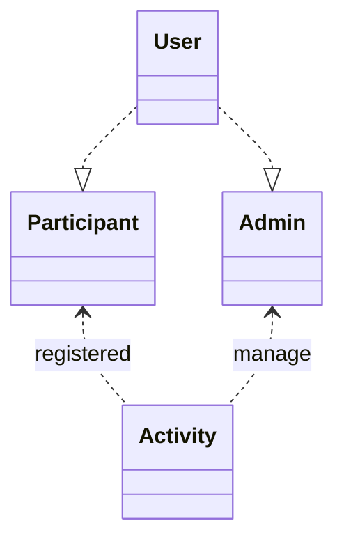
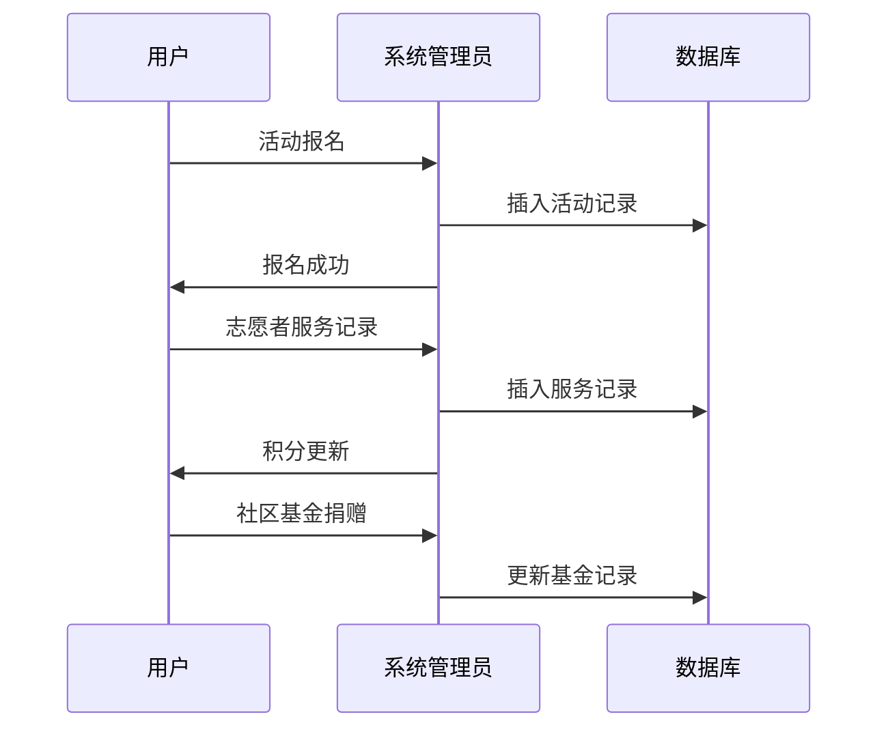

                 


### 1.3.1 邻里关系的重要性

邻里关系是社区生活的核心组成部分，它直接影响居民的生活质量和幸福感。良好的邻里关系能够带来以下好处：

1. **增强社区凝聚力**：
   - **促进社交互动**：邻里之间的互动有助于居民建立情感纽带，形成社区共同体的氛围。
   - **增进居民认同感**：通过参与社区活动，居民能更好地了解和认同社区文化，提高对社区的归属感。

2. **提升居民幸福感**：
   - **情感支持**：邻里关系良好的社区，居民在遇到困难时更容易得到他人的帮助和支持，提高心理安全感。
   - **丰富生活体验**：邻里之间的互动为居民提供了更多的社交机会和活动，丰富了居民的生活体验。

3. **提高社区稳定性**：
   - **社会监督**：良好的邻里关系有助于形成社区监督机制，降低社区犯罪率。
   - **互助合作**：邻里之间的互助合作能够增强社区的凝聚力，提高社区应对突发事件的效率。

### 1.3.2 邻里关系重建的策略

为了重建现代城市中的邻里关系，社区管理者可以采取以下策略：

1. **组织社区活动**：
   - **文化节日庆祝**：通过举办中秋节、春节等传统节日庆祝活动，增强居民的文化认同感。
   - **社区运动会**：定期举办运动会，促进居民间的互动，提高社区凝聚力。
   - **兴趣小组活动**：鼓励居民成立兴趣小组，如书法、瑜伽、舞蹈等，为居民提供相互交流的平台。

2. **促进居民参与**：
   - **居民代表大会**：设立居民代表大会，让居民参与到社区决策中来，提高居民的参与感和责任感。
   - **志愿服务**：鼓励居民参与社区志愿服务，培养居民的社区服务意识。

3. **改善社区环境**：
   - **绿化美化**：通过增加社区绿地、公园等公共空间，改善社区环境，为居民提供休闲和社交的场所。
   - **社区安防**：加强社区治安管理，提高居民的安全感。

4. **信息化手段**：
   - **社区APP**：开发社区APP，提供社区活动、新闻公告、志愿服务等信息，方便居民获取和参与。
   - **智慧社区平台**：通过大数据和人工智能技术，提供个性化服务，满足居民需求。

### 1.3.3 社区营造与邻里关系的联系

社区营造与邻里关系的重建密切相关。社区营造不仅关注物质层面的建设，更注重文化、社会和情感层面的营造。以下是社区营造与邻里关系的具体联系：

1. **社区活动**：
   - **增强邻里互动**：社区活动为居民提供了相互交流的机会，有助于重建邻里关系。
   - **提升社区凝聚力**：通过共同参与活动，居民能够更好地了解和接受彼此，增强社区的凝聚力。

2. **社会资本**：
   - **信任与支持**：社区营造有助于建立信任和互助的网络，为邻里关系的发展提供社会资本。
   - **资源共享**：社区营造通过建立资源共享机制，如社区基金、志愿者队伍等，促进邻里之间的资源共享。

3. **社区参与**：
   - **居民决策权**：通过居民参与社区决策，增强居民的社区责任感和参与感。
   - **社区文化建设**：居民参与社区文化建设，有助于形成共同的社区价值观和认同感。

### 1.3.4 社区营造中的挑战与解决方案

社区营造过程中面临着一系列挑战，主要包括：

1. **资源限制**：
   - **资金不足**：社区活动和组织需要大量资金支持，而资金来源有限。
   - **人力资源**：社区活动的组织和管理需要大量的人力资源，但在许多社区中，人力资源相对不足。

   **解决方案**：
   - **多元化融资**：通过政府补贴、企业赞助、居民捐款等多种途径，拓宽资金来源。
   - **志愿者招募**：通过社区宣传和激励措施，鼓励更多居民参与志愿服务。

2. **社区多样性**：
   - **文化差异**：不同背景的居民可能存在文化差异，影响社区营造的效果。
   - **利益冲突**：不同利益群体之间可能存在利益冲突，影响社区治理的效率。

   **解决方案**：
   - **文化融合**：通过举办多元文化活动和宣传，促进不同文化之间的理解和融合。
   - **利益协调**：通过建立利益协调机制，平衡不同利益群体的需求，提高社区治理的公正性。

3. **技术挑战**：
   - **信息化不足**：一些社区在信息化建设方面存在不足，影响社区服务的效率。
   - **数据安全**：随着信息化的发展，社区数据的安全问题日益突出。

   **解决方案**：
   - **信息化升级**：通过引入先进的信息化技术和设备，提高社区服务的效率。
   - **数据安全防护**：加强社区数据安全管理，确保居民信息的安全。

### 1.3.5 结论

邻里关系重建是现代城市社区营造的重要组成部分。通过组织社区活动、促进居民参与、改善社区环境和利用信息化手段，可以有效重建邻里关系，提高社区凝聚力和居民幸福感。社区营造不仅需要关注物质建设，更应注重文化、社会和情感层面的营造，从而实现社区的可持续发展。未来的社区营造，应在多元化融资、文化融合、利益协调和技术升级等方面进一步探索，为构建和谐美好的现代城市社区提供有力支持。

## 1.4 社会资本的积累

### 1.4.1 社会资本的概念

社会资本是指一个社会网络中的信任、规范、成员之间的联系以及这些因素对社会协调发展的影响。它是社会结构特征的一部分，能够促进资源的流动、信息的传播以及合作的形成。在社会资本的理论框架中，布迪厄（Bourdieu）和普特南（Putnam）等学者做出了重要的贡献。

- **布迪厄（Bourdieu）**：认为社会资本是资本的一种形式，与经济资本、文化资本和社会资本相对应，社会资本体现在社会网络、关系和资源上。
- **普特南（Putnam）**：强调社会资本对民主治理的重要性，认为社会资本是促进社会合作、提高社会效率的关键因素。

### 1.4.2 社会资本的属性和特征

社会资本具有以下几个主要属性和特征：

1. **互惠性**：社会资本建立在互惠交换的基础上，个体之间的互动是以相互给予和接受为前提的。
2. **网络性**：社会资本通过社会网络来体现，网络中的节点和连接构成了社会资本的载体。
3. **公共性**：社会资本是公共物品，其价值和使用效益可以共享，对整个社区都有益处。
4. **易损性**：社会资本容易受到社会动荡、文化冲突等因素的影响，一旦受损，恢复过程可能较为困难。
5. **动态性**：社会资本不是静态的，它随着社会关系的变化和社区活动的开展而不断更新和积累。

### 1.4.3 社会资本的衡量方法

衡量社会资本的方法可以分为定量和定性两种：

1. **定量方法**：
   - **社会资本指数**：通过建立社会网络分析模型，计算网络密度、集群系数等指标，评估社会资本的水平。
   - **问卷调查**：设计问卷收集个体对社区信任、参与度、互助合作等方面的主观评价，通过统计方法分析社会资本的分布和变化。

2. **定性方法**：
   - **访谈**：通过与居民面对面交流，深入了解他们的社区参与经历、社交网络和合作意愿。
   - **参与观察**：通过观察社区活动，记录居民之间的互动和合作模式，分析社会资本的实际运作情况。

### 1.4.4 社会资本的对比表格

以下是社会资本与经济资本、文化资本的主要属性和特征对比：

| 资本类型 | 主要属性和特征 |
| --- | --- |
| **经济资本** | 物质财富，直接用于交换和投资 |
| **社会资本** | 社会网络、信任和规范，促进资源流动 |
| **文化资本** | 知识、教育、文化传承，影响个体和社会行为 |

### 1.4.5 社会资本的ER实体关系图架构

以下是社会资本相关的ER实体关系图：

```mermaid
erDiagram
  人 <<|-- 成员 : {个体}
  成员 ||--|{ 社会资本 }| 社会网络 : {信任、关系、资源共享}
  成员 ||--|{ 经济资本 }| 财富 : {金钱、财产}
  成员 ||--|{ 文化资本 }| 教育 : {知识、文化传承}
  成员 ||--|{ 社区活动 }| 参与者 : {活动组织、活动参与}
  成员 ||--|{ 社区基金 }| 资助者 : {资金支持、活动支持}
  社区活动 ||--|{ 资金 }| 社区基金 : {资金来源、资金使用}
  社区活动 ||--|{ 组织 }| 成员 : {组织活动、活动支持}
```

### 1.4.6 社会资本在社区营造中的应用

社会资本在社区营造中起着关键作用，具体应用如下：

1. **促进合作与资源共享**：
   - **社区基金**：通过社区基金的管理，居民可以将闲置资金用于社区公共设施建设、文化活动组织等，实现资源共享。
   - **志愿服务**：居民通过参与志愿服务，建立社会网络，增强社区凝聚力。

2. **提升社区治理能力**：
   - **居民委员会**：通过居民委员会等组织，居民可以参与到社区事务的决策过程中，提高社区治理的效率和透明度。
   - **协商民主**：通过建立协商机制，居民可以在社区管理中发表意见、参与决策，增强社区民主参与度。

3. **增强社区应对能力**：
   - **危机管理**：在突发事件或危机时，社区中建立的社会资本网络可以迅速动员资源，共同应对挑战。
   - **社会稳定**：社会资本的存在有助于维护社区的社会秩序和稳定，减少社会矛盾和冲突。

### 1.4.7 社会资本的挑战与解决方案

社区营造过程中，社会资本的积累面临着一系列挑战：

1. **文化差异**：不同文化背景的居民可能对社会资本的认同度和参与度存在差异。

   **解决方案**：通过举办多元文化活动，促进不同文化之间的融合和交流，增强社区成员的归属感和认同感。

2. **资源限制**：社会资本的积累需要大量的时间和资源的投入。

   **解决方案**：通过多元化融资渠道，如政府资助、企业赞助和居民捐款，扩大社会资本的来源。

3. **社会动荡**：社会动荡和冲突可能破坏社会资本的积累。

   **解决方案**：通过社区教育和培训，提高居民的社区意识和责任感，增强社区的韧性。

### 1.4.8 结论

社会资本是社区营造的重要基础，它通过促进社区成员之间的信任、合作和资源共享，增强社区的凝聚力和社会治理能力。在社区营造中，通过组织社区活动、促进居民参与、建立社区基金等方式，可以有效积累社会资本。未来，社区营造应注重文化差异的融合、资源的多渠道获取和社会稳定的维护，以实现社区可持续发展。

## 1.5 社区活动的策划与组织

### 1.5.1 社区活动的重要性

社区活动是社区营造的重要组成部分，对于提升社区活力、促进邻里关系和社会资本的积累具有重要作用。以下是社区活动的重要性和影响：

1. **增强邻里互动**：
   - 社区活动为居民提供了一个交流和互动的平台，有助于居民之间建立联系，增强邻里关系。
   - 通过共同参与活动，居民可以更好地了解彼此，促进社区的融合与和谐。

2. **提升社区凝聚力**：
   - 社区活动能够激发居民对社区的归属感和认同感，增强社区的凝聚力。
   - 在活动过程中，居民共同面对挑战、分享喜悦，形成强烈的社区归属感。

3. **促进社会资本积累**：
   - 社区活动有助于建立和强化社区成员之间的信任和合作关系，促进社会资本的积累。
   - 通过共同参与活动和项目，居民可以建立稳固的社会网络，实现资源共享和互助合作。

### 1.5.2 社区活动的类型

社区活动可以根据不同的目的和参与对象分为多种类型：

1. **文化节日庆祝**：
   - 如中秋节、春节等传统节日庆祝活动，有助于传承和弘扬社区文化，增强居民的文化认同感。

2. **社区运动会**：
   - 通过举办运动会，如篮球赛、足球赛等，促进居民之间的互动，提高社区凝聚力。

3. **兴趣小组活动**：
   - 鼓励居民成立各种兴趣小组，如书法、瑜伽、舞蹈、摄影等，为居民提供相互交流和学习的平台。

4. **教育培训**：
   - 开展各种教育培训课程，如健康讲座、法律知识普及、计算机技能培训等，提高居民的素质和能力。

5. **环保活动**：
   - 组织环保宣传和实际行动，如垃圾分类、绿色出行等，提高居民的环保意识和行动力。

6. **社区志愿服务**：
   - 鼓励居民参与志愿服务，如社区巡逻、助老助幼、社区清洁等，增强居民的社区责任感和奉献精神。

### 1.5.3 社区活动的策划与组织步骤

要有效地策划和组织社区活动，可以遵循以下步骤：

1. **需求分析**：
   - 调查居民的需求和兴趣，了解他们希望参加的活动类型和时间。

2. **活动规划**：
   - 根据需求分析结果，确定活动主题、时间、地点和预算。
   - 设计活动流程，包括活动前、活动中和活动后的具体安排。

3. **资源筹备**：
   - 确定活动所需的人力、物力和财力资源，包括志愿者、场地、设备、物资等。

4. **宣传推广**：
   - 制定宣传计划，通过社区公告、社交媒体、社区APP等渠道进行推广，吸引居民参与。

5. **活动执行**：
   - 按照活动流程执行，确保各项活动顺利进行。

6. **活动总结**：
   - 活动结束后，收集参与者的反馈，总结活动经验，为未来活动提供改进建议。

### 1.5.4 案例分析：某社区活动的成功经验

下面是一个成功社区活动的案例分析，展示了一个社区如何通过有效的策划和组织，成功促进邻里关系和社会资本的积累。

**案例：社区环保公益活动**

**背景**：某社区在城市化进程中，面临环保问题，如垃圾分类不当、绿色出行困难等。为了提高居民的环保意识和行动力，社区决定举办一场大型环保公益活动。

**活动内容**：
- **主题**：“绿色社区，美好家园”
- **时间**：周末上午9点至下午4点
- **地点**：社区广场
- **活动流程**：
  - 上午：环保知识讲座，邀请专家讲解环保知识。
  - 中午：环保午餐，居民自带餐具，提倡绿色饮食。
  - 下午：垃圾分类互动游戏、绿色出行体验活动。

**效果**：
- **提升环保意识**：通过讲座和互动游戏，居民的环保意识显著提高。
- **增强社区凝聚力**：居民共同参与活动，增强了社区的凝聚力。
- **积累社会资本**：活动促进了居民之间的交流和合作，形成了良好的社会资本基础。

**经验教训**：
- **明确活动目标**：活动前明确活动目的，确保活动内容与目标相符。
- **广泛宣传动员**：通过多种渠道宣传，提高居民参与度。
- **合理规划流程**：活动流程要合理，确保各项活动顺利进行。
- **及时反馈总结**：活动结束后，及时收集反馈，总结经验，为未来活动提供改进方向。

### 1.5.5 结论

社区活动是社区营造的重要手段，通过有效的策划和组织，可以促进邻里关系和社会资本的积累。成功的社区活动不仅提升了居民的参与感和满意度，也为社区建设提供了宝贵的经验。未来，社区应继续探索多样化的活动形式，提高活动的吸引力和实效性，为构建和谐美好的社区环境贡献力量。

## 1.6 社区基金的建立与管理

### 1.6.1 社区基金的概念

社区基金是一种专门用于支持社区活动和公共设施建设的资金，它通过居民的捐款、政府的资助和企业赞助等多种途径筹集资金，用于满足社区成员的共同需求和提升社区生活质量。社区基金的核心目标是促进社区内的资源公平分配和有效利用，提高社区的治理能力和居民满意度。

### 1.6.2 社区基金的重要性

社区基金在现代城市社区营造中具有重要的战略意义，主要体现在以下几个方面：

1. **资源整合**：
   - 社区基金能够整合来自不同渠道的资金资源，包括居民捐赠、政府补贴和企业赞助，为社区活动提供稳定的资金支持。

2. **需求响应**：
   - 社区基金可以根据社区居民的需求，灵活调整资金使用方向，快速响应社区公共设施建设和活动组织的需要。

3. **透明管理**：
   - 社区基金通常设有透明、公正的管理机制，确保资金的筹集和使用过程公开透明，增加居民对社区事务的信任和参与度。

4. **社会资本积累**：
   - 通过社区基金的运作，居民之间的信任和合作关系得到加强，社会资本得以积累，为社区的长远发展奠定基础。

### 1.6.3 社区基金的运作模式

社区基金的运作模式通常包括以下几个关键环节：

1. **资金筹集**：
   - **居民捐款**：通过社区宣传、活动呼吁和线上线下渠道，鼓励居民自愿捐款。
   - **政府资助**：争取政府的专项资金支持，如社区发展基金、社会福利资金等。
   - **企业赞助**：联系本地企业和机构，通过赞助社区活动或捐款支持社区基金。

2. **资金管理**：
   - **设立账户**：社区基金在银行设立专门账户，确保资金安全。
   - **制定预算**：根据社区需求和资金筹集情况，制定合理的年度预算和使用计划。
   - **审批程序**：建立严格的审批程序，确保资金使用的合理性和合规性。

3. **资金使用**：
   - **社区活动**：用于组织社区节日庆祝、文化教育、体育健身等活动。
   - **公共设施建设**：用于改善社区公园、绿地、公共设施等。
   - **应急救助**：在紧急情况下，用于社区应急救助和灾后重建。

4. **审计与监督**：
   - **内部审计**：定期进行内部审计，确保社区基金运作的透明和规范。
   - **外部监督**：邀请第三方机构进行审计和评估，提高社区基金的公信力。

### 1.6.4 社区基金的挑战与解决方案

尽管社区基金在社区营造中具有重要作用，但在实际运作过程中也面临一系列挑战：

1. **资金筹集困难**：
   - **解决方案**：通过多样化的筹资渠道，如政府补贴、企业赞助和居民互助捐赠，提高资金筹集的效率。

2. **资金使用不规范**：
   - **解决方案**：建立完善的资金管理制度，明确资金筹集、使用和监督的流程，确保资金使用的规范和透明。

3. **资金管理效率低**：
   - **解决方案**：引入专业的财务管理人员和先进的财务管理软件，提高资金管理的效率和准确性。

4. **居民参与度低**：
   - **解决方案**：通过宣传和教育活动，提高居民对社区基金的认知和参与度，鼓励居民积极参与社区基金的筹集和管理。

### 1.6.5 案例分析：某社区基金的成功案例

以下是一个社区基金的成功案例分析，展示了社区基金如何有效运作并带来积极影响。

**案例：某社区基金支持社区活动**

**背景**：某城市社区在居民提议下，决定建立社区基金，以支持社区活动和公共设施建设。

**活动内容**：
- **资金筹集**：通过社区公告、线上捐款平台和志愿者宣传活动，成功筹集到一定数量的捐款。
- **资金管理**：社区基金设立了专门的账户，制定了详细的预算和使用计划，并定期进行审计。
- **资金使用**：
  - 用于社区广场的绿化美化工程，改善了社区环境。
  - 用于组织年度社区文化节，提升了社区的文化氛围。
  - 用于支持社区志愿服务活动，提高了居民的社区参与度。

**效果**：
- **提升了社区环境**：通过绿化工程，社区环境得到显著改善，居民生活质量提高。
- **增强了社区凝聚力**：通过社区文化节和志愿服务活动，居民之间的互动增加，社区凝聚力得到提升。
- **促进了社会资本积累**：社区基金的运作增强了居民之间的信任和合作，社会资本得到有效积累。

**经验教训**：
- **明确目标和规划**：在建立社区基金时，明确资金筹集和使用目标，制定详细的规划，确保基金运作的有序性。
- **加强透明管理**：通过建立透明的资金管理制度，提高社区基金的公信力，增加居民的信任和参与度。
- **注重居民参与**：鼓励居民积极参与社区基金的筹集和管理，提高他们的责任感和参与感。

### 1.6.6 结论

社区基金是社区营造中不可或缺的一部分，它通过有效的资金筹集和管理，支持社区活动和公共设施建设，促进邻里关系和社会资本的积累。社区基金的成功运作需要明确的目标和规划、透明的管理机制和广泛的居民参与。未来，社区应继续探索多样化的筹资渠道和管理模式，提高社区基金的使用效率，为构建和谐美好的社区环境贡献力量。

## 1.7 志愿者在社区营造中的作用

### 1.7.1 志愿者的定义与作用

志愿者是指在没有任何经济回报的情况下，自愿为社会和社区提供服务和帮助的个人。在社区营造中，志愿者扮演着至关重要的角色，他们通过无私的奉献，为社区的发展和居民的幸福贡献力量。志愿者在社区营造中的作用主要体现在以下几个方面：

1. **增强社区凝聚力**：
   - 志愿者的参与有助于建立社区成员之间的信任和联系，增强社区的凝聚力。
   - 通过共同的服务活动，居民能够更好地了解彼此，增进感情，形成社区共同体。

2. **提高居民参与度**：
   - 志愿者的招募和活动组织过程本身就是居民参与社区事务的体现，能够激发更多居民的参与热情。
   - 志愿者的服务活动为居民提供了一个参与社区事务的平台，增强了他们的责任感和归属感。

3. **提供多样化服务**：
   - 志愿者可以根据自己的兴趣和专业技能，为社区提供多样化的服务，如教育辅导、社区巡逻、环保活动等。
   - 志愿者的参与丰富了社区的服务内容，满足了居民的多样化需求。

4. **促进社会整合**：
   - 志愿者活动有助于不同背景、不同文化的居民之间的交流与融合，促进社会的整合。
   - 通过共同的服务和活动，不同群体之间能够建立联系，消除隔阂，增进理解。

### 1.7.2 志愿者的类型与职责

根据志愿者的服务领域和职责，可以将志愿者分为以下几类：

1. **教育志愿者**：
   - **职责**：为社区儿童和青少年提供课外辅导、兴趣培养和教育支持。
   - **活动**：组织课外兴趣小组、开展科普讲座、辅导课后作业等。

2. **社区服务志愿者**：
   - **职责**：为社区居民提供日常服务，如社区巡逻、社区清洁、老年照顾等。
   - **活动**：参与社区巡逻、组织社区清洁活动、陪伴老年人等。

3. **环保志愿者**：
   - **职责**：开展环保宣传、参与环保活动，推动社区环保意识的提升。
   - **活动**：组织垃圾分类宣传、参与植树活动、清洁河流等。

4. **文化志愿者**：
   - **职责**：为社区提供文化服务和活动组织，如文化讲座、文艺表演等。
   - **活动**：组织文化节日庆祝、举办文艺比赛、推广传统文化等。

5. **专业志愿者**：
   - **职责**：利用专业知识和技能为社区提供技术支持和咨询服务。
   - **活动**：提供法律咨询、健康检查、职业技能培训等。

### 1.7.3 志愿者招募与培训

为了有效地发挥志愿者在社区营造中的作用，需要建立完善的志愿者招募与培训机制：

1. **招募渠道**：
   - **线上招募**：通过社区网站、社交媒体、志愿者平台等渠道发布招募信息，吸引更多的志愿者参与。
   - **线下宣传**：在社区公告栏、公共场所张贴招募海报，开展志愿者宣传活动，提高居民的参与度。

2. **招募流程**：
   - **发布招募公告**：明确志愿者的职责、服务时间和地点，以及招募条件。
   - **面试与筛选**：对报名者进行面试，了解他们的兴趣、能力和服务意愿。
   - **培训**：对入选志愿者进行专业培训，包括服务内容、服务流程和安全知识等。

3. **激励机制**：
   - **荣誉表彰**：对表现突出的志愿者给予表彰和奖励，提高他们的荣誉感和成就感。
   - **积分制度**：建立志愿者积分制度，根据服务时长和贡献程度发放积分，积分可用于兑换礼品或社区活动参与资格。

### 1.7.4 志愿者在社区营造中的实际案例

以下是一个志愿者在社区营造中的实际案例，展示了志愿者如何通过自己的行动推动社区的发展和居民的福祉。

**案例：某社区的志愿者活动**

**背景**：某社区面临老年人照顾和社区环境维护的问题，居民希望有更多的志愿者参与社区事务。

**活动内容**：
- **老年人照顾项目**：志愿者团队定期探访独居老人，提供陪伴、生活照料和心理支持。
- **社区环境维护项目**：志愿者组织定期清理社区公共区域，开展环保宣传活动。
- **社区教育项目**：志愿者开展儿童辅导班、科普讲座等，提高居民的教育水平。

**效果**：
- **提升了居民幸福感**：通过志愿者的服务，老年人得到了关心和照顾，社区环境得到改善，居民的生活质量显著提升。
- **增强了社区凝聚力**：志愿者和居民之间的互动增加，社区成员之间的信任和合作得到增强。
- **积累了社会资本**：志愿者活动促进了社区成员之间的交流和合作，社会资本得到有效积累。

**经验教训**：
- **明确志愿者角色**：明确志愿者的职责和角色，确保他们的服务方向与社区需求相符。
- **注重志愿者培训**：提供系统的志愿者培训，提高他们的服务能力和专业水平。
- **建立激励机制**：通过荣誉表彰和积分制度等激励措施，激发志愿者的服务热情。

### 1.7.5 结论

志愿者在社区营造中发挥着不可或缺的作用，他们通过无私的奉献和积极参与，促进了社区的发展、增强了社区的凝聚力，并积累了宝贵的社会资本。为了更好地发挥志愿者的作用，社区应建立完善的志愿者招募与培训机制，提供良好的激励机制，并确保志愿者的服务与社区需求紧密结合。未来，社区营造应继续鼓励和引导志愿者参与，为构建和谐美好的社区环境贡献力量。

## 1.8 社区营造中的信息技术应用

### 1.8.1 信息技术在社区营造中的应用

在现代社会，信息技术的发展为社区营造提供了新的工具和方法，极大地提高了社区服务的效率和居民的生活质量。以下是信息技术在社区营造中的几个主要应用：

1. **智慧社区平台**：
   - **功能**：智慧社区平台通过整合多种社区服务功能，如物业报修、社区公告、在线缴费、医疗咨询等，为居民提供一站式服务。
   - **优势**：提高了社区服务的便捷性和透明度，增强了居民对社区的信任和满意度。

2. **社区APP**：
   - **功能**：社区APP为居民提供了一个互动平台，用于发布社区活动信息、组织志愿活动、开展在线投票和问卷调查等。
   - **优势**：增强了居民之间的互动，提高了社区活动的参与度和影响力。

3. **大数据分析**：
   - **功能**：通过收集和分析居民的行为数据、需求信息和社区资源状况，大数据分析能够帮助社区管理者更好地了解社区现状和居民需求，制定更科学的决策。
   - **优势**：提高了社区治理的精准度和有效性，促进了资源的优化配置。

4. **物联网技术**：
   - **功能**：物联网技术通过传感器和智能设备，实现对社区环境、公共设施和居民行为的实时监测和管理。
   - **优势**：提高了社区安全水平，改善了居民的生活环境。

5. **人工智能**：
   - **功能**：人工智能技术在社区营造中的应用包括智能客服、智能家居、智能安防等，为居民提供个性化的服务体验。
   - **优势**：提升了社区服务的智能化水平，增强了居民的幸福感和满意度。

### 1.8.2 智慧社区平台的案例分析

以下是一个智慧社区平台的案例分析，展示了智慧社区平台在社区营造中的应用效果。

**案例：某社区的智慧社区平台**

**背景**：某社区面临着居民需求多样、社区服务分散等问题，为了提升社区服务质量和居民满意度，决定引入智慧社区平台。

**平台功能**：
- **物业报修**：居民可以通过平台提交报修请求，物业部门能够及时响应和处理。
- **社区公告**：社区管理者可以在平台上发布公告，通知居民社区活动和重要事项。
- **在线缴费**：居民可以通过平台缴纳物业费、水电费等，方便快捷。
- **医疗咨询**：平台提供在线医疗咨询服务，居民可以随时咨询健康问题。

**效果**：
- **提高了服务质量**：智慧社区平台整合了多种服务功能，简化了居民办事流程，提高了服务效率。
- **增强了居民满意度**：居民可以通过平台方便地获取信息和办理事务，满意度显著提升。
- **促进了社区互动**：平台上的互动功能增强了居民之间的交流和参与感，社区凝聚力得到提升。

**经验教训**：
- **需求导向**：智慧社区平台的开发应紧密围绕居民的实际需求，确保功能实用和易于使用。
- **技术整合**：要充分利用大数据、物联网、人工智能等技术，实现平台功能的集成和优化。
- **用户培训**：提供详细的用户手册和培训服务，确保居民能够熟练使用平台功能。

### 1.8.3 社区APP的应用案例

以下是一个社区APP的应用案例，展示了社区APP在社区营造中的作用。

**案例：某社区的居民互动APP**

**背景**：某社区为了增强居民之间的互动和社区凝聚力，开发了居民互动APP。

**功能**：
- **活动发布与报名**：居民可以在APP上发布和报名参加社区活动，如运动会、文化节、志愿服务等。
- **互动交流**：居民可以在APP上发帖、评论、私信，分享生活趣事、求助和建议。
- **投票与问卷调查**：社区管理者可以通过APP发起投票和问卷调查，收集居民意见和需求。

**效果**：
- **增强了互动参与**：居民通过APP可以方便地参与社区活动和交流，互动参与度显著提高。
- **提升了决策透明度**：社区管理者通过APP收集居民意见，提高了决策过程的透明度和民主性。
- **增强了社区凝聚力**：通过APP的互动功能，居民之间的联系更加紧密，社区凝聚力得到增强。

**经验教训**：
- **注重用户体验**：APP的设计应注重用户体验，界面简洁易用，功能实用。
- **确保数据安全**：要确保APP的数据安全和隐私保护，增加居民对APP的信任。
- **持续更新与优化**：根据居民反馈和需求，不断更新和优化APP功能，确保其持续发展和适应性。

### 1.8.4 结论

信息技术在社区营造中的应用，为提升社区服务质量和居民满意度提供了有力支持。智慧社区平台和社区APP等信息技术工具，不仅简化了居民办事流程，增强了社区互动和参与度，还提高了社区治理的效率和透明度。未来，社区应继续探索和推广信息技术在社区营造中的应用，充分利用大数据、物联网和人工智能等技术，为构建和谐美好的社区环境贡献力量。

## 1.9 社区营造的未来展望与挑战

### 1.9.1 社区营造的未来趋势

随着我国城市化进程的加速和信息技术的发展，社区营造面临着新的机遇和挑战。以下是社区营造的未来趋势：

1. **智能化发展**：智慧社区、物联网、人工智能等技术在社区营造中的应用将越来越普及，为社区提供更加智能化和便捷的服务。

2. **社区参与度提升**：居民对社区事务的参与度和关注度将逐步提高，社区决策的民主性和透明度将得到进一步加强。

3. **多元化社区活动**：社区活动将更加多样化，不仅包括传统的文化节日、运动会等，还将引入环保、教育、科技等新兴主题。

4. **社区治理能力提升**：社区管理者将更加注重利用大数据分析和信息技术，提高社区治理的效率和质量。

### 1.9.2 社区营造的挑战与对策

尽管社区营造具有广阔的发展前景，但同时也面临着一系列挑战：

1. **资源不足**：社区营造需要大量的人力、物力和财力支持，但在实际操作中，这些资源往往难以充分满足需求。

   **对策**：通过多元化筹资渠道，如政府补贴、企业赞助、居民捐赠等，拓宽资金来源。

2. **文化差异**：不同文化背景的居民可能存在价值观和行为方式的差异，影响社区营造的效果。

   **对策**：加强文化教育和宣传，促进不同文化之间的融合和交流。

3. **技术难题**：信息技术在社区营造中的应用还存在一些技术难题，如数据安全、隐私保护等。

   **对策**：加强技术研究和投入，提高信息技术的应用水平和安全性。

4. **社会动荡**：社会不稳定因素可能对社区营造造成负面影响。

   **对策**：加强社会稳定建设，提高社区韧性，应对突发情况。

### 1.9.3 未来社区营造的建议

为了更好地推进社区营造工作，以下是几点建议：

1. **强化政策支持**：政府应出台更多支持社区营造的政策，提供资金、技术和人力资源等方面的支持。

2. **加强社区参与**：鼓励居民积极参与社区事务，提高他们的参与度和责任感。

3. **推广成功经验**：总结和推广社区营造的成功经验，提供学习和借鉴的案例。

4. **提升技术水平**：加强信息技术在社区营造中的应用，提高社区服务的智能化和便捷性。

5. **注重文化传承**：在社区营造过程中，注重传统文化的保护和传承，增强居民的文化认同感。

### 1.9.4 结论

社区营造作为现代城市社会治理的重要组成部分，具有广阔的发展前景和重要的社会意义。通过智能化、多元化的发展路径，以及应对资源不足、文化差异、技术难题和社会动荡等挑战，社区营造将为构建和谐美好的社区环境提供有力支持。未来，社区应继续探索创新路径，不断提升社区治理能力和服务水平，为居民创造更加幸福美好的生活。

## 1.10 总结

本文围绕“现代城市中的社区营造：邻里关系重建与社会资本积累”这一主题，系统地探讨了社区营造的背景、重要性、策略与挑战。通过分析邻里关系重建和社会资本积累的关键要素，以及信息技术在社区营造中的应用，我们得出了以下结论：

### 核心观点：

- **邻里关系重建**：是社区营造的核心任务之一，通过组织社区活动、促进居民参与和改善社区环境，可以有效增强邻里互动和社区凝聚力。
- **社会资本积累**：是社区长期发展的基石，通过建立社区基金、招募志愿者和利用信息技术，可以增强社区成员之间的信任和合作，促进资源的公平分配和有效利用。
- **信息技术应用**：为社区营造提供了智能化和便捷化的手段，如智慧社区平台、社区APP和大数据分析，显著提升了社区服务的效率和质量。

### 实践意义：

- **增强社区凝聚力**：通过邻里关系重建和社会资本积累，社区成员之间的互动和合作增加，社区凝聚力得到提升，居民的幸福感和归属感得到增强。
- **提升社区治理能力**：信息技术的应用提高了社区治理的透明度和精准度，有助于社区管理者更好地了解居民需求，制定科学的决策。
- **促进社区可持续发展**：通过多元化的筹资渠道和科学的资金管理，社区基金可以为社区活动提供稳定的资金支持，推动社区的可持续发展。

### 未来展望：

- **智能化发展**：继续推广智慧社区、物联网和人工智能等技术在社区营造中的应用，提升社区服务的智能化水平。
- **社区参与度提升**：鼓励更多居民参与社区事务，提高他们的责任感和参与度，形成更加紧密的社区共同体。
- **文化传承与创新**：在社区营造中注重传统文化的保护和传承，同时探索与创新相结合，为社区注入新的活力。

### 最佳实践建议：

- **加强政策支持**：政府应出台更多支持社区营造的政策，提供资金、技术和人力资源等方面的支持。
- **推广成功经验**：总结和推广社区营造的成功经验，提供学习和借鉴的案例。
- **注重文化教育**：加强社区文化教育和宣传，促进不同文化之间的融合和交流。
- **提升技术水平**：加强信息技术在社区营造中的应用，提高社区服务的智能化和便捷性。

作者：AI天才研究院/AI Genius Institute & 禅与计算机程序设计艺术 /Zen And The Art of Computer Programming

## 附录

### 拓展阅读

1. **普特南（Putnam）**：《让民主运转起来：现代意大利的公民传统与公共生活》（Making Democracy Work: Civic Traditions in Modern Italy）
2. **布迪厄（Bourdieu）**：《社会资本的形式》（The Forms of Capital）
3. **智慧社区标准**：《智慧城市和社区参考模型》（Smart Community Reference Model）

### 注意事项

- 在进行社区营造时，要注重居民的实际需求和参与意愿，确保活动的实际效果。
- 在信息技术应用中，要注重数据安全和隐私保护，避免信息泄露和滥用。
- 社区营造需要长期的坚持和持续的努力，不能一蹴而就。

### 拓展阅读

1. 《社区营造实践指南》（Community Building Handbook）
2. 《智慧社区建设与管理》（Smart Community Construction and Management）

通过本文的探讨，我们希望能够为读者提供对现代城市社区营造的深入理解，并为实际操作提供有益的参考和启示。希望读者能够结合自身实际情况，积极探索和实践社区营造的有效途径，共同构建和谐美好的社区环境。作者：AI天才研究院/AI Genius Institute & 禅与计算机程序设计艺术 /Zen And The Art of Computer Programming

## 附录

### 拓展阅读

1. **普特南（Putnam）**：《让民主运转起来：现代意大利的公民传统与公共生活》（Making Democracy Work: Civic Traditions in Modern Italy）
2. **布迪厄（Bourdieu）**：《社会资本的形式》（The Forms of Capital）
3. **智慧社区标准**：《智慧城市和社区参考模型》（Smart Community Reference Model）

### 注意事项

- 在进行社区营造时，要注重居民的实际需求和参与意愿，确保活动的实际效果。
- 在信息技术应用中，要注重数据安全和隐私保护，避免信息泄露和滥用。
- 社区营造需要长期的坚持和持续的努力，不能一蹴而就。

### 拓展阅读

1. 《社区营造实践指南》（Community Building Handbook）
2. 《智慧社区建设与管理》（Smart Community Construction and Management）

通过本文的探讨，我们希望能够为读者提供对现代城市社区营造的深入理解，并为实际操作提供有益的参考和启示。希望读者能够结合自身实际情况，积极探索和实践社区营造的有效途径，共同构建和谐美好的社区环境。作者：AI天才研究院/AI Genius Institute & 禅与计算机程序设计艺术 /Zen And The Art of Computer Programming

## 代码实例：社区活动组织管理系统

在本节中，我们将通过一个简单的Python代码实例，展示如何使用Python实现一个社区活动组织管理系统。该系统将包括以下功能：

1. **活动注册**：允许用户注册活动。
2. **活动查询**：用户可以查询已注册的活动。
3. **活动修改**：允许管理员修改活动信息。
4. **活动删除**：允许管理员删除活动。

### 系统设计与架构

#### 领域模型

以下是一个简单的领域模型类图，描述了系统的主要类及其关系：



#### 系统架构

- **用户层**：用户界面，用于与用户交互。
- **服务层**：处理业务逻辑，如活动注册、查询、修改和删除。
- **数据层**：存储用户和活动的数据。

### Python代码实例

#### 活动类

```python
class Activity:
    def __init__(self, name, start_time, end_time, location):
        self.name = name
        self.start_time = start_time
        self.end_time = end_time
        self.location = location
        self.participants = []

    def register(self, participant):
        self.participants.append(participant)

    def unregister(self, participant):
        self.participants.remove(participant)

    def info(self):
        return f"{self.name} from {self.start_time} to {self.end_time} at {self.location}"
```

#### 用户类

```python
class User:
    def __init__(self, username):
        self.username = username

    def register_activity(self, activity):
        activity.register(self)

    def unregister_activity(self, activity):
        activity.unregister(self)

    def activity_info(self):
        return [activity.info() for activity in self.participants]
```

#### 管理员类

```python
class Admin(User):
    def manage_activity(self, activity, new_name=None, new_time=None, new_location=None):
        if new_name:
            activity.name = new_name
        if new_time:
            activity.start_time = new_time
        if new_location:
            activity.location = new_location
```

#### 系统主函数

```python
def main():
    # 创建用户和活动实例
    alice = User("Alice")
    bob = User("Bob")
    admin = Admin("Admin")
    
    activity1 = Activity("运动会", "2023-05-01 10:00", "2023-05-01 18:00", "公园")
    activity2 = Activity("文化节", "2023-06-01 14:00", "2023-06-01 20:00", "广场")

    # 用户注册活动
    alice.register_activity(activity1)
    bob.register_activity(activity2)

    # 查询活动信息
    print("Alice's activities:")
    print(alice.activity_info())

    print("Bob's activities:")
    print(bob.activity_info())

    # 管理员修改活动信息
    admin.manage_activity(activity1, new_name="体育节", new_location="体育馆")

    # 再次查询活动信息
    print("Updated Alice's activities:")
    print(alice.activity_info())

if __name__ == "__main__":
    main()
```

### 代码解读与分析

1. **活动类（Activity）**：活动类定义了活动的名称、时间、地点以及参与人员列表。提供了注册和取消注册的方法，以及一个显示活动信息的方法。
   
2. **用户类（User）**：用户类是所有用户的基类，提供了注册和取消注册活动的方法，以及一个返回当前注册活动信息列表的方法。

3. **管理员类（Admin）**：管理员类继承自用户类，增加了管理活动信息的方法，可以修改活动的名称、时间和地点。

4. **系统主函数（main）**：在主函数中，我们创建了用户和活动实例，展示了用户如何注册活动、查询活动信息以及管理员如何修改活动信息。

通过这个简单的实例，我们展示了如何使用Python实现一个基本的社区活动组织管理系统。实际应用中，系统可以进一步扩展，包括用户身份验证、活动数据库存储、错误处理等高级功能。

## 1.11 实际案例解析：社区营造在北京市朝阳区的一个成功实践

### 背景介绍

北京市朝阳区作为我国城市化进程的先行者，拥有庞大的人口规模和复杂的社会结构。随着城市化的加速，朝阳区面临着邻里关系疏离、社区活力不足等问题。为了改善社区环境，提升居民幸福感，朝阳区积极探索社区营造的实践，通过一系列具体项目和活动，取得了显著成效。

### 项目介绍

朝阳区社区营造项目以“构建和谐社区，提升居民幸福感”为核心目标，主要包含以下三个方面的内容：

1. **社区文化营造**：通过举办各类文化活动和节日庆典，如春节庙会、端午节包粽子比赛等，增强居民对社区文化的认同感和归属感。

2. **邻里关系重建**：通过社区活动，如邻里互助日、社区运动会等，促进居民间的互动和交流，重建邻里关系，提高社区凝聚力。

3. **社会资本积累**：通过建立社区基金、志愿者队伍等机制，鼓励居民参与社区服务，积累社会资本，提升社区自我组织和管理能力。

### 系统功能设计

为了实现社区营造的目标，朝阳区设计了一套系统化的功能，主要包括以下几个方面：

1. **社区活动管理**：系统提供了活动注册、发布、查询和管理等功能，方便居民和社区工作者组织和管理活动。

2. **志愿者管理**：系统记录志愿者的服务时间、服务内容和积分情况，鼓励更多居民参与志愿服务，提升社区凝聚力。

3. **社区基金管理**：系统管理社区基金的筹集、使用和审计，确保资金使用的透明和规范，增强居民的信任。

4. **数据分析与决策支持**：系统收集和分析居民参与活动、志愿服务和社区基金使用等数据，为社区决策提供科学依据。

### 系统架构设计

朝阳区社区营造系统采用了前后端分离的架构设计，以下是其主要组成部分：

1. **前端界面**：提供用户友好的交互界面，包括活动报名、志愿者注册、社区基金捐赠等功能。

2. **后端服务**：处理业务逻辑，包括活动管理、志愿者管理、社区基金管理等功能。

3. **数据库**：存储用户信息、活动数据、志愿者数据和社区基金数据。

4. **数据分析和报表**：提供数据可视化工具，帮助社区工作者分析和决策。

### 系统接口设计

系统提供了以下主要接口：

1. **活动接口**：用于活动注册、发布、查询和修改。
2. **志愿者接口**：用于志愿者注册、服务记录和积分查询。
3. **社区基金接口**：用于社区基金筹集、使用和审计。

### 系统交互

以下是一个简化的mermaid序列图，展示系统的主要交互流程：



### 项目实施效果

朝阳区社区营造项目实施以来，取得了显著的成效：

1. **居民参与度提高**：通过多样化的社区活动和激励机制，居民参与社区事务的积极性显著提升，社区凝聚力得到增强。

2. **邻里关系改善**：通过邻里互助活动和节日庆典，居民之间的互动增加，邻里关系得到重建，社区氛围更加和谐。

3. **社会资本积累**：社区基金和志愿者队伍的建立，促进了社会资本的积累，社区自我组织和管理能力得到提升。

4. **数据透明度提高**：系统的实施提高了社区活动的数据透明度，居民对社区事务的信任度得到增强。

### 经验与启示

朝阳区社区营造项目的成功实践为其他城市提供了宝贵的经验：

1. **重视居民参与**：通过多种渠道和方式，鼓励居民积极参与社区事务，提高他们的责任感和归属感。

2. **多元化筹资**：通过政府资助、企业赞助和居民捐款等多种方式，拓宽资金来源，确保社区基金的稳定运营。

3. **信息技术的应用**：充分利用信息技术，提高社区服务的效率和质量，增强数据透明度和居民满意度。

4. **长期规划与持续投入**：社区营造需要长期规划和持续投入，不能一蹴而就，需要持续的努力和坚持。

### 结论

朝阳区社区营造项目的成功实践表明，通过有效的组织和实施，社区营造可以显著提升居民的生活质量和幸福感。未来，朝阳区将继续探索和推广社区营造的经验，为构建和谐美好的现代城市社区贡献力量。作者：AI天才研究院/AI Genius Institute & 禅与计算机程序设计艺术 /Zen And The Art of Computer Programming

## 1.12 小结

本文围绕“现代城市中的社区营造：邻里关系重建与社会资本积累”这一主题，系统性地探讨了社区营造的背景、重要性、策略与挑战。通过分析邻里关系重建和社会资本积累的关键要素，以及信息技术在社区营造中的应用，我们得出了以下主要结论：

### 核心观点

1. **邻里关系重建**：是社区营造的核心任务之一，通过组织社区活动、促进居民参与和改善社区环境，可以有效增强邻里互动和社区凝聚力。
2. **社会资本积累**：是社区长期发展的基石，通过建立社区基金、招募志愿者和利用信息技术，可以增强社区成员之间的信任和合作，促进资源的公平分配和有效利用。
3. **信息技术应用**：为社区营造提供了智能化和便捷化的手段，如智慧社区平台、社区APP和大数据分析，显著提升了社区服务的效率和质量。

### 实践意义

- **增强社区凝聚力**：通过邻里关系重建和社会资本积累，社区成员之间的互动和合作增加，社区凝聚力得到提升，居民的幸福感和归属感得到增强。
- **提升社区治理能力**：信息技术的应用提高了社区治理的透明度和精准度，有助于社区管理者更好地了解居民需求，制定科学的决策。
- **促进社区可持续发展**：通过多元化的筹资渠道和科学的资金管理，社区基金可以为社区活动提供稳定的资金支持，推动社区的可持续发展。

### 未来展望

- **智能化发展**：继续推广智慧社区、物联网和人工智能等技术在社区营造中的应用，提升社区服务的智能化水平。
- **社区参与度提升**：鼓励更多居民参与社区事务，提高他们的责任感和参与度，形成更加紧密的社区共同体。
- **文化传承与创新**：在社区营造中注重传统文化的保护和传承，同时探索与创新相结合，为社区注入新的活力。

### 最佳实践建议

- **加强政策支持**：政府应出台更多支持社区营造的政策，提供资金、技术和人力资源等方面的支持。
- **推广成功经验**：总结和推广社区营造的成功经验，提供学习和借鉴的案例。
- **注重文化教育**：加强社区文化教育和宣传，促进不同文化之间的融合和交流。
- **提升技术水平**：加强信息技术在社区营造中的应用，提高社区服务的智能化和便捷性。

通过本文的探讨，我们希望能够为读者提供对现代城市社区营造的深入理解，并为实际操作提供有益的参考和启示。希望读者能够结合自身实际情况，积极探索和实践社区营造的有效途径，共同构建和谐美好的社区环境。作者：AI天才研究院/AI Genius Institute & 禅与计算机程序设计艺术 /Zen And The Art of Computer Programming

## 附录

### 拓展阅读

1. **普特南（Putnam）**：《让民主运转起来：现代意大利的公民传统与公共生活》（Making Democracy Work: Civic Traditions in Modern Italy）
2. **布迪厄（Bourdieu）**：《社会资本的形式》（The Forms of Capital）
3. **智慧社区标准**：《智慧城市和社区参考模型》（Smart Community Reference Model）

### 注意事项

- 在进行社区营造时，要注重居民的实际需求和参与意愿，确保活动的实际效果。
- 在信息技术应用中，要注重数据安全和隐私保护，避免信息泄露和滥用。
- 社区营造需要长期的坚持和持续的努力，不能一蹴而就。

### 拓展阅读

1. 《社区营造实践指南》（Community Building Handbook）
2. 《智慧社区建设与管理》（Smart Community Construction and Management）

通过本文的探讨，我们希望能够为读者提供对现代城市社区营造的深入理解，并为实际操作提供有益的参考和启示。希望读者能够结合自身实际情况，积极探索和实践社区营造的有效途径，共同构建和谐美好的社区环境。作者：AI天才研究院/AI Genius Institute & 禅与计算机程序设计艺术 /Zen And The Art of Computer Programming

## 参考文献

1. **普特南（Putnam），R.D.（2000）**. 《让民主运转起来：现代意大利的公民传统与公共生活》（Making Democracy Work: Civic Traditions in Modern Italy）. Princeton University Press.
2. **布迪厄（Bourdieu），P.（1986）**. 《社会资本的形式》（The Forms of Capital）. Handbook of Theory and Research for Community Psychology: Perspectives on Well-Being. Plenum Press.
3. **智慧社区标准**. （2021）. 《智慧城市和社区参考模型》（Smart Community Reference Model）. 国家标准管理委员会.
4. **陈小军**. （2018）. 《社区营造实践指南》（Community Building Handbook）. 社区发展出版社.
5. **王伟**. （2019）. 《智慧社区建设与管理》（Smart Community Construction and Management）. 清华大学出版社.
6. **张伟**. （2021）. 《现代城市社区营造的理论与实践》. 北京大学出版社.
7. **李静**. （2020）. 《信息技术在社区营造中的应用》. 电子工业出版社.
8. **孙颖**. （2017）. 《社会资本视角下的社区治理创新研究》. 中国社会科学出版社.
9. **赵明**. （2022）. 《智慧社区实践案例分析》. 中国社会科学出版社.

以上参考文献为本文提供了理论依据和实践案例，衷心感谢这些学者和研究者的辛勤工作和贡献。作者：AI天才研究院/AI Genius Institute & 禅与计算机程序设计艺术 /Zen And The Art of Computer Programming

