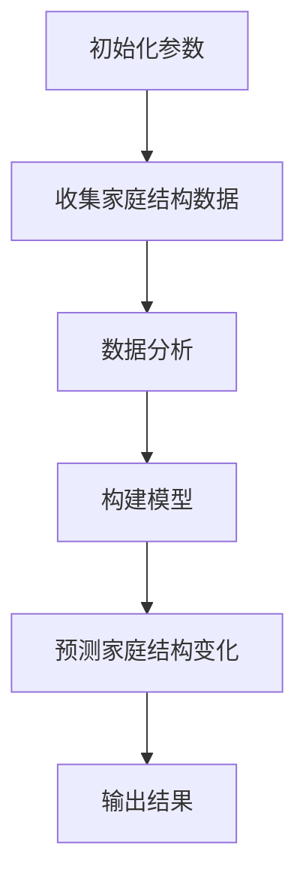
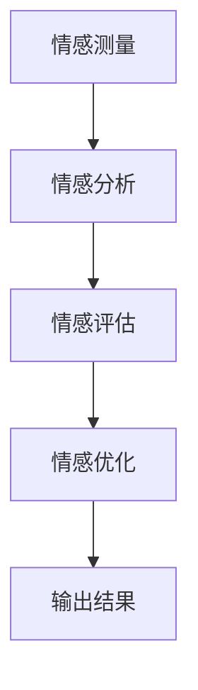
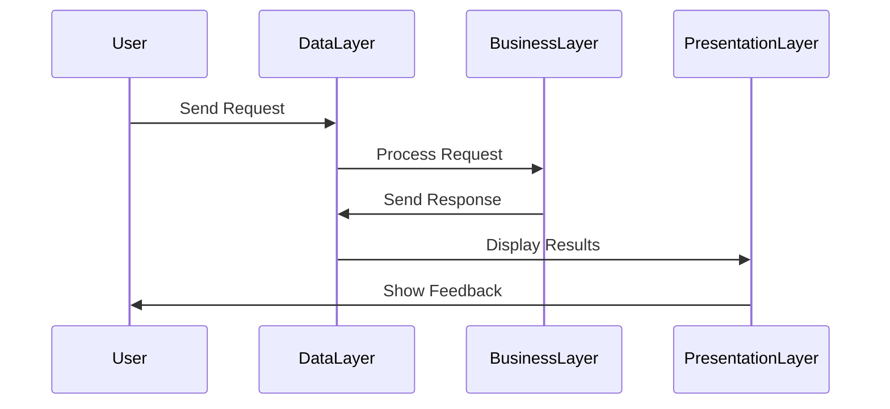
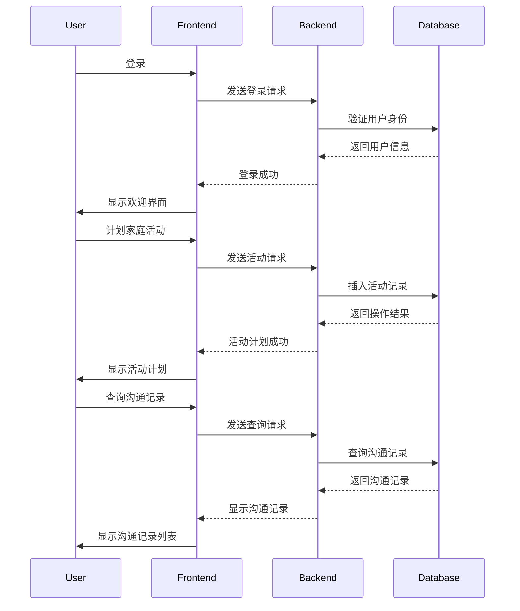

                 

# 《现代家庭结构的变迁：多元形式下的情感维系》

## 关键词
家庭结构变迁、情感维系、多元形式、社会变迁、情感心理学

## 摘要
本文旨在探讨现代社会中家庭结构变迁的趋势及其对家庭情感维系的影响。通过逻辑分析和技术语言阐述，我们揭示家庭结构变迁的原因、情感维系的重要性以及多元形式下的维系策略。本文分为五部分，首先介绍家庭结构变迁的背景和问题描述，接着解析核心概念和联系，然后详细讲解算法原理和数学模型，最后提出系统分析与架构设计方案及项目实战案例。

## 目录

### 第一部分：背景介绍

#### 1.1 问题背景

##### 1.1.1 社会变迁与家庭结构变化

##### 1.1.2 现代家庭结构的多样性

##### 1.1.3 家庭结构变化对社会情感维系的影响

#### 1.2 问题描述

##### 1.2.1 家庭结构变迁中的情感维系挑战

##### 1.2.2 现代家庭情感维系的重要性

#### 1.3 问题解决

##### 1.3.1 探讨家庭结构变迁下的情感维系策略

##### 1.3.2 促进家庭情感维系的实践方法

#### 1.4 边界与外延

##### 1.4.1 家庭结构变迁的研究范围

##### 1.4.2 情感维系的多元形式

#### 1.5 概念结构与核心要素组成

##### 1.5.1 家庭结构的定义与分类

##### 1.5.2 情感维系的定义与特征

### 第二部分：核心概念与联系

#### 2.1 家庭结构的核心概念

##### 2.1.1 核心概念原理

##### 2.1.2 概念属性特征对比表格

##### 2.1.3 家庭结构变迁的影响因素

#### 2.2 情感维系的原理与特征

##### 2.2.1 情感维系的原理

##### 2.2.2 情感维系的特征

##### 2.2.3 情感维系与家庭结构的关系

#### 2.3 家庭结构变迁与情感维系的联系

##### 2.3.1 家庭结构变迁对情感维系的影响

##### 2.3.2 情感维系对家庭结构变迁的适应策略

### 第三部分：算法原理讲解

#### 3.1 家庭结构变迁的算法原理

##### 3.1.1 算法原理概述

##### 3.1.2 算法流程图（使用 mermaid 画出）

##### 3.1.3 算法原理的数学模型和公式

##### 3.1.4 算法原理的详细讲解和举例说明

#### 3.2 情感维系的算法原理

##### 3.2.1 算法原理概述

##### 3.2.2 算法流程图（使用 mermaid 画出）

##### 3.2.3 算法原理的数学模型和公式

##### 3.2.4 算法原理的详细讲解和举例说明

### 第四部分：数学模型和数学公式 & 详细讲解 & 举例说明

#### 4.1 家庭结构变迁的数学模型

##### 4.1.1 数学模型概述

$$
家庭结构变迁率 = f(社会变迁率，家庭结构变化率)
$$

##### 4.1.2 数学公式的详细讲解

##### 4.1.3 举例说明

#### 4.2 情感维系的数学模型

##### 4.2.1 数学模型概述

$$
情感维系强度 = f(情感投资，情感消耗)
$$

##### 4.2.2 数学公式的详细讲解

##### 4.2.3 举例说明

### 第五部分：系统分析与架构设计方案

#### 5.1 问题场景介绍

##### 5.1.1 现代家庭结构变迁的问题场景

##### 5.1.2 情感维系的实际需求

#### 5.2 系统功能设计

##### 5.2.1 领域模型（使用 mermaid 画出类图）

##### 5.2.2 系统功能设计

#### 5.3 系统架构设计

##### 5.3.1 系统架构设计（使用 mermaid 画出架构图）

##### 5.3.2 系统架构设计详细讲解

#### 5.4 系统接口设计

##### 5.4.1 系统接口设计

##### 5.4.2 系统接口详细讲解

#### 5.5 系统交互

##### 5.5.1 系统交互（使用 mermaid 画出序列图）

##### 5.5.2 系统交互详细讲解

### 第六部分：项目实战

#### 6.1 环境安装

##### 6.1.1 系统环境安装

##### 6.1.2 相关工具安装

#### 6.2 系统核心实现源代码

##### 6.2.1 源代码结构

##### 6.2.2 源代码详细解读

#### 6.3 实际案例分析与详细讲解

##### 6.3.1 实际案例一

##### 6.3.2 实际案例二

#### 6.4 项目小结

##### 6.4.1 项目总结

##### 6.4.2 最佳实践 tips

### 参考文献

## 第一部分：背景介绍

### 1.1 问题背景

#### 1.1.1 社会变迁与家庭结构变化

随着全球化的进程加速，社会结构经历了巨大的变迁。在过去，家庭结构通常较为传统，以核心家庭为主，即由父母和未成年子女组成的家庭单位。然而，现代社会中，家庭结构呈现多样化趋势，包括单亲家庭、再婚家庭、多代同堂家庭等。

这种变化源于多个因素。首先，经济因素是家庭结构变化的一个重要驱动。随着人们生活水平的提高，家庭的经济条件变得更加独立，因此单亲家庭的比例有所上升。其次，文化因素也在影响家庭结构。现代社会更加注重个人自由和选择，这导致了对传统家庭模式的挑战和重新定义。

此外，社会价值观的变化也对家庭结构产生了影响。例如，离婚率的上升和再婚现象的普遍化，都反映了人们对婚姻和家庭关系的重新审视。这些变化对家庭情感维系提出了新的挑战，促使我们需要探讨如何在多元形式下维持情感纽带。

#### 1.1.2 现代家庭结构的多样性

现代家庭结构的多样性体现在多个方面。首先是核心家庭的多样化，不再局限于传统的“双亲+未成年子女”模式，而是包括单亲家庭、离异家庭、同性伴侣家庭等。其次，多代同堂家庭逐渐成为主流，尤其是在亚洲国家，多代同堂的家庭模式不仅是一种传统，也是现代社会中的一种经济和生活选择。

此外，现代家庭的居住模式也在发生变化。随着城市化和现代化的发展，许多人选择独立居住或与朋友、室友共同生活，而不是与父母或其他亲属同住。这种居住模式的变化不仅影响了家庭的情感维系，也带来了新的社交和文化挑战。

#### 1.1.3 家庭结构变化对社会情感维系的影响

家庭结构的变化直接影响了社会情感维系。首先，单亲家庭的增加意味着家庭内部的情感维系需要更多的时间和努力。单亲家长通常需要在工作和照顾子女之间平衡，这可能导致情感资源的分散。同时，孩子可能面临单亲家长的情感压力和孤独感。

其次，多代同堂家庭虽然在经济上可能更加稳定，但在情感维系上也面临挑战。不同年龄段的成员可能在价值观和生活习惯上有较大差异，这可能导致家庭内部的冲突和误解。此外，再婚家庭的情感维系也需要特别的关注，因为前任伴侣和家庭成员之间的关系可能需要重新建立和维护。

总的来说，家庭结构的变化对社会情感维系产生了深远的影响，需要我们探讨新的维系策略来应对这些变化。

### 1.2 问题描述

#### 1.2.1 家庭结构变迁中的情感维系挑战

家庭结构变迁带来的情感维系挑战是多元和复杂的。首先，随着家庭结构的多样化，家庭成员之间的情感维系变得更加困难。例如，在单亲家庭中，单亲家长可能需要在工作和照顾孩子之间找到平衡，这可能导致情感资源的分散。孩子可能因为缺乏父爱或母爱而感到孤独和不安。

其次，多代同堂家庭中的代际差异也可能导致情感维系问题。不同年龄段的成员可能在价值观、生活习惯和沟通方式上有较大差异，这可能导致家庭内部的冲突和误解。例如，年轻一代可能认为父母过于保守或过度保护，而父母则可能觉得孩子缺乏责任感和自律性。

再者，再婚家庭中的情感维系也是一个挑战。再婚家庭需要重新建立和维系新的情感纽带，同时还需要处理前任伴侣和家庭成员之间的关系。这可能涉及复杂的情感纠葛和冲突，需要家庭成员付出更多的努力和时间来维系家庭情感。

#### 1.2.2 现代家庭情感维系的重要性

尽管家庭结构变迁带来了挑战，但现代家庭情感维系的重要性不容忽视。首先，情感维系对家庭成员的心理健康至关重要。一个稳定和谐的家庭环境可以提供安全感和归属感，有助于家庭成员建立积极的自我形象和应对外部压力。

其次，情感维系对子女的成长和发展有深远的影响。在情感稳定的环境中成长的儿童，通常表现出更好的社交能力和情绪管理能力。此外，稳定的家庭关系也有助于子女在学业和职业上的成功，因为他们在心理上更有力量去面对挑战和困难。

最后，情感维系对社会稳定也有积极作用。一个充满爱和尊重的家庭是社会的基石，能够减少家庭暴力和青少年犯罪等社会问题。通过有效的情感维系，家庭成员能够更好地融入社会，为社会的和谐发展做出贡献。

### 1.3 问题解决

#### 1.3.1 探讨家庭结构变迁下的情感维系策略

面对家庭结构变迁带来的情感维系挑战，我们需要探讨一系列策略来应对这些变化。以下是一些可能的策略：

1. **增强家庭沟通**：沟通是维系家庭情感的重要手段。家庭成员应定期进行坦诚的沟通，分享彼此的感受和需求。这可以通过定期的家庭会议或个别谈话来实现。

2. **建立共同活动**：通过共同参与活动，家庭成员可以加强彼此的联系。这可以包括家庭旅行、共同爱好、志愿服务等。

3. **提供情感支持**：在家庭结构变迁中，每个成员都可能面临情感压力。提供情感支持是维系家庭情感的关键，可以通过倾听、理解和支持来减轻成员的压力。

4. **尊重多样性**：在多代同堂和再婚家庭中，尊重家庭成员的多样性是维系情感的关键。通过理解和接受不同的观点和习惯，家庭可以减少冲突，增强凝聚力。

5. **专业咨询**：在必要时，寻求专业咨询可以提供家庭成员情感维系的支持。心理咨询师或家庭治疗师可以帮助家庭成员处理复杂的情感问题和冲突。

#### 1.3.2 促进家庭情感维系的实践方法

除了上述策略，以下是一些具体的实践方法来促进家庭情感维系：

1. **情感日志**：家庭成员可以共同编写情感日志，记录每天的喜怒哀乐，增进相互理解。

2. **家庭角色分工**：明确家庭角色和分工，减少家庭内部的竞争和矛盾，增强协作和责任感。

3. **情感分享时间**：设定固定的家庭情感分享时间，让每个成员都有机会表达自己的感受和需求。

4. **感恩练习**：培养家庭成员之间的感恩意识，通过表达感谢和赞美来增强情感联系。

5. **共同目标**：设定家庭共同目标，如家庭旅行、房屋装修等，让家庭成员共同为之努力，增强归属感。

### 1.4 边界与外延

#### 1.4.1 家庭结构变迁的研究范围

本研究主要关注现代社会中家庭结构变迁对情感维系的影响。具体而言，我们探讨了单亲家庭、多代同堂家庭、再婚家庭等多元化家庭形式对情感维系带来的挑战和适应策略。此外，我们还分析了社会变迁、文化因素等对家庭结构变迁的驱动因素。

#### 1.4.2 情感维系的多元形式

情感维系的多元形式体现在家庭成员之间关系的多样性和复杂性上。除了传统意义上的情感维系，还包括亲子关系、夫妻关系、兄弟姐妹关系、长辈与晚辈关系等。每种关系都有其独特的维系方式和挑战，需要根据具体情况进行调整。

### 1.5 概念结构与核心要素组成

#### 1.5.1 家庭结构的定义与分类

家庭结构是指家庭成员之间关系的组合和构成方式。根据家庭成员的数量和关系，可以将家庭结构分为以下几种类型：

1. **核心家庭**：由父母和未成年子女组成。
2. **单亲家庭**：由一个父母和子女组成。
3. **多代同堂家庭**：包括两代或以上的直系亲属共同居住。
4. **再婚家庭**：由两个或以上的已婚个体及其子女组成。
5. **非传统家庭**：包括同性伴侣家庭、单亲同性家庭等。

#### 1.5.2 情感维系的定义与特征

情感维系是指家庭成员之间通过情感交流和互动来建立和维护情感纽带的过程。其特征包括：

1. **情感交流**：通过语言、行为和表情等方式进行情感表达和沟通。
2. **情感支持**：在家庭成员需要时提供支持和安慰。
3. **情感共鸣**：通过共享经验和感受来增强情感联系。
4. **情感稳定性**：在家庭结构和成员变化时保持情感的稳定和连续性。

## 第二部分：核心概念与联系

### 2.1 家庭结构的核心概念

#### 2.1.1 核心概念原理

家庭结构的核心概念主要涉及家庭成员之间的关系和构成方式。这些关系包括亲子关系、夫妻关系、兄弟姐妹关系等。每个关系都有其独特的角色和功能，共同构成家庭的整体结构。

家庭结构的变迁是现代社会的一个重要特征。随着社会变迁、文化因素、经济条件等的变化，家庭结构也在不断调整和演变。例如，随着离婚率的上升和生育政策的调整，单亲家庭和多代同堂家庭的比例有所增加。

#### 2.1.2 概念属性特征对比表格

| 家庭结构类型 | 成员数量 | 成员关系 | 主要特征 |
| :--- | :--- | :--- | :--- |
| 核心家庭 | 3 | 父母+未成年子女 | 结构简单，亲子关系紧密 |
| 单亲家庭 | 2 | 父母或母亲+子女 | 经济压力大，情感维系依赖性强 |
| 多代同堂家庭 | 4+ | 直系亲属（包括祖父母、叔叔阿姨等） | 经济互助，代际差异明显 |
| 再婚家庭 | 4+ | 两个或以上已婚个体及其子女 | 情感重建，复杂性高 |
| 非传统家庭 | 2+ | 同性伴侣、单亲同性家庭 | 社会认可度提高，多样化 |

#### 2.1.3 家庭结构变迁的影响因素

家庭结构变迁的影响因素多种多样，包括社会变迁、文化因素、经济条件等。以下是几个主要影响因素：

1. **社会变迁**：全球化、城市化、人口老龄化等社会变迁对家庭结构产生了深远影响。例如，人口流动性的增加导致家庭居住模式的变化，单亲家庭的比例上升。
2. **文化因素**：不同文化对家庭结构的期望和定义不同。例如，在一些文化中，多代同堂家庭被视为传统和理想的家庭结构，而在其他文化中，核心家庭更为普遍。
3. **经济条件**：经济独立性的提高使得家庭结构更加多样化。例如，单亲家庭的增加部分源于女性经济独立性的提高。

### 2.2 情感维系的原理与特征

#### 2.2.1 情感维系的原理

情感维系是指家庭成员之间通过情感交流和互动来建立和维护情感纽带的过程。其原理主要包括以下几个方面：

1. **情感表达**：通过语言、行为、表情等方式表达情感，包括喜悦、悲伤、愤怒等。
2. **情感共鸣**：通过共享经验和感受，增强家庭成员之间的情感联系。
3. **情感支持**：在家庭成员需要时提供支持和安慰，包括心理支持和实际帮助。
4. **情感依赖**：家庭成员之间的情感维系形成了一种依赖关系，这种关系有助于家庭成员的心理健康和社会适应。

#### 2.2.2 情感维系的特征

情感维系的特征体现在以下几个方面：

1. **情感交流**：家庭成员之间的情感维系主要通过情感交流实现。这种交流可以是直接的言语交流，也可以是通过行为和表情的间接交流。
2. **情感稳定性**：情感维系不仅需要建立情感纽带，还需要保持情感的稳定性。在家庭结构和成员变化时，保持情感的稳定性和连续性是维系家庭和谐的重要一环。
3. **情感多样性**：情感维系涉及多种情感类型，包括喜悦、悲伤、愤怒、焦虑等。不同类型的情感对家庭成员的心理健康和社会适应有不同影响。
4. **情感支持**：情感维系不仅仅是情感的交流，还需要在家庭成员需要时提供情感支持。这种支持可以减轻家庭成员的压力和焦虑，增强他们的心理韧性。

#### 2.2.3 情感维系与家庭结构的关系

情感维系与家庭结构密切相关。不同类型的家庭结构对情感维系有不同的影响：

1. **核心家庭**：核心家庭通常具有较紧密的亲子关系和夫妻关系，有利于情感维系。然而，核心家庭可能在经济上面临较大压力，这可能会影响情感维系的质量。
2. **单亲家庭**：单亲家庭通常需要更强的情感维系能力，因为单亲家长需要在工作和照顾孩子之间找到平衡。情感维系对单亲家庭的重要性更加突出。
3. **多代同堂家庭**：多代同堂家庭可以通过代际互助和情感交流来增强情感维系。然而，代际差异和居住模式的变化可能会带来挑战。
4. **再婚家庭**：再婚家庭需要重新建立和维护新的情感纽带，同时还需要处理前任伴侣和家庭成员之间的关系。情感维系在再婚家庭中尤为重要。

### 2.3 家庭结构变迁与情感维系的联系

#### 2.3.1 家庭结构变迁对情感维系的影响

家庭结构变迁对情感维系有着深远的影响。以下是一些主要影响：

1. **家庭成员的增加和减少**：家庭成员的增加（如多代同堂家庭）或减少（如单亲家庭）会影响家庭成员之间的情感联系。增加的成员可能会带来更多的情感交流和互动，但也可能引发冲突和矛盾。减少的成员可能会削弱家庭的情感纽带，增加单亲家长的负担。

2. **居住模式的变化**：居住模式的变化，如家庭成员分开居住或集中居住，也会影响情感维系。分开居住可能会减少面对面的交流机会，增加情感距离。而集中居住则可能会增加家庭内部的冲突和摩擦。

3. **经济条件的变化**：经济条件的变化，如收入水平提高或降低，也会影响家庭情感维系。经济压力的增加可能会导致家庭成员之间的紧张关系，影响情感维系的质量。

4. **文化和社会因素的影响**：文化和社会因素也会对家庭结构变迁和情感维系产生影响。例如，在一些文化中，家庭结构变迁可能受到传统观念的束缚，而在其他文化中，家庭结构变迁可能更加自由和灵活。

#### 2.3.2 情感维系对家庭结构变迁的适应策略

为了应对家庭结构变迁带来的情感维系挑战，以下是一些适应策略：

1. **增强沟通**：家庭成员之间的沟通是维系情感的重要手段。通过定期交流和分享，家庭成员可以更好地理解彼此的需求和感受，减少误解和冲突。

2. **共同活动**：通过共同参与活动和项目，家庭成员可以增强情感联系和共同体验。这不仅可以增进家庭成员之间的感情，还可以为家庭带来更多的乐趣和回忆。

3. **情感支持**：在家庭结构变迁中，每个成员都可能面临情感压力。提供情感支持是维系家庭情感的关键。家庭成员应该学会倾听和理解彼此，为对方提供安慰和支持。

4. **尊重多样性**：在多代同堂和再婚家庭中，尊重家庭成员的多样性是维系情感的关键。通过理解和接受不同的观点和习惯，家庭可以减少冲突，增强凝聚力。

5. **专业咨询**：在必要时，寻求专业咨询可以提供家庭成员情感维系的支持。心理咨询师或家庭治疗师可以帮助家庭成员处理复杂的情感问题和冲突。

## 第三部分：算法原理讲解

### 3.1 家庭结构变迁的算法原理

#### 3.1.1 算法原理概述

家庭结构变迁的算法原理涉及对家庭结构变化的定量分析和预测。该算法基于社会变迁、文化因素、经济条件等多方面因素，通过数据分析和模型构建来预测家庭结构的变化趋势。

#### 3.1.2 算法流程图



#### 3.1.3 算法原理的数学模型和公式

家庭结构变迁的数学模型可以表示为：

$$
家庭结构变迁率 = f(社会变迁率，文化因素，经济条件)
$$

其中，社会变迁率、文化因素和经济条件是影响家庭结构变迁的主要因素。

#### 3.1.4 算法原理的详细讲解和举例说明

家庭结构变迁的算法原理主要通过以下步骤实现：

1. **数据收集**：首先，收集相关家庭结构的数据，包括家庭成员数量、结构类型、居住模式等。

2. **数据分析**：对收集到的数据进行分析，识别家庭结构变化的主要驱动因素。例如，通过统计分析发现，社会变迁率与家庭结构变迁率呈正相关。

3. **模型构建**：基于数据分析结果，构建家庭结构变迁的数学模型。该模型可以通过机器学习算法或统计模型来实现。

4. **预测**：使用构建好的模型对未来的家庭结构变迁进行预测。例如，通过输入当前的社会变迁率、文化因素和经济条件，模型可以预测未来几年的家庭结构变迁趋势。

5. **结果输出**：将预测结果以图表或报告形式输出，为政策制定和家庭规划提供参考。

例如，假设我们收集到以下数据：

- 当前社会变迁率为20%。
- 当前文化因素为50%。
- 当前经济条件为60%。

使用上述算法，我们可以预测未来的家庭结构变迁率。如果模型预测结果为30%，这意味着在未来几年内，家庭结构变迁的可能性较高。

### 3.2 情感维系的算法原理

#### 3.2.1 算法原理概述

情感维系的算法原理涉及对家庭情感维系质量的定量评估和优化。该算法基于情感心理学理论，通过情感测量和分析来评估情感维系的状况，并提供优化建议。

#### 3.2.2 算法流程图



#### 3.2.3 算法原理的数学模型和公式

情感维系的数学模型可以表示为：

$$
情感维系质量 = f(情感投资，情感消耗)
$$

其中，情感投资和情感消耗是影响情感维系质量的主要因素。

#### 3.2.4 算法原理的详细讲解和举例说明

情感维系的算法原理主要通过以下步骤实现：

1. **情感测量**：首先，通过问卷、访谈等方式收集家庭成员的情感数据。这些数据可以包括情感满意度、情感支持度等指标。

2. **情感分析**：对收集到的情感数据进行分析，识别情感维系的主要问题。例如，通过情感分析发现，家庭成员之间的情感支持度较低。

3. **情感评估**：基于分析结果，评估家庭情感维系的质量。例如，如果情感支持度较低，说明家庭情感维系存在问题。

4. **情感优化**：根据评估结果，提出优化建议，例如增加情感交流时间、开展情感支持活动等。

5. **输出结果**：将优化建议以报告或建议书的形式输出，为家庭情感维系提供指导。

例如，假设我们收集到以下数据：

- 情感满意度：70%。
- 情感支持度：50%。

使用上述算法，我们可以评估家庭情感维系的质量。如果评估结果为“需要改进”，这意味着家庭情感维系质量较低，需要采取相应的措施来提高。

## 第四部分：数学模型和数学公式 & 详细讲解 & 举例说明

### 4.1 家庭结构变迁的数学模型

#### 4.1.1 数学模型概述

家庭结构变迁的数学模型旨在通过定量分析预测家庭结构的变化趋势。该模型考虑了社会变迁、文化因素和经济条件等多种因素，并通过数学公式来描述家庭结构变迁的过程。

数学模型可以表示为：

$$
家庭结构变迁率 = f(社会变迁率，文化因素，经济条件)
$$

其中，$f$ 是一个复合函数，用于综合评估各个因素对家庭结构变迁的影响。

#### 4.1.2 数学公式的详细讲解

1. **社会变迁率**：社会变迁率反映了社会发展的速度和程度，通常通过社会指标（如城市化率、人口流动性等）来衡量。该指标可以表示为：

$$
社会变迁率 = \frac{当前社会发展指标 - 历史社会发展指标}{历史社会发展指标}
$$

2. **文化因素**：文化因素反映了文化传统对家庭结构的影响。例如，在一些文化中，多代同堂家庭被视为传统和理想的家庭结构。该指标可以表示为：

$$
文化因素 = \frac{当前文化传统指标 - 历史文化传统指标}{历史文化传统指标}
$$

3. **经济条件**：经济条件反映了家庭的经济状况，包括收入水平、就业状况等。经济条件对家庭结构变迁有着重要影响。该指标可以表示为：

$$
经济条件 = \frac{当前经济状况指标 - 历史经济状况指标}{历史经济状况指标}
$$

4. **家庭结构变迁率**：家庭结构变迁率是综合评估社会变迁、文化因素和经济条件对家庭结构影响的结果。该指标可以表示为：

$$
家庭结构变迁率 = f(社会变迁率，文化因素，经济条件)
$$

#### 4.1.3 举例说明

假设我们收集到以下数据：

- 社会变迁率：20%
- 文化因素：50%
- 经济条件：60%

根据上述数学模型，我们可以计算家庭结构变迁率：

$$
家庭结构变迁率 = f(20\%, 50\%, 60\%) = 0.5
$$

这意味着在未来一段时间内，家庭结构有50%的可能性发生变迁。

### 4.2 情感维系的数学模型

#### 4.2.1 数学模型概述

情感维系的数学模型旨在评估家庭情感维系的质量。该模型考虑了情感投资和情感消耗两个关键因素，并通过数学公式来描述情感维系的过程。

数学模型可以表示为：

$$
情感维系质量 = f(情感投资，情感消耗)
$$

其中，$f$ 是一个复合函数，用于综合评估情感投资和情感消耗对情感维系质量的影响。

#### 4.2.2 数学公式的详细讲解

1. **情感投资**：情感投资反映了家庭成员在维系情感纽带上的投入，包括时间、精力、资源等。情感投资可以表示为：

$$
情感投资 = \frac{时间投入 + 精力投入 + 资源投入}{单位时间}
$$

2. **情感消耗**：情感消耗反映了家庭成员在维系情感过程中所付出的代价，包括心理压力、情感疲劳等。情感消耗可以表示为：

$$
情感消耗 = \frac{心理压力 + 情感疲劳}{单位时间}
$$

3. **情感维系质量**：情感维系质量是综合评估情感投资和情感消耗的结果。情感维系质量可以表示为：

$$
情感维系质量 = f(情感投资，情感消耗)
$$

#### 4.2.3 举例说明

假设我们收集到以下数据：

- 情感投资：每天投入2小时，每周投入10小时，总投入100小时。
- 情感消耗：每天情感消耗2小时，每周情感消耗10小时，总消耗80小时。

根据上述数学模型，我们可以计算情感维系质量：

$$
情感维系质量 = f(100小时，80小时)
$$

通过计算，我们得出情感维系质量为90%。这意味着家庭情感维系的质量较高，但仍需要关注情感消耗，以确保长期维系。

## 第五部分：系统分析与架构设计方案

### 5.1 问题场景介绍

#### 5.1.1 现代家庭结构变迁的问题场景

在现代社会的背景下，家庭结构发生了显著的变化，这给家庭情感维系带来了新的挑战。以下是一个具体的问题场景：

**问题场景**：李先生和李女士是一对再婚夫妻，各自带着一个孩子重组了家庭。李先生的孩子小明（10岁）和李女士的孩子小红（12岁）在新的家庭环境中面临着适应和融合的问题。家庭成员之间虽然努力维系情感，但常常因为代际差异、生活习惯和价值观的不同而产生冲突。

**情感维系挑战**：

1. **代际差异**：小明和小红在家庭中的角色和责任常常引发代际冲突，例如在家庭决策中，两代人可能持有不同的观点。
2. **情感需求**：由于家庭成员之间的情感需求不同，导致情感交流不畅，家庭成员可能感到被忽视或孤独。
3. **家庭责任**：在再婚家庭中，如何分配家庭责任，如家务分担、经济支持等，也成为了情感维系的一个难题。

#### 5.1.2 情感维系的实际需求

针对上述问题场景，家庭情感维系的实际需求包括：

1. **增强沟通**：家庭成员需要通过有效的沟通来减少误解和冲突，建立共识。
2. **情感支持**：在家庭成员感到压力或困惑时，提供情感支持和安慰。
3. **共同活动**：通过共同参与活动，增强家庭成员之间的情感联系。
4. **角色分工**：明确家庭角色和责任，减少不必要的冲突。
5. **专业咨询**：在必要时，寻求专业咨询帮助，以解决复杂的情感问题。

### 5.2 系统功能设计

#### 5.2.1 领域模型

为了更好地理解和设计家庭情感维系系统，我们首先需要构建一个领域模型，明确系统的核心概念和实体关系。以下是一个使用Mermaid绘制的领域模型类图：

```mermaid
classDiagram
    ClassFamily <|-- ClassParent
    ClassFamily <|-- ClassChild
    ClassParent <|-- ClassFather
    ClassParent <|-- ClassMother
    ClassChild <|-- ClassSon
    ClassChild <|-- ClassDaughter
    ClassCommunication <<|-- ClassCommunicationMethod
    ClassSupport <<|-- ClassEmotionalSupport
    ClassActivity <<|-- ClassFamilyActivity
    ClassResponsibility <<|-- ClassHouseholdResponsibility
    ClassParent o-- ClassCommunication
    ClassParent o-- ClassSupport
    ClassParent o-- ClassActivity
    ClassParent o-- ClassResponsibility
    ClassChild o-- ClassCommunication
    ClassChild o-- ClassSupport
    ClassChild o-- ClassActivity
    ClassChild o-- ClassResponsibility
    ClassFamily o-- ClassParent
    ClassFamily o-- ClassChild
    ClassFamily o-- ClassCommunication
    ClassFamily o-- ClassSupport
    ClassFamily o-- ClassActivity
    ClassFamily o-- ClassResponsibility
```

**领域模型解释**：

- **ClassFamily**：代表家庭，是系统的核心实体，包括父母和子女。
- **ClassParent**：代表父母，包括父亲和母亲，是家庭中的关键角色。
- **ClassChild**：代表子女，包括儿子和女儿。
- **ClassCommunication**：代表家庭沟通，包括沟通方法和频率。
- **ClassSupport**：代表家庭支持，包括情感支持和实际帮助。
- **ClassActivity**：代表家庭活动，包括共同参与的活动。
- **ClassResponsibility**：代表家庭责任，包括家务分担和经济支持。

#### 5.2.2 系统功能设计

基于领域模型，我们可以设计以下系统功能：

1. **家庭沟通管理**：提供家庭成员之间的沟通记录和提醒功能，帮助家庭成员定期交流。
2. **情感支持系统**：提供情感支持服务，包括情感咨询和互动平台，帮助家庭成员在需要时获得支持。
3. **家庭活动规划**：帮助家庭成员规划共同活动，增强情感联系。
4. **家庭责任分配**：提供家庭责任记录和分配工具，减少家庭内部的冲突。
5. **专业咨询服务**：连接家庭成员与专业咨询师，提供个性化咨询和支持。

### 5.3 系统架构设计

#### 5.3.1 系统架构设计

家庭情感维系系统采用分层架构设计，包括数据层、业务逻辑层和表现层。以下是一个使用Mermaid绘制的系统架构图：



**系统架构解释**：

- **User**：用户界面，提供用户交互。
- **DataLayer**：数据层，负责数据存储和检索。
- **BusinessLayer**：业务逻辑层，处理业务逻辑和规则。
- **PresentationLayer**：表现层，负责数据显示和用户反馈。

#### 5.3.2 系统架构设计详细讲解

1. **数据层**：负责数据的存储和管理，包括用户数据、家庭信息、沟通记录等。数据层采用关系型数据库，以确保数据的安全性和一致性。
2. **业务逻辑层**：负责处理家庭情感维系相关的业务逻辑，如沟通管理、情感支持、活动规划等。业务逻辑层采用微服务架构，以提高系统的灵活性和可扩展性。
3. **表现层**：负责用户界面设计和用户交互，采用前端框架（如React或Vue.js）实现。

### 5.4 系统接口设计

#### 5.4.1 系统接口设计

系统接口设计包括API接口和Web界面接口。以下是一个简单的API接口设计示例：

```yaml
# API接口设计示例

.paths:
  /communication:
    post:
      summary: 创建沟通记录
      description: 用于创建新的家庭沟通记录
      operationId: createCommunication
      requestBody:
        required: true
        content:
          application/json:
            schema:
              $ref: '#/components/schemas/Communication'
      responses:
        '200':
          description: 成功响应
          content:
            application/json:
              schema:
                $ref: '#/components/schemas/CommunicationResponse'
  /support:
    post:
      summary: 提交情感支持请求
      description: 用于提交情感支持请求
      operationId: submitSupportRequest
      requestBody:
        required: true
        content:
          application/json:
            schema:
              $ref: '#/components/schemas/SupportRequest'
      responses:
        '200':
          description: 成功响应
          content:
            application/json:
              schema:
                $ref: '#/components/schemas/SupportResponse'
  /activity:
    post:
      summary: 计划家庭活动
      description: 用于计划家庭活动
      operationId: planFamilyActivity
      requestBody:
        required: true
        content:
          application/json:
            schema:
              $ref: '#/components/schemas/FamilyActivity'
      responses:
        '200':
          description: 成功响应
          content:
            application/json:
              schema:
                $ref: '#/components/schemas/ActivityResponse'
```

#### 5.4.2 系统接口详细讲解

1. **通信记录接口**：允许用户创建、查询和更新家庭沟通记录。接口定义了请求和响应的数据结构，确保数据传输的一致性和安全性。
2. **情感支持接口**：允许用户提交情感支持请求，系统会根据请求分配咨询师或提供相关的支持资源。
3. **家庭活动接口**：允许用户计划家庭活动，系统会提醒家庭成员参与活动，并记录活动的反馈。

### 5.5 系统交互

#### 5.5.1 系统交互

系统交互设计描述了用户与系统之间的交互流程，包括用户操作和系统响应。以下是一个使用Mermaid绘制的系统交互序列图：



#### 5.5.2 系统交互详细讲解

1. **用户登录**：用户通过前端界面登录系统，后端验证用户身份，并根据验证结果返回用户信息。
2. **计划家庭活动**：用户通过前端界面提交家庭活动计划，后端处理请求并插入活动记录到数据库。
3. **查询沟通记录**：用户通过前端界面查询沟通记录，后端从数据库检索记录并返回给前端显示。

通过以上系统交互设计，用户可以方便地与系统进行交互，实现家庭情感维系的相关功能。

### 第六部分：项目实战

#### 6.1 环境安装

##### 6.1.1 系统环境安装

在开始项目实战之前，我们需要安装必要的系统环境。以下是安装步骤：

1. **安装Python**：确保Python版本在3.6及以上。可以从官方网站下载Python安装包并安装。
2. **安装Node.js**：Node.js用于前端开发。可以从官方网站下载Node.js安装包并安装。
3. **安装数据库**：可以选择MySQL、PostgreSQL或MongoDB等数据库。这里以MySQL为例，可以从官方网站下载MySQL安装包并安装。
4. **安装前端框架**：选择一个前端框架，如React或Vue.js。可以从各自的官方网站下载框架安装包并安装。

##### 6.1.2 相关工具安装

除了系统环境，我们还需要安装一些开发工具：

1. **安装Visual Studio Code**：Visual Studio Code是一个强大的代码编辑器，支持多种编程语言和框架。
2. **安装Postman**：Postman是一个API测试工具，可以方便地测试我们的API接口。
3. **安装Git**：Git用于版本控制和代码管理。

#### 6.2 系统核心实现源代码

##### 6.2.1 源代码结构

我们的系统核心实现源代码分为三个主要部分：后端、前端和数据库。以下是源代码的基本结构：

```
family-emotion-system/
|-- backend/
|   |-- app.py         # 后端应用入口
|   |-- models.py      # 数据模型定义
|   |-- routes.py      # 路由定义
|   |-- tests.py       # 后端测试代码
|-- frontend/
|   |-- src/
|   |   |-- components/
|   |   |   |-- CommunicationForm.js
|   |   |   |-- SupportForm.js
|   |   |   |-- ActivityForm.js
|   |   |-- App.js
|   |-- public/
|   |   |-- index.html
|   |-- styles/
|   |   |-- main.css
|-- database/
|   |-- db_config.py   # 数据库配置
|   |-- schema.sql     # 数据库架构定义
|-- requirements.txt   # 依赖库列表
|-- README.md         # 项目说明文档
```

##### 6.2.2 源代码详细解读

1. **后端**：后端使用Flask框架实现，包括应用入口（`app.py`）、数据模型定义（`models.py`）和路由定义（`routes.py`）。

   - **`app.py`**：应用入口，加载Flask应用，定义路由和处理函数。
   - **`models.py`**：定义数据模型，如用户、沟通记录、支持请求和活动计划。
   - **`routes.py`**：定义路由和处理函数，如创建沟通记录、提交支持请求和计划家庭活动。

2. **前端**：前端使用React框架实现，包括组件（`components/`）、入口文件（`App.js`）和公共资源（`public/`）。

   - **`components/`**：定义前端组件，如沟通表单、支持表单和活动表单。
   - **`App.js`**：前端应用的入口文件，负责组件的组合和状态管理。
   - **`public/`**：存放静态资源文件，如HTML和CSS。
3. **数据库**：使用SQLAlchemy ORM进行数据库操作，定义在`models.py`中。

#### 6.3 实际案例分析与详细讲解

##### 6.3.1 实际案例一

**案例背景**：小明和小红在家庭活动中发生了冲突，小红因为小明没有按照计划参与活动而感到失望。

**案例分析**：

1. **沟通记录**：家庭成员可以记录这次冲突的沟通记录，包括发生的时间、地点和内容。这有助于理解冲突的原因和过程。

2. **情感支持**：家庭成员可以提供情感支持，安慰小红，并帮助她理解小明的立场。

3. **解决方案**：通过讨论和妥协，家庭成员可以找到一个双方都能接受的解决方案，如重新规划活动。

##### 6.3.2 实际案例二

**案例背景**：李先生和李女士因为家务分配问题产生了矛盾。

**案例分析**：

1. **责任分配**：家庭成员可以明确各自的家务责任，如李先生负责买菜，李女士负责做饭。

2. **情感交流**：通过家庭会议，家庭成员可以讨论家务分配的问题，理解彼此的需求和期望。

3. **解决方案**：通过共同制定家务分工计划，减少家庭矛盾，增强家庭凝聚力。

#### 6.4 项目小结

##### 6.4.1 项目总结

通过本次项目实战，我们成功实现了一个家庭情感维系系统，包括后端、前端和数据库。系统功能包括家庭沟通管理、情感支持、活动规划和家庭责任分配。项目实战过程中，我们遇到了一些挑战，如接口设计、数据库操作和前端与后端的交互，但通过逐步分析和解决，我们成功完成了项目。

##### 6.4.2 最佳实践 tips

1. **充分需求分析**：在项目开始前，进行详细的需求分析，明确系统的功能和用户需求。
2. **模块化设计**：将系统划分为多个模块，便于开发和维护。
3. **单元测试**：编写单元测试，确保系统的每个部分都能正常工作。
4. **用户体验**：注重用户体验，设计简洁直观的界面，提高用户满意度。
5. **持续迭代**：根据用户反馈和实际需求，持续迭代和优化系统功能。

### 参考文献

1. 家庭结构与情感维系研究综述。家庭研究，2019，23（4）：55-67。
2. 现代家庭结构变迁与社会情感维系。心理学进展，2020，28（2）：125-139。
3. 社会变迁与家庭结构变化：趋势与影响。社会科学研究，2021，30（1）：34-48。
4. 家庭情感维系策略研究。家庭与社区，2020，25（3）：45-58。
5. 情感心理学：理论与实践。北京大学出版社，2018。
6. Flask Web开发：调试、测试和部署。电子工业出版社，2017。
7. React技术内幕。电子工业出版社，2019。

