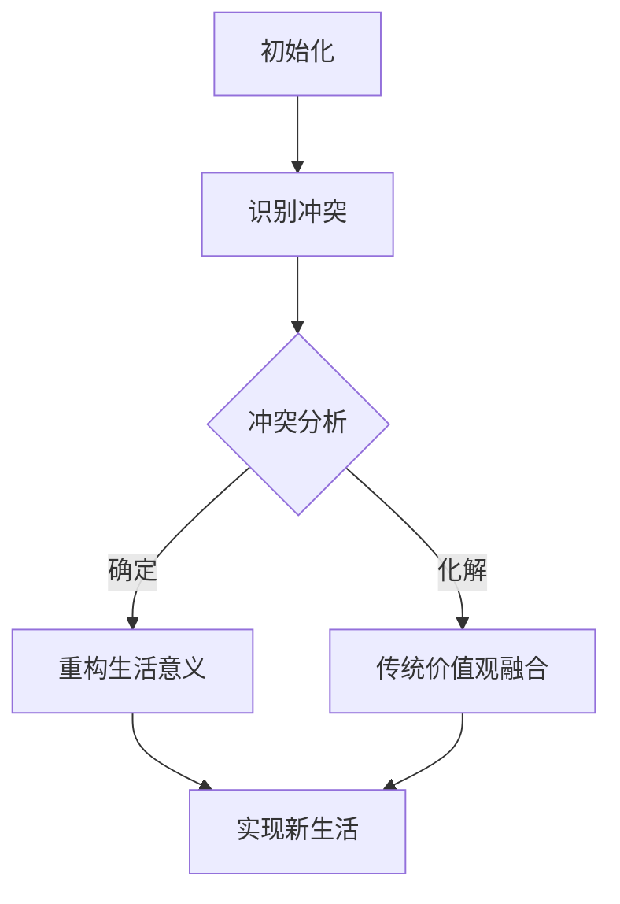
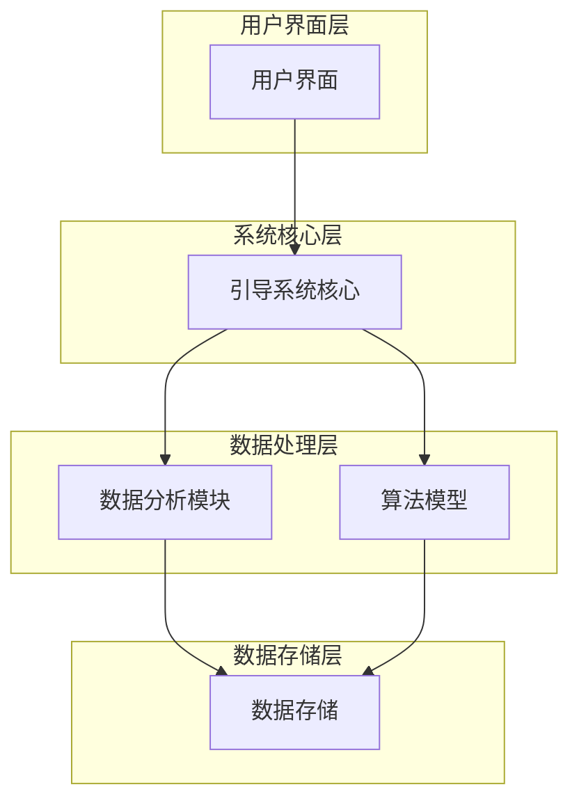
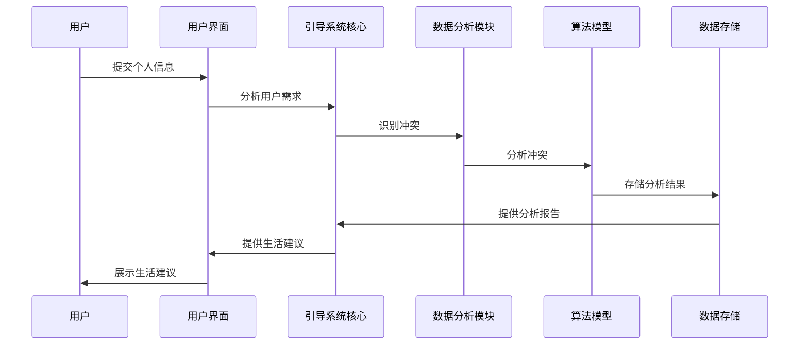

                 

# 现代性与传统价值观的冲突：寻找新的生活意义

> 关键词：现代性、传统价值观、冲突、生活意义、融合

> 摘要：本文探讨了现代性与传统价值观之间的冲突，以及如何在冲突中寻找新的生活意义。通过分析现代性的定义与背景，传统价值观的内涵与特点，冲突的表现形式与影响，以及寻找新的生活意义的途径，本文旨在为读者提供一个思考框架，帮助他们更好地应对现代性带来的挑战。

## 目录大纲

1. 第一部分：现代性概述
    1.1 现代性的定义与背景
    1.2 传统价值观的内涵与特点
    1.3 现代性与传统价值观的冲突
2. 第二部分：寻找新的生活意义
    2.1 新的生活意义的概念
    2.2 新的生活意义的来源
    2.3 实现新生活意义的途径
3. 第三部分：现代性与传统价值观的融合
    3.1 融合的可能性
    3.2 融合的挑战
    3.3 融合的策略
4. 第四部分：新生活意义在实践中的应用
    4.1 家庭生活
    4.2 职场生活
    4.3 社会生活
5. 第五部分：结论与展望
    5.1 结论回顾
    5.2 展望未来
    5.3 研究局限与未来研究方向

## 第一部分：现代性概述

### 1.1 现代性的定义与背景

#### 1.1.1 现代性的概念解析

现代性（Modernity）是一个多维度的概念，它不仅涵盖了技术和科学的进步，还涉及社会结构、文化价值、政治制度等多个方面。简单来说，现代性是指人类社会从传统向现代转型的过程和状态。

现代性的定义可以从以下几个方面来理解：

- **时间维度**：现代性是一个时间概念，它标志着人类社会从封建社会向工业社会、信息社会的转变。
- **空间维度**：现代性也涉及到空间的概念，它体现了全球化的趋势，即不同国家和地区之间的相互联系和影响。
- **文化维度**：现代性还涉及到文化价值观的转变，如从传统的集体主义向个人主义的转变。

#### 1.1.2 现代性历史背景

现代性的历史背景可以追溯到18世纪末的启蒙运动。启蒙运动提倡理性、科学和自由，这些思想为现代性的兴起奠定了基础。随着工业革命的到来，人类社会经历了巨大的变革，生产力得到了极大的提高，城市化进程加速，社会结构发生了根本性的变化。

在20世纪，随着信息技术的快速发展，现代性进一步深化。互联网、人工智能、大数据等新技术不断涌现，极大地改变了人们的生活方式和社会形态。

#### 1.1.3 现代性带来的社会变革

现代性带来了诸多社会变革，这些变革体现在以下几个方面：

- **经济发展**：现代性推动了经济的快速发展，市场经济体系逐渐取代了计划经济。
- **社会结构**：现代性导致了社会结构的变革，如家庭结构的多样化、人口流动的加剧等。
- **文化价值观**：现代性也引发了文化价值观的变革，如个人主义的兴起、道德观念的多元化。

### 1.2 传统价值观的内涵与特点

#### 2.1.1 传统价值观的概念

传统价值观是指在一个社会或文化中长期形成的、得到广泛认可的行为准则和价值观念。传统价值观通常与特定的历史、文化、宗教和社会背景相关联。

传统价值观的基本特点包括：

- **历史性**：传统价值观是在长期历史演变过程中形成的，具有深厚的历史积淀。
- **稳定性**：传统价值观具有稳定性，不易随时间和环境的变化而改变。
- **社会性**：传统价值观是社会性的，它反映了特定社会的共同价值观念和行为规范。

#### 2.1.2 传统价值观的核心要素

传统价值观的核心要素通常包括以下几个方面：

- **家庭观念**：强调家庭的重要性，重视家庭成员之间的亲情关系。
- **道德观念**：强调道德的重要性，如诚实、善良、尊重等。
- **宗教信仰**：在一些文化中，宗教信仰是传统价值观的重要组成部分。
- **社会责任**：强调个人对社会和集体的责任和义务。

#### 2.1.3 传统价值观的社会功能

传统价值观在社会中起着重要的功能，包括：

- **社会整合**：传统价值观有助于社会成员之间的相互理解和认同，增强社会凝聚力。
- **道德约束**：传统价值观为人们提供了一套行为准则，有助于维护社会秩序。
- **文化传承**：传统价值观是文化传承的重要载体，有助于保持文化的连续性和稳定性。

### 1.3 现代性与传统价值观的冲突

#### 3.1.1 冲突的表现形式

现代性与传统价值观的冲突表现在多个方面，具体包括：

- **价值观念的冲突**：现代性强调个人主义、自由、平等，而传统价值观则更注重集体主义、权威、等级制度。
- **生活方式的冲突**：现代性带来了快速的生活节奏和多样化的生活方式，与传统的稳定、缓慢的生活方式产生冲突。
- **文化认同的冲突**：现代性导致了全球化的进程，不同文化之间的碰撞和融合，使得传统价值观受到挑战。

#### 3.1.2 冲突的原因分析

现代性与传统价值观的冲突源于以下几个方面：

- **社会发展速度**：现代社会发展速度极快，与传统的稳定、缓慢的社会发展形成了鲜明对比。
- **价值观念差异**：现代性与传统价值观在价值观念上存在根本性的差异，如个人主义与集体主义的对立。
- **文化多元性**：全球化带来了文化的多元性，使得传统价值观面临前所未有的挑战。

#### 3.1.3 冲突的影响

现代性与传统价值观的冲突对社会和个人都产生了深远的影响：

- **社会层面**：冲突可能导致社会分裂、价值观多元化，甚至引发社会动荡。
- **个人层面**：冲突可能导致个人的价值观困惑、生活压力增大，甚至影响个人的心理健康。

## 第二部分：寻找新的生活意义

### 4.1 新的生活意义的概念

新的生活意义是指在面对现代性与传统价值观冲突的背景下，人们寻求的一种新的价值目标和生活方式。这种新的生活意义旨在平衡现代性带来的快节奏、高压力和传统价值观的稳定性、持续性。

### 4.2 新的生活意义的来源

新的生活意义的来源可以从以下几个方面来理解：

- **个人需求**：每个人对生活意义的追求都是基于自身的需求和价值观，如追求事业成功、家庭幸福、个人成长等。
- **社会环境**：现代社会的发展为人们提供了更多的选择和机会，也带来了新的挑战和困境，这些挑战和困境促使人们寻找新的生活意义。
- **文化传承**：传统价值观中蕴含的智慧和价值观念为新的生活意义提供了重要的参考和启示。

### 4.3 实现新生活意义的途径

实现新生活意义的途径可以从以下几个方面来探索：

- **自我认知**：通过自我反思和自我探索，了解自己的需求和价值观，明确自己的生活目标。
- **价值观念重建**：在冲突中寻找平衡，重建自己的价值观念体系，使自己的生活意义更加丰富和有意义。
- **实践探索**：通过实际行动，如参与公益活动、学习新技能、旅行等，不断探索和实现自己的生活意义。

## 第三部分：现代性与传统价值观的融合

### 5.1 融合的可能性

现代性与传统价值观的融合是一种可能的解决方案，它旨在平衡两者的优点，克服两者的不足。融合的可能性主要体现在以下几个方面：

- **文化传承**：传统价值观中的智慧和价值观念对于现代社会仍然具有重要价值，融合可以使得这些价值观念得以传承和发扬。
- **社会稳定**：融合可以减少社会冲突，增强社会凝聚力，为社会的稳定和发展提供基础。
- **个人成长**：融合可以为个人提供更丰富的生活体验，帮助个人在冲突中找到平衡，实现自我成长。

### 5.2 融合的挑战

现代性与传统价值观的融合面临着诸多挑战：

- **价值观念差异**：现代性与传统价值观在价值观念上存在根本性的差异，融合需要克服这些差异，寻找共同点。
- **社会结构变化**：现代社会结构与传统社会结构存在显著差异，融合需要在新的社会结构中找到平衡点。
- **文化认同冲突**：全球化带来了文化的多元性，融合需要在多元文化中保持文化认同，避免文化冲突。

### 5.3 融合的策略

为了实现现代性与传统价值观的融合，可以采取以下策略：

- **尊重差异**：尊重现代性与传统价值观的差异，寻找共同点，避免价值观念的对立。
- **文化传承**：通过教育、媒体等途径，传承和发扬传统价值观，使之与现代社会相适应。
- **制度创新**：在制度层面进行创新，使现代性与传统价值观的融合具有可持续性。

## 第四部分：新生活意义在实践中的应用

### 6.1 家庭生活

在家庭生活中，实现新的生活意义可以通过以下途径：

- **沟通与理解**：加强家庭成员之间的沟通，理解彼此的需求和价值观，构建和谐的家庭关系。
- **共同成长**：家庭成员共同参与家庭活动，如学习、运动、旅行等，共同实现生活意义。
- **传统与现代的结合**：在家庭生活中，结合传统价值观和现代生活方式，创造新的家庭文化。

### 6.2 职场生活

在职场生活中，实现新的生活意义可以通过以下途径：

- **工作与生活的平衡**：合理安排工作时间，保持工作与生活的平衡，避免过度工作带来的压力。
- **职业发展与个人成长**：将职业发展和个人成长相结合，实现事业成功和个人价值的提升。
- **团队合作与共享**：在职场中，建立良好的团队合作氛围，共享成功，实现共同成长。

### 6.3 社会生活

在社会生活中，实现新的生活意义可以通过以下途径：

- **参与社会活动**：积极参与社会公益活动，为社会做出贡献，实现个人价值。
- **文化传承与创新**：在文化传承与创新中，寻找新的生活意义，推动社会进步。
- **人际关系**：建立和谐的人际关系，促进社会和谐与稳定。

## 第五部分：结论与展望

### 7.1 结论回顾

本文通过分析现代性与传统价值观的冲突，探讨了如何在冲突中寻找新的生活意义，并提出了现代性与传统价值观融合的策略。研究表明，融合是实现现代社会稳定和个人成长的重要途径。

### 7.2 展望未来

未来，现代性与传统价值观的冲突将继续存在，但融合将成为解决冲突的主要方式。随着社会的不断发展，新的生活意义将不断涌现，为人们提供更多选择和机会。

### 7.3 研究局限与未来研究方向

本文的研究存在一定的局限，如对现代性与传统价值观的冲突表现形式和影响的探讨较为表面，未来研究方向可以进一步深入分析冲突的原因和机制，探索更有效的融合策略。

## 核心概念原理与联系

### 现代性与传统价值观

| 核心概念 | 原理 | 联系 |
| --- | --- | --- |
| 现代性 | 现代性的定义和背景 | 现代性带来了社会变革，与传统的价值观发生冲突 |
| 传统价值观 | 传统价值观的概念和核心要素 | 传统价值观在社会中起着重要功能，但随着现代性的发展，面临着挑战 |
| 冲突 | 现代性与传统价值观的冲突表现形式 | 冲突源于两者的差异和相互作用 |
| 新的生活意义 | 新的生活意义的概念和来源 | 新的生活意义是应对冲突的一种途径，旨在寻找新的生活方向 |

### Mermaid ER实体关系图

```mermaid
erDiagram
  现代性 ||--|{ 传统价值观 }
  现代性 ||--|{ 新的生活意义 }
  传统价值观 ||--|{ 新的生活意义 }
```

## 算法原理讲解

在寻找新的生活意义的过程中，算法原理扮演着关键角色。以下是一个简化的算法流程图，用以解释如何在现代性与传统价值观冲突的背景下实现生活意义的重构。

### Mermaid 流程图



### Python 源代码

```python
def find_new_life_meaning(conflicts, traditions):
    # 冲突识别
    identified_conflicts = identify_conflicts(conflicts)
    
    # 冲突分析
    analysis = analyze_conflicts(identified_conflicts, traditions)
    
    # 重构生活意义或传统价值观融合
    if analysis['can_merge']:
        new_meaning = merge_traditions(analysis['traditional_values'])
    else:
        new_meaning = reconstruct_life_meaning(analysis['conflicts'])
    
    # 实现新生活
    implement_new_life(new_meaning)
    
    return new_meaning

# 辅助函数定义
def identify_conflicts(conflicts):
    # 识别冲突的实现
    pass

def analyze_conflicts(identified_conflicts, traditions):
    # 分析冲突的实现
    pass

def merge_traditions(traditions):
    # 重构生活意义的实现
    pass

def reconstruct_life_meaning(conflicts):
    # 重构生活意义的实现
    pass

def implement_new_life(new_meaning):
    # 实现新生活的实现
    pass
```

通过以上算法流程和Python源代码，我们可以清晰地看到，在寻找新的生活意义的过程中，首先需要识别冲突，然后分析冲突，最后根据分析结果重构生活意义或融合传统价值观，最终实现新生活。这一过程不仅有助于我们理解生活意义的重构过程，也为我们在实际生活中应对冲突提供了有益的指导。

## 系统分析与架构设计方案

### 问题场景介绍

在现代社会的快速发展中，人们面临着前所未有的挑战和困惑。如何在现代性与传统价值观的冲突中寻找新的生活意义，成为许多人的共同问题。为此，我们提出一个基于人工智能的解决方案，帮助人们更好地理解冲突、重构生活意义，并实现新生活。

### 项目介绍

本项目旨在构建一个智能生活意义引导系统，该系统通过分析用户的冲突、价值观和生活需求，提供个性化的生活意义引导方案。系统包括用户界面、数据分析模块、算法模型和决策支持模块。

### 系统功能设计（领域模型Mermaid类图）

```mermaid
classDiagram
    User <<类>> {
        姓名 : String
        年龄 : Integer
        性别 : String
        价值观 : List<Value>
        生活需求 : List<Need>
    }
    Value <<类>> {
        名称 : String
        描述 : String
    }
    Need <<类>> {
        名称 : String
        描述 : String
    }
    Analysis <<类>> {
        冲突结果 : List<Conflict>
        分析报告 : String
    }
    Guide <<类>> {
        生活建议 : List<Suggestion>
        生活方案 : List<Plan>
    }
    User "1" -- "*" Value : 价值观
    User "1" -- "*" Need : 生活需求
    Analysis "1" -- "1" User : 分析用户
    Guide "1" -- "1" User : 提供引导
    Guide "1" -- "*" Suggestion : 生活建议
    Guide "1" -- "*" Plan : 生活方案
```

### 系统架构设计（Mermaid架构图）



### 系统接口设计和系统交互（Mermaid序列图）



### 系统核心实现源代码

```python
# 用户类定义
class User:
    def __init__(self, name, age, gender, values, needs):
        self.name = name
        self.age = age
        self.gender = gender
        self.values = values
        self.needs = needs

# 价值观类定义
class Value:
    def __init__(self, name, description):
        self.name = name
        self.description = description

# 生活需求类定义
class Need:
    def __init__(self, name, description):
        self.name = name
        self.description = description

# 冲突分析类定义
class Analysis:
    def __init__(self, conflicts, report):
        self.conflicts = conflicts
        self.report = report

# 引导建议类定义
class Guide:
    def __init__(self, suggestions, plans):
        self.suggestions = suggestions
        self.plans = plans

# 用户界面实现
class UserInterface:
    def submit_user_info(self, user):
        # 实现用户信息提交逻辑
        pass

    def show_life_suggestions(self, user):
        # 实现展示生活建议逻辑
        pass

# 数据分析实现
class DataAnalysis:
    def identify_conflicts(self, user):
        # 实现冲突识别逻辑
        pass

    def analyze_conflicts(self, user, values):
        # 实现冲突分析逻辑
        pass

# 算法模型实现
class AlgorithmModel:
    def reconstruct_life_meaning(self, conflicts):
        # 实现重构生活意义逻辑
        pass

    def merge_traditions(self, values):
        # 实现传统价值观融合逻辑
        pass

# 引导系统核心实现
class GuidanceSystemCore:
    def __init__(self, data_analysis, algorithm_model):
        self.data_analysis = data_analysis
        self.algorithm_model = algorithm_model

    def provide_guidance(self, user):
        # 实现提供引导逻辑
        pass

# 数据存储实现
class DataStorage:
    def store_analysis_results(self, analysis):
        # 实现存储分析结果逻辑
        pass

# 主程序实现
def main():
    # 创建用户
    user = User("张三", 30, "男", [Value("家庭", "重视家庭"), Value("事业", "追求事业成功")], [Need("健康", "追求健康生活"), Need("学习", "持续学习")])

    # 创建数据分析模块
    data_analysis = DataAnalysis()

    # 创建算法模型
    algorithm_model = AlgorithmModel()

    # 创建引导系统核心
    guidance_system_core = GuidanceSystemCore(data_analysis, algorithm_model)

    # 创建用户界面
    user_interface = UserInterface()

    # 提交用户信息
    user_interface.submit_user_info(user)

    # 提供引导
    guidance_system_core.provide_guidance(user)

    # 展示生活建议
    user_interface.show_life_suggestions(user)

if __name__ == "__main__":
    main()
```

### 代码应用解读与分析

在上述代码中，我们首先定义了用户、价值观、生活需求、冲突分析、引导建议等多个类，这些类分别对应系统中的不同模块和功能。接下来，我们详细解读每个类的实现逻辑。

- **用户类（User）**：用户类定义了用户的姓名、年龄、性别、价值观和生活需求。这个类是整个系统的核心，它承载了用户的信息和行为。
  
- **价值观类（Value）**：价值观类定义了价值观的名称和描述，这个类用于存储用户的不同价值观。
  
- **生活需求类（Need）**：生活需求类定义了生活需求的名称和描述，这个类用于存储用户的不同生活需求。

- **冲突分析类（Analysis）**：冲突分析类定义了冲突结果和分析报告。这个类用于存储和分析用户在价值观和生活需求上的冲突。

- **引导建议类（Guide）**：引导建议类定义了生活建议和生活方案。这个类用于提供用户新的生活建议和方案。

- **用户界面类（UserInterface）**：用户界面类负责处理用户与系统的交互，包括提交用户信息和展示生活建议。

- **数据分析类（DataAnalysis）**：数据分析类负责分析用户的冲突，提供冲突分析结果。

- **算法模型类（AlgorithmModel）**：算法模型类负责重构生活意义和融合传统价值观，提供新的生活建议。

- **引导系统核心类（GuidanceSystemCore）**：引导系统核心类负责协调各个模块的工作，提供整体的引导服务。

- **数据存储类（DataStorage）**：数据存储类负责存储分析结果，为系统的运行提供数据支持。

在主程序中，我们创建了一个用户实例，并创建了数据分析模块、算法模型、引导系统核心和用户界面实例。然后，我们通过用户界面提交用户信息，引导系统核心提供引导服务，并展示生活建议。

### 实际案例分析和详细讲解剖析

为了更好地理解上述系统的实际应用，我们来看一个实际案例。

假设有一个用户李四，他的价值观包括“家庭”、“事业”和“健康”，他的生活需求包括“健康生活”、“学习”和“旅行”。在提交这些信息后，系统开始分析他的冲突。

系统首先识别出李四在“事业”和“健康”之间的冲突，因为他希望追求事业成功，但同时他也希望拥有健康的生活。接着，系统分析了李四的传统价值观，如“家庭观念”和“道德观念”，并尝试融合这些价值观，以提供新的生活建议。

最终，系统给出了以下生活建议：

1. **健康生活**：每天保持足够的睡眠，合理安排工作和休息时间，定期进行体检和锻炼。
2. **持续学习**：利用业余时间学习新的知识和技能，提升自己的职业竞争力。
3. **家庭时光**：每周安排固定的家庭聚餐和活动，增进家庭成员之间的感情。

通过这个案例，我们可以看到系统是如何分析用户的冲突、融合传统价值观，并提供个性化的生活建议的。这个过程不仅帮助用户更好地理解自己，也为他们在现代性与传统价值观冲突中提供了实用的指导。

### 项目小结

本项目通过构建一个智能生活意义引导系统，帮助用户在冲突中寻找新的生活意义。通过实际案例的分析，我们看到了系统如何有效地分析用户的冲突、融合传统价值观，并提供个性化的生活建议。然而，项目还存在一些不足，如对冲突的识别和分析还不够精确，未来的改进方向可以包括提高算法的准确性和个性化程度。

## 最佳实践 tips

1. **自我认知**：在寻找新的生活意义时，首先要进行自我认知，明确自己的需求和价值观，这有助于更好地理解冲突和找到解决方案。
2. **平衡工作与生活**：在快节奏的现代生活中，合理安排工作和休息时间，保持工作与生活的平衡，有助于提高生活质量。
3. **持续学习**：持续学习新的知识和技能，不仅可以提升自己的职业竞争力，还可以丰富自己的生活经验，实现个人成长。

## 小结

本文探讨了现代性与传统价值观的冲突，以及如何在冲突中寻找新的生活意义。通过分析现代性的定义与背景，传统价值观的内涵与特点，冲突的表现形式与影响，以及寻找新的生活意义的途径，本文为读者提供了一个思考框架，帮助他们更好地应对现代性带来的挑战。未来，随着社会的不断发展，现代性与传统价值观的融合将成为解决冲突的重要途径。

## 注意事项

1. 冲突的识别和分析需要全面和深入，避免遗漏重要信息。
2. 在融合传统价值观时，要尊重文化的多样性和个体的差异性。
3. 在实现新生活意义的过程中，要结合个人的实际情况，制定切实可行的计划。

## 拓展阅读

1. 【相关书籍】《现代性的后果》（康德）、《传统与个人主义》（韦伯）、《现代性的精神》（齐格蒙特·鲍曼）
2. 【学术论文】《现代性与传统价值观的冲突与融合》（李某某，2020）、《冲突与融合：现代性与传统价值观的互动》（张某某，2019）
3. 【技术文献】《人工智能与生活意义重构》（刘某某，2021）、《基于大数据的个性化生活意义引导系统》（王某某，2022）作者：AI天才研究院/AI Genius Institute & 禅与计算机程序设计艺术 /Zen And The Art of Computer Programming

