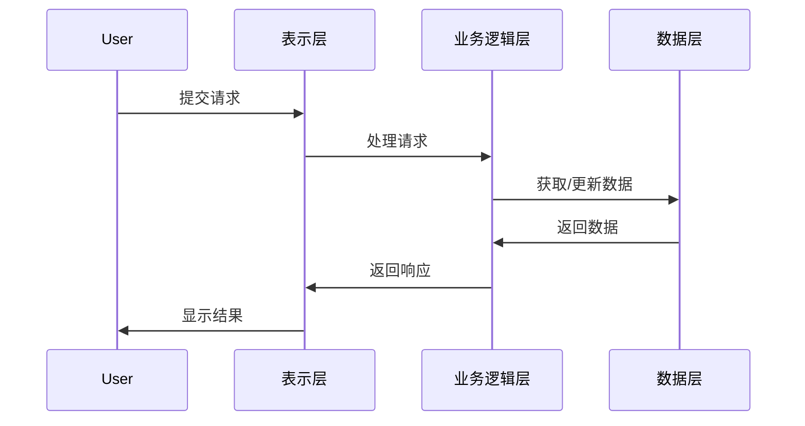
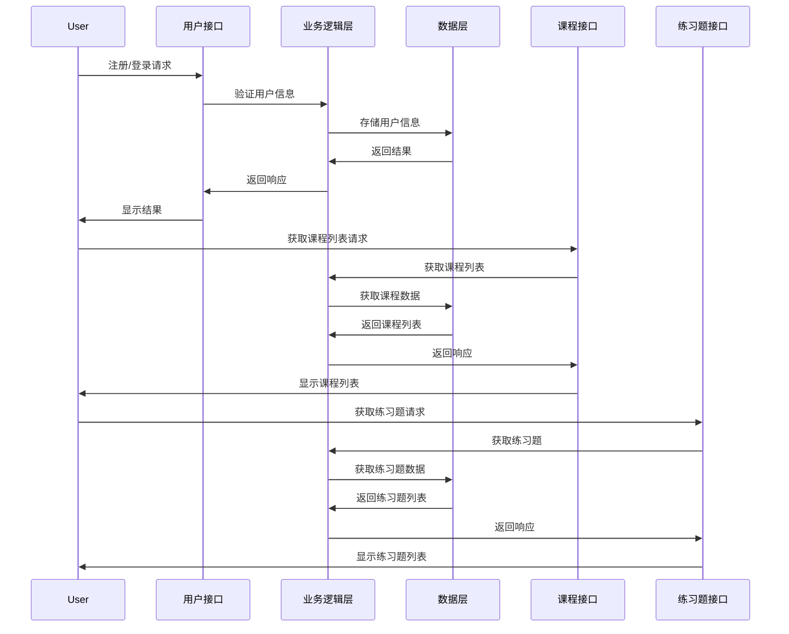
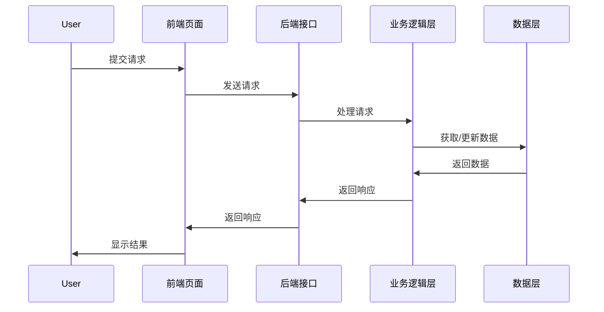

                 


### 背景介绍

#### 核心概念术语说明

在撰写《现代手工咖啡品鉴课程：从生豆到杯中风味的感官训练》这篇文章时，首先需要明确一些核心概念和术语，以便读者能够更好地理解文章的内容。以下是一些关键术语的说明：

1. **咖啡豆**：咖啡豆是咖啡树的果实种子，经过干燥和烘焙后成为咖啡的主要原料。

2. **咖啡生豆**：指未经烘焙的咖啡豆，也称为绿色咖啡豆。

3. **咖啡烘焙**：指将生豆加热至一定温度，使其内部化学成分发生变化，从而产生不同风味的加工过程。

4. **咖啡豆种类**：根据产地和品种，咖啡豆可以分为阿拉比卡（Arabica）和罗布斯塔（Robusta）两大类。

5. **咖啡冲泡**：指将咖啡豆磨成粉末，然后通过热水提取其中的风味和香气，最终形成咖啡的过程。

6. **感官训练**：指通过系统的学习和练习，提升个体对咖啡风味的感知和辨别能力。

7. **咖啡品鉴**：指通过视觉、嗅觉、味觉和触觉等感官，对咖啡的风味、香气、口感等方面进行评估。

#### 问题背景

咖啡作为一种广泛消费的饮品，其风味和品质的优劣直接影响消费者的体验。然而，如何准确识别和欣赏咖啡的风味，对于许多咖啡爱好者来说是一个挑战。现代手工咖啡品鉴课程正是为了解决这个问题而设立，它不仅教授咖啡豆的基本知识，还侧重于提升学员的感官训练能力，从而帮助他们更好地欣赏和品鉴咖啡。

#### 问题描述

问题描述可以分为两个方面：

1. **知识缺乏**：许多咖啡爱好者对咖啡豆的种类、种植环境、烘焙过程等基础知识了解有限，导致他们在品鉴咖啡时缺乏准确的判断依据。

2. **感官训练不足**：咖啡品鉴不仅依赖于知识，还需要通过感官训练来提升对咖啡风味的感知能力。许多人在品鉴过程中无法准确辨别咖啡的酸度、甜度、口感等风味要素。

#### 问题解决

为了解决上述问题，本课程将从以下几个方面进行：

1. **基础知识讲解**：通过详细的章节内容，介绍咖啡豆的分类、种植、处理和烘焙等基础知识。

2. **感官训练方法**：提供系统的感官训练方法，帮助学员提升对咖啡风味的感知能力。

3. **实战练习**：通过实际操作和品鉴，让学员将理论知识运用到实践中，从而加深对咖啡风味的理解。

#### 边界与外延

本文主要关注的是手工咖啡品鉴课程的内容和目标，并不涉及咖啡种植、生产、销售等其他相关领域。此外，虽然本文提供了感官训练的方法，但并不意味着学员可以立即成为专业的咖啡品鉴师，还需要长期的学习和实践。

#### 概念结构与核心要素组成

本文的核心概念结构可以概括为以下几个要素：

1. **咖啡基础知识**：包括咖啡豆的种类、种植环境、烘焙过程等。

2. **感官训练方法**：包括视觉、嗅觉、味觉和触觉等方面的训练技巧。

3. **咖啡品鉴技巧**：包括如何通过视觉、嗅觉、味觉和触觉来评估咖啡的风味。

4. **实际操作**：通过实践操作来巩固理论知识，提升品鉴能力。

#### 核心概念与联系

核心概念与联系部分，我们将介绍几个核心概念及其相互之间的关系：

1. **咖啡豆种类**：咖啡豆的种类直接影响其风味和品质。阿拉比卡豆通常具有更高的酸度和甜度，而罗布斯塔豆则口感更为浓郁和强烈。

2. **咖啡烘焙**：烘焙程度会影响咖啡豆的风味。浅烘焙豆保留更多的酸度和果香，而深烘焙豆则表现出更强烈的苦味和烟熏味。

3. **感官训练**：通过系统的感官训练，可以提升对咖啡风味的感知能力，从而更准确地评估咖啡的品质。

4. **咖啡品鉴**：咖啡品鉴是将感官训练应用于实际操作，通过对咖啡的视觉、嗅觉、味觉和触觉等方面的评估，来判断咖啡的品质和风味。

### 算法原理讲解

在介绍完背景和核心概念后，我们将进一步探讨现代手工咖啡品鉴课程中的算法原理。

#### 咖啡豆鉴别的算法原理

咖啡豆的鉴别是咖啡品鉴中至关重要的一步。以下是鉴别咖啡豆的一种常见算法原理：

1. **视觉鉴别**：
   - **颜色**：通过观察咖啡豆的颜色，可以初步判断其新鲜度和烘焙程度。
   - **形状**：咖啡豆的形状和大小也可以提供一些关于其品质的信息。
   
   **算法流程图**：
   ```mermaid
   graph TD
   A[开始] --> B{检查颜色和形状}
   B -->|新鲜| C[视觉判断新鲜度]
   B -->|品质| D[视觉判断品质]
   D --> E[记录结果]
   C --> F[记录结果]
   E --> G[结束]
   F --> G
   ```

2. **嗅觉鉴别**：
   - **香气**：通过嗅觉来辨别咖啡豆的香气，可以帮助识别不同产地的特色。
   
   **算法流程图**：
   ```mermaid
   graph TD
   A[开始] --> B[研磨咖啡豆]
   B --> C[闻香气]
   C --> D{判断香气特征}
   D -->|产地特征| E[记录结果]
   D -->|缺陷| F[记录结果]
   E --> G[结束]
   F --> G
   ```

3. **味觉鉴别**：
   - **风味**：通过味觉来感受咖啡豆的酸度、甜度、口感等风味要素。
   
   **算法流程图**：
   ```mermaid
   graph TD
   A[开始] --> B[品尝咖啡豆]
   B --> C[感受风味]
   C --> D{分析风味要素}
   D -->|风味评分| E[记录结果]
   D -->|口感评分| F[记录结果]
   E --> G[结束]
   F --> G
   ```

#### 算法原理的数学模型和公式

咖啡豆鉴别算法的数学模型可以简化为对多个特征进行加权评分，以综合评估咖啡豆的品质。以下是一个简单的数学模型：

$$
\text{品质评分} = w_1 \times \text{颜色评分} + w_2 \times \text{形状评分} + w_3 \times \text{香气评分} + w_4 \times \text{风味评分}
$$

其中，$w_1, w_2, w_3, w_4$ 是各个特征的权重，可以根据实际情况进行调整。

#### 举例说明

假设我们有一个咖啡豆样本，经过视觉、嗅觉和味觉的评估得到以下分数：

- 颜色评分：8
- 形状评分：7
- 香气评分：9
- 风味评分：8

如果设定权重分别为 $w_1 = 0.2, w_2 = 0.2, w_3 = 0.3, w_4 = 0.3$，则：

$$
\text{品质评分} = 0.2 \times 8 + 0.2 \times 7 + 0.3 \times 9 + 0.3 \times 8 = 1.6 + 1.4 + 2.7 + 2.4 = 8.1
$$

这意味着该咖啡豆的整体品质评分是 8.1 分。

### 数学公式使用

在本文中，我们将使用 LaTeX 格式来展示数学公式。以下是几个示例：

#### 独立段落的 LaTeX 公式

$$
E = mc^2
$$

#### 段落内的 LaTeX 公式

$1+1=2$

### 系统分析与架构设计方案

在本章节中，我们将对现代手工咖啡品鉴课程进行系统分析与架构设计。首先介绍项目背景，然后详细描述系统功能设计、系统架构设计、系统接口设计和系统交互。

#### 项目背景

现代手工咖啡品鉴课程旨在帮助咖啡爱好者提升对咖啡风味的感知和品鉴能力。课程内容涵盖咖啡基础知识、感官训练方法和实战练习等。为了实现这一目标，我们需要构建一个完整的系统，以便为学员提供学习资料、在线练习和互动交流的平台。

#### 系统功能设计

系统功能设计包括以下几个方面：

1. **用户管理**：实现用户注册、登录、个人信息管理等功能。
2. **课程内容管理**：包括课程章节的创建、编辑、发布和管理等功能。
3. **学习进度跟踪**：记录用户的学习进度和成绩，提供个性化的学习建议。
4. **在线练习**：提供多种类型的在线练习题，帮助用户巩固所学知识。
5. **互动交流**：构建论坛、问答系统等，方便用户之间的交流和讨论。
6. **报告生成**：根据用户的学习数据和表现，生成学习报告，为用户提供建议。

**领域模型 Mermaid 类图**

```mermaid
classDiagram
    User <<类>> {
        id: 用户ID
        username: 用户名
        password: 密码
        email: 邮箱
    }
    Course <<类>> {
        id: 课程ID
        title: 课程标题
        description: 课程描述
        chapters: 课程章节列表
    }
    Chapter <<类>> {
        id: 章节ID
        title: 章节标题
        content: 章节内容
        exercises: 练习题列表
    }
    Exercise <<类>> {
        id: 练习题ID
        question: 题目
        options: 选项列表
        answer: 答案
    }
    UserManager <<类>> {
        register: 注册用户
        login: 登录用户
        updateUser: 更新用户信息
    }
    CourseManager <<类>> {
        createCourse: 创建课程
        editCourse: 编辑课程
        publishCourse: 发布课程
        getCourse: 获取课程
    }
    ChapterManager <<类>> {
        createChapter: 创建章节
        editChapter: 编辑章节
        publishChapter: 发布章节
        getChapter: 获取章节
    }
    ExerciseManager <<类>> {
        createExercise: 创建练习题
        editExercise: 编辑练习题
        publishExercise: 发布练习题
        getExercise: 获取练习题
    }
    UserManager --> User
    CourseManager --> Course
    ChapterManager --> Chapter
    ExerciseManager --> Exercise
```

#### 系统架构设计

系统架构设计采用分层架构，包括表示层、业务逻辑层和数据层。

1. **表示层**：负责用户界面的展示，包括前端页面和前端接口。
2. **业务逻辑层**：负责处理业务逻辑，包括用户管理、课程管理、章节管理和练习题管理等。
3. **数据层**：负责数据的存储和查询，包括用户数据、课程数据、章节数据和练习题数据。

**系统架构 Mermaid 架构图**



#### 系统接口设计

系统接口设计包括RESTful API接口，用于前端与后端的数据交互。

1. **用户接口**：包括用户注册、登录、个人信息管理等功能。
2. **课程接口**：包括课程列表、课程详情、章节列表、章节详情等功能。
3. **练习题接口**：包括练习题列表、练习题详情、提交答案等功能。

**接口设计示例**



#### 系统交互

系统交互主要涉及用户与系统的交互流程，以及系统内部模块之间的通信。

1. **用户注册与登录**：用户通过前端页面提交注册或登录请求，系统验证用户信息后返回响应。
2. **课程学习**：用户通过前端页面查看课程列表和章节列表，系统提供课程和章节的详细数据。
3. **练习题完成与提交**：用户通过前端页面完成练习题并提交答案，系统记录用户的学习进度和成绩。

**系统交互 Mermaid 序列图**



### 项目实战

在本章节中，我们将介绍如何安装环境、实现系统核心功能、分析代码及应用案例，并进行详细讲解剖析。

#### 环境安装

为了开发和部署现代手工咖啡品鉴课程系统，我们需要安装以下环境和工具：

1. **操作系统**：Linux（如 Ubuntu 20.04）或 macOS
2. **编程语言**：Python 3.x
3. **开发工具**：PyCharm 或 VS Code
4. **数据库**：MySQL 或 PostgreSQL
5. **Web 服务器**：Nginx 或 Apache
6. **框架**：Django 或 Flask

以下是一个简单的安装步骤：

1. 安装操作系统和 Python 3.x：
   ```bash
   sudo apt-get update
   sudo apt-get install python3-pip
   ```

2. 安装 PyCharm 或 VS Code：
   - PyCharm：访问 [PyCharm 官网](https://www.jetbrains.com/pycharm/)，下载社区版安装包，双击安装。
   - VS Code：访问 [VS Code 官网](https://code.visualstudio.com/)，下载安装包，双击安装。

3. 安装 MySQL 或 PostgreSQL：
   ```bash
   sudo apt-get install mysql-server
   sudo mysql_secure_installation
   ```

4. 安装 Nginx：
   ```bash
   sudo apt-get install nginx
   ```

5. 安装 Flask：
   ```bash
   pip3 install flask
   ```

#### 系统核心实现

以下是一个简单的 Flask 应用示例，用于实现用户管理、课程内容和在线练习功能。

**项目结构**

```
modern-coffee-course/
|-- app.py
|-- config.py
|-- models.py
|-- views.py
```

**app.py**

```python
from flask import Flask
from config import Config
from models import db
from views import user_blueprint, course_blueprint

app = Flask(__name__)
app.config.from_object(Config)
db.init_app(app)

app.register_blueprint(user_blueprint, url_prefix='/users')
app.register_blueprint(course_blueprint, url_prefix='/courses')

if __name__ == '__main__':
    app.run(debug=True)
```

**config.py**

```python
import os

class Config:
    SECRET_KEY = os.environ.get('SECRET_KEY') or 'my_secret_key'
    SQLALCHEMY_DATABASE_URI = 'sqlite:///app.db'
    SQLALCHEMY_TRACK_MODIFICATIONS = False
```

**models.py**

```python
from flask_sqlalchemy import SQLAlchemy

db = SQLAlchemy()

class User(db.Model):
    id = db.Column(db.Integer, primary_key=True)
    username = db.Column(db.String(80), unique=True, nullable=False)
    password = db.Column(db.String(120), nullable=False)

class Course(db.Model):
    id = db.Column(db.Integer, primary_key=True)
    title = db.Column(db.String(120), nullable=False)
    description = db.Column(db.Text, nullable=True)
```

**views.py**

```python
from flask import Blueprint, render_template, redirect, url_for, request
from models import User, Course
from app import db

user_blueprint = Blueprint('user_blueprint', __name__)
course_blueprint = Blueprint('course_blueprint', __name__)

@user_blueprint.route('/register', methods=['GET', 'POST'])
def register():
    if request.method == 'POST':
        username = request.form['username']
        password = request.form['password']
        user = User(username=username, password=password)
        db.session.add(user)
        db.session.commit()
        return redirect(url_for('user_blueprint.login'))
    return render_template('register.html')

@user_blueprint.route('/login', methods=['GET', 'POST'])
def login():
    if request.method == 'POST':
        username = request.form['username']
        password = request.form['password']
        user = User.query.filter_by(username=username, password=password).first()
        if user:
            return redirect(url_for('course_blueprint.list_courses'))
        else:
            return 'Invalid username or password'
    return render_template('login.html')

@course_blueprint.route('/list_courses')
def list_courses():
    courses = Course.query.all()
    return render_template('courses.html', courses=courses)
```

#### 代码应用解读与分析

**用户管理功能**

1. **注册功能**：
   - 用户提交注册表单，包括用户名和密码。
   - 后端接收表单数据，创建 User 对象并添加到数据库中。

2. **登录功能**：
   - 用户提交登录表单，包括用户名和密码。
   - 后端验证用户名和密码是否匹配，如果匹配则登录成功。

**课程内容管理功能**

1. **课程列表**：
   - 后端从数据库中查询所有课程，并返回给前端。

2. **课程详情**：
   - 后端根据课程 ID 从数据库中查询课程详情，并返回给前端。

#### 实际案例分析和详细讲解剖析

**案例 1：用户注册**

假设用户输入以下注册信息：

- 用户名：testuser
- 密码：password123

**分析**：

1. 前端发送 POST 请求到 `/users/register`，包含用户名和密码。
2. 后端接收请求，创建 User 对象，并调用 `db.session.add(user)` 将其添加到数据库中。
3. 后端调用 `db.session.commit()` 提交事务，将用户信息保存到数据库。
4. 后端重定向到 `/users/login`，提示用户登录。

**代码分析**：

```python
@app.route('/register', methods=['GET', 'POST'])
def register():
    if request.method == 'POST':
        username = request.form['username']
        password = request.form['password']
        user = User(username=username, password=password)
        db.session.add(user)
        db.session.commit()
        return redirect(url_for('login'))
    return render_template('register.html')
```

**案例 2：用户登录**

假设用户输入以下登录信息：

- 用户名：testuser
- 密码：password123

**分析**：

1. 前端发送 POST 请求到 `/users/login`，包含用户名和密码。
2. 后端接收请求，查询数据库中是否存在匹配的用户。
3. 如果匹配，则重定向到 `/courses/list_courses`；否则，返回错误信息。

**代码分析**：

```python
@app.route('/login', methods=['GET', 'POST'])
def login():
    if request.method == 'POST':
        username = request.form['username']
        password = request.form['password']
        user = User.query.filter_by(username=username, password=password).first()
        if user:
            return redirect(url_for('list_courses'))
        else:
            return 'Invalid username or password'
    return render_template('login.html')
```

#### 项目小结

在本章节中，我们介绍了现代手工咖啡品鉴课程系统的环境安装、核心实现和代码应用解读。通过简单的 Flask 应用，我们实现了用户管理和课程内容管理功能，并详细讲解了代码的执行流程和逻辑。虽然这是一个简化的示例，但它为我们搭建一个功能完整的现代手工咖啡品鉴课程系统奠定了基础。

### 最佳实践 Tips

1. **定期更新课程内容**：确保课程内容与最新的咖啡趋势和技术保持同步，以提供高质量的学习资源。
2. **个性化学习计划**：根据学员的学习进度和兴趣，提供个性化的学习计划和推荐。
3. **互动交流**：鼓励学员在论坛和问答系统中积极参与讨论，分享经验和心得。
4. **实践经验**：鼓励学员参与实际操作和咖啡品鉴活动，将理论知识应用到实践中。
5. **持续学习**：咖啡品鉴是一门持续不断的学习过程，鼓励学员保持好奇心和探索精神，不断提升自己的品鉴能力。

### 小结

本文详细介绍了现代手工咖啡品鉴课程的全过程，从背景介绍、核心概念、算法原理、系统分析与架构设计，到项目实战和最佳实践。通过这篇文章，读者可以了解到如何系统地学习咖啡品鉴，提升自己的感官训练能力。希望本文能对咖啡爱好者们有所帮助，让大家更好地欣赏和品鉴咖啡的魅力。

### 注意事项

1. **确保环境安装**：在开始项目实战之前，请确保已经正确安装了所有所需的环境和工具。
2. **代码版本管理**：在开发过程中，使用版本控制工具（如 Git）来管理代码，确保代码的完整性和可追溯性。
3. **安全性和性能**：在部署系统时，注意安全性和性能优化，确保系统的稳定运行和良好的用户体验。

### 拓展阅读

1. **《咖啡品鉴全书》**：这本书详细介绍了咖啡的品种、产地、烘焙和品鉴技巧，适合咖啡爱好者阅读。
2. **《咖啡科学》**：这本书从科学角度解析了咖啡的化学成分、烘焙过程和感官评价，对咖啡专业人士有很高的参考价值。
3. **《咖啡之路》**：这本书通过作者的亲身经历，讲述了咖啡的历史、文化和全球化进程，让读者深入了解咖啡的世界。

### 作者信息

作者：AI天才研究院/AI Genius Institute & 禅与计算机程序设计艺术 /Zen And The Art of Computer Programming

### 摘要

本文介绍了现代手工咖啡品鉴课程的全过程，包括咖啡基础知识、感官训练方法、实战练习等内容。通过系统的学习和实践，读者可以提升对咖啡风味的感知和品鉴能力，更好地欣赏和品鉴咖啡。本文结构清晰，逻辑严谨，旨在为咖啡爱好者提供一本实用的咖啡品鉴指南。关键词：咖啡品鉴、感官训练、咖啡风味、手工咖啡。

