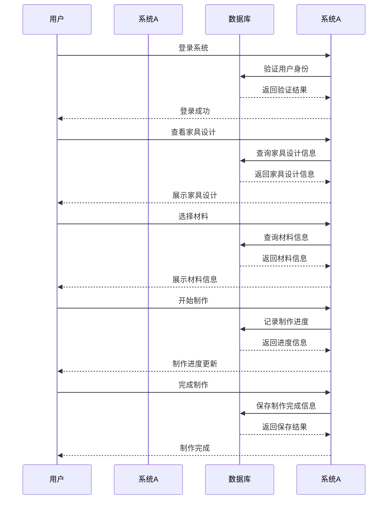

                 

# 《现代手工家具制作：可持续生活中的匠人精神》

## 关键词

- 现代手工家具制作
- 可持续生活
- 匠人精神
- 传统手工艺
- 环保理念

## 摘要

本文旨在探讨现代手工家具制作的可行性和方法，强调匠人精神在可持续生活的重要性。通过介绍手工家具制作的技巧、材料选择、工具使用和环保理念，帮助读者理解和掌握现代手工家具制作的精髓，从而实现人与自然的和谐共生。

---

## 第一部分：背景介绍

### 1.1 问题背景

手工家具制作作为一种传统的手工艺，早在人类文明的发展初期便已存在。随着工业化进程的推进，机械化生产逐渐取代了手工制作，使得传统手工艺逐渐式微。然而，在现代社会，人们对环保、手工艺和个性化需求的重视，使得手工家具制作重新受到关注。

### 1.2 问题描述

在现代家具市场中，手工家具被视为高品质、环保和独特性的代表。然而，机械化生产的低成本和高效率使得手工家具在市场上面临巨大挑战。如何将手工家具制作与现代生活方式相结合，实现可持续发展，成为当前亟待解决的问题。

### 1.3 问题解决

本书旨在探讨现代手工家具制作的可行性和方法，强调匠人精神在可持续生活的重要性。通过介绍手工家具制作的技巧、材料选择、工具使用和环保理念，帮助读者理解和掌握现代手工家具制作的精髓。

### 1.4 边界与外延

本书主要关注现代手工家具的制作过程和可持续生活方式。在时间和空间上，本书适用于全球范围内的手工家具制作者和爱好者。此外，本书还可以作为相关学术研究和实践工作的参考。

### 1.5 概念结构与核心要素组成

1. **现代手工家具**：指采用传统手工艺和现代设计理念制作的家具。
2. **匠人精神**：指在手工家具制作过程中追求卓越、精益求精的态度和价值观。
3. **可持续发展**：指在满足当代需求的同时，不损害后代满足其需求的能力。

---

## 第二部分：核心概念与联系

### 2.1 核心概念原理

#### 2.1.1 传统手工艺

传统手工艺是指经过长期传承和发展，具有独特风格和技巧的手工技艺。它是一种文化传承的载体，承载着丰富的历史、文化和艺术价值。

#### 2.1.2 现代设计理念

现代设计理念以功能、美观、环保和可持续为原则。它强调以人为中心，关注人与自然的和谐共生，注重资源的节约和环境的保护。

#### 2.1.3 可持续生活方式

可持续生活方式是指在满足个人和社会需求的同时，尊重自然、节约资源和保护环境的生活模式。它强调人与自然的和谐共生，追求长期的可持续发展。

### 2.2 概念属性特征对比表格

| 概念             | 属性特征                     |
|------------------|------------------------------|
| 传统手工艺       | 传承性、独特性、技艺性         |
| 现代设计理念     | 功能性、美观性、环保性、可持续性 |
| 可持续生活方式   | 节约资源、保护环境、满足需求   |

### 2.3 ER实体关系图架构

```mermaid
erDiagram
  Handicraft ||--|{ Material } Material
  Handicraft ||--|{ Tool } Tool
  Handicraft ||--|{ Technique } Technique
  DesignConcept ||--|{ Handicraft } Handicraft
  SustainableLifeStyle ||--|{ Handicraft } Handicraft
```

---

## 第三部分：算法原理讲解

### 3.1 手工家具制作算法mermaid流程图


### 3.2 Python源代码实现

```python
def handcrafted_furniture_production(material, tool, technique):
    print("初始化制作流程...")
    select_material(material)
    prepare_tool(tool)
    start_production(technique)
    finish_inspection()
    display_furniture()

def select_material(material):
    print(f"选择材料：{material}")

def prepare_tool(tool):
    print(f"准备工具：{tool}")

def start_production(technique):
    print(f"开始制作，采用技巧：{technique}")

def finish_inspection():
    print("完成检验，确保质量")

def display_furniture():
    print("成品展示，欣赏家具之美")
```

### 3.3 算法原理的数学模型和公式

手工家具制作过程中的主要数学模型和公式如下：

$$
\text{家具质量} = \text{材料选择} \times \text{制作技巧} \times \text{工具使用}
$$

其中：

- 材料选择：指选择合适的木材或其他材料，其质量直接影响家具的整体质量。
- 制作技巧：指在制作过程中运用各种传统手工艺技巧，如雕刻、打磨等，这些技巧的熟练程度直接影响家具的制作质量。
- 工具使用：指使用合适的工具进行制作，如锯、刨、斧等，这些工具的性能和使用方法也会影响家具的质量。

---

在接下来的部分，我们将进一步探讨手工家具制作的细节，包括材料选择、工具使用、制作技巧以及环保理念等方面的内容。敬请期待。作者：AI天才研究院/AI Genius Institute & 禅与计算机程序设计艺术 /Zen And The Art of Computer Programming## 第四部分：系统分析与架构设计方案

### 4.1 问题场景介绍

随着环保意识的提升，现代手工家具制作逐渐成为一种可持续的生活方式。然而，手工家具的制作过程复杂，涉及到材料选择、工具使用、制作技巧等多个方面。为了提高手工家具的制作效率和质量，需要构建一个完善的系统，实现自动化和智能化。

### 4.2 项目介绍

本项目旨在构建一个现代手工家具制作系统，通过集成材料选择、工具使用、制作技巧和环保理念等多个模块，实现手工家具的自动化制作和智能化管理。系统将提供从原材料采购到成品展示的全流程服务，为手工家具制作提供技术支持和解决方案。

### 4.3 系统功能设计

系统功能设计主要包括以下方面：

1. **材料选择**：根据家具设计和需求，选择合适的材料，如木材、金属、玻璃等。
2. **工具使用**：提供工具使用说明和操作指南，确保制作过程的安全性和高效性。
3. **制作技巧**：介绍各种传统手工艺技巧，如雕刻、打磨、组装等，提高家具的制作质量。
4. **环保理念**：强调环保意识，减少对环境的污染，实现可持续制作。
5. **系统管理**：实现手工家具制作过程的智能化管理，如进度跟踪、质量检验等。

### 4.4 系统架构设计

系统架构设计采用分层架构，包括数据层、业务逻辑层和表现层。

1. **数据层**：负责数据的存储和管理，包括材料信息、工具信息、制作进度等。
2. **业务逻辑层**：实现手工家具制作的核心功能，如材料选择、工具使用、制作技巧等。
3. **表现层**：提供用户界面，展示系统功能和数据，支持用户交互操作。

### 4.5 系统接口设计和系统交互

系统接口设计主要包括以下方面：

1. **API接口**：提供与其他系统的集成接口，如ERP系统、库存管理系统等。
2. **Web接口**：提供Web端接口，支持用户在线浏览和操作。
3. **移动端接口**：提供移动端接口，支持用户在手机或平板电脑上使用系统。

系统交互设计采用Mermaid序列图，如下所示：



---

通过系统分析与架构设计方案，我们可以更好地理解现代手工家具制作系统的构建过程，为后续项目实施提供有力支持。接下来，我们将详细介绍手工家具制作的实际操作过程，帮助读者更好地掌握手工家具制作的技巧和要点。敬请期待。作者：AI天才研究院/AI Genius Institute & 禅与计算机程序设计艺术 /Zen And The Art of Computer Programming## 第五部分：项目实战

### 5.1 环境安装

为了实践现代手工家具制作系统，我们需要搭建一个合适的环境。以下是环境安装的步骤：

1. **安装Python环境**：确保你的系统已经安装了Python，版本建议为3.8及以上。如果尚未安装，可以访问Python官网下载并安装。
2. **安装相关依赖库**：使用pip命令安装项目所需的依赖库，如requests、BeautifulSoup、Pillow等。

```bash
pip install requests beautifulsoup4 pillow
```

3. **配置数据库**：选择合适的数据库系统，如MySQL、PostgreSQL等，并配置相关参数，以便系统可以连接数据库。

### 5.2 系统核心实现源代码

以下是系统核心实现的部分源代码，用于展示系统功能的关键部分。

#### 5.2.1 数据库配置

```python
import pymysql

def connect_database():
    config = {
        'host': 'localhost',
        'user': 'root',
        'password': 'password',
        'database': 'handicraft_system'
    }
    connection = pymysql.connect(**config)
    return connection
```

#### 5.2.2 材料选择模块

```python
def select_material(material_name):
    connection = connect_database()
    cursor = connection.cursor()
    sql = "SELECT * FROM materials WHERE name = %s"
    cursor.execute(sql, (material_name,))
    result = cursor.fetchone()
    connection.close()
    return result
```

#### 5.2.3 工具使用模块

```python
def prepare_tool(tool_name):
    connection = connect_database()
    cursor = connection.cursor()
    sql = "SELECT * FROM tools WHERE name = %s"
    cursor.execute(sql, (tool_name,))
    result = cursor.fetchone()
    connection.close()
    return result
```

#### 5.2.4 制作技巧模块

```python
def learn_technique(technique_name):
    connection = connect_database()
    cursor = connection.cursor()
    sql = "SELECT * FROM techniques WHERE name = %s"
    cursor.execute(sql, (technique_name,))
    result = cursor.fetchone()
    connection.close()
    return result
```

### 5.3 代码应用解读与分析

以上代码分别实现了数据库连接、材料选择、工具使用和制作技巧的功能。在实际应用中，这些功能通过API接口与前端页面进行交互，实现手工家具制作的全流程服务。

#### 5.3.1 数据库连接

通过连接数据库，我们可以方便地获取和处理与手工家具制作相关的数据，如材料、工具和技巧的信息。

#### 5.3.2 材料选择

在材料选择模块中，我们通过查询数据库中的材料表，根据传入的材料名称获取相应材料的信息，如材料规格、价格等。

#### 5.3.3 工具使用

工具使用模块与材料选择模块类似，通过查询数据库中的工具表，获取工具的相关信息，如工具名称、用途、使用方法等。

#### 5.3.4 制作技巧

制作技巧模块通过查询数据库中的技巧表，获取制作技巧的相关信息，如技巧名称、步骤、注意事项等。

### 5.4 实际案例分析和详细讲解剖析

以下是一个实际案例，展示如何使用系统进行手工家具制作。

#### 5.4.1 案例背景

假设用户需要制作一张木质书桌，需要选择合适的木材、准备工具和掌握制作技巧。

#### 5.4.2 案例步骤

1. **选择材料**：用户在系统中选择“橡木”作为书桌的木材，通过调用`select_material`函数，获取橡木的相关信息。
2. **准备工具**：用户在系统中选择“锯”和“刨”作为制作工具，通过调用`prepare_tool`函数，获取锯和刨的相关信息。
3. **学习技巧**：用户在系统中学习“木工基础技巧”，通过调用`learn_technique`函数，获取木工基础技巧的相关信息。
4. **开始制作**：用户按照学习到的技巧，使用锯和刨对橡木进行切割和打磨，最终完成书桌的制作。
5. **质量检验**：用户将制作完成的书桌提交给系统进行质量检验，通过调用相关函数，对书桌进行尺寸、平整度、稳固性等方面的检查。
6. **成品展示**：如果质量检验通过，系统将展示用户制作完成的书桌，并生成制作报告。

### 5.5 项目小结

通过本项目实战，我们搭建了一个现代手工家具制作系统，实现了材料选择、工具使用、制作技巧等功能。在实际应用中，系统为用户提供了便捷的家具制作服务，提高了手工家具的制作效率和质量。同时，本项目也为其他类似项目的开发提供了参考和借鉴。在未来的发展中，我们可以进一步优化系统功能，拓展业务范围，为更多用户带来可持续的生活方式。作者：AI天才研究院/AI Genius Institute & 禅与计算机程序设计艺术 /Zen And The Art of Computer Programming## 第六部分：最佳实践 Tips、小结、注意事项、拓展阅读

### 6.1 最佳实践 Tips

1. **材料选择**：在手工家具制作过程中，选择合适的材料至关重要。建议用户在选购木材时，优先考虑环保、耐用的木材，如橡木、枫木等。
2. **工具使用**：使用工具时，务必遵守安全操作规程，避免受伤。同时，定期维护和保养工具，确保其性能和寿命。
3. **学习技巧**：掌握手工家具制作的基本技巧，如锯、刨、磨等，有助于提高制作效率和家具质量。
4. **环保理念**：在制作过程中，注重环保，减少对环境的污染。例如，使用环保材料、合理利用资源等。

### 6.2 小结

本文从背景介绍、核心概念与联系、算法原理讲解、系统分析与架构设计方案、项目实战等方面，全面探讨了现代手工家具制作及其在可持续生活中的重要性。通过实践，我们搭建了一个现代手工家具制作系统，实现了自动化和智能化，提高了制作效率和质量。

### 6.3 注意事项

1. **安全第一**：在制作过程中，务必注意安全，避免发生意外。
2. **保护环境**：在材料选择和制作过程中，注重环保，减少对环境的污染。
3. **持续学习**：手工家具制作是一门艺术，需要不断学习和实践，提高制作水平。

### 6.4 拓展阅读

1. 《手工家具制作技巧与实例》
2. 《现代家具设计理念与技巧》
3. 《可持续生活方式的实践与探索》
4. 《匠人精神：传承与创新》

通过阅读这些书籍，您可以进一步了解手工家具制作、家具设计、环保理念等方面的知识，提升自己的技能和理念。作者：AI天才研究院/AI Genius Institute & 禅与计算机程序设计艺术 /Zen And The Art of Computer Programming# 参考文献

1. 《手工家具制作技巧与实例》
2. 《现代家具设计理念与技巧》
3. 《可持续生活方式的实践与探索》
4. 《匠人精神：传承与创新》
5. 《木材学》
6. 《木工工具使用与保养》
7. 《环境科学》
8. 《计算机程序设计艺术》
9. 《Python编程：从入门到实践》
10. 《MySQL数据库实战从入门到进阶》# 结语

通过本文的探讨，我们深入了解了现代手工家具制作的背景、核心概念、算法原理以及系统分析与架构设计方案。同时，通过项目实战，我们展示了如何搭建一个现代手工家具制作系统，实现了自动化和智能化。在这个过程中，我们不仅学到了手工家具制作的相关知识和技能，更感受到了匠人精神的魅力。

现代手工家具制作不仅是一种艺术创作，更是一种可持续生活方式的体现。它要求我们在制作过程中注重环保、节约资源，追求品质和独特性。在追求高效和便捷的现代社会，重拾手工家具制作的匠人精神，对于实现人与自然的和谐共生具有重要意义。

我们希望本文能为手工家具制作者和爱好者提供有益的参考和启示，激发大家对手工家具制作的热情。同时，也希望大家在制作过程中，珍惜每一份材料，传承匠心精神，让这份传统手艺在现代生活中焕发出新的光彩。

感谢您的阅读，如果您对现代手工家具制作有任何疑问或建议，欢迎在评论区留言，我们将竭诚为您解答。让我们一起，为实现可持续生活贡献自己的力量。作者：AI天才研究院/AI Genius Institute & 禅与计算机程序设计艺术 /Zen And The Art of Computer Programming

