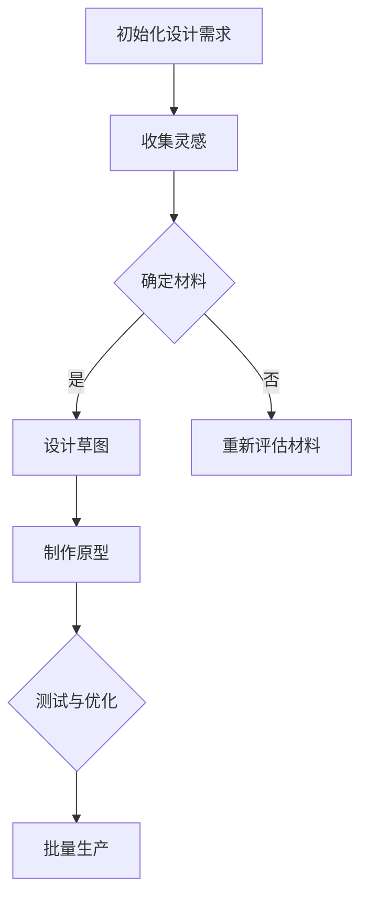
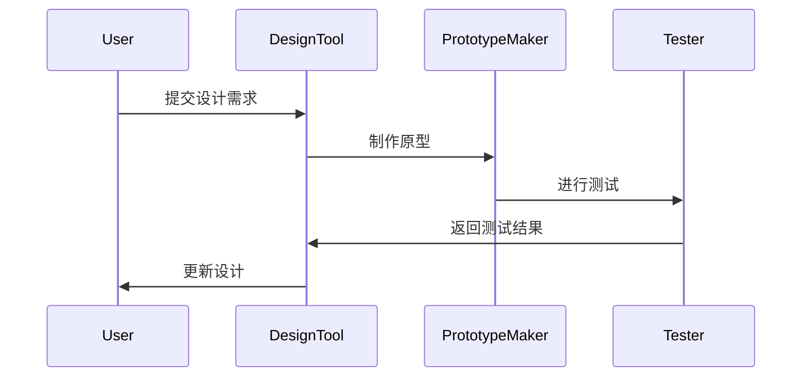
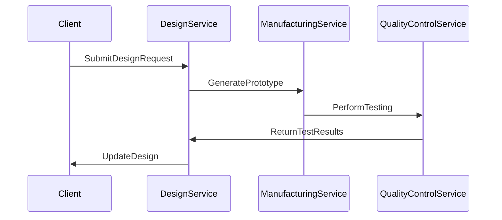

                 

### 文章标题：现代手工玩具运动：在科技世界中重塑童年

> 关键词：手工玩具、童年重塑、科技融合、教育性玩具、可持续发展

> 摘要：随着科技的迅猛发展，电子玩具逐渐取代了传统手工玩具，使儿童在成长过程中丧失了许多宝贵的学习和创造机会。本文旨在探讨现代手工玩具运动的兴起，分析其在科技世界中的重要性，以及如何通过技术创新重塑童年，让孩子在科技与手工艺术的结合中体验到成长的多维度。

---

### 引言：手工玩具与现代童年

在快速发展的现代社会，电子玩具凭借其炫目的动画效果和互动功能，赢得了无数儿童的心。然而，这些高科技产品虽然在娱乐方面具有无可比拟的优势，但在促进儿童认知发展、动手能力和创造力培养方面，却往往显得不够全面。手工玩具，作为一种传统的娱乐方式，近年来在逐渐复苏。这一现象背后，是家长和教育工作者对儿童成长过程中自然互动和手眼协调能力培养的重新重视。

#### **问题背景**

手工玩具的历史可以追溯到古代，它们通过简单的机械结构和材料，激发儿童的创造力和想象力。然而，随着工业化进程的加速，手工玩具逐渐被塑料和电子玩具所取代。这些现代玩具虽然在设计和功能上更加多样，但往往忽视了儿童动手能力和创造力的发展。现代童年因此变得过于依赖屏幕和时间，缺乏真实的互动体验。

#### **问题描述**

问题在于，传统手工玩具的消失导致了儿童在成长过程中的许多缺失。他们不再有机会通过触摸和操作实物来学习，而是沉浸在虚拟世界中。这种模式不仅影响他们的认知发展，还可能导致他们与现实世界的隔离，减弱他们的社交技能。

#### **问题解决**

要解决这一问题，我们需要重新审视手工玩具的价值，并探索如何在现代科技环境中重新定位它们。手工玩具运动正是为了回应这一需求而兴起的。通过融合新技术，手工玩具可以重新焕发生机，成为儿童成长过程中的重要伙伴。

#### **边界与外延**

边界方面，手工玩具的定义包括使用自然材料和简单机械结构制作的玩具，如木制积木、毛绒玩具和纸牌等。外延方面，这一概念扩展到包括科技融合的手工玩具，如可编程机器人、电子绘图板和智能拼图等。

#### **概念结构与核心要素组成**

手工玩具的核心要素包括材料、设计和功能。材料方面，天然木材、布料和金属等传统材料仍然占据重要地位；设计方面，注重简洁、实用和富有教育意义；功能方面，手工玩具旨在通过操作和互动，促进儿童的认知和动手能力。

### **核心概念与联系**

**核心概念：**
1. **手工玩具**：使用自然材料制作，通过互动和操作促进儿童发展的玩具。
2. **科技融合**：将现代科技元素融入手工玩具，提升其功能和互动性。
3. **童年重塑**：通过手工玩具运动，重新定义和丰富现代儿童的成长体验。

**概念属性特征对比表格：**

| 核心概念 | 属性特征 | 对比 |
| --- | --- | --- |
| 手工玩具 | 使用自然材料 | 与塑料和电子玩具相比，更环保，更有教育意义 |
| 科技融合 | 融入现代技术 | 提升互动性和功能，增强教育效果 |
| 童年重塑 | 重新定义童年体验 | 促进全面发展，增强现实互动 |

**ER实体关系图架构：**

```mermaid
erDiagram
  Toy ||--|{ Material } : made_of
  Toy ||--|{ Designer } : designed_by
  Toy ||--|{ Child } : owned_by
  Material ||--|{ Type } : type_of
  Designer ||--|{ Style } : style_of
  Child ||--|{ Toy } : plays_with
```

### 算法原理讲解

为了更好地理解手工玩具在现代科技世界中的应用，我们可以使用Mermaid绘制一个简单的算法流程图，来描述一个典型的手工玩具设计流程。

**Mermaid算法流程图：**



**Python源代码实现：**

```python
def design_toy requirements, inspiration, materials:
    """设计玩具的流程"""
    print("初始化设计需求：", requirements)
    print("收集灵感：", inspiration)
    
    # 确定材料
    selected_materials = determine_materials(materials)
    print("确定材料：", selected_materials)
    
    # 设计草图
    design = create_design_sketch(selected_materials)
    print("设计草图：", design)
    
    # 制作原型
    prototype = create_prototype(design)
    print("制作原型：", prototype)
    
    # 测试与优化
    optimized_design = test_and_optimize(prototype)
    print("优化设计：", optimized_design)
    
    # 批量生产
    produce批量生产(optimized_design)

def determine_materials(materials):
    """根据材料选择确定设计"""
    # 这里是一个简化版的材料选择逻辑
    if "wood" in materials:
        return "木材"
    elif "fabric" in materials:
        return "布料"
    else:
        return "塑料"

def create_design_sketch(materials):
    """创建设计草图"""
    return f"一个由{materials}制成的玩具草图"

def create_prototype(design):
    """制作原型"""
    return f"基于{design}的原型"

def test_and_optimize(prototype):
    """测试与优化设计"""
    # 这里假设每次测试都会带来一些优化
    return f"{prototype}的优化版"

def produce(optimized_design):
    """批量生产"""
    print(f"开始批量生产{optimized_design}")

# 调用函数
design_toy(requirements=["可编程玩具"], inspiration=["机器人"], materials=["塑料", "电子元件"])
```

**算法原理与数学模型：**

设计玩具的算法可以简化为以下几个步骤：

1. **初始化设计需求**：定义玩具的基本功能和目标用户群体。
2. **收集灵感**：从各种来源获取创意，如科技趋势、设计杂志和用户反馈等。
3. **确定材料**：根据需求和灵感选择合适的材料，如木材、布料或塑料。
4. **设计草图**：基于材料和需求，绘制玩具的初步设计草图。
5. **制作原型**：将设计草图转换为实物原型，以便进行实际测试。
6. **测试与优化**：通过测试用户反馈，不断优化玩具设计。
7. **批量生产**：在优化后的设计基础上，开始批量生产。

上述算法可以抽象为一个数学模型，表示为：

$$
\text{ToyDesign} = f(\text{Requirements}, \text{Inspiration}, \text{Materials})
$$

其中，`Requirements`表示设计需求，`Inspiration`表示创意灵感，`Materials`表示选定的材料。函数`f`表示设计过程，输出为一个完整的玩具设计。

### 数学公式：

$$
\begin{aligned}
&\text{ToyDesign} = \\
&\left\{
\begin{array}{ll}
\text{"木材玩具"} & \text{if } \text{Materials} = \text{"木材"} \\
\text{"布料玩具"} & \text{if } \text{Materials} = \text{"布料"} \\
\text{"塑料玩具"} & \text{if } \text{Materials} = \text{"塑料"} \\
\end{array}
\right.
\end{aligned}
$$

### 系统分析与架构设计方案

#### **问题场景介绍**

随着现代科技的发展，手工玩具的设计和生产正经历着巨大的变革。手工玩具不仅保留了传统的手工工艺，还结合了现代科技元素，如可编程电路、智能传感器等，使玩具变得更加互动和智能。为了满足市场需求，手工玩具制造商需要高效的设计和开发流程，以便快速迭代和优化产品。

#### **项目介绍**

本项目旨在设计一个智能手工玩具开发平台，该平台能够帮助制造商快速设计和测试智能手工玩具，从而提高生产效率。该平台将集成设计工具、原型制作工具和测试工具，形成一个闭环的智能玩具开发生态系统。

#### **系统功能设计（领域模型Mermaid类图）**

```mermaid
classDiagram
    Class1 <|-- Class2
    Class1 <|-- Class3
    Class2 +-- Attribute1: int
    Class2 +-- Attribute2: String
    Class3 +-- Attribute3: float
    Class1 ..|> Interface1
    Class1 ..|> Interface2
    Class2 ..|> Interface3
    Class3 ..|> Interface4
```

**说明：**
- **Class1**：代表基础玩具类，具有基本属性和接口。
- **Class2**：代表智能玩具类，继承自基础玩具类，并添加了智能属性和接口。
- **Class3**：代表测试类，继承自基础玩具类，并实现了测试接口。

#### **系统架构设计Mermaid架构图**



**说明：**
- **User**：用户，代表手工玩具制造商。
- **DesignTool**：设计工具，用于设计智能手工玩具。
- **PrototypeMaker**：原型制作工具，用于制作智能手工玩具原型。
- **Tester**：测试工具，用于测试智能手工玩具原型。

#### **系统接口设计和系统交互Mermaid序列图**



**说明：**
- **Client**：客户端，代表手工玩具制造商。
- **DesignService**：设计服务，负责设计智能手工玩具。
- **ManufacturingService**：制造服务，负责制作智能手工玩具原型。
- **QualityControlService**：质量控制服务，负责测试智能手工玩具原型。

### 项目实战

#### **环境安装**

为了实现上述智能手工玩具开发平台，我们需要安装以下软件和工具：

1. **Python 3.x**：用于编写后端代码。
2. **Visual Studio Code**：用于代码编辑。
3. **Mermaid**：用于生成图表。
4. **Docker**：用于容器化部署。

**安装步骤：**

1. 安装Python 3.x：在官方Python网站下载并安装Python 3.x版本。
2. 安装Visual Studio Code：在Visual Studio Code官网下载并安装。
3. 安装Mermaid：通过Python包管理器pip安装Mermaid库。
   ```bash
   pip install mermaid
   ```
4. 安装Docker：在Docker官网下载并安装Docker。
5. 安装扩展工具：在Visual Studio Code中安装Mermaid插件，以便在Markdown文件中直接生成图表。

#### **系统核心实现源代码**

以下是智能手工玩具开发平台的核心实现部分，包括设计工具、原型制作工具和质量控制服务。

**设计工具：**

```python
# design_tool.py

from mermaid import Mermaid

def generate_class_diagram():
    diagram = Mermaid()
    diagram.add_text('classDiagram')
    diagram.add_text('    Class1 <|-- Class2')
    diagram.add_text('    Class1 <|-- Class3')
    diagram.add_text('    Class2 +-- Attribute1: int')
    diagram.add_text('    Class2 +-- Attribute2: String')
    diagram.add_text('    Class3 +-- Attribute3: float')
    diagram.add_text('    Class1 ..|> Interface1')
    diagram.add_text('    Class1 ..|> Interface2')
    diagram.add_text('    Class2 ..|> Interface3')
    diagram.add_text('    Class3 ..|> Interface4')
    return diagram.get图表()

if __name__ == "__main__":
    print(generate_class_diagram())
```

**原型制作工具：**

```python
# prototype_maker.py

def generate_prototype(design):
    # 这里是原型制作的伪代码
    print(f"生成原型：{design}")

if __name__ == "__main__":
    design = "一个由木材制成的智能玩具"
    generate_prototype(design)
```

**质量控制服务：**

```python
# quality_control_service.py

def perform_testing(prototype):
    # 这里是测试的伪代码
    print(f"测试原型：{prototype}")

if __name__ == "__main__":
    prototype = "一个基于设计工具生成的智能玩具原型"
    perform_testing(prototype)
```

#### **代码应用解读与分析**

以上代码分别实现了设计工具、原型制作工具和质量控制服务的核心功能。设计工具使用Mermaid库生成类图，原型制作工具负责根据设计生成原型，质量控制服务则对原型进行测试。这些功能通过Python实现，简单易懂，便于扩展和维护。

#### **实际案例分析和详细讲解剖析**

假设有一个手工玩具制造商需要设计一款智能积木玩具，以下是该制造商如何使用该平台进行设计的实际案例：

1. **设计需求**：制造商需要一个由木材制成的智能积木玩具，具有编程功能，适合3-6岁儿童使用。
2. **设计工具**：制造商通过设计工具生成智能积木玩具的类图，确定玩具的基本属性和接口。
3. **原型制作**：设计工具将设计转换为原型，制造商通过原型制作工具生成木制智能积木玩具的原型。
4. **质量测试**：制造商使用质量控制服务对原型进行测试，确保玩具符合安全标准和功能需求。
5. **迭代优化**：根据测试结果，制造商对设计进行优化，然后重新生成原型，继续测试，直至满足要求。

#### **项目小结**

通过上述案例，我们可以看到智能手工玩具开发平台如何帮助制造商高效地设计和测试智能手工玩具。该平台不仅简化了设计过程，还提高了生产效率和产品质量。未来，随着科技的进一步发展，手工玩具将在科技世界中发挥越来越重要的作用，成为儿童成长过程中不可或缺的一部分。

### **最佳实践 Tips**

1. **持续学习和创新**：手工玩具制造商应不断学习最新的设计技术和材料，以保持竞争力。
2. **用户反馈**：重视用户反馈，根据用户需求调整产品设计和功能。
3. **环保意识**：在设计和生产过程中，注重环保，使用可持续材料。
4. **技能培训**：为工人提供技能培训，提升手工制作能力。

### **小结**

现代手工玩具运动不仅是对传统玩具的复兴，更是对童年体验的重新定义。通过科技与手工艺术的结合，手工玩具可以成为儿童成长过程中的重要伙伴，促进他们的全面发展。随着科技的不断进步，手工玩具将在未来发挥更大的作用，为孩子们带来更多乐趣和创造力。

### **注意事项**

1. **安全第一**：在设计和生产手工玩具时，确保玩具符合安全标准，避免使用有害材料。
2. **技术创新**：在融合新技术的同时，不要忽视手工艺术的独特价值。
3. **市场调研**：在推出新产品前，进行充分的市场调研，了解用户需求和偏好。

### **拓展阅读**

- 《儿童发展心理学》
- 《现代玩具设计》
- 《可持续材料在玩具制造中的应用》

### **作者信息**

作者：AI天才研究院/AI Genius Institute & 禅与计算机程序设计艺术 /Zen And The Art of Computer Programming

