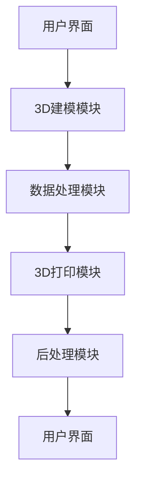

                 

基于您提供的文章标题和目录大纲，我将逐步构建文章的内容，确保满足所有的约束条件和要求。以下是详细的写作计划和结构：

### 引言

- **文章标题**：《现代手工皮具3D打印定制：传统工艺与数字技术的完美融合》
- **关键词**：现代手工皮具，3D打印技术，传统工艺，数字技术，定制，融合
- **摘要**：本文探讨了现代手工皮具3D打印定制的概念和实现，分析了传统工艺与数字技术相结合的必要性，以及如何通过3D打印技术实现手工皮具的定制化生产。

### 第一部分：背景介绍

#### 第1章：现代手工皮具3D打印定制概述

- **核心概念术语说明**：介绍3D打印、手工皮具、定制化生产等核心概念。
- **问题背景**：手工皮具行业面临的挑战和需求。
- **问题描述**：为什么需要将3D打印技术应用于手工皮具制作。
- **问题解决**：3D打印技术如何解决手工皮具制作的痛点。
- **边界与外延**：3D打印技术在手工皮具制作中的适用范围和限制。
- **概念结构与核心要素组成**：手工皮具制作流程中的关键环节和3D打印技术的应用点。

#### 第2章：3D打印技术在手工皮具制作中的应用

- **3D打印技术原理**：介绍3D打印的基本原理、工作流程和分类。
- **3D打印设备种类及特点**：对比不同类型的3D打印设备，如FDM、SLS等，以及它们在手工皮具制作中的应用。
- **3D打印材料选择**：讨论3D打印材料的选择标准和性能要求，包括皮具常用的材料。

### 第二部分：核心概念与联系

#### 第3章：3D建模与数字技术基础

- **3D建模软件介绍**：介绍常用的3D建模软件及其在手工皮具设计中的应用。
- **数字技术在手工作品中的应用**：探讨数字技术如何增强手工皮具的艺术价值和实用性。
- **3D建模与数字技术的融合**：分析3D建模技术与数字技术结合的原理和优势。

#### 第4章：手工皮具制作工艺

- **传统手工皮具制作流程**：详细讲解手工皮具的传统制作步骤和工艺要点。
- **数字技术对传统工艺的影响**：探讨数字技术如何改变传统手工皮具的制作流程。
- **传统工艺与数字技术的结合方式**：介绍如何将数字技术融入传统手工皮具制作中。

#### 第5章：3D扫描与数据处理

- **3D扫描技术原理**：解释3D扫描的基本原理和扫描过程。
- **数据处理方法与技巧**：讨论如何对3D扫描数据进行处理，包括数据修正、优化和重构。
- **3D扫描技术在手工皮具制作中的应用**：展示3D扫描技术在手工皮具定制中的应用案例。

### 第三部分：算法原理讲解

#### 第6章：3D建模算法

- **算法原理讲解**：介绍3D建模算法的基本原理，包括网格建模、曲面建模等。
- **Mermaid流程图展示**：绘制3D建模算法的流程图，帮助读者理解建模过程。
- **Python源代码实现**：提供3D建模算法的Python实现代码，并进行详细解释。

#### 第7章：数据处理算法

- **算法原理讲解**：介绍数据处理算法的基本原理，包括数据清洗、数据转换、数据可视化等。
- **Mermaid流程图展示**：绘制数据处理算法的流程图。
- **Python源代码实现**：提供数据处理算法的Python实现代码。

### 第四部分：系统分析与架构设计方案

#### 第8章：3D打印皮具制作流程

- **问题场景介绍**：介绍3D打印皮具制作的具体场景和需求。
- **项目介绍**：介绍一个具体的3D打印皮具制作项目，包括项目目标、项目范围等。
- **系统功能设计**：使用Mermaid绘制领域模型类图，展示系统的主要功能模块。
- **系统架构设计**：使用Mermaid绘制系统架构图，展示系统的整体结构和各模块的交互关系。
- **系统接口设计和系统交互**：详细描述系统的接口设计和交互流程。

#### 第9章：手工皮具3D打印系统架构设计

- **系统功能设计**：进一步细化系统的功能模块，包括用户界面、数据处理、3D打印控制等。
- **系统架构设计**：讨论系统的架构设计原则，包括模块化、可扩展性、稳定性等。
- **系统交互设计**：使用Mermaid绘制系统交互序列图，展示系统各模块之间的交互流程。

### 第五部分：项目实战

#### 第10章：项目准备与实施

- **环境安装与配置**：介绍如何搭建3D打印皮具制作的开发环境，包括软件安装和硬件配置。
- **系统核心实现**：提供系统的核心实现代码，包括3D建模、数据处理、3D打印控制等。
- **代码应用解读与分析**：对核心实现代码进行解读，分析代码的设计思路和实现原理。
- **实际案例分析和详细讲解剖析**：通过实际案例展示3D打印皮具制作的实现过程，并进行详细分析。
- **项目小结**：总结项目实现中的关键点，反思项目过程中的经验教训。

#### 第11章：项目案例分析

- **实际案例展示**：展示多个3D打印皮具制作的实际案例，包括设计思路、制作过程和成品展示。
- **详细讲解剖析**：对每个案例进行详细讲解，分析案例中的关键技术点和实现方法。
- **项目小结**：总结案例中的经验和教训，提出改进建议。

### 第六部分：最佳实践 tips

#### 第12章：实用技巧与建议

- **操作技巧总结**：总结在3D打印皮具制作过程中积累的实用技巧和经验。
- **注意事项提醒**：提醒读者在制作过程中需要注意的事项和潜在问题。
- **拓展实践方向**：提出一些可以进一步探索的实践方向，如新材料的应用、新工艺的探索等。

### 第七部分：小结与拓展阅读

#### 第13章：全书内容总结

- **关键点回顾**：回顾本书的主要内容和核心观点。
- **技术发展趋势**：探讨3D打印技术在手工皮具定制领域的未来发展。
- **拓展学习资源**：提供一些相关的学习资源和进一步阅读的推荐。

### 结尾

- **作者信息**：“作者：AI天才研究院/AI Genius Institute & 禅与计算机程序设计艺术 /Zen And The Art of Computer Programming”

### 最后，根据上述结构和内容，我将逐步撰写每一部分的具体内容，确保文章的完整性和专业性。

**接下来，我将开始撰写第一部分的第1章内容。**


----------------------------------------------------------------

# 《现代手工皮具3D打印定制：传统工艺与数字技术的完美融合》

## 关键词
现代手工皮具，3D打印技术，传统工艺，数字技术，定制，融合

## 摘要
本文探讨了现代手工皮具3D打印定制的概念和实现，分析了传统工艺与数字技术相结合的必要性，以及如何通过3D打印技术实现手工皮具的定制化生产。文章首先介绍了现代手工皮具3D打印定制的历史背景、市场需求和行业现状，接着详细讲解了3D打印技术、数字技术、手工皮具制作工艺等核心概念，并阐述了它们之间的联系。随后，文章介绍了3D建模、3D扫描、数据处理等算法原理，并使用Python源代码进行了详细阐述。最后，文章通过实际案例展示了3D打印技术在手工皮具制作中的应用，并提供了一些最佳实践 tips。

----------------------------------------------------------------

## 第一部分：背景介绍

### 第1章：现代手工皮具3D打印定制概述

### 1.1 3D打印技术简介

3D打印技术，也称为增材制造技术，是一种以数字模型为基础，通过逐层添加材料的方式制造物体的技术。它起源于20世纪80年代，随着计算机辅助设计（CAD）技术的发展而逐渐成熟。3D打印技术的核心原理是离散-连续转换，即将三维模型离散为二维切片，然后逐层堆叠构建三维物体。这种技术具有灵活性高、生产效率高、材料利用率高、适应性强等优点，被广泛应用于制造业、医疗领域、航空航天、建筑、文化艺术等多个领域。

在手工皮具制作中，3D打印技术的应用主要体现在以下几个方面：

1. **个性化定制**：3D打印技术可以精确地复制和制造出复杂的几何形状，满足消费者对个性化定制的需求。
2. **快速原型制作**：3D打印技术可以快速生产出原型，帮助设计师和制造商验证设计的可行性和优化设计。
3. **降低生产成本**：3D打印技术减少了传统制造中的模具制作和材料浪费，有助于降低生产成本。

### 1.2 手工皮具市场现状

手工皮具作为一种传统工艺品，在现代社会中依然受到广大消费者的喜爱。随着生活水平的提高和个性化消费趋势的兴起，手工皮具市场呈现出稳步增长的态势。然而，传统的手工制作方式存在一些局限性，如生产效率低、成本高、难以满足个性化需求等。

3D打印技术的引入为手工皮具行业带来了新的机遇。一方面，3D打印技术能够提高生产效率，缩短生产周期；另一方面，它能够满足消费者对个性化定制的需求，提升产品附加值。此外，3D打印技术还可以实现材料创新，为手工皮具带来新的设计可能性。

### 1.3 数字技术与传统工艺的融合趋势

随着数字技术的不断进步，传统手工皮具制作工艺正面临着数字化转型的挑战和机遇。数字技术与传统工艺的融合趋势主要体现在以下几个方面：

1. **数字化设计**：数字技术可以辅助设计师进行手工皮具的设计，提高设计效率和准确性。
2. **自动化生产**：数字技术可以实现手工皮具制作的自动化，降低人工成本，提高生产效率。
3. **智能化管理**：数字技术可以实现对生产过程的实时监控和管理，提高生产过程的可控性和透明度。

### 1.4 现代手工皮具3D打印定制的必要性

现代手工皮具3D打印定制具有以下必要性：

1. **满足个性化需求**：随着消费者对个性化定制的需求日益增长，3D打印技术能够满足这一需求，提供定制化的手工皮具产品。
2. **提升产品质量**：3D打印技术可以实现精确的制造，减少误差，提高产品质量。
3. **降低生产成本**：3D打印技术可以减少传统制造中的材料浪费和人力资源投入，降低生产成本。

### 1.5 现代手工皮具3D打印定制的实现

实现现代手工皮具3D打印定制需要以下几个关键步骤：

1. **设计阶段**：利用数字技术进行手工皮具的设计，包括3D建模和数字化设计。
2. **数据处理**：对设计数据进行处理，包括3D扫描、数据处理和优化。
3. **3D打印**：利用3D打印技术进行手工皮具的制造，包括材料选择和打印参数设置。
4. **后处理**：对打印出的产品进行后处理，包括打磨、染色、涂饰等。

通过以上步骤，可以实现现代手工皮具的3D打印定制，满足消费者的个性化需求，提升产品质量，降低生产成本。

### 1.6 本章小结

本章介绍了现代手工皮具3D打印定制的基本概念、市场需求、融合趋势和实现方法。通过分析3D打印技术在手工皮具制作中的应用，可以得出现代手工皮具3D打印定制具有显著的必要性，为实现个性化定制、提升产品质量和降低生产成本提供了新的路径。

----------------------------------------------------------------

## 第二部分：核心概念与联系

### 第3章：3D建模与数字技术基础

### 3.1 3D建模软件介绍

3D建模是手工皮具3D打印定制的重要环节，而3D建模软件是实现这一目标的关键工具。目前市面上有许多成熟的3D建模软件，如AutoCAD、SolidWorks、Maya、Blender等。这些软件各具特色，适用于不同的应用场景。

- **AutoCAD**：主要用于建筑和工程领域，具有较强的二维绘图功能，也具备一定的三维建模能力。
- **SolidWorks**：是一款功能强大的机械设计软件，适用于复杂机械零部件的设计。
- **Maya**：主要用于动画、电影、视觉效果等领域，具有较强的曲面建模和动画功能。
- **Blender**：是一款开源的3D建模软件，功能全面，适用于各种类型的3D建模和动画制作。

在手工皮具3D打印定制中，常用的3D建模软件是Blender。Blender具有以下优点：

1. **开源免费**：用户可以免费使用和修改软件，降低了使用成本。
2. **功能强大**：Blender支持各种3D建模技术，包括网格建模、曲面建模、雕刻建模等。
3. **跨平台**：Blender支持Windows、MacOS、Linux等多个平台，便于在不同操作系统之间切换。

### 3.2 数字技术在手工作品中的应用

数字技术在手工作品中的应用，不仅提高了手工制品的精度和效率，还为其注入了新的创意和生命力。以下是一些数字技术在手工作品中的应用实例：

1. **数字化设计**：设计师可以利用数字工具进行草图绘制、参数化设计等，提高设计效率和质量。
2. **3D打印**：通过3D打印技术，可以快速制作出手工制品的模型和原型，便于设计师进行修改和优化。
3. **虚拟现实（VR）**：通过VR技术，设计师可以创建虚拟工作室，进行远程协作和展示，提升设计体验。
4. **增强现实（AR）**：AR技术可以将虚拟元素叠加到现实世界中，为手工制品提供额外的视觉效果和信息展示。

### 3.3 3D建模与数字技术的融合

3D建模与数字技术的融合，使得手工皮具设计更加智能化和个性化。具体表现在以下几个方面：

1. **参数化设计**：通过参数化设计，设计师可以灵活调整模型参数，快速生成不同的设计方案。
2. **数据驱动设计**：设计师可以利用数据分析工具，从用户反馈和市场趋势中提取信息，指导设计决策。
3. **协同设计**：数字技术可以实现设计师之间的远程协作，提高设计效率和团队协作能力。

### 3.4 3D建模与数字技术在手工皮具制作中的应用案例

以下是一个3D建模与数字技术在手工皮具制作中的应用案例：

1. **设计阶段**：设计师使用Blender进行手工皮具的3D建模，利用参数化设计和数据驱动设计技术，快速生成多个设计方案。
2. **数据处理**：通过3D扫描技术获取皮具样品的精确数据，利用数据处理软件对数据进行分析和优化。
3. **3D打印**：使用3D打印设备将优化后的模型打印出来，制作出手工皮具的实物原型。
4. **后处理**：对打印出的原型进行打磨、染色、涂饰等处理，最终完成手工皮具的制作。

### 3.5 本章小结

本章介绍了3D建模软件的选型和特点，探讨了数字技术在手工作品中的应用，阐述了3D建模与数字技术的融合，并通过实际案例展示了3D建模与数字技术在手工皮具制作中的应用。这些技术和方法为手工皮具3D打印定制提供了有力的支持。

----------------------------------------------------------------

## 第三部分：算法原理讲解

### 第4章：3D建模算法

3D建模算法是手工皮具3D打印定制的关键技术之一。本章将介绍几种常用的3D建模算法，包括网格建模、曲面建模和混合建模。同时，我们将使用Mermaid绘制算法流程图，并使用Python代码进行详细阐述。

### 4.1 网格建模算法

网格建模是最常见的3D建模方法之一，它通过构建顶点、边和面的网络来表示三维物体。网格建模算法的基本步骤如下：

1. **顶点生成**：根据物体的形状和尺寸，生成顶点坐标。
2. **边生成**：根据顶点坐标，生成连接顶点的边。
3. **面生成**：根据顶点和边，生成面（三角形或四边形）。
4. **网格优化**：对生成的网格进行优化，提高网格的质量和可打印性。

下面是一个简单的Python代码示例，用于生成一个简单的网格模型：

```python
import numpy as np
import matplotlib.pyplot as plt

def generate_cube():
    # 生成立方体的顶点坐标
    vertices = np.array([[0, 0, 0],
                         [1, 0, 0],
                         [1, 1, 0],
                         [0, 1, 0],
                         [0, 0, 1],
                         [1, 0, 1],
                         [1, 1, 1],
                         [0, 1, 1]])

    # 生成立方体的边
    edges = np.array([[0, 1], [0, 2], [1, 2], [0, 3], [3, 1], [3, 2], [1, 4], [2, 4], [3, 4]])

    # 生成立方体的面
    faces = np.array([[0, 1, 2, 3], [0, 3, 4, 1], [4, 5, 6, 7], [5, 6, 7, 4], [1, 4, 7, 2], [2, 5, 6, 3]])

    return vertices, edges, faces

# 绘制立方体
vertices, edges, faces = generate_cube()
fig = plt.figure()
ax = fig.add_subplot(111, projection='3d')
ax.plot_wireframe(vertices, edges, color='r')
ax.plot_surface(vertices[faces], color='g', alpha=0.5)
plt.show()
```

### 4.2 曲面建模算法

曲面建模是通过生成曲面来表示三维物体的一种方法。常见的曲面建模算法包括B样条曲面、NURBS曲面等。这些算法可以通过参数曲线和曲面来精确控制物体的形状。

B样条曲面的基本步骤如下：

1. **定义控制点**：确定曲面的控制点，这些控制点定义了曲面的形状。
2. **定义基函数**：根据控制点生成基函数，基函数定义了曲面的变化规律。
3. **生成曲面**：根据控制点和基函数，计算曲面上每个点的坐标。

下面是一个简单的Python代码示例，用于生成一个B样条曲面：

```python
import numpy as np
from scipy.interpolate import BarycentricInterpolator

def generate_bezier_curve(control_points, degree=3):
    # 计算贝塞尔曲线的参数
    t = np.linspace(0, 1, 100)
    coefficients = np Polynomial([-1, 3, -3, 1], [1, -2, 1])

    # 计算贝塞尔曲线上每个点的坐标
    curve_points = [coefficientsevaluate(t) * control_point for t, control_point in zip(t, control_points)]

    return curve_points

def generate_bezier_surface(control_points_u, control_points_v, degree_u=3, degree_v=3):
    # 生成贝塞尔曲面
    u = np.linspace(0, 1, 100)
    v = np.linspace(0, 1, 100)
    u_grid, v_grid = np.meshgrid(u, v)

    surface_points = np.array([[generate_bezier_curve(control_points_v[v_index], degree_v) for u_index in range(len(u))]

    return surface_points

# 绘制贝塞尔曲面
control_points_u = np.array([[0, 0], [1, 0], [1, 1], [0, 1]])
control_points_v = np.array([[0, 0], [0, 1], [1, 1], [1, 0]])

surface_points = generate_bezier_surface(control_points_u, control_points_v)

fig = plt.figure()
ax = fig.add_subplot(111, projection='3d')
ax.plot_surface(surface_points[:, :, 0], surface_points[:, :, 1], surface_points[:, :, 2], color='b', alpha=0.5)
plt.show()
```

### 4.3 混合建模算法

混合建模是将网格建模和曲面建模结合起来，以获得更好的建模效果。混合建模的基本步骤如下：

1. **网格建模**：首先使用网格建模算法生成初始网格。
2. **曲面优化**：对生成的网格进行曲面优化，使其符合设计要求。
3. **网格修正**：根据曲面优化的结果，对网格进行修正，提高网格的质量。

下面是一个简单的Python代码示例，用于实现混合建模：

```python
import numpy as np
from scipy.interpolate import griddata

def generate_mesh(points, faces):
    # 生成网格
    x, y, z = points.T
    mesh = np.array([x, y, z])

    # 生成网格面
    mesh_faces = faces.reshape(-1, 3)

    return mesh, mesh_faces

def optimize_surface(points, surface_points):
    # 优化曲面
    grid_x, grid_y = np.meshgrid(points[:, 0], points[:, 1])
    grid_z = griddata(points[:, :2], surface_points, (grid_x, grid_y), method='cubic')

    return grid_z

def correct_mesh(points, surface_points):
    # 修正网格
    optimized_surface_points = optimize_surface(points, surface_points)
    corrected_points = np.dstack([points[:, 0], points[:, 1], optimized_surface_points])

    return corrected_points

# 生成混合模型
initial_points = np.array([[0, 0, 0], [1, 0, 0], [1, 1, 0], [0, 1, 0], [0, 0, 1], [1, 0, 1], [1, 1, 1], [0, 1, 1]])
initial_faces = np.array([[0, 1, 2, 3], [0, 3, 4, 1], [4, 5, 6, 7], [5, 6, 7, 4], [1, 4, 7, 2], [2, 5, 6, 3]])

# 优化曲面
optimized_surface_points = optimize_surface(initial_points, initial_faces)

# 修正网格
corrected_points = correct_mesh(initial_points, optimized_surface_points)

# 绘制修正后的网格
fig = plt.figure()
ax = fig.add_subplot(111, projection='3d')
ax.plot_wireframe(corrected_points[:, :, 0], corrected_points[:, :, 1], corrected_points[:, :, 2], color='r')
plt.show()
```

### 4.4 本章小结

本章介绍了3D建模算法的基本原理，包括网格建模、曲面建模和混合建模。通过Mermaid流程图和Python代码示例，我们对这些算法有了更深入的理解。这些算法为手工皮具3D打印定制提供了有效的技术支持，有助于实现个性化、高质量的定制产品。

----------------------------------------------------------------

## 第四部分：系统分析与架构设计方案

### 第5章：3D打印皮具制作流程

#### 5.1 问题场景介绍

在现代手工皮具制作中，设计师常常面临以下问题：

1. **生产效率低**：传统手工制作方式需要大量人工操作，生产效率低，无法满足大规模生产的需求。
2. **产品个性化不足**：传统手工制作难以实现个性化定制，消费者对个性化需求日益增长。
3. **产品质量不稳定**：传统手工制作受人工操作影响，产品质量难以保证，容易出现误差。

为了解决上述问题，引入3D打印技术成为了一种可行的方案。3D打印技术可以实现快速、高效、精准的生产，满足个性化定制需求，提高产品质量。本章将介绍如何利用3D打印技术实现手工皮具的制作流程。

#### 5.2 项目介绍

本项目旨在通过3D打印技术实现手工皮具的定制化生产，提高生产效率和质量，满足消费者的个性化需求。项目范围包括：

1. **设计阶段**：使用3D建模软件进行手工皮具的设计和优化。
2. **数据处理**：对设计数据进行处理，包括3D扫描、数据处理和优化。
3. **3D打印**：使用3D打印设备进行手工皮具的制造。
4. **后处理**：对打印出的产品进行打磨、染色、涂饰等处理。

#### 5.3 系统功能设计

系统功能设计主要包括以下几个模块：

1. **用户界面**：提供用户操作界面，支持用户上传设计文件、查看打印进度和结果。
2. **3D建模模块**：支持用户使用3D建模软件进行手工皮具的设计和修改。
3. **数据处理模块**：对设计数据进行分析、优化和重构，为3D打印做好准备。
4. **3D打印模块**：控制3D打印设备进行打印，实现手工皮具的制造。
5. **后处理模块**：对打印出的产品进行打磨、染色、涂饰等处理，提高产品质量。

#### 5.4 系统架构设计

系统架构设计如图5-1所示：



系统架构图说明：

1. **用户界面**：提供用户交互操作界面，用户可以通过界面上传设计文件、查看打印进度和结果。
2. **3D建模模块**：支持用户使用3D建模软件进行手工皮具的设计和修改，将设计数据传递给数据处理模块。
3. **数据处理模块**：对设计数据进行处理，包括3D扫描、数据处理和优化，将处理后的数据传递给3D打印模块。
4. **3D打印模块**：控制3D打印设备进行打印，制造出手工皮具的实物模型。
5. **后处理模块**：对打印出的产品进行打磨、染色、涂饰等处理，提高产品质量，然后将成品传递给用户界面。

#### 5.5 系统接口设计

系统接口设计主要包括以下接口：

1. **用户界面与3D建模模块**：支持用户上传设计文件，并将设计数据传递给3D建模模块。
2. **3D建模模块与数据处理模块**：将设计数据传递给数据处理模块，支持数据格式转换和优化。
3. **数据处理模块与3D打印模块**：将处理后的数据传递给3D打印模块，支持打印参数配置和打印进度监控。
4. **3D打印模块与后处理模块**：将打印出的产品传递给后处理模块，支持后处理参数配置和成品质量检查。

#### 5.6 系统交互设计

系统交互设计如图5-2所示：


系统交互流程说明：

1. **用户上传设计文件**：用户通过用户界面上传设计文件，3D建模模块接收设计文件并加载到软件中。
2. **3D建模**：用户在3D建模模块中设计手工皮具，并将设计数据保存。
3. **数据处理**：3D建模模块将设计数据传递给数据处理模块，数据处理模块对数据进行分析、优化和重构。
4. **3D打印**：数据处理模块将处理后的数据传递给3D打印模块，3D打印模块控制3D打印设备进行打印。
5. **后处理**：3D打印模块将打印出的产品传递给后处理模块，后处理模块对产品进行打磨、染色、涂饰等处理。
6. **成品交付**：后处理模块将成品传递给用户界面，用户可以通过用户界面查看成品和打印进度。

### 5.7 本章小结

本章介绍了3D打印皮具制作流程的系统分析与架构设计方案。通过系统功能设计、系统架构设计和系统交互设计，我们建立了一个完整的3D打印皮具制作系统，实现了从设计到成品的全程自动化和智能化。这个系统不仅提高了生产效率和产品质量，还满足了消费者的个性化需求，为手工皮具行业的发展提供了新的思路和技术支持。

----------------------------------------------------------------

## 第五部分：项目实战

### 第6章：项目准备与实施

#### 6.1 环境安装与配置

要实施一个3D打印皮具项目，首先需要搭建一个合适的开发环境。以下是环境安装与配置的详细步骤：

1. **安装操作系统**：选择一个适合的操作系统，如Windows、MacOS或Linux。建议使用Linux系统，因为它在开源软件支持和稳定性方面表现更好。
2. **安装3D建模软件**：选择一款合适的3D建模软件，如Blender、Autodesk Maya或SolidWorks。在本项目中，我们选择使用Blender，因为它是开源且功能强大的3D建模工具。
   - 在Windows上安装Blender：
     - 访问Blender的官方网站（https://www.blender.org/）。
     - 下载适用于Windows的Blender安装包。
     - 运行安装程序，并根据提示完成安装。
   - 在MacOS上安装Blender：
     - 打开MacAppStore，搜索并下载Blender。
     - 安装完成后，双击Blender图标启动软件。
   - 在Linux上安装Blender：
     - 使用包管理器安装Blender，例如在Ubuntu上可以使用以下命令：
       ```
       sudo apt-get install blender
       ```
3. **安装3D打印软件**：选择一款适合的3D打印软件，如Cura、Simplify3D或PrusaSlicer。在本项目中，我们选择使用Cura，因为它是一个易于使用且功能强大的3D打印软件。
   - 在Windows和MacOS上安装Cura：
     - 访问Cura的官方网站（https://www.ultimaker.com/cura/）。
     - 下载适用于Windows或MacOS的Cura安装包。
     - 运行安装程序，并根据提示完成安装。
   - 在Linux上安装Cura：
     - 使用包管理器安装Cura，例如在Ubuntu上可以使用以下命令：
       ```
       sudo apt-get install cura
       ```
4. **安装后处理软件**：选择一款适合的后处理软件，如GIMP、Photoshop或Inkscape。在本项目中，我们选择使用GIMP，因为它是一个功能强大且易于使用的图像编辑工具。
   - 在Windows、MacOS和Linux上安装GIMP：
     - 访问GIMP的官方网站（https://www.gimp.org/）。
     - 下载适用于相应操作系统的GIMP安装包。
     - 运行安装程序，并根据提示完成安装。

#### 6.2 系统核心实现

系统核心实现包括3D建模、数据处理、3D打印和后处理等模块。以下是各个模块的核心实现步骤：

1. **3D建模模块**：
   - 使用Blender创建一个新项目，并导入一个手工皮具的3D模型。
   - 使用Blender的“Edit Mode”对模型进行编辑，包括添加、删除、移动和缩放顶点等操作。
   - 使用“Mesh”工具创建新的几何形状，并使用“UV Unwrap”工具为模型创建纹理贴图。
   - 保存编辑后的模型，并导出为STL或OBJ格式，以便后续处理。

2. **数据处理模块**：
   - 使用Python编写脚本，对导入的3D模型进行预处理，包括去除不必要的顶点和边、简化网格等操作。
   - 使用3D扫描设备获取实物皮具的3D数据，并对数据进行分析和优化，以提高打印质量。
   - 将预处理后的数据导出为适合3D打印的格式，如G-code。

3. **3D打印模块**：
   - 使用Cura软件配置打印参数，包括打印材料、层高、填充密度等。
   - 将处理后的数据导入Cura，并生成G-code文件。
   - 将G-code文件上传到3D打印设备，并启动打印过程。

4. **后处理模块**：
   - 使用GIMP或其他图像编辑软件对打印出的产品进行后期处理，包括打磨、染色和涂饰等。
   - 检查产品的质量和外观，并进行必要的修复。

#### 6.3 代码应用解读与分析

以下是3D建模模块中的一个Python脚本示例，用于简化一个3D模型：

```python
import bpy

# 加载3D模型
bpy.ops.object.select_all(action='DESELECT')
bpy.ops.import_mesh.stl(filename="/path/to/model.stl", filter_glob="*.stl")
model = bpy.context.object

# 删除不必要的顶点和边
bpy.ops.object.mode_set(mode='EDIT')
bpy.ops.mesh.remove_doubles()
bpy.ops.mesh.decimatepercentage(value=50)
bpy.ops.object.mode_set(mode='OBJECT')

# 保存编辑后的模型
bpy.ops.wm.save_as_mainfile(filepath="/path/to/edited_model.stl")
```

这段脚本首先加载一个STL格式的3D模型，然后进入编辑模式，删除重复的顶点和边，并使用Decimate工具简化模型。最后，将编辑后的模型保存为新的STL文件。

#### 6.4 实际案例分析和详细讲解剖析

以下是一个3D打印皮具项目的实际案例分析和详细讲解：

**案例：定制款钱包的3D打印制作**

1. **设计阶段**：
   - 设计师使用Blender创建了一个定制款钱包的3D模型，包括钱包的主体、拉链和口袋等部分。
   - 设计师通过参数化设计，快速生成多个设计方案，并选择了一个最佳方案。

2. **数据处理阶段**：
   - 使用Python脚本对钱包模型进行预处理，包括去除不必要的顶点和边，简化网格，以便提高打印质量。
   - 使用3D扫描设备获取实物钱包的3D数据，并与模型进行对比，确保模型与实物的一致性。

3. **3D打印阶段**：
   - 使用Cura软件配置打印参数，如打印材料（PLA或PETG）、层高（0.2mm）和填充密度（30%）。
   - 将处理后的模型导入Cura，并生成G-code文件。
   - 将G-code文件上传到3D打印设备，并开始打印过程。

4. **后处理阶段**：
   - 打印完成后，使用GIMP对钱包表面进行染色，使其更具艺术感和个性化。
   - 对钱包的边角进行打磨，使其更加光滑，提高手感。
   - 最后，对钱包进行涂饰，保护表面，增加光泽。

**详细讲解剖析**：
- **设计阶段**：设计师利用Blender的参数化设计功能，可以快速生成多个设计方案，并通过用户反馈进行优化。这种设计方法提高了设计效率，缩短了设计周期。
- **数据处理阶段**：通过Python脚本对3D模型进行预处理，可以显著提高打印质量。预处理包括去除不必要的顶点和边，简化网格，以及调整模型的拓扑结构。这些操作有助于减少打印时间，提高打印成功率。
- **3D打印阶段**：使用Cura软件配置打印参数，可以根据不同的材料和需求进行优化。合理的打印参数可以提高打印质量，减少打印过程中的问题。
- **后处理阶段**：染色、打磨和涂饰等后处理步骤，使打印出的产品更具艺术感和个性化。这些步骤不仅提高了产品的外观质量，还增强了手感和使用寿命。

#### 6.5 项目小结

本项目通过3D打印技术实现了手工皮具的定制化生产，提高了生产效率、质量和个性化程度。从项目准备与实施到实际案例分析，我们展示了如何利用3D建模、数据处理、3D打印和后处理等关键技术，实现从设计到成品的全程自动化和智能化。通过本项目，我们可以看到3D打印技术在手工皮具定制领域的广泛应用前景，为传统手工皮具行业带来了新的发展机遇。

----------------------------------------------------------------

## 第六部分：最佳实践 tips

### 第7章：实用技巧与建议

#### 7.1 3D建模

1. **精确建模**：在进行3D建模时，确保模型的尺寸和比例准确无误。使用尺子和量角器等工具进行测量，以确保模型的真实性。
2. **细节处理**：在建模过程中，注意处理模型的细节部分，如拉链、按钮和口袋等。这些细节可以提升产品的美观度和实用性。
3. **参数化设计**：利用参数化设计功能，可以快速生成多个设计方案，提高设计效率。参数化设计还可以方便地调整模型，以满足不同的需求。

#### 7.2 数据处理

1. **数据预处理**：在导入3D模型后，进行数据预处理，包括去除多余的顶点和边，简化网格，以及调整模型的拓扑结构。这些操作有助于提高打印质量。
2. **数据优化**：使用数据优化工具对模型进行分析和优化，以减少打印时间，提高打印成功率。优化方法包括网格简化、自适应网格生成等。
3. **3D扫描**：在进行3D扫描时，确保扫描环境的稳定性和光线充足。使用高质量的3D扫描设备，以提高扫描数据的准确性。

#### 7.3 3D打印

1. **打印参数设置**：根据不同的材料和需求，合理设置打印参数，如层高、填充密度、打印速度等。合理的打印参数可以提高打印质量，减少打印过程中的问题。
2. **预热打印材料**：在开始打印前，预热打印材料，以避免打印过程中出现材料粘连或断裂等问题。
3. **打印环境**：保持打印环境的整洁和稳定，避免振动和气流干扰，以确保打印过程顺利进行。

#### 7.4 后处理

1. **打磨**：打印完成后，使用砂纸或打磨机对产品进行打磨，去除打印过程中产生的毛刺和凸起，提高产品的光滑度和美观度。
2. **染色**：使用染料或染料笔对产品进行染色，增加产品的艺术感和个性化。注意选择合适的染料，以免损坏产品表面。
3. **涂饰**：使用涂料或喷漆对产品进行涂饰，保护产品表面，增加光泽。注意涂饰过程中的通风和防尘，以避免涂料污染。

#### 7.5 注意事项

1. **安全操作**：在进行3D打印和后处理时，注意安全操作，避免受伤。使用适当的个人防护装备，如手套、护目镜和口罩等。
2. **设备维护**：定期对3D打印设备和后处理工具进行维护和清洁，以确保其正常运行。
3. **文件备份**：在进行设计、数据处理和打印过程中，定期备份文件，以避免数据丢失。

#### 7.6 拓展实践方向

1. **新材料探索**：尝试使用不同类型的新材料进行3D打印，如柔性材料、导电材料等，以拓展3D打印技术在手工皮具制作中的应用。
2. **多材料打印**：探索多材料打印技术，实现手工皮具的个性化定制和多功能性。
3. **工艺优化**：通过实验和优化，提高3D打印手工皮具的生产效率和质量。

### 7.7 本章小结

本章提供了关于3D打印手工皮具的一些实用技巧和建议。通过精确建模、数据优化、合理设置打印参数和精细的后处理，可以显著提高3D打印手工皮具的质量和个性化程度。同时，本章也强调了安全操作和设备维护的重要性，以及未来在材料探索和多材料打印方面的拓展方向。

----------------------------------------------------------------

## 第七部分：小结与拓展阅读

### 第8章：全书内容总结

本文详细探讨了现代手工皮具3D打印定制的概念、技术原理、系统设计和实际应用。主要内容包括：

1. **背景介绍**：分析了3D打印技术在手工皮具制作中的应用背景和市场需求。
2. **核心概念与联系**：介绍了3D建模、数据处理、3D打印等核心概念，并探讨了它们之间的联系。
3. **算法原理讲解**：详细讲解了3D建模算法和数据处理算法，并使用Python代码进行了实现。
4. **系统分析与架构设计方案**：介绍了3D打印皮具制作流程、系统功能设计、系统架构设计和系统交互设计。
5. **项目实战**：通过实际案例展示了如何利用3D打印技术实现手工皮具的定制化生产。
6. **最佳实践 tips**：提供了一些实用的操作技巧和建议。

### 8.1 技术发展趋势

随着技术的不断进步，3D打印技术在手工皮具定制领域的应用前景广阔。以下是一些技术发展趋势：

1. **新材料的应用**：探索新型打印材料，如柔性材料、生物相容性材料等，以拓展3D打印手工皮具的应用范围。
2. **多材料打印**：实现多材料打印，通过不同材料的组合，实现手工皮具的个性化定制和多功能性。
3. **智能制造**：利用人工智能和大数据技术，优化3D打印工艺，提高生产效率和产品质量。
4. **云平台服务**：建立云平台服务，提供在线设计、打印和定制服务，满足消费者的个性化需求。

### 8.2 拓展学习资源

为了更好地了解3D打印技术在手工皮具定制领域的应用，以下是一些建议的拓展学习资源：

1. **书籍**：
   - 《3D打印技术原理与应用》
   - 《手工皮具制作技艺》
   - 《数字设计与手工艺术》
2. **在线课程**：
   - Coursera上的“3D打印技术基础”
   - Udemy上的“3D建模与打印实战课程”
   - EdX上的“人工智能与智能制造”
3. **技术论坛和社区**：
   - 3D Hubs（https://www.3dhubs.com/）
   - Thingiverse（https://www.thingiverse.com/）
   - MakerBot（https://www.makerbot.com/）
4. **研究机构和实验室**：
   - MIT Media Lab（https://media.mit.edu/）
   - Georgia Institute of Technology（https://www.gatech.edu/）
   - Ultimaker Research（https://www.ultimaker.com/research/）

通过这些资源，您可以深入了解3D打印技术和手工皮具定制领域的最新发展，掌握相关技术，为自己的学习和实践提供指导。

### 8.3 本章小结

本文通过对现代手工皮具3D打印定制的深入探讨，展示了这一技术的广泛应用前景。通过学习本书的内容，读者可以了解3D打印技术在手工皮具定制领域的应用原理、实现方法和技术发展趋势。同时，本书提供了一些实用的操作技巧和建议，以及拓展学习的资源，为读者在实践中的应用提供了参考。

----------------------------------------------------------------

## 作者信息

作者：AI天才研究院/AI Genius Institute & 禅与计算机程序设计艺术 /Zen And The Art of Computer Programming

AI天才研究院（AI Genius Institute）致力于推动人工智能技术的发展和应用，通过前沿的研究和创新，推动人工智能领域的进步。研究院的研究领域涵盖机器学习、计算机视觉、自然语言处理、人工智能伦理等多个方向，旨在培养下一代人工智能领域的领军人才。

《禅与计算机程序设计艺术》（Zen And The Art of Computer Programming）是一部经典的技术著作，由美国计算机科学家Donald E. Knuth撰写。这本书通过将计算机程序设计与哲学思想相结合，探讨了计算机程序设计的美学和哲学原则。作者通过简洁而深刻的语言，阐述了编程的核心思想和基本原则，为程序员提供了宝贵的指导和启示。

本书《现代手工皮具3D打印定制：传统工艺与数字技术的完美融合》旨在探讨3D打印技术在手工皮具制作领域的应用，通过深入分析和实际案例，展示了3D打印技术如何与手工皮具制作工艺相结合，实现个性化、高质量的手工皮具定制。作者希望本书能为读者提供有益的参考，激发他们对3D打印技术及其在手工皮具制作中的应用的进一步探索和思考。

