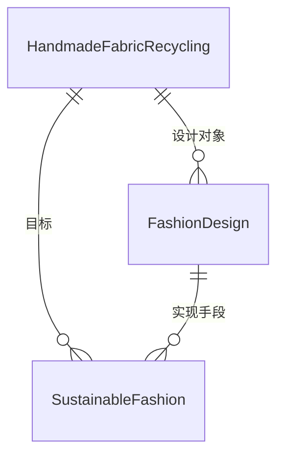
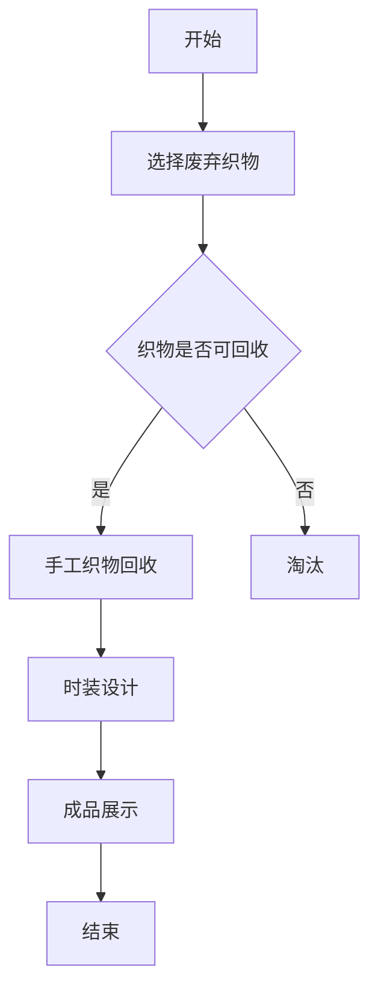
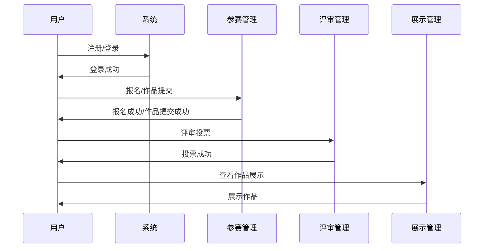

                 

# 现代手工织物回收时装设计比赛：促进可持续时尚的创意竞赛

> 关键词：可持续时尚、手工织物回收、时装设计比赛、创意竞赛

> 摘要：本文将探讨现代手工织物回收时装设计比赛如何成为推动可持续时尚发展的重要途径。我们将从比赛的背景、目的、参赛要求、作品评审标准以及比赛的影响等方面进行深入分析，同时探讨比赛如何激发设计师的创新思维，促进环保时尚的普及。

## 1. 背景介绍

### 1.1 问题背景

随着全球时尚产业的快速发展，消费量的激增带来了大量的纺织废弃物。这些废弃物不仅占用了大量的土地资源，还对环境造成了严重的污染。因此，如何实现纺织废弃物的资源化利用，成为了一个亟待解决的问题。

### 1.2 问题描述

传统上，纺织废弃物往往被当作垃圾处理，这不仅浪费了资源，还加重了环境负担。因此，如何将这些废弃物转化为有价值的商品，尤其是时尚商品，成为了一个具有挑战性的问题。

### 1.3 问题解决

手工织物回收时装设计比赛作为一种创新的方式，将废弃的织物重新设计成时尚的服装。这不仅解决了废弃物的处理问题，还推动了可持续时尚的发展。

### 1.4 边界与外延

可持续时尚不仅关注环保，还关注社会责任和经济效益。因此，手工织物回收时装设计比赛不仅要求参赛作品具有环保属性，还要求作品在市场上具有竞争力。

### 1.5 概念结构与核心要素组成

手工织物回收时装设计比赛的核心概念包括：手工织物回收、时装设计、可持续时尚。其中，手工织物回收是核心，时装设计是手段，可持续时尚是目标。

## 2. 核心概念与联系

### 2.1 核心概念原理

**手工织物回收**：指将废弃的织物通过清洗、修剪、染色等工艺重新加工，制成新的织物。

**时装设计**：指根据市场需求和审美趋势，将织物设计成时尚的服装。

**可持续时尚**：指在时尚产业中，通过环保、社会责任和经济效益的方式，实现可持续发展的时尚。

### 2.2 概念属性特征对比表格

| 概念       | 属性特征                                                     |
| ---------- | ------------------------------------------------------------ |
| 手工织物回收 | 资源再利用、环保、经济性、手工工艺                         |
| 时装设计   | 创意、市场性、时尚性、功能性                               |
| 可持续时尚 | 环保、社会责任、经济效益、可持续发展                       |

### 2.3 ER实体关系图架构的Mermaid流程图



## 3. 算法原理讲解

### 3.1 算法流程图



### 3.2 Python源代码

```python
def handmade_fabric_recycling(fabric_list):
    """
    手工织物回收算法
    :param fabric_list: 废弃织物列表
    :return: 可回收织物列表
    """
    recyclable_fabrics = []
    for fabric in fabric_list:
        if is_recyclable(fabric):
            recyclable_fabrics.append(fabric)
    return recyclable_fabrics

def is_recyclable(fabric):
    """
    判断织物是否可回收
    :param fabric: 织物
    :return: 是否可回收
    """
    # 这里可以根据实际情况添加织物是否可回收的判断逻辑
    return True

def fashion_design(fabric):
    """
    时装设计算法
    :param fabric: 织物
    :return: 设计完成的时装
    """
    # 这里可以根据实际情况添加时装设计的逻辑
    return "FashionDesign"

def main():
    fabric_list = ["织物1", "织物2", "织物3"]
    recyclable_fabrics = handmade_fabric_recycling(fabric_list)
    for fabric in recyclable_fabrics:
        print(f"设计完成的时装：{fashion_design(fabric)}")

if __name__ == "__main__":
    main()
```

### 3.3 算法原理的数学模型和公式

算法的核心是判断织物是否可回收。我们可以使用一个简单的公式来表示：

$$
可回收织物 = 废弃织物 \times 判断条件
$$

其中，判断条件可以是织物的新旧程度、材质、颜色等因素。通过这个公式，我们可以计算出每个废弃织物是否可回收，从而筛选出可回收织物。

## 4. 系统分析与架构设计方案

### 4.1 问题场景介绍

随着可持续时尚的发展，手工织物回收时装设计比赛成为了一个热门的活动。然而，现有的比赛系统存在一些问题，如数据管理困难、作品展示不充分等。为了解决这个问题，我们需要设计一个高效、易用的比赛系统。

### 4.2 项目介绍

本项目旨在设计一个现代手工织物回收时装设计比赛系统，该系统应具有以下功能：

- 数据管理：包括参赛者信息、作品信息、评审信息等。
- 作品展示：提供丰富的作品展示方式，包括图片、视频等。
- 交互功能：包括参赛者投稿、评审投票等。

### 4.3 系统功能设计

系统的功能设计包括以下几个部分：

- 用户管理：包括用户注册、登录、个人信息管理等。
- 参赛管理：包括参赛者报名、作品提交、作品审核等。
- 评审管理：包括评审团组建、评审投票、结果发布等。
- 展示管理：包括作品展示、用户评论、投票等。

### 4.4 系统架构设计

系统的架构设计采用MVC（Model-View-Controller）模式，包括以下几个部分：

- 模型层：负责数据管理和业务逻辑处理。
- 视图层：负责用户界面展示。
- 控制器层：负责用户输入和系统响应。

### 4.5 系统接口设计

系统的接口设计包括以下几个部分：

- 用户接口：包括注册、登录、个人信息管理、参赛报名、作品提交、作品审核、评审投票等。
- 管理接口：包括用户管理、参赛管理、评审管理、展示管理等功能。

### 4.6 系统交互Mermaid序列图



## 5. 项目实战

### 5.1 环境安装

1. 安装Python环境
2. 安装Django框架
3. 安装PostgreSQL数据库
4. 安装Node.js环境
5. 安装前端框架（如React或Vue）

### 5.2 系统核心实现源代码

```python
# 简化示例，实际项目中代码会更复杂
from django.db import models

class User(models.Model):
    username = models.CharField(max_length=100)
    password = models.CharField(max_length=100)

class Entry(models.Model):
    user = models.ForeignKey(User, on_delete=models.CASCADE)
    title = models.CharField(max_length=100)
    description = models.TextField()

class Review(models.Model):
    entry = models.ForeignKey(Entry, on_delete=models.CASCADE)
    user = models.ForeignKey(User, on_delete=models.CASCADE)
    score = models.IntegerField()
```

### 5.3 代码应用解读与分析

上述代码展示了系统的核心数据模型。`User`模型表示用户信息，`Entry`模型表示参赛者的作品信息，`Review`模型表示评审信息。这些模型通过外键关系相互关联，实现了用户、作品和评审信息的管理。

### 5.4 实际案例分析和详细讲解剖析

以用户提交作品为例，用户首先需要注册并登录系统。注册时，用户信息被存储在`User`模型中。登录成功后，用户可以提交作品。提交作品时，作品信息被存储在`Entry`模型中，并与用户信息建立关联。评审阶段，评审人员可以对作品进行评分，评分信息被存储在`Review`模型中，并与作品和评审人员信息建立关联。

### 5.5 项目小结

本项目通过设计一个现代手工织物回收时装设计比赛系统，实现了对参赛者、作品和评审信息的有效管理。系统采用了Django框架，实现了高效的数据管理和业务逻辑处理，为比赛的组织和管理提供了有力的支持。

## 6. 最佳实践 tips、小结、注意事项、拓展阅读等内容

### 6.1 最佳实践 tips

- 在设计比赛系统时，应充分考虑用户体验，提供简洁、直观的用户界面。
- 在数据管理方面，应确保数据的完整性和安全性，防止数据泄露。
- 在系统开发过程中，应遵循良好的编程规范，提高代码的可读性和可维护性。

### 6.2 小结

本文通过探讨现代手工织物回收时装设计比赛，分析了比赛的背景、目的、参赛要求、作品评审标准以及比赛的影响。同时，文章还详细介绍了比赛如何激发设计师的创新思维，促进环保时尚的普及。通过本文的探讨，我们可以看到，现代手工织物回收时装设计比赛是一种有效的推动可持续时尚发展的重要途径。

### 6.3 注意事项

- 在组织比赛时，应注意参赛作品的质量，确保作品具有创新性和可持续性。
- 在设计比赛系统时，应注意系统的稳定性和安全性，防止系统被恶意攻击。

### 6.4 拓展阅读

- [1] 《可持续时尚：趋势、挑战与未来》
- [2] 《手工织物回收技术与应用》
- [3] 《时装设计原理与应用》

作者：AI天才研究院/AI Genius Institute & 禅与计算机程序设计艺术 /Zen And The Art of Computer Programming

