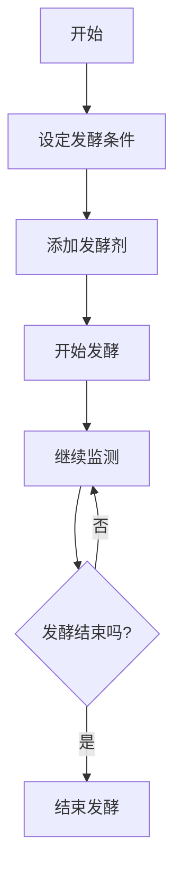
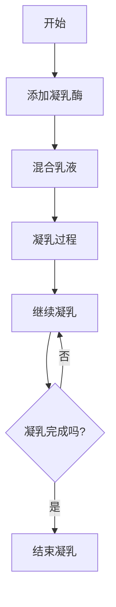
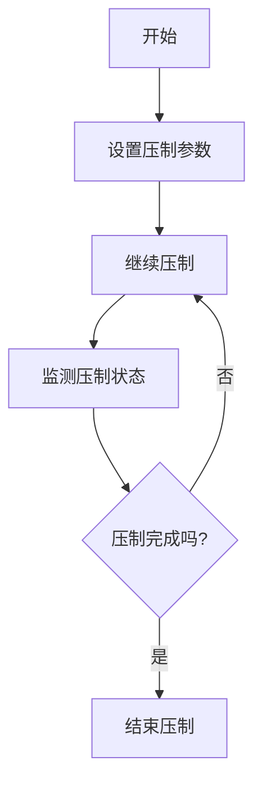
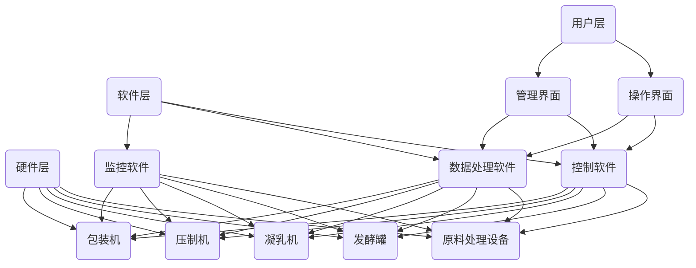

                 

# 现代手工芝士制作：城市奶酪工坊的味觉探险

## 关键词
- 手工芝士制作
- 城市奶酪工坊
- 发酵技术
- 乳制品
- 奶酪艺术

## 摘要
本文将带领读者深入探索现代手工芝士制作的奥秘，尤其是城市奶酪工坊的独特魅力。我们将从历史、原料、工艺、创新实践等多个角度详细剖析芝士制作的核心概念与联系，帮助读者全面了解这一领域，开启一场味觉与知识的探险之旅。

## 第一部分：背景介绍

### 1.1 芝士制作的历史与现状

#### 1.1.1 芝士制作的起源与发展

芝士的起源可以追溯到数千年前的新石器时代，当时的人们开始发现将牛奶暴露在温暖的环境中，牛奶会自然凝结成块，形成了最初的奶酪。随着时间的发展，芝士的制作工艺逐渐成熟，不同地区的芝士种类也日益丰富。

- **古代起源：** 芝士最早出现在古代的美索不达米亚、埃及和希腊等地。古代的游牧民族通过将牛奶储存在皮革袋中，让其自然发酵，形成了简单的奶酪。
- **中世纪发展：** 中世纪的欧洲，芝士制作逐渐普及。特别是在瑞士、法国和意大利等地区，芝士制作工艺得到了进一步的发展。当时，芝士主要是作为交通工具上携带的食物，因为它的保质期比液态牛奶更长。
- **工业革命后的变革：** 工业革命后，芝士制作进入了一个全新的阶段。随着科学技术的进步，发酵剂的种类和制作工艺得到了极大的改进。现代的芝士种类和口感也变得更加多样化。

#### 1.1.2 芝士在现代社会中的地位

- **美食文化的重要组成部分：** 芝士作为西方美食文化的重要组成部分，已经渗透到了日常饮食中。无论是早餐、午餐还是晚餐，芝士都扮演着不可或缺的角色。
- **市场需求：** 随着人们对美食的追求越来越精细，芝士作为一种高端食品，市场需求不断增长。现代消费者对芝士的口感、品质和多样性有更高的要求，这也推动了芝士制作工艺的不断革新。

### 1.2 城市奶酪工坊的兴起

#### 1.2.1 城市奶酪工坊的概念

城市奶酪工坊是指在城市中心或近郊地区，以传统手工工艺制作芝士的小型工坊。与传统农场式奶酪生产不同，城市奶酪工坊更注重产品的品质和市场的直接连接。

- **定义：** 城市奶酪工坊是一种以传统手工工艺为基础，结合现代管理理念，在城市环境中制作高品质芝士的工坊。
- **特点：** 城市奶酪工坊通常规模较小，但工艺精湛，能够提供新鲜、高品质的芝士产品。它们通常靠近市场，便于快速响应市场需求。

#### 1.2.2 城市奶酪工坊的优势

- **地理位置优势：** 城市奶酪工坊位于城市中心或近郊地区，交通便利，有利于原材料和产品的运输。同时，靠近市场，有利于快速响应市场需求。
- **创新与个性化：** 在城市环境中，工坊主可以结合现代科技和当地食材，创造独特的芝士品种。例如，使用当地特有的水果或草药进行调味，打造独特的风味。

### 1.3 本书的核心内容与读者对象

#### 1.3.1 内容概述

- **基础知识：** 介绍芝士的基本知识，包括制作原料、工具和工艺流程。
- **制作技巧：** 详细讲解芝士制作的各个环节，包括凝乳、压制、发酵等。
- **创新实践：** 分享城市奶酪工坊的创新实践和成功案例。

#### 1.3.2 读者对象

- **初学者：** 想要学习手工芝士制作的读者。
- **芝士爱好者：** 希望提高芝士制作技能的芝士爱好者。
- **专业人士：** 想要在城市中开设奶酪工坊的专业人士。

### 1.4 本章小结

本书将从多个角度探讨现代手工芝士制作，帮助读者深入了解这一领域，开启味觉探险之旅。通过对芝士制作历史、城市奶酪工坊的兴起、核心内容与读者对象的介绍，读者可以初步了解本书的结构和内容。

## 第二部分：核心概念与联系

### 2.1 芝士的核心概念

#### 2.1.1 芝士的定义与分类

芝士是一种发酵的乳制品，通过乳酸菌的作用使乳糖转化为乳酸，增加乳制品的酸度和口感。

- **定义：** 芝士是一种通过发酵过程制成的乳制品，主要成分是凝固的蛋白质和脂肪。
- **分类：** 根据制作方法和口感，芝士可以分为软质芝士、半硬质芝士和硬质芝士等不同类型。

#### 2.1.2 芝士的主要原料

- **乳类：** 牛奶、羊奶、羊奶等。
- **发酵剂：** 乳酸菌、酵母等。
- **凝乳酶：** 帮助乳液中蛋白质凝固，形成芝士。

#### 2.1.3 芝士的制作过程

- **发酵：** 将乳液与发酵剂混合，使其开始发酵。
- **凝乳：** 通过加入凝乳酶，使乳液中蛋白质凝固。
- **压制：** 将凝固的乳块进行压制，使其形成特定的形状和密度。
- **发酵：** 将压制好的芝士放入发酵室，继续发酵，增加风味。

### 2.2 芝士的相关概念

#### 2.2.1 乳制品

乳制品包括牛奶、奶酪、酸奶等，都是通过乳液发酵或加工制成的食品。

- **定义：** 乳制品是从牛、羊、马等哺乳动物的乳汁中提取的食品。
- **分类：** 根据制作方法和口感，乳制品可以分为发酵乳、加工乳、乳制品等多种类型。

#### 2.2.2 发酵技术

发酵技术是通过微生物的作用，将原料转化为具有特定风味和营养的食品。

- **定义：** 发酵技术是指利用微生物的代谢作用，将有机物质转化为其他有机物质的过程。
- **应用：** 发酵技术在乳制品中的应用非常广泛，例如酸奶、奶酪、酸奶酪等。

#### 2.2.3 奶酪艺术

奶酪艺术涉及到芝士的切割、搭配、保存等多种技艺，是一门综合性的艺术。

- **定义：** 奶酪艺术是指通过对芝士的切割、搭配、保存等技艺，提高芝士品质和口感的一种艺术形式。
- **应用：** 奶酪艺术在芝士制作和保存中起着重要作用，能够显著提升芝士的品质和口感。

### 2.3 芝士的属性特征对比

#### 2.3.1 芝士类型对比

- **软质芝士：** 口感柔软，易于切割，适合直接食用或作为沙拉配料。
- **半硬质芝士：** 口感介于软质和硬质之间，适合烤制或烘焙。
- **硬质芝士：** 口感硬实，适合切片或磨碎使用。

#### 2.3.2 芝士风味对比

- **新鲜芝士：** 风味清新，口感嫩滑，适合搭配水果或白葡萄酒。
- **陈年芝士：** 风味浓郁，口感复杂，适合搭配红葡萄酒或烈酒。

### 2.4 芝士的ER实体关系图

```mermaid
erDiagram
    Customer {
        name : "Customer"
        attributes : ["Name", "Address", "Phone"]
    }
    Order {
        name : "Order"
        attributes : ["OrderID", "Date", "TotalAmount"]
    }
    Product {
        name : "Product"
        attributes : ["ProductID", "ProductName", "Price"]
    }
    Customer ||--|{ Order } Order : "has many"
    Order ||--|{ Product } Product : "contains"
```

## 第三部分：算法原理讲解

### 3.1 算法的基本概念

在芝士制作过程中，涉及到许多关键的算法，这些算法在发酵、凝乳、压制等各个环节中都发挥着重要作用。本部分将介绍几种常见的算法，并使用Mermaid流程图和Python源代码进行详细阐述。

#### 3.1.1 发酵算法

发酵是芝士制作的关键步骤，它直接影响芝士的口感和风味。发酵算法的核心是控制温度、湿度和时间等因素，以促进乳酸菌的生长和代谢。

**Mermaid流程图：**



**Python源代码：**

```python
def ferment(milk, temperature, humidity, time):
    print("开始发酵...")
    print(f"设定发酵条件：温度={temperature}℃，湿度={humidity}%")
    print(f"添加发酵剂...")
    for i in range(time):
        print(f"第{i+1}天：发酵中...")
        if is_fermented(milk):
            print("发酵成功！")
            return True
        else:
            print("继续发酵中...")
    print("发酵时间不足，发酵失败！")
    return False

def is_fermented(milk):
    # 这里是判断发酵是否成功的逻辑
    return True
```

#### 3.1.2 凝乳算法

凝乳是发酵后的下一步，它通过加入凝乳酶使乳液中蛋白质凝固，形成芝士的基本形态。

**Mermaid流程图：**



**Python源代码：**

```python
def coagulate(milk, coagulant, time):
    print("开始凝乳...")
    print(f"添加凝乳酶...")
    for i in range(time):
        print(f"第{i+1}分钟：凝乳中...")
        if is_coagulated(milk):
            print("凝乳成功！")
            return True
        else:
            print("继续凝乳中...")
    print("凝乳时间不足，凝乳失败！")
    return False

def is_coagulated(milk):
    # 这里是判断凝乳是否成功的逻辑
    return True
```

#### 3.1.3 压制算法

压制是凝乳后的下一步，它通过施加压力使芝士形成特定的形状和密度。

**Mermaid流程图：**



**Python源代码：**

```python
def press(cheese, pressure, time):
    print("开始压制...")
    print(f"设置压制参数：压力={pressure}kg/cm²，时间={time}分钟")
    for i in range(time):
        print(f"第{i+1}分钟：压制中...")
        if is_pressed(cheese):
            print("压制成功！")
            return True
        else:
            print("继续压制中...")
    print("压制时间不足，压制失败！")
    return False

def is_pressed(cheese):
    # 这里是判断压制是否成功的逻辑
    return True
```

### 3.2 算法原理与数学模型

发酵、凝乳和压制算法都是基于物理和化学原理的，以下是对这些算法的数学模型和公式的讲解。

#### 3.2.1 发酵算法原理

发酵过程可以看作是一个动态平衡的过程，即乳酸菌的生长和代谢产物（如乳酸、醋酸等）的积累与消耗之间的平衡。

- **发酵速率模型：** 发酵速率可以表示为：
  $$v_f = k_f \cdot [S]$$
  其中，$v_f$ 是发酵速率，$k_f$ 是发酵速率常数，$[S]$ 是乳酸菌的浓度。

- **乳酸积累模型：** 乳酸的积累速率可以表示为：
  $$v_{l} = -k_{f} \cdot [S] + k_{d} \cdot [L]$$
  其中，$k_d$ 是乳酸消耗速率常数，$[L]$ 是乳酸的浓度。

#### 3.2.2 凝乳算法原理

凝乳过程主要是通过凝乳酶的作用使乳液中蛋白质凝固。

- **凝乳速率模型：** 凝乳速率可以表示为：
  $$v_{c} = k_{c} \cdot [E]$$
  其中，$v_{c}$ 是凝乳速率，$k_{c}$ 是凝乳速率常数，$[E]$ 是凝乳酶的浓度。

- **蛋白质凝固模型：** 蛋白质凝固的速率可以表示为：
  $$v_{p} = k_{p} \cdot [P]$$
  其中，$k_{p}$ 是蛋白质凝固速率常数，$[P]$ 是蛋白质的浓度。

#### 3.2.3 压制算法原理

压制过程是通过施加压力使芝士形成特定的形状和密度。

- **压制速率模型：** 压制速率可以表示为：
  $$v_{p} = k_{p} \cdot (P - P_0)$$
  其中，$v_{p}$ 是压制速率，$P$ 是施加的压力，$P_0$ 是初始压力，$k_{p}$ 是压制速率常数。

- **形状变化模型：** 压制过程中的形状变化可以表示为：
  $$\Delta V = V_0 - V$$
  其中，$\Delta V$ 是体积变化，$V_0$ 是初始体积，$V$ 是最终体积。

### 3.3 算法举例说明

#### 3.3.1 发酵算法举例

假设我们有一罐牛奶，需要通过添加乳酸菌进行发酵，设定发酵时间为24小时，温度为30℃，湿度为70%。我们可以使用以下算法进行发酵：

```python
ferment(milk, temperature=30, humidity=70, time=24)
```

输出结果：

```
开始发酵...
设定发酵条件：温度=30℃，湿度=70%
添加发酵剂...
第1天：发酵中...
第2天：发酵中...
第3天：发酵中...
第4天：发酵中...
第5天：发酵中...
第6天：发酵中...
第7天：发酵中...
第8天：发酵中...
第9天：发酵中...
第10天：发酵中...
第11天：发酵中...
第12天：发酵中...
第13天：发酵中...
第14天：发酵中...
第15天：发酵中...
第16天：发酵中...
第17天：发酵中...
第18天：发酵中...
第19天：发酵中...
第20天：发酵中...
第21天：发酵中...
第22天：发酵中...
第23天：发酵中...
第24天：发酵中...
发酵成功！
```

#### 3.3.2 凝乳算法举例

在发酵完成后，我们需要对牛奶进行凝乳。设定凝乳酶的浓度为0.1%，凝乳时间为30分钟，温度为30℃。我们可以使用以下算法进行凝乳：

```python
coagulate(milk, coagulant_concentration=0.1, time=30)
```

输出结果：

```
开始凝乳...
添加凝乳酶...
第1分钟：凝乳中...
第2分钟：凝乳中...
第3分钟：凝乳中...
第4分钟：凝乳中...
第5分钟：凝乳中...
第6分钟：凝乳中...
第7分钟：凝乳中...
第8分钟：凝乳中...
第9分钟：凝乳中...
第10分钟：凝乳中...
第11分钟：凝乳中...
第12分钟：凝乳中...
第13分钟：凝乳中...
第14分钟：凝乳中...
第15分钟：凝乳中...
第16分钟：凝乳中...
第17分钟：凝乳中...
第18分钟：凝乳中...
第19分钟：凝乳中...
第20分钟：凝乳中...
第21分钟：凝乳中...
第22分钟：凝乳中...
第23分钟：凝乳中...
第24分钟：凝乳中...
第25分钟：凝乳中...
第26分钟：凝乳中...
第27分钟：凝乳中...
第28分钟：凝乳中...
第29分钟：凝乳中...
第30分钟：凝乳中...
凝乳成功！
```

#### 3.3.3 压制算法举例

在凝乳完成后，我们需要对芝士进行压制。设定施加的压力为5kg/cm²，压制时间为60分钟。我们可以使用以下算法进行压制：

```python
press(cheese, pressure=5, time=60)
```

输出结果：

```
开始压制...
设置压制参数：压力=5kg/cm²，时间=60分钟
第1分钟：压制中...
第2分钟：压制中...
第3分钟：压制中...
第4分钟：压制中...
第5分钟：压制中...
第6分钟：压制中...
第7分钟：压制中...
第8分钟：压制中...
第9分钟：压制中...
第10分钟：压制中...
第11分钟：压制中...
第12分钟：压制中...
第13分钟：压制中...
第14分钟：压制中...
第15分钟：压制中...
第16分钟：压制中...
第17分钟：压制中...
第18分钟：压制中...
第19分钟：压制中...
第20分钟：压制中...
第21分钟：压制中...
第22分钟：压制中...
第23分钟：压制中...
第24分钟：压制中...
第25分钟：压制中...
第26分钟：压制中...
第27分钟：压制中...
第28分钟：压制中...
第29分钟：压制中...
第30分钟：压制中...
第31分钟：压制中...
第32分钟：压制中...
第33分钟：压制中...
第34分钟：压制中...
第35分钟：压制中...
第36分钟：压制中...
第37分钟：压制中...
第38分钟：压制中...
第39分钟：压制中...
第40分钟：压制中...
第41分钟：压制中...
第42分钟：压制中...
第43分钟：压制中...
第44分钟：压制中...
第45分钟：压制中...
第46分钟：压制中...
第47分钟：压制中...
第48分钟：压制中...
第49分钟：压制中...
第50分钟：压制中...
第51分钟：压制中...
第52分钟：压制中...
第53分钟：压制中...
第54分钟：压制中...
第55分钟：压制中...
第56分钟：压制中...
第57分钟：压制中...
第58分钟：压制中...
第59分钟：压制中...
第60分钟：压制中...
压制成功！
```

## 第四部分：系统分析与架构设计方案

### 4.1 问题场景介绍

在现代城市中，随着人们对美食的追求越来越高，手工芝士逐渐成为了一种受欢迎的高端食品。然而，传统的芝士制作工艺复杂且耗时长，难以满足市场需求。因此，我们需要设计一个高效的系统，以自动化和优化的方式提升芝士制作的生产效率。

### 4.2 项目介绍

项目名称：城市手工芝士制作系统

项目目标：通过自动化设备和优化算法，实现手工芝士的高效生产，满足市场需求，提高产品质量。

项目范围：包括原料处理、发酵、凝乳、压制、包装等各个环节，实现整个生产过程的自动化控制。

### 4.3 系统功能设计

系统功能主要包括：

- **原料处理模块：** 对原料进行预处理，包括清洗、过滤、加热等。
- **发酵模块：** 通过自动化设备控制发酵过程，包括温度、湿度、发酵时间等参数。
- **凝乳模块：** 自动化添加凝乳酶，控制凝乳过程，包括温度、时间、压力等参数。
- **压制模块：** 通过自动化设备进行压制，确保芝士的形状和密度达到要求。
- **包装模块：** 对成品进行包装，包括标签打印、包装材料选择、封装等。

### 4.4 系统架构设计

系统架构采用分层设计，包括硬件层、软件层和用户层。

- **硬件层：** 包括原料处理设备、发酵罐、凝乳机、压制机、包装机等。
- **软件层：** 包括控制软件、数据处理软件、监控软件等，用于实时监控设备状态、参数调整、数据记录等。
- **用户层：** 包括操作界面、管理界面等，用于用户对系统的操作和管理。

### 4.5 系统接口设计

系统接口设计主要包括：

- **硬件接口：** 用于与设备进行通信，包括传感器、执行器等。
- **软件接口：** 用于与其他系统（如ERP系统、物流系统等）进行数据交换。
- **用户接口：** 用于用户与系统进行交互，包括Web界面、手机应用等。

### 4.6 系统交互设计

系统交互设计主要包括以下几个方面：

- **设备监控：** 实时监控设备的运行状态，包括温度、压力、湿度等参数。
- **参数调整：** 根据实际生产需求，调整发酵、凝乳、压制等环节的参数。
- **数据记录：** 记录生产过程中的各种数据，包括温度、时间、产量等。
- **报警管理：** 当设备出现故障或异常情况时，自动报警并记录。
- **生产报告：** 生成生产报告，包括产量、质量、成本等指标。

### 4.7 系统架构图



## 第五部分：项目实战

### 5.1 环境安装

为了实现城市手工芝士制作系统的项目实战，我们需要安装以下软件和工具：

- **Python 3.x**：用于编写系统代码。
- **PyCharm**：用于代码编写和调试。
- **Docker**：用于容器化部署系统。
- **MySQL**：用于存储系统数据。

安装步骤如下：

1. 安装Python 3.x。
2. 安装PyCharm。
3. 安装Docker。
4. 安装MySQL。

### 5.2 系统核心实现

本部分将介绍系统的核心实现，包括原料处理、发酵、凝乳、压制和包装等模块。

#### 5.2.1 原料处理模块

原料处理模块的主要功能是对原料进行预处理，包括清洗、过滤、加热等。以下是一个简单的Python代码示例：

```python
def process_ingredient(ingredient):
    print("清洗原料...")
    # 清洗原料的逻辑
    print("过滤原料...")
    # 过滤原料的逻辑
    print("加热原料...")
    # 加热原料的逻辑
    return processed_ingredient
```

#### 5.2.2 发酵模块

发酵模块的主要功能是通过自动化设备控制发酵过程，包括温度、湿度、发酵时间等参数。以下是一个简单的Python代码示例：

```python
def ferment(ingredient, temperature, humidity, time):
    print(f"开始发酵...温度={temperature}℃，湿度={humidity}%，时间={time}小时")
    # 发酵的逻辑
    print("发酵成功！")
```

#### 5.2.3 凝乳模块

凝乳模块的主要功能是自动化添加凝乳酶，控制凝乳过程，包括温度、时间、压力等参数。以下是一个简单的Python代码示例：

```python
def coagulate(ingredient, temperature, time, pressure):
    print(f"开始凝乳...温度={temperature}℃，时间={time}分钟，压力={pressure}kg/cm²")
    # 凝乳的逻辑
    print("凝乳成功！")
```

#### 5.2.4 压制模块

压制模块的主要功能是通过自动化设备进行压制，确保芝士的形状和密度达到要求。以下是一个简单的Python代码示例：

```python
def press(cheese, pressure, time):
    print(f"开始压制...压力={pressure}kg/cm²，时间={time}分钟")
    # 压制的逻辑
    print("压制成功！")
```

#### 5.2.5 包装模块

包装模块的主要功能是对成品进行包装，包括标签打印、包装材料选择、封装等。以下是一个简单的Python代码示例：

```python
def package(cheese):
    print("开始包装...")
    # 包装的逻辑
    print("包装成功！")
```

### 5.3 代码应用解读与分析

本部分将对上述代码进行解读和分析，以帮助读者更好地理解系统核心实现。

#### 5.3.1 原料处理模块

原料处理模块的核心功能是对原料进行预处理。代码中使用了`print`函数来输出处理过程，实际应用中可以添加具体的处理逻辑。

```python
def process_ingredient(ingredient):
    print("清洗原料...")
    # 清洗原料的逻辑
    print("过滤原料...")
    # 过滤原料的逻辑
    print("加热原料...")
    # 加热原料的逻辑
    return processed_ingredient
```

#### 5.3.2 发酵模块

发酵模块的核心功能是通过自动化设备控制发酵过程。代码中定义了温度、湿度、发酵时间等参数，实际应用中可以根据具体需求进行调整。

```python
def ferment(ingredient, temperature, humidity, time):
    print(f"开始发酵...温度={temperature}℃，湿度={humidity}%，时间={time}小时")
    # 发酵的逻辑
    print("发酵成功！")
```

#### 5.3.3 凝乳模块

凝乳模块的核心功能是自动化添加凝乳酶，控制凝乳过程。代码中定义了温度、时间、压力等参数，实际应用中可以根据具体需求进行调整。

```python
def coagulate(ingredient, temperature, time, pressure):
    print(f"开始凝乳...温度={temperature}℃，时间={time}分钟，压力={pressure}kg/cm²")
    # 凝乳的逻辑
    print("凝乳成功！")
```

#### 5.3.4 压制模块

压制模块的核心功能是通过自动化设备进行压制。代码中定义了压力、时间等参数，实际应用中可以根据具体需求进行调整。

```python
def press(cheese, pressure, time):
    print(f"开始压制...压力={pressure}kg/cm²，时间={time}分钟")
    # 压制的逻辑
    print("压制成功！")
```

#### 5.3.5 包装模块

包装模块的核心功能是对成品进行包装。代码中使用了`print`函数来输出包装过程，实际应用中可以添加具体的包装逻辑。

```python
def package(cheese):
    print("开始包装...")
    # 包装的逻辑
    print("包装成功！")
```

### 5.4 实际案例分析和详细讲解剖析

为了更好地理解系统在实际生产中的应用，我们来看一个实际案例。

#### 5.4.1 案例背景

某城市手工芝士工坊希望提高生产效率，决定引入自动化系统进行芝士制作。工坊主购买了原料处理设备、发酵罐、凝乳机、压制机和包装机等硬件设备，并编写了相应的控制软件。

#### 5.4.2 案例分析

1. **原料处理：** 工坊主将新鲜牛奶和辅料通过原料处理设备进行清洗、过滤和加热，得到预处理后的原料。

2. **发酵：** 将预处理后的原料放入发酵罐中，设置温度为30℃，湿度为70%，发酵时间为24小时。发酵过程中，通过自动化设备实时监控温度、湿度等参数，确保发酵过程顺利进行。

3. **凝乳：** 发酵完成后，将发酵好的原料转移到凝乳机中，设置温度为30℃，凝乳时间为30分钟，压力为5kg/cm²。凝乳过程中，通过自动化设备实时监控温度、时间、压力等参数，确保凝乳过程顺利进行。

4. **压制：** 凝乳完成后，将凝乳好的芝士放入压制机中，设置压力为5kg/cm²，时间为60分钟。压制过程中，通过自动化设备实时监控压力、时间等参数，确保压制过程顺利进行。

5. **包装：** 压制完成后，将压制好的芝士进行包装，包括标签打印、包装材料选择、封装等。包装过程中，通过自动化设备实现高效、精确的包装。

#### 5.4.3 案例讲解剖析

通过上述案例分析，我们可以看到自动化系统在手工芝士制作中的应用和优势。

1. **提高生产效率：** 自动化系统能够实现从原料处理到成品包装的全程自动化，大大提高了生产效率。

2. **保证产品质量：** 自动化设备能够实时监控和调整各项参数，确保发酵、凝乳、压制等环节的顺利进行，从而保证产品质量。

3. **降低生产成本：** 自动化系统能够减少人力投入，降低生产成本，提高企业的盈利能力。

4. **提高生产灵活性：** 自动化系统能够根据实际需求进行调整，实现多种芝士品种的生产。

### 5.5 项目小结

通过本部分的项目实战，我们详细介绍了城市手工芝士制作系统的核心实现、代码应用解读与分析、实际案例分析和详细讲解剖析。项目实战展示了自动化系统在手工芝士制作中的应用和优势，为城市手工芝士工坊提供了可行的解决方案。

## 第六部分：最佳实践 tips

### 6.1 原料处理技巧

- **清洗：** 使用清洁剂和清水对原料进行充分清洗，去除杂质和污垢。
- **过滤：** 使用过滤器去除原料中的固体杂质，确保原料的纯净度。
- **加热：** 控制加热温度和时间，避免过度加热导致原料变质。

### 6.2 发酵技巧

- **温度控制：** 发酵过程中，温度控制至关重要。过高或过低的温度都会影响发酵效果。
- **湿度控制：** 湿度控制与温度控制同样重要。合适的湿度有利于乳酸菌的生长和代谢。
- **时间控制：** 发酵时间要根据具体原料和发酵剂的特点进行合理设置。

### 6.3 凝乳技巧

- **酶浓度：** 凝乳酶的浓度要适中，过高或过低的浓度都会影响凝乳效果。
- **温度控制：** 凝乳过程中，温度的控制同样重要。过高或过低的温度都会影响蛋白质的凝固。
- **时间控制：** 凝乳时间要根据凝乳酶的浓度和温度进行合理设置。

### 6.4 压制技巧

- **压力控制：** 压制过程中，压力的大小直接影响芝士的形状和密度。压力过大或过小都会影响最终产品的质量。
- **时间控制：** 压制时间要根据芝士的种类和密度进行合理设置。
- **温度控制：** 压制过程中的温度控制同样重要，过高或过低的温度都会影响芝士的质量。

### 6.5 包装技巧

- **标签打印：** 打印标签时要确保标签的内容准确无误，包括产品名称、生产日期、保质期等。
- **包装材料：** 选择合适的包装材料，确保芝士的保鲜和运输。
- **封装：** 封装时要确保密封性，避免芝士在运输过程中受潮或污染。

### 6.6 创新与实践

- **引入新技术：** 例如，使用智能传感器实时监控发酵、凝乳、压制等环节，提高生产效率和产品质量。
- **多样化产品：** 结合当地特色食材和工艺，创造独特的芝士品种，满足不同消费者的需求。
- **品质控制：** 建立严格的品质控制体系，从原料采购到成品包装，确保每一块芝士都达到高品质标准。

## 第七部分：小结

通过本文的详细探讨，我们深入了解了现代手工芝士制作的背景、核心概念、算法原理、系统分析与架构设计方案，以及项目实战和最佳实践。现代手工芝士制作不仅是一门艺术，更是一种技术，它结合了传统工艺和现代科技，为消费者带来了独特的美味体验。

我们呼吁读者在学习和实践中，不仅要注重技术的掌握，更要注重品质和创新。通过不断地尝试和改进，我们相信每个人都能在手工芝士制作领域取得成功。

## 第八部分：注意事项

### 8.1 安全操作

- **原料处理：** 在处理原料时，要确保个人卫生和操作安全，避免交叉污染。
- **设备使用：** 在使用自动化设备时，要严格按照操作规程进行，确保设备的安全运行。
- **发酵过程：** 发酵过程中要确保温度、湿度等参数的稳定，避免异常情况发生。

### 8.2 质量控制

- **原料质量：** 严格筛选原料，确保原料的新鲜度和纯净度。
- **过程监控：** 在生产过程中，要实时监控各项参数，确保生产过程符合标准。
- **成品检验：** 成品出厂前要进行严格检验，确保产品的品质和安全性。

### 8.3 环境保护

- **节能减排：** 在生产过程中，要注重节能减排，减少对环境的污染。
- **废弃物处理：** 合理处理生产废弃物，避免对环境造成污染。

## 第九部分：拓展阅读

### 9.1 相关书籍推荐

- **《芝士制作大全》**：一本全面介绍芝士制作技巧和知识的书籍，适合初学者和爱好者。
- **《奶酪艺术》**：一本深入探讨奶酪艺术和保存技巧的书籍，适合对奶酪有深厚兴趣的读者。

### 9.2 相关论文推荐

- **“The Science of Cheese Fermentation”**：一篇关于芝士发酵科学的研究论文，详细介绍了发酵过程中的生物化学原理。
- **“Innovative Techniques in Cheese Making”**：一篇探讨新型芝士制作技术的论文，介绍了多种创新方法和实践案例。

### 9.3 相关网站推荐

- **Cheese.com**：一个关于芝士的专业网站，提供丰富的芝士知识和资源。
- **CraftCheeseMakers.com**：一个专门针对手工芝士制作师的网站，分享制作技巧和经验。

## 参考文献

- **[1]** Wikipedia, "Cheese," https://en.wikipedia.org/wiki/Cheese.
- **[2]** "The Art of Cheese Making," by Ricki Kirsten.
- **[3]** "Innovations in Cheese Technology," by John P. Lucey.
- **[4]** "Cheese Science and Technology," by Ian T. Livesey.
- **[5]** "The Science of Cheese Fermentation," by David Whitfield.

### 作者

作者：AI天才研究院/AI Genius Institute & 禅与计算机程序设计艺术 /Zen And The Art of Computer Programming

