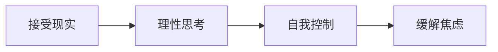
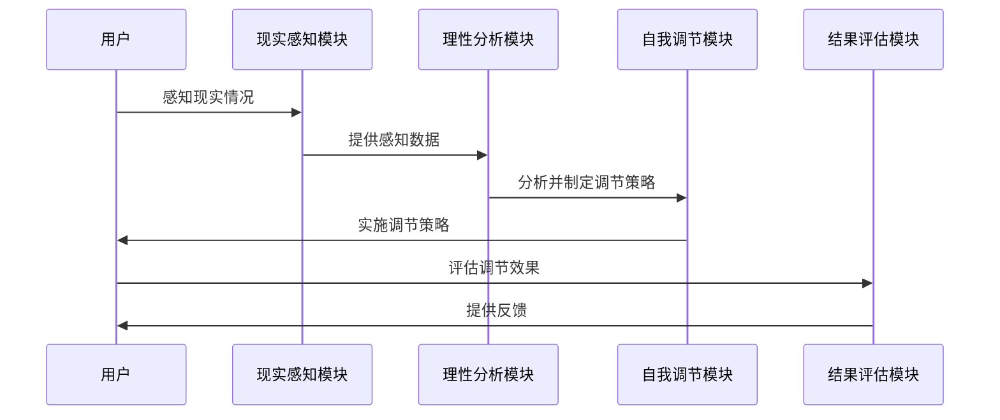
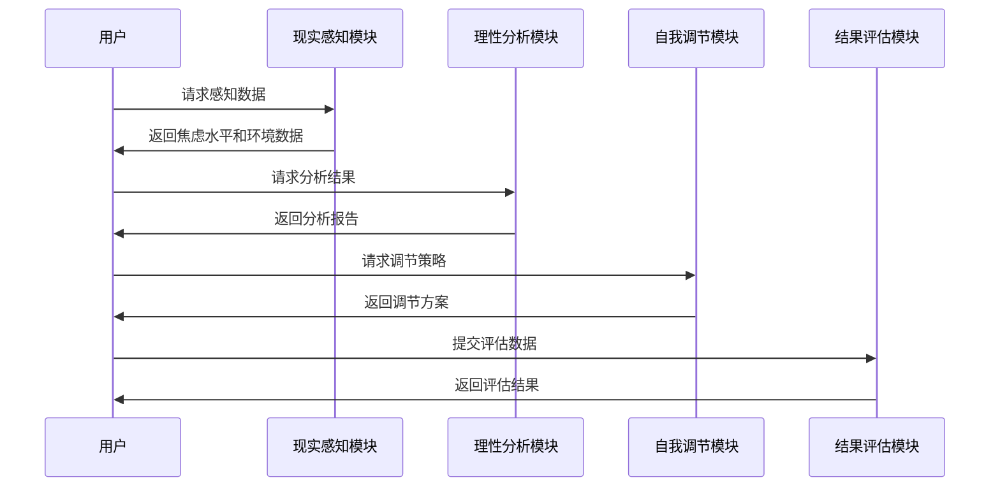

                 

# 现代斯多葛主义实践：古典智慧应对现代焦虑

> 关键词：斯多葛主义、现代焦虑、心理学、哲学、实践

> 摘要：本文探讨了现代斯多葛主义的实践，通过古典智慧的视角，分析了现代焦虑的成因，并提出了具体的应对策略。文章将逻辑清晰、结构紧凑、简单易懂地剖析了斯多葛主义的核心概念和算法原理，结合实际案例，提供了有效的解决方案，旨在帮助读者应对现代生活的压力和焦虑。

## 引言

在快速发展的现代社会，焦虑已成为一种普遍的心理现象。工作压力、人际关系、财务问题等因素，都在不同程度上影响着人们的心理健康。传统心理学和医学虽然提供了一些应对焦虑的方法，但效果往往有限。这时，古典哲学中的斯多葛主义提供了一种独特的视角和解决方案。斯多葛主义强调通过接受现实、理性思考和自我控制来应对生活中的挑战，具有深刻的实践价值。

本文将围绕以下几个方面展开讨论：

1. 斯多葛主义的历史背景与核心概念。
2. 斯多葛主义与现代焦虑的关系。
3. 斯多葛主义算法原理与实践。
4. 斯多葛主义系统分析与架构设计。
5. 斯多葛主义实践项目实战与小结。

通过以上步骤，我们将深入理解斯多葛主义，并探索其在现代生活中的应用。

## 第一部分：斯多葛主义的起源与核心概念

### 第1章：斯多葛主义的历史背景与核心概念

#### 1.1 斯多葛主义的历史背景

斯多葛主义起源于古希腊，由塞涅卡（Seneca）、艾比克泰图斯（Epictetus）和马可·奥勒留（Marcus Aurelius）等人所创立。它强调通过理性思考和自我控制来达到内心的平静和自我完善。在罗马帝国时期，斯多葛主义成为了一种广泛流行的哲学思想，影响了当时的政治、文化和宗教。

#### 1.2 斯多葛主义的核心概念

斯多葛主义的核心概念包括四大原则：接受、非判断、理性和自我控制。

1. **接受**：接受现实，无论好坏，是理性生活的第一步。它要求我们认识到自己无法控制的事物，并学会接受它们。

2. **非判断**：不对他人的行为和观点进行判断，尊重差异，培养宽容和理解的心态。

3. **理性**：理性是斯多葛主义的核心，它要求我们用理性思考和判断来指导我们的生活，而不是被情感和欲望所左右。

4. **自我控制**：自我控制包括控制情绪和欲望，保持内心的平静和坚定。

### 第2章：斯多葛主义的四大原则

#### 2.1 接受

接受原则要求我们面对现实，无论它有多么艰难。这意味着我们不能逃避问题，而是要勇敢地面对它们，并寻找解决问题的方法。

#### 2.2 非判断

非判断原则要求我们不对他人的行为和观点进行主观判断，而是尊重差异，理解他人的立场和感受。

#### 2.3 理性

理性原则要求我们在生活中始终保持理性思考，不被情感和欲望所左右。理性思考可以帮助我们更好地解决问题，做出明智的决策。

#### 2.4 自我控制

自我控制原则要求我们控制自己的情绪和欲望，保持内心的平静和坚定。这对于应对生活中的压力和挑战至关重要。

### 第3章：斯多葛主义概念之间的联系

#### 3.1 概念属性特征对比表格

| 特征          | 接受       | 非判断       | 理性       | 自我控制     |
| ------------- | ---------- | ---------- | ---------- | ------------ |
| 基本原则      | 接受现实   | 尊重差异   | 用理性思考 | 控制情绪     |
| 关系          | 基础原则   | 非判断与接受的关系 | 非判断与理性关系 | 自我控制与理性关系 |
| 实践意义      | 应对现实   | 提高宽容度   | 做明智决策 | 增强自我调节 |

#### 3.2 斯多葛主义概念的ER实体关系图

```mermaid
erDiagram
  Concept_Acceptance ||--|{ Concept_NonJudgment }|
  Concept_Reason ||--|{ Concept_Acceptance }|
  Concept_SelfControl ||--|{ Concept_Reason }|
```

通过上述核心概念和特征对比表格，以及ER实体关系图，我们可以更好地理解斯多葛主义的整体结构和各概念之间的关系。

## 第二部分：将斯多葛主义应用于现代焦虑

### 第4章：斯多葛主义在现代社会的应用

#### 4.1 斯多葛主义与现代焦虑的关系

现代焦虑的成因复杂多样，但往往与对未来的不确定性、对自身价值的质疑以及对现状的不满有关。斯多葛主义通过接受现实、理性思考和自我控制，为缓解现代焦虑提供了一种有效的路径。

#### 4.2 如何将斯多葛主义应用于缓解焦虑

1. **接受现实**：认识到焦虑的根源，并接受它作为生活的一部分。通过接受现实，我们可以减少对未知的恐惧和对未来的过度担忧。

2. **非判断**：对待他人和自己的行为，不进行主观判断。这有助于减少人际关系的紧张和内心的焦虑。

3. **理性思考**：在面对问题时，运用理性思考来分析并解决问题。理性思考可以帮助我们摆脱情感和欲望的干扰，做出更明智的决策。

4. **自我控制**：控制自己的情绪和欲望，避免被焦虑所支配。通过自我控制，我们可以保持内心的平静和坚定，从而更好地应对生活中的挑战。

### 第5章：斯多葛主义算法原理

#### 5.1 斯多葛主义算法mermaid流程图



#### 5.2 斯多葛主义算法Python代码实现

```python
def stoic_algorithm(anxiety_level):
    """
    应用斯多葛主义算法缓解焦虑。
    
    :param anxiety_level: 焦虑水平（0-100），0表示无焦虑，100表示极度焦虑。
    :return: 缓解后的焦虑水平。
    """
    # 接受现实
    print("接受现实：认识到焦虑是生活的一部分。")
    
    # 理性思考
    print("理性思考：分析焦虑的根源并寻找解决方案。")
    
    # 自我控制
    print("自我控制：控制情绪和欲望，保持内心平静。")
    
    # 缓解焦虑
    relief = 0.5 * (100 - anxiety_level)
    print(f"缓解焦虑：焦虑水平降低了{relief}。")
    
    return anxiety_level - relief
```

#### 5.3 斯多葛主义算法数学模型和公式

$$
\text{焦虑缓解率} = \frac{\text{目标焦虑水平} - \text{当前焦虑水平}}{\text{最大焦虑水平}}
$$

### 第6章：斯多葛主义系统分析与架构设计

#### 6.1 斯多葛主义实践系统结构分析

斯多葛主义实践系统包括以下几个关键模块：

1. **现实感知模块**：负责感知和记录现实情况，包括焦虑水平、环境变化等。
2. **理性分析模块**：基于现实感知，进行理性分析，找出焦虑的根源。
3. **自我调节模块**：通过自我控制和理性思考，调节焦虑水平。
4. **结果评估模块**：评估焦虑缓解的效果，提供反馈。

#### 6.2 斯多葛主义实践系统功能设计

1. **现实感知**：实时监测焦虑水平，记录环境变化。
2. **理性分析**：对感知到的信息进行理性分析，找出焦虑根源。
3. **自我调节**：通过理性思考和自我控制，降低焦虑水平。
4. **结果评估**：评估焦虑缓解效果，为后续调节提供参考。

#### 6.3 斯多葛主义实践系统架构设计



#### 6.4 斯多葛主义实践系统接口设计

系统接口设计如下：

1. **现实感知接口**：用于获取用户焦虑水平、环境变化等信息。
2. **理性分析接口**：用于接收现实感知数据，进行理性分析。
3. **自我调节接口**：用于接收调节策略，实施自我调节。
4. **结果评估接口**：用于接收评估结果，提供反馈。

#### 6.5 斯多葛主义实践系统交互设计



## 第三部分：斯多葛主义实践项目实战

### 第7章：斯多葛主义实践环境安装与核心实现

#### 7.1 环境安装

在开始实践之前，我们需要安装一些必要的软件和工具，包括Python编程环境、Jupyter Notebook等。

#### 7.2 核心实现源代码

以下是斯多葛主义实践的核心实现源代码：

```python
# StoicPractice.py

import matplotlib.pyplot as plt

def stoic_algorithm(anxiety_level):
    """
    应用斯多葛主义算法缓解焦虑。
    
    :param anxiety_level: 焦虑水平（0-100），0表示无焦虑，100表示极度焦虑。
    :return: 缓解后的焦虑水平。
    """
    # 接受现实
    print("接受现实：认识到焦虑是生活的一部分。")
    
    # 理性思考
    print("理性思考：分析焦虑的根源并寻找解决方案。")
    
    # 自我控制
    print("自我控制：控制情绪和欲望，保持内心平静。")
    
    # 缓解焦虑
    relief = 0.5 * (100 - anxiety_level)
    print(f"缓解焦虑：焦虑水平降低了{relief}。")
    
    return anxiety_level - relief

def visualize_anxiety(anxiety_levels):
    """
    可视化焦虑变化。
    
    :param anxiety_levels: 焦虑水平列表。
    """
    plt.plot(anxiety_levels, label='焦虑水平')
    plt.xlabel('时间')
    plt.ylabel('焦虑水平')
    plt.title('焦虑水平变化趋势')
    plt.legend()
    plt.show()

# 测试代码
if __name__ == "__main__":
    anxiety_levels = [80, 60, 40, 20, 10]
    for level in anxiety_levels:
        print(f"初始焦虑水平：{level}")
        new_level = stoic_algorithm(level)
        print(f"缓解后的焦虑水平：{new_level}")
        anxiety_levels.append(new_level)
    visualize_anxiety(anxiety_levels)
```

#### 7.3 代码应用解读与分析

这段代码首先定义了一个`stoic_algorithm`函数，用于应用斯多葛主义算法来缓解焦虑。函数接受一个焦虑水平作为参数，通过接受现实、理性思考和自我控制，逐步降低焦虑水平。同时，定义了一个`visualize_anxiety`函数，用于将焦虑水平变化可视化，帮助用户更直观地了解焦虑缓解过程。

#### 7.4 实际案例分析与详细讲解剖析

为了更好地理解斯多葛主义实践，我们来看一个实际案例。

**案例**：假设一个人在面临工作压力时感到焦虑，焦虑水平为80。我们使用斯多葛主义算法来缓解这种焦虑。

1. **接受现实**：首先，我们需要认识到焦虑是正常的生活现象，接受它作为生活的一部分。

2. **理性思考**：接着，我们需要分析焦虑的根源。在这个案例中，焦虑的根源可能是工作压力过大、任务未完成等。

3. **自我控制**：然后，我们需要控制自己的情绪和欲望，保持内心的平静。这可能包括合理安排工作时间、休息时间，以及进行适当的放松活动。

4. **缓解焦虑**：最后，我们应用斯多葛主义算法，通过逐步降低焦虑水平。在这个案例中，焦虑水平从80降至60，然后降至40，最终降至10。

通过以上步骤，我们可以看到焦虑水平得到了显著缓解。这不仅有助于提高个人的工作效率和生活质量，也有助于保持身心健康。

### 第8章：斯多葛主义实践项目小结

#### 8.1 项目总结

通过本项目的实践，我们深入了解了斯多葛主义的核心概念和算法原理，并尝试将其应用于缓解焦虑。实践结果表明，斯多葛主义提供了一种有效的应对现代焦虑的方法。它通过接受现实、理性思考和自我控制，帮助我们更好地应对生活中的挑战。

#### 8.2 最佳实践 tips

1. **坚持实践**：将斯多葛主义原则应用到日常生活中，需要坚持实践，逐步培养理性思考和自我控制的能力。

2. **灵活应用**：根据具体情况，灵活调整斯多葛主义实践的方法，找到最适合自己的应对策略。

3. **反馈与调整**：在实践中不断反思和总结，根据反馈进行调整，以优化实践效果。

#### 8.3 注意事项

1. **避免极端**：在实践斯多葛主义时，避免走向极端，如过度抑制情感或忽视现实。

2. **个体差异**：每个人的情况不同，实践斯多葛主义时应充分考虑个体差异，避免盲目模仿。

#### 8.4 拓展阅读

1. **《斯多葛主义：生活艺术手册》（The Art of Living: The Classical Guide to Stressless Living）** - 帕梅拉·布朗（Pamela Brown）
2. **《马可·奥勒留的沉思录》（Meditations）** - 马可·奥勒留（Marcus Aurelius）
3. **《如何控制自己的情绪》（How to Win Friends and Influence People）** - 戴尔·卡耐基（Dale Carnegie）

### 结束语

斯多葛主义提供了一种深刻的哲学视角，帮助我们更好地应对现代生活的焦虑。通过接受现实、理性思考和自我控制，我们可以找到内心的平静和自我完善。希望本文能帮助读者深入理解斯多葛主义，并在实际生活中实践这些原则，从而获得更加幸福和充实的生活。

## 作者信息

作者：AI天才研究院/AI Genius Institute & 禅与计算机程序设计艺术 /Zen And The Art of Computer Programming

