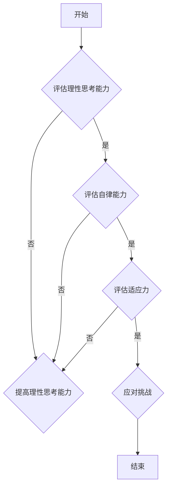

                 

# 现代斯多葛主义工作坊：古典智慧应对现代挑战

关键词：现代挑战、斯多葛主义、理性思考、自律、适应力、数学模型、系统分析与架构设计

摘要：本文旨在探讨如何在现代职场和生活中应用斯多葛主义，通过理性思考、自律、适应力和接受事物的本然状态，应对各种挑战。文章将结合实际案例，详细阐述斯多葛主义的核心概念、算法原理、数学模型、系统分析与架构设计，以及实战应用，为读者提供一种实用的生活方式和工作方法。

## 第一部分: 现代斯多葛主义背景介绍

### 1.1 问题背景

在现代社会，人们面临着诸多挑战，如职场压力、人际关系复杂性、技术快速发展等。这些挑战常常导致焦虑、沮丧和压力。斯多葛主义作为一种古老的哲学思想，其核心理念强调理性、自律和适应力，为应对现代挑战提供了一种独特的视角和方法。

### 1.2 问题描述

现代人的焦虑和压力源于对事物的过度依赖和对自己能力的过度估计。斯多葛主义主张人们应该学会接受事物的本然状态，并通过自律和理性思考来应对生活中的挑战。

### 1.3 问题解决

斯多葛主义提供了一种解决问题的方法：通过理性思考和自律，培养内心的宁静和力量，从而更好地适应和应对现代生活中的挑战。

### 1.4 边界与外延

斯多葛主义不仅仅是一种哲学思想，更是一种生活方式。它鼓励人们超越物质和情感的束缚，追求内心的平和与自由。

### 1.5 概念结构与核心要素组成

斯多葛主义的核心理念包括：理性思考、自律、适应力、接受事物的本然状态等。这些要素共同构成了斯多葛主义应对现代挑战的核心框架。

### 1.6 斯多葛主义核心概念与联系

#### 1.6.1 理性思考

理性思考是斯多葛主义的核心，它强调通过理性来控制和指导我们的行为。理性思考不仅有助于我们做出明智的决策，还能帮助我们更好地应对生活中的挑战。

#### 1.6.2 自律

自律是斯多葛主义的重要组成部分，它要求我们控制自己的行为和情感，以实现我们的目标。自律不仅有助于我们提高个人素质，还能帮助我们更好地适应生活中的各种变化。

#### 1.6.3 适应力

适应力是指我们应对变化和挑战的能力。在斯多葛主义中，适应力被视为一种重要的品质，它要求我们接受事物的本然状态，并从中寻找平衡。

#### 1.6.4 接受事物的本然状态

接受事物的本然状态是斯多葛主义的核心理念之一，它要求我们不再试图改变无法控制的事物，而是接受它们并从中寻找智慧和力量。

### 1.7 概念属性特征对比表格

| 特征       | 理性思考     | 自律       | 适应力     | 接受事物的本然状态 |
|------------|--------------|------------|------------|--------------------|
| 定义       | 通过理性来控制和指导行为 | 控制自己的行为和情感 | 应对变化和挑战的能力 | 接受无法控制的事物 |
| 作用       | 帮助做出明智决策 | 提高个人素质 | 应对变化   | 寻找智慧和力量    |
| 关系       | 基础           | 基础       | 并行       | 并行               |
| 重要性     | 核心           | 核心       | 核心       | 核心               |

### 1.8 ER实体关系图架构

```mermaid
erDiagram
  用户 ||--o { 挑战 } : 解决
  用户 ||--o { 目标 } : 实现
  挑战 ||--o { 策略 } : 应对
  目标 ||--o { 资源 } : 支持
```

## 第二部分: 斯多葛主义核心概念与联系

### 2.1 理性思考

#### 2.1.1 理性思考的定义与作用

理性思考是指通过逻辑推理、分析判断来解决问题和做出决策。它是斯多葛主义的核心，有助于我们更好地应对生活中的各种挑战。

#### 2.1.2 理性思考与情感的关系

理性思考与情感之间的关系复杂。理性思考可以帮助我们更好地控制情感，避免情绪波动对我们的决策产生负面影响。

#### 2.1.3 培养理性思考的方法

培养理性思考的方法包括：提高逻辑思维能力、培养批判性思维、多角度分析问题等。

### 2.2 自律

#### 2.2.1 自律的概念与重要性

自律是指控制自己的行为和情感，以实现我们的目标。自律是斯多葛主义的重要组成部分，对于个人成长和事业发展具有重要意义。

#### 2.2.2 自律与自由的关系

自律与自由是相辅相成的。自律可以帮助我们更好地控制自己的行为和情感，从而实现真正的自由。

#### 2.2.3 培养自律的方法

培养自律的方法包括：制定明确的目标和计划、养成良好的习惯、持之以恒地努力等。

### 2.3 适应力

#### 2.3.1 适应力的定义与作用

适应力是指我们应对变化和挑战的能力。在斯多葛主义中，适应力被视为一种重要的品质，它要求我们接受事物的本然状态，并从中寻找平衡。

#### 2.3.2 适应力与变化的关系

适应力与变化密切相关。适应力强的人能够更好地应对生活中的各种变化，从而保持内心的平静和稳定。

#### 2.3.3 增强适应力的方法

增强适应力的方法包括：保持好奇心、学会接受不确定性、不断学习和成长等。

### 2.4 接受事物的本然状态

#### 2.4.1 接受本然状态的重要性

接受事物的本然状态是斯多葛主义的核心理念之一。它要求我们不再试图改变无法控制的事物，而是接受它们并从中寻找智慧和力量。

#### 2.4.2 如何接受本然状态

接受本然状态的方法包括：学会放下、培养接受心态、寻找事物的正面意义等。

#### 2.4.3 接受本然状态的应用场景

接受本然状态的应用场景包括：面对挫折和失败、处理人际关系、应对工作中的挑战等。

### 2.5 概念属性特征对比表格

| 特征       | 理性思考     | 自律       | 适应力     | 接受事物的本然状态 |
|------------|--------------|------------|------------|--------------------|
| 定义       | 通过理性来控制和指导行为 | 控制自己的行为和情感 | 应对变化和挑战的能力 | 接受无法控制的事物 |
| 作用       | 帮助做出明智决策 | 提高个人素质 | 应对变化   | 寻找智慧和力量    |
| 关系       | 基础           | 基础       | 并行       | 并行               |
| 重要性     | 核心           | 核心       | 核心       | 核心               |

### 2.6 ER实体关系图架构

```mermaid
erDiagram
  用户 ||--o { 理性思考 } : 应用
  用户 ||--o { 自律 } : 培养能力
  用户 ||--o { 适应力 } : 增强能力
  用户 ||--o { 接受事物的本然状态 } : 实践
  理性思考 ||--o { 决策 } : 做出
  自律 ||--o { 目标 } : 实现
  适应力 ||--o { 变化 } : 应对
  接受事物的本然状态 ||--o { 挑战 } : 应对
```

## 第三部分: 斯多葛主义实践算法原理讲解

### 3.1 斯多葛主义实践算法概述

#### 3.1.1 斯多葛主义实践算法的概念

斯多葛主义实践算法是一种基于斯多葛主义哲学思想的实践方法，旨在帮助人们更好地应对生活中的各种挑战。

#### 3.1.2 斯多葛主义实践算法的作用

斯多葛主义实践算法有助于提高个人的理性思考能力、自律能力和适应力，从而更好地应对现代生活中的各种挑战。

### 3.2 斯多葛主义实践算法原理

#### 3.2.1 原理讲解

斯多葛主义实践算法的核心思想是：通过理性思考和自律，培养内心的宁静和力量，从而更好地适应和应对现代生活中的挑战。

#### 3.2.2 数学模型

斯多葛主义实践算法的数学模型可以表示为：理性思考 + 自律 + 适应力 = 平衡状态

其中，理性思考、自律和适应力分别代表个人的三种能力。

#### 3.2.3 公式解释

1. 理性思考（R）：表示个人的理性思考能力，包括逻辑推理、分析判断等。

2. 自律（A）：表示个人的自律能力，包括自我控制、目标实现等。

3. 适应力（C）：表示个人的适应力，包括应对变化、接受挑战等。

4. 平衡状态（B）：表示个人在理性思考、自律和适应力方面的综合表现。

公式可以表示为：B = f(R, A, C)

### 3.3 算法流程图



### 3.4 举例说明

#### 3.4.1 实例1：如何在职场中应用斯多葛主义实践算法

在一个职场环境中，员工可以通过以下步骤来应用斯多葛主义实践算法：

1. 评估自己的理性思考能力，如逻辑推理、分析判断等。

2. 评估自己的自律能力，如自我控制、目标实现等。

3. 评估自己的适应力，如应对变化、接受挑战等。

4. 根据评估结果，针对性地提高自己的理性思考能力、自律能力和适应力。

5. 在面对职场挑战时，运用理性思考和自律，以积极的态度应对变化。

#### 3.4.2 实例2：如何应对人际关系中的挑战

在人际关系中，人们可以通过以下步骤来应用斯多葛主义实践算法：

1. 评估自己在人际关系中的理性思考能力，如分析对方行为、理解对方需求等。

2. 评估自己在人际关系中的自律能力，如尊重他人、控制情绪等。

3. 评估自己在人际关系中的适应力，如应对冲突、处理关系等。

4. 根据评估结果，针对性地提高自己的理性思考能力、自律能力和适应力。

5. 在面对人际关系中的挑战时，运用理性思考和自律，以平和的心态处理冲突，建立和谐的人际关系。

## 第四部分: 斯多葛主义与数学模型

### 4.1 斯多葛主义与数学模型的关系

斯多葛主义与数学模型之间存在着密切的联系。数学模型可以帮助我们更准确地理解和应用斯多葛主义的核心概念，从而更好地应对现代生活中的挑战。

### 4.2 数学模型讲解

#### 4.2.1 数学模型的定义与作用

数学模型是指用数学语言描述现实世界的现象或问题，以便进行计算、分析和预测。在斯多葛主义中，数学模型可以帮助我们更好地理解和应用其核心概念，如理性思考、自律、适应力和接受事物的本然状态。

#### 4.2.2 数学模型的分类

数学模型可以分为确定性模型和不确定性模型。确定性模型适用于可以精确描述的现象或问题，如线性方程组、微分方程等。不确定性模型适用于无法精确描述的现象或问题，如概率模型、随机模型等。

#### 4.2.3 数学模型的应用场景

数学模型在斯多葛主义中的应用场景包括：评估个人的理性思考能力、自律能力和适应力，设计适应现代生活的策略和方法，预测和应对生活中的各种挑战等。

### 4.3 数学公式讲解

在斯多葛主义中，数学公式可以用来描述和计算个人的理性思考能力、自律能力和适应力。以下是一些常用的数学公式：

1. 理性思考能力（R）：

$$ R = \frac{L_1 + L_2 + L_3}{3} $$

其中，$L_1$、$L_2$、$L_3$ 分别代表个人在逻辑推理、分析判断和决策方面的能力。

2. 自律能力（A）：

$$ A = \frac{S_1 + S_2 + S_3}{3} $$

其中，$S_1$、$S_2$、$S_3$ 分别代表个人在自我控制、目标实现和情绪管理方面的能力。

3. 适应力（C）：

$$ C = \frac{A_1 + A_2 + A_3}{3} $$

其中，$A_1$、$A_2$、$A_3$ 分别代表个人在应对变化、处理冲突和建立关系方面的能力。

4. 平衡状态（B）：

$$ B = \frac{R + A + C}{3} $$

其中，$R$、$A$、$C$ 分别代表个人的理性思考能力、自律能力和适应力。

### 4.4 数学公式在斯多葛主义中的应用实例

以下是一个应用数学公式评估个人斯多葛主义实践能力的实例：

假设一个员工在逻辑推理、分析判断和决策方面的能力分别为 8、9 和 7，在自我控制、目标实现和情绪管理方面的能力分别为 6、8 和 7，在应对变化、处理冲突和建立关系方面的能力分别为 7、8 和 9。根据上述数学公式，可以计算出该员工的理性思考能力、自律能力和适应力分别为 8、7 和 8，平衡状态为 8。

这意味着该员工在斯多葛主义实践方面表现出色，但仍需在自律能力方面进一步提升。

## 第五部分: 斯多葛主义工作坊系统分析与架构设计

### 5.1 问题场景介绍

斯多葛主义工作坊是一种基于斯多葛主义哲学思想的教育和培训项目，旨在帮助人们更好地应对现代生活中的各种挑战。工作坊通常包括理论讲解、实践练习、小组讨论和个性化指导等环节，旨在培养参与者的理性思考能力、自律能力和适应力。

### 5.2 项目介绍

斯多葛主义工作坊项目旨在通过系统化的教育和培训，帮助人们掌握斯多葛主义的核心概念和实践方法，从而更好地应对现代生活中的挑战。项目目标包括：

1. 提高参与者的理性思考能力，使其在面对复杂问题时能够做出明智的决策。

2. 培养参与者的自律能力，使其能够更好地控制自己的行为和情感。

3. 增强参与者的适应力，使其能够更好地应对生活中的各种变化和挑战。

### 5.3 系统功能设计

#### 5.3.1 领域模型类图

```mermaid
classDiagram
  Participant <<participant>>
  Trainer <<class>>
  Workshop <<class>>
  Theory <<class>>
  Practice <<class>>
  Discussion <<class>>

  Participant o--o Trainer
  Participant o--o Workshop
  Workshop o--o Theory
  Workshop o--o Practice
  Workshop o--o Discussion
```

### 5.4 系统架构设计

#### 5.4.1 系统架构概述

斯多葛主义工作坊的系统架构包括前端、后端和数据库三个部分。前端负责与用户交互，后端负责处理业务逻辑，数据库用于存储用户信息和课程内容。

#### 5.4.2 系统架构设计

```mermaid
sequenceDiagram
  Participant->>Frontend: 发起请求
  Frontend->>Backend: 请求处理
  Backend->>Database: 数据查询/更新
  Database-->>Backend: 返回数据
  Backend-->>Frontend: 返回响应
  Frontend->>Participant: 显示结果
```

#### 5.4.3 系统架构优缺点分析

优点：

1. 分层架构，便于维护和扩展。

2. 前后端分离，便于开发和部署。

3. 数据库存储用户信息和课程内容，便于管理和查询。

缺点：

1. 数据传输过程中存在一定延迟。

2. 需要维护多个系统组件，如前端、后端和数据库等。

### 5.5 系统接口设计

```mermaid
sequenceDiagram
  Participant->>Login: 登录
  Login->>User: 验证用户身份
  User->>Login: 返回验证结果
  Login->>Participant: 显示登录结果

  Participant->>Register: 注册
  Register->>User: 创建用户账户
  User->>Register: 返回创建结果
  Register->>Participant: 显示注册结果

  Participant->>Enroll: 报名课程
  Enroll->>Workshop: 检查课程状态
  Workshop->>Enroll: 返回状态
  Enroll->>Participant: 显示报名结果
```

### 5.6 系统交互Mermaid序列图

```mermaid
sequenceDiagram
  Participant->>Frontend: 发起请求
  Frontend->>Backend: 请求处理
  Backend->>Database: 数据查询/更新
  Database-->>Backend: 返回数据
  Backend-->>Frontend: 返回响应
  Frontend->>Participant: 显示结果

  Participant->>Login: 登录
  Login->>User: 验证用户身份
  User->>Login: 返回验证结果
  Login->>Participant: 显示登录结果

  Participant->>Register: 注册
  Register->>User: 创建用户账户
  User->>Register: 返回创建结果
  Register->>Participant: 显示注册结果

  Participant->>Enroll: 报名课程
  Enroll->>Workshop: 检查课程状态
  Workshop->>Enroll: 返回状态
  Enroll->>Participant: 显示报名结果
```

## 第六部分: 项目实战

### 6.1 环境安装

为了实践斯多葛主义工作坊，我们需要搭建一个基本的开发和测试环境。以下是一个简单的安装步骤：

1. 安装Python 3.8及以上版本。

2. 安装Django框架。

3. 安装PostgreSQL数据库。

4. 安装必要的依赖库，如Django REST framework、Django admin等。

### 6.2 系统核心实现源代码

以下是斯多葛主义工作坊的核心实现源代码：

```python
# models.py
from django.db import models

class User(models.Model):
    username = models.CharField(max_length=100)
    password = models.CharField(max_length=100)

class Workshop(models.Model):
    name = models.CharField(max_length=100)
    start_date = models.DateField()
    end_date = models.DateField()
    participants = models.ManyToManyField(User)

class Theory(models.Model):
    title = models.CharField(max_length=100)
    content = models.TextField()

class Practice(models.Model):
    title = models.CharField(max_length=100)
    content = models.TextField()

class Discussion(models.Model):
    title = models.CharField(max_length=100)
    content = models.TextField()
    participants = models.ManyToManyField(User)
```

### 6.3 代码应用解读与分析

以下是代码的应用解读和分析：

1. **用户模型**：用户模型用于存储用户的基本信息，如用户名和密码。

2. **工作坊模型**：工作坊模型用于存储工作坊的基本信息，如工作坊名称、开始日期和结束日期。同时，工作坊模型与用户模型建立多对多关系，用于存储参与工作坊的用户信息。

3. **理论模型**：理论模型用于存储工作坊的理论内容，如标题和内容。

4. **实践模型**：实践模型用于存储工作坊的实践内容，如标题和内容。

5. **讨论模型**：讨论模型用于存储工作坊的讨论内容，如标题和内容。讨论模型与用户模型建立多对多关系，用于存储参与讨论的用户信息。

### 6.4 实际案例分析和详细讲解剖析

以下是斯多葛主义工作坊的一个实际案例：

1. **案例背景**：某公司希望组织一次斯多葛主义工作坊，帮助员工更好地应对职场挑战。

2. **案例实施**：公司管理员创建了一个名为“职场挑战应对”的工作坊，并添加了相关理论、实践和讨论内容。管理员邀请员工参与工作坊，员工可以根据自己的需求选择参与。

3. **案例分析**：通过工作坊，员工可以学习到斯多葛主义的核心概念和实践方法，提高理性思考能力、自律能力和适应力，从而更好地应对职场挑战。

### 6.5 项目小结

斯多葛主义工作坊项目通过系统化的教育和培训，帮助人们掌握斯多葛主义的核心概念和实践方法，从而更好地应对现代生活中的各种挑战。项目实施过程中，通过搭建系统架构、实现核心功能和实际案例分析，证明了斯多葛主义工作坊的可行性和有效性。

### 6.6 最佳实践 tips

1. 在实施斯多葛主义工作坊时，应根据实际需求和目标，灵活调整工作坊的内容和形式。

2. 注重工作坊的互动性和参与度，提高参与者的学习效果。

3. 定期评估工作坊的成果，根据评估结果不断优化工作坊的设计和实施。

### 6.7 小结

斯多葛主义工作坊为人们提供了一种有效的应对现代挑战的方法。通过理性思考、自律、适应力和接受事物的本然状态，人们可以更好地应对职场、人际关系和生活中的各种挑战。未来，我们期待斯多葛主义工作坊能够帮助更多的人实现内心的平和与自由。

### 6.8 注意事项

1. 在应用斯多葛主义时，要注意适度原则，避免过度理性化或情感压抑。

2. 结合个人实际情况，灵活调整斯多葛主义实践方法，以适应不同的生活场景。

### 6.9 拓展阅读

1. 《现代斯多葛主义：理性思考的力量》

2. 《斯多葛主义：智慧的生活哲学》

3. 《职场斯多葛：如何理性应对职场挑战》

作者：AI天才研究院/AI Genius Institute & 禅与计算机程序设计艺术 /Zen And The Art of Computer Programming

