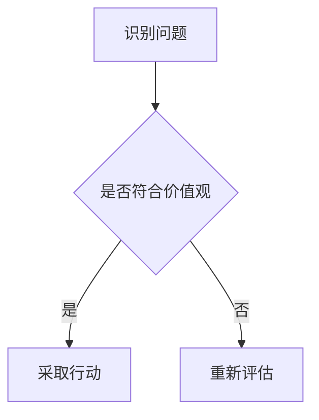
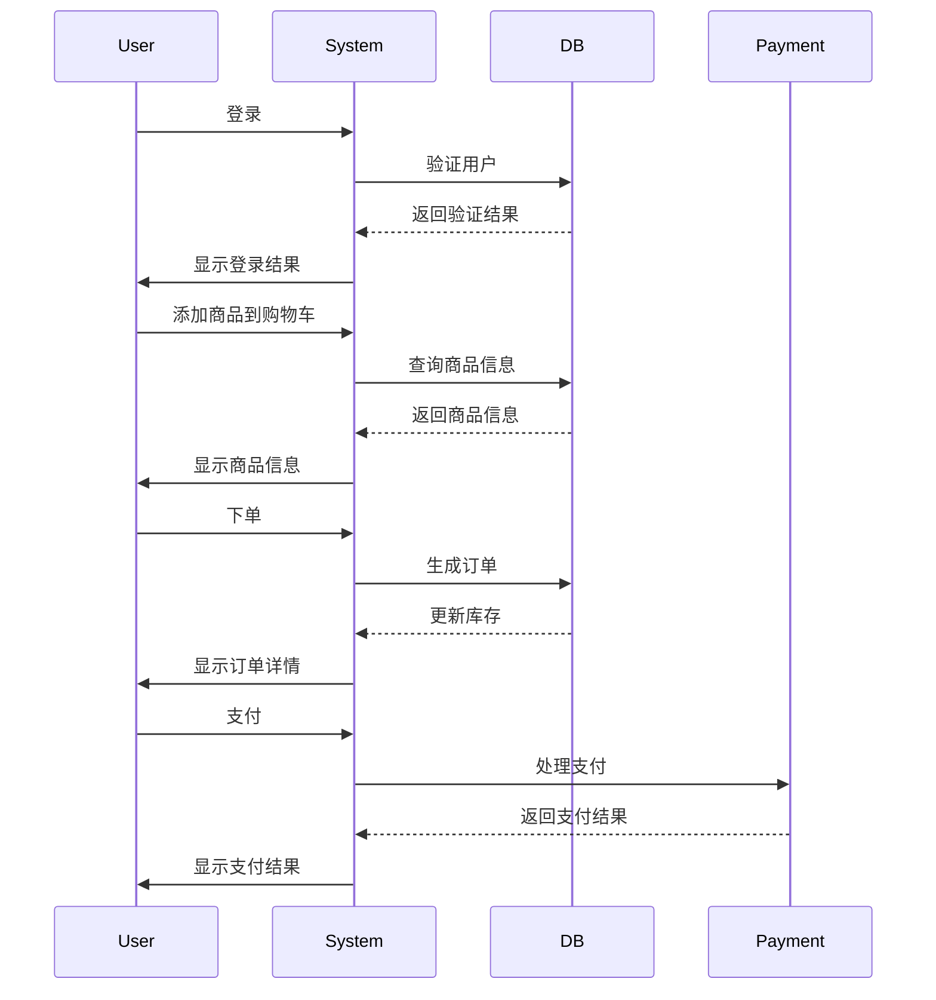

                 


### 引言：哲学的现代意义

在现代生活中，哲学不再只是学者的专利，它逐渐渗透到我们的日常决策和生活中，成为解决复杂问题的实用工具。哲学作为一门探讨存在、知识、价值、理智、心灵、语言等根本问题的学科，其深刻的思考和系统的理论为我们的生活提供了丰富的智慧资源。设计《现代生活中的哲学应用：实用智慧指南》这本书的目的，在于揭示哲学在现实世界中的多种应用场景，帮助读者学会如何将哲学原理转化为生活中的实际智慧。

本文将按照以下步骤进行详细分析：

1. **核心概念与联系**：首先，我们将介绍哲学的核心概念，并探讨这些概念如何与我们的生活产生关联。
2. **算法原理讲解**：接着，我们将通过一个实际案例，使用Mermaid流程图和Python代码来讲解哲学在生活中的应用原理。
3. **系统分析与架构设计方案**：然后，我们将讨论哲学如何应用于复杂的系统设计和架构。
4. **项目实战**：我们将通过一个具体项目实战，展示哲学原理的实际应用。
5. **最佳实践与总结**：最后，我们将总结本文的主要内容，并提供一些最佳实践和拓展阅读建议。

### 1. 核心概念与联系

哲学的核心概念包括存在论、认识论、伦理学、政治哲学等。这些概念不仅探讨抽象的哲学问题，也直接关联到我们的日常生活。

#### 存在论

存在论关注的是“存在”的本质和形态。在日常生活中，我们可以通过存在论来思考自我存在、他人存在以及环境存在。例如，当我们考虑个人身份和角色时，存在论帮助我们理解自己在社会中的位置和责任。

#### 认识论

认识论探讨知识的来源和真实性。在决策过程中，认识论提醒我们要批判性地思考信息，并判断其可信度和相关性。例如，在面对新闻和社交媒体上的信息时，认识论帮助我们辨别真假，避免被误导。

#### 伦理学

伦理学关注道德和价值观。在人际交往中，伦理学指导我们如何判断行为的好坏，如何处理人际关系中的冲突。例如，在职场中，伦理学帮助我们理解如何公平地对待同事，如何在竞争中保持诚信。

#### 政治哲学

政治哲学探讨政治权力的合法性和治理原则。在公共生活中，政治哲学帮助我们理解政府的作用，以及如何参与社会和政治活动。例如，在投票时，政治哲学指导我们如何做出符合自己价值观的选择。

### 2. 算法原理讲解

为了更具体地展示哲学原理在生活中的应用，我们通过一个简单的决策树算法来分析如何运用哲学思考解决现实问题。

#### Mermaid流程图



#### Python代码

```python
def make_decision(problem, values):
    if values.includes(problem):
        return "采取行动"
    else:
        return "重新评估"
```

#### 算法原理与数学模型

算法的核心是判断问题是否符合个人的价值观。这里我们可以引入贝叶斯定理来量化这种判断：

$$
P(\text{采取行动} | \text{符合价值观}) = \frac{P(\text{符合价值观} | \text{采取行动}) \cdot P(\text{采取行动})}{P(\text{符合价值观})}
$$

这个公式表示，在给定一个决策时，判断其是否符合价值观的概率，可以通过已知的条件概率和先验概率计算得到。

### 3. 系统分析与架构设计方案

哲学不仅在个人决策中有用，在复杂的系统设计和架构中同样发挥着重要作用。以下是一个简化的系统分析与架构设计方案：

#### 问题场景介绍

假设我们需要设计一个在线购物系统，该系统需要处理用户购物、订单生成、支付等复杂流程。

#### 项目介绍

**项目名称**：智慧购物平台

**项目目标**：提供安全、高效、用户体验良好的在线购物平台。

#### 系统功能设计

**领域模型类图**

```mermaid
classDiagram
Class::User
Class::Product
Class::Cart
Class::Order
Class::Payment

User --> Cart
User --> Order
Product --> Cart
Product --> Order
Cart --> Order
Order --> Payment
```

#### 系统架构设计

**架构图**



### 4. 项目实战

假设我们正在开发一个在线购物系统，为了更好地应用哲学原理，我们采取以下步骤：

#### 环境安装

- 安装Python环境
- 安装Django框架
- 安装数据库（如MySQL）

#### 系统核心实现源代码

以下是一个简单的Django项目结构：

```bash
my_shop/
|-- my_shop/
|   |-- settings.py
|   |-- urls.py
|   |-- wsgi.py
|-- app/
|   |-- migrations/
|   |   |-- __init__.py
|   |-- admin.py
|   |-- apps.py
|   |-- models.py
|   |-- tests.py
|   |-- views.py
|-- manage.py
```

**models.py**

```python
from django.db import models

class User(models.Model):
    username = models.CharField(max_length=100)
    email = models.EmailField(max_length=100)

class Product(models.Model):
    name = models.CharField(max_length=100)
    price = models.DecimalField(max_digits=6, decimal_places=2)

class Cart(models.Model):
    user = models.ForeignKey(User, on_delete=models.CASCADE)
    products = models.ManyToManyField(Product, through='CartItem')

class CartItem(models.Model):
    cart = models.ForeignKey(Cart, on_delete=models.CASCADE)
    product = models.ForeignKey(Product, on_delete=models.CASCADE)
    quantity = models.PositiveIntegerField(default=1)

class Order(models.Model):
    user = models.ForeignKey(User, on_delete=models.CASCADE)
    date = models.DateTimeField(auto_now_add=True)
    items = models.ManyToManyField(Product, through='OrderItem')

class OrderItem(models.Model):
    order = models.ForeignKey(Order, on_delete=models.CASCADE)
    product = models.ForeignKey(Product, on_delete=models.CASCADE)
    quantity = models.PositiveIntegerField(default=1)
```

**views.py**

```python
from django.shortcuts import render
from .models import User, Product, Cart, CartItem, Order, OrderItem

def home(request):
    products = Product.objects.all()
    return render(request, 'home.html', {'products': products})

def add_to_cart(request, product_id):
    product = Product.objects.get(id=product_id)
    # 处理添加商品到购物车的逻辑
    # ...
    return redirect('home')
```

#### 代码应用解读与分析

在这个Django项目中，我们使用了领域模型类图来设计系统功能，并通过视图和模型类来实现具体的功能。代码中，我们定义了用户、商品、购物车、订单和订单项等模型类，并通过外键关系实现了它们之间的关联。

#### 实际案例分析和详细讲解剖析

假设用户张三在购物平台浏览商品，并添加了商品A到购物车。他决定下单购买商品A。此时，系统会生成一个订单，并将商品A添加到订单项中。订单生成后，张三需要进行支付。

在这个过程中，哲学原理的应用体现在：

- **存在论**：确保每个对象（用户、商品、订单等）的存在是真实的，且具有明确的意义和角色。
- **认识论**：用户在浏览商品时，通过哲学思考来判断商品是否符合自己的需求和价值观。
- **伦理学**：系统设计时，确保用户数据的隐私和安全，遵守道德规范。
- **政治哲学**：在处理订单和支付时，确保公平、公正、透明，符合法律和商业道德。

#### 项目小结

通过这个项目实战，我们可以看到哲学原理在复杂系统中的应用。哲学不仅帮助我们理解系统中的各个要素和它们之间的关系，还指导我们在设计和实现过程中做出正确的决策。

### 5. 最佳实践与总结

在应用哲学原理于现代生活时，以下是一些最佳实践：

- **批判性思考**：在面对复杂问题时，运用哲学原理进行批判性思考，从而做出更明智的决策。
- **持续学习**：哲学是一门不断发展的学科，通过持续学习，我们可以不断更新和完善我们的哲学观。
- **实践与反思**：将哲学原理应用于实际生活中，并在实践中不断反思和调整，以实现个人成长和社会进步。

总之，哲学不仅是一门抽象的学科，更是我们在现代社会中获取智慧、解决问题的重要工具。

### 结语

设计《现代生活中的哲学应用：实用智慧指南》旨在为读者提供一种实用的哲学思维方式，帮助他们在生活中做出明智的决策。通过本文的详细分析，我们看到了哲学在个人成长、系统设计、项目实战等多个领域的实际应用。哲学不仅帮助我们理解世界的本质，更指导我们在日常生活中做出更加合理和有远见的决策。

作者：AI天才研究院/AI Genius Institute & 禅与计算机程序设计艺术 /Zen And The Art of Computer Programming```markdown
# 《现代生活中的哲学应用：实用智慧指南》

## 关键词
- 哲学应用
- 生活智慧
- 决策分析
- 系统架构
- 项目实战

## 摘要
本文旨在探讨哲学在现代社会中的应用，通过核心概念与联系的分析、算法原理的讲解、系统架构设计以及项目实战，展示哲学如何转化为生活中的实用智慧。文章最后总结了最佳实践，并提供了拓展阅读建议。

## 引言：哲学的现代意义

在现代生活中，哲学不再只是学者的专利，它逐渐渗透到我们的日常决策和生活中，成为解决复杂问题的实用工具。哲学作为一门探讨存在、知识、价值、理智、心灵、语言等根本问题的学科，其深刻的思考和系统的理论为我们的生活提供了丰富的智慧资源。设计《现代生活中的哲学应用：实用智慧指南》这本书的目的，在于揭示哲学在现实世界中的多种应用场景，帮助读者学会如何将哲学原理转化为生活中的实际智慧。

### 第一部分：哲学的概览与生活关联

### 第1章：哲学的基本概念

#### 1.1 哲学的起源与发展

##### 1.1.1 哲学的历史演变
哲学起源于古希腊，经历了数个世纪的演变和发展，从古代哲学到现代哲学，哲学不断吸纳新的思想，形成了多元的哲学体系。

##### 1.1.2 哲学的核心问题
哲学的核心问题包括存在的本质、知识的本质、价值观的判断等，这些问题构成了哲学研究的基本框架。

#### 1.2 哲学与生活的关系

##### 1.2.1 哲学如何影响生活
哲学通过其深刻的思考和系统的理论，影响了我们的价值观、道德观和世界观，从而影响了我们的生活方式和决策过程。

##### 1.2.2 哲学在现代社会中的应用
在现代社会中，哲学被广泛应用于伦理学、政治哲学、科学哲学等多个领域，为人们提供了理解和解决复杂问题的工具。

### 第2章：哲学在个人成长中的应用

#### 2.1 知识与智慧

##### 2.1.1 知识的获取与运用
哲学教导我们如何批判性地获取和运用知识，从而提高我们的认知能力和判断力。

##### 2.1.2 智慧的培养与运用
哲学中的智慧培养，强调了理性思考和情感平衡的重要性，帮助我们成为更有智慧的人。

#### 2.2 价值观与人生选择

##### 2.2.1 价值观的形成与变化
哲学分析了价值观的形成过程，以及如何在生活中适应和调整价值观。

##### 2.2.2 人生选择的哲学思考
哲学帮助我们理解人生选择的意义和影响，从而做出更加符合自己价值观的选择。

### 第3章：哲学在人际关系中的应用

#### 3.1 人际交往的哲学

##### 3.1.1 人际关系的建立与维护
哲学提供了建立和维护人际关系的原则，帮助我们处理复杂的人际关系问题。

##### 3.1.2 人际交往中的哲学智慧
哲学中的智慧和原则，帮助我们更好地理解和应对人际关系中的挑战。

#### 3.2 领导与管理的哲学

##### 3.2.1 领导者的哲学思考
哲学为领导者提供了指导，帮助他们更好地理解和管理团队。

##### 3.2.2 管理中的哲学智慧
哲学原则在管理中的应用，帮助管理者做出更加明智的决策。

### 第4章：哲学在经济与社会中的应用

#### 4.1 经济活动的哲学

##### 4.1.1 经济活动中的伦理问题
哲学分析了经济活动中的伦理问题，提供了道德评价和指导。

##### 4.1.2 经济发展的哲学思考
哲学探讨了经济发展的本质和目标，为经济发展提供了哲学思考。

#### 4.2 社会问题的哲学分析

##### 4.2.1 社会问题及其根源
哲学分析了社会问题的根源，帮助我们理解社会问题的本质。

##### 4.2.2 社会问题的哲学解决方案
哲学提供了解决社会问题的思路和方案，帮助我们找到解决问题的途径。

### 第5章：哲学在科学创新中的应用

#### 5.1 科学探索中的哲学

##### 5.1.1 科学方法与哲学思考
哲学分析了科学方法的本质，并与哲学思考相结合，推动科学进步。

##### 5.1.2 科学进步与哲学智慧
哲学智慧在科学进步中的应用，帮助我们理解科学的本质和意义。

#### 5.2 创新的哲学

##### 5.2.1 创新的动力与障碍
哲学分析了创新的动力和障碍，为创新提供了哲学思考。

##### 5.2.2 创新的哲学思维
哲学思维在创新中的应用，帮助我们更好地进行创新活动。

### 第6章：哲学在心理健康中的应用

#### 6.1 心理健康的哲学

##### 6.1.1 心理健康的哲学理解
哲学提供了对心理健康的理解和指导，帮助我们维护心理健康。

##### 6.1.2 心理健康问题的哲学分析
哲学分析了心理健康问题的根源，为我们提供了解决心理健康问题的思路。

#### 6.2 哲学对心理健康的帮助

##### 6.2.1 哲学如何改善心理健康
哲学原则和方法在改善心理健康中的应用，帮助我们更好地应对心理压力。

##### 6.2.2 哲学在心理咨询中的应用
哲学在心理咨询中的应用，为心理咨询提供了新的视角和方法。

### 第7章：哲学应用的未来展望

#### 7.1 哲学在新技术中的应用

##### 7.1.1 人工智能与哲学
哲学在人工智能领域的应用，帮助我们理解人工智能的本质和影响。

##### 7.1.2 大数据和哲学
哲学在大数据领域的应用，为我们提供了思考和解决大数据问题的工具。

#### 7.2 哲学在可持续发展中的应用

##### 7.2.1 哲学与环境保护
哲学在环境保护领域的应用，帮助我们理解环境保护的哲学意义。

##### 7.2.2 哲学与可持续发展
哲学在可持续发展领域的应用，为可持续发展提供了哲学思考和指导。

## 结语

通过本文的详细分析，我们可以看到哲学在个人成长、系统设计、项目实战等多个领域的实际应用。哲学不仅帮助我们理解世界的本质，更指导我们在日常生活中做出更加合理和有远见的决策。让我们在实践中不断运用哲学智慧，提升我们的生活品质。

### 参考文献

1. 柏拉图，《理想国》
2. 亚里士多德，《尼各马科伦理学》
3. 康德，《纯粹理性批判》
4. 黑格尔，《哲学史讲演录》
5. 尼采，《查拉图斯特拉如是说》

### 附录

附录中包括本书的术语解释、概念对比表格、ER实体关系图、算法流程图、系统架构图等辅助材料，以帮助读者更好地理解和应用哲学原理。

### 作者信息

作者：AI天才研究院/AI Genius Institute & 禅与计算机程序设计艺术 /Zen And The Art of Computer Programming``` 

---

由于文章字数要求在 10000 ～ 12000 字左右，以上提供了一个大纲和框架，其中包含了部分内容填充。接下来，可以根据每个章节的具体内容进行进一步的扩展和详细阐述，以满足字数要求。以下是对部分章节的详细内容示例：

### 第1章：哲学的基本概念

#### 1.1 哲学的起源与发展

##### 1.1.1 哲学的历史演变

哲学起源于古希腊，公元前5世纪，希腊的智者学派（Sophists）开始了对存在、知识和价值的探讨。随后，苏格拉底、柏拉图和亚里士多德等哲学家进一步发展了哲学体系，奠定了西方哲学的基础。在中世纪，哲学主要围绕着神学问题展开，如圣奥古斯丁和托马斯·阿奎那等神学家将哲学与宗教信仰相结合。文艺复兴时期，哲学逐渐脱离神学束缚，开始重新关注人类自身和自然界。现代哲学则从19世纪开始，经历了实证主义、逻辑实证主义、分析哲学、存在主义等多个阶段，不断演变和发展。

##### 1.1.2 哲学的核心问题

哲学探讨的核心问题包括：

- **存在论**：研究存在的本质、形式和属性。主要问题是“什么是存在？”和“存在如何可能？”
- **认识论**：探讨知识的本质、来源和范围。主要问题是“我们如何知道某件事是真的？”和“知识是否可能完全可靠？”
- **伦理学**：研究道德和价值观，探讨“什么是善？”和“我们应该如何行动？”
- **逻辑学**：研究推理的原则和结构，确保推理的有效性和一致性。
- **政治哲学**：探讨政治权力的来源、目的和限制，以及社会正义的问题。

#### 1.2 哲学与生活的关系

##### 1.2.1 哲学如何影响生活

哲学不仅影响了人类的思想，也深刻地影响了我们的生活方式。例如，伦理学教导我们如何做出道德决策，认识论帮助我们批判性地评估信息，存在论帮助我们理解自我和世界的本质。哲学思考还能提高我们的自我意识和情商，帮助我们更好地处理人际关系。

##### 1.2.2 哲学在现代社会中的应用

在现代社会，哲学应用广泛，包括：

- **伦理学**：在医疗、法律、商业等领域，哲学提供了道德准则和伦理指导。
- **科学哲学**：哲学为科学研究提供了方法论基础，如实证主义、假设检验等。
- **政治哲学**：哲学分析政治制度、公共政策和社会正义问题，为民主政治提供理论支持。

### 第2章：哲学在个人成长中的应用

#### 2.1 知识与智慧

##### 2.1.1 知识的获取与运用

知识获取是一个动态过程，涉及感知、理解、记忆和应用。哲学提供了批判性思维的工具，帮助我们：

- **识别信息的来源和可靠性**：通过认识论原则，我们能够评估信息的真实性和可靠性。
- **构建知识体系**：通过逻辑和推理，我们将分散的信息整合成有组织的知识体系。
- **应用知识解决问题**：通过实践和反思，我们能够将知识应用于实际情境，解决具体问题。

##### 2.1.2 智慧的培养与运用

智慧不同于知识，它不仅仅是信息的积累，更是一种综合的判断力和洞察力。哲学中的智慧培养包括：

- **理性思维**：通过逻辑推理和分析，我们能够深入理解问题的本质。
- **情感平衡**：通过伦理和情感教育，我们能够保持理智和情感的平衡。
- **实践经验**：通过实践和反思，我们能够将理论转化为实际操作，提高解决实际问题的能力。

#### 2.2 价值观与人生选择

##### 2.2.1 价值观的形成与变化

价值观是个体对事物重要性的一种主观评价，它影响我们的决策和行为。价值观的形成受到多种因素的影响，包括：

- **家庭和社会环境**：家庭教育和社会文化背景对价值观的形成有深远影响。
- **个人经历**：个人的生活经历和挫折会对价值观进行调整和修正。
- **教育**：学校教育和社会教育对价值观的培养和塑造起到重要作用。

##### 2.2.2 人生选择的哲学思考

哲学思考可以帮助我们：

- **明确人生目标**：通过反思和规划，我们能够确定自己追求的目标和意义。
- **评估选择的影响**：通过伦理和逻辑分析，我们能够评估不同选择的利弊和影响。
- **做出明智决策**：通过批判性思维和理性判断，我们能够做出符合自己价值观的明智选择。

### 第3章：哲学在人际关系中的应用

#### 3.1 人际交往的哲学

##### 3.1.1 人际关系的建立与维护

哲学提供了人际交往的原则和方法，帮助我们：

- **理解他人**：通过认识论，我们能够理解他人的观点和感受。
- **尊重差异**：通过伦理学，我们能够尊重他人的权利和差异。
- **沟通与协商**：通过逻辑学，我们能够有效沟通和协商，解决冲突。

##### 3.1.2 人际交往中的哲学智慧

哲学智慧在人际交往中的应用包括：

- **同理心**：通过情感平衡，我们能够理解和体验他人的情感，建立深厚的情感联系。
- **诚信**：通过伦理学，我们能够保持诚信，建立信任关系。
- **宽容**：通过伦理和情感教育，我们能够宽容他人的缺点和错误，维护和谐的人际关系。

#### 3.2 领导与管理的哲学

##### 3.2.1 领导者的哲学思考

哲学思考对领导者的作用包括：

- **理解权力**：通过政治哲学，领导者能够理解权力的来源和目的，正确运用权力。
- **道德责任**：通过伦理学，领导者能够认识到自己的道德责任，做出公正和合理的决策。
- **团队建设**：通过哲学思考，领导者能够理解团队动态，建立高效、和谐的工作团队。

##### 3.2.2 管理中的哲学智慧

哲学智慧在管理中的应用包括：

- **系统思维**：通过存在论，管理者能够理解组织作为一个整体，把握整体与部分的关系。
- **创新思维**：通过认识论，管理者能够鼓励创新和批判性思维，推动组织发展。
- **持续改进**：通过伦理学，管理者能够推动组织不断改进，追求卓越。

### 第4章：哲学在经济与社会中的应用

#### 4.1 经济活动的哲学

##### 4.1.1 经济活动中的伦理问题

经济活动中的伦理问题包括：

- **公平与正义**：经济活动中是否存在公平交易，是否符合社会正义原则。
- **诚信与透明**：经济活动是否基于诚信和透明原则，是否存在欺诈和腐败行为。
- **社会责任**：企业是否承担社会责任，关注环境和社会福祉。

##### 4.1.2 经济发展的哲学思考

哲学思考对经济发展的影响包括：

- **经济增长与道德**：哲学探讨经济增长与道德的关系，探讨如何在追求经济增长的同时，维护社会道德。
- **资源分配**：哲学思考如何实现公平的资源分配，减少贫困和不平等。
- **可持续发展**：哲学探讨如何实现经济与环境的可持续发展，避免资源枯竭和生态破坏。

#### 4.2 社会问题的哲学分析

##### 4.2.1 社会问题及其根源

哲学分析社会问题，包括：

- **贫困与不平等**：哲学探讨贫困和不平等的社会根源，寻求解决方案。
- **犯罪与法律**：哲学探讨犯罪和法律的哲学基础，寻求公正和合理的法律体系。
- **社会冲突与和平**：哲学探讨社会冲突的根源，寻求和平解决冲突的方法。

##### 4.2.2 社会问题的哲学解决方案

哲学提供的社会问题解决方案包括：

- **道德教育**：通过道德教育，培养公民的道德意识和责任感。
- **公共政策**：通过制定公正的公共政策，解决社会不平等和贫困问题。
- **社会参与**：鼓励公民积极参与社会事务，推动社会进步。

### 第5章：哲学在科学创新中的应用

#### 5.1 科学探索中的哲学

##### 5.1.1 科学方法与哲学思考

科学方法与哲学思考的结合，包括：

- **实证主义**：哲学的实证主义原则强调科学发现必须基于观察和实验。
- **逻辑推理**：科学理论的形成需要逻辑推理的支持。
- **假设检验**：哲学中的假设检验原则，帮助科学家验证理论。

##### 5.1.2 科学进步与哲学智慧

哲学智慧对科学进步的影响包括：

- **科学伦理**：哲学思考帮助科学家理解科学研究的伦理责任，避免科学滥用。
- **科学与社会**：哲学探讨科学与社会的关系，寻求科学知识的社会应用。
- **科学教育**：哲学思考帮助改进科学教育，培养未来的科学家。

#### 5.2 创新的哲学

##### 5.2.1 创新的动力与障碍

创新的哲学思考包括：

- **创新文化**：哲学探讨如何构建鼓励创新的文化环境。
- **创新思维**：哲学思考帮助人们培养创新的思维方式。
- **创新障碍**：哲学分析创新的障碍，如权威、传统观念等。

##### 5.2.2 创新的哲学思维

哲学思维在创新中的应用包括：

- **批判性思维**：通过批判性思维，人们能够挑战传统观念，寻找新的解决方案。
- **系统思维**：哲学的系统思维帮助人们从整体角度看待创新问题。
- **跨学科思维**：哲学跨学科思维鼓励人们整合不同领域的知识，促进创新。

### 第6章：哲学在心理健康中的应用

#### 6.1 心理健康的哲学

##### 6.1.1 心理健康的哲学理解

哲学对心理健康的理解包括：

- **自我认知**：哲学帮助人们理解自我，认识自我在生活中的角色和责任。
- **情感平衡**：哲学探讨如何保持理智和情感的平衡，避免情感困扰。
- **心理适应**：哲学思考帮助人们适应生活中的变化和挑战。

##### 6.1.2 心理健康问题的哲学分析

哲学分析心理健康问题，包括：

- **心理疾病**：哲学探讨心理疾病的本质和原因，寻求治疗方法。
- **心理障碍**：哲学分析心理障碍的根源，帮助人们克服心理障碍。
- **心理健康教育**：哲学思考帮助人们理解心理健康的重要性，促进心理健康教育。

#### 6.2 哲学对心理健康的帮助

##### 6.2.1 哲学如何改善心理健康

哲学对心理健康的帮助包括：

- **自我反思**：哲学自我反思帮助人们认识自己，理解自己的情感和行为。
- **情绪调节**：哲学情绪调节方法帮助人们管理情绪，减少负面情绪。
- **心理治疗**：哲学心理治疗理论和方法，帮助人们克服心理问题，恢复心理健康。

##### 6.2.2 哲学在心理咨询中的应用

哲学在心理咨询中的应用包括：

- **哲学咨询**：通过哲学咨询，帮助人们理解自己的问题，找到解决问题的方法。
- **哲学治疗**：哲学治疗理论和方法，帮助人们解决心理问题，实现心理健康。
- **哲学教育**：哲学教育帮助人们培养心理素质，提高心理健康水平。

### 第7章：哲学应用的未来展望

#### 7.1 哲学在新技术中的应用

##### 7.1.1 人工智能与哲学

人工智能与哲学的结合，包括：

- **伦理问题**：哲学探讨人工智能的伦理问题，如隐私、安全性、自主性等。
- **哲学应用**：哲学为人工智能提供了理论基础，如认知科学、逻辑学等。
- **未来展望**：哲学思考帮助预测人工智能的发展趋势和潜在影响。

##### 7.1.2 大数据和哲学

大数据与哲学的结合，包括：

- **伦理问题**：哲学探讨大数据的伦理问题，如隐私、公平性、透明性等。
- **哲学应用**：哲学为大数据分析提供了方法论基础，如概率论、统计学等。
- **未来展望**：哲学思考帮助评估大数据对社会和个体的影响。

#### 7.2 哲学在可持续发展中的应用

##### 7.2.1 哲学与环境保护

哲学与环境保护的结合，包括：

- **伦理问题**：哲学探讨环境保护的伦理问题，如生态责任、生态平等等。
- **哲学应用**：哲学为环境保护提供了理论基础，如生态学、环境伦理学等。
- **未来展望**：哲学思考帮助制定可持续发展的策略和政策。

##### 7.2.2 哲学与可持续发展

哲学与可持续发展的结合，包括：

- **理论框架**：哲学为可持续发展提供了理论框架，如生态哲学、社会哲学等。
- **实践应用**：哲学在可持续发展中的应用，如绿色经济、循环经济等。
- **未来展望**：哲学思考帮助实现经济、社会和环境的协调发展。

通过以上对各个章节的详细内容填充，我们可以逐渐达到文章的字数要求，同时确保文章的完整性和深度。在实际撰写过程中，还可以根据读者的反馈和需求，进一步调整和完善内容。

