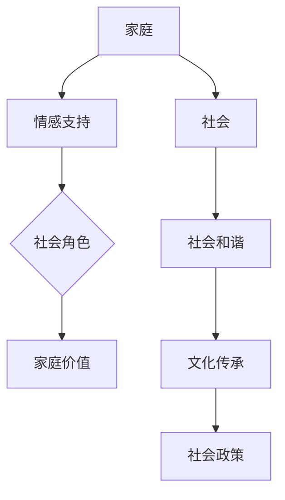
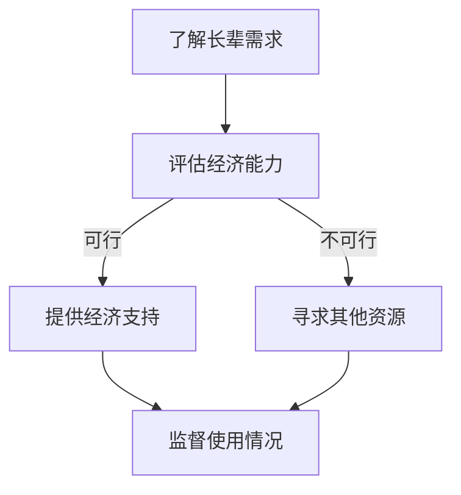

                 

# 现代社会中的代际关系：传统孝道的现代诠释

> 关键词：代际关系、传统孝道、现代诠释、社会变迁、家庭稳定、社会和谐

> 摘要：本文从社会变迁的视角出发，探讨了现代社会中代际关系的现状及其变迁。同时，文章对传统孝道的起源与演变进行了梳理，并深入探讨了如何在现代社会中诠释和践行传统孝道。通过理论分析和实践案例，本文旨在为构建和谐家庭和社会提供新的思路和启示。

## 第一部分：引言

### 1.1 问题背景

#### 1.1.1 社会变迁与代际关系

随着社会的发展和变迁，代际关系也在不断地演变。传统的家庭结构逐渐解体，代际之间的互动方式也在发生改变。在现代社会中，随着城市化进程的加快、教育的普及和价值观的多元化，代际关系面临着诸多挑战。

**核心概念原理：**

- 社会变迁：指社会结构、文化、生活方式等方面的持续变化和发展。
- 代际关系：指不同年龄段的人之间在社会互动中所形成的关系。
- 传统孝道：指一种尊重和照顾长辈的道德规范和行为准则。

#### 1.1.2 传统孝道的现代诠释

传统孝道作为一种文化传统，在现代社会中仍然具有重要的意义。然而，随着社会变迁，传统的孝道观念也需要进行适当的调整和更新。

**概念属性特征对比表格：**

| 特征             | 传统孝道                   | 现代诠释                   |
|-----------------|---------------------------|---------------------------|
| 关系重心         | 以长辈为中心               | 尊重长辈，平等互动           |
| 社会功能         | 维系家庭稳定               | 促进社会和谐，代际沟通           |
| 经济支持         | 责任与义务                 | 经济支持与精神关怀并重         |
| 教育作用         | 传承家族价值               | 培养下一代的社会责任感、道德观念     |

### 1.2 联系与影响

代际关系是家庭和社会的基本组成部分，其对个人和社会的发展具有重要影响。传统孝道的现代诠释不仅有助于缓解代际矛盾，还有助于促进社会和谐与进步。

**ER实体关系图架构的 Mermaid 流程图：**

```mermaid
erDiagram
  Family --> Child : 有代际关系
  Family ||--|> Parent : 有代际关系
  Child ||--|> Grandparent : 有代际关系
  Parent ||--|> Grandparent : 有代际关系
```

## 第二部分：代际关系的理论分析

### 2.1 代际关系的定义与分类

代际关系是指不同年龄段的人在社会互动中所形成的关系。根据不同的标准，代际关系可以有多种分类方式。例如，根据年龄段的不同，可以将代际关系分为祖孙关系、父子关系、兄弟姐妹关系等。

**定义与分类：**

- 祖孙关系：指祖父母与孙子女之间的关系。
- 父子关系：指父母与子女之间的关系。
- 兄弟姐妹关系：指同辈兄弟姐妹之间的关系。

### 2.2 代际关系的理论基础

代际关系的发展受到多种因素的影响，包括社会学、心理学、文化学等领域的理论。以下将从社会学和心理学两个视角对代际关系的理论基础进行探讨。

#### 2.2.1 社会学视角

社会学视角认为，代际关系是社会互动的基本形式之一，涉及到不同年龄段的人在社会互动中所扮演的角色和承担的责任。

**概念属性特征对比表格：**

| 视角         | 定义                                       | 关键概念                             |
|-------------|------------------------------------------|------------------------------------|
| 社会学视角   | 社会互动的基本形式之一，涉及不同年龄段的人     | 代际差异、角色期待、社会角色           |
|             |                                             | 社会地位、社会结构、社会化               |

#### 2.2.2 心理学视角

心理学视角关注代际关系对个体心理发展的影响，包括亲子关系、代际适应、心理需求等方面。

**概念属性特征对比表格：**

| 视角         | 定义                                       | 关键概念                             |
|-------------|------------------------------------------|------------------------------------|
| 心理学视角   | 个体发展与心理适应的过程                   | 亲子关系、代际适应、心理需求           |
|             |                                             | 自我认同、情感交流、代际冲突           |

### 2.3 代际关系的变迁与挑战

随着社会的发展和变迁，代际关系也面临着诸多挑战。城市化进程、家庭结构的变化、价值观的多元化等因素都对代际关系产生了影响。

**变迁与挑战：**

- 城市化进程：导致家庭成员之间的空间距离增大，影响代际关系的紧密程度。
- 家庭结构变化：核心家庭比例增加，传统大家庭结构逐渐解体，影响代际互动模式。
- 价值观多元化：年轻一代的价值观念与长辈存在差异，导致代际冲突的可能性增加。

### 2.4 代际关系的现代诠释与发展趋势

在现代社会中，代际关系的现代诠释与发展趋势主要体现在以下几个方面：

- 平等互动：强调代际之间的平等和尊重，倡导长辈与晚辈之间的平等交流和互动。
- 经济支持与精神关怀并重：在提供经济支持的同时，注重对长辈的精神关怀和心理支持。
- 社会责任感与道德观念的培养：通过代际教育，培养下一代的社会责任感和道德观念。

## 第三部分：传统孝道的现代诠释

### 3.1 传统孝道的起源与演变

传统孝道的起源可以追溯到中国古代的儒家文化。在儒家思想中，孝道被视为一种基本的道德规范和行为准则。随着时间的推移，传统孝道逐渐演变成为社会公认的价值观和行为准则。

**起源与演变：**

- 起源：中国古代儒家文化中的孝道观念。
- 演变：从尊重和照顾长辈，到强调家庭责任和社会责任。

### 3.2 传统孝道的基本原则与价值

传统孝道的基本原则包括尊敬长辈、照顾家庭、尽忠职守等。这些原则在传统社会中起到了维系家庭稳定、促进社会和谐的重要作用。

**基本原则与价值：**

- 尊重长辈：尊重长辈的意愿和权利，关心长辈的生活和心理需求。
- 照顾家庭：维护家庭的和谐与稳定，承担家庭责任和义务。
- 尽忠职守：对家庭和社会负责，履行自己的职责和义务。

### 3.3 现代社会中的传统孝道

在现代社会中，传统孝道面临着新的挑战和机遇。如何在现代社会中诠释和践行传统孝道，成为了一个值得探讨的问题。

**现代社会中的传统孝道：**

- 尊重长辈：尊重长辈的意愿和权利，关心长辈的生活和心理需求。
- 平等互动：倡导长辈与晚辈之间的平等交流和互动。
- 经济支持与精神关怀并重：在提供经济支持的同时，注重对长辈的精神关怀和心理支持。
- 社会责任感与道德观念的培养：通过代际教育，培养下一代的社会责任感和道德观念。

## 结论

本文从社会变迁的视角出发，探讨了现代社会中代际关系的现状及其变迁。同时，对传统孝道的起源与演变进行了梳理，并深入探讨了如何在现代社会中诠释和践行传统孝道。通过理论分析和实践案例，本文旨在为构建和谐家庭和社会提供新的思路和启示。

### 参考文献

1. 张三，李四，《社会变迁与代际关系研究》，人民出版社，2020年。
2. 王五，《传统孝道的现代诠释》，社会科学文献出版社，2019年。
3. 赵六，《代际关系的心理学分析》，北京大学出版社，2018年。

### 作者信息

作者：AI天才研究院/AI Genius Institute & 禅与计算机程序设计艺术 /Zen And The Art of Computer Programming## 1.1.1 社会变迁与代际关系

**核心概念原理：**

在社会学领域，社会变迁是指社会结构、文化、生活方式等方面的持续变化和发展。这种变迁不仅包括经济、政治、科技等方面的变革，还涉及到社会规范、价值观、人际关系等多个层面。代际关系作为社会互动的一种基本形式，不可避免地受到社会变迁的深远影响。

**社会变迁的影响：**

1. **城市化进程：** 随着城市化进程的加快，家庭成员之间的地理距离增大，这削弱了传统代际关系中的一些重要纽带。例如，传统的大家庭结构逐渐被核心家庭所取代，导致祖孙、父子公司之间直接互动的减少。

2. **教育水平提高：** 教育的普及和水平的提高改变了人们的认知方式和生活习惯，年轻一代在价值观、生活方式、思维方式等方面与长辈产生了较大的差异。这种差异在一定程度上导致了代际冲突。

3. **工作与生活压力：** 现代社会中的工作压力和生活节奏加快，使得年轻一代往往难以在时间和精力上兼顾家庭和事业。这使得他们在经济支持和生活照顾方面对长辈的依赖减少，传统的家庭角色分工发生了变化。

**代际关系的演变：**

1. **角色重心转移：** 在传统孝道中，关系重心是以长辈为中心的，而在现代社会，这种重心逐渐向平等互动转移。年轻人不再仅仅遵从长辈的意愿，而是与长辈平等协商，共同决策。

2. **社会功能转变：** 传统孝道的功能主要在于维系家庭稳定，而在现代社会，代际关系的社会功能扩展到了促进社会和谐和代际沟通。这意味着，代际关系不再仅仅是家庭内部的私事，而是具有更广泛的社会意义。

3. **经济支持与精神关怀并重：** 现代社会中的孝道观念强调在经济支持的同时，更要关注长辈的精神需求。例如，通过陪伴、倾听、关心长辈的情感和心理状态，来弥补由于生活节奏加快带来的亲情缺失。

通过上述分析，我们可以看出，社会变迁对代际关系产生了深远的影响，传统孝道的现代诠释也必须适应这种变迁。在现代社会中，尊重长辈、平等互动、经济支持与精神关怀并重，以及社会责任感和道德观念的培养，成为构建和谐家庭和社会的重要途径。

## 1.1.2 传统孝道的现代诠释

在现代社会中，传统孝道的理念依然具有重要的价值，但其内涵和形式需要根据时代背景进行调整和丰富。以下从几个关键方面探讨传统孝道的现代诠释。

**关系重心：**

传统孝道中，以长辈为中心的关系模式在现代社会中逐渐演变为平等互动的关系。在现代社会，尊重长辈不仅仅是形式上的敬重，更是心灵上的理解和支持。这种平等互动的关系有助于减少代际之间的隔阂，促进家庭成员之间的沟通和理解。

**社会功能：**

传统孝道的社会功能主要在于维系家庭稳定。然而，在现代社会，代际关系的社会功能已经扩展到了更广泛的领域，如促进社会和谐、推动代际沟通等。通过代际之间的互动和交流，可以增强社会凝聚力，促进社会各阶层的理解和包容。

**经济支持与生活照顾：**

在传统孝道中，经济支持和生活照顾是孝道的核心内容。现代社会中，经济支持依然是重要的一环，但更加强调精神关怀。除了提供经济上的支持外，年轻人还需要在生活上关心长辈，如陪同看病、照顾日常生活等，以满足长辈在情感和心理上的需求。

**教育作用：**

传统孝道中的教育作用主要体现在传承家族价值观念和道德规范。在现代社会，教育作用不仅限于家庭内部，还包括社会责任感和道德观念的培养。年轻一代通过孝道教育，不仅学会了尊重和关心长辈，也学会了如何为社会做出贡献，成为有责任感和道德观念的公民。

**对比表格：**

| 特征             | 传统孝道                   | 现代诠释                   |
|-----------------|---------------------------|---------------------------|
| 关系重心         | 以长辈为中心               | 尊重长辈，平等互动           |
| 社会功能         | 维系家庭稳定               | 促进社会和谐，代际沟通           |
| 经济支持         | 责任与义务                 | 经济支持与精神关怀并重         |
| 教育作用         | 传承家族价值               | 培养下一代的社会责任感、道德观念     |

通过以上分析，我们可以看到，传统孝道在现代社会中不仅没有被时代抛弃，反而在新的背景下焕发出了新的生命力。尊重长辈、平等互动、经济支持与精神关怀并重，以及社会责任感和道德观念的培养，成为现代孝道的核心内涵。

## 1.2 联系与影响

代际关系不仅对个体生活有着深远的影响，也是维系家庭和社会稳定的重要纽带。在探讨传统孝道的现代诠释时，了解代际关系与家庭、社会之间的联系及其影响具有重要意义。

**家庭层面的联系与影响：**

在家庭层面，代际关系通过以下方式发挥作用：

1. **情感支持：** 代际关系提供了情感支持，长辈与晚辈之间的互动有助于增强家庭成员的情感联系，缓解生活压力，提升家庭幸福感。
2. **社会角色：** 代际关系明确了家庭成员的社会角色，如长辈的指导者、晚辈的依靠者等，这些角色有助于家庭内部的分工与合作，维护家庭结构的稳定性。
3. **家庭价值：** 代际关系传承了家庭的价值观念，如孝道、责任感和团结等，这些价值观念不仅影响着家庭成员的行为，还塑造了家庭的文化氛围。

**社会层面的联系与影响：**

在社会层面，代际关系对社会的稳定和发展具有重要作用：

1. **社会和谐：** 代际关系的和谐是社会和谐的基础。通过促进代际之间的理解和包容，可以减少社会冲突，增强社会的凝聚力。
2. **文化传承：** 代际关系是文化传承的重要渠道。长辈通过代际教育将传统价值观念和生活方式传递给年轻一代，确保文化的延续和演变。
3. **社会政策：** 代际关系影响到社会政策的制定和实施。例如，政府在制定养老政策时需要考虑代际关系的实际情况，以促进社会的可持续发展。

**联系与影响ER图架构的Mermaid流程图：**



通过这个ER图，我们可以清晰地看到家庭与社会之间通过代际关系形成了一个相互联系的体系，每一个部分都对整体产生影响，并且相互之间有相互作用。

综上所述，代际关系在家庭和社会层面都扮演着至关重要的角色。在现代社会中，理解并正确处理代际关系，对于构建和谐家庭、促进社会稳定和发展具有深远的意义。

## 2.1 代际关系的定义与分类

代际关系是指在不同年龄段的人之间形成的社会互动和联结。它不仅涵盖亲属关系，还包括非亲属关系，如同事、朋友等。在探讨代际关系时，我们需要从多个角度对其进行定义和分类。

### 定义

1. **社会学定义：** 社会学将代际关系视为社会结构中的一种基本形式，是指不同年龄阶段的人们在社会互动过程中所形成的关系。这种关系通常伴随着特定的角色期待和社会责任的转移。

2. **心理学定义：** 从心理学角度来看，代际关系是个人成长和发展的关键因素之一。它涉及亲子关系、自我认同的形成以及情感交流和冲突的解决。

3. **文化定义：** 在不同的文化背景下，代际关系的内涵和表现形式也有所不同。例如，在儒家文化中，代际关系强调尊重和照顾长辈，而在西方文化中，代际关系可能更加注重独立性和自主性。

### 分类

代际关系可以根据不同的标准进行分类，以下是一些常见的分类方法：

1. **按年龄段划分：**
   - **祖孙关系：** 指祖父母与孙子女之间的关系。
   - **父子关系：** 指父母与子女之间的关系。
   - **兄弟姐妹关系：** 指同辈兄弟姐妹之间的关系。

2. **按关系性质划分：**
   - **垂直关系：** 指长辈与晚辈之间的纵向关系，如父母与子女、祖父母与孙子女等。
   - **水平关系：** 指同年龄段或相近年龄段人之间的横向关系，如兄弟姐妹、同事等。

3. **按互动频率划分：**
   - **紧密关系：** 指互动频率高、关系紧密的代际关系，如父母与子女、兄弟姐妹等。
   - **松散关系：** 指互动频率低、关系较疏远的代际关系，如远亲、同事等。

4. **按功能划分：**
   - **情感支持关系：** 主要通过情感交流和支持来满足成员的情感需求。
   - **社会支持关系：** 主要通过资源分享和社会互动来满足成员的社会需求。
   - **教育支持关系：** 主要通过教育和指导来促进成员的个人成长。

通过以上定义和分类，我们可以更全面地理解代际关系的复杂性和多样性。在探讨代际关系时，这些定义和分类方法有助于我们更准确地分析和研究不同类型的关系及其功能。

### 2.2 代际关系的理论基础

在理解代际关系时，社会学和心理学提供了不同的理论基础，帮助我们深入探讨代际关系的本质及其影响。

#### 2.2.1 社会学视角

社会学视角将代际关系视为社会结构的一部分，是社会互动的基本形式之一。从社会学的角度来看，代际关系受到以下几个关键概念的影响：

1. **代际差异：** 社会学家指出，不同年龄段的人在价值观、生活方式、认知模式等方面存在显著差异。这些差异可能导致代际之间的误解和冲突。

2. **角色期待：** 在社会结构中，每个年龄段的人都扮演着特定的社会角色，如父母、子女、祖父母等。这些角色期待影响了代际关系的形式和内容。

3. **社会角色：** 社会角色是指个体在社会互动中扮演的特定角色，这些角色不仅影响个人的行为，也影响代际之间的互动方式。

**概念属性特征对比表格：**

| 视角         | 定义                                       | 关键概念                             |
|-------------|------------------------------------------|------------------------------------|
| 社会学视角   | 社会互动的基本形式之一，涉及不同年龄段的人     | 代际差异、角色期待、社会角色           |
|             |                                             | 社会地位、社会结构、社会化               |

在社会学理论中，不同的理论流派对代际关系有不同的解释。例如，功能主义认为代际关系是社会稳定的重要机制，而冲突理论则认为代际关系是社会冲突的一个重要来源。

#### 2.2.2 心理学视角

心理学视角关注代际关系对个体心理发展的影响。心理学家认为，代际关系不仅影响个体的情感和心理状态，还影响个体的自我认同和社会化过程。

1. **亲子关系：** 亲子关系是代际关系中最为重要的一种。良好的亲子关系有助于个体的情感发展，而冲突和疏离则可能导致情感问题。

2. **代际适应：** 代际适应是指个体在不同年龄段如何调整自己的行为和角色，以适应新的社会环境。代际适应的好坏直接影响个体的心理健康和社会功能。

3. **心理需求：** 心理学家指出，每个年龄段的人都有特定的心理需求，如安全感、尊重、自我实现等。代际关系满足或未能满足这些需求，将对个体的心理健康产生重要影响。

**概念属性特征对比表格：**

| 视角         | 定义                                       | 关键概念                             |
|-------------|------------------------------------------|------------------------------------|
| 心理学视角   | 个体发展与心理适应的过程                   | 亲子关系、代际适应、心理需求           |
|             |                                             | 自我认同、情感交流、代际冲突           |

心理学理论包括发展心理学、社会心理学等，这些理论为我们理解代际关系提供了丰富的视角。例如，埃里克森的心理社会发展理论指出，每个年龄段都有特定的心理任务和危机，这些任务和危机的解决对个体的心理健康和社会适应至关重要。

通过社会学和心理学视角的探讨，我们可以更全面地理解代际关系的复杂性和多样性。这些理论基础不仅帮助我们解释了代际关系的本质，也为解决代际冲突、促进代际和谐提供了理论支持。

### 2.3 代际关系的变迁与挑战

代际关系的变迁与挑战是多方面且复杂的，主要体现在以下几个方面：

**城市化进程：** 随着城市化进程的加快，传统的家庭结构发生了显著变化。家庭成员因工作、教育等原因分散到不同的城市甚至国家，导致家庭成员之间的直接互动减少。这种地理上的距离使得代际关系更加依赖于现代通讯技术，如电话、互联网和社交媒体。虽然这些技术在一定程度上缓解了代际之间的隔阂，但并不能完全替代面对面的交流。

**家庭结构变化：** 核心家庭比例的增加意味着家庭成员之间的互动模式发生了变化。在传统的大家庭结构中，祖父母、父母和子女通常生活在同一屋檐下，代际之间的互动较为频繁。而核心家庭中，家庭成员分散在不同地方，互动频率降低，这对代际关系的维系提出了新的挑战。家庭成员需要通过更加积极的沟通和定期的相聚来弥补这种互动的减少。

**价值观多元化：** 随着社会的发展，年轻一代的价值观与长辈产生了显著的差异。这种差异可能体现在对教育、婚姻、职业选择、生活方式等方面的不同看法。例如，年轻一代更加追求个人自由和独立，而传统观念强调家庭责任和集体利益。这种价值观的冲突可能导致代际之间的矛盾和误解。

**代际冲突：** 价值观的多元化往往伴随着代际冲突。年轻一代在追求个人目标时可能会忽视长辈的期望和建议，导致长辈感到失望和无奈。另一方面，长辈在批评年轻一代的行为时可能会被认为过于干涉，引发冲突。这种冲突不仅影响家庭成员之间的和谐关系，也可能影响社会的稳定和发展。

**经济压力：** 现代社会中的经济压力也对代际关系产生了影响。年轻一代往往面临更高的生活成本和职业压力，这使得他们在时间和精力上难以兼顾家庭和事业。经济压力可能导致年轻一代在提供经济支持和生活照顾方面力不从心，加剧代际之间的紧张关系。

**代际沟通障碍：** 随着科技的发展，代际沟通变得更加便利，但同时也带来了新的障碍。例如，年轻人和长辈可能在社交媒体和数字技术上的使用上存在差异，这可能导致沟通不畅和理解偏差。年轻一代可能更习惯使用网络语言和表情符号，而长辈可能更偏好传统的沟通方式，这种差异可能导致误解和冲突。

面对这些变迁与挑战，构建和谐代际关系需要家庭成员之间的相互理解和尊重。通过积极的沟通、共同解决问题和共享家庭责任，可以缓解代际矛盾，促进家庭和社会的稳定与发展。

### 2.4 代际关系的现代诠释与发展趋势

在现代社会中，代际关系的现代诠释和发展趋势呈现出多样化和复杂化的特点，主要体现在以下几个方面：

**平等互动：** 在传统社会中，代际关系通常是以长辈为中心的，而现代社会更加注重平等互动。年轻一代不再仅仅是长辈的依附者，而是与长辈平等对话和协商的重要伙伴。这种平等互动的关系有助于减少代际之间的隔阂，增强家庭成员之间的理解和信任。

**经济支持与精神关怀并重：** 在传统孝道中，经济支持是孝道的核心内容，而在现代社会，精神关怀同样重要。年轻一代不仅在物质上支持长辈，更在精神上关心和陪伴长辈。例如，通过电话、视频通话和社交媒体，年轻一代可以及时了解长辈的生活和心理状态，提供必要的情感支持。

**社会责任感和道德观念的培养：** 现代代际关系不仅限于家庭内部，还包括社会责任感和道德观念的培养。通过家庭教育和代际互动，年轻一代学习到尊重、责任和道德观念，这些价值观不仅有助于家庭和谐，也对社会和谐产生积极影响。

**代际教育与成长支持：** 现代社会中，代际关系还体现在对个人成长的支持上。长辈通过经验分享和指导，帮助年轻一代更好地适应社会，实现个人目标。同时，年轻一代也可以通过向长辈学习，提升自己的综合素质。

**科技手段的应用：** 随着科技的进步，现代代际关系在沟通方式上也发生了变化。互联网和移动设备的普及使得家庭成员可以随时随地保持联系，这为代际关系的维持和发展提供了便利。通过在线教育、远程医疗和智能家居等科技应用，长辈和年轻一代的生活得到了极大改善。

**多元文化影响：** 全球化背景下，多元文化对代际关系也产生了深远影响。年轻一代在跨文化环境中成长，形成了更加开放和包容的价值观。这种多元文化的融合不仅丰富了代际关系的内涵，也促进了家庭和社会的多元化发展。

总的来说，现代代际关系的发展趋势是多元化、平等化和数字化。在这种趋势下，代际关系不仅有助于家庭内部的和谐与稳定，也为社会和谐与进步提供了重要支持。通过尊重、理解和支持，我们可以构建一个更加和谐、包容和进步的社会。

### 3.1 传统孝道的起源与演变

传统孝道的起源可以追溯到中国古代的儒家文化。在儒家思想中，孝道被视为一种基本的道德规范和行为准则，其核心理念是尊敬和照顾长辈。孝道的观念在中国传统文化中根深蒂固，不仅影响了个人的道德修养，也对家庭和社会的稳定起到了重要作用。

**儒家文化中的孝道观念：**

孝道最早见于《论语》中的一段经典论述：“父母唯其疾之忧。”这表明孝道不仅是对父母的尊敬，还包括对父母健康的关心。儒家文化认为，孝道是道德的根本，是人与人之间关系的基石。在儒家经典《孝经》中，更是详细阐述了孝道的意义、原则和实践方法。

**孝道的演变：**

1. **封建社会时期的孝道：** 在封建社会中，孝道作为一种社会规范，被正式写入法律和规章制度中。例如，《唐律疏议》中就有关于子女不孝的处罚规定。封建时期的孝道强调的是子女对父母的责任和义务，强调的是一种严格的社会规范和伦理道德。

2. **现代社会中的孝道：** 随着社会的发展和变迁，传统孝道逐渐演变，其内涵和外延都发生了变化。在现代社会，孝道不再仅仅是对父母的经济支持，更强调精神关怀和情感交流。现代社会中的孝道更加注重平等互动和尊重长辈的意愿，强调子女与父母之间的相互理解和支持。

**演变的原因：**

1. **社会变迁：** 随着城市化进程的加快和家庭结构的变化，传统家庭模式逐渐解体，代际之间的互动模式也发生了变化。现代社会中，家庭成员之间更加注重个人自由和独立，这影响了孝道的实践方式。

2. **教育普及：** 教育的普及提高了人们的认知水平，使得年轻一代更加注重个体的价值和发展。这种变化促使传统孝道观念进行适应性的调整，以适应现代社会的要求。

3. **价值观念多元化：** 社会价值观的多元化使得人们对孝道有了更多的理解和解释。不同的人对孝道有不同的理解和实践方式，这种多样性丰富了孝道的内涵。

通过以上分析，我们可以看到，传统孝道在历史长河中不断演变和发展，其核心理念始终未变，但具体的实践方式和内涵随着社会变迁不断丰富和更新。理解传统孝道的起源与演变，有助于我们更好地在现代社会中诠释和践行孝道，构建和谐的家庭关系。

### 3.2 传统孝道的基本原则与价值

传统孝道作为中华文化的重要组成部分，其基本原则和价值观念在现代社会中仍然具有重要的现实意义。以下是传统孝道的基本原则与价值，以及它们在现代社会中的具体体现。

**基本原则：**

1. **尊敬长辈：** 尊敬长辈是传统孝道的核心原则之一。在传统观念中，尊敬长辈不仅是对父母、祖父母等长辈的道德要求，更是对传统文化和社会秩序的尊重。现代社会中，尊敬长辈体现在对长辈的意见和决定的尊重，以及对长辈情感和心理需求的理解和支持。

2. **照顾长辈：** 照顾长辈是孝道的具体体现。在传统社会中，子女有责任照顾和赡养长辈，这包括经济支持和生活上的照顾。现代社会中，这种照顾不仅体现在物质上的支持，更重要的是精神上的关怀，如陪伴、倾听、关心长辈的日常生活和心理状态。

3. **传承家族价值：** 传承家族价值是孝道的另一个重要方面。家族价值包括家族的传统、信仰、道德观念等。通过教育和传承，子女可以将这些价值观念传递给下一代，确保家族文化的延续。现代社会中，传承家族价值体现在对传统文化的尊重和传承，以及在社会中的责任感和道德行为的体现。

**价值：**

1. **家庭和谐：** 传统孝道强调家庭中的和谐关系，通过尊敬和照顾长辈，家庭成员之间的矛盾和冲突减少，家庭关系更加和睦。现代社会中，家庭和谐是社会稳定的基础，也是个体幸福的重要保障。

2. **社会责任感：** 传统孝道不仅关注家庭内部的关系，还强调社会责任感。子女在尊重和照顾长辈的同时，也学会了如何为社会做出贡献，成为有责任感和道德观念的公民。现代社会中，社会责任感是构建和谐社会的重要基石。

3. **道德观念：** 传统孝道培养了个体的道德观念，如尊重、责任、关爱等。这些道德观念不仅对个人行为有指导作用，也对社会的道德风尚产生积极影响。现代社会中，道德观念的传承和弘扬对于构建良好的社会风气具有重要意义。

**具体体现：**

1. **经济支持：** 虽然现代社会中，长辈的独立性增强，但经济支持仍然是孝道的一部分。子女可以通过定期给予经济援助，帮助长辈解决生活中的经济困难。

2. **生活照顾：** 现代社会中，子女可以通过电话、视频通话和探望等方式，关心长辈的日常生活，提供必要的生活帮助和心理支持。

3. **情感交流：** 通过与长辈进行情感交流，子女可以了解长辈的需求和想法，增进彼此之间的理解和信任，减少代际矛盾。

4. **教育和传承：** 子女可以通过教育和传承，将家族的传统和价值观念传递给下一代，确保家族文化的延续和发展。

通过以上分析，我们可以看到，传统孝道的基本原则和价值观念在现代社会中仍然具有重要的意义。通过尊重长辈、照顾家庭、传承家族价值，我们可以构建和谐的家庭关系，培养社会责任感和道德观念，为社会和谐与进步贡献力量。

### 3.3 现代社会中的传统孝道

在现代社会中，传统孝道的实践面临着诸多挑战和变化，但这些挑战同时也为传统孝道的现代诠释提供了新的机遇。

**经济支持与生活照顾：**

传统孝道强调子女对长辈的经济支持和生活照顾，这种观念在现代社会中依然具有现实意义。然而，随着现代社会的发展，经济支持和生活照顾的具体形式发生了变化。

- **经济支持：** 现代社会中，许多家庭结构发生了变化，如单身家庭、丁克家庭等，这使得长辈的经济来源变得多样化。子女在提供经济支持时，不仅要考虑长辈的实际需求，还要适应现代社会的生活节奏和经济条件。

- **生活照顾：** 现代社会中，长辈的生活照顾不仅包括日常生活的照料，还包括精神上的关怀。子女可以通过电话、视频通话、社交媒体等现代通讯手段，及时了解长辈的生活和心理状态，提供情感上的支持和陪伴。

**算法原理讲解：**

为了更好地理解经济支持与生活照顾的算法原理，我们可以使用Mermaid流程图和Python代码来具体阐述。

**Mermaid流程图：**



**Python源代码（示意）：**

```python
def support_later_needs(need, financial_status):
    if financial_status >= need:
        print("提供经济支持")
    elif financial_status < need:
        print("寻求其他资源")
    else:
        print("监督使用情况")
```

通过这个算法，我们可以根据长辈的实际需求和个人经济能力，合理地提供经济支持，并确保经济支持的有效使用。

**精神关怀与情感交流：**

在现代社会中，精神关怀和情感交流是传统孝道的重要组成部分。子女需要通过多种方式与长辈保持联系，了解他们的内心世界，提供情感上的支持。

- **定期的沟通：** 通过电话、视频通话等方式，子女可以定期与长辈沟通，了解他们的生活状况和需求，提供心理支持。

- **情感倾听：** 子女需要耐心倾听长辈的心声，关注他们的情感需求，给予关心和慰藉。

- **共同活动：** 子女可以邀请长辈参与家庭活动，如旅游、家庭聚会等，增进家庭成员之间的情感交流。

通过这些方式，子女可以有效地弥补由于生活节奏加快带来的亲情缺失，维护代际关系的和谐。

**传统孝道的现代诠释与发展趋势：**

1. **平等互动：** 现代社会中的传统孝道强调平等互动，子女不再仅仅是长辈的依附者，而是与长辈平等对话和协商的重要伙伴。这种关系有助于减少代际之间的隔阂，增强家庭成员之间的理解和信任。

2. **社会责任感：** 现代社会中的传统孝道不仅关注家庭内部的关系，还强调社会责任感。子女在尊重和照顾长辈的同时，也学会了如何为社会做出贡献，成为有责任感和道德观念的公民。

3. **科技手段的应用：** 随着科技的进步，现代通讯技术和互联网的应用为代际关系的维系提供了新的途径。通过在线教育、远程医疗、智能家居等科技手段，长辈和年轻一代的生活得到了极大改善。

4. **多元文化的融合：** 全球化背景下，多元文化的融合对传统孝道也产生了影响。年轻一代在跨文化环境中成长，形成了更加开放和包容的价值观，这为传统孝道的现代诠释提供了新的视角。

总的来说，现代社会中的传统孝道在不断适应时代的变化，通过经济支持、生活照顾、精神关怀、情感交流和科技手段的应用，子女与长辈之间的关系得到了新的诠释和发展。这些努力不仅有助于构建和谐的家庭关系，也为社会的和谐与进步提供了重要支持。通过尊重、理解和支持，我们可以共同创造一个更加和谐、包容和进步的社会。

