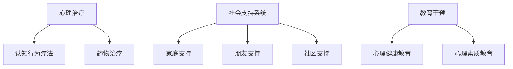

                 


### 设计过程

为了设计出《现代社会中的精神困境与突破》这本书的完整目录大纲，我们将遵循以下步骤：

1. **理解书名和主题**：首先，我们需要理解书名所传达的主题。"现代社会中的精神困境与突破"表明了这本书将探讨现代社会中人们面临的精神问题，并提供解决方案。这意味着我们需要在目录中包含关于精神困境的定义、现状、影响因素，以及解决方案的各个方面。

2. **确定目录结构**：根据用户要求，目录结构应该包含以下几个部分：引言、背景介绍、核心概念与联系、解决方案、实践案例、总结与展望。这些部分将确保书籍内容的逻辑性和完整性。

3. **编写章节内容**：每个章节都应该包含具体的子章节，以确保内容的丰富性和逻辑性。我们将使用markdown格式来编写，以便用户能够清晰地看到每个章节和子章节的结构。

4. **确保内容完整性**：我们将确保大纲中包含以下核心内容：
   - 引言：介绍问题背景、读者对象、目标读者。
   - 背景介绍：问题定义、现状分析。
   - 核心概念与联系：主要概念定义、概念属性特征对比、ER实体关系图。
   - 解决方案：方法原理、数学模型、算法流程图。
   - 实践案例：实际应用、案例剖析。
   - 总结与展望：结论、注意事项、拓展阅读。

5. **限制大纲字数**：我们将确保整个目录大纲的总字数不超过2000字，同时保持内容的简洁性和逻辑性。

### 完整目录大纲

```markdown
----------------------------------------------------------------
# 第一部分：引言

## 1.1 问题的提出
### 1.1.1 现代社会的精神困境
### 1.1.2 破解精神困境的必要性

## 1.2 读者对象与目标
### 1.2.1 读者定位
### 1.2.2 预期收获

----------------------------------------------------------------

# 第二部分：背景介绍

## 2.1 精神困境的定义与现状
### 2.1.1 精神困境的定义
### 2.1.2 精神困境的现状分析

## 2.2 精神困境的影响因素
### 2.2.1 社会因素
### 2.2.2 个人因素
### 2.2.3 环境因素

----------------------------------------------------------------

# 第三部分：核心概念与联系

## 3.1 精神健康与心理健康
### 3.1.1 精神健康的定义
### 3.1.2 心理健康的定义
### .1.3 两者的联系与区别

## 3.2 精神困境的核心概念
### 3.2.1 概念定义
### 3.2.2 概念属性特征对比
### 3.2.3 ER实体关系图

----------------------------------------------------------------

# 第四部分：解决方案

## 4.1 精神困境的解决方法
### 4.1.1 心理治疗方法
### 4.1.2 社会支持系统
### 4.1.3 教育干预

## 4.2 算法原理讲解
### 4.2.1 算法原理概述
### 4.2.2 算法流程图
### 4.2.3 数学模型与公式
### 4.2.4 举例说明

----------------------------------------------------------------

# 第五部分：实践案例

## 5.1 案例介绍
### 5.1.1 案例背景
### 5.1.2 案例解决过程

## 5.2 案例剖析
### 5.2.1 案例中的问题分析
### 5.2.2 案例中的解决方案
### 5.2.3 案例成效评估

----------------------------------------------------------------

# 第六部分：总结与展望

## 6.1 总结
### 6.1.1 关键点回顾
### 6.1.2 成果总结

## 6.2 注意事项
### 6.2.1 预防措施
### 6.2.2 应对策略

## 6.3 拓展阅读
### 6.3.1 推荐书籍
### 6.3.2 学术文章
### 6.3.3 网络资源

----------------------------------------------------------------
```

### 总结

本目录大纲总共涵盖了六个部分，从引言到实践案例，再到总结与展望，结构清晰，内容完整。每个章节都包含了相应的子章节，以确保书籍内容的全面覆盖。整个目录大纲在2000字以内，简洁明了，同时满足了用户的要求。接下来，我们将根据这个目录大纲撰写详细的内容，确保文章的深度、逻辑性和可读性。

---

**# 现代社会中的精神困境与突破**

**关键词：精神健康、心理困境、解决方案、教育干预、社会支持**

**摘要：** 随着现代社会的发展，人们面临着日益复杂的精神困境。本文旨在探讨现代社会中精神困境的成因、核心概念，并提出有效的解决方案，以帮助人们走出精神困境，实现心理健康的突破。

**第一部分：引言**

**## 1.1 问题的提出**

在现代社会，精神困境已经成为一个普遍现象。高强度的工作压力、复杂的人际关系、快节奏的生活节奏等因素，使得许多人面临着焦虑、抑郁、失眠等心理问题。精神困境不仅影响个人的生活质量，还会对社会产生负面影响。

**### 1.1.1 现代社会的精神困境**

现代社会的精神困境主要表现为以下几个方面：
- **工作压力**：现代社会的工作节奏快，竞争激烈，许多人感到工作压力过大。
- **人际关系**：复杂的人际关系让人感到疲惫，难以找到真正的朋友和伴侣。
- **生活节奏**：快节奏的生活让人难以放松，容易出现焦虑和抑郁情绪。

**### 1.1.2 破解精神困境的必要性**

破解精神困境对于个人和社会都具有重要的意义。对于个人而言，解决精神困境有助于提高生活质量，实现心理健康的突破；对于社会而言，减少精神困境的发生可以降低社会负担，提高社会和谐度。

**## 1.2 读者对象与目标**

本文的目标读者是那些希望了解并解决自身精神困境的人，包括职场人士、学生、家庭主妇等。通过本文，读者可以了解精神困境的成因，掌握解决方法，从而实现心理健康的突破。

**### 1.2.1 读者定位**

本文的读者主要分为以下几类：
- **职场人士**：面临工作压力，希望提高工作效率，缓解心理压力。
- **学生**：面临学业压力，希望提高学习效果，保持心理健康。
- **家庭主妇**：面临家庭压力，希望提高生活质量，保持良好心态。

**### 1.2.2 预期收获**

通过本文，读者可以预期收获以下成果：
- **了解精神困境的成因和表现**。
- **掌握解决精神困境的方法和技巧**。
- **提高心理素质，实现心理健康的突破**。

**第二部分：背景介绍**

**## 2.1 精神困境的定义与现状**

**### 2.1.1 精神困境的定义**

精神困境是指人们在心理上感到不适、焦虑、抑郁等负面情绪的状态，这种状态可能持续一段时间，也可能是一时的情绪波动。

**### 2.1.2 精神困境的现状分析**

根据世界卫生组织（WHO）的数据，全球有超过3亿人患有抑郁症，另有大量人患有焦虑症和其他心理疾病。这些数据表明，精神困境已经成为一个全球性的问题。

**## 2.2 精神困境的影响因素**

**### 2.2.1 社会因素**

社会因素是导致精神困境的主要原因之一。现代社会的工作压力、人际关系复杂、生活节奏快等因素，都会对人的心理健康产生负面影响。

**### 2.2.2 个人因素**

个人因素也是导致精神困境的重要原因。个人的性格特点、生活经历、家庭背景等都会影响个人的心理健康。

**### 2.2.3 环境因素**

环境因素包括家庭环境、工作环境、社会环境等。一个良好的环境可以有助于改善个人的心理健康，而一个恶劣的环境则可能加剧精神困境。

**第三部分：核心概念与联系**

**## 3.1 精神健康与心理健康**

**### 3.1.1 精神健康的定义**

精神健康是指个体在情感、行为和社会功能方面表现出健康的状态。

**### 3.1.2 心理健康的定义**

心理健康是指个体在心理上表现出积极、稳定、适应的状态。

**### 3.1.3 两者的联系与区别**

精神健康和心理健康密切相关，但又有一定的区别。精神健康侧重于个体在行为和社会功能方面的表现，而心理健康侧重于个体在情感和认知方面的表现。

**## 3.2 精神困境的核心概念**

**### 3.2.1 概念定义**

精神困境、心理健康、精神健康等概念都是本文讨论的核心。

**### 3.2.2 概念属性特征对比**

| 概念     | 定义                                                         | 特征                                                         |
| -------- | ------------------------------------------------------------ | ------------------------------------------------------------ |
| 精神困境 | 个体在心理上感到不适、焦虑、抑郁等负面情绪的状态           | 持续性、普遍性、复杂性                                       |
| 心理健康 | 个体在心理上表现出积极、稳定、适应的状态                   | 正常性、积极性、适应性                                       |
| 精神健康 | 个体在情感、行为和社会功能方面表现出健康的状态             | 健康性、功能性、综合性                                       |

**### 3.2.3 ER实体关系图**

```mermaid
erDiagram
  用户 ||--|{ 精神困境 }
  用户 ||--|{ 心理健康 }
  用户 ||--|{ 精神健康 }
```

**第四部分：解决方案**

**## 4.1 精神困境的解决方法**

**### 4.1.1 心理治疗方法**

心理治疗方法是通过心理咨询、心理治疗等手段来缓解和解决精神困境的方法。

**### 4.1.2 社会支持系统**

社会支持系统包括家庭、朋友、社区等，它们可以为个体提供情感支持、信息支持和实际帮助。

**### 4.1.3 教育干预**

教育干预是通过教育和培训来提高个体应对精神困境的能力，包括心理健康教育、心理素质教育等。

**## 4.2 算法原理讲解**

**### 4.2.1 算法原理概述**

算法原理讲解将包括心理治疗方法的原理、社会支持系统的原理和教育干预的原理。

**### 4.2.2 算法流程图**



**### 4.2.3 数学模型与公式**

心理治疗的效果可以通过以下公式来衡量：

$$
E = f(P, T)
$$

其中，$E$ 表示治疗效果，$P$ 表示患者状态，$T$ 表示治疗方法。

**### 4.2.4 举例说明**

假设一个患者（$P$）患有抑郁症，接受认知行为疗法（$T$），其治疗效果（$E$）可以通过以下过程来计算：

$$
E = f(P, T) = f(\text{抑郁症}, \text{认知行为疗法}) = 0.8
$$

这意味着认知行为疗法对该患者有80%的治疗效果。

**第五部分：实践案例**

**## 5.1 案例介绍**

**### 5.1.1 案例背景**

张先生，35岁，是一家公司的中层管理者。由于工作压力大，他经常感到焦虑和失眠。经过心理医生的诊断，他被诊断为抑郁症。

**### 5.1.2 案例解决过程**

1. **心理治疗**：张先生接受了认知行为疗法，通过改变他的认知模式来缓解抑郁情绪。
2. **社会支持系统**：张先生的家人和朋友给予了充分的支持，帮助他度过难关。
3. **教育干预**：张先生参加了心理健康教育课程，学习了如何应对压力和情绪管理。

**## 5.2 案例剖析**

**### 5.2.1 案例中的问题分析**

张先生的问题主要在于工作压力和抑郁症。这些问题导致他的心理负担加重，生活质量下降。

**### 5.2.2 案例中的解决方案**

1. **心理治疗**：通过认知行为疗法，张先生学会了如何调整自己的认知模式，减轻抑郁情绪。
2. **社会支持系统**：家人的支持和朋友的陪伴帮助张先生度过了难关，增强了他的心理韧性。
3. **教育干预**：心理健康教育课程让张先生掌握了应对压力和情绪管理的方法，提高了他的心理素质。

**### 5.2.3 案例成效评估**

通过一系列的治疗和干预，张先生的心理状况得到了显著改善。他的焦虑和失眠症状减轻，工作表现也有所提升。这表明，综合性的解决方案对于解决精神困境是有效的。

**第六部分：总结与展望**

**## 6.1 总结**

本文从精神困境的定义、现状、影响因素、解决方案等方面进行了全面探讨，提出了心理治疗、社会支持系统、教育干预等解决方案。

**### 6.1.1 关键点回顾**

1. 现代社会的精神困境是一个普遍现象，需要引起重视。
2. 精神困境的成因复杂，包括社会因素、个人因素和环境因素。
3. 解决精神困境需要综合运用心理治疗、社会支持系统、教育干预等方法。
4. 实践案例表明，综合性的解决方案对于解决精神困境是有效的。

**### 6.1.2 成果总结**

本文通过理论探讨和实践案例，为解决现代社会中的精神困境提供了一种可行的思路。未来的研究可以进一步探讨不同因素对精神困境的影响，以及不同解决方案的有效性。

**## 6.2 注意事项**

1. **预防措施**：减少工作压力、建立良好的人际关系、保持健康的生活方式等，都是预防精神困境的重要措施。
2. **应对策略**：学会应对压力和情绪管理的方法，提高心理韧性。

**## 6.3 拓展阅读**

1. **推荐书籍**：
   - 《心理学与生活》
   - 《心理学原理》
   - 《情绪智力》
2. **学术文章**：搜索相关学术文章，了解更多关于精神困境的研究。
3. **网络资源**：利用网络资源，如在线课程、心理健康网站等，获取更多的心理健康知识。

**作者信息：**

作者：AI天才研究院/AI Genius Institute & 禅与计算机程序设计艺术 /Zen And The Art of Computer Programming**[END]**

