                 

# 现代禅意生活：在都市中寻找内心的宁静

> 关键词：现代禅意生活、都市宁静、心灵平衡、生活方式、生活哲学

> 摘要：在现代快节奏的生活中，人们面临着前所未有的压力和焦虑。本文探讨了现代禅意生活的概念、背景、实践方法及其在个人生活和社会层面的影响，旨在帮助读者在都市生活中找到内心的宁静与平衡。

## 第一部分：现代禅意生活背景介绍

### 第1章：现代禅意生活的崛起

#### 1.1 现代社会的压力与寻找内心宁静的需求

##### 1.1.1 现代社会压力的表现
现代社会压力的表现形式多样，包括工作压力、生活压力、社交压力等。据世界卫生组织（WHO）统计，心理问题已成为全球主要的健康问题之一，包括焦虑症、抑郁症等。

##### 1.1.2 心灵宁静的价值
心灵宁静不仅有助于缓解压力，还能提升生活质量。研究表明，拥有宁静的心灵有助于提高创造力和决策能力，增强免疫力，从而促进身心健康。

#### 1.2 禅意生活的起源与发展

##### 1.2.1 禅意生活的起源
禅意生活起源于东方哲学，特别是佛教和道教的修行理念。这些理念强调内心的宁静、自我反省和与自然的和谐相处。

##### 1.2.2 禅意生活在中国的发展
在中国，禅意生活自古就有深厚的历史渊源。随着现代化进程的推进，禅意生活逐渐融入现代生活，成为一种追求心灵平衡的生活方式。

##### 1.2.3 禅意生活在全球的传播
禅意生活理念在全球范围内受到广泛传播。尤其是在西方，禅修、冥想等禅意实践已成为许多人追求身心健康的重要方式。

#### 1.3 现代禅意生活的核心概念与特点

##### 1.3.1 现代禅意生活的核心概念
现代禅意生活的核心概念包括自我反省、内在平和、生活简约、自然和谐等。

##### 1.3.2 现代禅意生活的特点
现代禅意生活的特点表现为：注重心灵健康、追求内在平衡、回归自然、强调自我反省和持续学习等。

#### 1.4 现代禅意生活的影响与意义

##### 1.4.1 对个人生活的改善
现代禅意生活有助于改善个人生活质量，提高身心健康，增强抗压能力，提升幸福感。

##### 1.4.2 对社会的影响
现代禅意生活对社会也有积极影响，可以减少社会压力，提高社会和谐度，促进可持续发展。

##### 1.4.3 现代禅意生活的意义
现代禅意生活的意义在于帮助我们找到内心的宁静，实现个人成长，促进社会和谐，为人类未来的可持续发展提供精神支持。

#### 1.5 本章小结
本章介绍了现代禅意生活的崛起背景、核心概念和特点，以及其在个人生活和社会层面的影响。下一章我们将深入探讨如何在日常生活中实践禅意生活。

## 第二部分：现代禅意生活实践

### 第2章：生活空间中的禅意营造

#### 2.1 空间布局与禅意设计

##### 2.1.1 空间布局的原则
禅意空间布局的原则包括简洁、对称、自然和舒适。以下是一个简化的空间布局原则表格：

| 原则       | 说明                                                         |
|------------|--------------------------------------------------------------|
| 简洁       | 减少不必要的装饰和物品，让空间更加简洁。                       |
| 对称       | 空间布局应保持对称性，给人以和谐的感觉。                       |
| 自然       | 使用自然材料和元素，如木材、石头、植物等，营造出自然氛围。   |
| 舒适       | 空间设计应注重舒适度，使人在其中感到放松和愉悦。               |

##### 2.1.2 禅意设计的元素
禅意设计元素包括以下几种：

1. **自然元素**：如石头、水景、植物等。
2. **简约风格**：减少不必要的装饰，强调空间本身的简洁和质感。
3. **东方艺术**：如书法、国画、茶具等。

#### 2.2 家居装饰的禅意风格

##### 2.2.1 简约风格
简约风格是禅意家居装饰的核心。以下是一个简约风格家居装饰的Mermaid类图：

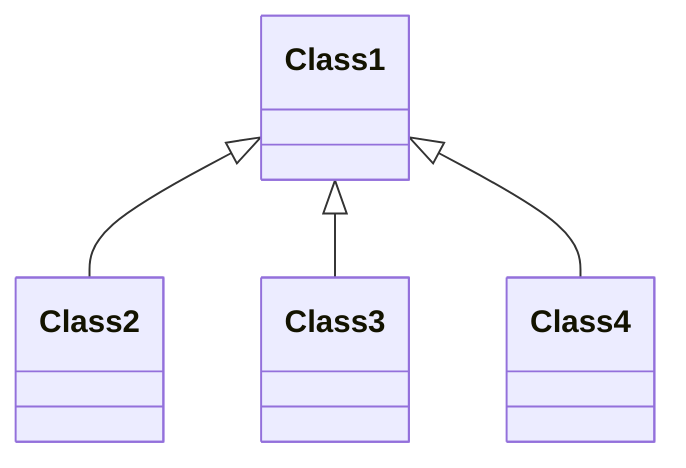

在这个类图中，`Class1` 代表简约风格的核心要素，`Class2`、`Class3` 和 `Class4` 分别代表不同的装饰元素，如木材、植物和茶具。

##### 2.2.2 自然元素
自然元素在禅意家居装饰中起到关键作用。以下是一个自然元素的Mermaid实体关系图：

```mermaid
erDiagram
    Person <|.. Device : "uses"
    Person <|.. Food : "eats"
    Device <|.. Service : "provides"
    Food <|.. Nutrition : "contains"
```

在这个实体关系图中，`Person` 代表家居使用者，`Device`、`Food` 和 `Service` 分别代表家居装饰元素，如灯具、食物和水景。

##### 2.2.3 东方艺术
东方艺术是禅意家居装饰的重要组成部分。以下是一个东方艺术的Mermaid流程图：

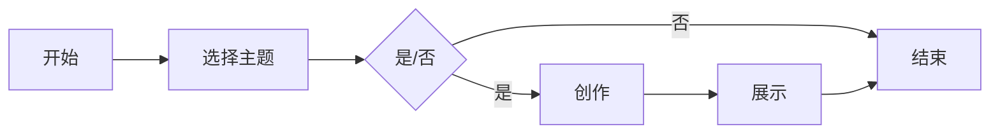

在这个流程图中，`A` 代表开始阶段，`B` 代表选择主题，`C` 代表是否开始创作，`D` 代表创作过程，`E` 代表结束阶段，`F` 代表展示作品。

#### 2.3 室内植物的禅意应用

##### 2.3.1 选择合适的植物
选择合适的植物是禅意家居装饰的关键。以下是一个选择合适植物的Mermaid决策树：

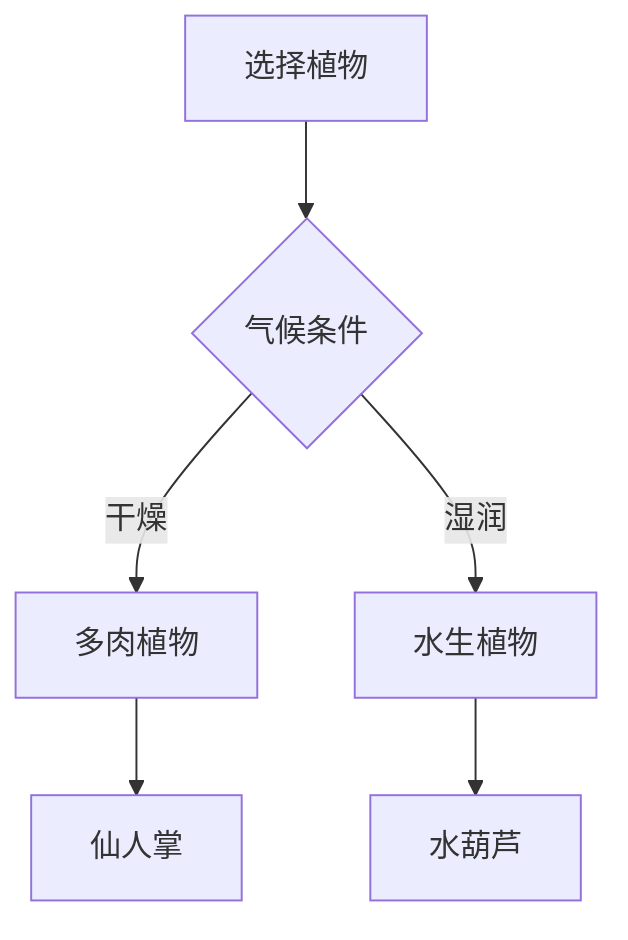

在这个决策树中，`A` 代表选择植物，`B` 代表气候条件，`C` 和 `D` 分别代表干燥和湿润条件下的植物选择，`E` 和 `F` 分别代表具体的植物种类。

##### 2.3.2 植物摆放的技巧
植物摆放的技巧对禅意家居装饰至关重要。以下是一个植物摆放的Mermaid流程图：

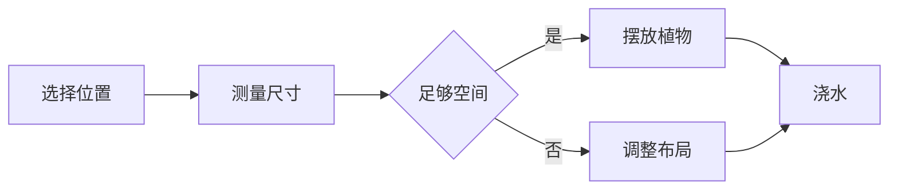

在这个流程图中，`A` 代表选择摆放位置，`B` 代表测量尺寸，`C` 代表是否足够空间，`D` 和 `E` 分别代表摆放植物和调整布局，`F` 代表浇水。

##### 2.3.3 植物的养护
植物的养护是禅意家居装饰的重要组成部分。以下是一个植物养护的Mermaid流程图：

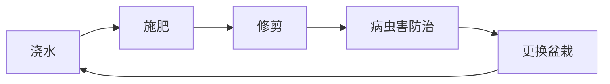

在这个流程图中，`A` 代表浇水，`B` 代表施肥，`C` 代表修剪，`D` 代表病虫害防治，`E` 代表更换盆栽。

#### 2.4 灯光与色彩的禅意运用

##### 2.4.1 灯光设计的原则
灯光设计在禅意家居装饰中扮演重要角色。以下是一个灯光设计原则的Mermaid类图：

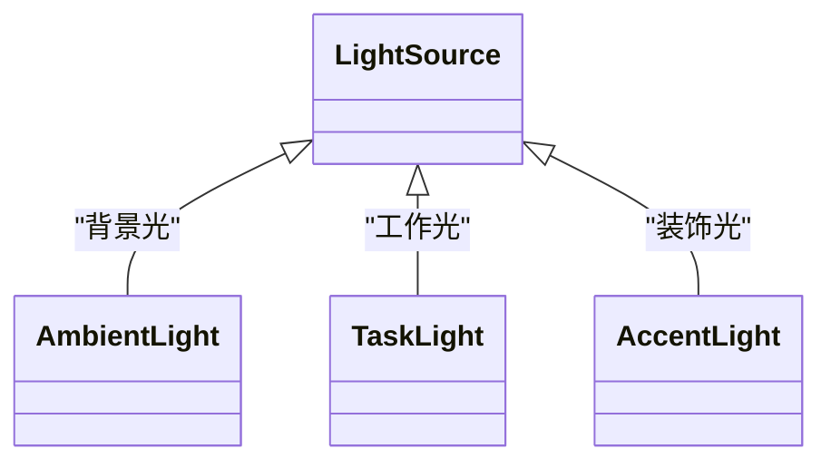

在这个类图中，`LightSource` 代表灯光源，`AmbientLight`、`TaskLight` 和 `AccentLight` 分别代表背景光、工作光和装饰光。

##### 2.4.2 色彩搭配的技巧
色彩搭配在禅意家居装饰中也至关重要。以下是一个色彩搭配技巧的Mermaid类图：

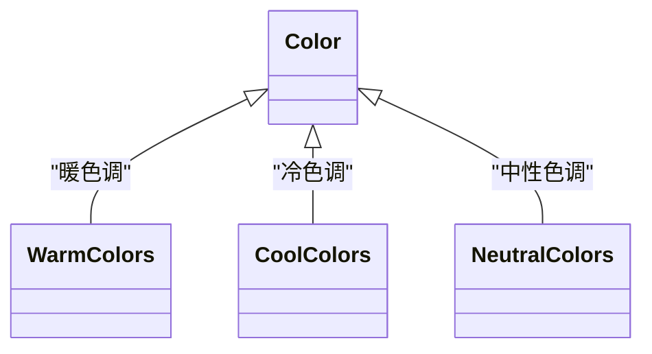

在这个类图中，`Color` 代表色彩，`WarmColors`、`CoolColors` 和 `NeutralColors` 分别代表暖色调、冷色调和中性色调。

#### 2.5 禅意生活空间案例分析

##### 2.5.1 案例一：都市公寓
以下是一个都市公寓禅意生活空间案例的Mermaid架构图：

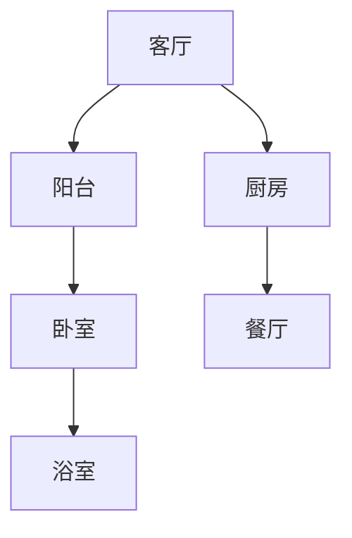

在这个架构图中，`A`、`B`、`C`、`D`、`E` 和 `F` 分别代表客厅、阳台、卧室、浴室、厨房和餐厅。

##### 2.5.2 案例二：乡村别墅
以下是一个乡村别墅禅意生活空间案例的Mermaid架构图：

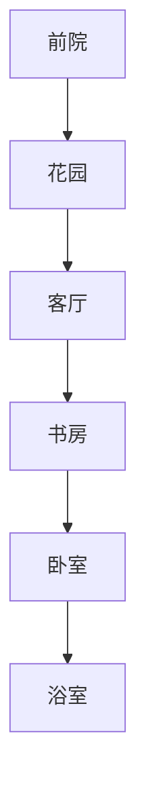

在这个架构图中，`A`、`B`、`C`、`D`、`E` 和 `F` 分别代表前院、花园、客厅、书房、卧室和浴室。

#### 2.6 本章小结
本章介绍了如何在生活空间中营造禅意，包括空间布局、家居装饰、室内植物、灯光和色彩等方面的实践。通过这些实践，我们可以在日常生活中体验到禅意的宁静和和谐。

### 第3章：饮食中的禅意

#### 3.1 禅意饮食的理念

##### 3.1.1 饮食与身心健康的关系
饮食对身心健康有着直接的影响。合理的饮食结构有助于维持身体的健康状态，增强免疫力，预防疾病。以下是一个饮食与身心健康关系的Mermaid类图：

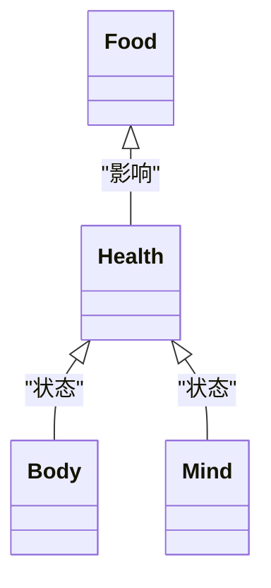

在这个类图中，`Food` 代表饮食，`Health` 代表健康，`Body` 和 `Mind` 分别代表身体和心灵的状态。

##### 3.1.2 禅意饮食的原则
禅意饮食强调饮食的自然性、平衡性和简洁性。以下是一个禅意饮食原则的Mermaid表格：

| 原则         | 说明                                                         |
|--------------|--------------------------------------------------------------|
| 自然性       | 饮食应尽量选择自然食材，减少加工食品。                       |
| 平衡性       | 饮食应保持营养均衡，避免过量摄入某一种营养素。               |
| 简洁性       | 饮食应简洁明了，减少过多的调味品和添加剂。                     |

#### 3.2 禅意食材的选择与搭配

##### 3.2.1 健康食材的选择
选择健康食材是禅意饮食的基础。以下是一个健康食材选择的Mermaid列表：

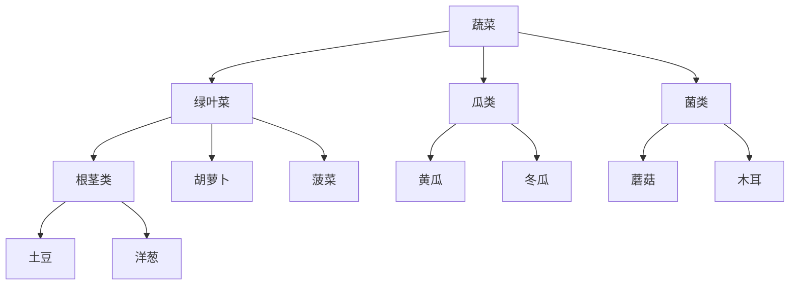

在这个列表中，`A` 代表蔬菜，`B`、`C`、`D` 和 `E` 分别代表绿叶菜、根茎类、瓜类和菌类。

##### 3.2.2 营养均衡的搭配
营养均衡是禅意饮食的关键。以下是一个营养均衡搭配的Mermaid表格：

| 食材         | 营养素                 | 说明                               |
|--------------|------------------------|-----------------------------------|
| 蛋白质       | 肌肉、血液、免疫系统   | 来源于鱼、豆类、坚果等。           |
| 碳水化合物   | 能量、神经系统         | 来源于谷物、蔬菜、水果等。         |
| 脂肪         | 细胞膜、激素           | 来源于橄榄油、鱼油、坚果等。        |
| 维生素和矿物质 | 免疫、代谢、生长发育 | 来源于蔬菜、水果、全谷物等。       |

#### 3.3 禅意烹饪的技巧

##### 3.3.1 简单易做的禅意菜肴
简单易做的禅意菜肴可以让人在忙碌的生活中也能享受美食。以下是一个简单易做菜肴的Mermaid类图：

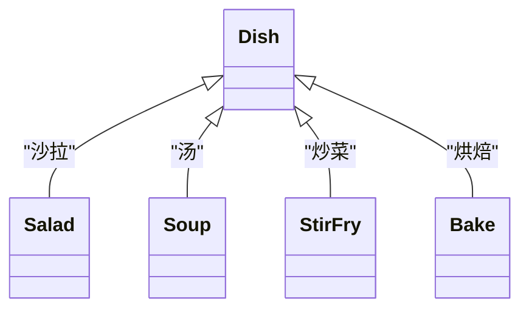

在这个类图中，`Dish` 代表菜肴，`Salad`、`Soup`、`StirFry` 和 `Bake` 分别代表沙拉、汤、炒菜和烘焙。

##### 3.3.2 烹饪中的禅意
烹饪中的禅意体现在对食材的尊重、烹饪过程的专注以及对食物的感恩。以下是一个烹饪中禅意的Mermaid流程图：


在这个流程图中，`A` 代表选择食材，`B` 代表清洗食材，`C` 代表准备烹饪工具，`D` 代表烹饪过程，`E` 代表品尝食物，`F` 代表感恩食物。

#### 3.4 饮食中的禅意礼仪

##### 3.4.1 餐桌礼仪
餐桌礼仪是禅意饮食的重要组成部分。以下是一个餐桌礼仪的Mermaid类图：

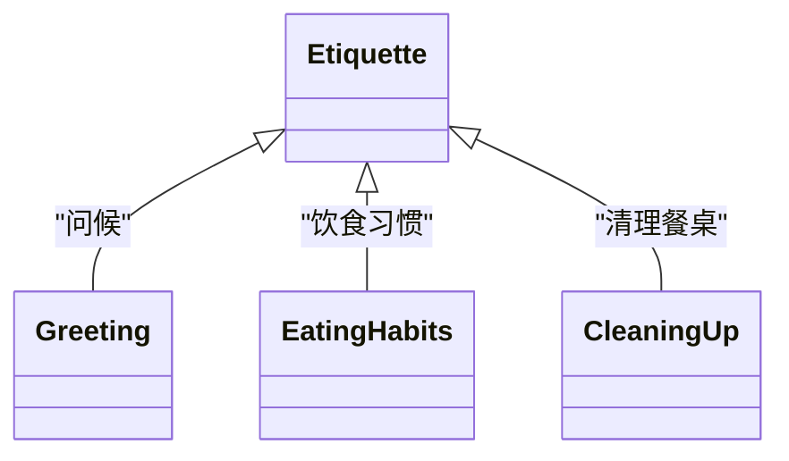

在这个类图中，`Etiquette` 代表餐桌礼仪，`Greeting`、`EatingHabits` 和 `CleaningUp` 分别代表问候、饮食习惯和清理餐桌。

##### 3.4.2 饮食习惯的调整
调整饮食习惯有助于提高饮食质量。以下是一个饮食习惯调整的Mermaid流程图：

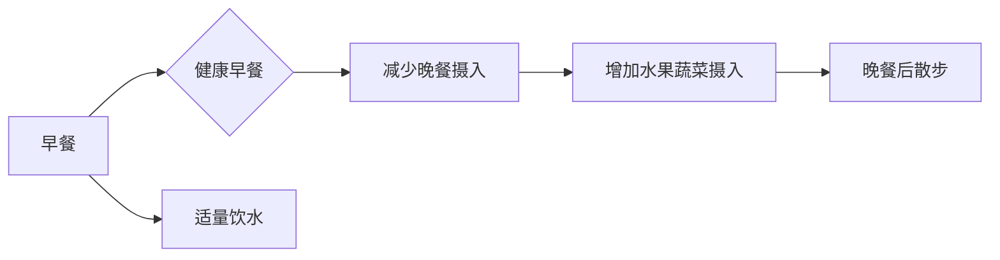

在这个流程图中，`A` 代表早餐，`B` 代表健康早餐，`C`、`D` 和 `E` 分别代表减少晚餐摄入、增加水果蔬菜摄入和适量饮水，`F` 代表晚餐后散步。

#### 3.5 禅意饮食案例

##### 3.5.1 案例一：早餐的禅意
以下是一个早餐禅意案例的Mermaid流程图：


在这个流程图中，`A` 代表准备早餐食材，`B` 代表清洗食材，`C` 代表烹饪早餐，`D` 代表享用早餐，`E` 代表感恩食物。

##### 3.5.2 案例二：晚餐的禅意
以下是一个晚餐禅意案例的Mermaid流程图：


在这个流程图中，`A` 代表准备晚餐食材，`B` 代表清洗食材，`C` 代表烹饪晚餐，`D` 代表享用晚餐，`E` 代表清理餐桌，`F` 代表感恩食物。

#### 3.6 本章小结
本章介绍了饮食中的禅意，包括饮食理念、食材选择与搭配、烹饪技巧、饮食习惯调整以及实际案例。通过实践禅意饮食，我们可以在日常生活中体验到身心健康和内心的宁静。

### 第4章：运动中的禅意

#### 4.1 禅意运动的理念

##### 4.1.1 运动对身心的影响
运动对身心健康有着显著的影响。它能够增强心肺功能、提高免疫力、减轻压力、改善心理健康等。以下是一个运动对身心影响关系的Mermaid类图：

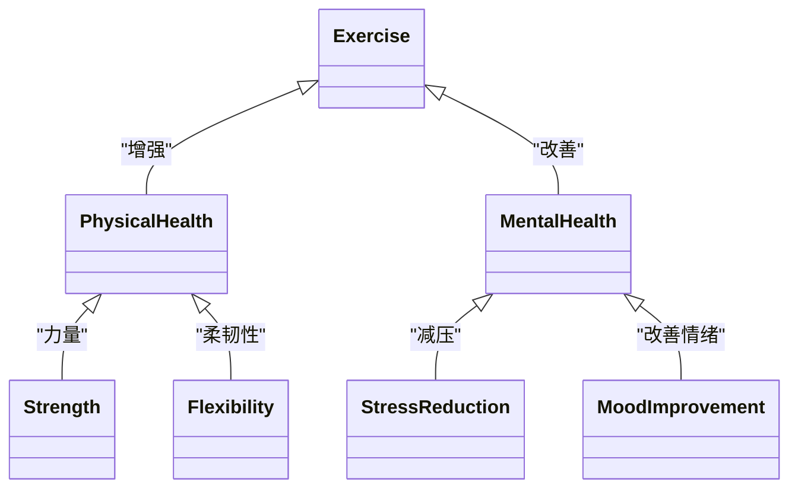

在这个类图中，`Exercise` 代表运动，`PhysicalHealth` 和 `MentalHealth` 分别代表身体健康和心理健康，`Strength`、`Flexibility`、`StressReduction` 和 `MoodImprovement` 分别代表力量、柔韧性、减压和改善情绪。

##### 4.1.2 禅意运动的原则
禅意运动强调身心合一、呼吸与动作的协调以及意识的集中。以下是一个禅意运动原则的Mermaid表格：

| 原则           | 说明                                                         |
|----------------|--------------------------------------------------------------|
| 身心合一       | 将身体动作与呼吸相协调，达到身心平衡。                       |
| 呼吸与动作的协调 | 通过深呼吸和有意识的动作，提高运动的禅意。                   |
| 意识的集中     | 在运动过程中集中注意力，减少杂念，达到心灵的宁静。             |

#### 4.2 禅意运动的选择

##### 4.2.1 瑜伽
瑜伽是一种集身体练习、呼吸练习和冥想于一体的禅意运动。它通过一系列的体位练习和呼吸技巧，帮助人们放松身心，提高生活质量。以下是一个瑜伽练习的Mermaid流程图：

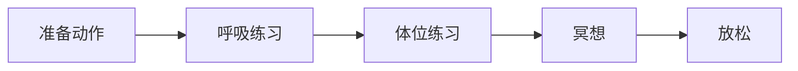

在这个流程图中，`A` 代表准备动作，`B` 代表呼吸练习，`C` 代表体位练习，`D` 代表冥想，`E` 代表放松。

##### 4.2.2 普拉提
普拉提是一种以核心肌群训练为主的禅意运动。它强调精确的动作和深度的意识，帮助人们提高身体控制和平衡能力。以下是一个普拉提练习的Mermaid流程图：

```mermaid
flowchart LR
    A[准备动作] --> B[核心练习]
    B --> C[伸展练习]
    C --> D[平衡练习]
    D --> E[放松]
```

在这个流程图中，`A` 代表准备动作，`B` 代表核心练习，`C` 代表伸展练习，`D` 代表平衡练习，`E` 代表放松。

##### 4.2.3 呼吸练习
呼吸练习是禅意运动的重要组成部分。它通过深呼吸技巧帮助人们放松身心，提高氧气供应，增强身体功能。以下是一个呼吸练习的Mermaid流程图：

```mermaid
flowchart LR
    A[深吸气] --> B[屏住呼吸]
    B --> C[深呼气]
    C --> D[放松]
```

在这个流程图中，`A` 代表深吸气，`B` 代表屏住呼吸，`C` 代表深呼气，`D` 代表放松。

#### 4.3 禅意运动的实践技巧

##### 4.3.1 正确的姿势与呼吸
正确的姿势和呼吸是禅意运动的关键。以下是一个正确姿势与呼吸的Mermaid类图：

```mermaid
classDiagram
    Pose <|-- Breathing : "配合"
    Pose <|-- Mindfulness : "集中"
    Breathing <|-- DeepBreathing : "深呼吸"
    Breathing <|-- SlowBreathing : "慢呼吸"
    Mindfulness <|-- Focus : "专注"
```

在这个类图中，`Pose` 代表姿势，`Breathing` 代表呼吸，`Mindfulness` 代表意识集中，`DeepBreathing` 和 `SlowBreathing` 分别代表深呼吸和慢呼吸，`Focus` 代表专注。

##### 4.3.2 精神专注的重要性
精神专注是禅意运动的核心。它帮助人们从日常生活的杂念中解脱出来，达到内心的宁静。以下是一个精神专注重要性的Mermaid表格：

| 方面       | 说明                                                         |
|------------|--------------------------------------------------------------|
| 减少杂念   | 通过专注练习，减少大脑中的杂念，达到内心的平静。               |
| 提高意识   | 增强对身体的意识，提高运动的质量和效果。                       |
| 增强专注力 | 提高专注力，有助于在日常生活中更好地应对挑战和压力。             |

#### 4.4 禅意运动案例

##### 4.4.1 案例一：瑜伽练习
以下是一个瑜伽练习案例的Mermaid流程图：

```mermaid
flowchart LR
    A[准备动作] --> B[深呼吸]
    B --> C[山式]
    C --> D[猫式与牛面式]
    D --> E[船式]
    E --> F[战士II式]
    F --> G[坐角式]
    G --> H[休息术]
```

在这个流程图中，`A` 代表准备动作，`B` 代表深呼吸，`C`、`D`、`E`、`F`、`G` 和 `H` 分别代表山式、猫式与牛面式、船式、战士II式、坐角式和休息术。

##### 4.4.2 案例二：呼吸练习
以下是一个呼吸练习案例的Mermaid流程图：

```mermaid
flowchart LR
    A[深吸气] --> B[屏住呼吸]
    B --> C[深呼气]
    C --> D[重复呼吸]
    D --> E[放松]
```

在这个流程图中，`A` 代表深吸气，`B` 代表屏住呼吸，`C` 代表深呼气，`D` 代表重复呼吸，`E` 代表放松。

#### 4.5 本章小结
本章介绍了运动中的禅意，包括禅意运动的理念、选择、实践技巧和实际案例。通过禅意运动，我们可以在运动中体验到内心的宁静和身体的健康。

### 第5章：冥想与禅修

#### 5.1 冥想的基本原理

##### 5.1.1 冥想的定义
冥想是一种通过专注、意识集中和呼吸控制来达到内心宁静和清晰思考的实践。它源于古代东方哲学，如佛教和印度教，并在现代心理学和医学领域得到了广泛研究。

##### 5.1.2 冥想的作用
冥想对身心健康有着积极的影响，包括：

1. 减轻压力和焦虑
2. 提高注意力和集中力
3. 改善情绪和心理健康
4. 提高创造力和解决问题的能力
5. 促进睡眠质量和身体恢复

##### 5.1.3 冥想的分类
冥想有多种形式和流派，常见的包括：

1. 禅修（Zen Meditation）：强调呼吸和身体感觉的觉察。
2. 唯识冥想（Vipassana Meditation）：专注于身体感觉和情感体验。
3. 爱克哈特冥想（Ekhardt Meditation）：结合瑜伽和呼吸练习。
4. 正念冥想（Mindfulness Meditation）：专注于当前的经验，不分好坏。

#### 5.2 禅修的实践方法

##### 5.2.1 禅修的步骤
以下是一个基本的禅修步骤流程图：

```mermaid
flowchart LR
    A[选择地点和时间] --> B[舒适坐姿]
    B --> C[深呼吸]
    C --> D[专注呼吸]
    D --> E[觉察杂念]
    E --> F[回到呼吸]
    F --> G[结束冥想]
```

在这个流程图中，`A` 代表选择地点和时间，`B` 代表舒适坐姿，`C` 代表深呼吸，`D` 代表专注呼吸，`E` 代表觉察杂念，`F` 代表回到呼吸，`G` 代表结束冥想。

##### 5.2.2 禅修的注意事项
以下是一些禅修时的注意事项：

1. 选择一个安静、舒适的环境。
2. 穿着宽松的衣物，保持身体舒适。
3. 避免饥饿或过度饱食进行禅修。
4. 保持身体的正直姿势，头部、颈部和脊柱成一条直线。
5. 注意呼吸的自然节奏，不需要刻意调整呼吸。
6. 对杂念保持接纳的态度，但不要过分关注。
7. 禅修结束后，缓慢睁开眼睛，慢慢适应周围的环境。

##### 5.2.3 禅修的辅助工具
以下是一些常用的禅修辅助工具：

1. 冥想垫：提供舒适和稳定的坐姿。
2. 冥想音乐：帮助放松心情，集中注意力。
3. 静音闹钟：设定提醒时间，避免禅修过程中中断。
4. 坐姿矫正带：帮助保持正确的坐姿。
5. 沙漏：计时工具，帮助保持禅修时间的稳定性。

#### 5.3 冥想与禅修的融合

##### 5.3.1 冥想与禅修的共同点
冥想和禅修有许多共同点，包括：

1. 都强调专注和意识集中。
2. 都通过呼吸控制来达到内心的平静。
3. 都注重内在体验和自我反省。
4. 都有助于提高身心健康和幸福感。

##### 5.3.2 冥想与禅修的差异
尽管冥想和禅修有许多共同点，但它们也有一些差异：

1. 冥想更侧重于个人的内在体验，而禅修则更注重实践和修行。
2. 冥想可以是任何形式的专注练习，而禅修通常与佛教修行有关。
3. 冥想可以随时随地进行，而禅修通常需要特定的环境和仪式。

##### 5.3.3 冥想与禅修的结合
结合冥想和禅修可以帮助人们更好地实现内心平静和自我提升。以下是一个结合冥想和禅修的流程图：

```mermaid
flowchart LR
    A[冥想] --> B[专注呼吸]
    B --> C[禅修]
    C --> D[觉察身体感受]
    D --> E[觉察情感体验]
    E --> F[回到呼吸]
    F --> G[结束]
```

在这个流程图中，`A` 代表冥想，`B` 代表专注呼吸，`C` 代表禅修，`D` 代表觉察身体感受，`E` 代表觉察情感体验，`F` 代表回到呼吸，`G` 代表结束。

#### 5.4 冥想与禅修的实际应用

##### 5.4.1 压力管理
冥想和禅修是有效的压力管理工具。以下是一个使用冥想和禅修进行压力管理的流程图：

```mermaid
flowchart LR
    A[感知压力] --> B[开始冥想]
    B --> C[专注呼吸]
    C --> D[觉察身体感受]
    D --> E[放松身体]
    E --> F[回顾压力原因]
    F --> G[制定解决方案]
    G --> H[结束]
```

在这个流程图中，`A` 代表感知压力，`B` 代表开始冥想，`C` 代表专注呼吸，`D` 代表觉察身体感受，`E` 代表放松身体，`F` 代表回顾压力原因，`G` 代表制定解决方案，`H` 代表结束。

##### 5.4.2 心灵成长
冥想和禅修有助于个人心灵成长。以下是一个使用冥想和禅修进行心灵成长的流程图：

```mermaid
flowchart LR
    A[设定目标] --> B[开始冥想]
    B --> C[专注呼吸]
    C --> D[反思个人成长]
    D --> E[觉察内心变化]
    E --> F[调整心态]
    F --> G[制定行动计划]
    G --> H[结束]
```

在这个流程图中，`A` 代表设定目标，`B` 代表开始冥想，`C` 代表专注呼吸，`D` 代表反思个人成长，`E` 代表觉察内心变化，`F` 代表调整心态，`G` 代表制定行动计划，`H` 代表结束。

##### 5.4.3 生活质量提升
冥想和禅修有助于提升生活质量。以下是一个使用冥想和禅修提升生活质量的流程图：

```mermaid
flowchart LR
    A[评估生活质量] --> B[开始冥想]
    B --> C[专注呼吸]
    C --> D[反思生活状况]
    D --> E[觉察身心变化]
    E --> F[设定生活目标]
    F --> G[制定行动计划]
    G --> H[持续冥想和禅修]
    H --> I[生活质量提升]
    I --> J[结束]
```

在这个流程图中，`A` 代表评估生活质量，`B` 代表开始冥想，`C` 代表专注呼吸，`D` 代表反思生活状况，`E` 代表觉察身心变化，`F` 代表设定生活目标，`G` 代表制定行动计划，`H` 代表持续冥想和禅修，`I` 代表生活质量提升，`J` 代表结束。

#### 5.5 冥想与禅修案例

##### 5.5.1 案例一：冥想练习
以下是一个冥想练习案例的流程图：

```mermaid
flowchart LR
    A[选择地点和时间] --> B[舒适坐姿]
    B --> C[深呼吸]
    C --> D[专注呼吸]
    D --> E[觉察杂念]
    E --> F[回到呼吸]
    F --> G[结束冥想]
```

在这个流程图中，`A` 代表选择地点和时间，`B` 代表舒适坐姿，`C` 代表深呼吸，`D` 代表专注呼吸，`E` 代表觉察杂念，`F` 代表回到呼吸，`G` 代表结束冥想。

##### 5.5.2 案例二：禅修实践
以下是一个禅修实践案例的流程图：

```mermaid
flowchart LR
    A[选择地点和时间] --> B[舒适坐姿]
    B --> C[深呼吸]
    C --> D[专注身体感受]
    D --> E[觉察情感体验]
    E --> F[回到呼吸]
    F --> G[结束禅修]
```

在这个流程图中，`A` 代表选择地点和时间，`B` 代表舒适坐姿，`C` 代表深呼吸，`D` 代表专注身体感受，`E` 代表觉察情感体验，`F` 代表回到呼吸，`G` 代表结束禅修。

#### 5.6 本章小结
本章介绍了冥想与禅修的基本原理、实践方法及其在实际应用中的效果。通过冥想与禅修，我们可以在日常生活中体验到内心的宁静和身体的健康。

### 第6章：高效工作与禅意生活

#### 6.1 高效工作的禅意理念

##### 6.1.1 高效工作的目标
高效工作的目标是通过最优化的方法和策略，提高工作效率和质量，从而实现个人和组织的目标。以下是一个高效工作目标的Mermaid类图：

```mermaid
classDiagram
    Goal <|-- Efficiency : "效率"
    Goal <|-- Quality : "质量"
    Goal <|-- Productivity : "生产力"
    Efficiency <|-- TimeManagement : "时间管理"
    Quality <|-- Accuracy : "准确性"
    Quality <|-- Clarity : "清晰度"
    Productivity <|-- TaskPrioritization : "任务优先级"
    Productivity <|-- Automation : "自动化"
```

在这个类图中，`Goal` 代表目标，`Efficiency`、`Quality` 和 `Productivity` 分别代表效率、质量和生产力，`TimeManagement`、`Accuracy`、`Clarity`、`TaskPrioritization` 和 `Automation` 分别代表时间管理、准确性、清晰度、任务优先级和自动化。

##### 6.1.2 禅意工作法的原则
禅意工作法强调内在平静、专注和持续的自我提升。以下是一个禅意工作法原则的Mermaid表格：

| 原则           | 说明                                                         |
|----------------|--------------------------------------------------------------|
| 内在平静       | 保持内心的平静和专注，减少干扰和杂念。                       |
| 专注           | 在工作中集中注意力，避免分心和拖延。                       |
| 持续学习       | 不断学习新知识和技能，提升自己的能力和竞争力。               |
| 自我反省       | 定期进行自我反省，找到改进的空间。                         |
| 生活平衡       | 保持工作与生活的平衡，避免过度劳累。                       |

#### 6.2 禅意工作环境的营造

##### 6.2.1 空间布局
一个良好的空间布局对禅意工作环境的营造至关重要。以下是一个空间布局的Mermaid类图：

```mermaid
classDiagram
    Workspace <|-- Desk : "工作桌"
    Workspace <|-- Chair : "椅子"
    Workspace <|-- Lighting : "照明"
    Workspace <|-- Storage : "储物"
    Desk <|-- Monitor : "显示器"
    Desk <|-- Keyboard : "键盘"
    Desk <|-- Mouse : "鼠标"
    Chair <|-- Ergonomic : "人体工学"
    Lighting <|-- NaturalLight : "自然光"
    Lighting <|-- TaskLight : "工作灯"
    Storage <|-- FilingCabinet : "文件柜"
    Storage <|-- Shelves : "书架"
```

在这个类图中，`Workspace` 代表工作空间，`Desk`、`Chair`、`Lighting` 和 `Storage` 分别代表工作桌、椅子、照明和储物，`Monitor`、`Keyboard`、`Mouse`、`Ergonomic`、`NaturalLight`、`TaskLight`、`FilingCabinet` 和 `Shelves` 分别代表显示器、键盘、鼠标、人体工学椅、自然光、工作灯、文件柜和书架。

##### 6.2.2 照明与色彩
照明和色彩对工作环境的影响至关重要。以下是一个照明与色彩的设计原则的Mermaid表格：

| 元素       | 设计原则                          | 说明                               |
|------------|---------------------------------|-----------------------------------|
| 照明       | 自然光为主，避免刺眼的光线        | 提高视觉舒适度和工作效率。         |
| 色彩       | 使用柔和、舒缓的色彩              | 营造放松和专注的氛围。             |
| 色彩搭配   | 保持色彩一致性，避免过多对比      | 提高视觉舒适度和空间感。           |

##### 6.2.3 清洁与整理
保持工作环境的清洁与整理是禅意工作环境的重要组成部分。以下是一个清洁与整理的Mermaid流程图：

```mermaid
flowchart LR
    A[整理桌面] --> B[清理垃圾]
    B --> C[擦拭桌面]
    C --> D[整理办公用品]
    D --> E[清洁地面]
    E --> F[检查卫生]
    F --> G[完成]
```

在这个流程图中，`A` 代表整理桌面，`B` 代表清理垃圾，`C` 代表擦拭桌面，`D` 代表整理办公用品，`E` 代表清洁地面，`F` 代表检查卫生，`G` 代表完成。

#### 6.3 禅意工作习惯的培养

##### 6.3.1 时间管理
时间管理是禅意工作习惯的核心。以下是一个时间管理的Mermaid流程图：

```mermaid
flowchart LR
    A[制定工作计划] --> B[任务分解]
    B --> C[设定优先级]
    C --> D[分配时间]
    D --> E[跟踪进度]
    E --> F[调整计划]
    F --> G[完成]
```

在这个流程图中，`A` 代表制定工作计划，`B` 代表任务分解，`C` 代表设定优先级，`D` 代表分配时间，`E` 代表跟踪进度，`F` 代表调整计划，`G` 代表完成。

##### 6.3.2 心态调整
心态调整是禅意工作习惯的重要组成部分。以下是一个心态调整的Mermaid流程图：

```mermaid
flowchart LR
    A[接受挑战] --> B[积极思考]
    B --> C[面对困难]
    C --> D[寻找解决方案]
    D --> E[总结经验]
    E --> F[保持乐观]
    F --> G[完成]
```

在这个流程图中，`A` 代表接受挑战，`B` 代表积极思考，`C` 代表面对困难，`D` 代表寻找解决方案，`E` 代表总结经验，`F` 代表保持乐观，`G` 代表完成。

##### 6.3.3 工作与生活的平衡
工作与生活的平衡是禅意工作习惯的关键。以下是一个工作与生活平衡的Mermaid流程图：

```mermaid
flowchart LR
    A[评估工作压力] --> B[设定休息时间]
    B --> C[规划假期和休闲活动]
    C --> D[与家人和朋友交流]
    D --> E[锻炼和运动]
    E --> F[兴趣爱好]
    F --> G[保持心理健康]
    G --> H[完成]
```

在这个流程图中，`A` 代表评估工作压力，`B` 代表设定休息时间，`C` 代表规划假期和休闲活动，`D` 代表与家人和朋友交流，`E` 代表锻炼和运动，`F` 代表兴趣爱好，`G` 代表保持心理健康，`H` 代表完成。

#### 6.4 禅意工作案例分析

##### 6.4.1 案例一：远程办公中的禅意
以下是一个远程办公中禅意案例分析：

```mermaid
flowchart LR
    A[选择安静环境] --> B[规划工作时间]
    B --> C[设定工作计划]
    C --> D[保持沟通与协作]
    D --> E[定期休息]
    E --> F[保持心理健康]
    F --> G[完成任务]
```

在这个流程图中，`A` 代表选择安静环境，`B` 代表规划工作时间，`C` 代表设定工作计划，`D` 代表保持沟通与协作，`E` 代表定期休息，`F` 代表保持心理健康，`G` 代表完成任务。

##### 6.4.2 案例二：创意工作中的禅意
以下是一个创意工作中禅意案例分析：

```mermaid
flowchart LR
    A[灵感迸发] --> B[专注创作]
    B --> C[反思作品]
    C --> D[持续改进]
    D --> E[分享成果]
    E --> F[反馈与改进]
    F --> G[完成]
```

在这个流程图中，`A` 代表灵感迸发，`B` 代表专注创作，`C` 代表反思作品，`D` 代表持续改进，`E` 代表分享成果，`F` 代表反馈与改进，`G` 代表完成。

#### 6.5 本章小结
本章介绍了高效工作的禅意理念、工作环境的营造、工作习惯的培养以及实际案例。通过实践禅意工作法，我们可以在工作中找到平衡，提高工作效率和幸福感。

### 第7章：现代禅意生活的拓展与应用

#### 7.1 现代禅意生活的应用领域

##### 7.1.1 教育领域
在当今教育领域，禅意生活理念被广泛应用于教学和管理。以下是一个教育领域应用禅意生活的Mermaid类图：

```mermaid
classDiagram
    Education <|-- Mindfulness : "专注"
    Education <|-- Self-reflection : "自我反省"
    Education <|-- EmotionalIntelligence : "情商"
    Mindfulness <|-- StressManagement : "压力管理"
    Mindfulness <|-- Focus : "专注力"
    Self-reflection <|-- CriticalThinking : "批判性思维"
    Self-reflection <|-- ProblemSolving : "解决问题"
    EmotionalIntelligence <|-- Empathy : "共情"
    EmotionalIntelligence <|-- SocialSkills : "社交技能"
```

在这个类图中，`Education` 代表教育，`Mindfulness`、`Self-reflection` 和 `EmotionalIntelligence` 分别代表专注、自我反省和情商，`StressManagement`、`Focus`、`CriticalThinking`、`ProblemSolving`、`Empathy` 和 `SocialSkills` 分别代表压力管理、专注力、批判性思维、解决问题、共情和社交技能。

##### 7.1.2 医疗保健领域
在医疗保健领域，禅意生活理念也被广泛应用。以下是一个医疗保健领域应用禅意生活的Mermaid类图：

```mermaid
classDiagram
    HealthCare <|-- Meditation : "冥想"
    HealthCare <|-- Mindfulness : "专注"
    HealthCare <|-- Yoga : "瑜伽"
    Meditation <|-- StressReduction : "减压"
    Meditation <|-- EmotionalHealth : "情绪健康"
    Mindfulness <|-- PainManagement : "疼痛管理"
    Mindfulness <|-- SleepQuality : "睡眠质量"
    Yoga <|-- Flexibility : "柔韧性"
    Yoga <|-- Strength : "力量"
    Yoga <|-- Balance : "平衡"
```

在这个类图中，`HealthCare` 代表医疗保健，`Meditation`、`Mindfulness` 和 `Yoga` 分别代表冥想、专注和瑜伽，`StressReduction`、`EmotionalHealth`、`PainManagement`、`SleepQuality`、`Flexibility`、`Strength` 和 `Balance` 分别代表减压、情绪健康、疼痛管理、睡眠质量、柔韧性、力量和平衡。

##### 7.1.3 商业管理领域
在商业管理领域，禅意生活理念也被广泛应用。以下是一个商业管理领域应用禅意生活的Mermaid类图：

```mermaid
classDiagram
    Business <|-- Mindfulness : "专注"
    Business <|-- EmotionalIntelligence : "情商"
    Business <|-- TimeManagement : "时间管理"
    Mindfulness <|-- DecisionMaking : "决策"
    Mindfulness <|-- ProblemSolving : "解决问题"
    EmotionalIntelligence <|-- Leadership : "领导力"
    EmotionalIntelligence <|-- Communication : "沟通"
    TimeManagement <|-- Prioritization : "任务优先级"
    TimeManagement <|-- Productivity : "生产力"
```

在这个类图中，`Business` 代表商业管理，`Mindfulness`、`EmotionalIntelligence` 和 `TimeManagement` 分别代表专注、情商和时间管理，`DecisionMaking`、`ProblemSolving`、`Leadership`、`Communication`、`Prioritization` 和 `Productivity` 分别代表决策、解决问题、领导力、沟通、任务优先级和生产力。

#### 7.2 现代禅意生活的未来发展趋势

##### 7.2.1 数字化与人工智能的结合
随着数字化和人工智能技术的发展，禅意生活将进一步融入现代科技。例如，通过应用程序和智能设备，人们可以更方便地进行冥想、瑜伽等禅意实践。

##### 7.2.2 个性化定制
未来的禅意生活将更加注重个性化定制。根据个人的需求和偏好，提供定制化的禅意生活方案，帮助人们更好地实现身心健康。

##### 7.2.3 跨学科整合
禅意生活将与其他学科如心理学、教育学、医学等领域进行整合，形成跨学科的研究和应用模式，为人们提供更全面、更有效的身心健康解决方案。

##### 7.2.4 社区支持
未来的禅意生活将更加注重社区支持。通过建立禅意生活社区，人们可以相互学习、分享经验和资源，共同提升生活质量。

#### 7.3 现代禅意生活的实践意义

##### 7.3.1 促进身心健康
禅意生活通过调节情绪、缓解压力、增强免疫力等方式，有助于促进身心健康。

##### 7.3.2 提升生活质量
禅意生活强调简朴、自然和平衡的生活方式，有助于提高生活质量，实现个人成长。

##### 7.3.3 促进社会和谐
禅意生活理念有助于减少社会压力，提高社会和谐度，促进可持续发展。

##### 7.3.4 培养人文精神
禅意生活注重内心的平静、专注和自我反省，有助于培养人文精神，提高人类整体素质。

#### 7.4 本章小结
本章介绍了现代禅意生活的应用领域、未来发展趋势以及实践意义。随着科技的进步和社会的发展，禅意生活将在更多领域得到应用，为人们提供更全面、更有效的身心健康解决方案。

### 总结与呼吁

在现代社会的喧嚣中，寻找内心的宁静变得尤为重要。现代禅意生活提供了一种有效的方式，帮助我们在忙碌的生活中找到平衡和和谐。通过调整生活方式、营造禅意环境、实践禅意饮食、参与禅意运动以及冥想与禅修，我们可以在日常生活中体验到内心的宁静和身体的健康。

让我们共同行动起来，将禅意生活理念融入我们的日常生活，提升生活质量，促进个人成长，并为社会和谐做出贡献。记住，内心的宁静不是遥不可及的，它就在我们的身边，只需我们用心去寻找和守护。

**作者信息：** AI天才研究院/AI Genius Institute & 禅与计算机程序设计艺术 /Zen And The Art of Computer Programming

---

**感谢您的阅读！希望本文能帮助您在都市中找到内心的宁静，享受更美好的生活。如果您有任何问题或建议，欢迎在评论区留言，我们期待与您交流。**

