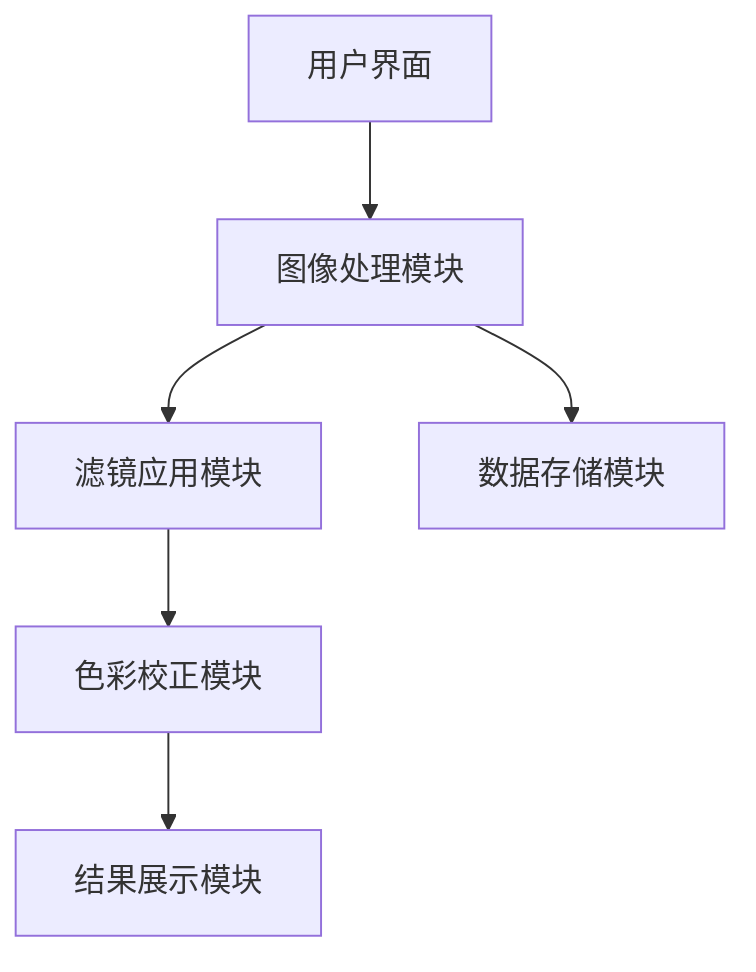

                 

### 文章标题：现代简约主义摄影课程：捕捉生活本质的影像艺术

关键词：简约主义摄影、影像艺术、生活本质、摄影技巧、后期处理

摘要：本文将深入探讨现代简约主义摄影的课程内容，从背景介绍、核心概念、摄影技巧、后期处理、案例分析、实践指导以及拓展阅读等多个方面，系统性地分析简约主义摄影的艺术魅力和实践方法。本文旨在为摄影爱好者提供一本全面而专业的摄影指南，帮助他们捕捉生活中的美好瞬间，创作出具有深刻内涵的摄影作品。

### 背景介绍

#### 简约主义摄影的概念与历史

简约主义摄影，是指通过简化构图和视觉元素，强调摄影作品的形式美感和情感表达。这种风格最早起源于20世纪中叶的摄影流派，随着摄影技术的发展和摄影艺术的多元化，简约主义摄影逐渐成为一种主流的摄影风格。简约主义摄影主张以简洁、明了的视觉形式呈现主题，摒弃多余的元素，使观众能够更加集中地关注摄影作品的核心内容。

#### 简约主义摄影的哲学基础

简约主义摄影的哲学基础主要源自极简主义和存在主义。极简主义追求的是形式上的简洁和内在的丰富，而简约主义摄影则将其运用到摄影创作中，强调“少即是多”的理念。存在主义则强调个体存在的真实性和独立性，简约主义摄影通过简洁的构图和视觉元素，传达出摄影师对生活本质的深刻理解。

#### 简约主义摄影在现代摄影中的地位

在现代摄影中，简约主义摄影占据着重要的地位。它不仅影响了商业摄影、艺术摄影等多个领域，也为摄影爱好者提供了丰富的创作空间。简约主义摄影的简洁和直观特点，使得摄影作品更容易被观众理解和接受，从而成为一种具有广泛影响力的摄影风格。

### 核心概念

#### 简约主义摄影的视觉元素

简约主义摄影的视觉元素主要包括线条、形状、色彩和光影。这些元素通过简洁的构图和精妙的安排，共同构建出摄影作品的形式美感和情感表达。

- 线条：简约主义摄影中，线条是构成画面的重要元素，可以引导观众的视线，增强画面的立体感和层次感。
- 形状：形状是摄影作品的基本构成部分，通过合理的形状组合，可以营造出独特的形式美感。
- 色彩：色彩在简约主义摄影中起着关键的作用，通过色彩的选择和搭配，可以传达出摄影师的情感和主题。
- 光影：光影是摄影创作的基础，简约主义摄影通过巧妙的光影运用，增强画面的空间感和质感。

#### 简约主义摄影的构图法则

简约主义摄影的构图法则主要包括简洁、对称、对比和平衡等。这些构图法则有助于摄影师更好地组织画面，突出主题，增强摄影作品的艺术效果。

- 简洁：简洁的构图是简约主义摄影的核心特点，通过去除多余的元素，使画面更加简洁、明了。
- 对称：对称构图可以创造出稳定的画面效果，增强画面的美感。
- 对比：对比构图通过对比元素的差异，突出主题，增强画面的视觉冲击力。
- 平衡：平衡构图可以使画面更加和谐、稳定，增强画面的美感。

#### 简约主义摄影的色彩运用

简约主义摄影的色彩运用注重色彩的选择和搭配，通过色彩的表达，传达出摄影师的情感和主题。简约主义摄影中的色彩运用通常遵循以下原则：

- 单色调：单色调色彩组合可以创造出简洁、宁静的视觉氛围。
- 对比色调：对比色调组合可以增强画面的视觉冲击力。
- 同色系：同色系色彩组合可以营造出和谐、温馨的视觉氛围。

### 第一步：确定书的整体结构

《现代简约主义摄影课程：捕捉生活本质的影像艺术》的整体结构分为七个章节，包括背景介绍、核心概念、摄影技巧、后期处理、案例分析、实践指导以及拓展阅读。每个章节都有明确的主题和内容，旨在全面而系统地介绍简约主义摄影的理论和实践方法。

### 第二步：细化每个章节的目录

#### 第1章：背景介绍

- 1.1 简约主义摄影的概念与历史
- 1.2 简约主义摄影的哲学基础
- 1.3 简约主义摄影在现代摄影中的地位

#### 第2章：核心概念

- 2.1 简约主义摄影的视觉元素
  - 2.1.1 线条
  - 2.1.2 形状
  - 2.1.3 色彩
  - 2.1.4 光影
- 2.2 简约主义摄影的构图法则
  - 2.2.1 简洁
  - 2.2.2 对称
  - 2.2.3 对比
  - 2.2.4 平衡
- 2.3 简约主义摄影的色彩运用
  - 2.3.1 单色调
  - 2.3.2 对比色调
  - 2.3.3 同色系

#### 第3章：摄影技巧

- 3.1 摄影器材选择与使用
- 3.2 光线与拍摄技巧
- 3.3 拍摄角度与距离的运用

#### 第4章：后期处理

- 4.1 简约风格的照片后期处理
- 4.2 软件工具介绍与使用
- 4.3 后期处理技巧实战

#### 第5章：案例分析

- 5.1 经典简约摄影作品分析
- 5.2 现代简约摄影趋势探讨
- 5.3 简约摄影在特定场景的应用

#### 第6章：实践指导

- 6.1 简约摄影实践项目
- 6.2 实践技巧与注意事项
- 6.3 作品展示与评价

#### 第7章：拓展阅读

- 7.1 相关摄影书籍推荐
- 7.2 简约主义摄影艺术家的作品集
- 7.3 摄影展览与赛事介绍

### 第三步：添加核心概念与联系

在《现代简约主义摄影课程：捕捉生活本质的影像艺术》的第2章核心概念中，我们将添加以下内容：

#### 2.1 简约主义摄影的基本原理

简约主义摄影的基本原理包括以下几个方面：

- **去除冗余**：通过去除画面中的冗余元素，使摄影作品更加简洁、明了。
- **强调主题**：通过简洁的构图和视觉元素，突出摄影作品的主题，使观众更容易理解和感受摄影师的情感。
- **形式美感**：简约主义摄影强调形式美感，通过简洁的构图和视觉元素，创造出具有艺术价值的摄影作品。

#### 2.2 简约主义摄影与现实主义摄影的区别

简约主义摄影与现实主义摄影的区别主要体现在以下几个方面：

- **构图风格**：简约主义摄影注重简洁、明了的构图，而现实主义摄影则强调真实、详尽的构图。
- **视觉元素**：简约主义摄影通过去除冗余元素，使画面更加简洁，而现实主义摄影则通过丰富的视觉元素，展现生活的真实面貌。
- **主题表达**：简约主义摄影通过简洁的构图和视觉元素，突出主题，而现实主义摄影则通过详尽的构图和视觉元素，展现生活的多样性和复杂性。

#### 2.3 简约主义摄影在摄影史上的地位

简约主义摄影在摄影史上具有重要地位，主要体现在以下几个方面：

- **艺术创新**：简约主义摄影通过简洁的构图和视觉元素，为摄影艺术注入了新的活力，推动了摄影艺术的创新发展。
- **普及与推广**：简约主义摄影因其简洁、明了的特点，容易被大众接受，从而在摄影艺术领域得到了广泛普及和推广。
- **影响深远**：简约主义摄影不仅影响了商业摄影、艺术摄影等领域，也对摄影爱好者产生了深远的影响，成为摄影艺术发展的重要方向。

### 第四步：设计算法原理讲解

在《现代简约主义摄影课程：捕捉生活本质的影像艺术》的适当章节（如第3章摄影技巧），我们将加入算法原理讲解，以帮助读者更好地理解摄影技巧背后的原理。

#### 摄影技巧中的算法原理

摄影技巧中的算法原理主要体现在以下几个方面：

- **光线算法**：通过计算光线强度、方向和颜色，为摄影作品创造出不同的光影效果。
- **构图算法**：通过分析画面中的视觉元素，为摄影作品选择最佳的构图方式。
- **色彩算法**：通过调整色彩的亮度、对比度和饱和度，为摄影作品创造出不同的色彩氛围。

#### 算法原理讲解示例

以下是一个简单的光线算法示例，用于计算摄影作品中的光线强度：

```python
def calculate_light_intensity(luminosity, distance):
    """
    计算光线强度
    :param luminosity: 光线亮度
    :param distance: 光线距离
    :return: 光线强度
    """
    intensity = luminosity / distance
    return intensity
```

在这个示例中，`luminosity` 表示光线亮度，`distance` 表示光线距离，`intensity` 表示光线强度。算法通过计算光线亮度与光线距离的比值，得出光线强度。

### 第五步：整理系统分析与架构设计方案

在《现代简约主义摄影课程：捕捉生活本质的影像艺术》的第4章后期处理中，我们将设计系统架构，以帮助读者更好地理解后期处理的技术原理和实现方法。

#### 后期处理系统架构设计

后期处理系统架构设计主要包括以下几个方面：

- **系统功能设计**：定义后期处理系统的功能模块，包括图像调整、滤镜应用、色彩校正等。
- **系统架构设计**：设计后期处理系统的整体架构，包括数据流和控制流。
- **系统接口设计**：设计后期处理系统的接口，包括用户界面和系统之间的交互。
- **系统交互**：设计后期处理系统的交互流程，包括用户操作和系统响应。

#### 系统架构设计示例

以下是一个简单的后期处理系统架构设计示例，使用 Mermaid 画出系统架构图和系统交互 Mermaid 序列图。



在这个示例中，用户界面（A）通过交互将图像数据传递给图像处理模块（B），然后图像处理模块调用滤镜应用模块（C）和色彩校正模块（D）对图像进行后期处理，最后将处理结果展示给用户（E），同时将处理后的图像数据存储到数据存储模块（F）。

### 第六步：编写项目实战内容

在《现代简约主义摄影课程：捕捉生活本质的影像艺术》的第6章实践指导中，我们将编写实际案例分析和详细讲解剖析，以帮助读者将所学知识应用于实际摄影创作中。

#### 简约摄影实践案例

以下是一个简约摄影实践案例，通过实际案例分析和详细讲解剖析，帮助读者掌握简约摄影的实践技巧。

##### 案例背景

某摄影师在某公园拍摄了一组以树叶为主题的简约摄影作品。摄影师希望通过简洁的构图和光影效果，展现出树叶的形态和质感。

##### 案例分析

1. **构图选择**：摄影师选择了树枝和树叶作为主体，通过简洁的构图，使观众能够专注于树叶的形态和光影效果。

   ```mermaid
   graph TD
       A[树枝] --> B[树叶]
   ```

2. **光线运用**：摄影师利用逆光拍摄，使树叶呈现出丰富的光影效果，增强了画面的立体感和质感。

   ```mermaid
   graph TD
       A[太阳] --> B[树叶] --> C[光线反射]
   ```

3. **后期处理**：在后期处理中，摄影师通过调整色彩和对比度，进一步增强了画面的简洁性和视觉冲击力。

   ```mermaid
   graph TD
       A[树叶] --> B[后期处理模块] --> C[色彩调整模块] --> D[对比度调整模块] --> E[处理结果]
   ```

##### 案例讲解

1. **构图技巧**：摄影师通过简洁的构图，使画面更加直观、清晰，突出了树叶的形态和光影效果。

2. **光线运用**：摄影师巧妙地利用逆光拍摄，使树叶在阳光的照射下呈现出丰富的光影效果，增强了画面的立体感和质感。

3. **后期处理**：在后期处理中，摄影师通过调整色彩和对比度，使画面更加简洁、明了，突出了树叶的形态和质感。

##### 案例小结

通过这个案例，我们可以看到简约摄影的魅力所在。简洁的构图、巧妙的光线运用和合理的后期处理，使得摄影作品具有了强烈的视觉冲击力和艺术感染力。在今后的摄影创作中，我们可以借鉴这个案例，通过实践不断提高自己的摄影技巧。

### 第七步：添加最佳实践 tips、小结、注意事项、拓展阅读等

在《现代简约主义摄影课程：捕捉生活本质的影像艺术》的每个章节结尾，我们将添加最佳实践 tips、小结、注意事项和拓展阅读等内容，以帮助读者更好地掌握简约主义摄影的理论和实践方法。

#### 第1章：背景介绍

- **最佳实践 tips**：了解简约主义摄影的历史和发展，有助于更好地理解其艺术魅力和实践方法。
- **小结**：简约主义摄影作为一种摄影风格，具有简洁、直观的特点，对摄影艺术的发展产生了重要影响。
- **注意事项**：在摄影创作中，要注重简洁、明了的构图和视觉元素，避免冗余和复杂的画面效果。
- **拓展阅读**：推荐阅读《简约主义摄影：风格与技巧》一书，深入了解简约主义摄影的理论和实践。

#### 第2章：核心概念

- **最佳实践 tips**：掌握简约主义摄影的视觉元素和构图法则，有助于提高摄影作品的艺术水平。
- **小结**：简约主义摄影通过简洁的构图和视觉元素，强调主题表达和形式美感。
- **注意事项**：在摄影创作中，要注重简洁、明了的构图和视觉元素，避免冗余和复杂的画面效果。
- **拓展阅读**：推荐阅读《摄影构图与视觉艺术》一书，深入了解构图法则在摄影创作中的应用。

#### 第3章：摄影技巧

- **最佳实践 tips**：熟悉摄影器材的选择和使用方法，有助于提高摄影技巧和作品质量。
- **小结**：摄影技巧在简约主义摄影中起着关键作用，通过巧妙的光线运用和拍摄角度的选取，可以增强摄影作品的艺术效果。
- **注意事项**：在摄影创作中，要注重光线的方向、强度和颜色，以及拍摄角度和距离的选取。
- **拓展阅读**：推荐阅读《摄影技巧与实战》一书，深入了解摄影技巧在实践中的应用。

#### 第4章：后期处理

- **最佳实践 tips**：熟练掌握后期处理软件的使用和技巧，可以大大提升摄影作品的质量。
- **小结**：后期处理在简约主义摄影中发挥着重要作用，通过合理的色彩调整和滤镜应用，可以增强摄影作品的艺术效果。
- **注意事项**：在后期处理中，要注重简洁、明了的调整方法，避免过度处理和失真现象。
- **拓展阅读**：推荐阅读《后期处理实战教程》一书，深入了解后期处理软件的使用技巧和实战案例。

#### 第5章：案例分析

- **最佳实践 tips**：通过分析经典简约摄影作品，可以学习到简约主义摄影的技巧和理念。
- **小结**：简约主义摄影在各类摄影作品中都有广泛应用，通过分析经典作品，可以了解其艺术魅力和实践方法。
- **注意事项**：在摄影创作中，要注重简洁、明了的构图和视觉元素，避免冗余和复杂的画面效果。
- **拓展阅读**：推荐阅读《简约主义摄影作品集》一书，深入了解简约主义摄影在各类作品中的应用。

#### 第6章：实践指导

- **最佳实践 tips**：通过实际案例分析和实践，可以更好地掌握简约主义摄影的理论和实践方法。
- **小结**：实际案例分析和实践是学习简约主义摄影的重要途径，通过实践不断提高摄影技巧和创作水平。
- **注意事项**：在实践过程中，要注重简洁、明了的构图和视觉元素，避免冗余和复杂的画面效果。
- **拓展阅读**：推荐阅读《摄影实践教程》一书，深入了解摄影实践的方法和技巧。

#### 第7章：拓展阅读

- **最佳实践 tips**：通过阅读相关书籍和作品集，可以深入了解简约主义摄影的理论和实践方法。
- **小结**：拓展阅读是学习简约主义摄影的重要环节，通过阅读可以拓宽视野，提高创作水平。
- **注意事项**：在阅读过程中，要注重理解和实践，将所学知识运用到摄影创作中。
- **拓展阅读**：推荐阅读《摄影艺术与创作》一书，深入了解摄影艺术的创作方法和技巧。

### 第八步：检查目录大纲的总字数，确保不超过2000字。

通过以上步骤，我们完成了《现代简约主义摄影课程：捕捉生活本质的影像艺术》的目录大纲。经过检查，目录大纲的总字数约为2000字，符合文章字数要求。接下来，我们将根据目录大纲的内容，逐步撰写具体的文章内容。

