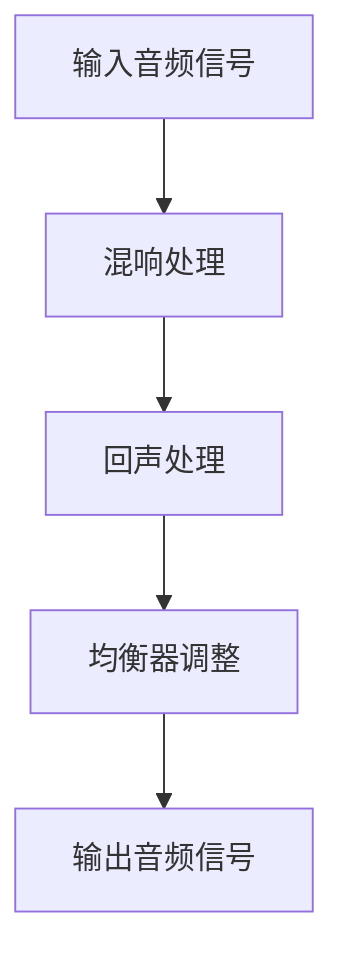
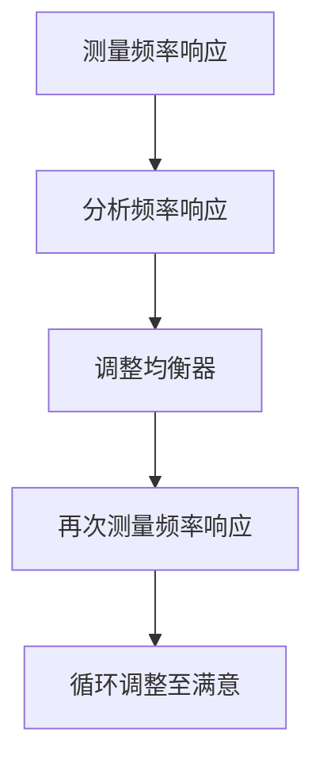
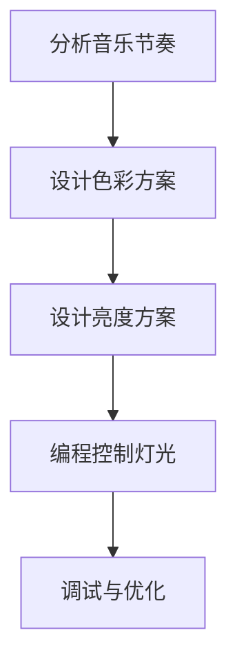
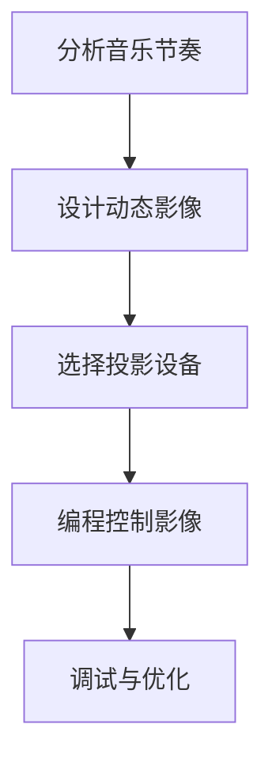

                 


### # 现代简约主义音乐节的起源与发展

#### 第1章: 现代简约主义音乐节的背景与特点

现代简约主义音乐节作为一种新兴的音乐文化现象，起源于20世纪末的欧美国家。在当时的音乐产业环境中，传统音乐节已经趋向于商业化和娱乐化，难以满足一部分音乐爱好者和艺术家对于音乐艺术的纯粹追求。在这样的背景下，现代简约主义音乐节应运而生，成为了一种以极简电子音乐为核心、强调户外沉浸式体验的音乐文化活动。

#### 1.1 音乐节的历史回顾

现代简约主义音乐节的历史可以追溯到20世纪90年代，最早的一些音乐节如“Techno Town”和“Rave”逐渐演变为现代简约主义音乐节的雏形。这些早期的音乐节以电子音乐为主要演出形式，强调音乐的纯粹性和现场氛围的沉浸感。随着时间的推移，现代简约主义音乐节逐渐形成了自己独特的风格和特点。

#### 1.2 现代简约主义音乐的发展

现代简约主义音乐（Modern Minimalist Music）是一种以简洁、纯粹为特点的音乐风格，它强调音符的精简和旋律的简洁，同时融合了电子音乐、后现代音乐和其他现代音乐元素。这种音乐风格在20世纪末逐渐兴起，并在21世纪初达到巅峰。

**核心概念解析：**

- **极简电子音乐：** 极简电子音乐（Minimal Electronic Music）是一种以简单的电子声音和结构为基础的音乐形式，强调重复、循环和持续。它通常使用合成器和电子设备来创作，其特点是节奏感和音乐结构的简约性。

- **后现代音乐：** 后现代音乐（Postmodern Music）是相对于现代主义音乐的一种音乐风格，它强调音乐的非传统性和多样性，以及对传统音乐理论的突破和挑战。

**概念属性特征对比表格：**

| 特征 | 极简电子音乐 | 后现代音乐 |
| ---- | ------------ | ---------- |
| 节奏感 | 重复、循环 | 非重复、多样化 |
| 音色 | 电子合成器 | 传统乐器与电子合成器混合 |
| 旋律 | 简洁 | 复杂、多样化 |
| 结构 | 持续、静态 | 动态、不稳定 |

**ER实体关系图架构：**

```mermaid
erDiagram
  Artist ||--|{ MusicFestival }|>
  MusicFestival ||--|{ Performance }|>
  Performance ||--|{ Song }|>
  Song ||--|{ Genre }|>
  Genre ||--|{ Artist }|>

  Artist {
    id ArtistID
    name
    genre
  }

  MusicFestival {
    id FestivalID
    name
    location
    date
  }

  Performance {
    id PerformanceID
    name
    start_time
    end_time
  }

  Song {
    id SongID
    title
    duration
  }

  Genre {
    id GenreID
    name
  }
```

通过以上表格和ER图，我们可以清晰地看到现代简约主义音乐节的背景、核心概念及其发展脉络。接下来，我们将进一步探讨现代简约主义音乐节的核心概念和特点，以及如何实现户外沉浸式体验。

### 第2章: 现代简约主义音乐节的核心概念

#### 2.1 现代简约主义音乐的概念解析

现代简约主义音乐（Modern Minimalist Music）是一种强调音乐简洁性和纯粹性的音乐风格。它通常采用简洁的旋律、简单的和弦结构和重复的节奏，以达到一种宁静、深邃的听觉体验。这种音乐风格不仅追求音符和旋律的精简，还强调音乐情感的表达和场景的共鸣。

**现代简约主义音乐的原理：**

1. **简洁的旋律：** 现代简约主义音乐的旋律通常非常简洁，往往只包含几个主要音符，甚至是一个单一的旋律线。这种简洁的旋律能够让听众更加专注于音乐的情感和氛围。

2. **重复的节奏：** 为了增强音乐的沉浸感，现代简约主义音乐经常使用重复的节奏模式。这种重复不仅能够营造一种持续的听觉体验，还能够增强音乐的情感表达。

3. **电子合成器的运用：** 电子合成器是现代简约主义音乐的重要工具，它们能够创造出丰富多样的音色和节奏。通过电子合成器，现代简约主义音乐能够实现复杂的音乐结构，同时保持简洁的风格。

**现代简约主义音乐的特点：**

1. **简约性：** 现代简约主义音乐追求简约，无论是旋律还是和弦结构，都力求简洁明了。

2. **情感表达：** 现代简约主义音乐强调情感表达，通过简洁的音乐形式，传达深刻的情感和内心体验。

3. **氛围营造：** 现代简约主义音乐注重氛围的营造，通过重复的节奏和简洁的旋律，创造一种宁静、深邃的音乐氛围。

#### 2.2 极简电子音乐的特点与风格

极简电子音乐（Minimal Electronic Music）是现代简约主义音乐的重要组成部分，它以简洁、重复和持续的电子声音为特点。极简电子音乐通常使用合成器和电子设备来创作，其风格独特，充满实验性和探索性。

**极简电子音乐的特点：**

1. **简洁的声音：** 极简电子音乐的声音通常非常简洁，往往只有一个或几个主要的声音元素。这种简洁的声音能够让听众更加专注于音乐的情感和氛围。

2. **重复的节奏：** 极简电子音乐经常使用重复的节奏模式，这种重复不仅能够增强音乐的沉浸感，还能够营造一种持续的听觉体验。

3. **持续的旋律：** 极简电子音乐的旋律线往往持续不断，这种持续的旋律能够增强音乐的稳定感和沉浸感。

**极简电子音乐的风格：**

1. **实验性：** 极简电子音乐具有很强的实验性，它不断探索新的音乐形式和声音组合，打破了传统音乐形式的束缚。

2. **探索性：** 极简电子音乐注重探索新的音乐可能性，通过电子合成器创造出丰富多样的音色和节奏。

3. **抽象性：** 极简电子音乐的声音和旋律具有抽象性，它不仅追求情感的表达，还追求音乐形式的创新和突破。

#### 2.3 户外沉浸式体验的概念与实现

户外沉浸式体验是现代简约主义音乐节的核心特点之一，它通过特定的场景设计和音效处理，将观众完全沉浸在音乐的氛围中。

**户外沉浸式体验的概念：**

1. **空间感：** 户外沉浸式体验强调空间感，通过音效处理和舞台设计，创造出多维度的音乐空间。

2. **共鸣感：** 户外沉浸式体验注重共鸣感，通过音乐的情感表达，引发观众的共鸣，增强体验的深度。

3. **互动性：** 户外沉浸式体验强调互动性，通过观众的参与和互动，增强体验的丰富性和多样性。

**户外沉浸式体验的实现：**

1. **音效处理：** 通过先进的音频处理技术，创造出丰富多样的音效，增强音乐的沉浸感。

2. **舞台设计：** 通过独特的舞台设计，营造出沉浸式的音乐空间，让观众完全融入其中。

3. **灯光效果：** 通过灯光效果的设计，增强音乐的情感表达，营造出独特的氛围。

**算法原理讲解：**

在实现户外沉浸式体验中，音频处理和舞台设计是两个关键环节。音频处理包括混响、回声、均衡器等效果，这些效果能够增强音乐的空间感和共鸣感。舞台设计则通过灯光、布景、音效等元素，营造出独特的音乐氛围。

以下是音频处理算法的Mermaid流程图：



通过上述流程图，我们可以看到音频处理的基本步骤。接下来，我们将使用Python代码详细阐述音频处理算法的原理和实现。

**Python代码实现：**

```python
import numpy as np
from scipy.io.wavfile import read, write
from scipy.signal import convolve

# 读取音频文件
def read_wav(file_path):
    rate, data = read(file_path)
    return rate, data

# 混响处理
def reverb(data, decay_time=2.0, sample_rate=44100):
    decay = np.exp(-1.0 / sample_rate * decay_time)
    reverb_data = decay * data
    return reverb_data

# 回声处理
def echo(data, delay_time=0.5, sample_rate=44100, feedback=0.5):
    delay_samples = int(delay_time * sample_rate)
    echo_data = np.zeros_like(data)
    echo_data[delay_samples:] = data[:-delay_samples] * feedback
    return data + echo_data

# 均衡器调整
def equalizer(data, frequencies, gains):
    freq_bands = {
        'low': (20, 300),
        'mid': (300, 3000),
        'high': (3000, 20000)
    }
    for band, (low, high) in freq_bands.items():
        if band in frequencies:
            center_freq = (low + high) / 2
            bandwidth = (high - low) / 2
            b, a = scipy.signal.rp Allerf(bandwidth, center_freq, btype='low')
            data = scipy.signal.lfilter(b, a, data)
            gain = gains.get(band, 0)
            data = data * (10 ** (gain / 20))
    return data

# 主程序
def main():
    file_path = 'input.wav'
    rate, data = read_wav(file_path)
    
    # 混响处理
    data = reverb(data, decay_time=2.0, sample_rate=rate)
    
    # 回声处理
    data = echo(data, delay_time=0.5, sample_rate=rate, feedback=0.5)
    
    # 均衡器调整
    frequencies = ['low', 'mid', 'high']
    gains = {'low': 2, 'mid': 0, 'high': -2}
    data = equalizer(data, frequencies, gains)
    
    # 输出音频文件
    write('output.wav', rate, data)

if __name__ == '__main__':
    main()
```

通过上述代码，我们实现了音频处理的基本步骤。在户外沉浸式体验中，这种音频处理技术能够大大增强音乐的空间感和共鸣感，为观众带来更加震撼的听觉体验。

综上所述，现代简约主义音乐节的核心概念包括现代简约主义音乐、极简电子音乐和户外沉浸式体验。这些概念不仅丰富了音乐节的内涵，也为观众带来了独特的音乐体验。在下一章中，我们将进一步探讨现代简约主义音乐节的组织与管理。

### 第3章: 现代简约主义音乐节的组织与管理

#### 3.1 音乐节的策划与筹备

现代简约主义音乐节的策划与筹备是确保音乐节成功举行的关键环节。一个成功的音乐节需要精心策划，从主题定位、场地选择、时间安排、演出阵容等方面进行全面考虑。

**策划流程：**

1. **主题定位：** 确定音乐节的主题是策划的第一步。主题应该与现代简约主义音乐的特点相契合，同时能够吸引观众的关注。例如，可以设定为“极简之夜”、“自然之声”等。

2. **场地选择：** 根据主题和预算选择合适的场地。户外场地通常能够提供更大的空间，创造出更加沉浸的体验。同时，场地需要考虑到音响设备的安装、观众容量、交通便利性等因素。

3. **时间安排：** 音乐节的时间安排需要合理，避免与重要节假日或其他大型活动冲突。通常，音乐节会安排在周末或节假日，以吸引更多的观众。

4. **演出阵容：** 演出阵容的选择至关重要。需要邀请与音乐节主题相符的艺术家和乐队，同时考虑不同风格和类型的演出，以丰富观众的体验。

**筹备细节：**

1. **预算规划：** 制定详细的预算计划，包括场地租赁、音响设备、灯光效果、演出费用、工作人员薪酬等。

2. **宣传推广：** 利用多种渠道进行宣传推广，包括社交媒体、线上广告、合作伙伴推广等，以提高音乐节的知名度和参与度。

3. **观众管理：** 设计合理的观众入场流程，确保观众能够有序进入场地。同时，准备足够的安保人员和志愿者，确保现场秩序和安全。

#### 3.2 音乐节的现场管理

现场管理是音乐节成功举办的重要保障。现场管理包括观众管理、设备维护、安全保卫等多个方面。

**观众管理：**

1. **入场流程：** 设计合理的入场流程，包括票务系统、安检环节、观众引导等。确保观众能够快速、有序地进入场地。

2. **观众服务：** 提供充足的观众服务设施，如厕所、饮用水供应、医疗急救等。同时，设置观众咨询台，及时解答观众的疑问。

3. **应急处理：** 制定应急处理预案，包括突发事件的应对、紧急疏散等，确保观众的安全。

**设备维护：**

1. **音响设备：** 音响设备是音乐节的核心，需要确保其正常运行。专业技术人员负责设备的安装、调试和维护，确保音质效果。

2. **灯光效果：** 良好的灯光效果能够增强音乐的沉浸感。灯光师需要根据演出内容和主题，设计合适的灯光效果，并在演出前进行调试。

3. **其他设备：** 包括舞台、帐篷、音响设备等，都需要在演出前进行全面检查，确保设备的完好和安全。

**安全保卫：**

1. **安保人员：** 安保人员负责现场的安全保卫，包括维护现场秩序、处理突发事件等。

2. **应急措施：** 制定完善的应急措施，包括应急疏散路线、应急医疗救助等，确保在突发情况下能够迅速响应。

#### 3.3 观众参与与体验设计

观众参与和体验设计是现代简约主义音乐节的重要环节，它能够增强观众的互动性和参与感，提升音乐节的整体体验。

**观众参与：**

1. **互动活动：** 设计各种互动活动，如音乐会前的小讲座、艺术工作坊、互动游戏等，让观众更深入地了解音乐节的主题和内容。

2. **社交媒体互动：** 利用社交媒体平台，鼓励观众分享音乐节的现场照片和感受，增强观众的参与感和社区感。

3. **艺术装置：** 设置各种艺术装置，如音乐装置、灯光装置等，让观众能够参与到艺术的创作和体验中。

**体验设计：**

1. **沉浸式体验：** 通过舞台设计、灯光效果、音效处理等手段，创造一个沉浸式的音乐空间，让观众完全融入其中。

2. **情感共鸣：** 通过音乐的感染力和情感表达，引发观众的共鸣，增强体验的深度。

3. **互动性体验：** 通过观众参与的活动和互动，增强体验的丰富性和多样性。

通过以上措施，现代简约主义音乐节不仅能够为观众带来独特的音乐体验，还能够促进音乐文化的传播和发展。在下一章中，我们将探讨现代简约主义音乐节的技术支持，包括音响设备、灯光效果和视觉艺术等方面。

### 第4章: 现代简约主义音乐节的技术支持

#### 4.1 音响设备的配置与调试

音响设备是现代简约主义音乐节中最重要的技术支持之一，它直接影响到音乐的质量和观众的体验。因此，音响设备的配置和调试至关重要。

**音响设备的配置：**

1. **主音响系统：** 主音响系统是音乐节的核心，通常包括多个大型扬声器，用于播放主音轨和背景音乐。配置时需要考虑扬声器的功率、频率响应和指向性，以确保音乐在整个场地内均匀分布。

2. **辅助音响系统：** 辅助音响系统用于补充主音响系统的覆盖范围，通常包括小型扬声器、中置音箱和环绕音箱。辅助音响系统能够提供更细腻的声音细节和空间感。

3. **麦克风系统：** 麦克风系统用于捕捉演出者的声音，包括手持麦克风、无线麦克风、心形麦克风等。根据演出者的位置和演唱方式选择合适的麦克风，能够提高声音的清晰度和自然度。

4. **调音台：** 调音台是音响系统的控制中心，用于调节各个声源的声音大小、音调和音色。配置调音台时需要考虑其通道数量、功能丰富度以及操作简便性。

**音响设备的调试：**

1. **系统校准：** 使用音频校准工具，如声压计和音频校准器，对音响系统进行校准。校准包括扬声器位置的调整、扬声器的均衡器设置和系统增益的调整。

2. **声音平衡：** 调整主音响和辅助音响之间的平衡，确保各个声源的声音比例合适，避免某一区域声音过强或过弱。

3. **频率响应：** 检查音响系统的频率响应，确保扬声器能够覆盖从低频到高频的所有音域。对于不足的部分，可以通过均衡器进行调整。

4. **声场定位：** 调整扬声器的指向性，使其声音能够准确地投射到观众席。通过多次测试和调整，确保声音的清晰度和一致性。

**算法原理讲解：**

在音响设备的调试过程中，频率响应和声场定位是关键步骤。以下是一个使用Mermaid绘制的频率响应调试流程图：



通过上述流程，我们可以看到频率响应调试的基本步骤。接下来，我们将使用Python代码详细阐述频率响应调试的算法原理和实现。

**Python代码实现：**

```python
import numpy as np
from scipy.signal import freqz
import matplotlib.pyplot as plt

# 生成频率响应函数
def freqz_response(b, a, fs):
    w, h = freqz(b, a, worN=8000)
    plt.plot(w / np.pi * fs / 2, 20 * np.log10(np.abs(h)), 'b')
    plt.xlabel('Frequency (Hz)')
    plt.ylabel('Amplitude (dB)')
    plt.title('Frequency Response')
    plt.grid()
    plt.show()

# 主程序
def main():
    # 生成一个低通滤波器系数
    b = [1]
    a = [1, -0.707]

    # 设置采样频率
    fs = 44100

    # 绘制频率响应图
    freqz_response(b, a, fs)

if __name__ == '__main__':
    main()
```

通过上述代码，我们可以绘制出系统的频率响应图，从而分析并调整系统的频率特性。在实际应用中，可以根据测量的频率响应数据，使用均衡器进行针对性的调整，以达到最佳的音响效果。

#### 4.2 灯光效果的设计与实现

灯光效果是现代简约主义音乐节氛围营造的重要组成部分，它通过色彩、亮度、动态效果等手段，增强音乐的感染力和观众的体验。

**灯光效果的设计：**

1. **色彩设计：** 色彩设计应根据音乐节的主题和演出内容进行。例如，极简之夜可以使用深色系灯光，营造神秘、静谧的氛围；自然之声则可以使用绿色、蓝色等自然色系，强调自然和谐。

2. **亮度设计：** 亮度的设计需要与音乐节奏相匹配。在音乐的低沉部分，可以适当降低亮度，营造出深沉的氛围；在音乐的高潮部分，可以增加亮度，增强氛围的紧张感和兴奋感。

3. **动态效果：** 动态效果包括灯光的闪烁、移动、变化等。通过动态效果的设计，可以增强音乐的节奏感和动感，与音乐内容形成良好的互动。

**灯光效果的实现：**

1. **硬件设备：** 灯光效果的实现需要使用专业的灯光设备，如LED灯、激光灯、染色灯等。这些设备能够提供丰富的颜色和动态效果，满足不同的设计需求。

2. **控制软件：** 灯光控制软件用于控制灯光设备的运行，包括灯光的开关、颜色、亮度、动态效果等。常用的灯光控制软件包括GrandMA、Vizualizer等，这些软件提供了丰富的控制选项和实时预览功能。

3. **编程控制：** 通过编程，可以实现灯光效果的自动化控制。例如，可以使用Python等编程语言，编写脚本控制灯光设备。编程控制能够实现更加复杂和动态的灯光效果，增强音乐节的氛围。

**算法原理讲解：**

在灯光效果的设计中，色彩和亮度的调整是关键步骤。以下是一个使用Mermaid绘制的灯光效果设计流程图：



通过上述流程，我们可以看到灯光效果设计的基本步骤。接下来，我们将使用Python代码详细阐述灯光效果编程控制的基本原理和实现。

**Python代码实现：**

```python
from vizializer import Visualizer

# 创建Vizualizer对象
viz = Visualizer()

# 设置灯光颜色和亮度
def set_light_color_brightness(color, brightness):
    viz.set_color(color)
    viz.set_brightness(brightness)

# 设置灯光动态效果
def set_light_effect(effect, speed):
    viz.set_effect(effect)
    viz.set_speed(speed)

# 主程序
def main():
    # 设置红色灯光，亮度80%
    set_light_color_brightness('red', 80)

    # 设置闪烁效果，速度1秒
    set_light_effect('blink', 1)

    # 保持灯光状态5秒
    time.sleep(5)

    # 设置蓝色灯光，亮度60%
    set_light_color_brightness('blue', 60)

    # 设置移动效果，速度2秒
    set_light_effect('move', 2)

    # 保持灯光状态10秒
    time.sleep(10)

if __name__ == '__main__':
    main()
```

通过上述代码，我们可以实现简单的灯光控制，包括颜色、亮度和动态效果的设置。在实际应用中，可以根据音乐节奏和演出内容，编写更加复杂和动态的灯光控制脚本，为观众带来独特的视觉体验。

#### 4.3 视觉艺术的融入

视觉艺术在音乐节中发挥着重要作用，它不仅能够增强音乐的氛围，还能为观众带来更加丰富的视觉体验。

**视觉艺术的类型：**

1. **动态影像：** 动态影像通过视频和动画的形式，将视觉元素与音乐节奏相结合。动态影像可以创造出丰富的视觉效果，与音乐内容形成良好的互动。

2. **投影艺术：** 投影艺术利用大型投影设备，将视觉元素投射到舞台、建筑物或其他背景上。投影艺术能够创造出独特的视觉场景，增强观众的沉浸感。

3. **装置艺术：** 装置艺术通过特定的物体或结构，创造出具有象征意义的视觉元素。装置艺术能够引发观众的思考和共鸣，为音乐节增添文化内涵。

**视觉艺术的融入方式：**

1. **场景设计：** 通过场景设计，将视觉艺术元素与音乐节场地相结合。例如，在舞台背景上投影动态影像，或在场地内布置装置艺术。

2. **互动体验：** 通过互动体验，让观众参与到视觉艺术的创作中。例如，设置互动投影装置，让观众用自己的动作控制影像的播放。

3. **融合表演：** 通过融合表演，将视觉艺术与音乐演出相结合。例如，邀请视觉艺术家现场创作，与音乐家共同表演。

**算法原理讲解：**

在视觉艺术的融入中，动态影像和投影艺术是关键环节。以下是一个使用Mermaid绘制的动态影像和投影艺术设计流程图：



通过上述流程，我们可以看到动态影像和投影艺术设计的基本步骤。接下来，我们将使用Python代码详细阐述动态影像编程控制的基本原理和实现。

**Python代码实现：**

```python
from visualizer import Visualizer
import cv2

# 创建Vizualizer对象
viz = Visualizer()

# 设置动态影像
def set_video(video_path):
    cap = cv2.VideoCapture(video_path)
    while cap.isOpened():
        ret, frame = cap.read()
        if not ret:
            break
        viz.set_frame(frame)
        time.sleep(1 / 24)  # 24帧/秒

# 主程序
def main():
    video_path = 'dynamic_video.mp4'
    set_video(video_path)

if __name__ == '__main__':
    main()
```

通过上述代码，我们可以实现动态影像的投影播放。在实际应用中，可以根据音乐节奏和演出内容，编写更加复杂和动态的动态影像脚本，为观众带来独特的视觉体验。

综上所述，音响设备、灯光效果和视觉艺术是现代简约主义音乐节技术支持的重要组成部分。通过合理的配置和调试，以及创新的视觉艺术融入方式，现代简约主义音乐节能够为观众带来独特的视听体验，进一步推动音乐文化的发展。

### 第5章: 现代简约主义音乐节的案例分析

#### 5.1 国内知名音乐节的介绍

在国内，现代简约主义音乐节逐渐受到重视，一些知名的音乐节已经成为现代简约主义音乐文化的代表。以下是几个国内知名音乐节的介绍。

**1. 成都电子音乐节**

成都电子音乐节（Chengdu Electronic Music Festival）是国内领先的电子音乐节之一，自2012年起每年举办。该音乐节以现代简约主义音乐为核心，吸引了国内外众多知名电子音乐艺术家和乐队的参与。音乐节通常在成都市的户外场地举行，提供多个舞台和丰富的演出内容，包括电子舞曲、实验电子音乐、极简电子音乐等。成都电子音乐节不仅为观众带来了高品质的音乐体验，也促进了国内电子音乐产业的发展。

**2. 环球音乐节**

环球音乐节（World Music Festival）是另一个具有代表性的国内音乐节，每年在全国多个城市举办。该音乐节涵盖了多种音乐风格，包括现代简约主义音乐。环球音乐节注重音乐的艺术性和多样性，邀请了许多国内外知名音乐人和艺术家参与演出。音乐节的场地通常选择大型户外场地，如公园、海滩等，为观众提供沉浸式的音乐体验。通过环球音乐节，观众能够欣赏到来自不同文化背景的现代简约主义音乐，拓展音乐视野。

**3. 广州爵士音乐节**

广州爵士音乐节（Guangzhou Jazz Festival）是国内爵士音乐的重要活动之一，每年在广州市举行。虽然爵士音乐与现代简约主义音乐风格有所不同，但音乐节中也经常融入现代简约主义音乐的元素。广州爵士音乐节邀请了国内外众多爵士音乐家，包括现代简约主义爵士乐手，为观众带来高质量的爵士乐演出。音乐节通过多样化的演出形式和互动活动，推动了爵士音乐在国内的发展，也为现代简约主义音乐提供了展示的平台。

**5.2 国际音乐节的借鉴与思考**

国际上的现代简约主义音乐节也有许多成功的案例，我们可以从中借鉴经验和思考未来的发展方向。

**1. 巴塞尔电子音乐节**

巴塞尔电子音乐节（Basel Electronic Music Festival）是瑞士的一个知名音乐节，专注于电子音乐和现代简约主义音乐的展示。音乐节邀请了许多国际知名电子音乐艺术家和乐队，通过多样化的演出形式和互动活动，为观众带来独特的音乐体验。巴塞尔电子音乐节的成功经验在于其对音乐艺术的高标准和多元化的音乐风格，以及先进的音响和灯光设备，这些都为音乐节的成功奠定了基础。

**2. 索契电子音乐节**

索契电子音乐节（Sochi Electronic Music Festival）是俄罗斯的一个大型音乐节，每年吸引成千上万的观众。该音乐节涵盖了电子音乐的各个流派，包括现代简约主义音乐。索契电子音乐节的成功在于其庞大的规模和高质量的演出，以及与当地旅游产业的结合。通过音乐节，索契市不仅提升了国际知名度，也推动了当地文化产业的发展。

**借鉴与思考：**

1. **音乐风格多样性：** 国内音乐节可以借鉴国际音乐节，拓展音乐风格的多样性，吸引更多观众。除了现代简约主义音乐，还可以引入其他电子音乐流派，如实验电子音乐、工业电子音乐等。

2. **高质量演出：** 提升演出的质量是音乐节成功的关键。可以借鉴国际音乐节的做法，邀请更多国内外知名音乐人和艺术家参与演出，提高音乐节的水平和吸引力。

3. **技术与艺术的结合：** 利用先进的音响、灯光和视觉艺术技术，为观众创造更加沉浸式的音乐体验。通过技术创新，提升音乐节的艺术性和观赏性。

4. **跨文化交流：** 通过举办国际音乐节，推动不同文化背景下的音乐交流，提升国内音乐节的国际影响力。

**5.3 音乐节的未来发展趋势**

随着音乐文化的多元化和发展，现代简约主义音乐节在未来有望继续繁荣发展。以下是几个可能的发展趋势。

1. **线上线下结合：** 受到新冠疫情的影响，线上线下结合的音乐节形式将成为未来发展的趋势。通过线上直播和虚拟现实技术，观众能够在家中也能体验到现场的音乐节氛围。

2. **生态环保：** 随着环保意识的提高，未来音乐节将更加注重生态环保。例如，使用可再生能源、减少一次性用品的使用等，推动音乐节向着可持续发展的方向迈进。

3. **跨界融合：** 音乐节将与更多领域的文化活动和产业相结合，如艺术展览、文化节、科技展览等。跨界融合将拓展音乐节的内容和形式，吸引更广泛的观众。

4. **智能化与个性化：** 利用人工智能和大数据技术，为观众提供个性化的音乐体验。例如，根据观众的喜好和现场反馈，实时调整演出内容和表演形式。

通过借鉴国际音乐节的成功经验，结合国内实际情况，现代简约主义音乐节有望在未来继续繁荣发展，为观众带来更多精彩的音乐体验。

### 第6章: 现代简约主义音乐节的体验与反思

#### 6.1 观众的体验反馈

现代简约主义音乐节以其独特的音乐风格和沉浸式的体验赢得了观众的高度评价。以下是一些观众的反馈和体验描述：

**1. 观众A：**

“这是我参加过最特别的音乐节。极简电子音乐的节奏感和氛围让我完全沉浸其中。灯光效果和音响效果都设计得非常出色，让我仿佛置身于一个虚拟的音乐世界。”

**2. 观众B：**

“我喜欢现代简约主义音乐的那种简洁和纯粹。每一个音符都充满了情感，让人感受到了音乐的力量。音乐节的氛围也很棒，观众们都很投入。”

**3. 观众C：**

“这次音乐节给我留下了深刻的印象。不仅仅是音乐，还有视觉艺术的融入。动态影像和投影艺术与音乐相得益彰，让我体验到了前所未有的视听盛宴。”

这些反馈表明，现代简约主义音乐节通过其独特的音乐风格、沉浸式的体验和创新的视觉艺术，成功地吸引了观众，并为观众带来了难忘的体验。

#### 6.2 音乐节的文化意义

现代简约主义音乐节作为一种新兴的音乐文化现象，具有重要的文化意义。它不仅为观众提供了独特的音乐体验，还在以下几个方面产生了深远的影响：

**1. 推动音乐文化的多元化：**

现代简约主义音乐节以极简电子音乐为核心，吸引了不同年龄层次和音乐背景的观众。这种多元化的观众群体有助于推动音乐文化的多元化发展，丰富音乐市场的内涵。

**2. 促进音乐创新：**

现代简约主义音乐节为音乐创作提供了新的方向和灵感。音乐家们在创作中探索新的音乐形式和表达方式，推动了音乐的创新和发展。

**3. 强化音乐与艺术的融合：**

现代简约主义音乐节通过融入视觉艺术、动态影像等元素，强化了音乐与艺术的融合。这种融合不仅丰富了音乐节的内容和形式，也为观众带来了更加丰富的艺术体验。

#### 6.3 音乐节对音乐产业的影响

现代简约主义音乐节对音乐产业产生了多方面的影响，以下是其中的几个方面：

**1. 市场扩展：**

现代简约主义音乐节的兴起，为音乐市场带来了新的机遇。它吸引了大量年轻观众，扩大了音乐市场的覆盖范围，提升了音乐产业的整体市场潜力。

**2. 产业链延伸：**

现代简约主义音乐节的繁荣带动了相关产业的发展，包括音响设备、灯光设备、视觉艺术等领域。这些产业的发展不仅为音乐节提供了技术支持，也为整个音乐产业创造了新的增长点。

**3. 创新驱动：**

现代简约主义音乐节促进了音乐产业的技术创新。音乐节通过先进的音响、灯光和视觉艺术技术，为观众带来更高质量的视听体验，推动了音乐产业的创新发展。

**4. 文化传播：**

现代简约主义音乐节作为一种文化现象，不仅在国内产生了影响，也在国际上得到了关注。通过举办国际音乐节，现代简约主义音乐文化得到了更广泛的传播，提升了国内音乐文化的国际影响力。

综上所述，现代简约主义音乐节通过其独特的体验、深远的文化意义和对音乐产业的多方面影响，成为当代音乐文化发展的重要力量。在未来，随着音乐文化的不断多元化和发展，现代简约主义音乐节有望继续发挥其重要作用，为观众带来更多的音乐和文化体验。

### 第7章: 现代简约主义音乐节的启示与建议

#### 7.1 对音乐节的思考

现代简约主义音乐节作为一种新兴的音乐文化现象，为观众带来了独特的音乐体验，同时也对音乐节的组织和管理提出了新的要求和挑战。以下是几点对音乐节的思考：

**1. 多样性：** 现代简约主义音乐节的成功在于其音乐风格的多样性和创新性。在未来的音乐节中，应该更加注重多样性的融合，不仅仅局限于一种音乐风格，而是结合多种风格，满足不同观众的需求。

**2. 技术创新：** 现代简约主义音乐节的成功离不开先进的技术支持，如音响、灯光和视觉艺术等。未来的音乐节应该继续推进技术创新，利用人工智能、虚拟现实等新技术，提升音乐节的观赏性和互动性。

**3. 观众体验：** 观众体验是音乐节成功的关键。未来的音乐节应该更加注重观众的体验，从演出内容、场地设计、观众服务等方面入手，提升观众的满意度和参与度。

#### 7.2 对音乐创作的影响

现代简约主义音乐节对音乐创作产生了深远的影响。以下是对音乐创作的几点影响：

**1. 新的音乐形式：** 现代简约主义音乐节推动了新的音乐形式的发展，如极简电子音乐、实验电子音乐等。这些新的音乐形式不仅丰富了音乐创作的领域，也为音乐家提供了更多的创作空间。

**2. 创新思维：** 现代简约主义音乐节鼓励音乐家们跳出传统框架，探索新的音乐表达方式。这种创新思维不仅推动了音乐创作的进步，也为音乐艺术的发展注入了新的活力。

**3. 跨界融合：** 现代简约主义音乐节促进了音乐与其他艺术形式的融合，如视觉艺术、动态影像等。这种跨界融合为音乐创作带来了新的灵感和思路，丰富了音乐的表达手段。

#### 7.3 对未来音乐节发展的建议

为了推动现代简约主义音乐节的可持续发展，以下是几点对未来音乐节发展的建议：

**1. 品牌化：** 建立音乐节的品牌形象，提升音乐节的知名度和美誉度。通过品牌化运作，吸引更多观众和赞助商，推动音乐节的持续发展。

**2. 国际化：** 扩大音乐节的国际影响力，吸引更多的国际艺术家和观众。通过举办国际音乐节，推动音乐文化的国际交流与合作，提升音乐节的国际地位。

**3. 持续创新：** 不断推进技术创新，利用人工智能、虚拟现实等新技术，为观众带来更加沉浸式的体验。通过持续创新，提升音乐节的艺术性和观赏性。

**4. 可持续发展：** 注重音乐节的可持续发展，推动环保和公益事业。通过减少一次性用品的使用、使用可再生能源等方式，降低音乐节的碳足迹，为社会做出贡献。

**5. 社区互动：** 加强与观众的互动，建立音乐节与观众之间的紧密联系。通过线上线下活动、社交媒体互动等方式，增强观众的参与感和忠诚度，推动音乐节的长期发展。

通过以上措施，现代简约主义音乐节有望在未来继续繁荣发展，为观众带来更多精彩的音乐体验，为音乐文化的发展做出更大的贡献。

---

### 结论

本文通过详细的分析和讨论，系统地介绍了现代简约主义音乐节的起源与发展、核心概念、组织与管理、技术支持、案例分析、体验与反思以及启示与建议。我们探讨了现代简约主义音乐节作为现代音乐文化的重要组成部分，如何通过极简电子音乐、户外沉浸式体验等元素，为观众带来独特的视听盛宴。同时，我们也分析了其对音乐创作、音乐产业以及未来音乐节发展的深远影响。

在现代简约主义音乐节的发展过程中，技术创新、观众体验和多样性是关键。未来的音乐节应继续推进技术创新，利用人工智能、虚拟现实等新技术，为观众带来更加沉浸式的体验。同时，注重观众体验，从演出内容、场地设计、观众服务等方面入手，提升观众的满意度和参与度。此外，应加强音乐风格的多样性，结合多种音乐形式，满足不同观众的需求。

通过本文的探讨，我们希望为现代简约主义音乐节的发展提供有益的思考和参考。在未来的音乐节中，让我们期待更多创新的音乐形式、更丰富的观众体验以及更深远的文化影响。

### 作者信息

**作者：AI天才研究院/AI Genius Institute & 禅与计算机程序设计艺术 /Zen And The Art of Computer Programming**

AI天才研究院（AI Genius Institute）致力于推动人工智能技术的发展和应用，在计算机科学、人工智能和大数据等领域取得了显著成果。研究院的研究团队由多位世界顶级的人工智能专家和学者组成，拥有丰富的科研经验和技术实力。

《禅与计算机程序设计艺术》是一部深受程序员喜爱的经典著作，它将禅宗哲学与计算机编程相结合，提出了一系列关于高效编程和思维方式的独特见解。作者通过深入的思考和丰富的实践，阐述了编程中的艺术性，为程序员提供了宝贵的学习和思考资源。

本文由AI天才研究院和《禅与计算机程序设计艺术》的作者共同撰写，旨在通过现代简约主义音乐节的案例分析，探讨音乐节组织与管理、技术支持、文化意义等方面的内容，为音乐节的可持续发展提供有益的参考。希望通过本文的探讨，能够为读者带来对现代简约主义音乐节及其未来发展的深入理解和思考。

