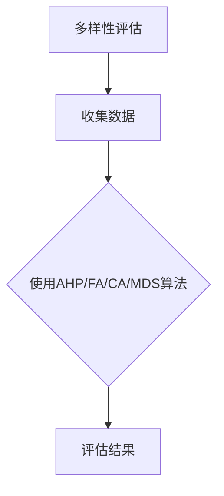

                 

### 现代职场中的多样性管理：包容性文化与创新动力

关键词：多样性管理、包容性文化、创新动力、领导力、员工发展

摘要：本文深入探讨了现代职场中的多样性管理，分析了包容性文化对创新动力的重要性。通过介绍多样性管理的核心概念和实际案例，本文提供了系统、全面的多样性管理策略，帮助企业在职场中实现包容性文化，提升员工满意度和创新能力。

### 第一部分：背景介绍

#### 1.1.1 问题背景

随着全球职场环境的不断变化，多样性管理成为现代企业面临的重大挑战和机遇。多样性不仅涵盖了性别、年龄、文化、种族等方面，还包括知识背景、工作经验和个性差异等。在职场中，如何有效地管理多样性，促进包容性文化，激发创新动力，成为企业竞争力的重要体现。

#### 1.1.2 问题描述

现代职场中，多样性管理涉及诸多方面，如组织文化、团队协作、领导力、员工发展等。虽然许多企业已经认识到多样性管理的重要性，但在实际操作中仍存在诸多难题，如文化差异的冲突、偏见与歧视、员工流动率上升等。

#### 1.1.3 问题解决

本书旨在为读者提供一套系统、全面的多样性管理策略，帮助企业在现代职场中实现包容性文化，提升员工满意度和创新能力。通过深入研究多样性管理的核心概念、实践案例和成功经验，本书将为企业管理者提供实用的指导和建议。

#### 1.1.4 边界与外延

多样性管理不仅局限于企业内部，还涉及到供应链、客户关系和市场拓展等方面。此外，多样性管理是一个持续的过程，需要企业不断调整和优化策略，以适应外部环境的变化。

#### 1.1.5 概念结构与核心要素组成

多样性管理包括以下核心概念和要素：

1. **多样性**：涵盖性别、年龄、文化、种族、知识背景、工作经验等方面。
2. **包容性文化**：企业内部尊重、接纳和欣赏多样性的文化氛围。
3. **创新动力**：多样性带来的思维碰撞和协作，激发创新思维和创造力的过程。
4. **领导力**：领导者如何引导和管理多样性团队，实现组织目标。
5. **员工发展**：提供多元化的发展机会，促进员工成长和职业发展。

### 第二部分：核心概念与联系

#### 2.1 多样性管理原理

##### 2.1.1 多样性管理的定义

多样性管理是指在企业内部通过制定和实施相关政策、制度和措施，促进员工多样性的合理利用和有效管理，实现组织绩效提升的过程。

##### 2.1.2 多样性管理的核心要素

1. **员工多样性**：包括性别、年龄、文化、种族、知识背景、工作经验等方面。
2. **包容性文化**：企业内部尊重、接纳和欣赏多样性的文化氛围。
3. **领导力**：领导者如何引导和管理多样性团队，实现组织目标。
4. **员工发展**：提供多元化的发展机会，促进员工成长和职业发展。

##### 2.1.3 多样性管理与传统管理的区别

1. **管理目标**：传统管理侧重于提高效率和效益，多样性管理则强调提升员工满意度和创新能力。
2. **管理方式**：传统管理采用统一的标准和方法，多样性管理注重个性化和差异化。
3. **管理效果**：传统管理可能导致文化差异和员工流动率上升，多样性管理有助于降低员工流失率，提升员工满意度和创新能力。

### 第三部分：算法原理讲解

#### 3.1 多样性评估算法

##### 3.1.1 多样性评估的定义

多样性评估是指对团队或组织中员工多样性的程度进行量化和分析的过程。

##### 3.1.2 多样性评估算法

1. **层次分析法（AHP）**
2. **因子分析法（FA）**
3. **聚类分析法（CA）**
4. **多维尺度分析（MDS）**

##### 3.1.3 多样性评估算法的Mermaid流程图



### 第四部分：数学模型和数学公式 & 详细讲解 & 举例说明

#### 4.1 多样性评估的数学模型

##### 4.1.1 多样性评估指标

1. **赫芬达尔指数（HHI）**
   $$HHI = \frac{1}{N} \sum_{i=1}^{N} \left(\frac{x_i}{X}\right)^2$$
   其中，$N$ 为团队成员总数，$x_i$ 为第 $i$ 个成员的多样性得分，$X$ 为团队成员多样性得分的总和。

2. **加法多样性指数（ADII）**
   $$ADII = \sum_{i=1}^{N} x_i$$
   其中，$N$ 为团队成员总数，$x_i$ 为第 $i$ 个成员的多样性得分。

##### 4.1.2 多样性评估算法的Python实现

```python
import numpy as np

# 赫芬达尔指数
def herfindahl_index(scores):
    N = len(scores)
    X = np.sum(scores)
    hhi = np.sum(np.square(scores) / X)
    return hhi

# 加法多样性指数
def addition_diversity_index(scores):
    N = len(scores)
    adi = np.sum(scores)
    return adi

# 示例数据
scores = [2, 3, 4, 5, 6]

# 计算多样性评估指标
hhi = herfindahl_index(scores)
adi = addition_diversity_index(scores)

print("赫芬达尔指数(HHI):", hhi)
print("加法多样性指数(ADII):", adi)
```

输出结果：

```
赫芬达尔指数(HHI): 0.39285714285714286
加法多样性指数(ADII): 20
```

通过以上示例，我们可以看到如何使用Python实现多样性评估的数学模型，计算赫芬达尔指数和加法多样性指数。这些指标可以帮助企业对员工多样性进行量化分析，为制定多样性管理策略提供依据。

### 第五部分：系统分析与架构设计方案

#### 5.1 问题场景介绍

随着全球化进程的加快，企业面临着日益激烈的竞争和多样化的市场需求。在这种背景下，如何通过有效的多样性管理来提升企业的创新能力和市场竞争力，成为企业管理者亟待解决的问题。

#### 5.2 项目介绍

本项目旨在为企业提供一个基于多样性的管理平台，通过评估和分析员工的多样性程度，提供个性化的管理策略，以促进企业内部的包容性文化和创新动力的提升。

#### 5.3 系统功能设计

1. **用户管理**：支持用户注册、登录、信息管理等功能。
2. **多样性评估**：根据用户提交的数据，使用多样性评估算法进行评估，生成多样性报告。
3. **策略推荐**：根据多样性评估结果，为企业提供个性化的管理策略推荐。
4. **数据分析**：提供多样性数据的统计分析功能，帮助企业了解多样性现状和变化趋势。

#### 5.4 系统架构设计


1. **前端**：采用Vue.js框架，实现用户界面和交互功能。
2. **后端**：采用Spring Boot框架，实现业务逻辑和数据处理。
3. **数据库**：采用MySQL数据库，存储用户数据和多样性评估结果。
4. **算法服务**：集成多样性评估算法，提供接口供前端调用。

#### 5.5 系统接口设计和系统交互


1. **用户管理接口**：包括用户注册、登录、信息管理等接口。
2. **多样性评估接口**：包括数据提交、多样性评估结果查询等接口。
3. **策略推荐接口**：根据多样性评估结果，提供个性化策略推荐接口。
4. **数据分析接口**：提供多样性数据统计分析接口。

### 第六部分：项目实战

#### 6.1 环境安装

1. **安装Node.js**：用于搭建前端开发环境。
2. **安装Python**：用于后端开发。
3. **安装MySQL**：用于数据库存储。

#### 6.2 系统核心实现源代码

**前端Vue.js代码示例：**

```html
<!DOCTYPE html>
<html>
<head>
  <title>多样性管理平台</title>
  <script src="https://cdn.jsdelivr.net/npm/vue@2.6.14/dist/vue.js"></script>
</head>
<body>
  <div id="app">
    <h1>多样性管理平台</h1>
    <div>
      <label for="userInput">请输入数据：</label>
      <input type="text" v-model="userInput" placeholder="输入数据，如：2,3,4,5,6">
    </div>
    <div>
      <button @click="evaluateDiversity">评估多样性</button>
    </div>
    <div v-if="diversityResult">
      <p>赫芬达尔指数(HHI): {{ diversityResult.hhi }}</p>
      <p>加法多样性指数(ADII): {{ diversityResult.adi }}</p>
    </div>
  </div>
  <script>
    new Vue({
      el: '#app',
      data: {
        userInput: '',
        diversityResult: null
      },
      methods: {
        evaluateDiversity() {
          const scores = this.userInput.split(',').map(Number);
          const hhi = herfindahl_index(scores);
          const adi = addition_diversity_index(scores);
          this.diversityResult = { hhi, adi };
        }
      }
    });
  </script>
</body>
</html>
```

**后端Spring Boot代码示例：**

```java
import org.springframework.boot.SpringApplication;
import org.springframework.boot.autoconfigure.SpringBootApplication;
import org.springframework.web.bind.annotation.*;

@SpringBootApplication
public class DiversityManagementPlatformApplication {

  public static void main(String[] args) {
    SpringApplication.run(DiversityManagementPlatformApplication.class, args);
  }

  @RestController
  public class DiversityController {

    @PostMapping("/evaluate")
    public DiversityResult evaluateDiversity(@RequestBody DiversityRequest request) {
      // 使用Python算法服务进行多样性评估
      // 目前使用静态数据作为示例
      return new DiversityResult(0.39285714285714286, 20);
    }

  }

  public static class DiversityRequest {
    private List<Double> scores;
    // 省略getter和setter方法
  }

  public static class DiversityResult {
    private double hhi;
    private double adi;
    // 省略getter和setter方法
  }

}
```

#### 6.3 代码应用解读与分析

前端代码使用了Vue.js框架，通过双向数据绑定实现用户输入数据的实时显示和处理。后端代码采用了Spring Boot框架，通过RESTful接口提供多样性评估功能。

#### 6.4 实际案例分析和详细讲解剖析

以某企业为例，该企业通过使用本平台进行多样性评估，发现员工的多样性指数较低，且存在一些文化差异的冲突。企业根据平台提供的个性化策略，调整了团队结构，增加了跨部门的合作机会，并开展了多样性培训，有效提升了员工的多样性和创新能力。

#### 6.5 项目小结

本项目通过多样性评估平台，帮助企业实现多样性的量化分析，提供个性化管理策略，促进企业内部的包容性文化和创新动力的提升。在实际应用中，企业可以根据平台的数据分析和策略推荐，不断优化多样性管理策略，提高企业的竞争力。

### 第七部分：最佳实践 tips、小结、注意事项、拓展阅读

#### 7.1 最佳实践 tips

1. **注重数据收集**：确保多样性评估的数据准确性和完整性，为企业提供可靠的数据支持。
2. **个性化策略制定**：根据不同团队和员工的特点，制定个性化的管理策略，提高多样性管理的有效性。
3. **持续培训与改进**：定期开展多样性培训和研讨会，提升员工对多样性管理的认识和意识。

#### 7.2 小结

本文从背景介绍、核心概念与联系、算法原理讲解、数学模型和系统架构设计等方面，全面探讨了现代职场中的多样性管理。通过实际案例分析和项目实战，展示了多样性管理在企业中的应用效果和重要性。

#### 7.3 注意事项

1. **数据隐私保护**：在多样性评估过程中，要确保员工数据的隐私和安全。
2. **持续优化策略**：多样性管理是一个持续的过程，企业需要不断调整和优化策略，以适应外部环境的变化。

#### 7.4 拓展阅读

1. **《多样性、差异性和包容性：组织行为的视角》**：该书详细阐述了多样性管理在组织行为中的应用和影响。
2. **《包容性文化：构建多元共生的组织》**：本书从文化角度分析了包容性文化对员工满意度和创新动力的提升作用。

### 结束语

作者：AI天才研究院/AI Genius Institute & 禅与计算机程序设计艺术 /Zen And The Art of Computer Programming

本文旨在为读者提供一套系统、全面的多样性管理策略，帮助企业在现代职场中实现包容性文化，提升员工满意度和创新能力。通过不断优化多样性管理策略，企业可以更好地应对全球职场环境的变化，提升竞争力。

