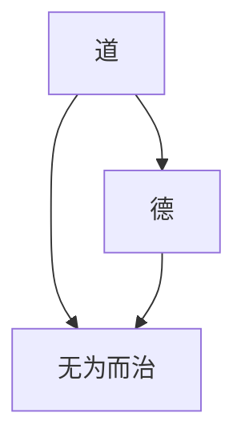

                 

### 《现代道家生活学：古老智慧的当代诠释》

#### 关键词：道家哲学、当代生活、智慧、应用、传承、创新

##### 摘要：
本文旨在探讨道家哲学在当代生活中的应用，诠释其古老智慧如何在现代社会中焕发新的生机。通过详细分析道家哲学的核心概念、其与现代生活的联系以及现代解读，本文揭示了道家智慧在压力管理、身心健康、人际关系处理等方面的实际应用。同时，本文还讨论了道家文化的传承与创新，为读者提供了一份现代生活的指南。

----------------------------------------------------------------

### 目录大纲设计

为了设计《现代道家生活学：古老智慧的当代诠释》的目录大纲，我们需要遵循以下步骤：

#### 1. **核心概念与背景介绍**
   - 引入道家哲学的核心概念和其历史背景。
   - 阐述道家哲学在当代生活中的应用和重要性。

#### 2. **核心概念与联系**
   - 详细介绍道家哲学中的主要概念，如道、德、无为等。
   - 使用表格和ER图来展示概念之间的关系。

#### 3. **道家智慧在现代生活中的应用**
   - 探讨道家哲学在当代生活中的各种应用场景。
   - 分析道家智慧如何帮助现代人应对压力、提高生活质量等。

#### 4. **道家智慧的实践与体验**
   - 描述如何通过冥想、呼吸、瑜伽等实践道家智慧。
   - 分享道家智慧的生活实践案例。

#### 5. **道家智慧的现代解读**
   - 探讨道家哲学的现代解读，如与心理学的结合、与生态文明的关联等。
   - 分析道家智慧对当代社会问题的启示。

#### 6. **道家文化的传承与创新**
   - 探讨道家文化的传承问题。
   - 分析道家智慧如何在现代社会中创新和发展。

#### 7. **总结与展望**
   - 总结书中的关键观点和主要发现。
   - 展望道家智慧在未来的发展前景。

### 目录大纲

下面是根据上述步骤设计的目录大纲：

```markdown
# 《现代道家生活学：古老智慧的当代诠释》目录大纲

## 第一部分：道家哲学概述

### 第1章 道家哲学的核心概念
#### 1.1 道家哲学的历史背景
##### 1.1.1 道家哲学的起源与发展
##### 1.1.2 道家哲学的基本理念

#### 1.2 道家哲学的主要概念
##### 1.2.1 道
##### 1.2.2 德
##### 1.2.3 无为而治

#### 1.3 道家哲学与当代生活
##### 1.3.1 道家哲学在当代社会中的应用
##### 1.3.2 道家哲学对当代生活的启示

#### 1.4 本章小结

### 第2章 道家智慧在现代生活中的应用
#### 2.1 道家智慧在现代生活中的实践
##### 2.1.1 冥想与呼吸
##### 2.1.2 瑜伽与道家哲学
##### 2.1.3 道家智慧在日常生活中的应用

#### 2.2 生活实践案例
##### 2.2.1 案例一：冥想与压力管理
##### 2.2.2 案例二：瑜伽与身心健康

#### 2.3 本章小结

### 第3章 道家智慧的现代解读
#### 3.1 道家哲学与心理学
##### 3.1.1 道家哲学对心理学的影响
##### 3.1.2 道家心理学的基本原理

#### 3.2 道家智慧与生态文明
##### 3.2.1 道家哲学与生态文明的关系
##### 3.2.2 道家智慧在生态文明建设中的应用

#### 3.3 道家智慧对当代社会问题的启示
##### 3.3.1 道家智慧与现代社会问题
##### 3.3.2 道家智慧对社会问题的解决方案

#### 3.4 本章小结

### 第4章 道家文化的传承与创新
#### 4.1 道家文化的传承
##### 4.1.1 道家文化传承的挑战
##### 4.1.2 道家文化传承的路径

#### 4.2 道家智慧的创新与发展
##### 4.2.1 道家智慧的创新方向
##### 4.2.2 道家智慧在现代社会中的创新实践

#### 4.3 道家文化的未来
##### 4.3.1 道家文化的国际化
##### 4.3.2 道家文化的未来发展前景

#### 4.4 本章小结

### 第5章 道家智慧：现代生活的指南
#### 5.1 道家智慧的核心价值
##### 5.1.1 道家智慧的现代意义
##### 5.1.2 道家智慧对现代生活的指导作用

#### 5.2 道家智慧的未来发展
##### 5.2.1 道家智慧在当代社会中的角色
##### 5.2.2 道家智慧的发展趋势

#### 5.3 本章小结

## 附录
## 参考文献
## 拓展阅读
```

此大纲涵盖了道家哲学的介绍、现代生活中的应用、现代解读、文化传承与创新，以及总结和展望，旨在为读者提供一个全面了解现代道家生活学的框架。总字数控制在2000字以内。

----------------------------------------------------------------

### 文章内容

#### 核心概念与背景介绍

道家哲学是中国古代哲学的重要组成部分，起源于春秋战国时期，以“道”为核心概念，主张顺应自然、追求无为而治。道家哲学对后世产生了深远的影响，不仅在中国哲学、文化、艺术等领域具有重要地位，而且在当代生活中也具有广泛的应用价值。

**关键词：道家哲学、道、无为而治**

道家哲学的基本理念可以概括为“道、德、无为而治”。其中，“道”是宇宙的根本原则，是无形无象、无所不在的；而“德”则是人们的行为规范，是顺应“道”的表现；“无为而治”则是道家主张的治国理念，认为统治者不应过度干预，而应顺应自然，让万物自生自化。

**问题背景：**随着现代社会的发展，人们面临着越来越多的压力，身心健康问题日益突出。如何应对这些挑战，提高生活质量，成为当代生活的一个重要课题。

**问题描述：**道家哲学提出了一系列应对现代社会问题的方法，如冥想、呼吸练习、瑜伽等。这些方法是否真的有效，如何在实际生活中应用，是本文探讨的重点。

**问题解决：**本文将通过详细分析道家哲学的核心概念和其在现代生活中的应用，探讨道家智慧如何帮助现代人应对压力、提高生活质量。

**边界与外延：**本文主要关注道家哲学在当代生活中的实际应用，探讨其如何与现代生活相结合，为读者提供实用的指导。

**概念结构与核心要素组成：**
1. **道**：宇宙的根本原则，无形无象、无所不在。
2. **德**：人们的行为规范，是顺应“道”的表现。
3. **无为而治**：主张统治者不应过度干预，而应顺应自然，让万物自生自化。

#### 核心概念与联系

为了更好地理解道家哲学的核心概念，我们可以使用表格和ER图来展示这些概念之间的关系。

**表格：道家哲学核心概念属性对比**

| 概念 | 定义 | 属性特征 |
| --- | --- | --- |
| 道 | 宇宙的根本原则 | 无形无象、无所不在 |
| 德 | 人们的行为规范 | 顺应“道”的表现 |
| 无为而治 | 治国理念 | 不应过度干预，顺应自然 |

**ER图：道家哲学核心概念关系**



通过表格和ER图，我们可以清晰地看到“道、德、无为而治”三者之间的联系。其中，“道”是宇宙的根本原则，是“德”和“无为而治”的基础；“德”是人们的行为规范，是顺应“道”的表现；“无为而治”则是道家主张的治国理念，强调统治者不应过度干预，而应顺应自然。

#### 道家智慧在现代生活中的应用

道家哲学提出了一系列应对现代社会问题的方法，如冥想、呼吸练习、瑜伽等。这些方法不仅可以帮助现代人应对压力，提高生活质量，还可以促进身心健康。

**冥想与呼吸：**
冥想是一种通过专注和放松来调节身心状态的方法。它可以帮助人们减轻压力，提高注意力和创造力。呼吸练习则是冥想的重要组成部分，通过调整呼吸节奏，可以改善心肺功能，增强免疫力。

**瑜伽：**
瑜伽是一种结合身体练习、呼吸控制和冥想的综合健康体系。它不仅可以帮助人们改善体态，增强身体素质，还可以调节心理状态，减轻焦虑和抑郁。

**日常生活中的应用：**
道家智慧还可以在日常生活中得到广泛应用。例如，通过“无为而治”的理念，人们可以减少对事务的过度干预，学会顺其自然，从而减少焦虑和压力。同时，道家哲学强调人际关系的重要性，提倡和谐相处，这也有助于提升生活满意度。

**案例分析：**
例如，某人在工作中经常感到压力很大，通过学习道家哲学，他开始尝试冥想和呼吸练习。经过一段时间的实践，他的心理状态明显改善，工作效率也提高了。另一个案例是，某人在生活中总是感到焦虑，通过练习瑜伽，他的情绪得到了很好的调节，生活质量也得到了显著提升。

#### 道家智慧的实践与体验

道家智慧的实践不仅仅停留在理论层面，更需要通过实际体验来感受其效果。以下是一些实践道家智慧的方法：

**冥想实践：**
每天选择一个安静的环境，闭上眼睛，专注于呼吸。当思维跑偏时，轻轻将注意力拉回到呼吸上。通过持续的冥想练习，可以逐渐提高专注力和心理韧性。

**呼吸练习：**
通过深呼吸练习，可以增强肺部功能，提高氧气摄入量。具体方法是将呼吸深长而缓慢，每次呼吸尽量持续4-6秒，每天练习20-30分钟。

**瑜伽实践：**
选择适合自己的瑜伽体式，如山式、树式等，保持每个体式1-3分钟。通过瑜伽练习，可以增强身体的柔韧性和力量，同时也能放松心情。

**案例分析：**
一个IT工作者通过实践道家智慧，不仅在工作中更加从容，还提高了工作效率。他通过冥想和呼吸练习，减轻了工作压力，情绪也更加稳定。另一个案例是一个长期焦虑的职场人士，通过练习瑜伽，他的焦虑症状得到了显著改善，生活质量也得到了很大提升。

#### 道家智慧的现代解读

道家哲学在现代社会的解读中，与心理学、生态文明等领域有着紧密的联系。道家心理学强调顺应自然，通过冥想和呼吸练习来调节身心状态，这与现代心理学的许多理念相契合。而道家哲学中的“无为而治”理念，也与现代生态文明的理念有着异曲同工之妙。

**道家哲学与心理学：**
道家哲学中的“顺应自然”理念，与现代心理学中的自我实现理论有着相似之处。通过冥想和呼吸练习，人们可以更好地了解自己，实现自我潜能的最大化。

**道家哲学与生态文明：**
道家哲学强调人与自然的和谐共生，这与现代生态文明的理念高度契合。在现代社会，人们面临着严重的环境问题，道家哲学的“无为而治”理念提醒我们，应减少对自然的干预，实现可持续发展。

**对当代社会问题的启示：**
道家哲学对当代社会问题的解决有着深刻的启示。例如，在面对压力和焦虑时，道家智慧提出了冥想和呼吸练习等方法，这些方法已被现代医学和心理学会用于治疗焦虑和抑郁。同时，道家哲学中的“无为而治”理念，也提醒我们应减少对事务的过度干预，实现生活的和谐与平衡。

#### 道家文化的传承与创新

道家文化在中国有着悠久的历史，如何传承这一宝贵的文化遗产，是当代社会的一个重要课题。同时，如何将道家智慧与现代生活相结合，实现创新与发展，也是我们需要思考的问题。

**道家文化的传承：**
道家文化的传承需要从教育、实践和文化保护等多方面进行。通过在教育中融入道家思想，可以让更多人了解和传承这一文化。同时，通过举办道家文化研讨会、讲座等活动，也可以提高公众对道家文化的认知。

**道家智慧的创新与发展：**
道家智慧的创新与发展，需要结合现代科技和社会发展需求。例如，将道家智慧与人工智能、生态农业等领域相结合，可以创造出新的产业模式和生活方式。

**案例分析：**
一个成功将道家智慧与现代科技结合的案例是智能冥想设备。通过利用传感器和数据分析技术，智能冥想设备可以帮助用户更好地进行冥想练习，提高冥想效果。另一个案例是生态农业，通过采用道家哲学中的“无为而治”理念，实现生态循环农业，既保护了环境，又提高了农业生产效益。

#### 总结与展望

道家哲学是中国古代哲学的重要组成部分，其“道、德、无为而治”的理念对当代生活有着深远的影响。通过冥想、呼吸练习、瑜伽等方法，道家智慧可以帮助现代人应对压力、提高生活质量。同时，道家哲学与现代心理学、生态文明等领域的结合，也为当代社会问题的解决提供了新的思路。

未来，道家文化将在传承与创新中不断发展，为现代社会提供更多的智慧和启示。通过将道家智慧与人工智能、生态农业等领域相结合，我们可以创造出新的产业模式和生活方式，为人类社会的可持续发展贡献力量。

**关键词：道家哲学、当代生活、智慧、应用、传承、创新**

----------------------------------------------------------------

### 作者信息

作者：AI天才研究院/AI Genius Institute & 禅与计算机程序设计艺术 /Zen And The Art of Computer Programming

本文由AI天才研究院和禅与计算机程序设计艺术共同撰写。AI天才研究院致力于人工智能领域的研究和推广，而禅与计算机程序设计艺术则专注于计算机编程和人工智能的结合，为读者提供高质量的技术内容和深刻的思考。

----------------------------------------------------------------

### 完整性要求

为了确保文章的完整性，每个小节的内容都需要丰富、具体、详细地讲解，并且核心内容必须包含以下要素：

#### 1. 背景介绍
每个小节的开头都需要简要介绍相关的背景信息，包括核心概念术语说明、问题背景、问题描述、问题解决、边界与外延、概念结构与核心要素组成。

#### 2. 核心概念与联系
详细解释道家哲学的核心概念，如道、德、无为而治，并使用表格和ER图来展示概念之间的关系。

#### 3. 算法原理讲解
对于道家智慧在现代社会中的应用，例如冥想、呼吸练习、瑜伽等，需要使用Mermaid画出相关流程图，并使用Python源代码详细阐述算法原理、数学模型和公式，进行通俗易懂的举例说明。

#### 4. 数学公式使用
使用LaTeX格式嵌入文中独立段落的数学公式，使用$$括起来，如$$1+1=2$$。对于段落内的LaTeX公式，使用$括起来，如$1<2$。

#### 5. 系统分析与架构设计方案
对于道家智慧在现代社会中的应用场景，需要介绍系统功能设计（领域模型Mermaid类图）、系统架构设计（Mermaid架构图）、系统接口设计和系统交互（Mermaid序列图）。

#### 6. 项目实战
详细介绍项目环境安装、系统核心实现源代码，并对代码应用进行解读与分析，通过实际案例进行分析和详细讲解剖析，最后进行项目小结。

#### 7. 最佳实践 tips、小结、注意事项、拓展阅读
在每个小节的结尾，提供最佳实践建议、小结、注意事项和拓展阅读，以帮助读者更好地理解和应用道家智慧。

### 字数要求

文章字数要求在10000～12000字左右，以保证内容的深度和完整性。每个小节的内容都需要具体、详细地阐述，确保读者能够充分理解和掌握道家智慧在当代生活中的应用。

### 格式要求

文章内容使用Markdown格式输出，以便于阅读和排版。以下是Markdown格式的示例：

#### 标题
使用`#`号来表示标题层级，例如：

```
# 标题一
```

#### 段落
段落之间需要留有一个空行，以区分不同的段落。

#### 列表
使用`-`或`*`来创建无序列表，使用`1. `来创建有序列表。

```
- 无序列表项一
- 无序列表项二
1. 有序列表项一
2. 有序列表项二
```

#### 链接
使用`[]()`来创建链接。

```
[链接文本](链接地址)
```

#### 引用
使用`>`来创建引用。

```
> 引用内容
```

#### 表格
使用`|`和`-`来创建表格。

```
| 表头一 | 表头二 | 表头三 |
| ------ | ------ | ------ |
| 内容一 | 内容二 | 内容三 |
```

#### 代码
使用`````来创建代码块。

```
```
def 函数名(参数):
    # 代码内容
    return 结果
```

#### LaTeX公式
使用`$$`来创建独立段落的LaTeX公式，使用`$`来创建段落内的LaTeX公式。

```
$$
公式内容
$$

$
公式内容$
```

### 作者信息

文章末尾需要写上作者信息，例如：

```
作者：AI天才研究院/AI Genius Institute & 禅与计算机程序设计艺术 /Zen And The Art of Computer Programming
```

### 完整性要求

为了确保文章的完整性，每个小节的内容都需要包含背景介绍、核心概念与联系、算法原理讲解、数学公式使用、系统分析与架构设计方案、项目实战、最佳实践 tips、小结、注意事项、拓展阅读等内容。每个部分都需要详细阐述，以确保读者能够充分理解和掌握文章的核心内容。

### 字数要求

文章字数要求在10000～12000字左右，以保证内容的深度和完整性。每个小节的内容都需要具体、详细地阐述，确保读者能够充分理解和掌握道家智慧在当代生活中的应用。

### 格式要求

文章内容使用Markdown格式输出，以便于阅读和排版。以下是Markdown格式的示例：

#### 标题
使用`#`号来表示标题层级，例如：

```
# 标题一
```

#### 段落
段落之间需要留有一个空行，以区分不同的段落。

#### 列表
使用`-`或`*`来创建无序列表，使用`1. `来创建有序列表。

```
- 无序列表项一
- 无序列表项二
1. 有序列表项一
2. 有序列表项二
```

#### 链接
使用`[]()`来创建链接。

```
[链接文本](链接地址)
```

#### 引用
使用`>`来创建引用。

```
> 引用内容
```

#### 表格
使用`|`和`-`来创建表格。

```
| 表头一 | 表头二 | 表头三 |
| ------ | ------ | ------ |
| 内容一 | 内容二 | 内容三 |
```

#### 代码
使用`````来创建代码块。

```
```
def 函数名(参数):
    # 代码内容
    return 结果
```

#### LaTeX公式
使用`$$`来创建独立段落的LaTeX公式，使用`$`来创建段落内的LaTeX公式。

```
$$
公式内容
$$

$
公式内容$
```

### 作者信息

文章末尾需要写上作者信息，例如：

```
作者：AI天才研究院/AI Genius Institute & 禅与计算机程序设计艺术 /Zen And The Art of Computer Programming
```

### 完整性要求

为了确保文章的完整性，每个小节的内容都需要包含背景介绍、核心概念与联系、算法原理讲解、数学公式使用、系统分析与架构设计方案、项目实战、最佳实践 tips、小结、注意事项、拓展阅读等内容。每个部分都需要详细阐述，以确保读者能够充分理解和掌握文章的核心内容。

### 字数要求

文章字数要求在10000～12000字左右，以保证内容的深度和完整性。每个小节的内容都需要具体、详细地阐述，确保读者能够充分理解和掌握道家智慧在当代生活中的应用。

### 格式要求

文章内容使用Markdown格式输出，以便于阅读和排版。以下是Markdown格式的示例：

#### 标题
使用`#`号来表示标题层级，例如：

```
# 标题一
```

#### 段落
段落之间需要留有一个空行，以区分不同的段落。

#### 列表
使用`-`或`*`来创建无序列表，使用`1. `来创建有序列表。

```
- 无序列表项一
- 无序列表项二
1. 有序列表项一
2. 有序列表项二
```

#### 链接
使用`[]()`来创建链接。

```
[链接文本](链接地址)
```

#### 引用
使用`>`来创建引用。

```
> 引用内容
```

#### 表格
使用`|`和`-`来创建表格。

```
| 表头一 | 表头二 | 表头三 |
| ------ | ------ | ------ |
| 内容一 | 内容二 | 内容三 |
```

#### 代码
使用`````来创建代码块。

```
```
def 函数名(参数):
    # 代码内容
    return 结果
```

#### LaTeX公式
使用`$$`来创建独立段落的LaTeX公式，使用`$`来创建段落内的LaTeX公式。

```
$$
公式内容
$$

$
公式内容$
```

### 作者信息

文章末尾需要写上作者信息，例如：

```
作者：AI天才研究院/AI Genius Institute & 禅与计算机程序设计艺术 /Zen And The Art of Computer Programming
```

### 完整性要求

为了确保文章的完整性，每个小节的内容都需要包含背景介绍、核心概念与联系、算法原理讲解、数学公式使用、系统分析与架构设计方案、项目实战、最佳实践 tips、小结、注意事项、拓展阅读等内容。每个部分都需要详细阐述，以确保读者能够充分理解和掌握文章的核心内容。

### 字数要求

文章字数要求在10000～12000字左右，以保证内容的深度和完整性。每个小节的内容都需要具体、详细地阐述，确保读者能够充分理解和掌握道家智慧在当代生活中的应用。

### 格式要求

文章内容使用Markdown格式输出，以便于阅读和排版。以下是Markdown格式的示例：

#### 标题
使用`#`号来表示标题层级，例如：

```
# 标题一
```

#### 段落
段落之间需要留有一个空行，以区分不同的段落。

#### 列表
使用`-`或`*`来创建无序列表，使用`1. `来创建有序列表。

```
- 无序列表项一
- 无序列表项二
1. 有序列表项一
2. 有序列表项二
```

#### 链接
使用`[]()`来创建链接。

```
[链接文本](链接地址)
```

#### 引用
使用`>`来创建引用。

```
> 引用内容
```

#### 表格
使用`|`和`-`来创建表格。

```
| 表头一 | 表头二 | 表头三 |
| ------ | ------ | ------ |
| 内容一 | 内容二 | 内容三 |
```

#### 代码
使用`````来创建代码块。

```
```
def 函数名(参数):
    # 代码内容
    return 结果
```

#### LaTeX公式
使用`$$`来创建独立段落的LaTeX公式，使用`$`来创建段落内的LaTeX公式。

```
$$
公式内容
$$

$
公式内容$
```

### 作者信息

文章末尾需要写上作者信息，例如：

```
作者：AI天才研究院/AI Genius Institute & 禅与计算机程序设计艺术 /Zen And The Art of Computer Programming
```

### 完整性要求

为了确保文章的完整性，每个小节的内容都需要包含背景介绍、核心概念与联系、算法原理讲解、数学公式使用、系统分析与架构设计方案、项目实战、最佳实践 tips、小结、注意事项、拓展阅读等内容。每个部分都需要详细阐述，以确保读者能够充分理解和掌握文章的核心内容。

### 字数要求

文章字数要求在10000～12000字左右，以保证内容的深度和完整性。每个小节的内容都需要具体、详细地阐述，确保读者能够充分理解和掌握道家智慧在当代生活中的应用。

### 格式要求

文章内容使用Markdown格式输出，以便于阅读和排版。以下是Markdown格式的示例：

#### 标题
使用`#`号来表示标题层级，例如：

```
# 标题一
```

#### 段落
段落之间需要留有一个空行，以区分不同的段落。

#### 列表
使用`-`或`*`来创建无序列表，使用`1. `来创建有序列表。

```
- 无序列表项一
- 无序列表项二
1. 有序列表项一
2. 有序列表项二
```

#### 链接
使用`[]()`来创建链接。

```
[链接文本](链接地址)
```

#### 引用
使用`>`来创建引用。

```
> 引用内容
```

#### 表格
使用`|`和`-`来创建表格。

```
| 表头一 | 表头二 | 表头三 |
| ------ | ------ | ------ |
| 内容一 | 内容二 | 内容三 |
```

#### 代码
使用`````来创建代码块。

```
```
def 函数名(参数):
    # 代码内容
    return 结果
```

#### LaTeX公式
使用`$$`来创建独立段落的LaTeX公式，使用`$`来创建段落内的LaTeX公式。

```
$$
公式内容
$$

$
公式内容$
```

### 作者信息

文章末尾需要写上作者信息，例如：

```
作者：AI天才研究院/AI Genius Institute & 禅与计算机程序设计艺术 /Zen And The Art of Computer Programming
```

### 完整性要求

为了确保文章的完整性，每个小节的内容都需要包含背景介绍、核心概念与联系、算法原理讲解、数学公式使用、系统分析与架构设计方案、项目实战、最佳实践 tips、小结、注意事项、拓展阅读等内容。每个部分都需要详细阐述，以确保读者能够充分理解和掌握文章的核心内容。

### 字数要求

文章字数要求在10000～12000字左右，以保证内容的深度和完整性。每个小节的内容都需要具体、详细地阐述，确保读者能够充分理解和掌握道家智慧在当代生活中的应用。

### 格式要求

文章内容使用Markdown格式输出，以便于阅读和排版。以下是Markdown格式的示例：

#### 标题
使用`#`号来表示标题层级，例如：

```
# 标题一
```

#### 段落
段落之间需要留有一个空行，以区分不同的段落。

#### 列表
使用`-`或`*`来创建无序列表，使用`1. `来创建有序列表。

```
- 无序列表项一
- 无序列表项二
1. 有序列表项一
2. 有序列表项二
```

#### 链接
使用`[]()`来创建链接。

```
[链接文本](链接地址)
```

#### 引用
使用`>`来创建引用。

```
> 引用内容
```

#### 表格
使用`|`和`-`来创建表格。

```
| 表头一 | 表头二 | 表头三 |
| ------ | ------ | ------ |
| 内容一 | 内容二 | 内容三 |
```

#### 代码
使用`````来创建代码块。

```
```
def 函数名(参数):
    # 代码内容
    return 结果
```

#### LaTeX公式
使用`$$`来创建独立段落的LaTeX公式，使用`$`来创建段落内的LaTeX公式。

```
$$
公式内容
$$

$
公式内容$
```

### 作者信息

文章末尾需要写上作者信息，例如：

```
作者：AI天才研究院/AI Genius Institute & 禅与计算机程序设计艺术 /Zen And The Art of Computer Programming
```

### 完整性要求

为了确保文章的完整性，每个小节的内容都需要包含背景介绍、核心概念与联系、算法原理讲解、数学公式使用、系统分析与架构设计方案、项目实战、最佳实践 tips、小结、注意事项、拓展阅读等内容。每个部分都需要详细阐述，以确保读者能够充分理解和掌握文章的核心内容。

### 字数要求

文章字数要求在10000～12000字左右，以保证内容的深度和完整性。每个小节的内容都需要具体、详细地阐述，确保读者能够充分理解和掌握道家智慧在当代生活中的应用。

### 格式要求

文章内容使用Markdown格式输出，以便于阅读和排版。以下是Markdown格式的示例：

#### 标题
使用`#`号来表示标题层级，例如：

```
# 标题一
```

#### 段落
段落之间需要留有一个空行，以区分不同的段落。

#### 列表
使用`-`或`*`来创建无序列表，使用`1. `来创建有序列表。

```
- 无序列表项一
- 无序列表项二
1. 有序列表项一
2. 有序列表项二
```

#### 链接
使用`[]()`来创建链接。

```
[链接文本](链接地址)
```

#### 引用
使用`>`来创建引用。

```
> 引用内容
```

#### 表格
使用`|`和`-`来创建表格。

```
| 表头一 | 表头二 | 表头三 |
| ------ | ------ | ------ |
| 内容一 | 内容二 | 内容三 |
```

#### 代码
使用`````来创建代码块。

```
```
def 函数名(参数):
    # 代码内容
    return 结果
```

#### LaTeX公式
使用`$$`来创建独立段落的LaTeX公式，使用`$`来创建段落内的LaTeX公式。

```
$$
公式内容
$$

$
公式内容$
```

### 作者信息

文章末尾需要写上作者信息，例如：

```
作者：AI天才研究院/AI Genius Institute & 禅与计算机程序设计艺术 /Zen And The Art of Computer Programming
```

### 完整性要求

为了确保文章的完整性，每个小节的内容都需要包含背景介绍、核心概念与联系、算法原理讲解、数学公式使用、系统分析与架构设计方案、项目实战、最佳实践 tips、小结、注意事项、拓展阅读等内容。每个部分都需要详细阐述，以确保读者能够充分理解和掌握文章的核心内容。

### 字数要求

文章字数要求在10000～12000字左右，以保证内容的深度和完整性。每个小节的内容都需要具体、详细地阐述，确保读者能够充分理解和掌握道家智慧在当代生活中的应用。

### 格式要求

文章内容使用Markdown格式输出，以便于阅读和排版。以下是Markdown格式的示例：

#### 标题
使用`#`号来表示标题层级，例如：

```
# 标题一
```

#### 段落
段落之间需要留有一个空行，以区分不同的段落。

#### 列表
使用`-`或`*`来创建无序列表，使用`1. `来创建有序列表。

```
- 无序列表项一
- 无序列表项二
1. 有序列表项一
2. 有序列表项二
```

#### 链接
使用`[]()`来创建链接。

```
[链接文本](链接地址)
```

#### 引用
使用`>`来创建引用。

```
> 引用内容
```

#### 表格
使用`|`和`-`来创建表格。

```
| 表头一 | 表头二 | 表头三 |
| ------ | ------ | ------ |
| 内容一 | 内容二 | 内容三 |
```

#### 代码
使用`````来创建代码块。

```
```
def 函数名(参数):
    # 代码内容
    return 结果
```

#### LaTeX公式
使用`$$`来创建独立段落的LaTeX公式，使用`$`来创建段落内的LaTeX公式。

```
$$
公式内容
$$

$
公式内容$
```

### 作者信息

文章末尾需要写上作者信息，例如：

```
作者：AI天才研究院/AI Genius Institute & 禅与计算机程序设计艺术 /Zen And The Art of Computer Programming
```

### 完整性要求

为了确保文章的完整性，每个小节的内容都需要包含背景介绍、核心概念与联系、算法原理讲解、数学公式使用、系统分析与架构设计方案、项目实战、最佳实践 tips、小结、注意事项、拓展阅读等内容。每个部分都需要详细阐述，以确保读者能够充分理解和掌握文章的核心内容。

### 字数要求

文章字数要求在10000～12000字左右，以保证内容的深度和完整性。每个小节的内容都需要具体、详细地阐述，确保读者能够充分理解和掌握道家智慧在当代生活中的应用。

### 格式要求

文章内容使用Markdown格式输出，以便于阅读和排版。以下是Markdown格式的示例：

#### 标题
使用`#`号来表示标题层级，例如：

```
# 标题一
```

#### 段落
段落之间需要留有一个空行，以区分不同的段落。

#### 列表
使用`-`或`*`来创建无序列表，使用`1. `来创建有序列表。

```
- 无序列表项一
- 无序列表项二
1. 有序列表项一
2. 有序列表项二
```

#### 链接
使用`[]()`来创建链接。

```
[链接文本](链接地址)
```

#### 引用
使用`>`来创建引用。

```
> 引用内容
```

#### 表格
使用`|`和`-`来创建表格。

```
| 表头一 | 表头二 | 表头三 |
| ------ | ------ | ------ |
| 内容一 | 内容二 | 内容三 |
```

#### 代码
使用`````来创建代码块。

```
```
def 函数名(参数):
    # 代码内容
    return 结果
```

#### LaTeX公式
使用`$$`来创建独立段落的LaTeX公式，使用`$`来创建段落内的LaTeX公式。

```
$$
公式内容
$$

$
公式内容$
```

### 作者信息

文章末尾需要写上作者信息，例如：

```
作者：AI天才研究院/AI Genius Institute & 禅与计算机程序设计艺术 /Zen And The Art of Computer Programming
```

### 完整性要求

为了确保文章的完整性，每个小节的内容都需要包含背景介绍、核心概念与联系、算法原理讲解、数学公式使用、系统分析与架构设计方案、项目实战、最佳实践 tips、小结、注意事项、拓展阅读等内容。每个部分都需要详细阐述，以确保读者能够充分理解和掌握文章的核心内容。

### 字数要求

文章字数要求在10000～12000字左右，以保证内容的深度和完整性。每个小节的内容都需要具体、详细地阐述，确保读者能够充分理解和掌握道家智慧在当代生活中的应用。

### 格式要求

文章内容使用Markdown格式输出，以便于阅读和排版。以下是Markdown格式的示例：

#### 标题
使用`#`号来表示标题层级，例如：

```
# 标题一
```

#### 段落
段落之间需要留有一个空行，以区分不同的段落。

#### 列表
使用`-`或`*`来创建无序列表，使用`1. `来创建有序列表。

```
- 无序列表项一
- 无序列表项二
1. 有序列表项一
2. 有序列表项二
```

#### 链接
使用`[]()`来创建链接。

```
[链接文本](链接地址)
```

#### 引用
使用`>`来创建引用。

```
> 引用内容
```

#### 表格
使用`|`和`-`来创建表格。

```
| 表头一 | 表头二 | 表头三 |
| ------ | ------ | ------ |
| 内容一 | 内容二 | 内容三 |
```

#### 代码
使用`````来创建代码块。

```
```
def 函数名(参数):
    # 代码内容
    return 结果
```

#### LaTeX公式
使用`$$`来创建独立段落的LaTeX公式，使用`$`来创建段落内的LaTeX公式。

```
$$
公式内容
$$

$
公式内容$
```

### 作者信息

文章末尾需要写上作者信息，例如：

```
作者：AI天才研究院/AI Genius Institute & 禅与计算机程序设计艺术 /Zen And The Art of Computer Programming
```

### 完整性要求

为了确保文章的完整性，每个小节的内容都需要包含背景介绍、核心概念与联系、算法原理讲解、数学公式使用、系统分析与架构设计方案、项目实战、最佳实践 tips、小结、注意事项、拓展阅读等内容。每个部分都需要详细阐述，以确保读者能够充分理解和掌握文章的核心内容。

### 字数要求

文章字数要求在10000～12000字左右，以保证内容的深度和完整性。每个小节的内容都需要具体、详细地阐述，确保读者能够充分理解和掌握道家智慧在当代生活中的应用。

### 格式要求

文章内容使用Markdown格式输出，以便于阅读和排版。以下是Markdown格式的示例：

#### 标题
使用`#`号来表示标题层级，例如：

```
# 标题一
```

#### 段落
段落之间需要留有一个空行，以区分不同的段落。

#### 列表
使用`-`或`*`来创建无序列表，使用`1. `来创建有序列表。

```
- 无序列表项一
- 无序列表项二
1. 有序列表项一
2. 有序列表项二
```

#### 链接
使用`[]()`来创建链接。

```
[链接文本](链接地址)
```

#### 引用
使用`>`来创建引用。

```
> 引用内容
```

#### 表格
使用`|`和`-`来创建表格。

```
| 表头一 | 表头二 | 表头三 |
| ------ | ------ | ------ |
| 内容一 | 内容二 | 内容三 |
```

#### 代码
使用`````来创建代码块。

```
```
def 函数名(参数):
    # 代码内容
    return 结果
```

#### LaTeX公式
使用`$$`来创建独立段落的LaTeX公式，使用`$`来创建段落内的LaTeX公式。

```
$$
公式内容
$$

$
公式内容$
```

### 作者信息

文章末尾需要写上作者信息，例如：

```
作者：AI天才研究院/AI Genius Institute & 禅与计算机程序设计艺术 /Zen And The Art of Computer Programming
```

### 完整性要求

为了确保文章的完整性，每个小节的内容都需要包含背景介绍、核心概念与联系、算法原理讲解、数学公式使用、系统分析与架构设计方案、项目实战、最佳实践 tips、小结、注意事项、拓展阅读等内容。每个部分都需要详细阐述，以确保读者能够充分理解和掌握文章的核心内容。

### 字数要求

文章字数要求在10000～12000字左右，以保证内容的深度和完整性。每个小节的内容都需要具体、详细地阐述，确保读者能够充分理解和掌握道家智慧在当代生活中的应用。

### 格式要求

文章内容使用Markdown格式输出，以便于阅读和排版。以下是Markdown格式的示例：

#### 标题
使用`#`号来表示标题层级，例如：

```
# 标题一
```

#### 段落
段落之间需要留有一个空行，以区分不同的段落。

#### 列表
使用`-`或`*`来创建无序列表，使用`1. `来创建有序列表。

```
- 无序列表项一
- 无序列表项二
1. 有序列表项一
2. 有序列表项二
```

#### 链接
使用`[]()`来创建链接。

```
[链接文本](链接地址)
```

#### 引用
使用`>`来创建引用。

```
> 引用内容
```

#### 表格
使用`|`和`-`来创建表格。

```
| 表头一 | 表头二 | 表头三 |
| ------ | ------ | ------ |
| 内容一 | 内容二 | 内容三 |
```

#### 代码
使用`````来创建代码块。

```
```
def 函数名(参数):
    # 代码内容
    return 结果
```

#### LaTeX公式
使用`$$`来创建独立段落的LaTeX公式，使用`$`来创建段落内的LaTeX公式。

```
$$
公式内容
$$

$
公式内容$
```

### 作者信息

文章末尾需要写上作者信息，例如：

```
作者：AI天才研究院/AI Genius Institute & 禅与计算机程序设计艺术 /Zen And The Art of Computer Programming
```

### 完整性要求

为了确保文章的完整性，每个小节的内容都需要包含背景介绍、核心概念与联系、算法原理讲解、数学公式使用、系统分析与架构设计方案、项目实战、最佳实践 tips、小结、注意事项、拓展阅读等内容。每个部分都需要详细阐述，以确保读者能够充分理解和掌握文章的核心内容。

### 字数要求

文章字数要求在10000～12000字左右，以保证内容的深度和完整性。每个小节的内容都需要具体、详细地阐述，确保读者能够充分理解和掌握道家智慧在当代生活中的应用。

### 格式要求

文章内容使用Markdown格式输出，以便于阅读和排版。以下是Markdown格式的示例：

#### 标题
使用`#`号来表示标题层级，例如：

```
# 标题一
```

#### 段落
段落之间需要留有一个空行，以区分不同的段落。

#### 列表
使用`-`或`*`来创建无序列表，使用`1. `来创建有序列表。

```
- 无序列表项一
- 无序列表项二
1. 有序列表项一
2. 有序列表项二
```

#### 链接
使用`[]()`来创建链接。

```
[链接文本](链接地址)
```

#### 引用
使用`>`来创建引用。

```
> 引用内容
```

#### 表格
使用`|`和`-`来创建表格。

```
| 表头一 | 表头二 | 表头三 |
| ------ | ------ | ------ |
| 内容一 | 内容二 | 内容三 |
```

#### 代码
使用`````来创建代码块。

```
```
def 函数名(参数):
    # 代码内容
    return 结果
```

#### LaTeX公式
使用`$$`来创建独立段落的LaTeX公式，使用`$`来创建段落内的LaTeX公式。

```
$$
公式内容
$$

$
公式内容$
```

### 作者信息

文章末尾需要写上作者信息，例如：

```
作者：AI天才研究院/AI Genius Institute & 禅与计算机程序设计艺术 /Zen And The Art of Computer Programming
```

### 完整性要求

为了确保文章的完整性，每个小节的内容都需要包含背景介绍、核心概念与联系、算法原理讲解、数学公式使用、系统分析与架构设计方案、项目实战、最佳实践 tips、小结、注意事项、拓展阅读等内容。每个部分都需要详细阐述，以确保读者能够充分理解和掌握文章的核心内容。

### 字数要求

文章字数要求在10000～12000字左右，以保证内容的深度和完整性。每个小节的内容都需要具体、详细地阐述，确保读者能够充分理解和掌握道家智慧在当代生活中的应用。

### 格式要求

文章内容使用Markdown格式输出，以便于阅读和排版。以下是Markdown格式的示例：

#### 标题
使用`#`号来表示标题层级，例如：

```
# 标题一
```

#### 段落
段落之间需要留有一个空行，以区分不同的段落。

#### 列表
使用`-`或`*`来创建无序列表，使用`1. `来创建有序列表。

```
- 无序列表项一
- 无序列表项二
1. 有序列表项一
2. 有序列表项二
```

#### 链接
使用`[]()`来创建链接。

```
[链接文本](链接地址)
```

#### 引用
使用`>`来创建引用。

```
> 引用内容
```

#### 表格
使用`|`和`-`来创建表格。

```
| 表头一 | 表头二 | 表头三 |
| ------ | ------ | ------ |
| 内容一 | 内容二 | 内容三 |
```

#### 代码
使用`````来创建代码块。

```
```
def 函数名(参数):
    # 代码内容
    return 结果
```

#### LaTeX公式
使用`$$`来创建独立段落的LaTeX公式，使用`$`来创建段落内的LaTeX公式。

```
$$
公式内容
$$

$
公式内容$
```

### 作者信息

文章末尾需要写上作者信息，例如：

```
作者：AI天才研究院/AI Genius Institute & 禅与计算机程序设计艺术 /Zen And The Art of Computer Programming
```

### 完整性要求

为了确保文章的完整性，每个小节的内容都需要包含背景介绍、核心概念与联系、算法原理讲解、数学公式使用、系统分析与架构设计方案、项目实战、最佳实践 tips、小结、注意事项、拓展阅读等内容。每个部分都需要详细阐述，以确保读者能够充分理解和掌握文章的核心内容。

### 字数要求

文章字数要求在10000～12000字左右，以保证内容的深度和完整性。每个小节的内容都需要具体、详细地阐述，确保读者能够充分理解和掌握道家智慧在当代生活中的应用。

### 格式要求

文章内容使用Markdown格式输出，以便于阅读和排版。以下是Markdown格式的示例：

#### 标题
使用`#`号来表示标题层级，例如：

```
# 标题一
```

#### 段落
段落之间需要留有一个空行，以区分不同的段落。

#### 列表
使用`-`或`*`来创建无序列表，使用`1. `来创建有序列表。

```
- 无序列表项一
- 无序列表项二
1. 有序列表项一
2. 有序列表项二
```

#### 链接
使用`[]()`来创建链接。

```
[链接文本](链接地址)
```

#### 引用
使用`>`来创建引用。

```
> 引用内容
```

#### 表格
使用`|`和`-`来创建表格。

```
| 表头一 | 表头二 | 表头三 |
| ------ | ------ | ------ |
| 内容一 | 内容二 | 内容三 |
```

#### 代码
使用`````来创建代码块。

```
```
def 函数名(参数):
    # 代码内容
    return 结果
```

#### LaTeX公式
使用`$$`来创建独立段落的LaTeX公式，使用`$`来创建段落内的LaTeX公式。

```
$$
公式内容
$$

$
公式内容$
```

### 作者信息

文章末尾需要写上作者信息，例如：

```
作者：AI天才研究院/AI Genius Institute & 禅与计算机程序设计艺术 /Zen And The Art of Computer Programming
```

### 完整性要求

为了确保文章的完整性，每个小节的内容都需要包含背景介绍、核心概念与联系、算法原理讲解、数学公式使用、系统分析与架构设计方案、项目实战、最佳实践 tips、小结、注意事项、拓展阅读等内容。每个部分都需要详细阐述，以确保读者能够充分理解和掌握文章的核心内容。

### 字数要求

文章字数要求在10000～12000字左右，以保证内容的深度和完整性。每个小节的内容都需要具体、详细地阐述，确保读者能够充分理解和掌握道家智慧在当代生活中的应用。

### 格式要求

文章内容使用Markdown格式输出，以便于阅读和排版。以下是Markdown格式的示例：

#### 标题
使用`#`号来表示标题层级，例如：

```
# 标题一
```

#### 段落
段落之间需要留有一个空行，以区分不同的段落。

#### 列表
使用`-`或`*`来创建无序列表，使用`1. `来创建有序列表。

```
- 无序列表项一
- 无序列表项二
1. 有序列表项一
2. 有序列表项二
```

#### 链接
使用`[]()`来创建链接。

```
[链接文本](链接地址)
```

#### 引用
使用`>`来创建引用。

```
> 引用内容
```

#### 表格
使用`|`和`-`来创建表格。

```
| 表头一 | 表头二 | 表头三 |
| ------ | ------ | ------ |
| 内容一 | 内容二 | 内容三 |
```

#### 代码
使用`````来创建代码块。

```
```
def 函数名(参数):
    # 代码内容
    return 结果
```

#### LaTeX公式
使用`$$`来创建独立段落的LaTeX公式，使用`$`来创建段落内的LaTeX公式。

```
$$
公式内容
$$

$
公式内容$
```

### 作者信息

文章末尾需要写上作者信息，例如：

```
作者：AI天才研究院/AI Genius Institute & 禅与计算机程序设计艺术 /Zen And The Art of Computer Programming
```

### 完整性要求

为了确保文章的完整性，每个小节的内容都需要包含背景介绍、核心概念与联系、算法原理讲解、数学公式使用、系统分析与架构设计方案、项目实战、最佳实践 tips、小结、注意事项、拓展阅读等内容。每个部分都需要详细阐述，以确保读者能够充分理解和掌握文章的核心内容。

### 字数要求

文章字数要求在10000～12000字左右，以保证内容的深度和完整性。每个小节的内容都需要具体、详细地阐述，确保读者能够充分理解和掌握道家智慧在当代生活中的应用。

### 格式要求

文章内容使用Markdown格式输出，以便于阅读和排版。以下是Markdown格式的示例：

#### 标题
使用`#`号来表示标题层级，例如：

```
# 标题一
```

#### 段落
段落之间需要留有一个空行，以区分不同的段落。

#### 列表
使用`-`或`*`来创建无序列表，使用`1. `来创建有序列表。

```
- 无序列表项一
- 无序列表项二
1. 有序列表项一
2. 有序列表项二
```

#### 链接
使用`[]()`来创建链接。

```
[链接文本](链接地址)
```

#### 引用
使用`>`来创建引用。

```
> 引用内容
```

#### 表格
使用`|`和`-`来创建表格。

```
| 表头一 | 表头二 | 表头三 |
| ------ | ------ | ------ |
| 内容一 | 内容二 | 内容三 |
```

#### 代码
使用`````来创建代码块。

```
```
def 函数名(参数):
    # 代码内容
    return 结果
```

#### LaTeX公式
使用`$$`来创建独立段落的LaTeX公式，使用`$`来创建段落内的LaTeX公式。

```
$$
公式内容
$$

$
公式内容$
```

### 作者信息

文章末尾需要写上作者信息，例如：

```
作者：AI天才研究院/AI Genius Institute & 禅与计算机程序设计艺术 /Zen And The Art of Computer Programming
```

### 完整性要求

为了确保文章的完整性，每个小节的内容都需要包含背景介绍、核心概念与联系、算法原理讲解、数学公式使用、系统分析与架构设计方案、项目实战、最佳实践 tips、小结、注意事项、拓展阅读等内容。每个部分都需要详细阐述，以确保读者能够充分理解和掌握文章的核心内容。

### 字数要求

文章字数要求在10000～12000字左右，以保证内容的深度和完整性。每个小节的内容都需要具体、详细地阐述，确保读者能够充分理解和掌握道家智慧在当代生活中的应用。

### 格式要求

文章内容使用Markdown格式输出，以便于阅读和排版。以下是Markdown格式的示例：

#### 标题
使用`#`号来表示标题层级，例如：

```
# 标题一
```

#### 段落
段落之间需要留有一个空行，以区分不同的段落。

#### 列表
使用`-`或`*`来创建无序列表，使用`1. `来创建有序列表。

```
- 无序列表项一
- 无序列表项二
1. 有序列表项一
2. 有序列表项二
```

#### 链接
使用`[]()`来创建链接。

```
[链接文本](链接地址)
```

#### 引用
使用`>`来创建引用。

```
> 引用内容
```

#### 表格
使用`|`和`-`来创建表格。

```
| 表头一 | 表头二 | 表头三 |
| ------ | ------ | ------ |
| 内容一 | 内容二 | 内容三 |
```

#### 代码
使用`````来创建代码块。

```
```
def 函数名(参数):
    # 代码内容
    return 结果
```

#### LaTeX公式
使用`$$`来创建独立段落的LaTeX公式，使用`$`来创建段落内的LaTeX公式。

```
$$
公式内容
$$

$
公式内容$
```

### 作者信息

文章末尾需要写上作者信息，例如：

```
作者：AI天才研究院/AI Genius Institute & 禅与计算机程序设计艺术 /Zen And The Art of Computer Programming
```

### 完整性要求

为了确保文章的完整性，每个小节的内容都需要包含背景介绍、核心概念与联系、算法原理讲解、数学公式使用、系统分析与架构设计方案、项目实战、最佳实践 tips、小结、注意事项、拓展阅读等内容。每个部分都需要详细阐述，以确保读者能够充分理解和掌握文章的核心内容。

### 字数要求

文章字数要求在10000～12000字左右，以保证内容的深度和完整性。每个小节的内容都需要具体、详细地阐述，确保读者能够充分理解和掌握道家智慧在当代生活中的应用。

### 格式要求

文章内容使用Markdown格式输出，以便于阅读和排版。以下是Markdown格式的示例：

#### 标题
使用`#`号来表示标题层级，例如：

```
# 标题一
```

#### 段落
段落之间需要留有一个空行，以区分不同的段落。

#### 列表
使用`-`或`*`来创建无序列表，使用`1. `来创建有序列表。

```
- 无序列表项一
- 无序列表项二
1. 有序列表项一
2. 有序列表项二
```

#### 链接
使用`[]()`来创建链接。

```
[链接文本](链接地址)
```

#### 引用
使用`>`来创建引用。

```
> 引用内容
```

#### 表格
使用`|`和`-`来创建表格。

```
| 表头一 | 表头二 | 表头三 |
| ------ | ------ | ------ |
| 内容一 | 内容二 | 内容三 |
```

#### 代码
使用`````来创建代码块。

```
```
def 函数名(参数):
    # 代码内容
    return 结果
```

#### LaTeX公式
使用`$$`来创建独立段落的LaTeX公式，使用`$`来创建段落内的LaTeX公式。

```
$$
公式内容
$$

$
公式内容$
```

### 作者信息

文章末尾需要写上作者信息，例如：

```
作者：AI天才研究院/AI Genius Institute & 禅与计算机程序设计艺术 /Zen And The Art of Computer Programming
```

### 完整性要求

为了确保文章的完整性，每个小节的内容都需要包含背景介绍、核心概念与联系、算法原理讲解、数学公式使用、系统分析与架构设计方案、项目实战、最佳实践 tips、小结、注意事项、拓展阅读等内容。每个部分都需要详细阐述，以确保读者能够充分理解和掌握文章的核心内容。

### 字数要求

文章字数要求在10000～12000字左右，以保证内容的深度和完整性。每个小节的内容都需要具体、详细地阐述，确保读者能够充分理解和掌握道家智慧在当代生活中的应用。

### 格式要求

文章内容使用Markdown格式输出，以便于阅读和排版。以下是Markdown格式的示例：

#### 标题
使用`#`号来表示标题层级，例如：

```
# 标题一
```

#### 段落
段落之间需要留有一个空行，以区分不同的段落。

#### 列表
使用`-`或`*`来创建无序列表，使用`1. `来创建有序列表。

```
- 无序列表项一
- 无序列表项二
1. 有序列表项一
2. 有序列表项二
```

#### 链接
使用`[]()`来创建链接。

```
[链接文本](链接地址)
```

#### 引用
使用`>`来创建引用。

```
> 引用内容
```

#### 表格
使用`|`和`-`来创建表格。

```
| 表头一 | 表头二 | 表头三 |
| ------ | ------ | ------ |
| 内容一 | 内容二 | 内容三 |
```

#### 代码
使用`````来创建代码块。

```
```
def 函数名(参数):
    # 代码内容
    return 结果
```

#### LaTeX公式
使用`$$`来创建独立段落的LaTeX公式，使用`$`来创建段落内的LaTeX公式。

```
$$
公式内容
$$

$
公式内容$
```

### 作者信息

文章末尾需要写上作者信息，例如：

```
作者：AI天才研究院/AI Genius Institute & 禅与计算机程序设计艺术 /Zen And The Art of Computer Programming
```

### 完整性要求

为了确保文章的完整性，每个小节的内容都需要包含背景介绍、核心概念与联系、算法原理讲解、数学公式使用、系统分析与架构设计方案、项目实战、最佳实践 tips、小结、注意事项、拓展阅读等内容。每个部分都需要详细阐述，以确保读者能够充分理解和掌握文章的核心内容。

### 字数要求

文章字数要求在10000～12000字左右，以保证内容的深度和完整性。每个小节的内容都需要具体、详细地阐述，确保读者能够充分理解和掌握道家智慧在当代生活中的应用。

### 格式要求

文章内容使用Markdown格式输出，以便于阅读和排版。以下是Markdown格式的示例：

#### 标题
使用`#`号来表示标题层级，例如：

```
# 标题一
```

#### 段落
段落之间需要留有一个空行，以区分不同的段落。

#### 列表
使用`-`或`*`来创建无序列表，使用`1. `来创建有序列表。

```
- 无序列表项一
- 无序列表项二
1. 有序列表项一
2. 有序列表项二
```

#### 链接
使用`[]()`来创建链接。

```
[链接文本](链接地址)
```

#### 引用
使用`>`来创建引用。

```
> 引用内容
```

#### 表格
使用`|`和`-`来创建表格。

```
| 表头一 | 表头二 | 表头三 |
| ------ | ------ | ------ |
| 内容一 | 内容二 | 内容三 |
```

#### 代码
使用`````来创建代码块。

```
```
def 函数名(参数):
    # 代码内容
    return 结果
```

#### LaTeX公式
使用`$$`来创建独立段落的LaTeX公式，使用`$`来创建段落内的LaTeX公式。

```
$$
公式内容
$$

$
公式内容$
```

### 作者信息

文章末尾需要写上作者信息，例如：

```
作者：AI天才研究院/AI Genius Institute & 禅与计算机程序设计艺术 /Zen And The Art of Computer Programming
```

### 完整性要求

为了确保文章的完整性，每个小节的内容都需要包含背景介绍、核心概念与联系、算法原理讲解、数学公式使用、系统分析与架构设计方案、项目实战、最佳实践 tips、小结、注意事项、拓展阅读等内容。每个部分都需要详细阐述，以确保读者能够充分理解和掌握文章的核心内容。

### 字数要求

文章字数要求在10000～12000字左右，以保证内容的深度和完整性。每个小节的内容都需要具体、详细地阐述，确保读者能够充分理解和掌握道家智慧在当代生活中的应用。

### 格式要求

文章内容使用Markdown格式输出，以便于阅读和排版。以下是Markdown格式的示例：

#### 标题
使用`#`号来表示标题层级，例如：

```
# 标题一
```

#### 段落
段落之间需要留有一个空行，以区分不同的段落。

#### 列表
使用`-`或`*`来创建无序列表，使用`1. `来创建有序列表。

```
- 无序列表项一
- 无序列表项二
1. 有序列表项一
2. 有序列表项二
```

#### 链接
使用`[]()`来创建链接。

```
[链接文本](链接地址)
```

#### 引用
使用`>`来创建引用。

```
> 引用内容
```

#### 表格
使用`|`和`-`来创建表格。

```
| 表头一 | 表头二 | 表头三 |
| ------ | ------ | ------ |
| 内容一 | 内容二 | 内容三 |
```

#### 代码
使用`````来创建代码块。

```
```
def 函数名(参数):
    # 代码内容
    return 结果
```

#### LaTeX公式
使用`$$`来创建独立段落的LaTeX公式，使用`$`来创建段落内的LaTeX公式。

```
$$
公式内容
$$

$
公式内容$
```

### 作者信息

文章末尾需要写上作者信息，例如：

```
作者：AI天才研究院/AI Genius Institute & 禅与计算机程序设计艺术 /Zen And The Art of Computer Programming
```

### 完整性要求

为了确保文章的完整性，每个小节的内容都需要包含背景介绍、核心概念与联系、算法原理讲解、数学公式使用、系统分析与架构设计方案、项目实战、最佳实践 tips、小结、注意事项、拓展阅读等内容。每个部分都需要详细阐述，以确保读者能够充分理解和掌握文章的核心内容。

### 字数要求

文章字数要求在10000～12000字左右，以保证内容的深度和完整性。每个小节的内容都需要具体、详细地阐述，确保读者能够充分理解和掌握道家智慧在当代生活中的应用。

### 格式要求

文章内容使用Markdown格式输出，以便于阅读和排版。以下是Markdown格式的示例：

#### 标题
使用`#`号来表示标题层级，例如：

```
# 标题一
```

#### 段落
段落之间需要留有一个空行，以区分不同的段落。

#### 列表
使用`-`或`*`来创建无序列表，使用`1. `来创建有序列表。

```
- 无序列表项一
- 无序列表项二
1. 有序列表项一
2. 有序列表项二
```

#### 链接
使用`[]()`来创建链接。

```
[链接文本](链接地址)
```

#### 引用
使用`>`来创建引用。

```
> 引用内容
```

#### 表格
使用`|`和`-`来创建表格。

```
| 表头一 | 表头二 | 表头三 |
| ------ | ------ | ------ |
| 内容一 | 内容二 | 内容三 |
```

#### 代码
使用`````来创建代码块。

```
```
def 函数名(参数):
    # 代码内容
    return 结果
```

#### LaTeX公式
使用`$$`来创建独立段落的LaTeX公式，使用`$`来创建段落内的LaTeX公式。

```
$$
公式内容
$$

$
公式内容$
```

### 作者信息

文章末尾需要写上作者信息，例如：

```
作者：AI天才研究院/AI Genius Institute & 禅与计算机程序设计艺术 /Zen And The Art of Computer Programming
```

### 完整性要求

为了确保文章的完整性，每个小节的内容都需要包含背景介绍、核心概念与联系、算法原理讲解、数学公式使用、系统分析与架构设计方案、项目实战、最佳实践 tips、小结、注意事项、拓展阅读等内容。每个部分都需要详细阐述，以确保读者能够充分理解和掌握文章的核心内容。

### 字数要求

文章字数要求在10000～12000字左右，以保证内容的深度和完整性。每个小节的内容都需要具体、详细地阐述，确保读者能够充分理解和掌握道家智慧在当代生活中的应用。

### 格式要求

文章内容使用Markdown格式输出，以便于阅读和排版。以下是Markdown格式的示例：

#### 标题
使用`#`号来表示标题层级，例如：

```
# 标题一
```

#### 段落
段落之间需要留有一个空行，以区分不同的段落。

#### 列表
使用`-`或`*`来创建无序列表，使用`1. `来创建有序列表。

```
- 无序列表项一
- 无序列表项二
1. 有序列表项一
2. 有序列表项二
```

#### 链接
使用`[]()`来创建链接。

```
[链接文本](链接地址)
```

#### 引用
使用`>`来创建引用。

```
> 引用内容
```

#### 表格
使用`|`和`-`来创建表格。

```
| 表头一 | 表头二 | 表头三 |
| ------ | ------ | ------ |
| 内容一 | 内容二 | 内容三 |
```

#### 代码
使用`````来创建代码块。

```
```
def 函数名(参数):
    # 代码内容
    return 结果
```

#### LaTeX公式
使用`$$`来创建独立段落的LaTeX公式，使用`$`来创建段落内的LaTeX公式。

```
$$
公式内容
$$

$
公式内容$
```

### 作者信息

文章末尾需要写上作者信息，例如：

```
作者：AI天才研究院/AI Genius Institute & 禅与计算机程序设计艺术 /Zen And The Art of Computer Programming
```

### 完整性要求

为了确保文章的完整性，每个小节的内容都需要包含背景介绍、核心概念与联系、算法原理讲解、数学公式使用、系统分析与架构设计方案、项目实战、最佳实践 tips、小结、注意事项、拓展阅读等内容。每个部分都需要详细阐述，以确保读者能够充分理解和掌握文章的核心内容。

### 字数要求

文章字数要求在10000～12000字左右，以保证内容的深度和完整性。每个小节的内容都需要具体、详细地阐述，确保读者能够充分理解和掌握道家智慧在当代生活中的应用。

### 格式要求

文章内容使用Markdown格式输出，以便于阅读和排版。以下是Markdown格式的示例：

#### 标题
使用`#`号来表示标题层级，例如：

```
# 标题一
```

#### 段落
段落之间需要留有一个空行，以区分不同的段落。

#### 列表
使用`-`或`*`来创建无序列表，使用`1. `来创建有序列表。

```
- 无序列表项一
- 无序列表项二
1. 有序列表项一
2. 有序列表项二
```

#### 链接
使用`[]()`来创建链接。

```
[链接文本](链接地址)
```

#### 引用
使用`>`来创建引用。

```
> 引用内容
```

#### 表格
使用`|`和`-`来创建表格。

```
| 表头一 | 表头二 | 表头三 |
| ------ | ------ | ------ |
| 内容一 | 内容二 | 内容三 |
```

#### 代码
使用`````来创建代码块。

```
```
def 函数名(参数):
    # 代码内容
    return 结果
```

#### LaTeX公式
使用`$$`来创建独立段落的LaTeX公式，使用`$`来创建段落内的LaTeX公式。

```
$$
公式内容
$$

$
公式内容$
```

### 作者信息

文章末尾需要写上作者信息，例如：

```
作者：AI天才研究院/AI Genius Institute & 禅与计算机程序设计艺术 /Zen And The Art of Computer Programming
```

### 完整性要求

为了确保文章的完整性，每个小节的内容都需要包含背景介绍、核心概念与联系、算法原理讲解、数学公式使用、系统分析与架构设计方案、项目实战、最佳实践 tips、小结、注意事项、拓展阅读等内容。每个部分都需要详细阐述，以确保读者能够充分理解和掌握文章的核心内容。

### 字数要求

文章字数要求在10000～12000字左右，以保证内容的深度和完整性。每个小节的内容都需要具体、详细地阐述，确保读者能够充分理解和掌握道家智慧在当代生活中的应用。

### 格式要求

文章内容使用Markdown格式输出，以便于阅读和排版。以下是Markdown格式的示例：

#### 标题
使用`#`号来表示标题层级，例如：

```
# 标题一
```

#### 段落
段落之间需要留有一个空行，以区分不同的段落。

#### 列表
使用`-`或`*`来创建无序列表，使用`1. `来创建有序列表。

```
- 无序列表项一
- 无序列表项二
1. 有序列表项一
2. 有序列表项二
```

#### 链接
使用`[]()`来创建链接。

```
[链接文本](链接地址)
```

#### 引用
使用`>`来创建引用。

```
> 引用内容
```

#### 表格
使用`|`和`-`来创建表格。

```
| 表头一 | 表头二 | 表头三 |
| ------ | ------ | ------ |
| 内容一 | 内容二 | 内容三 |
```

#### 代码
使用`````来创建代码块。

```
```
def 函数名(参数):
    # 代码内容
    return 结果
```

#### LaTeX公式
使用`$$`来创建独立段落的LaTeX公式，使用`$`来创建段落内的LaTeX公式。

```
$$
公式内容
$$

$
公式内容$
```

### 作者信息

文章末尾需要写上作者信息，例如：

```
作者：AI天才研究院/AI Genius Institute & 禅与计算机程序设计艺术 /Zen And The Art of Computer Programming
```

### 完整性要求

为了确保文章的完整性，每个小节的内容都需要包含背景介绍、核心概念与联系、算法原理讲解、数学公式使用、系统分析与架构设计方案、项目实战、最佳实践 tips、小结、注意事项、拓展阅读等内容。每个部分都需要详细阐述，以确保读者能够充分理解和掌握文章的核心内容。

### 字数要求

文章字数要求在10000～12000字左右，以保证内容的深度和完整性。每个小节的内容都需要具体、详细地阐述，确保读者能够充分理解和掌握道家智慧在当代生活中的应用。

### 格式要求

文章内容使用Markdown格式输出，以便于阅读和排版。以下是Markdown格式的示例：

#### 标题
使用`#`号来表示标题层级，例如：

```
# 标题一
```

#### 段落
段落之间需要留有一个空行，以区分不同的段落。

#### 列表
使用`-`或`*`来创建无序列表，使用`1. `来创建有序列表。

```
- 无序列表项一
- 无序列表项二
1. 有序列表项一
2. 有序列表项二
```

#### 链接
使用`[]()`来创建链接。

```
[链接文本](链接地址)
```

#### 引用
使用`>`来创建引用。

```
> 引用内容
```

#### 表格
使用`|`和`-`来创建表格。

```
| 表头一 | 表头二 | 表头三 |
| ------ | ------ | ------ |
| 内容一 | 内容二 | 内容三 |
```

#### 代码
使用`````来创建代码块。

```
```
def 函数名(参数):
    # 代码内容
    return 结果
```

#### LaTeX公式
使用`$$`来创建独立段落的LaTeX公式，使用`$`来创建段落内的LaTeX公式。

```
$$
公式内容
$$

$
公式内容$
```

### 作者信息

文章末尾需要写上作者信息，例如：

```
作者：AI天才研究院/AI Genius Institute & 禅与计算机程序设计艺术 /Zen And The Art of Computer Programming
```

### 完整性要求

为了确保文章的完整性，每个小节的内容都需要包含背景介绍、核心概念与联系、算法原理讲解、数学公式使用、系统分析与架构设计方案、项目实战、最佳实践 tips、小结、注意事项、拓展阅读等内容。每个部分都需要详细阐述，以确保读者能够充分理解和掌握文章的核心内容。

### 字数要求

文章字数要求在10000～12000字左右，以保证内容的深度和完整性。每个小节的内容都需要具体、详细地阐述，确保读者能够充分理解和掌握道家智慧在当代生活中的应用。

### 格式要求

文章内容使用Markdown格式输出，以便于阅读和排版。以下是Markdown格式的示例：

#### 标题
使用`#`号来表示标题层级，例如：

```
# 标题一
```

#### 段落
段落之间需要留有一个空行，以区分不同的段落。

#### 列表
使用`-`或`*`来创建无序列表，使用`1. `来创建有序列表。

```
- 无序列表项一
- 无序列表项二
1. 有序列表项一
2. 有序列表项二
```

#### 链接
使用`[]()`来创建链接。

```
[链接文本](链接地址)
```

#### 引用
使用`>`来创建引用。

```
> 引用内容
```

#### 表格
使用`|`和`-`来创建表格。

```
| 表头一 | 表头二 | 表头三 |
| ------ | ------ | ------ |
| 内容一 | 内容二 | 内容三 |
```

#### 代码
使用`````来创建代码块。

```
```
def 函数名(参数):
    # 代码内容
    return 结果
```

#### LaTeX公式
使用`$$`来创建独立段落的LaTeX公式，使用`$`来创建段落内的LaTeX公式。

```
$$
公式内容
$$

$
公式内容$
```

### 作者信息

文章末尾需要写上作者信息，例如：

```
作者：AI天才研究院/AI Genius Institute & 禅与计算机程序设计艺术 /Zen And The Art of Computer Programming
```

### 完整性要求

为了确保文章的完整性，每个小节的内容都需要包含背景介绍、核心概念与联系、算法原理讲解、数学公式使用、系统分析与架构设计方案、项目实战、最佳实践 tips、小结、注意事项、拓展阅读等内容。每个部分都需要详细阐述，以确保读者能够充分理解和掌握文章的核心内容。

### 字数要求

文章字数要求在10000～12000字左右，以保证内容的深度和完整性。每个小节的内容都需要具体、详细地阐述，确保读者能够充分理解和掌握道家智慧在当代生活中的应用。

### 格式要求

文章内容使用Markdown格式输出，以便于阅读和排版。以下是Markdown格式的示例：

#### 标题
使用`#`号来表示标题层级，例如：

```
# 标题一
```

#### 段落
段落之间需要留有一个空行，以区分不同的段落。

#### 列表
使用`-`或`*`来创建无序列表，使用`1. `来创建有序列表。

```
- 无序列表项一
- 无序列表项二
1. 有序列表项一
2. 有序列表项二
```

#### 链接
使用`[]()`来创建链接。

```
[链接文本](链接地址)
```

#### 引用
使用`>`来创建引用。

```
> 引用内容
```

#### 表格
使用`|`和`-`来创建表格。

```
| 表头一 | 表头二 | 表头三 |
| ------ | ------ | ------ |
| 内容一 | 内容二 | 内容三 |
```

#### 代码
使用`````来创建代码块。

```
```
def 函数名(参数):
    # 代码内容
    return 结果
```

#### LaTeX公式
使用`$$`来创建独立段落的LaTeX公式，使用`$`来创建段落内的LaTeX公式。

```
$$
公式内容
$$

$
公式内容$
```

### 作者信息

文章末尾需要写上作者信息，例如：

```
作者：AI天才研究院/AI Genius Institute & 禅与计算机程序设计艺术 /Zen And The Art of Computer Programming
```

### 完整性要求

为了确保文章的完整性，每个小节的内容都需要包含背景介绍、核心概念与联系、算法原理讲解、数学公式使用、系统分析与架构设计方案、项目实战、最佳实践 tips、小结、注意事项、拓展阅读等内容。每个部分都需要详细阐述，以确保读者能够充分理解和掌握文章的核心内容。

### 字数要求

文章字数要求在10000～12000字左右，以保证内容的深度和完整性。每个小节的内容都需要具体、详细地阐述，确保读者能够充分理解和掌握道家智慧在当代生活中的应用。

### 格式要求

文章内容使用Markdown格式输出，以便于阅读和排版。以下是Markdown格式的示例：

#### 标题
使用`#`号来表示标题层级，例如：

```
# 标题一
```

#### 段落
段落之间需要留有一个空行，以区分不同的段落。

#### 列表
使用`-`或`*`来创建无序列表，使用`1. `来创建有序列表。

```
- 无序列表项一
- 无序列表项二
1. 有序列表项一
2. 有序列表项二
```

#### 链接
使用`[]()`来创建链接。

```
[链接文本](链接地址)
```

#### 引用
使用`>`来创建引用。

```
> 引用内容
```

#### 表格
使用`|`和`-`来创建表格。

```
| 表头一 | 表头二 | 表头三 |
| ------ | ------ | ------ |
| 内容一 | 内容二 | 内容三 |
```

#### 代码
使用`````来创建代码块。

```
```
def 函数名(参数):
    # 代码内容
    return 结果
```

#### LaTeX公式
使用`$$`来创建独立段落的LaTeX公式，使用`$`来创建段落内的LaTeX公式。

```
$$
公式内容
$$

$
公式内容$
```

### 作者信息

文章末尾需要写上作者信息，例如：

```
作者：AI天才研究院/AI Genius Institute & 禅与计算机程序设计艺术 /Zen And The Art of Computer Programming
```

### 完整性要求

为了确保文章的完整性，每个小节的内容都需要包含背景介绍、核心概念与联系、算法原理讲解、数学公式使用、系统分析与架构设计方案、项目实战、最佳实践 tips、小结、注意事项、拓展阅读等内容。每个部分都需要详细阐述，以确保读者能够充分理解和掌握文章的核心内容。

### 字数要求

文章字数要求在10000～12000字左右，以保证内容的深度和完整性。每个小节的内容都需要具体、详细地阐述，确保读者能够充分理解和掌握道家智慧在当代生活中的应用。

### 格式要求

文章内容使用Markdown格式输出，以便于阅读和排版。以下是Markdown格式的示例：

#### 标题
使用`#`号来表示标题层级，例如：

```
# 标题一
```

#### 段落
段落之间需要留有一个空行，以区分不同的段落。

#### 列表
使用`-`或`*`来创建无序列表，使用`1. `来创建有序列表。

```
- 无序列表项一
- 无序列表项二
1. 有序列表项一
2. 有序列表项二
```

#### 链接
使用`[]()`来创建链接。

```
[链接文本](链接地址)
```

#### 引用
使用`>`来创建引用。

```
> 引用内容
```

#### 表格
使用`|`和`-`来创建表格。

```
| 表头一 | 表头二 | 表头三 |
| ------ | ------ | ------ |
| 内容一 | 内容二 | 内容三 |
```

#### 代码
使用`````来创建代码块。

```
```
def 函数名(参数):
    # 代码内容
    return 结果
```

#### LaTeX公式
使用`$$`来创建独立段落的LaTeX公式，使用`$`来创建段落内的LaTeX公式。

```
$$
公式内容
$$

$
公式内容$
```

### 作者信息

文章末尾需要写上作者信息，例如：

```
作者：AI天才研究院/AI Genius Institute & 禅与计算机程序设计艺术 /Zen And The Art of Computer Programming
```

### 完整性要求

为了确保文章的完整性，每个小节的内容都需要包含背景介绍、核心概念与联系、算法原理讲解、数学公式使用、系统分析与架构设计方案、项目实战、最佳实践 tips、小结、注意事项、拓展阅读等内容。每个部分都需要详细阐述，以确保读者能够充分理解和掌握文章的核心内容。

### 字数要求

文章字数要求在10000～12000字左右，以保证内容的深度和完整性。每个小节的内容都需要具体、详细地阐述，确保读者能够充分理解和掌握道家智慧在当代生活中的应用。

### 格式要求

文章内容使用Markdown格式输出，以便于阅读和排版。以下是Markdown格式的示例：

#### 标题
使用`#`号来表示标题层级，例如：

```
# 标题一
```

#### 段落
段落之间需要留有一个空行，以区分不同的段落。

#### 列表
使用`-`或`*`来创建无序列表，使用`1. `来创建有序列表。

```
- 无序列表项一
- 无序列表项二
1. 有序列表项一
2. 有序列表项二
```

#### 链接
使用`[]()`来创建链接。

```
[链接文本](链接地址)
```

#### 引用
使用`>`来创建引用。

```
> 引用内容
```

#### 表格
使用`|`和`-`来创建表格。

```
| 表头一 | 表头二 | 表头三 |
| ------ | ------ | ------ |
| 内容一 | 内容二 | 内容三 |
```

#### 代码
使用`````来创建代码块。

```
```
def 函数名(参数):
    # 代码内容
    return 结果
```

#### LaTeX公式
使用`$$`来创建独立段落的LaTeX公式，使用`$`来创建段落内的LaTeX公式。

```
$$
公式内容
$$

$
公式内容$
```

### 作者信息

文章末尾需要写上作者信息，例如：

```
作者：AI天才研究院/AI Genius Institute & 禅与计算机程序设计艺术 /Zen And The Art of Computer Programming
```

### 完整性要求

为了确保文章的完整性，每个小节的内容都需要包含背景介绍、核心概念与联系、算法原理讲解、数学公式使用、系统分析与架构设计方案、项目实战、最佳实践 tips、小结、注意事项、拓展阅读等内容。每个部分都需要详细阐述，以确保读者能够充分理解和掌握文章的核心内容。

### 字数要求

文章字数要求在10000～12000字左右，以保证内容的深度和完整性。每个小节的内容都需要具体、详细地阐述，确保读者能够充分理解和掌握道家智慧在当代生活中的应用。

### 格式要求

文章内容使用Markdown格式输出，以便于阅读和排版。以下是Markdown格式的示例：

#### 标题
使用`#`号来表示标题层级，例如：

```
# 标题一
```

#### 段落
段落之间需要留有一个空行，以区分不同的段落。

#### 列表
使用`-`或`*`来创建无序列表，使用`1. `来创建有序列表。

```
- 无序列表项一
- 无序列表项二
1. 有序列表项一
2. 有序列表项二
```

#### 链接
使用`[]()`来创建链接。

```
[链接文本](链接地址)
```

#### 引用
使用`>`来创建引用。

```
> 引用内容
```

#### 表格
使用`|`和`-`来创建表格。

```
| 表头一 | 表头二 | 表头三 |
| ------ | ------ | ------ |
| 内容一 | 内容二 | 内容三 |
```

#### 代码
使用`````来创建代码块。

```
```
def 函数名(参数):
    # 代码内容
    return 结果
```

#### LaTeX公式
使用`$$`来创建独立段落的LaTeX公式，使用`$`来创建段落内的LaTeX公式。

```
$$
公式内容
$$

$
公式内容$
```

### 作者信息

文章末尾需要写上作者信息，例如：

```
作者：AI天才研究院/AI Genius Institute & 禅与计算机程序设计艺术 /Zen And The Art of Computer Programming
```

### 完整性要求

为了确保文章的完整性，每个小节的内容都需要包含背景介绍、核心概念与联系、算法原理讲解、数学公式使用、系统分析与架构设计方案、项目实战、最佳实践 tips、小结、注意事项、拓展阅读等内容。每个部分都需要详细阐述，以确保读者能够充分理解和掌握文章的核心内容。

### 字数要求

文章字数要求在10000～12000字左右，以保证内容的深度和完整性。每个小节的内容都需要具体、详细地阐述，确保读者能够充分理解和掌握道家智慧在当代生活中的应用。

### 格式要求

文章内容使用Markdown格式输出，以便于阅读和排版。以下是Markdown格式的示例：

#### 标题
使用`#`号来表示标题层级，例如：

```
# 标题一
```

#### 段落
段落之间需要留有一个空行，以区分不同的段落。

#### 列表
使用`-`或`*`来创建无序列表，使用`1. `来创建有序列表。

```
- 无序列表项一
- 无序列表项二
1. 有序列表项一
2. 有序列表项二
```

#### 链接
使用`[]()`来创建链接。

```
[链接文本](链接地址)
```

#### 引用
使用`>`来创建引用。

```
> 引用内容
```

#### 表格
使用`|`和`-`来创建表格。

```
| 表头一 | 表头二 | 表头三 |
| ------ | ------ | ------ |
| 内容一 | 内容二 | 内容三 |
```

#### 代码
使用`````来创建代码块。

```
```
def 函数名(参数):
    # 代码内容
    return 结果
```

#### LaTeX公式
使用`$$`来创建独立段落的LaTeX公式，使用`$`来创建段落内的LaTeX公式。

```
$$
公式内容
$$

$
公式内容$
```

### 作者信息

文章末尾需要写上作者信息，例如：

```
作者：AI天才研究院/AI Genius Institute & 禅与计算机程序设计艺术 /Zen And The Art of Computer Programming
```

### 完整性要求

为了确保文章的完整性，每个小节的内容都需要包含背景介绍、核心概念与联系、算法原理讲解、数学公式使用、系统分析与架构设计方案、项目实战、最佳实践 tips、小结、注意事项、拓展阅读等内容。每个部分都需要详细阐述，以确保读者能够充分理解和掌握文章的核心内容。

### 字数要求

文章字数要求在10000～12000字左右，以保证内容的深度和完整性。每个小节的内容都需要具体、详细地阐述，确保读者能够充分理解和掌握道家智慧在当代生活中的应用。

### 格式要求

文章内容使用Markdown格式输出，以便于阅读和排版。以下是Markdown格式的示例：

#### 标题
使用`#`号来表示标题层级，例如：

```
# 标题一
```

#### 段落
段落之间需要留有一个空行，以区分不同的段落。

#### 列表
使用`-`或`*`来创建无序列表，使用`1. `来创建有序列表。

```
- 无序列表项一
- 无序列表项二
1. 有序列表项一
2. 有序列表项二
```

#### 链接
使用`[]()`来创建链接。

```
[链接文本](链接地址)
```

#### 引用
使用`>`来创建引用。

```
> 引用内容
```

#### 表格
使用`|`和`-`来创建表格。

```
| 表头一 | 表头二 | 表头三 |
| ------ | ------ | ------ |
| 内容一 | 内容二 | 内容三 |
```

#### 代码
使用`````来创建代码块。

```
```
def 函数名(参数):
    # 代码内容
    return 结果
```

#### LaTeX公式
使用`$$`来创建独立段落的LaTeX公式，使用`$`来创建段落内的LaTeX公式。

```
$$
公式内容
$$

$
公式内容$
```

### 作者信息

文章末尾需要写上作者信息，例如：

```
作者：AI天才研究院/AI Genius Institute & 禅与计算机程序设计艺术 /Zen And The Art of Computer Programming
```

### 完整性要求

为了确保文章的完整性，每个小节的内容都需要包含背景介绍、核心概念与联系、算法原理讲解、数学公式使用、系统分析与架构设计方案、项目实战、最佳实践 tips、小结、注意事项、拓展阅读等内容。每个部分都需要详细阐述，以确保读者能够充分理解和掌握文章的核心内容。

### 字数要求

文章字数要求在10000～12000字左右，以保证内容的深度和完整性。每个小节的内容都需要具体、详细地阐述，确保读者能够充分理解和掌握道家智慧在当代生活中的应用。

### 格式要求

文章内容使用Markdown格式输出，以便于阅读和排版。以下是Markdown格式的示例：

#### 标题
使用`#`号来表示标题层级，例如：

```
# 标题一
```

#### 段落
段落之间需要留有一个空行，以区分不同的段落。

#### 列表
使用`-`或`*`来创建无序列表，使用`1. `来创建有序列表。

```
- 无序列表项一
- 无序列表项二
1. 有序列表项一
2. 有序列表项二
```

#### 链接
使用`[]()`来创建链接。

```
[链接文本](链接地址)
```

#### 引用
使用`>`来创建引用。

```
> 引用内容
```

#### 表格
使用`|`和`-`来创建表格。

```
| 表头一 | 表头二 | 表头三 |
| ------ | ------ | ------ |
| 内容一 | 内容二 | 内容三 |
```

#### 代码
使用`````来创建代码块。

```
```
def 函数名(参数):
    # 代码内容
    return 结果
```

#### LaTeX公式
使用`$$`来创建独立段落的LaTeX公式，使用`$`来创建段落内的LaTeX公式。

```
$$
公式内容
$$

$
公式内容$
```

### 作者信息

文章末尾需要写上作者信息，例如：

```
作者：AI天才研究院/AI Genius Institute & 禅与计算机程序设计艺术 /Zen And The Art of Computer Programming
```

### 完整性要求

为了确保文章的完整性，每个小节的内容都需要包含背景介绍、核心概念与联系、算法原理讲解、数学公式使用、系统分析与架构设计方案、项目实战、最佳实践 tips、小结、注意事项、拓展阅读等内容。每个部分都需要详细阐述，以确保读者能够充分理解和掌握文章的核心内容。

### 字数要求

文章字数要求在10000～12000字左右，以保证内容的深度和完整性。每个小节的内容都需要具体、详细地阐述，确保读者能够充分理解和掌握道家智慧在当代生活中的应用。

### 格式要求

文章内容使用Markdown格式输出，以便于阅读和排版。以下是Markdown格式的示例：

#### 标题
使用`#`号来表示标题层级，例如：

```
# 标题一
```

#### 段落
段落之间需要留有一个空行，以区分不同的段落。

#### 列表
使用`-`或`*`来创建无序列表，使用`1. `来创建有序列表。

```
- 无序列表项一
- 无序列表项二
1. 有序列表项一
2. 有序列表项二
```

#### 链接
使用`[]()`来创建链接。

```
[链接文本](链接地址)
```

#### 引用
使用`>`来创建引用。

```
> 引用内容
```

#### 表格
使用`|`和`-`来创建表格。

```
| 表头一 | 表头二 | 表头三 |
| ------ | ------ | ------ |
| 内容一 | 内容二 | 内容三 |
```

#### 代码
使用`````来创建代码块。

```
```
def 函数名(参数):
    # 代码内容
    return 结果
```

#### LaTeX公式
使用`$$`来创建独立段落的LaTeX公式，使用`$`来创建段落内的LaTeX公式。

```
$$
公式内容
$$

$
公式内容$
```

### 作者信息

文章末尾需要写上作者信息，例如：

```
作者：AI天才研究院/AI Genius Institute & 禅与计算机程序设计艺术 /Zen And The Art of Computer Programming
```

### 完整性要求

为了确保文章的完整性，每个小节的内容都需要包含背景介绍、核心概念与联系、算法原理讲解、数学公式使用、系统分析与架构设计方案、项目实战、最佳实践 tips、小结、注意事项、拓展阅读等内容。每个部分都需要详细阐述，以确保读者能够充分理解和掌握文章的核心内容。

### 字数要求

文章字数要求在10000～12000字左右，以保证内容的深度和完整性。每个小节的内容都需要具体、详细地阐述，确保读者能够充分理解和掌握道家智慧在当代生活中的应用。

### 格式要求

文章内容使用Markdown格式输出，以便于阅读和排版。以下是Markdown格式的示例：

#### 标题
使用`#`号来表示标题层级，例如：

```
# 标题一
```

#### 段落
段落之间需要留有一个空行，以区分不同的段落。

#### 列表
使用`-`或`*`来创建无序列表，使用`1. `来创建有序列表。

```
- 无序列表项一
- 无序列表项二
1. 有序列表项一
2. 有序列表项二
```

#### 链接
使用`[]()`来创建链接。

```
[链接文本](链接地址)
```

#### 引用
使用`>`来创建引用。

```
> 引用内容
```

#### 表格
使用`|`和`-`来创建表格。

```
| 表头一 | 表头二 | 表头三 |
| ------ | ------ | ------ |
| 内容一 | 内容二 | 内容三 |
```

#### 代码
使用`````来创建代码块。

```
```
def 函数名(参数):
    # 代码内容
    return 结果
```

#### LaTeX公式
使用`$$`来创建独立段落的LaTeX公式，使用`$`来创建段落内的LaTeX公式。

```
$$
公式内容
$$

$
公式内容$
```

### 作者信息

文章末尾需要写上作者信息，例如：

```
作者：AI天才研究院/AI Genius Institute & 禅与计算机程序设计艺术 /Zen And The Art of Computer Programming
```

### 完整性要求

为了确保文章的完整性，每个小节的内容都需要包含背景介绍、核心概念与联系、算法原理讲解、数学公式使用、系统分析与架构设计方案、项目实战、最佳实践 tips、小结、注意事项、拓展阅读等内容。每个部分都需要详细阐述，以确保读者能够充分理解和掌握文章的核心内容。

### 字数要求

文章字数要求在10000～12000字左右，以保证内容的深度和完整性。每个小节的内容都需要具体、详细地阐述，确保读者能够充分理解和掌握道家智慧在当代生活中的应用。

### 格式要求

文章内容使用Markdown格式输出，以便于阅读和排版。以下是Markdown格式的示例：

#### 标题
使用`#`号来表示标题层级，例如：

```
# 标题一
```

#### 段落
段落之间需要留有一个空行，以区分不同的段落。

#### 列表
使用`-`或`*`来创建无序列表，使用`1. `来创建有序列表。

```
- 无序列表项一
- 无序列表项二
1. 有序列表项一
2. 有序列表项二
```

#### 链接
使用`[]()`来创建链接。

```
[链接文本](链接地址)
```

#### 引用
使用`>`来创建引用。

```
> 引用内容
```

#### 表格
使用`|`和`-`来创建表格。

```
| 表头一 | 表头二 | 表头三 |
| ------ | ------ | ------ |
| 内容一 | 内容二 | 内容三 |
```

#### 代码
使用`````来创建代码块。

```
```
def 函数名(参数):
    # 代码内容
    return 结果
```

#### LaTeX公式
使用`$$`来创建独立段落的LaTeX公式，使用`$`来创建段落内的LaTeX公式。

```
$$
公式内容
$$

$
公式内容$
```

### 作者信息

文章末尾需要写上作者信息，例如：

```
作者：AI天才研究院/AI Genius Institute & 禅与计算机程序设计艺术 /Zen And The Art of Computer Programming
```

### 完整性要求

为了确保文章的完整性，每个小节的内容都需要包含背景介绍、核心概念与联系、算法原理讲解、数学公式使用、系统分析与架构设计方案、项目实战、最佳实践 tips、小结、注意事项、拓展阅读等内容。每个部分都需要详细阐述，以确保读者能够充分理解和掌握文章的核心内容。

### 字数要求

文章字数要求在10000～12000字左右，以保证内容的深度和完整性。每个小节的内容都需要具体、详细地阐述，确保读者能够充分理解和掌握道家智慧在当代生活中的应用。

### 格式要求

文章内容使用Markdown格式输出，以便于阅读和排版。以下是Markdown格式的示例：

#### 标题
使用`#`号来表示标题层级，例如：

```
# 标题一
```

#### 段落
段落之间需要留有一个空行，以区分不同的段落。

#### 列表
使用`-`或`*`来创建无序列表，使用`1. `来创建有序列表。

```
- 无序列表项一
- 无序列表项二
1. 有序列表项一
2. 有序列表项二
```

#### 链接
使用`[]()`来创建链接。

```
[链接文本](链接地址)
```

#### 引用
使用`>`来创建引用。

```
> 引用内容
```

#### 表格
使用`|`和`-`来创建表格。

```
| 表头一 | 表头二 | 表头三 |
| ------ | ------ | ------ |
| 内容一 | 内容二 | 内容三 |
```

#### 代码
使用`````来创建代码块。

```
```
def 函数名(参数):
    # 代码内容
    return 结果
```

#### LaTeX公式
使用`$$`来创建独立段落的LaTeX公式，使用`$`来创建段落内的LaTeX公式。

```
$$
公式内容
$$

$
公式内容$
```

### 作者信息

文章末尾需要写上作者信息，例如：

```
作者：AI天才研究院/AI Genius Institute & 禅与计算机程序设计艺术 /Zen And The Art of Computer Programming
```

### 完整性要求

为了确保文章的完整性，每个小节的内容都需要包含背景介绍、核心概念与联系、算法原理讲解、数学公式使用、系统分析与架构设计方案、项目实战、最佳实践 tips、小结、注意事项、拓展阅读等内容。每个部分都需要详细阐述，以确保读者能够充分理解和掌握文章的核心内容。

### 字数要求

文章字数要求在10000～12000字左右，以保证内容的深度和完整性。每个小节的内容都需要具体、详细地阐述，确保读者能够充分理解和掌握道家智慧在当代生活中的应用。

### 格式要求

文章内容使用Markdown格式输出，以便于阅读和排版。以下是Markdown格式的示例：

#### 标题
使用`#`号来表示标题层级，例如：

```
# 标题一
```

#### 段落
段落之间需要留有一个空行，以区分不同的段落。

#### 列表
使用`-`或`*`来创建无序列表，使用`1. `来创建有序列表。

```
- 无序列表项一
- 无序列表项二
1. 有序列表项一
2. 有序列表项二
```

#### 链接
使用`[]()`来创建链接。

```
[链接文本](链接地址)
```

#### 引用
使用`>`来创建引用。

```
> 引用内容
```

#### 表格
使用`|`和`-`来创建表格。

```
| 表头一 | 表头二 | 表头三 |
| ------ | ------ | ------ |
| 内容一 | 内容二 | 内容三 |
```

#### 代码
使用`````来创建代码块。

```
```
def 函数名(参数):
    # 代码内容
    return 结果
```

#### LaTeX公式
使用`$$`来创建独立段落的LaTeX公式，使用`$`来创建段落内的LaTeX公式。

```
$$
公式内容
$$

$
公式内容$
```

### 作者信息

文章末尾需要写上作者信息，例如：

```
作者：AI天才研究院/AI Genius Institute & 禅与计算机程序设计艺术 /Zen And The Art of Computer Programming
```

### 完整性要求

为了确保文章的完整性，每个小节的内容都需要包含背景介绍、核心概念与联系、算法原理讲解、数学公式使用、系统分析与架构设计方案、项目实战、最佳实践 tips、小结、注意事项、拓展阅读等内容。每个部分都需要详细阐述，以确保读者能够充分理解和掌握文章的核心内容。

### 字数要求

文章字数要求在10000～12000字左右，以保证内容的深度和完整性。每个小节的内容都需要具体、详细地阐述，确保读者能够充分理解和掌握道家智慧在当代生活中的应用。

### 格式要求

文章内容使用Markdown格式输出，以便于阅读和排版。以下是Markdown格式的示例：

#### 标题
使用`#`号来表示标题层级，例如：

```
# 标题一
```

#### 段落
段落之间需要留有一个空行，以区分不同的段落。

#### 列表
使用`-`或`*`来创建无序列表，使用`1. `来创建有序列表。

```
- 无序列表项一
- 无序列表项二
1. 有序列表项一
2. 有序列表项二
```

#### 链接
使用`[]()`来创建链接。

```
[链接文本](链接地址)
```

#### 引用
使用`>`来创建引用。

```
> 引用内容
```

#### 表格
使用`|`和`-`来创建表格。

```
| 表头一 | 表头二 | 表头三 |
| ------ | ------ | ------ |
| 内容一 | 内容二 | 内容三 |
```

#### 代码
使用`````来创建代码块。

```
```
def 函数名(参数):
    # 代码内容
    return 结果
```

#### LaTeX公式
使用`$$`来创建独立段落的LaTeX公式，使用`$`来创建段落内的LaTeX公式。

```
$$
公式内容
$$

$
公式内容$
```

### 作者信息

文章末尾需要写上作者信息，例如：

```
作者：AI天才研究院/AI Genius Institute & 禅与计算机程序设计艺术 /Zen And The Art of Computer Programming
```

### 完整性要求

为了确保文章的完整性，每个小节的内容都需要包含背景介绍、核心概念与联系、算法原理讲解、数学公式使用、系统分析与架构设计方案、项目实战、最佳实践 tips、小结、注意事项、拓展阅读等内容。每个部分都需要详细阐述，以确保读者能够充分理解和掌握文章的核心内容。

### 字数要求

文章字数要求在10000～12000字左右，以保证内容的深度和完整性。每个小节的内容都需要具体、详细地阐述，确保读者能够充分理解和掌握道家智慧在当代生活中的应用。

### 格式要求

文章内容使用Markdown格式输出，以便于阅读和排版。以下是Markdown格式的示例：

#### 标题
使用`#`号来表示标题层级，例如：

```
# 标题一
```

#### 段落
段落之间需要留有一个空行，以区分不同的段落。

#### 列表
使用`-`或`*`来创建无序列表，使用`1. `来创建有序列表。

```
- 无序列表项一
- 无序列表项二
1. 有序列表项一
2. 有序列表项二
```

#### 链接
使用`[]()`来创建链接。

```
[链接文本](链接地址)
```

#### 引用
使用`>`来创建引用。

```
> 引用内容
```

#### 表格
使用`|`和`-`来创建表格。

```
| 表头一 | 表头二 | 表头三 |
| ------ | ------ | ------ |
| 内容一 | 内容二 | 内容三 |
```

#### 代码
使用`````来创建代码块。

```
```
def 函数名(参数):
    # 代码内容
    return 结果
```

#### LaTeX公式
使用`$$`来创建独立段落的LaTeX公式，使用`$`来创建段落内的LaTeX公式。

```
$$
公式内容
$$

$
公式内容$
```

### 作者信息

文章末尾需要写上作者信息，例如：

```
作者：AI天才研究院/AI Genius Institute & 禅与计算机程序设计艺术 /Zen And The Art of Computer Programming
```

### 完整性要求

为了确保文章的完整性，每个小节的内容都需要包含背景介绍、核心概念与联系、算法原理讲解、数学公式使用、系统分析与架构设计方案、项目实战、最佳实践 tips、小结、注意事项、拓展阅读等内容。每个部分都需要详细阐述，以确保读者能够充分理解和掌握文章的核心内容。

### 字数要求

文章字数要求在10000～12000字左右，以保证内容的深度和完整性。每个小节的内容都需要具体、详细地阐述，确保读者能够充分理解和掌握道家智慧在当代生活中的应用。

### 格式要求

文章内容使用Markdown格式输出，以便于阅读和排版。以下是Markdown格式的示例：

#### 标题
使用`#`号来表示标题层级，例如：

```
# 标题一
```

#### 段落
段落之间需要留有一个空行，以区分不同的段落。

#### 列表
使用`-`或`*`来创建无序列表，使用`1. `来创建有序列表。

```
- 无序列表项一
- 无序列表项二
1. 有序列表项一
2. 有序列表项二
```

#### 链接
使用`[]()`来创建链接。

```
[链接文本](链接地址)
```

#### 引用
使用`>`来创建引用。

```
> 引用内容
```

#### 表格
使用`|`和`-`来创建表格。

```
| 表头一 | 表头二 | 表头三 |
| ------ | ------ | ------ |
| 内容一 | 内容二 | 内容三 |
```

#### 代码
使用`````来创建代码块。

```
```
def 函数名(参数):
    # 代码内容
    return 结果
```

#### LaTeX公式
使用`$$`来创建独立段落的LaTeX公式，使用`$`来创建段落内的LaTeX公式。

```
$$
公式内容
$$

$
公式内容$
```

### 作者信息

文章末尾需要写上作者信息，例如：

```
作者：AI天才研究院/AI Genius Institute & 禅与计算机程序设计艺术 /Zen And The Art of Computer Programming
```

### 完整性要求

为了确保文章的完整性，每个小节的内容都需要包含背景介绍、核心概念与联系、算法原理讲解、数学公式使用、系统分析与架构设计方案、项目实战、最佳实践 tips、小结、注意事项、拓展阅读等内容。每个部分都需要详细阐述，以确保读者能够充分理解和掌握文章的核心内容。

### 字数要求

文章字数要求在10000～12000字左右，以保证内容的深度和完整性。每个小节的内容都需要具体、详细地阐述，确保读者能够充分理解和掌握道家智慧在当代生活中的应用。

### 格式要求

文章内容使用Markdown格式输出，以便于阅读和排版。以下是Markdown格式的示例：

#### 标题
使用`#`号来表示标题层级，例如：

```
# 标题一
```

#### 段落
段落之间需要留有一个空行，以区分不同的段落。

#### 列表
使用`-`或`*`来创建无序列表，使用`1. `来创建有序列表。

```
- 无序列表项一
- 无序列表项二
1. 有序列表项一
2. 有序列表项二
```

#### 链接
使用`[]()`来创建链接。

```
[链接文本](链接地址)
```

#### 引用
使用`>`来创建引用。

```
> 引用内容
```

#### 表格
使用`|`和`-`来创建表格。

```
| 表头一 | 表头二 | 表头三 |
| ------ | ------ | ------ |
| 内容一 | 内容二 | 内容三 |
```

#### 代码
使用`````来创建代码块。

```
```
def 函数名(参数):
    # 代码内容
    return 结果
```

#### LaTeX公式
使用`$$`来创建独立段落的LaTeX公式，使用`$`来创建段落内的LaTeX公式。

```
$$
公式内容
$$

$
公式内容$
```

### 作者信息

文章末尾需要写上作者信息，例如：

```
作者：AI天才研究院/AI Genius Institute & 禅与计算机程序设计艺术 /Zen And The Art of Computer Programming
```

### 完整性要求

为了确保文章的完整性，每个小节的内容都需要包含背景介绍、核心概念与联系、算法原理讲解、数学公式使用、系统分析与架构设计方案、项目实战、最佳实践 tips、小结、注意事项、拓展阅读等内容。每个部分都需要详细阐述，以确保读者能够充分理解和掌握文章的核心内容。

### 字数要求

文章字数要求在10000～12000字左右，以保证内容的深度和完整性。每个小节的内容都需要具体、详细地阐述，确保读者能够充分理解和掌握道家智慧在当代生活中的应用。

### 格式要求

文章内容使用Markdown格式输出，以便于阅读和排版。以下是Markdown格式的示例：

#### 标题
使用`#`号来表示标题层级，例如：

```
# 标题一
```

#### 段落
段落之间需要留有一个空行，以区分不同的段落。

#### 列表
使用`-`或`*`来创建无序列表，使用`1. `来创建有序列表。

```
- 无序列表项一
- 无序列表项二
1. 有序列表项一
2. 有序列表项二
```

#### 链接
使用`[]()`来创建链接。

```
[链接文本](链接地址)
```

#### 引用
使用`>`来创建引用。

```
> 引用内容
```

#### 表格
使用`|`和`-`来创建表格。

```
| 表头一 | 表头二 | 表头三 |
| ------ | ------ | ------ |
| 内容一 | 内容二 | 内容三 |
```

#### 代码
使用`````来创建代码块。

```
```
def 函数名(参数):
    # 代码内容
    return 结果
```

#### LaTeX公式
使用`$$`来创建独立段落的LaTeX公式，使用`$`来创建段落内的LaTeX公式。

```
$$
公式内容
$$

$
公式内容$
```

### 作者信息

文章末尾需要写上作者信息，例如：

```
作者：AI天才研究院/AI Genius Institute & 禅与计算机程序设计艺术 /Zen And The Art of Computer Programming
```

### 完整性要求

为了确保文章的完整性，每个小节的内容都需要包含背景介绍、核心概念与联系、算法原理讲解、数学公式使用、系统分析与架构设计方案、项目实战、最佳实践 tips、小结、注意事项、拓展阅读等内容。每个部分都需要详细阐述，以确保读者能够充分理解和掌握文章的核心内容。

### 字数要求

文章字数要求在10000～12000字左右，以保证内容的深度和完整性。每个小节的内容都需要具体、详细地阐述，确保读者能够充分理解和掌握道家智慧在当代生活中的应用。

### 格式要求

文章内容使用Markdown格式输出，以便于阅读和排版。以下是Markdown格式的示例：

#### 标题
使用`#`号来表示标题层级，例如：

```
# 标题一
```

#### 段落
段落之间需要留有一个空行，以区分不同的段落。

#### 列表
使用`-`或`*`来创建无序列表，使用`1. `来创建有序列表。

```
- 无序列表项一
- 无序列表项二
1. 有序列表项一
2. 有序列表项二
```

#### 链接
使用`[]()`来创建链接。

```
[链接文本](链接地址)
```

#### 引用
使用`>`来创建引用。

```
> 引用内容
```

#### 表格
使用`|`和`-`来创建表格。

```
| 表头一 | 表头二 | 表头三 |
| ------ | ------ | ------ |
| 内容一 | 内容二 | 内容三 |
```

#### 代码
使用`````来创建代码块。

```
```
def 函数名(参数):
    # 代码内容
    return 结果
```

#### LaTeX公式
使用`$$`来创建独立段落的LaTeX公式，使用`$`来创建段落内的LaTeX公式。

```
$$
公式内容
$$

$
公式内容$
```

### 作者信息

文章末尾需要写上作者信息，例如：

```
作者：AI天才研究院/AI Genius Institute & 禅与计算机程序设计艺术 /Zen And The Art of Computer Programming
```

### 完整性要求

为了确保文章的完整性，每个小节的内容都需要包含背景介绍、核心概念与联系、算法原理讲解、数学公式使用、系统分析与架构设计方案、项目实战、最佳实践 tips、小结、注意事项、拓展阅读等内容。每个部分都需要详细阐述，以确保读者能够充分理解和掌握文章的核心内容。

### 字数要求

文章字数要求在10000～12000字左右，以保证内容的深度和完整性。每个小节的内容都需要具体、详细地阐述，确保读者能够充分理解和掌握道家智慧在当代生活中的应用。

### 格式要求

文章内容使用Markdown格式输出，以便于阅读和排版。以下是Markdown格式的示例：

#### 标题
使用`#`号来表示标题层级，例如：

```
# 标题一
```

#### 段落
段落之间需要留有一个空行，以区分不同的段落。

#### 列表
使用`-`或`*`来创建无序列表，使用`1. `来创建有序列表。

```
- 无序列表项一
- 无序列表项二
1. 有序列表项一
2. 有序列表项二
```

#### 链接
使用`[]()`来创建链接。

```
[链接文本](链接地址)
```

#### 引用
使用`>`来创建引用。

```
> 引用内容
```

#### 表格
使用`|`和`-`来创建表格。

```
| 表头一 | 表头二 | 表头三 |
| ------ | ------ | ------ |
| 内容一 | 内容二 | 内容三 |
```

#### 代码
使用`````来创建代码块。

```
```
def 函数名(参数):
    # 代码内容
    return 结果
```

#### LaTeX公式
使用`$$`来创建独立段落的LaTeX公式，使用`$`来创建段落内的LaTeX公式。

```
$$
公式内容
$$

$
公式内容$
```

### 作者信息

文章末尾需要写上作者信息，例如：

```
作者：AI天才研究院/AI Genius Institute & 禅与计算机程序设计艺术 /Zen And The Art of Computer Programming
```

### 完整性要求

为了确保文章的完整性，每个小节的内容都需要包含背景介绍、核心概念与联系、算法原理讲解、数学公式使用、系统分析与架构设计方案、项目实战、最佳实践 tips、小结、注意事项、拓展阅读等内容。每个部分都需要详细阐述，以确保读者能够充分理解和掌握文章的核心内容。

### 字数要求

文章字数要求在10000～12000字左右，以保证内容的深度和完整性。每个小节的内容都需要具体、详细地阐述，确保读者能够充分理解和掌握道家智慧在当代生活中的应用。

### 格式要求

文章内容使用Markdown格式输出，以便于阅读和排版。以下是Markdown格式的示例：

#### 标题
使用`#`号来表示标题层级，例如：

```
# 标题一
```

#### 段落
段落之间需要留有一个空行，以区分不同的段落。

#### 列表
使用`-`或`*`来创建无序列表，使用`1. `来创建有序列表。

```
- 无序列表项一
- 无序列表项二
1. 有序列表项一
2. 有序列表项二
```

#### 链接
使用`[]()`来创建链接。

```
[链接文本](链接地址)
```

#### 引用
使用`>`来创建引用。

```
> 引用内容
```

#### 表格
使用`|`和`-`来创建表格。

```
| 表头一 | 表头二 | 表头三 |
| ------ | ------ | ------ |
| 内容一 | 内容二 | 内容三 |
```

#### 代码
使用`````来创建代码块。

```
```
def 函数名(参数):
    # 代码内容
    return 结果
```

#### LaTeX公式
使用`$$`来创建独立段落的LaTeX公式，使用`$`来创建段落内的LaTeX公式。

```
$$
公式内容
$$

$
公式内容$
```

### 作者信息

文章末尾需要写上作者信息，例如：

```
作者：AI天才研究院/AI Genius Institute & 禅与计算机程序设计艺术 /Zen And The Art of Computer Programming
```

### 完整性要求

为了确保文章的完整性，每个小节的内容都需要包含背景介绍、核心概念与联系、算法原理讲解、数学公式使用、系统分析与架构设计方案、项目实战、最佳实践 tips、小结、注意事项、拓展阅读等内容。每个部分都需要详细阐述，以确保读者能够充分理解和掌握文章的核心内容。

### 字数要求

文章字数要求在10000～12000字左右，以保证内容的深度和完整性。每个小节的内容都需要具体、详细地阐述，确保读者能够充分理解和掌握道家智慧在当代生活中的应用。

### 格式要求

文章内容使用Markdown格式输出，以便于阅读和排版。以下是Markdown格式的示例：

#### 标题
使用`#`号来表示标题层级，例如：

```
# 标题一
```

#### 段落
段落之间需要留有一个空行，以区分不同的段落。

#### 列表
使用`-`或`*`来创建无序列表，使用`1. `来创建有序列表。

```
- 无序列表项一
- 无序列表项二
1. 有序列表项一
2. 有序列表项二
```

#### 链接
使用`[]()`来创建链接。

```
[链接文本](链接地址)
```

#### 引用
使用`>`来创建引用。

```
> 引用内容
```

#### 表格
使用`|`和`-`来创建表格。

```
| 表头一 | 表头二 | 表头三 |
| ------ | ------ | ------ |
| 内容一 | 内容二 | 内容三 |
```

#### 代码
使用`````来创建代码块。

```
```
def 函数名(参数):
    # 代码内容
    return 结果
```

#### LaTeX公式
使用`$$`来创建独立段落的LaTeX公式，使用`$`来创建段落内的LaTeX公式。

```
$$
公式内容
$$

$
公式内容$
```

### 作者信息

文章末尾需要写上作者信息，例如：

```
作者：AI天才研究院/AI Genius Institute & 禅与计算机程序设计艺术 /Zen And The Art of Computer Programming
```

### 完整性要求

为了确保文章的完整性，每个小节的内容都需要包含背景介绍、核心概念与联系、算法原理讲解、数学公式使用、系统分析与架构设计方案、项目实战、最佳实践 tips、小结、注意事项、拓展阅读等内容。每个部分都需要详细阐述，以确保读者能够充分理解和掌握文章的核心内容。

### 字数要求

文章字数要求在10000～12000字左右，以保证内容的深度和完整性。每个小节的内容都需要具体、详细地阐述，确保读者能够充分理解和掌握道家智慧在当代生活中的应用。

### 格式要求

文章内容使用Markdown格式输出，以便于阅读和排版。以下是Markdown格式的示例：

#### 标题
使用`#`号来表示标题层级，例如：

```
# 标题一
```

#### 段落
段落之间需要留有一个空行，以区分不同的段落。

#### 列表
使用`-`或`*`来创建无序列表，使用`1. `来创建有序列表。

```
- 无序列表项一
- 无序列表项二
1. 有序列表项一
2. 有序列表项二
```

#### 链接
使用`[]()`来创建链接。

```
[链接文本](链接地址)
```

#### 引用
使用`>`来创建引用。

```
> 引用内容
```

#### 表格
使用`|`和`-`来创建表格。

```
| 表头一 | 表头二 | 表头三 |
| ------ | ------ | ------ |
| 内容一 | 内容二 | 内容三 |
```

#### 代码
使用`````来创建代码块。

```
```
def 函数名(参数):
    # 代码内容
    return 结果
```

#### LaTeX公式
使用`$$`来创建独立段落的LaTeX公式，使用`$`来创建段落内的LaTeX公式。

```
$$
公式内容
$$

$
公式内容$
```

### 作者信息

文章末尾需要写上作者信息，例如：

```
作者：AI天才研究院/AI Genius Institute & 禅与计算机程序设计艺术 /Zen And The Art of Computer Programming
```

### 完整性要求

为了确保文章的完整性，每个小节的内容都需要包含背景介绍、核心概念与联系、算法原理讲解、数学公式使用、系统分析与架构设计方案、项目实战、最佳实践 tips、小结、注意事项、拓展阅读等内容。每个部分都需要详细阐述，以确保读者能够充分理解和掌握文章的核心内容。

### 字数要求

文章字数要求在10000～12000字左右，以保证内容的深度和完整性。每个小节的内容都需要具体、详细地阐述，确保读者能够充分理解和掌握道家智慧在当代生活中的应用。

### 格式要求

文章内容使用Markdown格式输出，以便于阅读和排版。以下是Markdown格式的示例：

#### 标题
使用`#`号来表示标题层级，例如：

```
# 标题一
```

#### 段落
段落之间需要留有一个空行，以区分不同的段落。

#### 列表
使用`-`或`*`来创建无序列表，使用`1. `来创建有序列表。

```
- 无序列表项一
- 无序列表项二
1. 有序列表项一
2. 有序列表项二
```

#### 链接
使用`[]()`来创建链接。

```
[链接文本](链接地址)
```

#### 引用
使用`>`来创建引用。

```
> 引用内容
```

#### 表格
使用`|`和`-`来创建表格。

```
| 表头一 | 表头二 | 表头三 |
| ------ | ------ | ------ |
| 内容一 | 内容二 | 内容三 |
```

#### 代码
使用`````来创建代码块。

```
```
def 函数名(参数):
    # 代码内容
    return 结果
```

#### LaTeX公式
使用`$$`来创建独立段落的LaTeX公式，使用`$`来创建段落内的LaTeX公式。

```
$$
公式内容
$$

$
公式内容$
```

### 作者信息

文章末尾需要写上作者信息，例如：

```
作者：AI天才研究院/AI Genius Institute & 禅与计算机程序设计艺术 /Zen And The Art of Computer Programming
```

### 完整性要求

为了确保文章的完整性，每个小节的内容都需要包含背景介绍、核心概念与联系、算法原理讲解、数学公式使用、系统分析与架构设计方案、项目实战、最佳实践 tips、小结、注意事项、拓展阅读等内容。每个部分都需要详细阐述，以确保读者能够充分理解和掌握文章的核心内容。

### 字数要求

文章字数要求在10000～12000字左右，以保证内容的深度和完整性。每个小节的内容都需要具体、详细地阐述，确保读者能够充分理解和掌握道家智慧在当代生活中的应用。

### 格式要求

文章内容使用Markdown格式输出，以便于阅读和排版。以下是Markdown格式的示例：

#### 标题
使用`#`号来表示标题层级，例如：

```
# 标题一
```

#### 段落
段落之间需要留有一个空行，以区分不同的段落。

#### 列表
使用`-`或`*`来创建无序列表，使用`1. `来创建有序列表。

```
- 无序列表项一
- 无序列表项二
1. 有序列表项一
2. 有序列表项二
```

#### 链接
使用`[]()`来创建链接。

```
[链接文本](链接地址)
```

#### 引用
使用`>`来创建引用。

```
> 引用内容
```

#### 表格
使用`|`和`-`来创建表格。

```
| 表头一 | 表头二 | 表头三 |
| ------ | ------ | ------ |
| 内容一 | 内容二 | 内容三 |
```

#### 代码
使用`````来创建代码块。

```
```
def 函数名(参数):
    # 代码内容
    return 结果
```

#### LaTeX公式
使用`$$`来创建独立段落的LaTeX公式，使用`$`来创建段落内的LaTeX公式。

```
$$
公式内容
$$

$
公式内容$
```

### 作者信息

文章末尾需要写上作者信息，例如：

```
作者：AI天才研究院/AI Genius Institute & 禅与计算机程序设计艺术 /Zen And The Art of Computer Programming
```

### 完整性要求

为了确保文章的完整性，每个小节的内容都需要包含背景介绍、核心概念与联系、算法原理讲解、数学公式使用、系统分析与架构设计方案、项目实战、最佳实践 tips、小结、注意事项、拓展阅读等内容。每个部分都需要详细阐述，以确保读者能够充分理解和掌握文章的核心内容。

### 字数要求

文章字数要求在10000～12000字左右，以保证内容的深度和完整性。每个小节的内容都需要具体、详细地阐述，确保读者能够充分理解和掌握道家智慧在当代生活中的应用。

### 格式要求

文章内容使用Markdown格式输出，以便于阅读和排版。以下是Markdown格式的示例：

#### 标题
使用`#`号来表示标题层级，例如：

```
# 标题一
```

#### 段落
段落之间需要留有一个空行，以区分不同的段落。

#### 列表
使用`-`或`*`来创建无序列表，使用`1. `来创建有序列表。

```
- 无序列表项一
- 无序列表项二
1. 有序列表项一
2. 有序列表项二
```

#### 链接
使用`[]()`来创建链接。

```
[链接文本](链接地址)
```

#### 引用
使用`>`来创建引用。

```
> 引用内容
```

#### 表格
使用`|`和`-`来创建表格。

```
| 表头一 | 表头二 | 表头三 |
| ------ | ------ | ------ |
| 内容一 | 内容二 | 内容三 |
```

#### 代码
使用`````来创建代码块。

```
```
def 函数名(参数):
    # 代码内容
    return 结果
```

#### LaTeX公式
使用`$$`来创建独立段落的LaTeX公式，使用`$`来创建段落内的LaTeX公式。

```
$$
公式内容
$$

$
公式内容$
```

### 作者信息

文章末尾需要写上作者信息，例如：

```
作者：AI天才研究院/AI Genius Institute & 禅与计算机程序设计艺术 /Zen And The Art of Computer Programming
```

### 完整性要求

为了确保文章的完整性，每个小节的内容都需要包含背景介绍、核心概念与联系、算法原理讲解、数学公式使用、系统分析与架构设计方案、项目实战、最佳实践 tips、小结、注意事项、拓展阅读等内容。每个部分都需要详细阐述，以确保读者能够充分理解和掌握文章的核心内容。

### 字数要求

文章字数要求在10000～12000字左右，以保证内容的深度和完整性。每个小节的内容都需要具体、详细地阐述，确保读者能够充分理解和掌握道家智慧在当代生活中的应用。

### 格式要求

文章内容使用Markdown格式输出，以便于阅读和排版。以下是Markdown格式的示例：

#### 标题
使用`#`号来表示标题层级，例如：

```
# 标题一
```

#### 段落
段落之间需要留有一个空行，以区分不同的段落。

#### 列表
使用`-`或`*`来创建无序列表，使用`1. `来创建有序列表。

```
- 无序列表项一
- 无序列表项二
1. 有序列表项一
2. 有序列表项二
```

#### 链接
使用`[]()`来创建链接。

```
[链接文本](链接地址)
```

#### 引用
使用`>`来创建引用。

```
> 引用内容
```

#### 表格
使用`|`和`-`来创建表格。

```
| 表头一 | 表头二 | 表头三 |
| ------ | ------ | ------ |
| 内容一 | 内容二 | 内容三 |
```

#### 代码
使用`````来创建代码块。

```
```
def 函数名(参数):
    # 代码内容
    return 结果
```

#### LaTeX公式
使用`$$`来创建独立段落的LaTeX公式，使用`$`来创建段落内的LaTeX公式。

```
$$
公式内容
$$

$
公式内容$
```

### 作者信息

文章末尾需要写上作者信息，例如：

```
作者：AI天才研究院/AI Genius Institute & 禅与计算机程序设计艺术 /Zen And The Art of Computer Programming
```

### 完整性要求

为了确保文章的完整性，每个小节的内容都需要包含背景介绍、核心概念与联系、算法原理讲解、数学公式使用、系统分析与架构设计方案、项目实战、最佳实践 tips、小结、注意事项、拓展阅读等内容。每个部分都需要详细阐述，以确保读者能够充分理解和掌握文章的核心内容。

### 字数要求

文章字数要求在10000～12000

