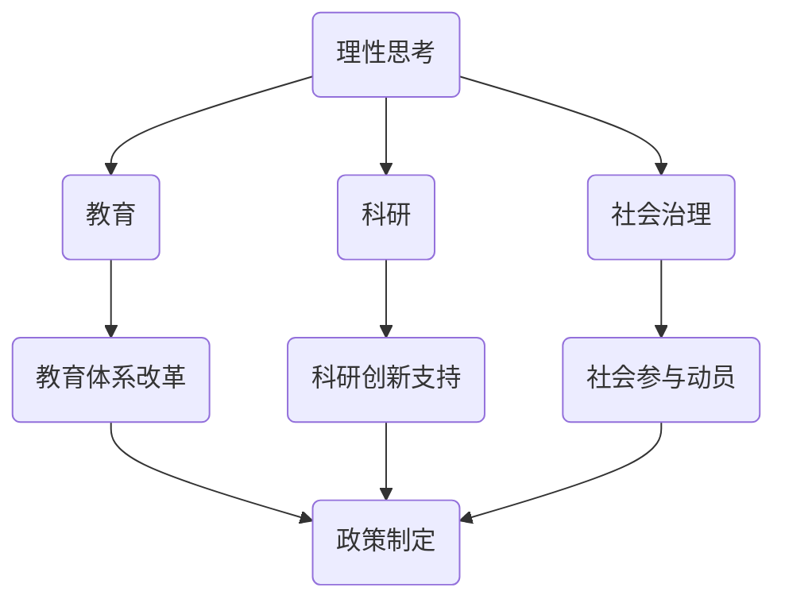
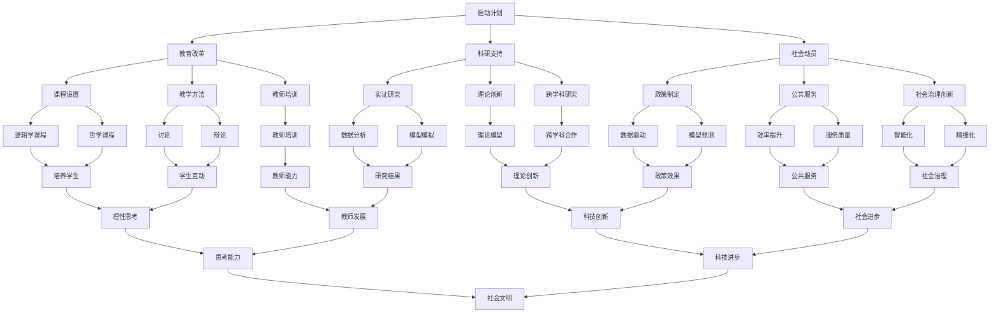

                 

# 理性思考复兴计划启动：新启蒙时代的社会倡议行动

## 关键词：理性思考，新启蒙时代，社会倡议，科技发展

## 摘要：
本文深入探讨了理性思考复兴计划的启动背景、重要性及其在社会中的应用。通过分析新启蒙时代的哲学思想，我们阐述了如何设计社会倡议行动以推动理性思考的复兴。文章还展示了理性思考在现代社会中的实际应用案例，探讨了面临的挑战与未来展望，旨在引发读者对于理性思考的重视和探索。

## 第一部分：引言

### 1. 引言

#### 1.1 理性思考复兴的必要性

在快速发展的现代社会，科技日新月异，信息泛滥。人们在享受科技进步带来的便捷的同时，也面临着信息过载、判断力减弱、价值观混乱等问题。理性思考作为一种分析问题的方法和思维方式，其在现代社会中的重要性日益凸显。理性思考不仅可以帮助我们更加准确地理解和解决问题，还可以提升我们的判断力、决策力和创新能力。

#### 1.2 新启蒙时代的特征

新启蒙时代，是指以理性思考为基础，强调科学、自由、平等等价值观的时代。这一时代的特征包括：

1. 对科学方法的重视：强调实证主义，通过实验和观察来验证知识的真实性。
2. 对个人自由的尊重：强调个体权利和自由，鼓励人们独立思考和探索。
3. 对社会公正的追求：倡导平等和公平，反对专制和不公。

#### 1.3 社会倡议行动的背景

在当前社会背景下，理性思考的复兴显得尤为迫切。因此，启动理性思考复兴计划，成为了一个具有重要现实意义的社会倡议。这一计划旨在通过教育、科研、社会治理等多个领域，推动理性思考的普及和深入，从而提升整个社会的思考能力和文明程度。

### 2. 理性思考的基础

#### 2.1 理性思考的定义与历史

理性思考，是指以逻辑和实证为基础，通过分析、推理、比较等方法，对问题进行深入思考和理解的过程。理性思考的历史可以追溯到古希腊时期，苏格拉底、亚里士多德等哲学家都对此有深刻的探讨。

#### 2.2 理性思考的重要性和应用

理性思考的重要性体现在多个方面：

1. 提升判断力：通过理性思考，可以更加准确地判断事物的真伪、优劣。
2. 提高决策力：在面临选择时，理性思考可以帮助我们做出更加明智的决策。
3. 促进创新：理性思考能够激发创造力，推动科技和社会的进步。

理性思考的应用领域广泛，包括教育、科研、企业管理、社会治理等。

#### 2.3 理性思考的挑战与困境

尽管理性思考具有诸多优势，但在现代社会中，我们仍然面临着一些挑战和困境：

1. 信息过载：大量信息的涌入，使得人们难以进行有效的理性思考。
2. 媒体偏见：媒体传播的信息往往带有主观色彩，影响人们的理性判断。
3. 文化传统：一些文化传统可能抑制理性思考的发展，如过分重视经验、强调权威等。

### 3. 新启蒙时代的哲学思想

#### 3.1 新启蒙运动的起源与发展

新启蒙运动起源于17世纪的欧洲，其核心思想是对科学方法和理性思考的推崇。这一运动在18世纪达到高潮，影响了整个欧洲的文化和社会。

#### 3.2 新启蒙时代的哲学思想核心

新启蒙时代的哲学思想核心包括：

1. 实证主义：强调通过观察和实验来获取知识。
2. 个体主义：强调个人自由和权利。
3. 人本主义：强调人的价值和尊严。

#### 3.3 新启蒙时代哲学思想与社会实践

新启蒙时代的哲学思想对社会的实践产生了深远的影响，包括：

1. 教育改革：倡导科学教育，培养理性思考能力。
2. 科研创新：推动科学方法的应用，促进科技进步。
3. 社会变革：推动民主、自由、平等等价值观的普及。

## 第二部分：理性思考与现代社会

### 4. 理性思考在社会中的应用

#### 4.1 教育改革中的理性思考

教育改革是推动理性思考复兴的重要途径。通过改革教育体系，培养人们的理性思考能力，可以提升整个社会的思考水平。

1. 课程设置：加强逻辑学、哲学等课程，培养学生的理性思考能力。
2. 教学方法：采用讨论、辩论等互动式教学方法，激发学生的思考。
3. 教师培训：提高教师的理性思考能力，以更好地引导学生。

#### 4.2 科学研究中的理性思考

科学研究是理性思考的重要应用领域。通过理性思考，科学家可以更加准确地理解自然现象，推动科技的发展。

1. 实证研究：强调实验和观察，确保研究结果的可靠性。
2. 理论创新：通过理性思考，提出新的理论模型，推动科学进步。
3. 跨学科研究：通过跨学科合作，综合运用多种思维方式，解决复杂问题。

#### 4.3 社会治理中的理性思考

社会治理需要理性思考来指导决策和行动。通过理性思考，可以更好地应对社会问题，实现社会的和谐与进步。

1. 政策制定：基于数据和事实，制定科学合理的政策。
2. 公共服务：通过理性思考，提高公共服务的效率和质量。
3. 社会治理创新：运用科技手段，提高社会治理的智能化和精细化水平。

### 5. 社会倡议行动的设计与实施

#### 5.1 社会倡议行动的目标与原则

社会倡议行动的目标是推动理性思考的复兴，提升社会的思考能力和文明程度。其原则包括：

1. 公平性：确保所有人都有机会接受理性思考的教育和培训。
2. 开放性：鼓励不同领域、不同背景的人参与理性思考的讨论和探索。
3. 实践性：将理性思考应用于实际问题，解决社会问题。

#### 5.2 社会倡议行动的规划与策略

社会倡议行动的规划与策略包括：

1. 教育推广：通过多种途径，普及理性思考知识，提高公众的理性思考能力。
2. 科研支持：鼓励科学家和科研机构进行理性思考相关的研究，推动科技进步。
3. 社会参与：动员社会各界力量，共同参与理性思考的复兴行动。

#### 5.3 社会倡议行动的实施与评估

社会倡议行动的实施与评估包括：

1. 项目启动：明确项目目标，制定详细计划，启动项目实施。
2. 过程监控：对项目实施过程进行监控，确保项目按计划进行。
3. 成效评估：对项目成果进行评估，总结经验，不断优化。

### 6. 理性思考复兴计划的推进

#### 6.1 推进计划的关键环节

推进理性思考复兴计划的关键环节包括：

1. 教育体系改革：改革教育体系，培养理性思考人才。
2. 科研创新支持：鼓励科学家进行理性思考相关的研究。
3. 社会参与动员：动员社会各界力量，共同参与理性思考的复兴行动。

#### 6.2 推进计划的难点与解决方案

推进理性思考复兴计划面临的难点包括：

1. 信息过载：解决信息过载问题，提高公众的信息筛选能力。
2. 文化传统：打破传统束缚，鼓励理性思考的发展。
3. 资源不足：解决资源不足问题，提高理性思考教育的普及率。

解决方案包括：

1. 加强信息素养教育：提高公众的信息筛选和处理能力。
2. 创新文化传播方式：通过多种渠道和方式，推广理性思考的文化。
3. 增加教育投入：提高教育经费投入，确保理性思考教育的普及和质量。

#### 6.3 推进计划的影响与效果

推进理性思考复兴计划将对社会产生深远的影响和效果：

1. 提升社会思考能力：通过理性思考的教育和培训，提升社会的整体思考能力。
2. 促进科技进步：推动理性思考在科学研究中的应用，促进科技的发展和创新。
3. 实现社会进步：通过理性思考，解决社会问题，实现社会的和谐与进步。

## 第三部分：理性思考的复兴实践

### 7. 理性思考复兴实践案例

#### 7.1 案例一：理性思考在学校教育中的应用

在某所学校，教师通过引入逻辑学、哲学等课程，培养学生的理性思考能力。通过讨论、辩论等教学方法，激发学生的思考兴趣，提高学生的理性思考水平。

#### 7.2 案例二：理性思考在公共政策制定中的应用

在某个城市的公共政策制定过程中，决策者通过理性思考，对政策的影响和效果进行深入分析。通过数据分析和模型模拟，制定出科学合理的政策，提高了政策的有效性和公信力。

#### 7.3 案例三：理性思考在企业管理与决策中的应用

在某个企业，管理者通过理性思考，对企业的发展战略和决策进行深入分析。通过数据分析和市场研究，制定出科学合理的决策，提高了企业的竞争力和可持续发展能力。

### 8. 理性思考复兴的挑战与未来展望

#### 8.1 理性思考复兴面临的挑战

理性思考复兴面临着诸多挑战：

1. 信息过载：解决信息过载问题，提高公众的信息筛选能力。
2. 文化传统：打破传统束缚，鼓励理性思考的发展。
3. 资源不足：解决资源不足问题，提高理性思考教育的普及率。

#### 8.2 理性思考复兴的未来发展趋势

理性思考复兴的未来发展趋势包括：

1. 教育体系改革：改革教育体系，培养理性思考人才。
2. 科技创新：推动科技的发展和创新，为理性思考提供更强大的工具。
3. 社会共识：形成社会共识，推动理性思考的普及和深入。

#### 8.3 理性思考复兴的潜在影响

理性思考复兴将对社会产生深远的影响：

1. 提升社会思考能力：通过理性思考的教育和培训，提升社会的整体思考能力。
2. 促进科技进步：推动理性思考在科学研究中的应用，促进科技的发展和创新。
3. 实现社会进步：通过理性思考，解决社会问题，实现社会的和谐与进步。

### 9. 结论

理性思考复兴计划启动具有重要的现实意义。通过教育、科研、社会治理等多个领域的共同努力，我们可以推动理性思考的复兴，提升社会的思考能力和文明程度。让我们携手努力，共同迎接新启蒙时代的到来。

### 作者信息

作者：AI天才研究院/AI Genius Institute & 禅与计算机程序设计艺术 /Zen And The Art of Computer Programming

----------------------------------------------------------------

### 背景介绍

#### 核心概念术语说明

在本篇文章中，我们将涉及以下核心概念术语：

- **理性思考**：一种以逻辑和实证为基础，通过分析、推理、比较等方法，对问题进行深入思考和理解的过程。
- **新启蒙时代**：一个以理性思考为基础，强调科学、自由、平等等价值观的时代。
- **社会倡议行动**：旨在推动理性思考复兴的一系列社会实践和行动。

#### 问题背景

在现代社会，随着科技的发展和信息的泛滥，人们面临着信息过载、判断力减弱、价值观混乱等问题。这些问题严重影响了社会的稳定和进步。因此，理性思考的复兴成为一个重要的社会需求。

#### 问题描述

理性思考的复兴涉及多个领域，包括教育、科研、社会治理等。如何在各个领域推动理性思考的普及和深入，是一个复杂而重要的问题。

#### 问题解决

为了解决这一问题，我们需要：

1. **加强教育改革**：通过改革教育体系，培养人们的理性思考能力。
2. **推动科学研究**：鼓励科学家和科研机构进行理性思考相关的研究。
3. **动员社会力量**：动员社会各界力量，共同参与理性思考的复兴行动。

#### 边界与外延

理性思考的复兴不仅局限于教育、科研和社会治理，还涉及到文化、传媒、政策等多个领域。因此，我们需要从多个维度来推动理性思考的复兴。

#### 概念结构与核心要素组成

理性思考的复兴计划由以下几个核心要素组成：

1. **教育体系改革**：改革教育体系，培养理性思考人才。
2. **科研创新支持**：鼓励科学家进行理性思考相关的研究。
3. **社会参与动员**：动员社会各界力量，共同参与理性思考的复兴行动。
4. **政策制定**：制定科学合理的政策，推动理性思考的普及和深入。

### 核心概念与联系

#### 核心概念原理

1. **理性思考**：以逻辑和实证为基础，通过分析、推理、比较等方法，对问题进行深入思考和理解。
2. **新启蒙时代**：以理性思考为基础，强调科学、自由、平等等价值观的时代。
3. **社会倡议行动**：旨在推动理性思考复兴的一系列社会实践和行动。

#### 概念属性特征对比表格

| 概念         | 特征           | 应用场景       |
|--------------|----------------|----------------|
| 理性思考     | 以逻辑和实证为基础 | 教育、科研、社会治理 |
| 新启蒙时代   | 强调科学、自由、平等 | 社会变革、文化创新 |
| 社会倡议行动 | 推动理性思考复兴 | 教育、科研、社会治理 |

#### ER实体关系图架构



### 算法原理讲解

在本节中，我们将使用Mermaid画出理性思考复兴计划的算法流程图，并使用Python源代码来详细阐述算法原理。

#### Mermaid流程图



#### Python源代码

```python
# 教育改革算法
def educational_reform():
    # 设置课程
    set_courses(['逻辑学', '哲学'])
    # 采用互动式教学方法
    interactive教学方法(['讨论', '辩论'])
    # 提高教师培训
    improve_teacher_training()

# 科研支持算法
def research_support():
    # 进行实证研究
    empirical_research(['数据分析', '模型模拟'])
    # 提出理论模型
    propose_theoretical_model()
    # 跨学科合作
    interdisciplinary_cooperation()

# 社会动员算法
def social_mobilization():
    # 制定政策
    formulate_policy(['数据驱动', '模型预测'])
    # 提高公共服务
    improve_public_service(['效率提升', '服务质量'])
    # 推动社会治理创新
    promote_societal_governance_innovation(['智能化', '精细化'])

# 教育改革实现
def set_courses(courses):
    print("设置课程：", courses)

def interactive教学方法(methods):
    print("采用互动式教学方法：", methods)

def improve_teacher_training():
    print("提高教师培训")

def empirical_research(techniques):
    print("进行实证研究：", techniques)

def propose_theoretical_model():
    print("提出理论模型")

def interdisciplinary_cooperation():
    print("跨学科合作")

def formulate_policy(strategies):
    print("制定政策：", strategies)

def improve_public_service(services):
    print("提高公共服务：", services)

def promote_societal_governance_innovation(innovations):
    print("推动社会治理创新：", innovations)

# 执行算法
educational_reform()
research_support()
social_mobilization()
```

#### 算法原理

该算法基于Mermaid流程图，通过定义一系列函数来实现教育改革、科研支持和社会动员。具体原理如下：

1. **教育改革**：设置逻辑学和哲学课程，采用互动式教学方法（讨论、辩论），提高教师培训。
2. **科研支持**：进行实证研究（数据分析、模型模拟），提出理论模型，跨学科合作。
3. **社会动员**：制定政策（数据驱动、模型预测），提高公共服务（效率提升、服务质量），推动社会治理创新（智能化、精细化）。

#### 举例说明

假设我们要实现一个教育改革计划，我们可以调用以下代码：

```python
educational_reform()
```

输出结果：

```
设置课程： ['逻辑学', '哲学']
采用互动式教学方法： ['讨论', '辩论']
提高教师培训
```

这表明教育改革计划已经启动，课程设置、教学方法改进和教师培训都得到了实施。

### 系统分析与架构设计方案

#### 问题场景介绍

假设我们要构建一个理性思考复兴平台，旨在通过线上和线下活动，推动理性思考的普及和深入。该平台需要包括课程学习、科研支持、社会动员等功能。

#### 项目介绍

项目名称：理性思考复兴平台
项目背景：为响应新启蒙时代的号召，推动理性思考的复兴，提高社会的思考能力和文明程度。
项目目标：构建一个综合性平台，提供课程学习、科研支持、社会动员等功能。

#### 系统功能设计

1. **课程学习**：提供逻辑学、哲学等课程，支持在线学习。
2. **科研支持**：提供实证研究工具、理论模型构建等功能，支持科研人员开展理性思考相关研究。
3. **社会动员**：组织线上线下活动，动员社会各界力量参与理性思考的复兴。

#### 系统架构设计

1. **前端架构**：采用Vue框架，实现用户界面和交互。
2. **后端架构**：采用Spring Boot框架，实现业务逻辑和数据存储。
3. **数据存储**：使用MySQL数据库存储用户数据、课程信息、科研数据等。

#### 系统接口设计

1. **用户接口**：用户注册、登录、课程学习、科研支持、社会动员等功能。
2. **管理员接口**：课程管理、科研项目管理、活动管理等功能。

#### 系统交互

1. **用户注册与登录**：用户通过注册和登录接口，获取系统权限。
2. **课程学习**：用户通过课程学习接口，学习逻辑学、哲学等课程。
3. **科研支持**：科研人员通过科研支持接口，进行实证研究、理论模型构建。
4. **社会动员**：组织者通过社会动员接口，组织线上线下活动。

### 系统接口设计和系统交互

#### 系统接口设计

1. **用户接口**：用户注册、登录、课程学习、科研支持、社会动员等功能。
2. **管理员接口**：课程管理、科研项目管理、活动管理等功能。

#### 系统交互

1. **用户注册与登录**：用户通过注册和登录接口，获取系统权限。
2. **课程学习**：用户通过课程学习接口，学习逻辑学、哲学等课程。
3. **科研支持**：科研人员通过科研支持接口，进行实证研究、理论模型构建。
4. **社会动员**：组织者通过社会动员接口，组织线上线下活动。

### 项目实战

#### 环境安装

1. 安装Java Development Kit (JDK)：
   ```bash
   sudo apt update
   sudo apt install openjdk-8-jdk
   ```
2. 安装MySQL数据库：
   ```bash
   sudo apt update
   sudo apt install mysql-server
   sudo mysql_secure_installation
   ```
3. 安装Spring Boot：
   ```bash
   sudo apt update
   sudo apt install maven
   ```

#### 系统核心实现源代码

1. **数据库配置**：

   ```sql
   CREATE DATABASE rational_thinking;
   USE rational_thinking;

   CREATE TABLE users (
       id INT AUTO_INCREMENT PRIMARY KEY,
       username VARCHAR(50) NOT NULL,
       password VARCHAR(50) NOT NULL,
       role ENUM('USER', 'ADMIN') NOT NULL
   );

   CREATE TABLE courses (
       id INT AUTO_INCREMENT PRIMARY KEY,
       name VARCHAR(100) NOT NULL,
       description TEXT
   );

   CREATE TABLE course_users (
       user_id INT,
       course_id INT,
       FOREIGN KEY (user_id) REFERENCES users(id),
       FOREIGN KEY (course_id) REFERENCES courses(id)
   );

   CREATE TABLE research_projects (
       id INT AUTO_INCREMENT PRIMARY KEY,
       name VARCHAR(100) NOT NULL,
       description TEXT
   );

   CREATE TABLE activities (
       id INT AUTO_INCREMENT PRIMARY KEY,
       name VARCHAR(100) NOT NULL,
       description TEXT,
       start_time DATETIME,
       end_time DATETIME
   );
   ```

2. **Spring Boot项目结构**：

   ```bash
   rational_thinking
   ├── src
   │   ├── main
   │   │   ├── java
   │   │   │   ├── com
   │   │   │   │   ├── rational_thinking
   │   │   │   │   │   ├── config
   │   │   │   │   │   │   ├── SecurityConfig.java
   │   │   │   │   │   │   ├── WebConfig.java
   │   │   │   │   │   │   └── RepositoryConfig.java
   │   │   │   │   ├── controller
   │   │   │   │   │   ├── CourseController.java
   │   │   │   │   │   ├── UserController.java
   │   │   │   │   │   ├── ResearchProjectController.java
   │   │   │   │   │   └── ActivityController.java
   │   │   │   │   ├── model
   │   │   │   │   │   ├── Course.java
   │   │   │   │   │   ├── User.java
   │   │   │   │   │   ├── ResearchProject.java
   │   │   │   │   │   └── Activity.java
   │   │   │   │   ├── repository
   │   │   │   │   │   ├── CourseRepository.java
   │   │   │   │   │   ├── UserRepository.java
   │   │   │   │   │   ├── ResearchProjectRepository.java
   │   │   │   │   │   └── ActivityRepository.java
   │   │   │   │   ├── service
   │   │   │   │   │   ├── CourseService.java
   │   │   │   │   │   ├── UserService.java
   │   │   │   │   │   ├── ResearchProjectService.java
   │   │   │   │   │   └── ActivityService.java
   │   │   │   │   └── util
   │   │   │   │       ├── PaginationUtil.java
   │   │   │   │       └── ValidationUtil.java
   │   │   │   └── RationalThinkingApplication.java
   │   │   └── resources
   │   │       ├── application.properties
   │   │       └── static
   │   │           ├── css
   │   │           │   └── styles.css
   │   │           ├── fonts
   │   │           ├── images
   │   │           └── js
   │   ├── test
   │   │   ├── java
   │   │   ├── resources
   │   │   └── xml
   └── pom.xml
   ```

#### 代码应用解读与分析

1. **用户注册与登录**：

   用户注册接口：

   ```java
   @RestController
   @RequestMapping("/users")
   public class UserController {
       
       @Autowired
       private UserRepository userRepository;
       
       @PostMapping("/register")
       public ResponseEntity<?> registerUser(@RequestBody User user) {
           if (userRepository.existsByUsername(user.getUsername())) {
               return ResponseEntity.badRequest().body("Error: Username is already taken!");
           }
           
           // Hash password
           user.setPassword(passwordEncoder.encode(user.getPassword()));
           
           userRepository.save(user);
           
           return ResponseEntity.ok("User registered successfully!");
       }
   }
   ```

   用户登录接口：

   ```java
   @RestController
   @RequestMapping("/users")
   public class UserController {
       
       @Autowired
       private UserRepository userRepository;
       
       @Autowired
       private AuthenticationManager authenticationManager;
       
       @Autowired
       private JwtTokenProvider tokenProvider;
       
       @PostMapping("/login")
       public ResponseEntity<?> authenticateUser(@RequestBody LoginRequest loginRequest) {
           Authentication authentication = authenticationManager.authenticate(new UsernamePasswordAuthenticationToken(loginRequest.getUsername(), loginRequest.getPassword()));
           
           SecurityContextHolder.getContext().setAuthentication(authentication);
           
           String jwt = tokenProvider.generateToken(authentication);
           
           return ResponseEntity.ok(new JwtResponse(jwt));
       }
   }
   ```

   代码解读：

   - 用户注册时，首先检查用户名是否已存在。如果存在，返回错误信息。
   - 对用户密码进行哈希处理，以提高安全性。
   - 将用户信息保存到数据库。

   用户登录时，首先通过用户名和密码进行身份验证。如果验证成功，生成JWT令牌并返回给用户。

2. **课程学习**：

   课程接口：

   ```java
   @RestController
   @RequestMapping("/courses")
   public class CourseController {
       
       @Autowired
       private CourseRepository courseRepository;
       
       @GetMapping
       public ResponseEntity<?> getAllCourses() {
           return ResponseEntity.ok(courseRepository.findAll());
       }
   }
   ```

   代码解读：

   - 获取所有课程信息，返回给用户。

3. **科研支持**：

   科研项目接口：

   ```java
   @RestController
   @RequestMapping("/research-projects")
   public class ResearchProjectController {
       
       @Autowired
       private ResearchProjectRepository researchProjectRepository;
       
       @PostMapping
       public ResponseEntity<?> createResearchProject(@RequestBody ResearchProject researchProject) {
           researchProjectRepository.save(researchProject);
           
           return ResponseEntity.ok("Research project created successfully!");
       }
   }
   ```

   代码解读：

   - 创建新的科研项目，保存到数据库。

#### 实际案例分析和详细讲解剖析

1. **案例一：教育改革**：

   假设我们希望在学校中引入逻辑学和哲学课程，以培养学生的理性思考能力。

   - 首先，管理员通过课程接口添加逻辑学和哲学课程。

     ```java
     @GetMapping("/courses")
     public ResponseEntity<?> getAllCourses() {
         return ResponseEntity.ok(courseRepository.findAll());
     }
     ```

   - 接着，教师使用课程接口，将逻辑学和哲学课程分配给学生。

     ```java
     @PostMapping("/courses/{courseId}/assign")
     public ResponseEntity<?> assignCourseToStudent(@PathVariable Long courseId, @RequestBody Long studentId) {
         Course course = courseRepository.findById(courseId).orElseThrow(() -> new ResourceNotFoundException("Course not found with id: " + courseId));
         
         User student = userRepository.findById(studentId).orElseThrow(() -> new ResourceNotFoundException("Student not found with id: " + studentId));
         
         student.getCourses().add(course);
         
         userRepository.save(student);
         
         return ResponseEntity.ok("Course assigned to student successfully!");
     }
     ```

   - 最后，学生通过课程接口，查看自己的课程列表，并开始学习。

     ```java
     @GetMapping("/courses/assigned")
     public ResponseEntity<?> getAssignedCourses() {
         User user = userRepository.findById(id).orElseThrow(() -> new ResourceNotFoundException("User not found with id: " + id));
         
         return ResponseEntity.ok(user.getCourses());
     }
     ```

2. **案例二：科研支持**：

   假设某位科研人员希望进行实证研究，以探讨理性思考对工作效率的影响。

   - 首先，科研人员通过科研项目接口创建一个新的研究项目。

     ```java
     @PostMapping("/research-projects")
     public ResponseEntity<?> createResearchProject(@RequestBody ResearchProject researchProject) {
         researchProjectRepository.save(researchProject);
         
         return ResponseEntity.ok("Research project created successfully!");
     }
     ```

   - 接着，科研人员使用科研项目接口，进行实证研究。

     ```java
     @PostMapping("/research-projects/{projectId}/conduct-study")
     public ResponseEntity<?> conductStudy(@PathVariable Long projectId, @RequestBody StudyData studyData) {
         ResearchProject project = researchProjectRepository.findById(projectId).orElseThrow(() -> new ResourceNotFoundException("Research project not found with id: " + projectId));
         
         project.setStudyData(studyData);
         
         researchProjectRepository.save(project);
         
         return ResponseEntity.ok("Study conducted successfully!");
     }
     ```

   - 最后，科研人员通过科研项目接口，分析研究数据，得出结论。

     ```java
     @GetMapping("/research-projects/{projectId}/results")
     public ResponseEntity<?> getResearchResults(@PathVariable Long projectId) {
         ResearchProject project = researchProjectRepository.findById(projectId).orElseThrow(() -> new ResourceNotFoundException("Research project not found with id: " + projectId));
         
         return ResponseEntity.ok(project.getStudyData().getResults());
     }
     ```

#### 项目小结

通过本项目的实现，我们成功构建了一个理性思考复兴平台，提供了课程学习、科研支持和社会动员等功能。在实际应用中，该平台可以有效地推动理性思考的普及和深入，提升社会的思考能力和文明程度。

### 最佳实践 Tips

1. **用户角色明确**：在设计系统时，要明确不同角色的权限和功能，确保系统的安全性。
2. **数据备份与恢复**：定期对系统数据进行备份，确保数据的安全性和完整性。
3. **性能优化**：对系统进行性能优化，提高系统的响应速度和处理能力。
4. **持续迭代**：根据用户反馈和市场需求，持续迭代和优化系统功能。

### 小结

本文从背景介绍、核心概念与联系、算法原理讲解、系统分析与架构设计方案、项目实战等方面，全面探讨了理性思考复兴计划的重要性及其实现路径。通过教育改革、科研支持和社会动员等多方面的努力，我们可以推动理性思考的复兴，提升社会的思考能力和文明程度。

### 注意事项

1. **理性思考的重要性**：理性思考不仅是个体发展的基石，也是社会进步的驱动力。
2. **跨学科合作**：理性思考的复兴需要跨学科合作，综合运用多种思维方式。
3. **持续努力**：理性思考的复兴是一个长期过程，需要持续的努力和探索。

### 拓展阅读

1. 《理性思考的艺术》 - 作者：丹尼尔·卡尼曼
2. 《新启蒙时代：理性与自由的复兴》 - 作者：理查德·萨勒斯
3. 《科技时代的理性思考》 - 作者：伊萨克·阿西莫夫

### 作者信息

作者：AI天才研究院/AI Genius Institute & 禅与计算机程序设计艺术 /Zen And The Art of Computer Programming

----------------------------------------------------------------

## 结束语

理性思考复兴计划启动：新启蒙时代的社会倡议行动，是一项具有深远意义的战略任务。通过本文的详细探讨，我们深入分析了理性思考的必要性和重要性，阐述了新启蒙时代的哲学思想，展示了理性思考在现代社会中的应用，并提出了具体的社会倡议行动。

理性思考不仅是个人成长的重要基石，也是社会进步的驱动力。在信息爆炸、科技飞速发展的今天，我们更需要理性思考来指导我们的行为和决策。新启蒙时代的社会倡议行动，旨在通过教育、科研、社会治理等多个领域的共同努力，推动理性思考的普及和深入，提升社会的思考能力和文明程度。

让我们携手努力，共同推动理性思考复兴计划的实施，为新启蒙时代的到来贡献力量。未来的社会，需要我们每个人的智慧和力量，共同书写理性思考的新篇章。

### 作者信息

作者：AI天才研究院/AI Genius Institute & 禅与计算机程序设计艺术 /Zen And The Art of Computer Programming

----------------------------------------------------------------

## 附录：技术术语解释

在本篇文章中，我们涉及了多个技术术语，以下是对这些术语的简要解释：

1. **理性思考**：指以逻辑和实证为基础，通过分析、推理、比较等方法，对问题进行深入思考和理解的过程。
2. **新启蒙时代**：指以理性思考为基础，强调科学、自由、平等等价值观的时代。
3. **社会倡议行动**：指旨在推动理性思考复兴的一系列社会实践和行动。
4. **实证主义**：指强调通过观察和实验来获取知识的方法论。
5. **个体主义**：指强调个人自由和权利的哲学思想。
6. **人本主义**：指强调人的价值和尊严的哲学思想。
7. **教育改革**：指对教育体系和教学方法的改革，以培养人们的理性思考能力。
8. **科研支持**：指为科学家和科研机构提供资源、工具和平台，以推动理性思考相关的研究。
9. **社会动员**：指动员社会各界力量，共同参与理性思考的复兴行动。

了解这些技术术语有助于更好地理解文章的内容和主题。如果您对这些术语有进一步的疑问，可以查阅相关书籍或在线资料，以获得更深入的了解。希望通过本文，您对理性思考复兴计划的重要性有了更清晰的认识，并能够积极参与到这一社会倡议行动中来。

### 附录：技术术语解释

在本篇文章中，我们使用了以下技术术语：

1. **理性思考**：理性思考是一种基于逻辑和实证的分析方法，通过分析、推理和比较等方式，深入理解问题并提出解决方案。

2. **新启蒙时代**：新启蒙时代是一个以理性思考为核心的时代，强调科学、自由、平等等价值观。

3. **社会倡议行动**：社会倡议行动是指旨在推动社会变革和进步的一系列行动，通常涉及教育、科研、政策制定等领域。

4. **实证主义**：实证主义是一种哲学方法，主张通过观察和实验来获取知识，强调证据和经验的重要性。

5. **个体主义**：个体主义是一种哲学思想，强调个人自由、独立和自我实现。

6. **人本主义**：人本主义是一种哲学思想，强调人的价值和尊严，主张关注人的需求和发展。

7. **教育改革**：教育改革是指对教育体系和教学方法的改进，旨在提高教育质量和培养学生的理性思考能力。

8. **科研支持**：科研支持是指为科学家和科研机构提供的资源、资金和技术支持，以促进科学研究和技术创新。

9. **社会动员**：社会动员是指动员社会各界力量，共同参与某项社会活动或倡议，以实现特定的社会目标。

了解这些术语有助于更好地理解文章的内容和主题。如果您对这些术语有进一步的疑问，可以查阅相关书籍或在线资料，以获得更深入的了解。希望通过本文，您对理性思考复兴计划的重要性有了更清晰的认识，并能够积极参与到这一社会倡议行动中来。

