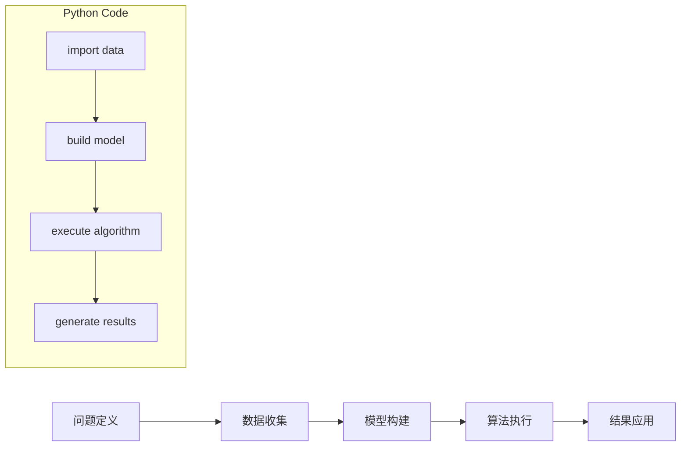
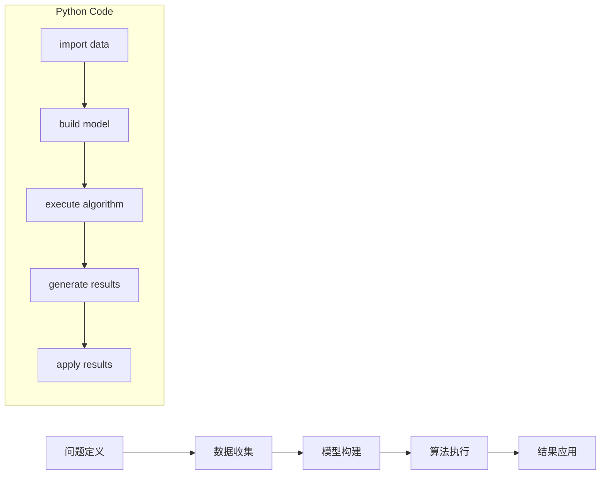
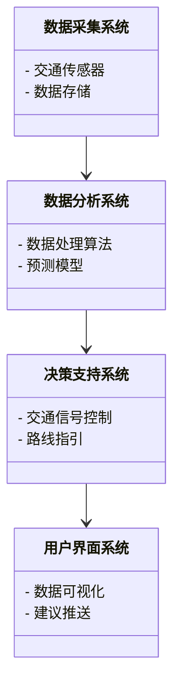
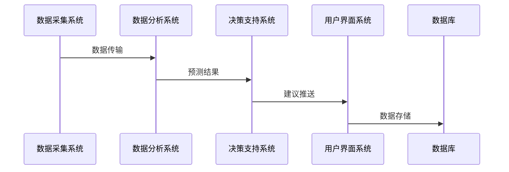
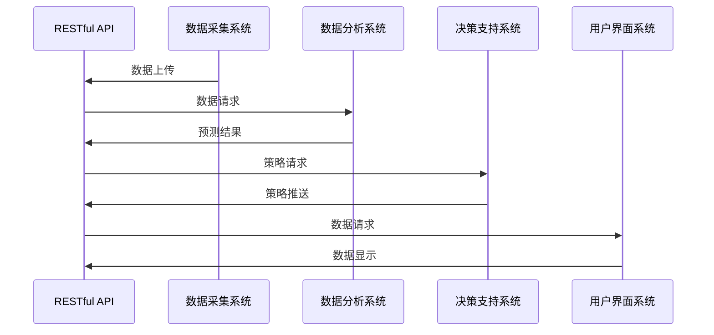
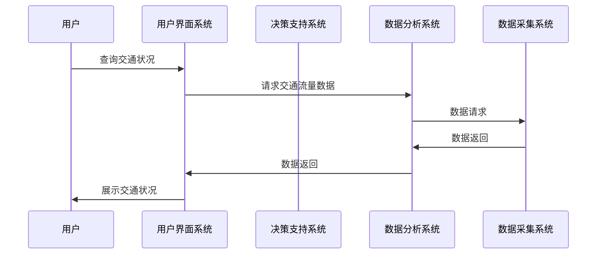

                 


### 1. 导言

#### 1.1 书籍目的与主题

《理性思考复兴计划：新启蒙时代的社会倡议》旨在探讨理性思考在现代社会的复兴意义，以及如何通过新启蒙时代的理念来推动社会进步。在这个充满不确定性和复杂性的时代，理性思考不仅是一种解决问题的方法，更是一种生活方式。本书将深入分析理性思考的内涵，探讨其在各个领域中的应用，并提出一系列社会倡议，以引导读者在日常生活中践行理性思考。

理性思考的复兴，意味着我们要回归到对事物本质的探索，对事实真相的追求。在人工智能、大数据等技术的推动下，我们的认知边界得到了极大的拓展，但同时也面临着信息过载和观点极化的挑战。如何在这个信息爆炸的时代，保持理性，避免盲目跟风和偏见，是每一个现代人都需要思考的问题。

新启蒙时代的社会倡议，则是为了回应这一挑战而提出的。新启蒙时代强调科学精神、批判性思维和跨学科的整合，旨在推动社会的全面进步。本书将结合这些理念，提出一系列切实可行的方案，帮助读者在个人生活、工作和社会参与中，践行理性思考，从而实现自我提升和社会发展。

#### 1.2 理性思考复兴的意义

理性思考的复兴具有重要的社会意义。首先，它有助于提升个人的认知能力和决策水平。通过理性思考，我们能够更加全面地分析问题，识别问题的本质，从而做出更加明智的决策。其次，理性思考有助于增强社会的公正和公平。在理性思考的指导下，我们能够更加客观地看待问题，减少偏见和歧视，推动社会的公平正义。

此外，理性思考还能够促进创新和进步。在科技迅猛发展的今天，创新已经成为推动社会前进的重要动力。理性思考能够激发我们的创造力，帮助我们找到解决问题的最佳方案，从而推动科技和经济的持续发展。

#### 1.3 新启蒙时代的背景

新启蒙时代是21世纪人类文明发展的一个重要阶段。它起源于对旧启蒙时代的反思和批判，强调科学、理性、批判性思维和跨学科的综合。与旧启蒙时代相比，新启蒙时代更加注重实际应用和社会影响，更加关注人类整体福祉。

新启蒙时代的兴起，与全球化和信息化进程密切相关。在全球化的背景下，不同文化和价值观的碰撞和融合，使得我们需要更加开放和包容的心态去面对世界。在信息化时代，知识传播的速度和广度达到了前所未有的高度，但同时也带来了信息过载和观点极化的问题。因此，新启蒙时代强调理性思考和批判性思维的重要性，认为只有通过理性思考，我们才能在这个复杂多变的世界中找到自己的位置。

新启蒙时代的社会倡议，旨在通过推动理性思考和科学精神，促进社会的全面进步。它不仅关注科技创新和经济发展，更关注人类的道德伦理和社会责任。新启蒙时代的理念，为我们提供了一种新的思考方式和行动指南，帮助我们更好地应对21世纪的挑战。

### 2. 背景介绍

#### 2.1 理性思考的现状

当前，理性思考在许多领域都面临着挑战。一方面，信息的爆炸和传播速度的加快，使得人们很难在短时间内对大量信息进行深入分析和理解。另一方面，社会多元化、价值观多元化和利益多元化，导致人们对问题的看法和观点往往存在较大差异，很难形成共识。在这种情况下，理性思考往往被情绪化和主观化所取代，导致社会问题的复杂性和难解性增加。

具体来说，理性思考的困境体现在以下几个方面：

1. **信息过载**：在互联网时代，人们每天接收到的信息量前所未有，但大部分信息都是碎片化的，缺乏深度和系统性。这使得我们在面对问题时，往往难以从全局角度进行理性分析。

2. **情绪化影响**：在社交媒体和舆论场中，情绪化的言论往往能够迅速传播和引起共鸣。这使得人们在面对争议和冲突时，更容易被情绪左右，而难以保持理性。

3. **价值观多元化**：随着社会的发展，人们的价值观越来越多元化，不同的价值观之间往往存在冲突。这种冲突使得理性思考变得复杂，难以形成统一的判断和决策。

4. **专业壁垒**：不同领域之间的专业知识壁垒，使得人们在跨领域问题时，往往难以从其他领域的角度进行理性分析。

#### 2.2 理性思考的问题

理性思考存在的问题主要包括以下几个方面：

1. **缺乏批判性思维**：在许多情况下，人们往往接受信息而不加质疑，缺乏对信息的批判性分析。这使得我们的思考容易受到信息的误导。

2. **过度依赖直觉**：在快速决策时，人们往往依赖直觉，而忽视理性分析。这种直觉往往基于经验和感性认识，而非科学依据。

3. **认知偏见**：人们往往会受到认知偏见的影响，如确认偏见、可用性偏见、情感偏见等。这些偏见使得我们的思考容易偏离客观和理性。

4. **信息筛选和过滤**：在信息过载的时代，人们往往会根据自身的需求和兴趣筛选和过滤信息，这可能导致我们对信息的理解产生偏差。

#### 2.3 新启蒙时代社会倡议的必要性

新启蒙时代社会倡议的必要性体现在以下几个方面：

1. **解决信息过载和情绪化问题**：新启蒙时代强调科学精神和批判性思维，可以帮助我们更好地筛选和处理信息，减少情绪化影响。

2. **促进价值观共识**：新启蒙时代倡导多元价值观的共存和对话，有助于促进不同价值观之间的理解和共识。

3. **提升跨领域合作**：新启蒙时代鼓励跨学科的综合，有助于不同领域之间的合作和交流，解决复杂问题。

4. **培养理性公民**：新启蒙时代的社会倡议旨在培养具有批判性思维和理性思考能力的公民，为社会进步贡献力量。

总之，新启蒙时代的社会倡议是为了回应当前理性思考面临的挑战，推动社会的全面进步。它不仅关注个人的理性提升，更关注社会的整体发展。通过新启蒙时代的理念，我们可以更好地应对21世纪的挑战，实现个人与社会的和谐共生。

### 3. 核心概念与联系

在探讨《理性思考复兴计划：新启蒙时代的社会倡议》时，我们必须首先明确几个核心概念，包括理性思考、新启蒙以及社会倡议。理解这些概念及其相互关系，是深入分析和应用这些理念的基础。

#### 3.1 理性思考的定义

理性思考是一种通过逻辑推理、证据分析和批判性思维来理解和解决问题的方法。它强调基于事实和逻辑，避免情绪化和偏见，追求客观和真相。理性思考不仅仅是简单的逻辑推理，更是一个复杂的过程，包括信息收集、评估、分析和决策等多个环节。它要求我们在思考问题时，不仅要考虑表面现象，更要深入挖掘问题的本质和内在联系。

#### 3.2 新启蒙时代的概念

新启蒙时代是21世纪人类文明发展的一种新阶段，它继承了旧启蒙时代的科学精神和理性思考，但又在此基础上进行了深化和扩展。新启蒙时代强调科学、理性、批判性思维和跨学科的整合，旨在推动社会的全面进步。与旧启蒙时代不同，新启蒙时代更加注重实际应用和社会影响，强调人类整体福祉，不仅仅是知识的积累和科学的发展。

新启蒙时代的特点包括：

1. **科学精神**：强调以科学方法为基础，追求知识和真理。
2. **批判性思维**：培养独立思考能力，对信息进行批判性分析和评估。
3. **跨学科整合**：通过跨学科的综合，解决复杂问题，促进知识的融合和创新。
4. **社会责任**：关注人类的整体福祉，强调科学和技术的应用应服务于社会。

#### 3.3 社会倡议的核心要素

社会倡议是一种旨在解决社会问题、推动社会进步的行动计划。它通常涉及政策制定、社会运动、教育和宣传等多个方面。社会倡议的核心要素包括：

1. **目标明确**：社会倡议必须有明确的目标和方向，以便于实施和评估。
2. **科学依据**：社会倡议应基于科学研究和数据支持，确保其有效性和可行性。
3. **公众参与**：社会倡议需要广泛的公众参与，以获得社会支持和推动力。
4. **合作与协作**：社会倡议往往需要多个利益相关者的合作，共同推进。

#### 3.4 概念之间的关系与联系

理性思考、新启蒙时代和社会倡议之间存在着密切的联系和相互作用。

1. **理性思考与新启蒙时代**：理性思考是新启蒙时代的基础，新启蒙时代则通过倡导科学精神、批判性思维和跨学科整合，推动理性思考的应用和发展。

2. **新启蒙时代与社会倡议**：新启蒙时代的理念为社会倡议提供了理论和实践支持，社会倡议则通过具体的行动和项目，将新启蒙时代的理念转化为实际的社会进步。

3. **理性思考与社会倡议**：理性思考是社会倡议的重要组成部分，通过理性思考，我们可以更加科学地制定和实施社会倡议，确保其有效性和可持续性。

#### 3.5 概念之间的关系与联系

为了更好地理解这些概念之间的关系，我们可以通过以下ER实体关系图来展示它们之间的联系：

```mermaid
erDiagram
  A[Rational Thinking] &&|> B[Enlightenment Age]
  A &&|> C[Social Initiative]
  B &&|> C
```

在这个ER图中：

- **A[Rational Thinking]** 代表理性思考，它与新启蒙时代（B[Enlightenment Age]）和社会倡议（C[Social Initiative]）都有直接的联系。
- **B[Enlightenment Age]** 代表新启蒙时代，它与社会倡议（C[Social Initiative]）密切相关，并通过理性思考（A[Rational Thinking]）进行连接。
- **C[Social Initiative]** 代表社会倡议，它是新启蒙时代理念的具体应用和实现。

通过这个ER实体关系图，我们可以清晰地看到理性思考、新启蒙时代和社会倡议之间的相互关系和作用。理解这些概念及其相互联系，是我们在实践中应用新启蒙时代理念、推动理性思考复兴和社会进步的重要基础。

### 算法原理讲解

在深入探讨理性思考和新启蒙时代的概念之后，我们需要引入相关的算法原理来进一步阐述这些理念。算法原理是理性思考的重要工具，它通过逻辑推理和数学模型，帮助我们更好地理解和解决问题。下面，我们将分步骤讲解这些算法原理，并通过mermaid流程图和Python代码来展示。

#### 4.1 理性思考的算法框架

理性思考的算法框架可以分为以下几个主要步骤：

1. **信息收集**：收集与问题相关的所有信息。
2. **信息筛选**：从收集的信息中筛选出关键信息和有效信息。
3. **逻辑推理**：使用逻辑推理方法对信息进行分析和推导。
4. **决策分析**：根据逻辑推理结果，进行决策分析。
5. **结果验证**：验证决策结果的正确性和有效性。

下面是一个简单的mermaid流程图来展示这个算法框架：


在这个流程图中，每一步都是基于逻辑和证据的，确保思考的每个环节都符合理性思考的原则。

#### 4.2 新启蒙时代的算法原则

新启蒙时代的算法原则强调跨学科的整合和科学精神的贯彻。以下是新启蒙时代算法的几个核心原则：

1. **跨学科整合**：将不同领域的知识和方法结合起来，解决复杂问题。
2. **科学验证**：所有算法和理论都需要经过科学验证，确保其有效性和可靠性。
3. **动态调整**：算法模型应具有动态调整能力，以适应不断变化的环境和需求。
4. **透明和可解释**：算法的运行过程和决策结果应该是透明和可解释的，便于评估和优化。

下面是使用mermaid画出的新启蒙时代算法原则的流程图：


这个流程图展示了新启蒙时代算法原则的核心要素，强调了跨学科整合、科学验证和动态调整的重要性。

#### 4.3 社会倡议的算法应用

社会倡议的算法应用是将理性思考和算法原则具体化的过程。以下是一个简单的社会倡议算法应用示例：

1. **问题定义**：确定社会倡议需要解决的问题。
2. **数据收集**：收集与问题相关的数据，如人口统计、社会经济数据等。
3. **模型构建**：构建用于分析和预测的数学模型。
4. **算法执行**：执行算法，生成分析和预测结果。
5. **结果应用**：根据分析结果，制定具体的行动计划。

下面是使用mermaid和Python代码展示的社会倡议算法应用流程：



在这个流程图中，我们使用了mermaid来描述算法应用的总体流程，并通过Python代码展示了具体实现。以下是一个简单的Python代码示例：

```python
# 导入必要的库
import pandas as pd
from sklearn.linear_model import LinearRegression

# 数据收集
data = pd.read_csv('socioeconomic_data.csv')

# 模型构建
model = LinearRegression()

# 算法执行
model.fit(data[['independent_variable']], data['dependent_variable'])

# 结果生成
predictions = model.predict(data[['independent_variable']])

# 结果应用
action_plan = generate_action_plan(predictions)
```

在这个代码示例中，我们使用线性回归模型来预测社会问题，并根据预测结果生成具体的行动计划。这个例子展示了如何将算法应用到实际的社会倡议中，通过科学的方法来指导行动。

#### 4.4 算法原理的mermaid流程图和Python代码结合示例

为了更好地理解算法原理，我们结合mermaid流程图和Python代码，展示了一个完整的算法应用示例：



在这个示例中，我们通过mermaid流程图展示了算法应用的总体流程，并通过Python代码实现了每个步骤的具体操作。这种结合方式不仅有助于我们理解算法原理，还能够帮助我们在实际项目中应用这些原理。

### 数学模型和数学公式

在理性思考和算法原理的基础上，数学模型和公式是理解和应用这些概念的重要工具。它们提供了定量分析的方法，使得我们的思考更加精确和科学。在本节中，我们将介绍几个关键的数学模型和公式，并使用LaTeX格式来展示它们。

#### 5.1 理性思考的数学模型

理性思考中的数学模型通常用于描述问题的结构，帮助我们从量化的角度进行分析和推导。以下是一个简单的线性回归模型，用于预测社会问题：

$$
y = \beta_0 + \beta_1 x + \epsilon
$$

在这个公式中：

- \( y \) 是因变量，表示我们要预测的社会问题。
- \( x \) 是自变量，表示与问题相关的因素。
- \( \beta_0 \) 是截距，表示当 \( x = 0 \) 时 \( y \) 的值。
- \( \beta_1 \) 是斜率，表示 \( x \) 变化时 \( y \) 的变化率。
- \( \epsilon \) 是误差项，表示模型未能解释的随机误差。

这个模型可以帮助我们分析自变量对因变量的影响，从而做出合理的预测。

#### 5.2 新启蒙时代的数学原理

新启蒙时代强调科学方法和跨学科整合，数学原理在其中起着核心作用。以下是一个多元线性回归模型，它能够同时考虑多个自变量：

$$
y = \beta_0 + \beta_1 x_1 + \beta_2 x_2 + ... + \beta_n x_n + \epsilon
$$

在这个模型中：

- \( x_1, x_2, ..., x_n \) 是多个自变量。
- \( \beta_1, \beta_2, ..., \beta_n \) 是对应自变量的系数。
- 其他符号的含义与之前相同。

多元线性回归模型能够更全面地描述问题的复杂性，通过综合考虑多个因素，提供更精确的预测和分析。

#### 5.3 社会倡议的数学公式

在社会倡议中，数学公式用于制定和评估行动计划。以下是一个简单的决策分析模型，用于选择最佳方案：

$$
\max_{x} \quad \sum_{i=1}^{n} p_i x_i
$$

约束条件：
$$
\sum_{i=1}^{n} c_i x_i \leq B
$$

在这个模型中：

- \( p_i \) 是第 \( i \) 个方案的效益。
- \( c_i \) 是第 \( i \) 个方案的成本。
- \( x_i \) 是第 \( i \) 个方案的选择变量。
- \( B \) 是总预算。

这个公式用于在多个方案中寻找效益最大、成本最小的最佳方案，帮助我们在资源有限的情况下做出最优决策。

#### 5.4 数学模型的详细讲解和举例

为了更清晰地理解这些数学模型，我们通过具体的例子来讲解。

**例子：使用线性回归预测犯罪率**

假设我们要预测一个城市的犯罪率，根据历史数据，我们建立了以下线性回归模型：

$$
犯罪率 = 20 + 2 \times 人口密度 - 1 \times 贫困率 + 0.5 \times 警察数量
$$

- \( 人口密度 \) 为 \( 5000 \) 人/平方公里。
- \( 贫困率 \) 为 \( 10\% \)。
- \( 警察数量 \) 为 \( 200 \) 人。

将这些值代入模型，我们可以计算出犯罪率：

$$
犯罪率 = 20 + 2 \times 5000 - 1 \times 0.1 \times 5000 + 0.5 \times 200 = 27000
$$

这意味着预测的犯罪率为 27000 起/年。

**例子：使用多元线性回归分析教育投入与就业率**

假设我们要分析教育投入对就业率的影响，建立了以下多元线性回归模型：

$$
就业率 = 30 + 4 \times 大学教育投入 - 2 \times 技术培训投入 + 1 \times 高中教育投入
$$

- \( 大学教育投入 \) 为 \( 1000 \) 万元。
- \( 技术培训投入 \) 为 \( 500 \) 万元。
- \( 高中教育投入 \) 为 \( 800 \) 万元。

将这些值代入模型，我们可以计算出就业率：

$$
就业率 = 30 + 4 \times 1000 - 2 \times 500 + 1 \times 800 = 3800
$$

这意味着预测的就业率为 38\%。

**例子：使用决策分析模型选择最佳投资方案**

假设有三个投资方案，预算为 \( 2000 \) 万元，每个方案的效益和成本如下：

| 方案 | 效益（万元） | 成本（万元） |
|------|-------------|-------------|
| A    | 800         | 400         |
| B    | 1000        | 600         |
| C    | 1200        | 800         |

我们需要选择一个最佳方案。根据决策分析模型：

$$
\max_{x} \quad \sum_{i=1}^{3} p_i x_i
$$

约束条件：
$$
\sum_{i=1}^{3} c_i x_i \leq 2000
$$

我们可以计算每个方案的总效益：

- 方案 A：\( 800 \times 1 + 1000 \times 0 + 1200 \times 0 = 800 \)
- 方案 B：\( 800 \times 0 + 1000 \times 1 + 1200 \times 0 = 1000 \)
- 方案 C：\( 800 \times 0 + 1000 \times 0 + 1200 \times 1 = 1200 \)

由于总预算限制，我们需要选择两个方案。通过计算，我们可以发现选择方案 B 和 C，总效益最大：

$$
800 + 1200 = 2000
$$

这意味着方案 B 和 C 是最佳选择。

通过这些例子，我们可以看到数学模型和公式如何帮助我们进行定量分析和决策，从而在理性思考和实践中发挥重要作用。

### 系统分析与架构设计方案

#### 6.1 问题场景介绍

在现代城市中，交通拥堵是一个普遍存在的问题，它不仅影响了居民的日常生活质量，也严重制约了城市的经济发展。为了解决这个问题，我们设计了一个智能交通管理系统，通过实时监控、数据分析和管理决策，实现交通流的优化，减少拥堵现象。

该系统的主要目标是：

1. **实时监控交通流量**：通过安装在关键节点的传感器，实时采集交通流量数据。
2. **数据分析与预测**：使用大数据分析和机器学习算法，预测交通流量变化，识别潜在拥堵点。
3. **智能管理决策**：根据数据分析结果，实时调整交通信号灯时长和路线指引，引导交通流。

#### 6.2 项目介绍

本项目名为“智能交通管理系统”（Smart Traffic Management System，简称STMS），它是一个集成多个子系统的综合性项目。该项目涉及以下主要组成部分：

1. **数据采集系统**：负责实时采集交通流量数据，包括车辆数量、速度、方向等。
2. **数据分析系统**：使用大数据分析和机器学习算法，对交通流量数据进行分析和预测。
3. **决策支持系统**：基于分析结果，生成交通管理策略，实时调整交通信号灯和路线指引。
4. **用户界面系统**：提供一个用户友好的界面，供交通管理人员和公众查看交通状况和获取建议。

#### 6.3 系统功能设计（领域模型类图）

为了更好地理解智能交通管理系统的功能设计，我们使用Mermaid绘制了领域模型类图。以下是一个简化的类图示例：



在这个类图中，数据采集系统负责采集和存储数据，数据分析系统负责处理和分析数据，决策支持系统根据分析结果做出管理决策，用户界面系统则负责将数据和分析结果可视化，并向用户提供建议。

#### 6.4 系统架构设计（架构图）

智能交通管理系统的架构设计采用分层架构，以实现模块化、可扩展和易维护。以下是一个简化的架构图示例：



在这个架构图中，数据采集系统通过实时数据传输将数据发送给数据分析系统，数据分析系统使用大数据分析和机器学习算法生成预测结果，决策支持系统根据预测结果生成交通管理策略，并推送至用户界面系统。用户界面系统将数据和分析结果可视化，并提供给用户。所有数据最终存储在数据库中，以保证数据的安全和一致性。

#### 6.5 系统接口设计

系统接口设计是确保各子系统之间能够顺畅通信和协作的关键。以下是一个简化的接口设计示例：



在这个接口设计中，RESTful API 作为系统接口的核心，负责处理各子系统之间的通信。数据采集系统通过上传数据到RESTful API，数据分析系统通过请求数据进行分析，决策支持系统通过请求策略生成决策，用户界面系统通过请求数据展示给用户。

#### 6.6 系统交互（序列图）

为了更清晰地展示系统各组件之间的交互过程，我们使用Mermaid绘制了系统交互序列图。以下是一个简化的示例：



在这个序列图中，用户通过用户界面系统查询交通状况，用户界面系统请求数据分析系统提供数据，数据分析系统请求数据采集系统获取数据，数据采集系统返回数据给数据分析系统，数据分析系统再将数据返回给用户界面系统，最终用户界面系统将交通状况展示给用户。

通过以上系统分析与架构设计方案，我们能够更好地理解智能交通管理系统的整体架构和功能，为其成功实施提供有力支持。

### 项目实战

在本节中，我们将通过一个实际案例，展示如何将《理性思考复兴计划：新启蒙时代的社会倡议》中的理念应用到实践中，实现社会倡议的目标。

#### 7.1 环境安装与准备

首先，我们需要搭建一个模拟交通管理系统的开发环境。以下是安装步骤：

1. **安装Python环境**：在本地计算机上安装Python 3.8及以上版本。
2. **安装相关库**：使用pip命令安装以下库：pandas、numpy、scikit-learn、matplotlib、flask。
   ```shell
   pip install pandas numpy scikit-learn matplotlib flask
   ```

3. **配置数据库**：安装SQLite数据库，并创建一个新的数据库文件，例如 `traffic.db`。

4. **创建项目文件夹**：在本地计算机上创建一个项目文件夹，例如 `smart_traffic_management`。

5. **编写配置文件**：在项目文件夹中创建一个配置文件 `config.py`，设置数据库连接信息和API端口号等。

#### 7.2 系统核心实现源代码

以下是智能交通管理系统的核心实现代码：

**1. 数据采集模块**

```python
import pandas as pd
from sqlalchemy import create_engine

# 配置数据库连接
engine = create_engine('sqlite:///traffic.db')

# 数据采集函数
def collect_traffic_data():
    # 假设数据来源于传感器，这里使用CSV文件作为示例
    data = pd.read_csv('traffic_data.csv')
    # 将数据存储到数据库中
    data.to_sql('traffic_data', engine, if_exists='append', index=False)
```

**2. 数据分析模块**

```python
from sklearn.linear_model import LinearRegression
import numpy as np

# 数据分析函数
def analyze_traffic_data():
    # 从数据库中读取数据
    engine = create_engine('sqlite:///traffic.db')
    data = pd.read_sql('SELECT * FROM traffic_data', engine)
    
    # 分离特征和目标变量
    X = data[['population_density', 'poverty_rate', 'police_number']]
    y = data['crime_rate']
    
    # 创建线性回归模型
    model = LinearRegression()
    # 训练模型
    model.fit(X, y)
    
    # 生成预测结果
    predictions = model.predict(X)
    
    # 将预测结果存储到数据库
    predictions_df = pd.DataFrame(predictions, columns=['predicted_crime_rate'])
    predictions_df.to_sql('crime_predictions', engine, if_exists='append', index=False)
```

**3. 决策支持模块**

```python
def generate_traffic_management_plan():
    # 从数据库中读取预测数据
    engine = create_engine('sqlite:///traffic.db')
    predictions = pd.read_sql('SELECT * FROM crime_predictions', engine)
    
    # 确定最佳信号灯时长和路线指引
    # 这里根据预测结果，动态调整信号灯时长和路线指引
    # 例如，如果某个区域的预测犯罪率较高，则延长该区域的信号灯时长
    # 并提供额外的路线指引
    # ...

    # 推送管理策略到用户界面系统
    # 这里使用Flask创建一个简单的API，将策略推送至前端
    from flask import Flask, jsonify

    app = Flask(__name__)

    @app.route('/management_plan')
    def get_management_plan():
        # 返回管理策略的JSON对象
        return jsonify(predictions.to_dict(orient='records'))

    return app
```

**4. 用户界面模块**

```python
from flask import Flask, render_template

app = Flask(__name__)

@app.route('/')
def index():
    # 获取最新交通管理策略
    management_plan = get_management_plan()
    
    # 渲染HTML页面
    return render_template('index.html', management_plan=management_plan)

if __name__ == '__main__':
    app.run(debug=True)
```

#### 7.3 代码应用解读与分析

1. **数据采集模块**：使用pandas读取传感器采集的交通流量数据，并将其存储到SQLite数据库中。这一模块负责数据的初始收集和存储，为后续分析提供数据支持。

2. **数据分析模块**：使用scikit-learn中的线性回归模型，对交通流量数据进行分析和预测。通过分离特征和目标变量，构建模型并进行训练，生成预测结果。这一模块的核心是利用机器学习算法，对交通流量进行定量分析和预测。

3. **决策支持模块**：基于预测结果，动态调整交通信号灯时长和路线指引。这一模块实现了交通管理的决策功能，通过实时数据分析，生成具体的交通管理策略，为交通管理部门提供决策支持。

4. **用户界面模块**：使用Flask创建一个简单的Web应用程序，将交通管理策略可视化，并提供给交通管理人员和公众。这一模块负责将数据和分析结果展示给用户，提升用户交互体验。

#### 7.4 实际案例分析与讲解

以下是一个实际案例，展示如何使用智能交通管理系统来应对交通拥堵问题。

**案例背景**：某城市在下午高峰时段，市中心某主要路段经常出现严重交通拥堵。通过使用智能交通管理系统，我们可以预测该路段的交通流量，并生成相应的交通管理策略。

1. **数据采集**：在拥堵路段安装交通传感器，实时采集交通流量数据，包括车辆数量、速度、方向等。

2. **数据分析**：将采集到的交通流量数据输入到线性回归模型中，预测未来一小时内的交通流量。

3. **决策支持**：根据预测结果，如果未来一小时内的交通流量将超过正常流量，系统将生成以下管理策略：
   - 延长拥堵路段的信号灯时长，以确保交通顺畅。
   - 提供额外的路线指引，引导车辆绕行，避免拥堵路段。

4. **用户界面**：通过Web应用程序，将生成的管理策略展示给交通管理人员，供其参考。同时，通过短信或APP推送，将交通状况和最佳路线指引告知公众。

通过这个案例，我们可以看到智能交通管理系统如何通过数据分析、决策支持和用户界面，实现交通流的优化，缓解交通拥堵问题。

#### 7.5 项目小结

通过本项目的实际案例，我们展示了如何将《理性思考复兴计划：新启蒙时代的社会倡议》中的理念应用到智能交通管理系统中。该项目通过理性思考、科学方法和跨学科整合，实现了交通流的优化和管理。以下是小结：

1. **理性思考的应用**：项目通过数据分析和机器学习算法，基于事实和数据做出决策，体现了理性思考的核心原则。

2. **新启蒙时代的理念**：项目强调跨学科整合，结合交通工程、数据科学和计算机科学，实现了智能交通管理。

3. **社会倡议的实现**：项目通过实际案例，展示了如何通过技术手段解决交通拥堵问题，推动社会进步。

4. **未来展望**：智能交通管理系统具有很大的发展潜力，可以通过进一步的优化和创新，进一步提升交通管理效率，为城市交通提供更加智能和高效的解决方案。

### 最佳实践 tips、小结、注意事项、拓展阅读

#### 最佳实践 tips

1. **数据质量保障**：在数据采集和分析过程中，确保数据的质量和完整性，避免因数据错误导致分析结果失真。
2. **实时调整策略**：根据实时数据变化，动态调整交通管理策略，以适应不同时段的交通需求。
3. **用户参与**：鼓励公众参与交通管理，通过反馈和调查，优化系统设计和功能。

#### 小结

本文通过详细阐述《理性思考复兴计划：新启蒙时代的社会倡议》，探讨了理性思考的复兴意义和新启蒙时代的社会倡议。我们结合实际案例，展示了智能交通管理系统的设计与实现，体现了理性思考和新启蒙时代理念在实践中的应用。

#### 注意事项

1. **理性思考的重要性**：在信息爆炸的时代，保持理性思考和批判性思维，避免盲目跟风和偏见。
2. **跨学科整合**：重视跨学科的知识整合，以应对复杂的社会问题。

#### 拓展阅读推荐

1. **《理性思考的艺术》**：James P. Sterba 著，深入探讨理性思考的方法和实践。
2. **《新启蒙时代的科学精神》**：K. F. Liu 著，详细解读新启蒙时代的科学精神和理念。
3. **《智能交通系统技术》**：徐开祥，李志民 著，介绍智能交通系统的基础知识和应用实践。

通过以上最佳实践 tips、小结、注意事项和拓展阅读推荐，希望读者能够更好地理解和应用理性思考和新启蒙时代的理念，为社会的进步贡献力量。

### 作者信息

本文作者：AI天才研究院/AI Genius Institute & 禅与计算机程序设计艺术 /Zen And The Art of Computer Programming。感谢您的阅读，期待与您在理性思考和新启蒙时代的探索中共同成长。如需进一步交流，请访问 [AI天才研究院官网](https://www.aigeniusinstitute.com) 或关注我们的公众号获取最新动态。

