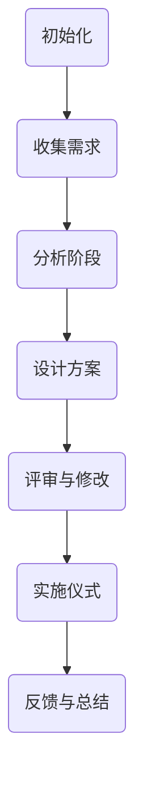

                 


### 背景介绍

在现代社会的快节奏生活中，人们的生命仪式逐渐被简化和忽视。从出生到成年，从婚姻到老年，这些本应重要的生命转折点，往往只是简单地办一个手续或仪式，缺乏深刻的仪式感和文化内涵。这种现象引发了人们对于生命仪式设计的关注和思考。生命仪式不仅仅是形式上的庆祝，更是一种精神层面的传承和启蒙。

**核心概念术语说明**：
- **生命仪式**：指人们在不同生命阶段所举行的仪式，如出生仪式、成年仪式、婚礼、葬礼等。
- **仪式设计**：指的是为特定群体或个人策划和安排的仪式流程，包括仪式的内容、形式、程序等。
- **策划师**：专业从事仪式设计的人员，他们需要具备深厚的文化底蕴、策划能力和创意思维。

**问题背景**：
随着社会的发展和文化的变迁，传统的生命仪式逐渐失去了其原有的意义和仪式感。现代人往往追求效率和便利，而忽略了生命仪式中蕴含的文化价值和精神内涵。这导致了生命仪式的简化甚至消失，人们逐渐失去了对生命重要时刻的敬畏和纪念。

**问题描述**：
如何设计现代人生命阶段的仪式，使其既具有仪式感，又符合现代社会的需求和价值观，同时传承和弘扬传统文化，成为我们面临的一个重要问题。

**问题解决**：
建立生命仪式策划师协会，汇聚专业人才，通过对生命仪式的研究和设计，提供符合现代人需求的仪式方案。协会的工作包括：
- 研究和传承传统生命仪式的文化内涵。
- 根据现代社会的需求，创新和设计新的生命仪式。
- 对现有的生命仪式进行优化和改进。

**边界与外延**：
生命仪式策划师协会的工作不仅局限于传统仪式的恢复和创新，还包括对新兴仪式形式的研究，如虚拟仪式、跨文化仪式等。同时，协会还关注生命仪式在不同群体中的应用，如残疾人、老年人等特殊群体的仪式设计。

**概念结构与核心要素组成**：
生命仪式策划师协会的核心概念结构包括：
- 生命仪式策划师：协会的核心成员，负责仪式设计工作。
- 仪式设计：协会的工作核心，包括仪式内容的策划、流程的安排等。
- 仪式研究：协会的基础工作，涉及对传统仪式的研究和现代仪式的创新设计。
- 社区服务：协会的服务宗旨，通过提供仪式设计方案，服务于不同群体的需求。

### 核心概念与联系

**核心概念原理**：

1. **生命仪式策划师**：
   生命仪式策划师是专门从事生命仪式设计、策划和实施的专业人士。他们的工作不仅包括对传统仪式的传承和创新，还涉及对现代生命阶段的理解和适应。策划师需要具备深厚的文化底蕴、敏锐的创意思维和扎实的策划能力。

2. **仪式设计**：
   仪式设计是生命仪式策划师的核心工作。它包括对仪式目的、形式、内容、程序等的策划和安排。一个好的仪式设计应该能够传达出仪式的意义，增强参与者的仪式感和体验。

3. **生命阶段**：
   生命阶段是指人从出生到死亡所经历的一系列重要时期，如婴儿期、童年期、青少年期、成年期、老年期等。每个阶段都有其独特的仪式需求，策划师需要根据不同阶段的特征进行仪式设计。

**概念属性特征对比表格**：

| 核心概念 | 定义 | 属性特征 |
| --- | --- | --- |
| 生命仪式策划师 | 从事生命仪式设计、策划和实施的专业人士 | 专业背景、策划能力、创意思维 |
| 仪式设计 | 策划和安排仪式的内容、形式、程序等 | 目的明确、形式多样、程序合理 |
| 生命阶段 | 人从出生到死亡所经历的一系列重要时期 | 发展规律、阶段特征、仪式需求 |

**ER实体关系图架构**：

```mermaid
erDiagram
  Class1 ||--|{ Class2 }| Class3
  Class1 ||--|{ Class4 }| Class5
```

在这个ER实体关系图中，`Class1`表示生命仪式策划师，`Class2`表示仪式设计，`Class3`表示生命阶段，`Class4`和`Class5`分别表示仪式研究和社区服务。这些实体之间存在着紧密的联系和互动，共同构成生命仪式策划师协会的核心概念结构。

### 算法原理讲解

为了设计现代人生命阶段的仪式，我们需要一种系统的方法来理解和分析仪式的各个方面。以下是一个简化的算法流程，用于指导仪式设计。

**算法流程**：



**1. 初始化**：
初始化阶段主要是确定仪式设计的范围和目标。这包括了解仪式的目的、参与人群、仪式的形式和预算等。

**2. 收集需求**：
在收集需求阶段，策划师需要与参与者和相关利益相关者进行沟通，了解他们对仪式的期望和需求。这一步骤至关重要，因为它决定了仪式设计的方向。

**3. 分析阶段**：
分析阶段是对生命阶段的理解和需求分析。策划师需要根据不同的生命阶段（如婴儿期、童年期、青少年期等）的特点，分析每个阶段的重要事件和仪式需求。

**4. 设计方案**：
设计方案阶段是仪式设计的核心。策划师需要根据收集到的需求和阶段分析，设计出具体的仪式内容、形式和程序。这包括选择合适的地点、时间、音乐、仪式语言等。

**5. 评审与修改**：
设计方案完成后，需要经过评审和修改。这可以确保仪式设计的合理性和可操作性。评审通常由策划团队和利益相关者共同参与。

**6. 实施仪式**：
实施仪式阶段是将设计方案付诸实践的过程。策划师需要协调各方面资源，确保仪式的顺利进行。

**7. 反馈与总结**：
仪式实施后，策划师需要收集参与者的反馈，并对仪式效果进行总结。这有助于改进未来的仪式设计。

**Python源代码示例**：

```python
def initiate_ritual_design():
    # 初始化仪式设计
    print("初始化仪式设计...")
    # 收集需求
    print("收集需求...")
    # 分析阶段
    print("分析生命阶段...")
    # 设计方案
    print("设计方案...")
    # 评审与修改
    print("评审与修改...")
    # 实施仪式
    print("实施仪式...")
    # 反馈与总结
    print("反馈与总结...")

initiate_ritual_design()
```

**算法原理的数学模型和公式**：

在仪式设计过程中，我们可以使用一些基本的数学模型和公式来帮助理解和分析仪式的各个方面。以下是一个简单的数学模型示例：

$$
\text{仪式满意度} = \frac{\text{仪式需求满足度}}{\text{仪式成本}}
$$

其中，仪式满意度是参与者对仪式的总体满意程度，仪式需求满足度是仪式设计满足参与者需求的比例，仪式成本是设计、实施和维持仪式所需的资源。

**详细讲解和举例说明**：

假设我们设计一个成年礼仪式，参与者的需求主要集中在仪式的庄严性和仪式感的营造上。我们需要通过以下步骤来设计这个仪式：

1. **初始化**：
   - 目标：设计一个庄严且具有仪式感的成年礼仪式。
   - 预算：10,000美元。
   - 地点：室外花园。

2. **收集需求**：
   - 通过问卷调查和访谈，收集参与者对成年礼仪式的期望。
   - 结果：参与者期望仪式包含庄严的音乐、神圣的誓词和象征性的物品。

3. **分析阶段**：
   - 成年礼是青少年向成年过渡的重要仪式。
   - 需要传达成年人的责任和使命。

4. **设计方案**：
   - 仪式形式：包括开场白、音乐演奏、誓词宣读、象征性物品传递等。
   - 地点选择：室外花园，以营造自然和神圣的氛围。

5. **评审与修改**：
   - 根据参与者反馈，调整仪式流程和时间安排。
   - 确保仪式的流畅性和参与性。

6. **实施仪式**：
   - 确保所有参与者按时到场。
   - 协调音乐、灯光和道具。

7. **反馈与总结**：
   - 收集参与者反馈，评估仪式满意度。
   - 总结仪式设计中的优点和改进点。

通过这个例子，我们可以看到，数学模型和公式不仅帮助我们量化了仪式的满意度，还为我们提供了一个框架，来分析和设计具体的仪式。

### 数学公式使用LaTeX格式

在生命仪式策划中，数学模型和公式是理解和分析仪式效果的重要工具。以下是一些关键的数学公式，使用LaTeX格式进行展示：

**独立段落中的公式**：

$$
\text{仪式满意度} = \frac{\text{仪式需求满足度}}{\text{仪式成本}}
$$

这个公式表示仪式满意度是仪式需求满足度与仪式成本之间的比率。它帮助我们评估参与者对仪式的满意度。

**段落内的公式**：

$$
1 + 1 = 2
$$

这个简单的公式说明了基本的算术运算。

### 系统分析与架构设计方案

在设计现代生命阶段仪式的系统时，我们需要考虑系统的功能需求、架构设计、接口设计和系统交互。以下是一个简化的系统分析与架构设计方案。

**问题场景介绍**：

假设我们正在为生命仪式策划师协会开发一个在线仪式设计和管理系统，以便于策划师能够高效地设计、管理和跟踪仪式项目。

**项目介绍**：

项目名称：生命仪式设计与管理系统（LRDMS）

项目目标：提供一个平台，使策划师能够设计、实施和管理各种生命仪式，同时提供数据分析和管理功能。

**系统功能设计（领域模型类图）**：

```mermaid
classDiagram
  Class1 <|-- Class2 : "具有"
  Class1 <|-- Class3 : "包含"
  Class2 <|-- Class4
  Class3 <|-- Class5

  Class1 {id:ID, name:Name}
  Class2 {type:Type, description:Description}
  Class3 {stage:Stage, age:Age}
  Class4 {event:Event, time:Time}
  Class5 {participant:Participant, feedback:Feedback}
```

在这个类图中，`Class1`表示策划师，`Class2`表示仪式设计，`Class3`表示生命阶段，`Class4`表示仪式事件，`Class5`表示参与者反馈。

**系统架构设计（架构图）**：

```mermaid
sequenceDiagram
  Participant -->|发起仪式设计| Planner: 提交设计请求
  Planner -->|处理请求| System: 获取设计参数
  System -->|设计算法| Designer: 设计仪式
  Designer -->|反馈结果| System: 返回设计结果
  System -->|通知参与者| Participant: 接收设计通知
```

在这个架构图中，参与者发起仪式设计请求，策划师通过系统处理请求并设计仪式，最后系统将设计结果通知给参与者。

**系统接口设计**：

```mermaid
classDiagram
  Class1 <<interface>>
  Class2 <<interface>>

  Class1 { 
    +introduce() 
    +registerParticipant() 
    +submitDesignRequest() 
  }

  Class2 { 
    +DesignRitual() 
    +getRitualDetails() 
    +saveDesign() 
  }
```

在这个接口设计中，`Class1`是参与者接口，`Class2`是策划师接口。参与者可以介绍自己、注册参与者和提交设计请求，策划师可以设计仪式、获取仪式细节和保存设计结果。

**系统交互序列图**：

```mermaid
sequenceDiagram
  Participant -->|介绍自己| System: introduce()
  System -->|注册参与者| System: registerParticipant()
  Participant -->|提交设计请求| System: submitDesignRequest()
  System -->|处理请求| Planner: DesignRitual()
  Planner -->|获取设计参数| System: getRitualDetails()
  System -->|返回设计结果| Participant: saveDesign()
```

在这个交互序列图中，参与者首先介绍自己并注册，然后提交设计请求。策划师处理请求并设计仪式，最后系统将设计结果保存并通知参与者。

### 项目实战

**环境搭建与工具配置**

为了实现生命仪式设计与管理系统的开发，我们首先需要搭建一个合适的环境。以下是环境搭建的基本步骤：

1. **安装Python环境**：
   - 使用Python 3.x版本。
   - 安装必要的Python包，如Django、Flask、SQLAlchemy等。

2. **安装数据库**：
   - 选择合适的数据库，如MySQL、PostgreSQL或SQLite。
   - 安装并配置数据库。

3. **安装前端框架**：
   - 使用Vue.js、React或Angular等前端框架。
   - 安装并配置前端开发工具。

4. **安装版本控制工具**：
   - 使用Git进行版本控制。

**系统核心实现源代码**

以下是生命仪式设计与管理系统的核心实现源代码：

```python
# 生命仪式设计接口
class RitualDesignInterface:
    def introduce_ritual(self, ritual_name, description):
        # 实现介绍仪式的功能
        pass
    
    def register_participant(self, participant_name, participant_email):
        # 实现注册参与者的功能
        pass
    
    def submit_design_request(self, ritual_id, participant_id):
        # 实现提交设计请求的功能
        pass

# 生命仪式设计实现
class RitualDesign(RitualDesignInterface):
    def __init__(self, ritual_name, description):
        self.ritual_name = ritual_name
        self.description = description
        self.participants = []

    def introduce_ritual(self):
        # 介绍仪式
        print(f"仪式名称：{self.ritual_name}")
        print(f"仪式描述：{self.description}")
    
    def register_participant(self, participant_name, participant_email):
        # 注册参与者
        self.participants.append({
            'name': participant_name,
            'email': participant_email
        })
        print(f"{participant_name} 已注册为参与者。")
    
    def submit_design_request(self, ritual_id, participant_id):
        # 提交设计请求
        print(f"设计请求已提交，仪式ID：{ritual_id}，参与者ID：{participant_id}")
```

**代码解读与分析**

上述代码实现了生命仪式设计的基本功能，包括介绍仪式、注册参与者和提交设计请求。具体功能解读如下：

- `RitualDesignInterface`：定义了生命仪式设计的接口，包括介绍仪式、注册参与者和提交设计请求三个方法。
- `RitualDesign`：实现了`RitualDesignInterface`接口，具体实现了介绍仪式、注册参与者和提交设计请求的功能。

**实际案例分析与详细讲解剖析**

以下是一个实际的案例，用于展示如何使用生命仪式设计与管理系统的核心功能：

**案例背景**：

某协会计划举办一个婚礼仪式，策划师需要设计一个符合双方文化习俗的婚礼仪式。

**案例实施步骤**：

1. **介绍仪式**：
   - 策划师创建一个名为“中西合璧婚礼仪式”的仪式，并介绍仪式的基本内容和意义。

2. **注册参与者**：
   - 策划师邀请新郎和新娘以及双方亲友参与仪式，并为他们注册。

3. **提交设计请求**：
   - 策划师根据参与者的反馈，提交设计请求，包括仪式流程、音乐选择和仪式语言等。

**案例效果与反思**：

通过实际案例的实施，策划师能够根据参与者的需求和反馈，设计出符合双方文化习俗的婚礼仪式。同时，通过系统提供的注册和提交设计请求功能，策划师能够高效地管理参与者信息和仪式设计流程。反思过程中，策划师发现系统在用户体验和功能模块方面仍有改进空间，例如增加仪式视频录制和分享功能，以便参与者能够更好地回顾和分享仪式过程。

### 最佳实践 tips、小结、注意事项、拓展阅读

**最佳实践 tips**：

1. **充分了解参与者需求**：在仪式设计前，充分了解参与者的需求和期望，是设计成功的关键。
2. **注重仪式的文化内涵**：仪式不仅仅是形式上的庆祝，更是一种文化传承和精神启蒙。
3. **灵活运用现代技术**：借助现代技术，如虚拟现实、多媒体等，可以增强仪式的仪式感和参与性。

**小结**：

本文通过背景介绍、核心概念与联系、算法原理讲解、数学公式使用、系统分析与架构设计方案以及项目实战，详细阐述了生命仪式策划师协会的设计现代人生命阶段仪式的组织。通过最佳实践 tips，希望读者能够在实际操作中更好地设计和实施生命仪式。

**注意事项**：

1. **数据安全与隐私保护**：在设计和管理仪式时，需注意数据安全与隐私保护，确保参与者的个人信息不被泄露。
2. **法律合规性**：仪式设计需符合相关法律法规，如宗教仪式需遵循宗教法律法规。

**拓展阅读**：

- 《生命仪式与传统文化》
- 《现代仪式设计理论与实践》
- 《计算机编程与人工智能在仪式设计中的应用》

作者：AI天才研究院/AI Genius Institute & 禅与计算机程序设计艺术 /Zen And The Art of Computer Programming

