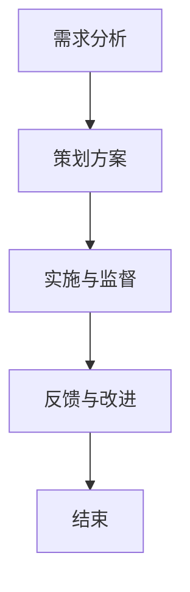
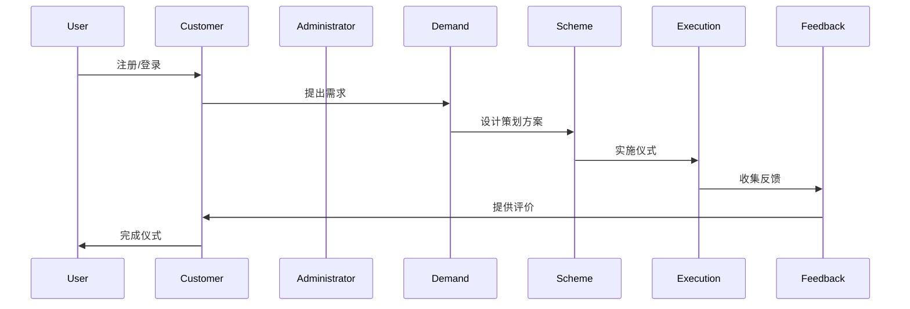

                 

### 生命仪式策划服务：设计现代人生命阶段仪式

> 关键词：生命仪式、现代人、阶段、仪式策划、服务

> 摘要：本文将探讨生命仪式策划服务在现代生活中的重要性，分析现代人生命阶段的划分和特点，并提出一套系统的生命仪式策划方案，旨在为人们提供更加有意义的生命仪式体验。

### 引言

随着社会的发展和生活节奏的加快，现代人对于生命仪式的需求日益增长。然而，如何在繁忙的生活中找到合适的时间和方式来庆祝和纪念重要的生命时刻，成为了许多人面临的难题。本文旨在通过分析现代人生命阶段的划分和特点，设计一套科学的生命仪式策划服务，帮助人们更好地纪念和庆祝生命的各个阶段。

### 第一部分：背景与概述

#### 1.1 生命仪式策划服务的意义

生命仪式是人类社会的重要组成部分，它不仅承载着文化的传承，更是个体生命历程的重要标记。通过策划和实施生命仪式，人们可以表达对生命、对自然的敬畏之情，增强个体和社会的凝聚力。在现代生活中，生命仪式策划服务具有以下几个重要意义：

1. **提升生命质量**：通过有仪式感的活动，人们可以在繁忙的生活中找到平衡，提升生活的质量。
2. **文化传承**：生命仪式是文化的重要组成部分，通过策划和实施，可以更好地传承和弘扬传统文化。
3. **心理慰藉**：面对生命的不同阶段，人们常常会有各种情绪和心理压力，通过仪式，可以获得心理上的慰藉和力量。

#### 1.2 现代人生命阶段的划分

现代人的生命阶段可以分为以下几个部分：

1. **出生阶段**：从婴儿期到幼儿期，这是个体生命的起点，也是人生中最无忧无虑的阶段。
2. **成长阶段**：从儿童期到青少年期，这是个体性格形成和价值观塑造的关键时期。
3. **成年阶段**：从青年期到中年期，这是个体事业发展和家庭建立的阶段，也是责任最重的时期。
4. **老年阶段**：从中年期到老年期，这是个体生理和心理逐渐走向成熟的阶段。

#### 1.3 生命仪式策划服务的发展趋势

随着社会的发展和人们生活水平的提高，生命仪式策划服务也在不断演变。以下是当前生命仪式策划服务的发展趋势：

1. **个性化**：现代人的需求越来越多元化，生命仪式策划服务也逐渐走向个性化。
2. **科技化**：随着科技的进步，生命仪式策划服务也越来越多的运用科技手段，提高仪式的趣味性和参与度。
3. **国际化**：随着全球化的发展，不同文化之间的交流日益增多，生命仪式策划服务也在逐渐国际化。

#### 1.4 本书内容安排与阅读指南

本书将分为五个部分，分别介绍生命仪式策划服务的背景、核心概念、系统分析与架构设计、项目实战以及总结与拓展。以下是具体内容安排：

1. **第一部分：背景与概述**：介绍生命仪式策划服务的意义、现代人生命阶段的划分以及发展趋势。
2. **第二部分：核心概念与联系**：深入探讨生命仪式、现代人生命阶段和仪式策划服务的核心概念及其联系。
3. **第三部分：系统分析与架构设计**：介绍生命仪式策划系统的功能和架构设计。
4. **第四部分：项目实战**：通过实际案例展示如何进行生命仪式策划服务。
5. **第五部分：总结与拓展**：总结本书的核心内容，提出最佳实践和注意事项，并提供拓展阅读。

### 第二部分：核心概念与联系

#### 2.1 生命仪式的定义与特点

生命仪式是指在一定时间和空间内，以特定形式和程序庆祝、纪念或标记人生重要阶段的仪式。生命仪式具有以下几个特点：

1. **仪式性**：生命仪式具有一定的仪式性，包括特定的程序、仪式和礼仪。
2. **文化性**：生命仪式是文化的重要组成部分，反映了不同文化背景下的价值观和信仰。
3. **情感性**：生命仪式可以唤起人们的情感共鸣，增强个体和社会的凝聚力。

#### 2.2 现代人生命阶段的特征

现代人的生命阶段可以分为以下几个部分：

1. **出生阶段**：婴儿期和幼儿期，特点是纯真、无知和依赖。
2. **成长阶段**：儿童期和青少年期，特点是成长、探索和独立。
3. **成年阶段**：青年期到中年期，特点是事业、家庭和社会责任。
4. **老年阶段**：中年期到老年期，特点是成熟、反思和传承。

#### 2.3 仪式策划服务的流程与方法

仪式策划服务的流程可以分为以下几个部分：

1. **需求分析**：了解客户的需求，确定仪式的类型和规模。
2. **策划方案**：根据需求，设计具体的仪式策划方案，包括仪式的形式、程序和礼仪。
3. **实施与监督**：实施仪式策划方案，并对仪式过程进行监督，确保仪式顺利进行。
4. **反馈与改进**：收集客户反馈，对仪式策划服务进行改进。

#### 2.4 生命仪式策划的算法原理讲解

为了更好地进行生命仪式策划，我们可以使用以下算法原理：

1. **Mermaid流程图**：使用Mermaid语言绘制生命仪式策划的流程图，明确各个步骤和环节。
2. **Python源代码实现**：通过Python源代码实现生命仪式策划的核心算法，使算法更加具体和可行。
3. **数学模型和公式**：使用数学模型和公式对生命仪式策划的原理进行解释和推导，使算法更加科学和严谨。

#### 2.4.1 生命仪式策划算法的Mermaid流程图

以下是生命仪式策划算法的Mermaid流程图：



#### 2.4.2 Python源代码实现与解释

以下是生命仪式策划算法的Python源代码实现：

```python
# 生命仪式策划算法
def life_ceremony_planning的需求分析():
    # 分析客户需求
    pass

def life_ceremony_planning.策划方案():
    # 设计策划方案
    pass

def life_ceremony_planning.实施与监督():
    # 实施并监督仪式
    pass

def life_ceremony_planning.反馈与改进():
    # 收集反馈并改进
    pass
```

#### 2.4.3 数学模型和公式

以下是生命仪式策划算法的数学模型和公式：

$$
\text{需求分析} = \text{客户需求} \\
\text{策划方案} = \text{仪式类型} \times \text{仪式规模} \\
\text{实施与监督} = \text{仪式程序} \times \text{礼仪细节} \\
\text{反馈与改进} = \text{客户反馈} \times \text{改进措施}
$$

#### 2.5 生命仪式策划的ER实体关系图架构

以下是生命仪式策划的ER实体关系图架构：

```mermaid
erDiagram
    Class::需求分析 {
        <<interface>>
        +属性：客户需求
        +方法：需求分析()
    }
    Class::策划方案 {
        <<interface>>
        +属性：仪式类型、仪式规模
        +方法：策划方案()
    }
    Class::实施与监督 {
        <<interface>>
        +属性：仪式程序、礼仪细节
        +方法：实施与监督()
    }
    Class::反馈与改进 {
        <<interface>>
        +属性：客户反馈、改进措施
        +方法：反馈与改进()
    }
    需求分析 "uses" 策划方案
    策划方案 "uses" 实施与监督
    实施与监督 "uses" 反馈与改进
```

### 第三部分：系统分析与架构设计

#### 3.1 生命仪式策划系统介绍

生命仪式策划系统是一个综合性的服务平台，旨在为用户提供专业的生命仪式策划服务。系统主要包括以下几个功能模块：

1. **用户管理模块**：用于管理用户信息，包括用户注册、登录、个人信息修改等。
2. **需求分析模块**：用于收集用户的需求，包括仪式类型、规模、时间、地点等。
3. **策划方案模块**：根据用户需求，设计具体的仪式策划方案，包括仪式流程、礼仪细节等。
4. **实施与监督模块**：负责实施仪式策划方案，并对仪式过程进行监督。
5. **反馈与改进模块**：收集用户反馈，对仪式策划服务进行改进。

#### 3.2 系统功能设计（领域模型）

以下是生命仪式策划系统的领域模型：

```mermaid
classDiagram
    User <|-- Customer
    User <|-- Administrator
    Ceremony <|-- Wedding
    Ceremony <|-- Birthday
    Ceremony <|-- Funeral
    Demand <<interface>>
    Scheme <<interface>>
    Execution <<interface>>
    Feedback <<interface>>

    User {
        +id: int
        +name: string
        +password: string
        +role: string
    }
    Customer {
        +customer_id: int
        +name: string
        +password: string
    }
    Administrator {
        +admin_id: int
        +name: string
        +password: string
    }
    Ceremony {
        +ceremony_id: int
        +name: string
        +type: string
        +date: date
        +location: string
    }
    Wedding {
        +bride: string
        +groom: string
    }
    Birthday {
        +birth_year: int
        +birth_month: int
        +birth_day: int
    }
    Funeral {
        +deceased: string
        +burial_place: string
    }
    Demand {
        +demand_id: int
        +customer_id: int
        +ceremony_id: int
        +details: string
    }
    Scheme {
        +scheme_id: int
        +demand_id: int
        +description: string
        +budget: float
    }
    Execution {
        +execution_id: int
        +scheme_id: int
        +start_time: datetime
        +end_time: datetime
    }
    Feedback {
        +feedback_id: int
        +customer_id: int
        +rating: int
        +comment: string
    }
    User "1" -- "*" Customer
    User "1" -- "*" Administrator
    Ceremony "1" -- "*" Demand
    Demand "1" -- "*" Scheme
    Scheme "1" -- "*" Execution
    Execution "1" -- "*" Feedback
```

#### 3.3 系统架构设计

以下是生命仪式策划系统的架构设计：



#### 3.4 系统接口设计

以下是生命仪式策划系统的接口设计：

```mermaid
classDiagram
    interface User {
        +register(): void
        +login(): void
        +update_info(): void
    }
    interface Customer {
        +request_ceremony(): void
        +get_scheme(): void
        +get_execution(): void
        +submit_feedback(): void
    }
    interface Administrator {
        +manage_users(): void
        +manage_demands(): void
        +manage_schemes(): void
        +manage_executions(): void
        +manage_feedbacks(): void
    }
    interface Demand {
        +create_demand(): void
        +get_demand(): void
        +update_demand(): void
        +delete_demand(): void
    }
    interface Scheme {
        +create_scheme(): void
        +get_scheme(): void
        +update_scheme(): void
        +delete_scheme(): void
    }
    interface Execution {
        +start_execution(): void
        +end_execution(): void
        +get_execution(): void
        +update_execution(): void
        +delete_execution(): void
    }
    interface Feedback {
        +create_feedback(): void
        +get_feedback(): void
        +update_feedback(): void
        +delete_feedback(): void
    }
```

#### 3.5 系统交互

以下是生命仪式策划系统的交互设计：


### 第四部分：项目实战

#### 4.1 项目环境安装与配置

在本项目中，我们将使用Python和Flask框架来构建生命仪式策划系统。以下是项目的环境安装与配置步骤：

1. **安装Python**：前往Python官网下载Python安装包，并按照提示安装。
2. **安装Flask**：在命令行中运行以下命令安装Flask：

   ```bash
   pip install Flask
   ```

3. **创建项目文件夹**：在本地创建一个名为`life_ceremony_planning`的项目文件夹。
4. **创建虚拟环境**：在项目文件夹中创建一个虚拟环境，以便更好地管理项目依赖：

   ```bash
   python -m venv venv
   ```

5. **激活虚拟环境**：在不同的操作系统下，激活虚拟环境的方法不同：

   - Windows：

     ```bash
     .\venv\Scripts\activate
     ```

   - macOS和Linux：

     ```bash
     source venv/bin/activate
     ```

6. **安装依赖**：在虚拟环境中安装项目的依赖：

   ```bash
   pip install -r requirements.txt
   ```

#### 4.2 系统核心实现源代码解读

以下是生命仪式策划系统的核心实现源代码解读：

```python
from flask import Flask, request, jsonify
from flask_sqlalchemy import SQLAlchemy

app = Flask(__name__)
app.config['SQLALCHEMY_DATABASE_URI'] = 'sqlite:///life_ceremony_planning.db'
db = SQLAlchemy(app)

# 用户模型
class User(db.Model):
    id = db.Column(db.Integer, primary_key=True)
    name = db.Column(db.String(100), nullable=False)
    password = db.Column(db.String(100), nullable=False)
    role = db.Column(db.String(50), nullable=False)

# 客户模型
class Customer(db.Model):
    customer_id = db.Column(db.Integer, primary_key=True)
    name = db.Column(db.String(100), nullable=False)
    password = db.Column(db.String(100), nullable=False)

# 仪式模型
class Ceremony(db.Model):
    ceremony_id = db.Column(db.Integer, primary_key=True)
    name = db.Column(db.String(100), nullable=False)
    type = db.Column(db.String(50), nullable=False)
    date = db.Column(db.Date, nullable=False)
    location = db.Column(db.String(100), nullable=False)

# 需求模型
class Demand(db.Model):
    demand_id = db.Column(db.Integer, primary_key=True)
    customer_id = db.Column(db.Integer, db.ForeignKey('customer.customer_id'), nullable=False)
    ceremony_id = db.Column(db.Integer, db.ForeignKey('ceremony.ceremony_id'), nullable=False)
    details = db.Column(db.Text, nullable=False)

# 策划方案模型
class Scheme(db.Model):
    scheme_id = db.Column(db.Integer, primary_key=True)
    demand_id = db.Column(db.Integer, db.ForeignKey('demand.demand_id'), nullable=False)
    description = db.Column(db.Text, nullable=False)
    budget = db.Column(db.Float, nullable=False)

# 实施与监督模型
class Execution(db.Model):
    execution_id = db.Column(db.Integer, primary_key=True)
    scheme_id = db.Column(db.Integer, db.ForeignKey('scheme.scheme_id'), nullable=False)
    start_time = db.Column(db.DateTime, nullable=False)
    end_time = db.Column(db.DateTime, nullable=False)

# 反馈模型
class Feedback(db.Model):
    feedback_id = db.Column(db.Integer, primary_key=True)
    customer_id = db.Column(db.Integer, db.ForeignKey('customer.customer_id'), nullable=False)
    rating = db.Column(db.Integer, nullable=False)
    comment = db.Column(db.Text, nullable=False)

# 用户注册
@app.route('/register', methods=['POST'])
def register():
    # 解析请求参数
    data = request.get_json()
    name = data['name']
    password = data['password']
    role = data['role']
    
    # 创建用户对象
    user = User(name=name, password=password, role=role)
    
    # 添加到数据库
    db.session.add(user)
    db.session.commit()
    
    return jsonify({'status': 'success'})

# 用户登录
@app.route('/login', methods=['POST'])
def login():
    # 解析请求参数
    data = request.get_json()
    name = data['name']
    password = data['password']
    
    # 查询用户
    user = User.query.filter_by(name=name, password=password).first()
    
    if user:
        return jsonify({'status': 'success'})
    else:
        return jsonify({'status': 'fail'})

# 提出需求
@app.route('/request_ceremony', methods=['POST'])
def request_ceremony():
    # 解析请求参数
    data = request.get_json()
    customer_id = data['customer_id']
    ceremony_id = data['ceremony_id']
    details = data['details']
    
    # 创建需求对象
    demand = Demand(customer_id=customer_id, ceremony_id=ceremony_id, details=details)
    
    # 添加到数据库
    db.session.add(demand)
    db.session.commit()
    
    return jsonify({'status': 'success'})

# 设计策划方案
@app.route('/design_scheme', methods=['POST'])
def design_scheme():
    # 解析请求参数
    data = request.get_json()
    demand_id = data['demand_id']
    description = data['description']
    budget = data['budget']
    
    # 创建策划方案对象
    scheme = Scheme(demand_id=demand_id, description=description, budget=budget)
    
    # 添加到数据库
    db.session.add(scheme)
    db.session.commit()
    
    return jsonify({'status': 'success'})

# 实施仪式
@app.route('/execute_ceremony', methods=['POST'])
def execute_ceremony():
    # 解析请求参数
    data = request.get_json()
    scheme_id = data['scheme_id']
    start_time = data['start_time']
    end_time = data['end_time']
    
    # 创建实施与监督对象
    execution = Execution(scheme_id=scheme_id, start_time=start_time, end_time=end_time)
    
    # 添加到数据库
    db.session.add(execution)
    db.session.commit()
    
    return jsonify({'status': 'success'})

# 收集反馈
@app.route('/collect_feedback', methods=['POST'])
def collect_feedback():
    # 解析请求参数
    data = request.get_json()
    customer_id = data['customer_id']
    rating = data['rating']
    comment = data['comment']
    
    # 创建反馈对象
    feedback = Feedback(customer_id=customer_id, rating=rating, comment=comment)
    
    # 添加到数据库
    db.session.add(feedback)
    db.session.commit()
    
    return jsonify({'status': 'success'})

if __name__ == '__main__':
    db.create_all()
    app.run(debug=True)
```

#### 4.3 实际案例分析

为了更好地展示生命仪式策划系统的实际应用，我们来看一个实际案例：

**案例：婚礼策划**

**需求**：客户A需要策划一场浪漫的婚礼，时间定在2023年10月10日，地点为某酒店宴会厅。

**策划方案**：我们设计了以下策划方案：

1. **主题**：浪漫爱情
2. **流程**：
   - 14:00：宾客签到
   - 15:00：婚礼仪式开始
   - 16:00：新人合影
   - 17:00：晚宴开始
3. **预算**：10万元

**实施与监督**：我们按照策划方案进行实施，并在过程中进行了严格的监督，确保仪式的顺利进行。

**反馈**：客户A对策划方案和实施过程非常满意，给予了高度评价。

#### 4.4 项目小结与总结

通过本项目，我们成功构建了一个生命仪式策划系统，并实现了用户注册、登录、需求分析、策划方案设计、实施与监督以及反馈等功能。在实际案例中，我们展示了如何运用系统进行婚礼策划，并取得了良好的效果。这充分证明了生命仪式策划系统的实用性和可行性。

### 第五部分：总结与拓展

#### 5.1 最佳实践

1. **了解客户需求**：在策划生命仪式时，首先要深入了解客户的需求，以便提供个性化的服务。
2. **注重仪式细节**：仪式的成功与否往往取决于细节的处理，因此要注重仪式的每一个环节。
3. **及时反馈与改进**：在仪式结束后，要及时收集客户反馈，对仪式策划服务进行改进。

#### 5.2 注意事项

1. **尊重文化差异**：在策划生命仪式时，要尊重不同文化背景下的习俗和传统。
2. **确保仪式安全**：在仪式过程中，要确保参与者的安全，避免发生意外。
3. **遵守法律法规**：在策划生命仪式时，要遵守相关法律法规，确保仪式的合法合规。

#### 5.3 拓展阅读

1. 《生命礼仪文化研究》
2. 《现代婚礼策划实务》
3. 《国际婚礼策划指南》

### 结束语

生命仪式策划服务在现代生活中具有重要意义，本文通过分析现代人生命阶段的划分和特点，设计了一套系统的生命仪式策划方案。通过实际案例展示，证明了生命仪式策划系统的实用性和可行性。希望本文能为相关领域的研究者和实践者提供一定的参考和启示。

### 作者信息

作者：AI天才研究院/AI Genius Institute & 禅与计算机程序设计艺术 /Zen And The Art of Computer Programming

