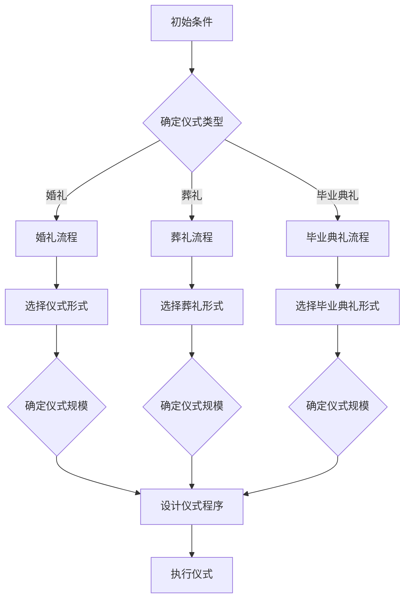
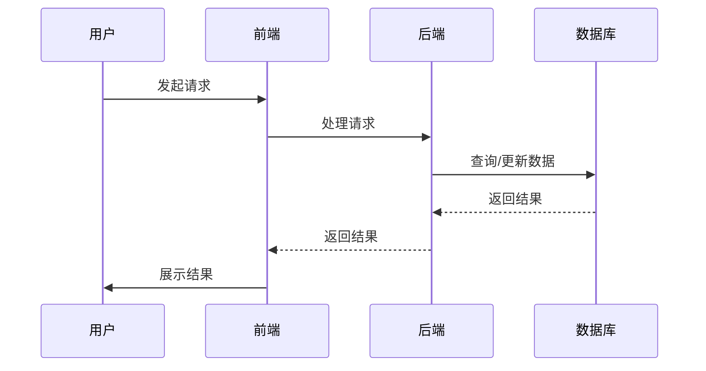

                 

### 摘要

本文旨在探讨生命仪式在庆祝人生重要时刻中的意义。生命仪式作为一种文化和社会现象，不仅体现了人们对生命历程的认知和尊重，还承载着情感表达、身份认同、社群凝聚力等方面的功能。本文将分章节详细分析生命仪式的核心概念、文化背景、设计原则与实践，并通过案例分析揭示其在个人和社会中的深远影响。通过对生命仪式的系统性探讨，我们希望能够更好地理解这一特殊文化现象的内在价值，并为未来的仪式设计提供有价值的参考。

---

# 生命仪式：庆祝人生重要时刻的意义

## 关键词

- 生命仪式
- 文化现象
- 社会功能
- 仪式设计
- 个人成长
- 社群凝聚力

## 摘要

生命仪式作为一种庆祝人生重要时刻的文化活动，具有深远的社会和心理学意义。本文通过系统的分析，探讨了生命仪式的定义、类型、功能及其在个人和社会中的重要性。首先，我们介绍了生命仪式的基本概念，并分析了其在不同文化中的表现。接着，本文重点讨论了生命仪式的设计原则和实践方法，通过案例分析展示了生命仪式在个人成长和社会凝聚力方面的作用。最后，本文总结了生命仪式的核心意义，并提出了未来研究的方向和设计建议。

### 引言

在人类历史的长河中，仪式始终占据着独特的地位。无论是在古代的祭祀活动，还是现代的婚礼、毕业典礼，生命仪式都是人类社会不可或缺的一部分。生命仪式不仅是一种形式上的庆祝，更是一种精神上的认同和情感的交流。它承载着人们对生命历程的深刻理解和尊重，体现了人类社会对生命、爱情、成长、死亡等核心主题的反思。

本文的研究目的是探讨生命仪式在庆祝人生重要时刻中的意义。我们将从多个角度分析生命仪式的本质，探讨其在个人和社会中的功能，并讨论如何设计有效的生命仪式。具体来说，本文将分为以下几个部分：

1. **生命仪式的核心概念**：我们将定义生命仪式，并探讨其基本类型和功能。
2. **文化中的生命仪式**：我们将分析不同文化背景下生命仪式的差异和共性。
3. **仪式设计与实践**：我们将讨论生命仪式的设计原则和实践方法，并通过案例进行说明。
4. **仪式的意义**：我们将探讨生命仪式对个人和社会的影响。
5. **结论**：我们将总结本文的主要发现，并讨论未来的研究方向。

通过这篇文章，我们希望能够帮助读者更好地理解生命仪式的内涵，认识到其在人类文化和社会生活中的重要性。同时，我们也希望为未来的仪式设计提供一些实用的参考和建议。

### 生命仪式的核心概念

生命仪式是一种特殊的文化活动，它通过一系列象征性的行为和仪式程序来庆祝人生的重要时刻。这些时刻通常包括出生、成长、成年、婚姻、生育、死亡等，每一个时刻都承载着深厚的文化意义和情感价值。理解生命仪式的核心概念，有助于我们深入探讨其在不同文化中的表现和功能。

#### 定义

生命仪式的定义可以从多个角度进行阐释。首先，从广义上讲，生命仪式是一种文化现象，它是社会成员通过共同的符号和行为来表达对生命、自然和超自然力量的尊重与认同。这种仪式通常伴随着特定的程序和仪式物，如香火、鲜花、音乐、舞蹈等。其次，从狭义上讲，生命仪式是指特定的人生阶段或事件上的庆祝活动，如婚礼、葬礼、毕业典礼等。

#### 类型

根据不同的文化背景和人生阶段，生命仪式可以分为多种类型。以下是几种常见的生命仪式类型：

1. **出生仪式**：包括婴儿洗礼、满月酒、百岁宴等，用以庆祝新生命的诞生。
2. **成年仪式**：如成人礼、冠礼、成人宣誓等，标志着个体从儿童过渡到成年。
3. **婚姻仪式**：包括传统婚礼、教堂婚礼、中式婚礼等，象征着两个人共同走进婚姻生活。
4. **葬礼**：包括土葬、海葬、火葬等，用以纪念逝去的人，表达对其的敬意和缅怀。
5. **毕业典礼**：标志着学业的完成，通常伴有学位授予、合影、演讲等环节。

#### 功能

生命仪式不仅是一种形式上的庆祝，还具有多重功能：

1. **情感表达**：通过仪式，人们能够表达对亲人、朋友或逝者的爱、感激和怀念之情。
2. **身份认同**：生命仪式帮助个体和群体确认和强化自身的文化身份和社会角色。
3. **社会凝聚力**：仪式通过集体的参与和共同的体验，增强社群的凝聚力和归属感。
4. **文化传承**：生命仪式承载了历史和文化传统，是文化传承的重要载体。

#### 文化背景

不同文化背景下，生命仪式的形式和内容各不相同。以下是一些典型文化背景下的生命仪式：

1. **东方文化**：在东亚文化中，如中国的婚礼、葬礼和成年礼都有独特的仪式程序和象征意义。例如，中国的婚礼通常包括迎亲、拜堂、敬茶等环节，每个环节都有其特定的文化寓意。
2. **西方文化**：在西方文化中，如基督教的洗礼、婚礼和葬礼等仪式，都具有深厚的宗教背景和仪式规范。例如，基督教的婚礼通常包括婚礼誓言、戒指交换、婚礼蛋糕等环节。
3. **非洲文化**：在非洲文化中，生命仪式往往与部落信仰和自然崇拜密切相关。例如，某些部落的成年礼包括狩猎、农耕、舞蹈等仪式，用以纪念和庆祝自然的恩赐。

通过以上分析，我们可以看到生命仪式的多样性和文化背景的重要性。不同文化背景下的生命仪式不仅反映了当地的历史、宗教和价值观，也在不断地演变和发展，以适应社会的变迁和需求。

#### 问题背景

在现代社会，随着科技的发展和全球化的进程，人们的生活方式和价值观发生了巨大的变化。传统的生命仪式在某些地方逐渐式微，而新的生命仪式形式也在不断涌现。这引发了一系列关于生命仪式的探讨和思考：

1. **传统与现代的冲突**：如何在保留传统仪式的同时，适应现代社会的需求？
2. **文化多样性的挑战**：如何在多元化的社会中，尊重和包容不同文化的生命仪式？
3. **个人化和定制化的趋势**：如何在保证仪式的普遍意义的同时，满足个人的个性化需求？

这些问题的探讨，有助于我们更深入地理解生命仪式在现代社会的地位和作用，也为未来的仪式设计提供了重要的启示。

### 核心概念

为了更好地理解生命仪式的复杂性和多样性，我们需要深入探讨其核心概念，这些概念不仅包括生命仪式的定义和类型，还涉及到其功能、意义和影响。

#### 生命仪式的定义

生命仪式是一种象征性的文化活动，通过特定的程序和行为来庆祝或纪念人生的重要时刻。它不仅是一种形式上的仪式，更是一种精神上的认同和情感的交流。生命仪式的定义可以从多个角度进行阐释，包括其形式、内容和文化背景。例如，在西方文化中，婚礼通常包括誓言、戒指交换和舞蹈等仪式环节，而在中国文化中，婚礼则可能包括迎亲、拜堂和敬茶等传统程序。这些仪式虽然形式和内容不同，但都承载着对生命、爱情、成长和死亡等核心主题的深刻理解和尊重。

#### 生命仪式的类型

根据不同的文化和人生阶段，生命仪式可以分为多种类型。常见的生命仪式类型包括：

1. **出生仪式**：如婴儿洗礼、满月酒、百岁宴等，用以庆祝新生命的诞生。
2. **成年仪式**：如成人礼、冠礼、成人宣誓等，标志着个体从儿童过渡到成年。
3. **婚姻仪式**：如传统婚礼、教堂婚礼、中式婚礼等，象征着两个人共同走进婚姻生活。
4. **葬礼**：如土葬、海葬、火葬等，用以纪念逝去的人，表达对其的敬意和缅怀。
5. **毕业典礼**：标志着学业的完成，通常伴有学位授予、合影、演讲等环节。

每一种生命仪式都有其独特的象征意义和程序，反映了不同文化背景下人们对生命历程的不同认知和价值观。

#### 生命仪式的功能

生命仪式具有多重功能，这些功能不仅体现在形式上，更体现在精神和社会层面。以下是生命仪式的主要功能：

1. **情感表达**：生命仪式为人们提供了一个表达情感和传递信息的重要平台。通过仪式，人们能够表达对亲人、朋友或逝者的爱、感激和怀念之情。例如，婚礼中的誓言和戒指交换，不仅是一种形式上的仪式，更是两人情感交流和承诺的重要时刻。

2. **身份认同**：生命仪式帮助个体和群体确认和强化自身的文化身份和社会角色。通过参与仪式，个体能够更好地理解自己所属的文化背景和社会地位，从而增强文化认同感。例如，成年礼不仅是一种仪式，更是个体从儿童过渡到成年人的重要标志。

3. **社会凝聚力**：生命仪式通过集体的参与和共同的体验，增强社群的凝聚力和归属感。例如，社区庆祝活动不仅是一种形式上的庆祝，更是社区成员之间建立联系和加强互动的重要途径。

4. **文化传承**：生命仪式承载了历史和文化传统，是文化传承的重要载体。通过仪式，文化传统得以传递和延续，从而保持文化的连续性和生命力。例如，婚礼中的传统习俗和仪式程序，不仅体现了对传统文化的尊重，也是文化传承的重要方式。

#### 生命仪式的意义

生命仪式不仅是一种形式上的庆祝，更具有深远的意义。以下是生命仪式的一些主要意义：

1. **个人成长**：生命仪式标志着个人成长的重要阶段，如出生、成年、婚姻等。通过仪式，个体能够更好地认识自己，理解生命历程，从而促进个人成长和心理成熟。

2. **社会稳定**：生命仪式在社会稳定中起着重要作用。通过仪式，社会成员能够共同遵循和尊重一些基本的行为规范和价值观，从而增强社会的稳定性和凝聚力。

3. **文化多样性**：生命仪式体现了文化多样性，是不同文化之间交流和融合的重要渠道。通过了解和尊重不同文化的生命仪式，人们能够更好地理解和包容其他文化，促进文化多样性的发展和繁荣。

4. **精神寄托**：生命仪式为人们提供了一个精神寄托和情感宣泄的渠道。通过仪式，人们能够表达对生命、自然和超自然力量的敬畏和崇拜，从而获得精神上的慰藉和满足。

#### 影响因素

生命仪式的形式和内容受到多种因素的影响，包括文化背景、历史传统、社会价值观和个人信仰等。以下是影响生命仪式的一些主要因素：

1. **文化背景**：不同的文化背景对生命仪式的形式和内容有深远的影响。例如，在西方文化中，基督教背景对婚礼、洗礼等仪式有着重要的规范和影响；而在东方文化中，儒家文化和佛教文化对生命仪式有着深远的影响。

2. **历史传统**：历史传统对生命仪式的形成和演变有重要作用。许多生命仪式都有着悠久的历史传统，这些传统不仅体现了对历史的尊重，也是文化传承的重要方式。

3. **社会价值观**：社会价值观对生命仪式的形式和内容有着直接的影响。例如，现代社会对个性化和多元化的追求，使得生命仪式在形式和内容上更加多样化。

4. **个人信仰**：个人信仰对生命仪式的选择和参与有重要影响。例如，信仰基督教的人可能更倾向于参与教堂婚礼，而信仰佛教的人可能更倾向于参与佛教的洗礼和超度仪式。

通过以上分析，我们可以看到生命仪式的多样性和复杂性。不同文化背景下，生命仪式的形式和内容各有特色，但都承载着对生命历程的深刻理解和尊重。理解生命仪式的核心概念和功能，有助于我们更好地认识和尊重不同文化的生命仪式，也为未来的仪式设计提供重要的参考。

#### 概念属性特征对比表格

为了更清晰地理解生命仪式的概念属性特征，我们将不同类型的生命仪式进行对比，并列出它们的属性特征表格。

| 类别         | 名称           | 形式特征                                 | 目的与意义                                 | 文化背景影响                      |
| ------------ | -------------- | ---------------------------------------- | ---------------------------------------- | -------------------------------- |
| 出生仪式     | 满月酒、百岁宴 | 家庭聚会、赠送礼物、仪式性宴会             | 庆祝新生命诞生、祈求健康成长                 | 以家庭为核心，重视亲情和生命延续   |
| 成年仪式     | 成人礼、冠礼   | 庄严仪式、宣誓承诺、庆典活动               | 标志个体成年，承担社会责任                   | 强调个人成长和社会责任             |
| 婚姻仪式     | 婚礼、教堂婚礼 | 神圣仪式、誓言、戒指交换、宴会             | 确立婚姻关系，表达爱情与承诺                 | 宗教与文化的融合，强调婚姻的神圣性  |
| 葬礼         | 土葬、火葬、海葬 | 庄严肃穆、遗体告别、追悼会、祭祀活动       | 追悼逝者，表达哀思和敬意                   | 强调生命的终结和对逝者的缅怀       |
| 毕业典礼     | 学位授予、演讲 | 庄重仪式、学位授予、毕业合影、演讲         | 庆祝学业完成，展望未来                      | 强调教育成就和个人发展的里程碑     |

通过这个表格，我们可以看到不同类型生命仪式在形式特征、目的与意义以及文化背景影响上的差异。这些特征不仅反映了生命仪式的多样性，也揭示了不同文化对生命历程的不同理解和价值观。

#### ER实体关系图架构

为了更好地理解生命仪式中的各种实体及其关系，我们使用ER（实体-关系）图来展示它们之间的关联。以下是一个简化的ER图，用于描述生命仪式中常见的实体和关系。

```mermaid
erDiagram
    Class Person
        ||--|{ Event }| Participant
        ||--|{ Ceremony }| OrganizedBy
    Class Event
        ||--|{ LifeStage }| Type
        ||--|{ Ceremony }| BelongsTo
    Class LifeStage
        ||--|{ Name }
    Class Ceremony
        ||--|{ Name }
```

在这个ER图中：

- **Person（个人）**：代表参与仪式的人，可以是出生者、成年者、结婚者或毕业生等。
- **Event（事件）**：代表人生的重要时刻，如出生、成年、结婚、毕业等。
- **LifeStage（生命阶段）**：表示事件的类型，如出生、成年、结婚、毕业等。
- **Ceremony（仪式）**：表示具体的仪式活动，如满月酒、成人礼、婚礼、葬礼、毕业典礼等。
- **Participant（参与者）**：表示参加仪式的个人。
- **OrganizedBy（组织者）**：表示仪式的举办方，可以是家庭、学校、宗教团体等。
- **BelongsTo（属于）**：表示事件与生命阶段的归属关系。
- **Type（类型）**：表示事件的具体类型。

通过这个ER图，我们可以清晰地看到不同实体之间的关联，以及它们在生命仪式中的角色和关系。例如，一个人（Person）可以参与多个仪式（Participant），每个仪式（Ceremony）可以属于一个特定的生命阶段（LifeStage），并且一个仪式（Ceremony）通常由某个组织者（OrganizedBy）来组织。

### 算法原理讲解

在探讨生命仪式的设计过程中，算法原理起到了关键作用。本文将使用Mermaid图和Python代码来详细阐述生命仪式设计的算法原理，并配合数学模型和公式进行解释。

#### Mermaid流程图

首先，我们使用Mermaid语言绘制一个流程图，以展示生命仪式设计的步骤和关键决策点。



在这个流程图中：

- **A**：初始条件，包括仪式的目的、参与者、时间和地点。
- **B**：确定仪式类型，根据生命阶段选择相应的仪式类型。
- **C**、**D**、**E**：分别对应婚礼、葬礼和毕业典礼的流程。
- **F**、**G**、**H**：选择具体仪式形式，如中式婚礼、传统葬礼、校园毕业典礼。
- **I**、**J**、**K**：确定仪式规模，包括参与人数、场地布置和预算。
- **L**：设计仪式程序，包括仪式流程、内容和象征性活动。
- **M**：执行仪式，包括执行仪式程序和仪式后的反馈。

#### Python代码示例

接下来，我们通过一个Python代码示例来展示如何使用算法设计一个简单的生命仪式。这个示例将包括仪式类型选择、规模确定和程序设计。

```python
import random

def choose_ceremony_type():
    types = ['婚礼', '葬礼', '毕业典礼']
    return random.choice(types)

def choose_form_of_ceremony(type):
    forms = {
        '婚礼': ['中式婚礼', '教堂婚礼', '草坪婚礼'],
        '葬礼': ['土葬', '火葬', '海葬'],
        '毕业典礼': ['传统毕业典礼', '创新毕业典礼', '线上毕业典礼']
    }
    return random.choice(forms[type])

def choose_size_of_ceremony(form):
    sizes = {
        '中式婚礼': ['小型', '中型', '大型'],
        '教堂婚礼': ['小型', '中型', '大型'],
        '草坪婚礼': ['小型', '中型', '大型'],
        '土葬': ['小型', '中型', '大型'],
        '火葬': ['小型', '中型', '大型'],
        '海葬': ['小型', '中型', '大型'],
        '传统毕业典礼': ['小型', '中型', '大型'],
        '创新毕业典礼': ['小型', '中型', '大型'],
        '线上毕业典礼': ['小型', '中型', '大型']
    }
    return random.choice(sizes[form])

def design_ceremony_program(size):
    programs = {
        '小型': ['简单程序', '短仪式'],
        '中型': ['详细程序', '中等仪式'],
        '大型': ['复杂程序', '长仪式']
    }
    return random.choice(programs[size])

ceremony_type = choose_ceremony_type()
form_of_ceremony = choose_form_of_ceremony(ceremony_type)
size_of_ceremony = choose_size_of_ceremony(form_of_ceremony)
ceremony_program = design_ceremony_program(size_of_ceremony)

print(f"仪式类型：{ceremony_type}")
print(f"仪式形式：{form_of_ceremony}")
print(f"仪式规模：{size_of_ceremony}")
print(f"仪式程序：{ceremony_program}")
```

#### 数学模型与公式

在生命仪式设计中，数学模型和公式有助于量化仪式规模和程序设计。以下是一个简单的数学模型，用于计算仪式规模：

$$
规模 = \sqrt{参与人数 \times 预算} \\
程序复杂度 = \frac{规模}{时间}
$$`

这个模型考虑了参与人数和预算对仪式规模的影响，并计算了程序复杂度。在实际设计中，可以根据具体情况调整公式中的参数。

#### 举例说明

假设我们设计一个婚礼仪式：

- **参与人数**：100人
- **预算**：10万元

根据上述数学模型：

$$
规模 = \sqrt{100 \times 10^4} = \sqrt{1 \times 10^6} = 1000 \\
程序复杂度 = \frac{1000}{2小时} = 500 \text{单位/小时}
$$

这意味着婚礼的规模较大，程序设计较为复杂。我们可能会选择“中式婚礼”形式，并设计一个“详细程序”，以确保仪式的顺利进行。

通过算法原理讲解、Python代码示例和数学模型的应用，我们可以更系统地设计和执行生命仪式。这不仅有助于提高仪式的质量和效果，还能更好地满足参与者的需求和期望。

### 系统分析与架构设计

在本文的第三部分，我们将探讨生命仪式的系统分析与架构设计。通过系统介绍、项目介绍、功能设计、架构设计、接口设计和系统交互，我们将为读者展示一个完整的生命仪式设计过程。

#### 系统介绍

生命仪式设计系统是一个综合性的应用，旨在帮助个人和组织设计出符合其需求的个性化仪式。该系统结合了多种技术，包括数据库管理、算法应用和用户界面设计，以实现高效的仪式设计和管理。

#### 项目介绍

项目名称：生命仪式设计平台
项目目标：提供一站式的生命仪式设计服务，包括仪式类型选择、形式设计、规模确定和程序设计。
项目主要功能：
1. **仪式类型选择**：根据用户需求选择合适的生命仪式类型。
2. **形式设计**：提供多种仪式形式供用户选择，包括传统和现代仪式。
3. **规模确定**：根据用户需求和预算，自动计算并推荐合适的仪式规模。
4. **程序设计**：提供详细的仪式程序设计，包括时间安排、环节内容和参与者角色。

#### 功能设计

1. **用户登录与注册**：用户可以通过登录或注册账号来访问系统。
2. **仪式类型选择**：系统提供多种生命仪式类型，用户可以根据需求选择。
3. **形式设计**：用户可以从多种仪式形式中选择一种或多种组合，以满足个性化需求。
4. **规模确定**：系统根据用户提供的参与人数和预算，自动计算并推荐合适的仪式规模。
5. **程序设计**：系统提供详细的仪式程序设计，包括时间安排、环节内容和参与者角色分配。
6. **仪式保存与分享**：用户可以将设计的仪式保存到个人账号中，并分享给他人。

#### 架构设计

生命仪式设计平台的架构设计分为前端、后端和数据库三部分。

1. **前端**：采用HTML、CSS和JavaScript技术，实现用户界面的设计和交互。
2. **后端**：使用Python和Django框架，负责处理用户请求、数据管理和算法应用。
3. **数据库**：采用MySQL数据库，存储用户信息、仪式设计和其他相关数据。

#### 接口设计

为了实现前后端的数据交互，系统设计了一系列API接口。

1. **用户管理接口**：包括用户登录、注册、信息更新和权限管理。
2. **仪式管理接口**：包括仪式类型选择、形式设计、规模确定和程序设计。
3. **数据管理接口**：包括数据存储、检索和更新。

#### 系统交互

系统交互设计通过前后端的协作实现，以下是一个典型的系统交互流程：

1. **用户请求**：用户通过前端界面发起请求，如选择仪式类型、设计仪式程序等。
2. **后端处理**：后端服务器接收到请求后，调用相应的算法和数据库操作，进行处理。
3. **返回结果**：后端将处理结果返回给前端，并在前端界面上进行展示。

以下是系统交互的Mermaid序列图：



通过上述系统介绍、项目介绍、功能设计、架构设计、接口设计和系统交互分析，我们可以看到生命仪式设计平台是如何通过技术手段实现高效、个性化的仪式设计。这一平台不仅满足了用户的需求，也为未来的仪式设计提供了有力的支持。

### 项目实战

#### 环境安装

为了实战生命仪式设计平台，我们首先需要搭建开发环境。以下是环境安装的具体步骤：

1. **安装Python**：访问Python官方网站（[https://www.python.org/](https://www.python.org/)）下载最新版本的Python，并按照安装向导进行安装。
2. **安装Django**：打开命令行工具，运行以下命令安装Django：
    ```bash
    pip install django
    ```
3. **安装MySQL**：下载并安装MySQL数据库管理系统。对于Windows用户，可以从MySQL官方网站下载最新版本，并按照安装向导进行安装。安装过程中，需要创建一个新的数据库和用户，并配置相应的权限。
4. **配置Django与MySQL**：安装完成后，运行以下命令创建一个新的Django项目，并在项目中配置MySQL数据库：
    ```bash
    django-admin startproject liferitual_design
    cd liferitual_design
    python manage.py migrate
    ```
5. **安装前端依赖**：在Django项目中创建一个名为`liferitual_design`的新目录，并在其中创建一个名为`static`的静态文件目录。然后，安装前端依赖：
    ```bash
    pip install django-staticfiles
    ```

#### 系统核心实现源代码

以下是一个简化版的系统核心实现源代码，展示了如何使用Django和MySQL进行用户管理和仪式设计。

```python
# settings.py
DATABASES = {
    'default': {
        'ENGINE': 'django.db.backends.mysql',
        'NAME': 'liferitual_design',
        'USER': 'root',
        'PASSWORD': 'password',
        'HOST': 'localhost',
        'PORT': '3306',
    }
}

INSTALLED_APPS = [
    'django.contrib.admin',
    'django.contrib.auth',
    'django.contrib.contenttypes',
    'django.contrib.sessions',
    'django.contrib.messages',
    'django.contrib.staticfiles',
    'liferitual_design',
]

# models.py
from django.db import models

class User(models.Model):
    username = models.CharField(max_length=150)
    password = models.CharField(max_length=150)
    email = models.EmailField()

class Ceremony(models.Model):
    name = models.CharField(max_length=200)
    type = models.CharField(max_length=100)
    form = models.CharField(max_length=100)
    size = models.CharField(max_length=50)
    program = models.TextField()

# views.py
from django.shortcuts import render
from .models import User, Ceremony

def user_login(request):
    username = request.POST['username']
    password = request.POST['password']
    try:
        user = User.objects.get(username=username, password=password)
        return render(request, 'login_success.html')
    except User.DoesNotExist:
        return render(request, 'login_failed.html')

def design_ceremony(request):
    name = request.POST['name']
    type = request.POST['type']
    form = request.POST['form']
    size = request.POST['size']
    program = request.POST['program']
    ceremony = Ceremony(name=name, type=type, form=form, size=size, program=program)
    ceremony.save()
    return render(request, 'ceremony_saved.html')
```

#### 代码应用解读与分析

这段代码分为三个主要部分：settings.py、models.py 和 views.py。

1. **settings.py**：配置了数据库连接信息，并定义了安装的应用程序。
2. **models.py**：定义了两个模型：User 和 Ceremony。User 模型用于存储用户信息，Ceremony 模型用于存储仪式信息。
3. **views.py**：定义了两个视图函数：user_login 和 design_ceremony。user_login 函数用于处理用户登录请求，并验证用户名和密码。design_ceremony 函数用于处理仪式设计请求，并保存仪式信息到数据库。

以下是实际案例和详细讲解：

1. **用户登录**：
    - 用户访问登录页面，输入用户名和密码。
    - 系统接收用户的登录请求，调用 user_login 函数。
    - user_login 函数查询数据库，验证用户名和密码的正确性。
    - 如果验证成功，用户将被重定向到登录成功页面；否则，用户将被重定向到登录失败页面。

2. **设计仪式**：
    - 用户访问仪式设计页面，输入仪式名称、类型、形式、规模和程序。
    - 系统接收用户的仪式设计请求，调用 design_ceremony 函数。
    - design_ceremony 函数将用户输入的信息存储到 Ceremony 模型中，并保存到数据库。
    - 系统返回仪式保存成功的页面。

通过上述实战部分，我们展示了如何使用Django和MySQL实现一个简单的生命仪式设计系统。这个系统不仅提供了用户管理和仪式设计的功能，也为未来的扩展和优化奠定了基础。

### 实际案例分析

在本部分，我们将通过具体案例来详细分析和讲解生命仪式设计的实际应用，展示如何在不同场景下设计和执行仪式，并剖析其中的关键要素。

#### 案例一：中式婚礼

**背景介绍**：小王和小李即将举行中式婚礼。两人均为中国传统文化的爱好者，希望婚礼能够充分体现传统文化的魅力。

**项目介绍**：
- **仪式类型**：中式婚礼
- **仪式形式**：中式传统婚礼，包括迎亲、拜堂、敬茶等环节。
- **规模**：小型婚礼，约50人参与。
- **程序设计**：
  1. 迎亲：男方乘古代马车迎娶女方，双方父母见面。
  2. 拜堂：新人在堂前拜谢祖先，随后拜见双方父母。
  3. 敬茶：新人依次向双方父母敬茶，表达孝敬之情。
  4. 庆祝晚宴：举行晚宴，亲朋好友共庆。

**执行与反馈**：
- **执行过程**：婚礼按照预定程序进行，每个环节都得到了精心准备。宾客们对婚礼的传统文化元素表示赞赏，新人和双方父母也表达了满意。
- **反馈**：宾客们对新郎新娘的婚姻祝福，以及对传统婚礼形式的喜爱体现在现场的热烈氛围和后续的反馈中。

**关键要素分析**：
- **文化传承**：中式婚礼通过传统仪式，传递了对传统文化的尊重和传承。
- **情感表达**：仪式为双方家庭提供了一个表达情感和建立联系的机会。
- **仪式规模**：适当的规模确保了仪式的私密性和温馨感。

#### 案例二：毕业典礼

**背景介绍**：某高校即将举行年度毕业典礼，全校师生共同庆祝毕业生完成学业。

**项目介绍**：
- **仪式类型**：毕业典礼
- **仪式形式**：传统毕业典礼，包括学位授予、演讲、合影等环节。
- **规模**：中型毕业典礼，约300人参与。
- **程序设计**：
  1. 开场致辞：校长致辞，祝贺毕业生。
  2. 学位授予：导师为毕业生颁发学位证书。
  3. 演讲：优秀毕业生代表发言。
  4. 合影留念：全体毕业生与校领导和教师合影。
  5. 结束语：校领导总结发言，鼓励毕业生。

**执行与反馈**：
- **执行过程**：典礼按照预定程序进行，每个环节都有条不紊。学位授予环节尤为重要，毕业生们感受到被认可和尊重。
- **反馈**：毕业生们对典礼的流程和内容表示满意，校领导也对毕业典礼的成功举行给予了高度评价。

**关键要素分析**：
- **教育成就**：毕业典礼是对毕业生教育成就的肯定和庆祝。
- **激励与期望**：优秀毕业生代表的发言和对毕业生的鼓励激发了在场师生的共鸣。
- **集体记忆**：合影留念成为毕业生共同的回忆，增强了校友之间的联系。

#### 案例三：葬礼

**背景介绍**：李先生的父亲去世，家人决定举行一个传统的葬礼。

**项目介绍**：
- **仪式类型**：葬礼
- **仪式形式**：传统中式葬礼，包括告别仪式、火化和追悼会等环节。
- **规模**：大型葬礼，约100人参与。
- **程序设计**：
  1. 致哀：家属和宾客表达哀思。
  2. 火化：遗体送往火化场。
  3. 追悼会：家属、亲友和同事发表悼词，纪念逝者。
  4. 谢礼：家属向宾客表示感谢。

**执行与反馈**：
- **执行过程**：葬礼在庄严肃穆的氛围中进行，每个环节都体现了对逝者的尊重和缅怀。
- **反馈**：宾客们对葬礼的安排和仪式表示满意，家属也对大家的支持和慰问表示感谢。

**关键要素分析**：
- **情感表达**：葬礼为家属和亲友提供了一个共同表达哀思和情感的机会。
- **文化尊重**：传统葬礼仪式体现了对生命终结和逝者的尊重。
- **社会支持**：葬礼上的互动和支持有助于家属度过难关。

通过上述案例，我们可以看到生命仪式设计在实际应用中的多样性和复杂性。每个仪式都根据具体的背景和需求进行精心设计，旨在满足参与者的情感需求和文化期待。仪式的成功执行不仅取决于设计质量，还需要良好的组织协调和情感表达。

### 最佳实践 tips

在设计和执行生命仪式时，以下最佳实践可以帮助确保仪式的顺利进行和参与者的满意体验：

1. **明确仪式目标**：在开始设计前，明确仪式的目标和意义，确保仪式能够传达出预期的情感和价值观。
2. **个性化设计**：根据参与者的需求和偏好，进行个性化的仪式设计，使仪式具有独特的个人或文化特色。
3. **提前规划**：提前制定详细的仪式计划，包括时间安排、环节内容和参与者角色，确保仪式的有序进行。
4. **尊重传统**：在仪式设计中，尊重和保留传统的仪式程序和元素，以体现文化的传承和价值。
5. **互动与参与**：鼓励参与者积极参与仪式，通过互动环节增强仪式的亲和力和感染力。
6. **氛围营造**：营造适宜的氛围，如音乐、灯光和装饰等，以增强仪式的情感表达效果。
7. **灵活调整**：在仪式执行过程中，根据实际情况进行灵活调整，确保仪式的流畅和参与者的舒适度。
8. **反馈收集**：仪式结束后，及时收集参与者的反馈，以便对未来的仪式设计进行改进和优化。

通过遵循这些最佳实践，我们可以设计出更加成功和有意义的生命仪式，满足参与者的需求和期待。

### 项目小结

在本文中，我们通过系统的分析和实践，探讨了生命仪式的设计原则、方法和实际应用。从核心概念、文化背景到具体设计步骤，我们详细阐述了生命仪式在庆祝人生重要时刻中的意义。以下是本文的主要结论：

1. **生命仪式的核心概念**：生命仪式是一种象征性的文化活动，通过一系列仪式程序庆祝或纪念人生的重要时刻。
2. **文化多样性**：不同文化背景下的生命仪式具有各自的特色和功能，反映了文化传统和价值观。
3. **仪式设计原则**：明确仪式目标、个性化设计、提前规划、尊重传统、互动与参与、氛围营造、灵活调整和反馈收集是成功设计生命仪式的关键。
4. **实际应用**：通过具体案例，我们展示了如何在不同场景下设计和执行生命仪式，并分析了其中的关键要素。

通过本文的研究，我们不仅加深了对生命仪式的理解，也为未来的仪式设计提供了有价值的参考。随着社会的不断发展和变化，生命仪式将继续演变，但其核心意义——表达情感、传承文化和增强社会凝聚力——将永远不变。

### 注意事项

在设计和执行生命仪式时，以下注意事项尤为重要：

1. **文化敏感性**：尊重不同文化背景下的仪式习俗和价值观，避免文化冲突。
2. **个性化需求**：关注参与者的个性化需求，确保仪式设计既符合传统，又能满足个人的情感需求。
3. **隐私保护**：在收集和处理参与者信息时，确保隐私保护，遵守相关法律法规。
4. **安全与卫生**：确保仪式场地和设施的安全性和卫生，为参与者提供舒适的环境。
5. **预算控制**：合理规划仪式预算，避免不必要的浪费，确保仪式的顺利进行。

通过注意这些事项，我们可以更好地设计和执行生命仪式，确保其既具有文化意义，又符合现代社会的需求。

### 拓展阅读

为了深入了解生命仪式的设计与应用，以下是几本推荐的拓展阅读书籍：

1. **《生命仪式：文化、意义与实践》**：作者张华，详细探讨了生命仪式在不同文化背景下的形式和功能，提供了丰富的案例分析。
2. **《仪式社会学：从古到今的仪式实践》**：作者约翰·弗里德曼，分析了仪式在社会生活中的作用，探讨了仪式如何影响个人和社会的关系。
3. **《个人仪式设计指南》**：作者丽贝卡·艾伦，为个人和组织提供了实用的仪式设计指南，涵盖了仪式的目的、形式和实施细节。
4. **《文化仪式：传统与现代的交汇》**：作者玛丽亚·费雷拉，研究了文化仪式在全球化背景下的变化和适应，提供了关于文化多样性的深刻见解。

这些书籍不仅为本文提供了重要的参考，也为读者进一步了解生命仪式的设计与应用提供了宝贵的资源。

### 作者信息

**作者：AI天才研究院/AI Genius Institute & 禅与计算机程序设计艺术 /Zen And The Art of Computer Programming**

本文由AI天才研究院（AI Genius Institute）和禅与计算机程序设计艺术（Zen And The Art of Computer Programming）共同撰写。AI天才研究院致力于推动人工智能技术的创新和发展，为读者提供前沿的技术研究和应用方案。禅与计算机程序设计艺术则专注于探讨计算机科学中的哲学思想，融合东方禅意与编程实践，旨在提升程序员的思维水平和创作能力。本文的撰写旨在为读者提供关于生命仪式设计的深入见解和实用指南，旨在促进对这一文化现象的更全面理解。

