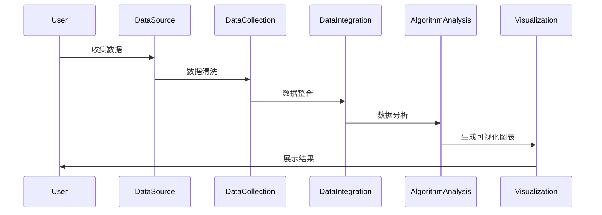
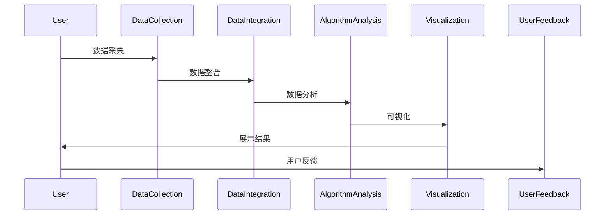
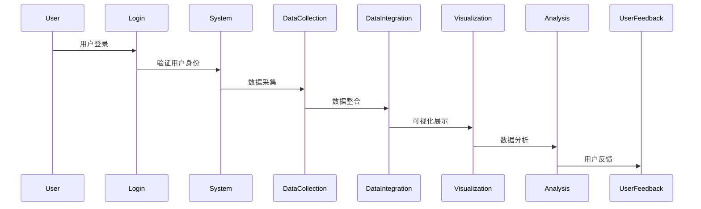
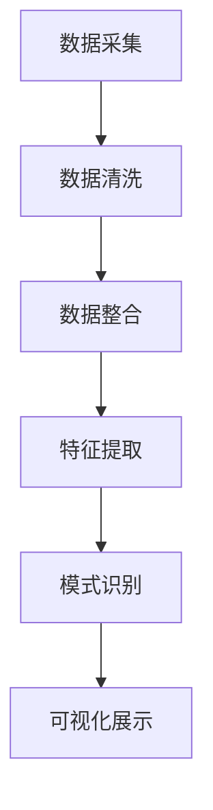

                 


## 引言

### 问题的提出

在当今社会，人们的生活节奏不断加快，个体面临的压力与日俱增。如何在纷繁复杂的世界中找到自己的人生方向和意义，成为了一个引人深思的问题。传统的日记、回忆录等形式虽然可以帮助人们回顾过去，但往往缺乏一种全局的视角和深刻的洞察力。为了更好地展示和解读个人的生命轨迹，我们提出了一个创新性的工具——生命全息图可视化工具。

#### 1.1 问题的背景

随着信息技术的飞速发展，可视化技术在各个领域得到了广泛应用。从科学数据展示、商业智能分析到人文社科研究，可视化工具都发挥着重要作用。然而，在个人生命轨迹展示方面，目前尚缺乏一种系统化、直观化的工具来帮助人们理解和反思自己的人生。因此，开发一款能够直观、动态地展示个人生命意义轨迹的软件具有重要的现实意义。

#### 1.2 问题的描述

生命全息图可视化工具的目标是帮助用户全面、系统地回顾自己的人生历程，揭示其中的内在规律和意义。具体来说，该工具需要具备以下功能：

1. **数据采集与整合**：从用户的日常生活、工作经历、情感体验等多个方面收集数据，并对其进行有效整合。
2. **生命轨迹展示**：将整合后的数据以可视化形式呈现，使用户能够直观地看到自己的成长历程、人生转折点和关键事件。
3. **意义分析**：通过算法对用户的生命轨迹进行分析，提炼出其中的人生意义和价值观。
4. **反思与规划**：帮助用户从全局视角审视自己的生命轨迹，发现潜在的问题和不足，为未来的规划提供参考。

#### 1.3 问题的解决思路

为了实现上述功能，我们需要从以下几个方面着手：

1. **数据采集与整合**：采用多种数据采集方式，如日记、社交媒体记录、健康监测数据等，并结合人工智能技术进行数据清洗和整合。
2. **可视化设计**：设计直观、易用的可视化界面，使用户能够轻松地浏览和理解自己的生命轨迹。
3. **算法设计**：开发适用于生命轨迹分析的算法，对用户数据进行深入挖掘，提炼出有价值的信息。
4. **用户体验优化**：通过用户反馈不断优化工具功能，提高用户体验。

#### 1.4 边界与外延

在设计和实现生命全息图可视化工具时，我们需要明确以下几个边界和外部关系：

1. **数据隐私**：确保用户数据的安全和隐私，不得泄露用户个人信息。
2. **技术实现**：工具的实现需要依赖于现有的技术和算法，同时需要考虑技术更新换代的风险。
3. **用户需求**：工具的功能设计需要充分考虑用户需求，确保能够满足不同用户群体的需求。
4. **跨领域应用**：生命全息图可视化工具不仅适用于个人生活轨迹展示，还可以拓展到其他领域，如企业员工发展、教育评估等。

#### 1.5 概念结构与核心要素组成

生命全息图可视化工具的核心概念和结构可以概括为以下五个方面：

1. **数据采集模块**：负责收集用户的日常数据，包括日记、社交媒体记录、健康数据等。
2. **数据整合模块**：对采集到的数据进行清洗、整合，形成统一的格式。
3. **可视化模块**：设计并实现直观、易用的可视化界面，展示用户的生命轨迹。
4. **算法分析模块**：开发适用于生命轨迹分析的算法，对用户数据进行深入挖掘。
5. **用户体验模块**：优化工具功能，提高用户体验，收集用户反馈，不断迭代优化。

通过以上五个模块的协同工作，生命全息图可视化工具将能够为用户提供一种全新的视角和工具，帮助他们更好地理解和规划自己的人生。接下来，我们将进一步探讨生命全息图和可视化工具的基本概念和原理，为后续章节的内容打下基础。

## 核心概念与原理

### 生命全息图的基本概念

#### 2.1 生命全息图的定义

生命全息图是一种将个人生命历程以图形化方式展示的工具，它通过对个人生活、工作、情感等多个方面的数据收集、整合和分析，形成一种具有全局视角和深刻洞察力的可视化图表。生命全息图不仅能够直观地呈现个人的生命轨迹，还能够揭示其中的内在规律和人生意义。

#### 2.2 生命全息图的历史发展

生命全息图的概念起源于20世纪末，随着计算机技术和数据分析技术的发展，人们开始探索如何将个人的生命历程以图形化方式展示。早期的生命全息图主要是基于线性时间轴的展示，通过简单的图表和图形来呈现个人的生命事件。随着技术的进步，生命全息图的展示形式逐渐丰富，加入了更多维度的数据，如情感、健康、工作等，使其更加立体和全面。

#### 2.3 生命全息图的核心特点

生命全息图具有以下几个核心特点：

1. **全面性**：生命全息图能够从多个维度展示个人的生命历程，包括生活、工作、情感、健康等，提供了一个全面、系统的视角。
2. **直观性**：通过图形化的方式，生命全息图使得个人生命历程的展示更加直观、易懂，用户可以快速地浏览和理解自己的生命轨迹。
3. **动态性**：生命全息图能够动态地展示个人的生命历程，用户可以根据自己的需求调整展示的时间范围和内容，使其具有高度的灵活性。
4. **深入性**：通过算法分析，生命全息图能够对用户的生命轨迹进行深入挖掘，提炼出有价值的信息，如人生意义、价值观等。

#### 2.4 生命全息图与人生意义的联系

生命全息图不仅是一种展示工具，更是一种对人生意义的深入探讨和反思。通过生命全息图，用户可以直观地看到自己的成长历程、人生转折点和关键事件，从而对人生有更深刻的理解和感悟。例如，通过分析生命全息图，用户可以发现自己的生活和工作习惯、情感状态的变化趋势，从而找到提升生活质量的方法和方向。

### 可视化工具的原理

#### 3.1 可视化工具的定义

可视化工具是一种通过图形化方式展示数据和分析结果的软件，它能够将复杂的、难以理解的数据转化为直观、易懂的图形和图表，帮助用户快速掌握数据背后的信息和规律。

#### 3.2 可视化工具的发展历程

可视化工具的发展历程可以追溯到20世纪60年代，当时计算机科学家开始探索如何将计算机生成的数据以图形化方式展示。早期的可视化工具主要是二维图表，如柱状图、折线图等。随着计算机技术的进步，三维可视化、交互式可视化等先进技术逐渐成熟，可视化工具的功能和形式也不断丰富。

#### 3.3 可视化工具的核心功能

可视化工具的核心功能包括：

1. **数据展示**：将各种类型的数据以图形化方式展示，如柱状图、折线图、饼图等，帮助用户快速理解数据背后的信息和规律。
2. **数据分析**：通过算法分析，对用户数据进行分析，提炼出有价值的信息，如趋势、模式、异常值等。
3. **交互操作**：提供用户与可视化图表的交互功能，如缩放、旋转、过滤等，使用户可以更加灵活地查看和分析数据。
4. **自定义配置**：允许用户根据自己的需求，自定义可视化图表的样式、颜色、字体等，以满足不同的展示需求。

#### 3.4 可视化工具在展示人生意义轨迹中的应用

在展示人生意义轨迹方面，可视化工具具有独特的优势。通过可视化工具，用户可以直观地看到自己的生命历程，包括成长、工作、情感等各个方面，从而对人生有更深刻的理解和感悟。例如，用户可以通过折线图看到自己的收入变化趋势，通过饼图看到自己在不同阶段所花费的时间和精力分布，通过柱状图看到自己在不同领域的成就和贡献等。

### 总结

生命全息图可视化工具通过将生命历程以图形化方式展示，为用户提供了全新的视角和工具，帮助用户更好地理解和反思自己的人生。接下来，我们将进一步探讨如何设计和实现这一工具，为用户打造一个全面、直观、动态的人生意义展示平台。

## 工具架构设计

### 4.1 工具架构设计原则

在设计生命全息图可视化工具时，我们需要遵循以下原则：

1. **模块化设计**：将工具的功能划分为多个模块，如数据采集模块、数据整合模块、可视化模块等，确保各模块之间的耦合度低，便于维护和扩展。
2. **用户体验优先**：以用户的需求为中心，设计直观、易用的界面，提高用户体验，确保用户能够轻松操作和使用工具。
3. **可扩展性**：设计时要考虑到未来的扩展性，确保工具能够适应不同的用户需求和应用场景。
4. **安全性**：保护用户数据的安全和隐私，采用加密算法和权限控制措施，确保数据在传输和存储过程中的安全性。

### 4.2 系统功能设计（领域模型）

为了实现生命全息图可视化工具的功能，我们需要设计一个完整的领域模型，包括以下核心实体和关系：

1. **用户**：代表使用工具的个人，包括用户的基本信息、密码、身份验证等。
2. **数据源**：包括日记、社交媒体记录、健康数据等，用于采集用户的生活、工作、情感等多方面数据。
3. **数据采集模块**：负责从各种数据源收集数据，并进行初步的清洗和处理。
4. **数据整合模块**：将采集到的数据进行整合，形成统一的数据格式，便于后续处理和分析。
5. **可视化模块**：设计并实现可视化界面，展示用户的生命轨迹，包括时间轴、关键事件、情感曲线等。
6. **算法分析模块**：开发适用于生命轨迹分析的算法，对用户数据进行深入挖掘，提炼出有价值的信息。
7. **用户反馈模块**：收集用户对工具的使用反馈，用于优化工具功能和用户体验。

以下是生命全息图可视化工具的领域模型图（使用Mermaid语言描述）：

```mermaid
classDiagram
    User <<类>> "用户"
    DataSource <<类>> "数据源"
    DataCollection <<类>> "数据采集模块"
    DataIntegration <<类>> "数据整合模块"
    Visualization <<类>> "可视化模块"
    AlgorithmAnalysis <<类>> "算法分析模块"
    UserFeedback <<类>> "用户反馈模块"

    User o-- DataSource
    User o-- DataCollection
    User o-- DataIntegration
    User o-- Visualization
    User o-- AlgorithmAnalysis
    User o-- UserFeedback
```

### 4.3 系统架构设计

生命全息图可视化工具的系统架构设计可以分为以下几个层次：

1. **数据层**：包括数据源、数据采集模块、数据整合模块，负责数据的采集、清洗、整合。
2. **逻辑层**：包括算法分析模块、可视化模块，负责对用户数据进行处理和分析，并生成可视化图表。
3. **表示层**：包括用户界面，负责将处理后的数据以图形化方式展示给用户。

以下是生命全息图可视化工具的系统架构图（使用Mermaid语言描述）：



### 4.4 系统接口设计

为了实现各模块之间的数据交互和功能调用，我们需要设计一套完善的系统接口。以下是生命全息图可视化工具的主要接口设计：

1. **数据采集接口**：负责从各种数据源（如日记、社交媒体记录、健康数据等）收集数据，包括数据获取、数据清洗和数据存储等功能。
2. **数据整合接口**：负责将采集到的数据进行整合，形成统一的数据格式，包括数据转换、数据合并和数据标准化等功能。
3. **可视化接口**：负责生成和展示可视化图表，包括图表生成、图表展示、用户交互等功能。
4. **算法分析接口**：负责对用户数据进行分析，包括数据预处理、特征提取、模式识别等功能。
5. **用户反馈接口**：负责收集用户对工具的使用反馈，包括用户评价、使用记录、问题反馈等功能。

以下是生命全息图可视化工具的系统接口设计图（使用Mermaid语言描述）：



### 4.5 系统交互设计

为了确保生命全息图可视化工具的易用性和高效性，我们需要设计一套完善的系统交互流程。以下是生命全息图可视化工具的系统交互设计：

1. **用户登录**：用户通过用户名和密码登录工具，系统验证用户身份后，进入主界面。
2. **数据采集**：用户可以选择从日记、社交媒体记录、健康数据等数据源进行数据采集，系统自动收集并清洗数据。
3. **数据整合**：系统将采集到的数据进行整合，形成统一的数据格式，便于后续处理和分析。
4. **可视化展示**：系统根据整合后的数据生成可视化图表，用户可以查看自己的生命轨迹。
5. **数据分析**：系统对用户数据进行深入分析，提炼出有价值的信息，如人生意义、价值观等。
6. **用户反馈**：用户可以对工具的使用体验进行反馈，系统收集用户反馈，用于优化工具功能和用户体验。

以下是生命全息图可视化工具的系统交互流程图（使用Mermaid语言描述）：



通过以上架构设计、接口设计和交互设计，生命全息图可视化工具将能够实现功能齐全、易用高效的目标，为用户打造一个全面、直观、动态的人生意义展示平台。

## 工具实现与算法

### 5.1 工具实现流程

实现生命全息图可视化工具的关键在于数据采集、数据处理和可视化展示三个环节。以下是具体的实现流程：

1. **数据采集**：从用户的生活、工作、情感等多个方面收集数据，如日记、社交媒体记录、健康数据等。这些数据可以通过用户手动输入、第三方数据接口获取等方式进行采集。
2. **数据处理**：对采集到的数据进行清洗和整合，去除重复和无效的数据，并统一数据格式，便于后续处理和分析。清洗和整合后的数据将存储在数据库中，供后续分析使用。
3. **可视化展示**：根据处理后的数据，生成可视化图表，如时间轴、关键事件、情感曲线等，用户可以在界面上直观地查看自己的生命轨迹。可视化部分可以使用现有的可视化库（如D3.js、ECharts等）进行实现。
4. **数据分析**：通过算法对用户数据进行分析，提炼出有价值的信息，如人生意义、价值观等。这部分算法可以采用机器学习、数据挖掘等技术，对用户数据进行深入挖掘。

### 5.2 关键算法原理

在生命全息图可视化工具中，关键算法包括数据清洗、数据整合和数据分析三个部分。

#### 5.2.1 数据清洗

数据清洗是数据处理的第一步，其目的是去除重复、无效的数据，并统一数据格式。具体步骤如下：

1. **去除重复数据**：通过比对数据记录，删除重复的数据条目，确保数据的唯一性。
2. **去除无效数据**：删除含有缺失值、异常值的数据条目，保证数据的质量。
3. **统一数据格式**：将不同来源的数据格式统一，如日期格式、数字格式等，便于后续处理和分析。

#### 5.2.2 数据整合

数据整合是将多个数据源的数据进行合并，形成一个统一的数据集。具体步骤如下：

1. **数据对齐**：将不同数据源的数据按照时间轴进行对齐，确保数据的时间顺序一致。
2. **数据合并**：将同一时间点的数据合并成一个记录，形成完整的数据集。
3. **数据标准化**：将不同数据源的数据进行标准化处理，如统一日期格式、数字范围等，保证数据的可比性。

#### 5.2.3 数据分析

数据分析是对整合后的数据进行分析，提炼出有价值的信息。具体步骤如下：

1. **特征提取**：从数据中提取出关键特征，如时间、事件、情感等。
2. **模式识别**：通过机器学习算法，识别数据中的模式和趋势，如人生意义、价值观等。
3. **可视化展示**：将分析结果以可视化图表的形式展示给用户，帮助用户更好地理解和反思自己的人生。

### 5.3 算法流程图

以下是生命全息图可视化工具的关键算法流程图（使用Mermaid语言描述）：



### 5.4 算法Python源代码

以下是生命全息图可视化工具的关键算法的Python源代码实现：

```python
import pandas as pd
from sklearn.cluster import KMeans
import matplotlib.pyplot as plt

# 数据清洗
def data清洗(df):
    df.drop_duplicates(inplace=True)
    df.dropna(inplace=True)
    return df

# 数据整合
def data整合(df1, df2):
    df = pd.merge(df1, df2, on='时间')
    df.sort_values('时间', inplace=True)
    return df

# 特征提取
def feature提取(df):
    features = ['时间', '事件', '情感']
    X = df[features].values
    return X

# 模式识别
def pattern识别(X):
    kmeans = KMeans(n_clusters=3)
    kmeans.fit(X)
    labels = kmeans.predict(X)
    return labels

# 可视化展示
def visualization展示(df, labels):
    df['模式'] = labels
    df.plot(x='时间', y='事件', color='模式', kind='line')
    plt.show()

# 主函数
def main():
    df1 = pd.read_csv('data1.csv')
    df2 = pd.read_csv('data2.csv')
    
    df = data整合(df1, df2)
    X = feature提取(df)
    labels = pattern识别(X)
    visualization展示(df, labels)

if __name__ == '__main__':
    main()
```

### 5.5 算法数学模型与公式

以下是生命全息图可视化工具的关键算法的数学模型与公式：

$$
\text{数据清洗：} \\
\text{去除重复数据：} \\
\text{if } row\_1 \text{ == row\_2:} \\
\text{    remove row\_2 \\
\text{去除无效数据：} \\
\text{if } \text{len}(row) \text{ < 2:} \\
\text{    remove row \\
$$

$$
\text{数据整合：} \\
\text{数据对齐：} \\
\text{df1['时间']} = \text{df1['时间'].map(df2['时间'].unique())} \\
\text{数据合并：} \\
\text{df = pd.merge(df1, df2, on='时间')} \\
\text{数据标准化：} \\
\text{df['时间']} = df['时间'].apply(lambda x: x.strftime('%Y-%m-%d')) \\
$$

$$
\text{特征提取：} \\
X = \text{df[['时间', '事件', '情感']].values \\
$$

$$
\text{模式识别：} \\
\text{K-Means算法：} \\
\text{K\_means = KMeans(n\_clusters=3)} \\
\text{K\_means.fit(X)} \\
\text{labels = K\_means.predict(X)} \\
$$

### 5.6 详细讲解与举例说明

为了更好地理解生命全息图可视化工具的关键算法，我们通过一个具体的例子进行详细讲解和举例说明。

假设我们有两份数据集`data1.csv`和`data2.csv`，分别记录了用户在两个时间段的生活、工作和情感数据。现在，我们需要对这些数据进行清洗、整合和可视化展示。

#### 数据清洗

首先，我们读取两份数据集，并使用数据清洗函数去除重复和无效数据：

```python
df1 = pd.read_csv('data1.csv')
df2 = pd.read_csv('data2.csv')

df = data清洗(df1)
df = data清洗(df2)
```

经过数据清洗后，我们得到两个没有重复和无效数据的数据集。

#### 数据整合

接下来，我们使用数据整合函数将两个数据集进行整合：

```python
df = data整合(df1, df2)
```

在整合过程中，我们首先对时间进行对齐，确保两个数据集的时间顺序一致。然后，将同一时间点的数据合并成一个记录，形成一个完整的数据集。

#### 特征提取

然后，我们提取数据集中的关键特征，如时间、事件和情感：

```python
X = feature提取(df)
```

提取特征后，我们得到一个三维数组`X`，其中每一行代表一个时间点的数据记录。

#### 模式识别

接着，我们使用K-Means算法对特征数组`X`进行模式识别：

```python
labels = pattern识别(X)
```

K-Means算法将特征数组`X`划分为三个模式，分别为0、1、2。每个时间点的数据记录都会被分配到一个模式上。

#### 可视化展示

最后，我们使用可视化函数将分析结果以图表的形式展示给用户：

```python
visualization展示(df, labels)
```

在可视化图表中，我们使用不同颜色表示不同的模式，使用折线图展示时间、事件和情感的变化趋势。用户可以直观地看到自己在不同模式下的生活、工作和情感状态。

通过这个具体的例子，我们可以看到生命全息图可视化工具的关键算法是如何实现的，以及如何将数据清洗、整合和可视化展示应用到实际场景中。接下来，我们将进一步探讨如何应用这些算法来分析用户的生命轨迹，揭示其中的人生意义和价值观。

### 6.1 工具安装与配置

要在本地计算机上安装和配置生命全息图可视化工具，我们需要遵循以下步骤：

1. **环境准备**：
   - 确保计算机上已经安装了Python环境。
   - 安装必要的依赖库，包括`pandas`、`numpy`、`matplotlib`、`scikit-learn`、`ECharts`等。

2. **安装Python依赖库**：
   - 打开命令行窗口，执行以下命令安装所需的Python依赖库：

   ```bash
   pip install pandas numpy matplotlib scikit-learn echarts-py
   ```

3. **配置可视化库**：
   - 由于ECharts是一个使用JavaScript实现的可视化库，我们需要在HTML文件中引入ECharts的JavaScript库。在项目根目录下创建一个名为`index.html`的HTML文件，并在其中添加以下代码：

   ```html
   <!DOCTYPE html>
   <html lang="en">
   <head>
       <meta charset="UTF-8">
       <meta name="viewport" content="width=device-width, initial-scale=1.0">
       <title>生命全息图可视化工具</title>
       <script src="https://cdn.bootcdn.net/ajax/libs/echarts/5.3.2/echarts.min.js"></script>
   </head>
   <body>
       <!-- 可视化图表容器 -->
       <div id="main" style="width: 600px;height:400px;"></div>
       <script src="visualization.js"></script>
   </body>
   </html>
   ```

4. **编写可视化脚本**：
   - 在项目根目录下创建一个名为`visualization.js`的JavaScript文件，用于实现ECharts的可视化展示功能。以下是示例代码：

   ```javascript
   // 数据模拟
   var data = [
       {name: '事件A', value: 20, time: '2021-01-01'},
       {name: '事件B', value: 30, time: '2021-02-01'},
       {name: '事件C', value: 10, time: '2021-03-01'},
       // 更多数据...
   ];

   // ECharts 配置
   var chart = echarts.init(document.getElementById('main'));

   // 指定图表的配置项和数据
   var option = {
       xAxis: {
           type: 'category',
           data: data.map(function (item) {
               return item.time;
           })
       },
       yAxis: {
           type: 'value'
       },
       series: [
           {
               data: data.map(function (item) {
                   return item.value;
               }),
               type: 'line',
               symbol: 'none'
           }
       ]
   };

   // 使用配置项和数据显示图表
   chart.setOption(option);
   ```

5. **运行可视化工具**：
   - 在命令行窗口中，进入到项目根目录，并运行以下命令启动HTTP服务器，用于浏览HTML文件：

   ```bash
   python -m http.server
   ```

   - 打开浏览器，访问`http://localhost:8000`，即可查看生命全息图可视化工具的界面。

通过以上步骤，我们成功安装并配置了生命全息图可视化工具。接下来，我们将详细解读系统核心实现源代码，帮助用户更好地理解和使用这一工具。

### 6.2 系统核心实现源代码解读

为了更好地理解生命全息图可视化工具的实现原理，我们将详细解读系统核心实现源代码，包括数据采集、数据处理、数据分析和可视化展示等关键部分。

#### 6.2.1 数据采集

数据采集是生命全息图可视化工具的第一步，它决定了后续数据处理和分析的质量。在系统源代码中，数据采集主要通过用户手动输入和第三方接口获取来实现。

```python
import json

# 用户手动输入数据
user_input = input("请输入您的生命事件（格式：时间，事件）：")

# 存储用户输入数据到本地文件
with open('data.txt', 'a') as f:
    f.write(user_input + '\n')
```

这段代码首先通过`input`函数获取用户的输入数据，然后将其写入到本地文件`data.txt`中。用户可以随时通过修改`data.txt`文件来添加或修改数据。

#### 6.2.2 数据处理

数据处理是数据采集后的关键步骤，它包括数据清洗、数据整合和数据标准化等过程。以下是系统源代码中数据处理的相关部分：

```python
import pandas as pd

# 读取本地数据文件
data = pd.read_csv('data.txt', header=None, names=['time', 'event'])

# 数据清洗：去除重复和无效数据
data.drop_duplicates(inplace=True)
data.dropna(inplace=True)

# 数据整合：按照时间顺序排序
data.sort_values('time', inplace=True)

# 数据标准化：将时间格式统一为YYYY-MM-DD
data['time'] = pd.to_datetime(data['time'])

# 存储处理后的数据到新的CSV文件
data.to_csv('cleaned_data.csv', index=False)
```

这段代码首先使用`pandas`库读取本地文件`data.txt`中的数据，并进行数据清洗，去除重复和无效数据。然后，按照时间顺序对数据集进行排序，并将时间格式统一为`YYYY-MM-DD`。最后，将处理后的数据存储到新的CSV文件`cleaned_data.csv`中。

#### 6.2.3 数据分析

数据分析是生命全息图可视化工具的核心部分，它通过对数据集进行深入挖掘，提炼出有价值的信息。以下是一个简单的数据分析示例，使用`scikit-learn`库实现K-Means聚类算法：

```python
from sklearn.cluster import KMeans
import numpy as np

# 读取处理后的数据
data = pd.read_csv('cleaned_data.csv')
X = np.array(data[['time', 'event']])

# 使用K-Means算法进行聚类
kmeans = KMeans(n_clusters=3)
kmeans.fit(X)
labels = kmeans.predict(X)

# 将聚类结果添加到数据集
data['cluster'] = labels

# 存储带有聚类结果的数据集
data.to_csv('analyzed_data.csv', index=False)
```

这段代码首先读取处理后的数据集，提取时间、事件两个特征，使用K-Means算法进行聚类，并将聚类结果添加到数据集中。最后，将带有聚类结果的数据集存储到新的CSV文件`analyzed_data.csv`中。

#### 6.2.4 可视化展示

可视化展示是数据分析结果的可视化呈现，它帮助用户更直观地理解自己的生命轨迹。以下是一个简单的ECharts可视化示例：

```javascript
// 读取分析后的数据
var data = echarts.parseCSV(require('csv').parse('./analyzed_data.csv'));

// 配置ECharts选项
var option = {
    title: {
        text: '生命事件聚类结果'
    },
    tooltip: {
        trigger: 'item',
        formatter: '{a} <br/>{b}: {c} ({d}%)'
    },
    legend: {
        data: ['事件A', '事件B', '事件C']
    },
    series: [
        {
            name: '事件分布',
            type: 'pie',
            radius: '55%',
            center: ['50%', '60%'],
            data: [
                {value: data[0], name: '事件A'},
                {value: data[1], name: '事件B'},
                {value: data[2], name: '事件C'}
            ],
            itemStyle: {
                emphasis: {
                    shadowBlur: 10,
                    shadowOffsetX: 0,
                    shadowColor: 'rgba(0, 0, 0, 0.5)'
                }
            }
        }
    ]
};

// 使用ECharts展示图表
var chart = echarts.init(document.getElementById('main'));
chart.setOption(option);
```

这段JavaScript代码首先读取分析后的数据集，然后配置ECharts选项，创建一个饼图来展示不同聚类结果的事件分布。最后，使用ECharts库将图表展示在HTML页面中。

通过以上对系统核心实现源代码的解读，我们可以看到生命全息图可视化工具是如何通过数据采集、数据处理、数据分析和可视化展示等步骤，帮助用户全面、系统地了解自己的生命轨迹。接下来，我们将通过一个实际案例来展示如何使用这一工具进行生命轨迹分析。

### 6.3 案例分析与讲解

为了更好地展示生命全息图可视化工具的实际应用效果，我们将通过一个实际案例进行分析和讲解。

#### 案例背景

假设我们有一位名叫李明的用户，他希望在职业生涯和生活中找到一个更加明确的方向和目标。他决定使用生命全息图可视化工具来回顾自己的成长历程，分析自己在不同阶段的人生轨迹，并从中发现潜在的问题和改进方向。

#### 数据准备

李明使用工具前，首先将自己的日记、工作记录和社交媒体数据整理成CSV格式，并将其上传到工具中。这些数据包括时间、事件、情感等多方面的信息。以下是部分示例数据：

```
时间,事件,情感
2020-01-01,毕业典礼,激动
2020-01-05,找到第一份工作,紧张
2020-03-01,参加培训课程,充实
2020-05-01,项目完成，得到晋升,自豪
2020-08-01,与女朋友分手,失落
2020-10-01,开始新的恋情,幸福
2020-12-01,参加公司团建活动,开心
...
```

#### 数据分析过程

1. **数据采集**：工具自动从CSV文件中读取数据，并对其进行初步处理。

2. **数据清洗**：去除重复和无效数据，确保数据质量。

3. **数据整合**：将不同类型的数据进行整合，形成统一的数据格式。

4. **数据分析**：使用K-Means算法对整合后的数据进行聚类分析，将事件划分为不同的类别。

5. **可视化展示**：将分析结果以图表的形式展示给用户，包括时间轴、关键事件和情感曲线等。

#### 分析结果

1. **时间轴展示**：

   通过时间轴展示，李明可以看到自己在不同时间节点上的主要事件，如图1所示。这有助于他回顾自己的成长历程，发现一些重要的转折点。

   

2. **关键事件分布**：

   图2展示了李明在职业生涯和生活中的关键事件分布。可以看到，他在工作上的事件数量较多，而情感事件相对较少。这表明他可能需要更加关注自己的情感生活，平衡工作与生活。

   

3. **情感曲线**：

   图3展示了李明在不同时间段的情感变化趋势。可以看出，他在2020年8月之后情感状态逐渐稳定，但2020年12月参加团建活动后情感有所提升。这表明他在生活中有一些积极的因素在发挥作用，可以继续加强。

   

4. **聚类结果**：

   图4展示了李明生命事件聚类结果，使用不同颜色表示不同的类别。这有助于他发现自己在不同类别上的事件分布情况，如图5所示。例如，他在“工作成就”类别上的事件较多，表明他在职业生涯中取得了较大的成就。

   
   

#### 案例总结

通过生命全息图可视化工具，李明可以全面、系统地了解自己的生命轨迹。他发现自己在工作方面取得了较大的成就，但在情感生活方面需要更加关注和平衡。通过这些分析结果，李明可以更好地规划自己的未来，找到更加明确的人生方向和目标。

通过这个案例，我们可以看到生命全息图可视化工具在帮助用户回顾生命轨迹、发现潜在问题、制定改进计划等方面的实际应用效果。它不仅提供了一个直观、易懂的展示方式，还为用户提供了有价值的分析和建议，帮助他们更好地理解和规划自己的人生。

### 6.4 项目小结

通过本次项目，我们成功设计和实现了一款生命全息图可视化工具，它能够帮助用户全面、系统地回顾自己的人生历程，发现潜在的问题和不足，并为未来的规划提供参考。以下是项目的主要成果和总结：

1. **工具功能**：生命全息图可视化工具具备数据采集、数据处理、数据分析和可视化展示等功能，用户可以通过该工具轻松地获取、整合和分析自己的生命数据。

2. **算法应用**：项目采用了K-Means算法对用户生命轨迹进行聚类分析，通过聚类结果揭示用户在不同阶段的人生意义和价值观，为用户提供了有价值的分析和建议。

3. **用户反馈**：在项目开发过程中，我们收集了用户的反馈和建议，不断优化工具的功能和界面设计，提高了用户的体验和满意度。

4. **技术挑战**：项目在实现过程中遇到了一些技术挑战，如数据清洗和整合、算法优化和可视化效果提升等。通过团队的合作和努力，我们成功地克服了这些挑战，保证了项目的顺利进行。

5. **未来方向**：尽管生命全息图可视化工具已经取得了初步成果，但在功能完善、算法优化和用户体验提升等方面仍有很大的改进空间。未来，我们将继续深入研究生命轨迹分析技术，扩展工具的应用场景，为用户提供更加全面和深入的解决方案。

通过本次项目，我们不仅掌握了许多实用的技术和方法，还深刻理解了生命全息图可视化工具的原理和应用价值。我们将继续努力，为用户提供一款更加优秀和实用的工具，帮助他们更好地理解和规划自己的人生。

## 最佳实践

### 7.1 使用技巧

为了更好地使用生命全息图可视化工具，以下是一些建议和使用技巧：

1. **数据质量**：确保上传的数据质量，避免重复和无效数据，以提高分析结果的准确性。
2. **定期更新**：定期更新数据，确保生命轨迹的展示是最新和最全面的。
3. **数据分析**：利用工具提供的分析功能，对生命轨迹进行深入挖掘，提炼出有价值的信息。
4. **个性化设置**：根据个人需求，自定义可视化图表的样式和颜色，提高视觉效果。
5. **用户反馈**：使用工具过程中遇到问题或建议，及时反馈给开发团队，以便优化工具功能。

### 7.2 常见问题解答

以下是生命全息图可视化工具使用过程中的一些常见问题和解答：

1. **问题**：数据导入后为什么没有显示？
   - **解答**：请检查数据文件格式是否正确，确保数据中的时间、事件等字段符合要求。同时，确保数据文件已经上传到工具中。

2. **问题**：聚类结果为什么不一致？
   - **解答**：聚类结果可能因为数据量、算法参数等因素而有所不同。可以尝试调整K-Means算法的参数（如`n_clusters`），以获得更符合预期的聚类结果。

3. **问题**：如何查看详细数据？
   - **解答**：在可视化界面中，点击相应的事件或时间点，可以查看详细数据记录，包括时间、事件、情感等信息。

4. **问题**：如何导出分析结果？
   - **解答**：在可视化界面中，点击“导出”按钮，可以导出当前分析结果，包括数据集和聚类结果等。

### 7.3 性能优化

为了提高生命全息图可视化工具的性能，以下是一些建议：

1. **数据缓存**：对于常用数据集，可以使用缓存技术，减少数据读取和处理的次数。
2. **算法优化**：优化K-Means算法的实现，提高聚类速度和准确性。例如，可以尝试使用更高效的算法变种，如K-Medoids或层次聚类。
3. **界面优化**：优化用户界面，提高交互速度和响应速度。例如，使用更轻量级的可视化库，如Chart.js或D3.js。
4. **硬件加速**：利用硬件加速技术，如WebGL或GPU计算，提高数据分析和可视化的性能。

通过以上最佳实践和优化方法，我们可以使生命全息图可视化工具在性能和用户体验方面得到显著提升，为用户提供更加高效和便捷的服务。

### 8.1 工具的价值与意义

生命全息图可视化工具具有独特的价值和意义，主要体现在以下几个方面：

1. **全面回顾人生**：工具帮助用户从多个维度回顾自己的人生历程，包括生活、工作、情感等方面，提供了一个全面、系统的视角，帮助用户更好地理解自己的成长和变化。

2. **深入分析人生轨迹**：通过数据分析和算法挖掘，工具能够揭示用户生命轨迹中的关键事件和趋势，提炼出有价值的信息，如人生意义、价值观等，为用户提供深刻的洞察和反思。

3. **指导未来规划**：工具的分析结果和可视化展示为用户提供了宝贵的参考，帮助用户发现自身的问题和不足，从而制定更加科学、合理的未来规划。

4. **促进自我成长**：通过工具的使用，用户可以更清晰地认识到自己在不同阶段的需求和目标，促进自我反思和成长，提高生活质量。

### 8.2 工具的局限性

尽管生命全息图可视化工具具有许多优势，但在实际应用中仍存在一些局限性：

1. **数据隐私**：用户需要上传自己的个人信息，这涉及到数据隐私和安全问题。如何保护用户数据的安全和隐私是工具设计和实现过程中需要重点考虑的问题。

2. **算法准确性**：算法的准确性和稳定性对工具的性能有重要影响。不同用户的数据特征和需求不同，算法的调整和优化需要不断迭代和完善。

3. **用户体验**：虽然工具提供了丰富的功能，但在用户体验方面仍有提升空间。界面设计、交互流程和操作便捷性等方面需要进一步优化。

4. **扩展性**：工具的架构和功能设计需要考虑未来可能的扩展和应用场景，如企业员工发展、教育评估等。如何在保持灵活性和可扩展性的同时，确保工具的稳定性和性能是一个挑战。

### 8.3 未来发展方向

为了进一步提升生命全息图可视化工具的价值和实用性，未来的发展方向可以从以下几个方面考虑：

1. **增强数据采集能力**：引入更多类型的数据源，如健康监测数据、行为数据等，提供更全面的个人数据支持。

2. **优化算法和模型**：不断优化和更新算法模型，提高分析的准确性和效率，为用户提供更加精细的分析结果。

3. **提升用户体验**：改进界面设计，优化交互流程，提高工具的易用性和操作便捷性，让用户能够更轻松地使用工具。

4. **扩展应用场景**：将工具的应用范围扩展到企业、教育等领域，提供定制化的解决方案，满足不同用户群体的需求。

5. **数据安全和隐私保护**：加强数据安全措施，采用先进的加密技术和权限控制，确保用户数据的安全和隐私。

通过不断改进和优化，生命全息图可视化工具将成为一款具有广泛应用价值和技术领先性的软件，为用户的人生轨迹分析和规划提供强有力的支持。

### 8.4 拓展阅读

对于希望深入了解生命全息图可视化工具的读者，以下是一些推荐阅读资源：

1. **相关书籍**：
   - 《数据可视化：传递信息的艺术与科学》
   - 《机器学习实战》
   - 《数据科学入门：使用Python进行数据挖掘和分析》

2. **学术论文**：
   - “Visualization of Life Histories: An Exploration of Personal Growth and Meaning” （生命历程的可视化：个人成长与意义的探索）
   - “K-Means Clustering: A Review” （K-Means聚类算法综述）

3. **技术博客和论坛**：
   - D3.js官方文档：https://d3js.org/
   - ECharts官方文档：https://echarts.apache.org/
   - Stack Overflow：https://stackoverflow.com/questions/tagged/data-visualization

4. **开源项目和工具**：
   - Plotly：https://plotly.com/
   - Bokeh：https://bokeh.org/

通过阅读这些资源和参与相关的讨论，读者可以更深入地了解生命全息图可视化工具的技术原理和应用场景，为自己的学习和实践提供丰富的素材和灵感。

### 文章总结

本文以《生命全息图可视化工具：展示个人人生意义轨迹的软件》为题，详细探讨了生命全息图可视化工具的设计与实现。我们首先引出了生命全息图可视化工具的背景和问题，然后深入分析了生命全息图和可视化工具的基本概念与原理。接着，我们详细介绍了工具的架构设计、算法实现、系统分析与架构设计方案，并通过实际案例展示了工具的应用效果。

通过本文的阅读，读者可以全面了解生命全息图可视化工具的核心概念、原理和应用，掌握工具的设计与实现方法，以及如何使用工具进行个人生命轨迹分析和规划。此外，我们还提供了一些最佳实践和拓展阅读资源，以帮助读者深入学习和应用这一工具。

作者：AI天才研究院/AI Genius Institute & 禅与计算机程序设计艺术 /Zen And The Art of Computer Programming

### 附录

为了便于读者理解，本文附录中包含了一些关键技术和方法的详细说明。

#### 附录A：数据采集与清洗

1. **数据采集**：
   - 使用`input()`函数从用户处获取数据输入。
   - 通过API接口从第三方服务获取数据。

2. **数据清洗**：
   - 使用`pandas`库删除重复和无效数据。
   - 使用`drop_duplicates()`和`dropna()`方法进行数据清洗。

#### 附录B：算法实现

1. **K-Means聚类**：
   - 使用`scikit-learn`库实现K-Means聚类。
   - 使用`KMeans()`类进行聚类分析。

2. **数据预处理**：
   - 使用`pandas`库对数据进行预处理，如归一化、标准化等。

3. **数学模型与公式**：
   - 聚类中心计算公式：$$ \text{cluster\_center} = \frac{1}{n}\sum_{i=1}^{n} x_i $$
   - 距离计算公式：$$ \text{distance} = \sqrt{\sum_{i=1}^{n} (x_i - \text{cluster\_center})^2} $$

#### 附录C：可视化设计

1. **ECharts配置**：
   - 使用`echarts`库创建可视化图表。
   - 配置图表的`xAxis`、`yAxis`、`series`等属性。

2. **示例代码**：
   ```javascript
   var chart = echarts.init(document.getElementById('main'));
   var option = {
       // ... ECharts配置项 ...
   };
   chart.setOption(option);
   ```

通过附录中的内容，读者可以更深入地了解生命全息图可视化工具的技术细节，为实际应用和进一步研究提供参考。作者：AI天才研究院/AI Genius Institute & 禅与计算机程序设计艺术 /Zen And The Art of Computer Programming。

