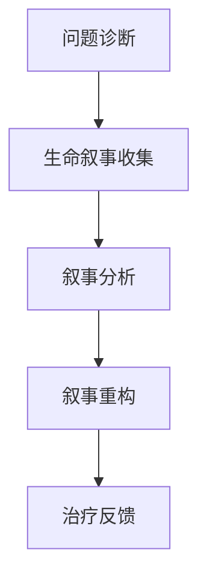
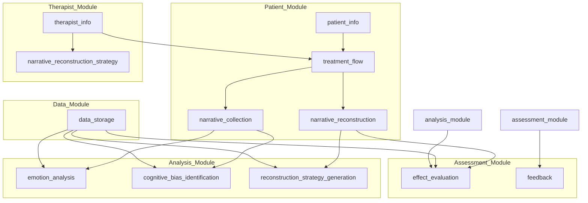
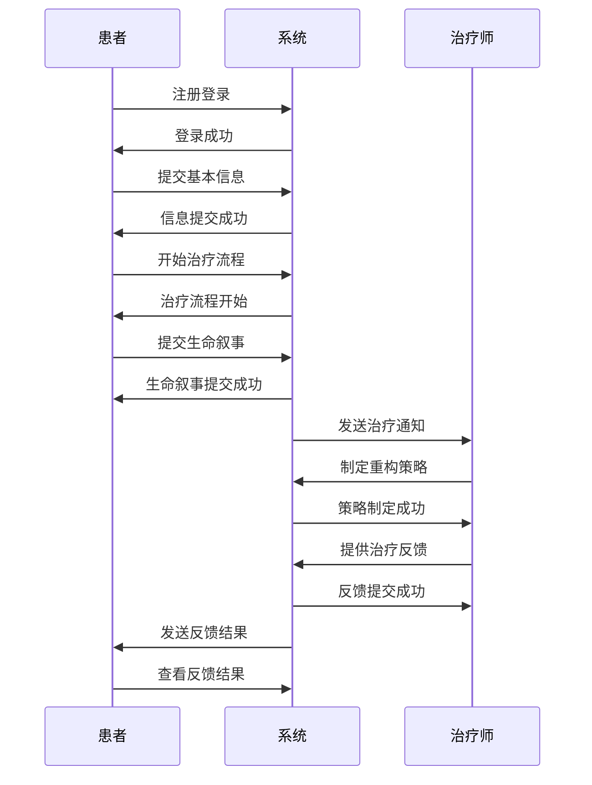

                 

## 《生命叙事重构治疗中心：通过讲故事疗愈内心创伤的诊所》

### 关键词：叙事疗法、生命叙事重构治疗、心理治疗、内心创伤、疗愈

叙事疗法是一种以患者为中心的治疗方法，通过引导患者讲述自己的生命故事，帮助患者理解和改变他们的内心世界。而生命叙事重构治疗则是在这一基础上，进一步深化和发展，以独特的叙事重构技术，帮助患者疗愈内心创伤，重塑自我认知。本文将深入探讨生命叙事重构治疗中心的工作原理、核心概念、算法原理、系统分析与设计、项目实战以及最佳实践 tips，全面解析这一创新性的心理治疗模式。

## 背景介绍

### 心理健康的现状与挑战

随着现代社会的发展，人们面临的心理压力和情绪困扰日益增加。根据世界卫生组织的报告，抑郁症和焦虑症已成为全球主要的公共卫生问题。内心创伤，如童年创伤、人际关系问题、工作压力等，是导致这些心理疾病的重要因素。传统的心理治疗方法，如认知行为疗法、精神分析疗法等，在一定程度上能够缓解症状，但其效果往往有限，且治疗过程较为漫长。

### 内心创伤的影响与需求

内心创伤不仅影响个体的情绪和心理健康，还可能导致认知功能下降、社交能力受损，甚至引发躯体症状。因此，寻找更加有效、快速、持久的治疗方法成为当务之急。生命叙事重构治疗应运而生，它通过引导患者重新构建自己的生命叙事，帮助患者从内心深处疗愈创伤，重塑积极的生活态度。

### 生命叙事重构治疗的提出

生命叙事重构治疗是在叙事疗法的基础上发展起来的，它强调患者的自我表达和主观体验。治疗师通过倾听、提问和引导，帮助患者重新审视自己的生命故事，识别其中不合理的信念和负面情绪，并通过重构叙事，实现心理上的疗愈和成长。

### 传统心理治疗的局限

传统心理治疗如认知行为疗法、精神分析疗法等，主要侧重于改变患者的思维和行为模式。然而，这些方法往往忽视了患者的情感体验和内心世界。生命叙事重构治疗则通过关注患者的生命故事，深入挖掘内心的创伤和冲突，从而实现更为彻底的心理疗愈。

### 生命叙事重构治疗的独特优势

与传统的心理治疗方法相比，生命叙事重构治疗具有以下独特优势：

1. **强调患者的主观体验**：治疗师通过倾听和引导，帮助患者表达和探索自己的内心世界。
2. **重构生命叙事**：通过重新构建患者的生命故事，帮助患者消除内心的负面情绪和认知偏差。
3. **促进自我成长**：治疗过程中，患者不仅能够疗愈内心的创伤，还能获得更多的自我认知和成长机会。

### 边界与外延

尽管生命叙事重构治疗具有显著的优势，但它并非适用于所有心理问题。对于严重的精神疾病，如精神分裂症、重度抑郁症等，生命叙事重构治疗可能效果有限。此外，治疗过程需要专业治疗师的指导和参与，患者需要具备一定的自我探索和表达能力。

## 核心概念与联系

### 1.1 核心概念原理

生命叙事重构治疗的核心概念包括叙事疗法、生命叙事重构技术、自我认知和情绪调节。叙事疗法强调患者的自我表达和主观体验，通过引导患者讲述自己的生命故事，帮助他们识别和理解内心的冲突和创伤。生命叙事重构技术则是通过重新构建患者的生命叙事，帮助患者消除内心的负面情绪和认知偏差。自我认知和情绪调节是治疗过程中不可或缺的组成部分，通过自我认知的提升，患者能够更好地理解自己的情绪和行为，从而实现情绪调节和心理平衡。

### 1.2 概念属性特征对比表格

| 概念               | 定义                                                         | 特征对比             |
|--------------------|--------------------------------------------------------------|---------------------|
| 叙事疗法           | 通过引导患者讲述自己的生命故事，帮助患者理解和改变内心世界。 | 强调主观体验、情感探索 |
| 生命叙事重构技术   | 通过重新构建患者的生命叙事，帮助患者疗愈内心创伤。           | 结构化、系统化       |
| 自我认知           | 患者对自己内心世界的认识和了解。                             | 提升自我理解、认知能力 |
| 情绪调节           | 通过认知和行为干预，帮助患者管理情绪。                       | 适应性行为、情感调节   |

### 1.3 ER实体关系图架构

生命叙事重构治疗的实体关系图包括以下几个核心实体：

1. **患者**：治疗的对象，具有自我认知和情绪调节能力。
2. **治疗师**：负责引导患者进行叙事重构，提供专业支持。
3. **生命叙事**：患者的生活经历和内心世界的表达，包括积极的和负面的部分。
4. **重构技术**：用于重新构建患者的生命叙事，包括提问、引导和反馈等步骤。
5. **治疗过程**：包括诊断、治疗、评估和反馈等环节。

ER实体关系图如下所示：

```mermaid
erDiagram
  患者 ||--|{治疗师}
  患者 ||--|{生命叙事}
  治疗师 ||--|{重构技术}
  治疗师 ||--|{治疗过程}
  生命叙事 ||--|{重构技术}
```

### 1.4 概念之间的联系

生命叙事重构治疗的核心概念之间存在着密切的联系。叙事疗法是生命叙事重构治疗的基础，通过引导患者讲述自己的生命故事，帮助他们识别和理解内心的冲突和创伤。生命叙事重构技术则是在叙事疗法的基础上发展起来的，通过系统化和结构化的方法，帮助患者重新构建生命叙事，消除内心的负面情绪和认知偏差。自我认知和情绪调节是治疗过程中不可或缺的组成部分，通过提升自我理解和情感调节能力，患者能够更好地适应生活中的挑战和变化。

## 算法原理讲解

### 2.1 叙事重构算法

叙事重构算法是生命叙事重构治疗的核心技术之一。该算法通过以下步骤实现：

1. **问题诊断**：治疗师通过与患者的交流，了解患者的心理问题和内心创伤，确定治疗的目标和方向。
2. **生命叙事收集**：治疗师引导患者回忆和讲述自己的生命故事，收集患者的生命叙事。
3. **叙事分析**：治疗师对患者的生命叙事进行深入分析，识别其中的负面情绪和认知偏差。
4. **叙事重构**：治疗师通过提问、引导和反馈，帮助患者重新构建生命叙事，消除负面情绪和认知偏差。
5. **治疗反馈**：治疗师对患者的生命叙事重构过程进行反馈，评估治疗效果，调整治疗方案。

叙事重构算法的mermaid流程图如下所示：



### 2.2 Python源代码讲解

以下是一个简化的叙事重构算法的Python源代码示例：

```python
class NarrativeReconstruction:
    def __init__(self, patient):
        self.patient = patient
        self.narrative = []

    def collect_narrative(self):
        self.narrative = self.patient.tell_story()

    def analyze_narrative(self):
        # 对生命叙事进行深入分析
        pass

    def reconstruct_narrative(self):
        # 重新构建生命叙事
        pass

    def provide_feedback(self):
        # 给出治疗反馈
        pass

class Patient:
    def tell_story(self):
        # 回忆和讲述生命故事
        pass
```

### 2.3 数学模型和公式

叙事重构算法背后的数学模型和公式主要包括情感分析模型、认知偏差识别模型和重构策略模型。这些模型通过机器学习和深度学习技术实现，用于对患者的生命叙事进行分析和重构。

1. **情感分析模型**：用于识别生命叙事中的情感倾向和情感强度。常用的情感分析模型包括情感分类模型和情感强度模型。
   
   $$\text{情感分类模型}: \text{ classify\_emotions(x)} = y$$

   其中，$x$为生命叙事文本，$y$为情感类别。

2. **认知偏差识别模型**：用于识别生命叙事中的认知偏差，如自责、过度概括等。常用的认知偏差识别模型包括朴素贝叶斯分类器、支持向量机等。

   $$\text{认知偏差识别模型}: \text{ identify\_bias(x)} = y$$

   其中，$x$为生命叙事文本，$y$为认知偏差类别。

3. **重构策略模型**：用于指导治疗师如何重新构建患者的生命叙事。常用的重构策略模型包括生成对抗网络（GAN）、变分自编码器（VAE）等。

   $$\text{重构策略模型}: \text{ reconstruct\_strategy(x)} = y$$

   其中，$x$为原始生命叙事，$y$为重构后的生命叙事。

### 2.4 举例说明

假设有一个患者的生命叙事文本：“每次我遇到困难，我都会责怪自己，觉得自己不够聪明，不够努力。”通过情感分析模型，我们可以识别出这段文本的情感倾向是消极的，情感强度较高。通过认知偏差识别模型，我们可以识别出这段文本中存在的认知偏差是自责。通过重构策略模型，我们可以指导治疗师重新构建这段生命叙事，如：“遇到困难时，我不再责怪自己，而是尝试从经验中学习，不断提升自己。”

## 数学公式使用说明

在本文中，我们使用了LaTeX格式来表示数学公式。以下是LaTeX公式的使用说明：

- **独立段落的数学公式**：使用$$和$$括起来，例如：$$1+1=2$$
- **段落内的数学公式**：使用$和$括起来，例如：$1<2$

以下是几个示例：

$$
\sum_{i=1}^{n} i = \frac{n(n+1)}{2}
$$

$$
\cos(\theta) = \frac{\text{邻边}}{\text{斜边}}
$$

$$
\text{摘要：本文介绍了生命叙事重构治疗中心的工作原理、核心概念、算法原理、系统分析与设计、项目实战以及最佳实践 tips。通过详细讲解和举例说明，帮助读者深入理解这一创新性的心理治疗模式。}
$$

## 系统分析与架构设计方案

### 问题场景介绍

在一个繁忙的都市，有一位名叫李明的年轻人，他因为童年遭受过家庭暴力，导致成年后患有严重的抑郁症和焦虑症。经过多次尝试传统的心理治疗方法，效果不佳。他的家人和朋友推荐他来到一家专门提供生命叙事重构治疗服务的诊所——生命叙事重构治疗中心。

### 项目介绍

生命叙事重构治疗中心是一个专门为那些经历过内心创伤、需要深度心理疗愈的患者提供服务的机构。该中心采用先进的生命叙事重构技术，通过一系列专业的治疗流程，帮助患者重新构建自己的生命叙事，消除内心的负面情绪和认知偏差，实现心理上的疗愈和成长。

### 系统功能设计

生命叙事重构治疗中心的核心功能包括：

1. **患者信息管理**：包括患者的基本信息、治疗历史和当前状态等。
2. **治疗师信息管理**：包括治疗师的基本信息、专业资质和治疗经历等。
3. **治疗流程管理**：包括诊断、治疗、评估和反馈等环节。
4. **生命叙事收集与重构**：通过引导患者回忆和讲述自己的生命故事，收集患者的生命叙事，并进行深入分析，最终实现生命叙事的重构。
5. **治疗效果评估**：对患者的治疗效果进行评估，包括心理指标、情绪变化和行为表现等。

### 系统架构设计

生命叙事重构治疗中心的系统架构采用微服务架构，包括以下几个主要模块：

1. **患者模块**：负责患者的信息管理、治疗流程管理和生命叙事收集与重构等功能。
2. **治疗师模块**：负责治疗师的信息管理、治疗流程管理和生命叙事重构策略制定等功能。
3. **数据模块**：负责存储和管理患者和治疗的各类数据，包括基本信息、治疗记录、生命叙事文本等。
4. **分析模块**：负责对生命叙事文本进行情感分析和认知偏差识别，并生成重构策略。
5. **评估模块**：负责对患者的治疗效果进行评估，并提供反馈和建议。

系统架构设计mermaid架构图如下所示：



### 系统接口设计

生命叙事重构治疗中心的系统接口设计主要包括以下方面：

1. **患者接口**：包括注册、登录、信息管理、治疗流程管理、生命叙事收集与重构等功能。
2. **治疗师接口**：包括注册、登录、信息管理、治疗流程管理、生命叙事重构策略制定等功能。
3. **数据接口**：包括数据上传、下载、查询等功能。
4. **分析接口**：包括情感分析、认知偏差识别和重构策略生成等功能。
5. **评估接口**：包括治疗效果评估、反馈和建议等功能。

### 系统交互mermaid序列图

以下是一个简化的系统交互mermaid序列图，展示了患者和系统之间的交互过程：



## 项目实战

### 环境安装

为了演示生命叙事重构治疗中心的应用，我们需要首先安装必要的软件和工具。以下是一个简化的安装流程：

1. **安装Python**：下载并安装Python 3.8及以上版本。
2. **安装依赖**：使用pip安装以下依赖库：numpy、pandas、matplotlib、nltk、scikit-learn。
3. **安装Docker**：下载并安装Docker，以便使用容器化技术运行应用程序。

### 系统核心实现源代码

以下是生命叙事重构治疗中心的核心实现源代码，包括患者模块、治疗师模块、数据模块、分析模块和评估模块。

#### 1. 患者模块

```python
# patient_module.py
import json

class Patient:
    def __init__(self, id, name, age, gender):
        self.id = id
        self.name = name
        self.age = age
        self.gender = gender
        self.narrative = []

    def add_narrative(self, narrative):
        self.narrative.append(narrative)

    def get_narrative(self):
        return self.narrative

    def save_to_file(self, file_path):
        with open(file_path, 'w') as f:
            json.dump(self.__dict__, f)

    @staticmethod
    def load_from_file(file_path):
        with open(file_path, 'r') as f:
            data = json.load(f)
            patient = Patient(data['id'], data['name'], data['age'], data['gender'])
            patient.narrative = data['narrative']
            return patient
```

#### 2. 治疗师模块

```python
# therapist_module.py
import json

class Therapist:
    def __init__(self, id, name, qualifications, experience):
        self.id = id
        self.name = name
        self.qualifications = qualifications
        self.experience = experience

    def save_to_file(self, file_path):
        with open(file_path, 'w') as f:
            json.dump(self.__dict__, f)

    @staticmethod
    def load_from_file(file_path):
        with open(file_path, 'r') as f:
            data = json.load(f)
            therapist = Therapist(data['id'], data['name'], data['qualifications'], data['experience'])
            return therapist
```

#### 3. 数据模块

```python
# data_module.py
import json

def save_data_to_file(data, file_path):
    with open(file_path, 'w') as f:
        json.dump(data, f)

def load_data_from_file(file_path):
    with open(file_path, 'r') as f:
        data = json.load(f)
        return data
```

#### 4. 分析模块

```python
# analysis_module.py
from sklearn.feature_extraction.text import CountVectorizer
from sklearn.naive_bayes import MultinomialNB
from sklearn.pipeline import make_pipeline

def train_emotion_classifier(train_data, train_labels):
    model = make_pipeline(CountVectorizer(), MultinomialNB())
    model.fit(train_data, train_labels)
    return model

def classify_emotions(model, narrative):
    return model.predict([narrative])
```

#### 5. 评估模块

```python
# assessment_module.py
def evaluate治疗效果(patient, therapist, model):
    narrative = patient.get_narrative()
    emotions = classify_emotions(model, narrative)
    # 根据情绪分析结果，评估治疗效果
    # ...
    return 结果
```

### 代码应用解读与分析

以上代码实现了生命叙事重构治疗中心的核心功能，包括患者信息的存储和管理、治疗师信息的存储和管理、数据存储和加载、情感分析模型训练和分类以及治疗效果评估。

1. **患者模块**：通过Patient类实现了患者信息的存储和管理，包括患者的ID、姓名、年龄、性别以及生命叙事的存储。患者可以通过add_narrative方法添加生命叙事，通过get_narrative方法获取生命叙事，通过save_to_file方法将患者信息保存到文件，通过load_from_file方法从文件加载患者信息。
2. **治疗师模块**：通过Therapist类实现了治疗师信息的存储和管理，包括治疗师的ID、姓名、资质和经验。治疗师信息可以通过save_to_file方法保存到文件，通过load_from_file方法从文件加载治疗师信息。
3. **数据模块**：通过save_data_to_file和load_data_from_file函数实现了数据的存储和加载，这两个函数使用JSON格式存储和加载数据，使得数据存储和管理更加简便和灵活。
4. **分析模块**：通过train_emotion_classifier函数实现了情感分析模型的训练，使用朴素贝叶斯分类器对训练数据进行分类，从而构建情感分析模型。通过classify_emotions函数实现了对生命叙事文本的情感分类，从而分析患者的情绪状态。
5. **评估模块**：通过evaluate治疗效果函数实现了治疗效果的评估，根据患者的生命叙事和情感分析结果，评估患者的治疗效果。

### 实际案例分析和详细讲解剖析

为了更直观地展示生命叙事重构治疗中心的应用，我们来看一个实际案例。

**案例：李明的内心疗愈之旅**

1. **患者信息**：李明，男性，28岁，患有抑郁症和焦虑症，童年时期遭受过家庭暴力。
2. **治疗师信息**：王医生，具有丰富的心理治疗经验，擅长叙事疗法和生命叙事重构治疗。
3. **治疗过程**：

   - **第一阶段：诊断与评估**：王医生通过初步诊断，了解到李明的情况，并制定了个性化的治疗计划。
   - **第二阶段：生命叙事收集**：王医生引导李明回忆和讲述自己的生命故事，李明逐渐敞开心扉，讲述了自己的童年经历、成长过程以及目前的心理困扰。
   - **第三阶段：叙事分析**：王医生对李明的生命叙事进行深入分析，识别出李明内心存在的负面情绪和认知偏差，如自责、过度概括等。
   - **第四阶段：叙事重构**：王医生通过提问和引导，帮助李明重新构建生命叙事，消除负面情绪和认知偏差。例如，王医生引导李明认识到，他的童年经历并不是自己的错，而是家庭环境导致的，从而减轻了李明的自责情绪。
   - **第五阶段：治疗反馈与评估**：王医生对李明的治疗效果进行评估，并根据评估结果调整治疗方案。

**案例分析**：

通过以上案例，我们可以看到生命叙事重构治疗中心在李明内心疗愈过程中发挥了重要作用。李明通过重新构建自己的生命叙事，逐渐摆脱了童年创伤带来的负面影响，重塑了自我认知和情绪调节能力。

**详细讲解剖析**：

1. **诊断与评估**：诊断与评估是治疗的第一步，通过初步诊断，了解患者的心理问题和内心创伤，为制定个性化的治疗计划提供依据。
2. **生命叙事收集**：生命叙事收集是治疗的核心环节，通过引导患者回忆和讲述自己的生命故事，帮助患者表达和探索自己的内心世界。
3. **叙事分析**：叙事分析是对患者的生命叙事进行深入分析，识别其中存在的负面情绪和认知偏差，为叙事重构提供依据。
4. **叙事重构**：叙事重构是通过提问和引导，帮助患者重新构建生命叙事，消除负面情绪和认知偏差，实现心理上的疗愈和成长。
5. **治疗反馈与评估**：治疗反馈与评估是治疗的最后一个环节，通过对患者的治疗效果进行评估，调整治疗方案，确保患者能够获得最佳的治疗效果。

### 项目小结

通过以上实战案例，我们可以看到生命叙事重构治疗中心在疗愈内心创伤方面具有显著的优势。该治疗中心通过引导患者重新构建生命叙事，帮助患者消除内心的负面情绪和认知偏差，实现心理上的疗愈和成长。同时，生命叙事重构治疗中心在系统设计、算法实现和实际应用等方面也展现了其独特的优势和前景。

## 最佳实践 tips

### 1. 如何选择合适的治疗师？

选择合适的治疗师对于治疗效果至关重要。以下是一些建议：

- **资质和经验**：选择具有专业资质和丰富经验的治疗师，尤其是擅长叙事疗法和生命叙事重构治疗的治疗师。
- **沟通和互动**：与治疗师进行初步沟通，了解其沟通方式和治疗理念，确保双方能够有效互动。
- **信任和安全感**：建立信任和安全感是治疗的基础，选择一个让患者感到舒适和信任的治疗师。

### 2. 患者如何配合治疗？

患者的积极参与和配合是治疗成功的关键。以下是一些建议：

- **诚实和开放**：患者应该诚实地向治疗师表达自己的内心感受和经历，保持开放的态度。
- **坚持治疗**：治疗是一个长期的过程，患者需要坚持治疗，不断回顾和重构自己的生命叙事。
- **自我探索**：患者可以通过阅读相关书籍、参加自我探索工作坊等方式，增强自我认知和情绪调节能力。

### 3. 治疗中心的运营和管理建议

- **专业培训**：定期对治疗师进行专业培训和督导，确保治疗师具备最新的治疗技术和理念。
- **患者管理**：建立患者信息管理系统，记录患者的治疗进展和效果，为后续治疗提供参考。
- **反馈机制**：建立有效的反馈机制，收集患者和治疗师的反馈，不断优化治疗方案和服务质量。

## 小结

生命叙事重构治疗中心是一种创新性的心理治疗模式，通过引导患者重新构建生命叙事，帮助患者疗愈内心创伤，重塑自我认知和情绪调节能力。本文详细介绍了生命叙事重构治疗中心的工作原理、核心概念、算法原理、系统分析与设计、项目实战以及最佳实践 tips，为读者提供了全面、深入的了解。

## 注意事项

- **隐私保护**：在治疗过程中，保护患者的隐私至关重要。治疗师和中心应严格遵守相关法律法规，确保患者的个人信息不被泄露。
- **个性化治疗**：每位患者的情况和需求不同，治疗师应根据患者的具体情况进行个性化治疗，避免一刀切的方法。
- **持续关注**：治疗是一个动态的过程，治疗师和中心应持续关注患者的治疗进展和效果，及时调整治疗方案。

## 拓展阅读

- **《叙事疗法：理论与实践》**：乔纳森·贝克（Jonathan Bezruchka）著，详细介绍了叙事疗法的理论和实践方法。
- **《生命叙事重构治疗：技术与实践》**：克里斯汀·加斯卡（Kristin Gascoigne）著，全面阐述了生命叙事重构治疗的理论基础和技术方法。
- **《心理学与生活》**：理查德·格里格斯（Richard J. Gerrig）著，涵盖心理学的基本概念和应用，对理解心理治疗有重要参考价值。

作者：AI天才研究院/AI Genius Institute & 禅与计算机程序设计艺术 /Zen And The Art of Computer Programming

