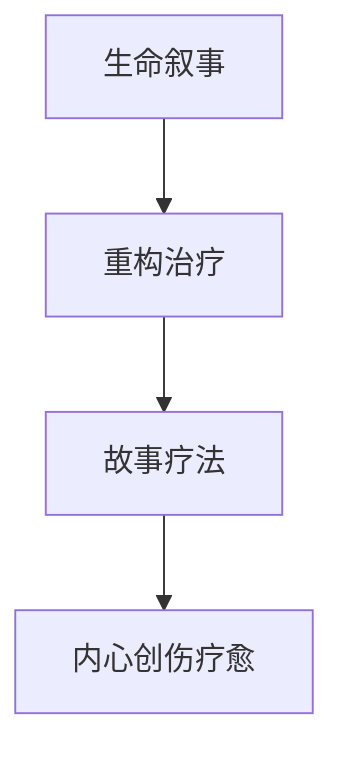

                 

### 第一部分: 引言与背景

#### 第1章: 引言

#### 1.1.1 问题背景

##### 1.1.1.1 心理创伤的普遍性

心理创伤是一个全球范围内普遍存在的问题。根据世界卫生组织（WHO）的统计，全球约有十分之一的人口在其一生中会经历某种形式的心理创伤。这些创伤可能导致严重的心理健康问题，包括焦虑、抑郁和创伤后应激障碍（PTSD）。心理健康问题的广泛影响不仅体现在个体层面，也对社会层面造成了巨大的负担。在职场、家庭和社会环境中，心理创伤可能导致生产力的下降、家庭冲突的增加以及社会安全感的缺失。

随着社会节奏的加快和竞争压力的增大，心理健康问题的发病率呈现出逐年上升的趋势。现代医学研究和心理学领域已经对心理创伤有了深入的认识，但传统的治疗方法如心理咨询、药物治疗和认知行为疗法等，在解决某些类型和心理创伤方面存在一定的局限性。

##### 1.1.1.2 心理健康问题的社会关注

随着公众对心理健康问题的认识不断加深，社会各界对心理创伤的重视程度也在不断提高。政府和医疗机构投入了大量资源用于研究和治疗心理创伤，旨在提高人们的心理健康水平和生活质量。近年来，心理创伤治疗领域涌现出许多新的方法和理论，其中生命叙事重构治疗（Life Narrative Reconstruction Therapy）成为备受关注的一种方法。

生命叙事重构治疗通过帮助个体重新构建其生命故事，使其能够理解和处理内心的创伤，从而达到心理康复的目的。这种方法强调个体的主体性和主动性，与传统的被动治疗模式形成鲜明对比。它的出现，为心理创伤治疗领域带来了新的希望和思路。

#### 1.1.2 问题描述

##### 1.1.2.1 心理创伤的定义与分类

心理创伤是指在个体经历极端压力或创伤性事件后，导致心理功能和适应能力受损的一种心理状态。常见的心理创伤包括但不限于以下类型：

- **急性创伤后应激障碍（Acute Stress Disorder，ASD）**：在创伤性事件发生后数天至数周内出现，症状类似于创伤后应激障碍（PTSD），但持续时间较短。
- **创伤后应激障碍（Post-Traumatic Stress Disorder，PTSD）**：在创伤性事件后数月或数年内出现，主要表现为反复出现的创伤性记忆、过度警觉和避免与创伤相关的事物。
- **复杂创伤后应激障碍（Complex Post-Traumatic Stress Disorder，C-PTSD）**：在经历了长期或反复的创伤性事件后出现，症状比PTSD更为复杂，可能包括情感麻木、身份混乱和社会功能受损。

此外，心理创伤还可以表现为焦虑症、抑郁症和其他精神障碍。每种类型的心理创伤都有其独特的临床表现和影响，需要个体化的治疗方法。

##### 1.1.2.2 传统治疗方法

传统的治疗方法主要包括以下几种：

- **心理咨询**：通过与专业心理咨询师进行对话，帮助个体探索和理解其心理创伤，从而缓解症状和促进康复。
- **药物治疗**：使用抗抑郁药、抗焦虑药等药物来调节个体的情绪和神经功能，缓解心理创伤带来的痛苦。
- **认知行为疗法（Cognitive Behavioral Therapy，CBT）**：通过改变个体的认知和行为模式，帮助其摆脱负面思维和行为，从而改善心理状态。

尽管这些传统治疗方法在一定程度上有效，但它们往往存在一定的局限性。例如，心理咨询和药物治疗需要较长时间的治疗过程，且效果因人而异；认知行为疗法虽然能够有效改善症状，但需要个体具备一定的认知能力和自我调节能力。

#### 1.1.3 问题解决

##### 1.1.3.1 传统治疗方法的局限

传统的心理创伤治疗方法在应对某些类型和严重程度的心理创伤时可能存在局限性。例如：

- **心理咨询**：心理咨询需要个体具备较强的表达能力和自我探索能力，对于某些心理创伤严重的患者，可能难以达到预期的治疗效果。
- **药物治疗**：长期服用药物可能导致药物依赖和副作用，对患者的生活质量产生负面影响。
- **认知行为疗法**：认知行为疗法虽然能够有效改善症状，但需要专业咨询师与患者之间建立良好的信任关系，这对治疗师的专业技能和经验提出了较高的要求。

##### 1.1.3.2 生命叙事重构治疗的潜力

生命叙事重构治疗提供了一种全新的心理创伤治疗方法，通过帮助个体重新构建其生命故事，使其能够理解和处理内心的创伤。这种方法具有以下优势：

- **个性化**：生命叙事重构治疗强调个体的主体性和独特性，能够针对每个患者的具体情况制定个性化的治疗方案。
- **综合治疗**：该方法结合了心理治疗、叙事治疗和认知行为疗法等多种治疗手段，能够更全面地帮助患者缓解心理创伤。
- **可持续性**：生命叙事重构治疗不仅仅关注症状的缓解，更注重患者的长期康复和心理健康维护。

#### 1.1.4 边界与外延

##### 1.1.4.1 心理创伤的范畴

心理创伤的范畴非常广泛，不仅包括战争、自然灾害、事故等极端事件，还包括家庭暴力、性侵犯、虐待等长期存在的心理创伤。此外，现代社会中常见的工作压力、人际关系冲突等也可能导致心理创伤。

##### 1.1.4.2 相关学科交叉

生命叙事重构治疗涉及到多个学科的交叉，包括心理学、社会学、文学和医学等。心理学提供了理论基础和方法，社会学和文学提供了叙事和故事的角度，医学则提供了诊断和治疗的技术支持。

#### 1.1.5 核心概念与联系

##### 1.1.5.1 生命叙事的概念

生命叙事是指个体在其一生中经历的事件、体验和感受，通过故事的形式来表达和传递。它不仅是个体理解自我和世界的一种方式，也是个体与他人沟通和交流的媒介。

##### 1.1.5.2 重构治疗的概念

重构治疗是指通过重新构建个体的心理经验，帮助其理解和处理心理创伤的一种治疗方法。它强调个体的主动参与和自我发现，旨在帮助个体建立积极的心理模式，从而促进心理康复。

##### 1.1.5.3 故事疗法

故事疗法是生命叙事重构治疗的一种重要方法，通过倾听、重构和表达故事，帮助个体探索内心的创伤和感受，从而实现心理疗愈。

##### 1.1.5.4 内心创伤疗愈

内心创伤疗愈是指通过心理治疗技术帮助个体处理和修复心理创伤，使其能够恢复心理功能和适应能力。生命叙事重构治疗为心理创伤疗愈提供了一种新的视角和方法。

##### 1.1.5.5 关系图（使用Mermaid）

##### 1.1.5.6 概念属性特征对比表（使用Markdown表格）

| 概念        | 定义                                                         | 关键特征                                                       |
|-------------|--------------------------------------------------------------|--------------------------------------------------------------|
| 生命叙事    | 个体生命过程中所经历的故事和经历，用以理解和表达自我。           | 时序性、个人性、文化性、情感性。                              |
| 重构治疗    | 通过重新构建个体的心理经验，帮助其理解和处理心理创伤。             | 重新理解、情感表达、认知重塑、行为改变。                      |
| 故事疗法    | 利用个体或集体故事来促进心理治疗和情感恢复。                     | 认知重塑、情感释放、行为改变、人际沟通。                      |
| 内心创伤疗愈 | 通过心理治疗技术帮助个体处理和修复心理创伤。                     | 安全环境、信任关系、情感表达、认知重构。                      |

#### 1.1.6 小结

本文旨在介绍生命叙事重构治疗这一新兴的心理创伤治疗方法，探讨其原理、优势和应用场景。通过深入理解生命叙事、重构治疗和故事疗法等核心概念，我们将对这一方法在心理创伤疗愈中的潜力有更清晰的认识。接下来，我们将进一步探讨生命叙事重构治疗的原理与优势，以及如何通过讲故事疗愈内心创伤。

---

## 第2章: 生命叙事重构治疗的原理与优势

### 2.1 原理

#### 2.1.1 心理创伤的叙事视角

叙事心理学是研究个体如何通过叙述来理解和表达自我心理状态的一个领域。在叙事心理学中，心理创伤被视为个体生命叙事的一部分，通过叙事的形式，个体可以揭示其内心的痛苦、困惑和希望。叙事视角的核心在于，它强调个体的主体性和叙事能力，认为每个人都是自己生活的叙述者，通过叙述，个体可以重建自我认知，从而应对心理创伤。

在心理创伤的叙事视角中，创伤经历不再仅仅是痛苦的记忆，而是一种可以被理解和重新解释的生命体验。叙事心理学家认为，心理创伤的治愈不仅仅在于消除痛苦，更在于找到一种新的叙事方式，使个体能够重新整合创伤经验，使其成为生命叙事中的一部分。

##### 2.1.1.1 叙事心理学的基本概念

- **叙事性自我**：个体通过叙述来构建自我认知和理解世界。叙事心理学认为，个体自我认知的核心是叙事性自我，即通过叙述来理解自己的经历和身份。
- **创伤叙事**：创伤经历通过叙事的方式被表达和解释。创伤叙事不仅仅是对过去的回顾，更是对未来的展望，它帮助个体重新构建其生活故事，从而应对创伤。

##### 2.1.1.2 心理创伤的叙事解读

心理创伤的叙事解读涉及以下几个方面：

- **故事性**：将创伤经历视为一个有开始、发展和结局的故事，使个体能够从整体上理解创伤，而不是单一、孤立的痛苦事件。
- **连贯性**：通过叙事，个体试图在创伤经历和其他生活经历之间建立连贯性，从而减少心理上的断裂感。
- **意义**：叙事解读旨在为创伤经历赋予意义，使个体能够从创伤中找到积极的教训和成长机会。

#### 2.1.2 重构治疗的步骤

重构治疗是一种以叙事为基础的心理治疗方法，其核心在于帮助个体重新构建其心理经验，从而理解和处理心理创伤。重构治疗通常包括以下几个步骤：

##### 2.1.2.1 初始评估

初始评估是重构治疗的开始，治疗师通过与患者的初步交流，了解患者的心理创伤经历、症状和需求，为其制定个性化的治疗计划。

- **目标确定**：治疗师与患者共同确定治疗目标，这些目标通常是具体和可测量的，如减少焦虑症状、提高生活满意度等。
- **建立信任关系**：治疗师需要与患者建立信任关系，这是治疗成功的关键。通过倾听和理解，治疗师能够帮助患者感到被尊重和被支持。

##### 2.1.2.2 叙事探索

叙事探索是重构治疗的核心步骤，治疗师通过引导患者叙述其创伤经历，帮助患者深入理解和处理其内心的痛苦和困惑。

- **叙述引导**：治疗师使用开放性问题引导患者叙述其创伤经历，帮助患者挖掘深层次的情感和记忆。
- **情感表达**：通过叙述，患者能够表达其内心的情感，这有助于减轻心理负担，提高情绪稳定性。

##### 2.1.2.3 情感加工

情感加工是指帮助患者理解和处理其叙述中的情感内容。在这一阶段，治疗师会引导患者探索其情感反应，并寻找方法来调节和表达这些情感。

- **情感识别**：帮助患者识别和理解其情感反应，如愤怒、恐惧、悲伤等。
- **情感调节**：通过认知行为技术和情感调节技巧，帮助患者学会如何有效地处理负面情绪。

##### 2.1.2.4 认知重构

认知重构是指通过改变患者的认知模式和思维习惯，帮助其建立积极的心理状态。在这一阶段，治疗师会帮助患者识别和挑战负面思维模式，并建立新的、积极的思维模式。

- **认知重构技巧**：包括认知行为疗法（CBT）中的思维重构技巧，如认知重构、认知解离等。
- **自我效能感的提升**：通过成功的认知重构，患者能够增强自我效能感，从而更好地应对生活中的挑战。

##### 2.1.2.5 行为调整

行为调整是指帮助患者通过改变行为模式来应对心理创伤。在这一阶段，治疗师会与患者共同制定行为调整计划，并监督其实施。

- **行为计划**：治疗师与患者共同制定具体的、可实现的行为目标，如参与社交活动、锻炼身体等。
- **行为监督**：治疗师会定期与患者沟通，监督行为调整的进展，并根据需要调整治疗计划。

##### 2.1.2.6 持续支持

持续支持是重构治疗的最后阶段，治疗师会为患者提供长期的心理支持和指导，帮助其巩固治疗效果，应对生活中的挑战。

- **跟踪评估**：定期跟踪患者的心理状态和行为表现，评估治疗效果。
- **长期支持**：为患者提供持续的心理支持，帮助其应对生活中的变化和挑战。

#### 2.1.3 优势

##### 2.2.1 增强情感表达与自我理解

重构治疗通过叙事探索和情感加工，帮助患者深入理解和表达其内心的情感，从而增强情感表达能力。这种情感表达不仅有助于减轻心理负担，还能促进患者的自我理解。通过重新构建生命叙事，患者能够更全面地认识自己，理解自己内心的痛苦和困惑，从而实现心理康复。

##### 2.2.2 促进认知重构与行为改变

重构治疗通过认知重构和行为调整，帮助患者改变负面思维模式和行为习惯，建立积极的心理状态和行为模式。认知重构技巧如认知重构、认知解离等，帮助患者识别和挑战负面思维，建立积极的思维模式。行为调整计划如参与社交活动、锻炼身体等，帮助患者培养健康的生活习惯，提高生活质量。

##### 2.2.3 建立安全的人际关系

重构治疗强调治疗师与患者之间的信任关系，这种关系为患者提供了一个安全的环境，使其能够自由地表达自己的情感和想法。通过建立安全的人际关系，患者能够更好地与他人沟通和交流，提高社交技能，从而建立稳定、健康的人际关系。

#### 2.1.4 生命叙事重构治疗的应用前景

生命叙事重构治疗作为一种新兴的心理治疗方法，具有广泛的应用前景。它不仅适用于传统心理治疗方法效果不佳的患者，还可以用于预防心理创伤的发生和发展。在未来的发展中，生命叙事重构治疗有望成为心理健康领域的重要组成部分，为更多的人提供有效的心理支持。

---

### 第3章: 通过讲故事疗愈内心创伤的方法

#### 3.1 故事疗法的核心要素

##### 3.1.1 故事的类型与功能

故事疗法中，故事不仅仅是一种叙述，它具有丰富的功能和类型，能够针对不同的心理创伤提供不同的疗愈作用。以下是几种常见的故事类型及其功能：

- **治愈故事**：这种故事通常讲述的是战胜困难的经历，通过展现主人公如何克服困难，激励患者看到希望和可能。
- **自传故事**：患者自己讲述的生平故事，有助于自我发现和自我理解，通过叙述，患者可以探索自己的心理创伤和内心世界。
- **集体故事**：包括神话、传说、民间故事等，这些故事通常传达了普遍的价值观和道德观念，帮助患者理解和融入社会。
- **隐喻故事**：通过寓言和比喻，隐喻故事能够传达复杂的心理概念，帮助患者理解和处理难以言说的情感和经历。

##### 3.1.2 故事疗法的步骤

故事疗法是一种通过讲故事来促进心理治疗和情感恢复的方法。以下是故事疗法的核心步骤：

- **故事倾听**：治疗师首先倾听患者的个人故事，理解患者的心理创伤和情感状态。倾听不仅是信息的收集，更是一种情感的支持和理解。
- **故事重构**：在倾听的基础上，治疗师与患者共同重构故事，通过重新组织故事情节和情感，帮助患者从新的角度理解自己的经历。
- **故事表达**：重构后的故事通过口头或书面形式表达出来，这种表达有助于患者释放内心的情感，建立新的心理模式。
- **故事反思**：患者在表达故事后进行反思，探讨故事中的意义和启示，从而促进认知重构和行为改变。

#### 3.2 实践案例

##### 3.2.1 案例介绍

- **背景**：患者小王是一名年轻的企业家，由于创业失败，他陷入了严重的抑郁和焦虑之中。
- **治疗目标**：通过故事疗法帮助小王重建自我认同，恢复自信，重新找到生活的方向。

##### 3.2.2 案例分析

- **故事倾听**：在治疗的初期，治疗师倾听小王关于创业失败的故事，了解他的困惑和痛苦。
- **故事重构**：治疗师引导小王重新讲述他的创业经历，寻找其中的积极因素，如他对产品的热情和坚持不懈的努力。
- **故事表达**：小王在治疗师的引导下，开始重新讲述自己的故事，并表达了他在创业过程中学到的宝贵经验和教训。
- **故事反思**：小王通过反思，认识到自己的创业失败并非一无是处，反而成为他未来成功的重要基石。

##### 3.2.3 治疗效果

- **情感变化**：随着故事的重新构建和表达，小王的抑郁和焦虑情绪逐渐减轻，情感状态得到改善。
- **认知重构**：小王开始从积极的角度看待自己的失败，认识到失败是成功的一部分，这种认知重构帮助他重新建立了自我认同。
- **行为改变**：小王在治疗结束后，决定重新开始创业，并且设定了明确的目标和计划，他的行动力也得到了显著提高。

##### 3.2.4 案例总结

- **治疗经验**：通过这个故事疗法，小王不仅缓解了心理创伤，还找到了新的生活方向和动力。这表明，故事疗法在心理创伤疗愈中具有显著的效果。
- **未来展望**：随着故事疗法在临床实践中的广泛应用，它有望为更多经历心理创伤的人提供有效的治疗途径。

---

### 第4章: 应用场景与注意事项

#### 4.1 应用场景

##### 4.1.1 心理咨询

在心理咨询中，生命叙事重构治疗作为一种辅助方法，可以帮助咨询师更好地理解患者的心理创伤和情感状态。具体应用场景包括：

- **创伤后应激障碍（PTSD）**：通过叙事探索和重构，帮助患者重新理解创伤经历，减少痛苦和恐惧。
- **抑郁症**：通过故事表达和反思，帮助患者识别和改变负面思维模式，提高生活满意度。
- **焦虑症**：通过情感加工和行为调整，帮助患者降低焦虑水平，建立积极的应对机制。

##### 4.1.2 教育与社区

在教育和社区环境中，生命叙事重构治疗可以通过以下方式应用：

- **学校心理辅导**：在学校心理辅导中，教师和辅导员可以使用故事疗法帮助学生应对学业压力和心理创伤。
- **社区心理服务**：社区心理服务可以组织故事疗法工作坊，为社区居民提供心理支持和情感疗愈。

#### 4.2 注意事项

##### 4.2.1 安全性保障

在进行生命叙事重构治疗时，安全性保障至关重要。具体注意事项包括：

- **保护隐私**：确保患者的隐私得到保护，不泄露患者的个人信息。
- **情感安全**：在治疗过程中，确保患者感到安全和被支持，避免引发过度的情感反应。
- **紧急情况处理**：治疗师需要具备处理紧急情况的能力，如患者出现强烈的情绪反应或自杀倾向。

##### 4.2.2 专业指导

- **专业培训**：治疗师需要接受专业的培训，掌握生命叙事重构治疗的理论和实践技巧。
- **伦理规范**：治疗师需要遵守伦理规范，确保治疗过程中的公平、尊重和诚实。

通过遵循这些注意事项，可以确保生命叙事重构治疗的安全性和有效性，为患者提供高质量的心理支持。

